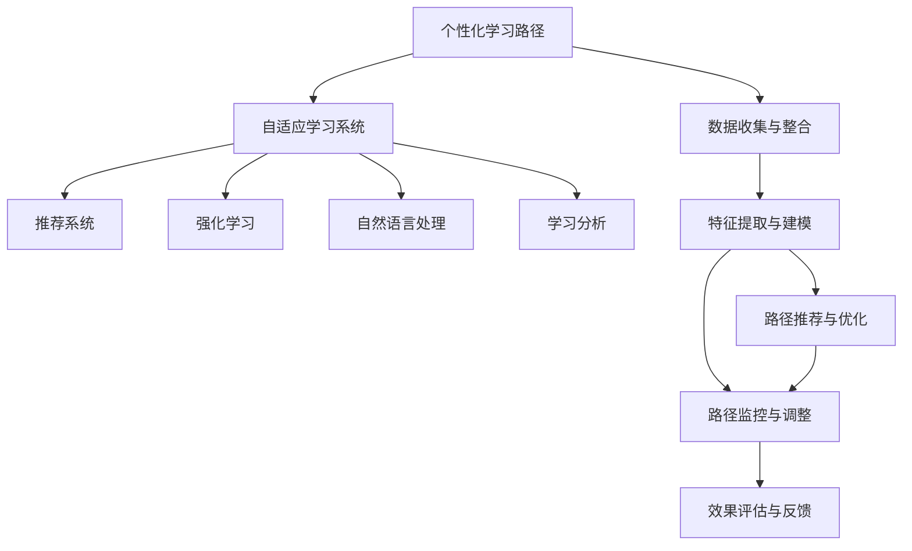

                 

# AI在个性化学习路径设计中的应用

> 关键词：
个性化学习路径, 自适应学习系统, AI算法, 推荐系统, 强化学习, 学习分析, 数据驱动教育

## 1. 背景介绍

### 1.1 问题由来
在当前快速发展的信息时代，个性化学习已成为教育的重要趋势。随着在线教育的普及和智能化技术的兴起，越来越多的教育机构开始关注个性化学习路径设计，期望通过数据驱动和AI辅助的方式，为每个学生量身定制学习计划，提升学习效率和效果。

然而，个性化学习路径的构建涉及大量的数据分析和模型优化，传统的人工设计和调参方法难以满足需求。与此同时，个性化学习也需要考虑学生的认知差异、学习动机、时间分配等多个维度，使得学习路径的设计变得更加复杂和挑战性。

为了解决这些难题，基于AI的个性化学习路径设计应运而生。通过利用机器学习和数据挖掘技术，AI算法可以高效分析学生行为数据，学习学生的学习模式和偏好，动态调整学习内容和进度，从而实现个性化的学习体验。

### 1.2 问题核心关键点
个性化学习路径设计涉及到多个关键问题，包括但不限于：

- 如何有效收集和整合学生数据？
- 如何通过AI算法准确预测学生的学习行为和效果？
- 如何设计高效的学习路径推荐算法，实现个性化推荐？
- 如何实时监控和调整学习路径，以应对学生动态变化的需求？
- 如何评估和优化学习路径的质量和效果，保证学习效率和效果？

这些问题的解答需要借助一系列AI技术，包括推荐系统、强化学习、自然语言处理、学习分析等。

## 2. 核心概念与联系

### 2.1 核心概念概述

为更好地理解基于AI的个性化学习路径设计，本节将介绍几个密切相关的核心概念：

- 个性化学习路径：根据学生的特点和学习目标，动态调整学习内容、进度和难度，以实现最优化的学习体验。
- 自适应学习系统：利用AI技术实时监测学生学习状态，动态调整学习内容和策略，实现个性化学习。
- AI算法：包括推荐系统、强化学习、自然语言处理、学习分析等，用于处理和分析学生数据，设计个性化学习路径。
- 推荐系统：根据用户历史行为和偏好，推荐个性化的内容或服务。
- 强化学习：通过奖励和惩罚机制，优化学习策略，提升学习效果。
- 自然语言处理：分析学生的自然语言输入，提取有价值的信息，用于学习路径设计。
- 学习分析：通过数据挖掘和统计分析，评估学习效果和过程，指导学习路径的优化。

这些核心概念之间的逻辑关系可以通过以下Mermaid流程图来展示：



这个流程图展示了个性化学习路径设计的核心概念及其之间的关系：

1. 个性化学习路径是通过自适应学习系统构建的，该系统利用AI算法处理学生数据，设计学习路径。
2. 自适应学习系统包括推荐系统、强化学习、自然语言处理和学习分析等模块，用于收集、处理、分析和推荐数据。
3. 数据收集与整合是基础环节，推荐系统、强化学习、自然语言处理和学习分析等模块都依赖于可靠、全面的数据支撑。
4. 特征提取与建模用于从学生数据中提取有价值的信息，指导学习路径的设计。
5. 路径推荐与优化是核心功能，通过推荐系统、强化学习等技术实现个性化的路径推荐。
6. 路径监控与调整实时监测学习效果，动态调整学习内容和策略。
7. 效果评估与反馈用于评估学习路径的质量和效果，指导持续优化。

这些概念共同构成了个性化学习路径设计的基本框架，使其能够在多个维度上提升学习效率和效果。通过理解这些核心概念，我们可以更好地把握个性化学习路径设计的精髓。

## 3. 核心算法原理 & 具体操作步骤
### 3.1 算法原理概述

基于AI的个性化学习路径设计，本质上是利用机器学习和数据挖掘技术，对学生行为数据进行分析，动态调整学习内容和进度，以实现个性化学习体验的过程。其核心思想是：

- 收集和整合学生的行为数据，包括学习时长、成绩、参与度、反馈等。
- 利用推荐系统和强化学习算法，根据学生的学习模式和偏好，推荐合适的学习内容和路径。
- 动态调整学习内容和进度，实时监控和评估学习效果，不断优化学习路径。

个性化学习路径设计的一般流程如下：

1. 数据收集与整合：收集学生行为数据，包括学习时长、成绩、参与度、反馈等，整合为统一的数据格式。
2. 特征提取与建模：从数据中提取特征，构建模型，用于预测学生的学习行为和效果。
3. 路径推荐与优化：根据学生的学习行为和效果，推荐合适的学习内容和路径，动态调整学习进度。
4. 路径监控与调整：实时监控学生的学习状态，根据动态变化调整学习路径。
5. 效果评估与反馈：评估学习路径的质量和效果，提供反馈和建议，指导后续优化。

### 3.2 算法步骤详解

以下是基于AI的个性化学习路径设计的详细步骤：

**Step 1: 数据收集与整合**

数据收集与整合是个性化学习路径设计的基础环节，涉及以下关键步骤：

- 收集学生行为数据：包括学习时长、成绩、参与度、反馈等。
- 整合数据：将不同来源的数据整合为统一格式，以便后续分析和使用。
- 清洗和预处理数据：去除噪声和异常值，填补缺失值，确保数据质量。

**Step 2: 特征提取与建模**

特征提取与建模用于从学生数据中提取有价值的信息，指导学习路径的设计。具体步骤如下：

- 特征选择：从原始数据中提取有意义的特征，如学习时长、成绩、参与度等。
- 数据建模：利用机器学习算法（如决策树、随机森林、神经网络等）构建模型，用于预测学生的学习行为和效果。
- 模型评估：评估模型的准确性和泛化能力，确保模型的鲁棒性和可靠性。

**Step 3: 路径推荐与优化**

路径推荐与优化是核心功能，用于根据学生的学习行为和效果，推荐合适的学习内容和路径，动态调整学习进度。具体步骤如下：

- 推荐算法：使用推荐系统（如协同过滤、基于内容的推荐、矩阵分解等）推荐合适的学习内容和路径。
- 动态调整：根据学生的学习状态和效果，动态调整学习内容和进度，实现个性化学习。
- 路径评估：评估推荐路径的质量和效果，提供反馈和建议，指导后续优化。

**Step 4: 路径监控与调整**

路径监控与调整用于实时监测学生的学习状态，根据动态变化调整学习路径。具体步骤如下：

- 实时监控：利用传感器、日志记录等技术，实时监控学生的学习状态。
- 动态调整：根据监控结果，动态调整学习路径，确保学习效果。
- 反馈机制：建立反馈机制，及时获取学生的反馈，指导学习路径的优化。

**Step 5: 效果评估与反馈**

效果评估与反馈用于评估学习路径的质量和效果，提供反馈和建议，指导后续优化。具体步骤如下：

- 学习效果评估：通过数据分析和统计，评估学习路径的质量和效果。
- 用户满意度调查：通过问卷调查等方式，获取学生对学习路径的满意度反馈。
- 反馈与优化：根据评估结果和反馈，优化学习路径，提升学习效果。

以上是基于AI的个性化学习路径设计的详细步骤。在实际应用中，还需要根据具体任务特点，对各个环节进行优化设计，如改进推荐算法、引入更多特征、优化模型参数等，以进一步提升学习路径的性能和效果。

### 3.3 算法优缺点

基于AI的个性化学习路径设计具有以下优点：

- 数据驱动：通过分析学生行为数据，设计个性化学习路径，提高学习效率和效果。
- 实时调整：实时监测和调整学习路径，适应学生的动态变化。
- 高效优化：利用机器学习和数据挖掘技术，快速优化学习路径。
- 覆盖全面：覆盖学习过程中的各个环节，实现全面的个性化学习体验。

同时，该方法也存在一定的局限性：

- 数据依赖：个性化学习路径设计依赖于高质量、全面的数据，数据收集和整合过程复杂且耗时。
- 算法复杂：推荐系统、强化学习等算法的实现较为复杂，需要较高的技术门槛。
- 解释性不足：机器学习模型的黑盒特性，使得学习路径的决策过程难以解释和调试。
- 隐私风险：学生行为数据的收集和分析可能涉及隐私问题，需要严格的数据保护措施。

尽管存在这些局限性，但就目前而言，基于AI的个性化学习路径设计是实现个性化学习的重要手段。未来相关研究的重点在于如何进一步降低数据收集和整合的复杂度，提高算法的可解释性和鲁棒性，同时兼顾学生的隐私保护和公平性。

### 3.4 算法应用领域

基于AI的个性化学习路径设计在教育领域已经得到了广泛应用，覆盖了几乎所有常见的教育场景，例如：

- 在线学习：为学生提供个性化的学习内容和路径，提升学习效果。
- 自适应学习：根据学生的学习状态和效果，动态调整学习内容和进度。
- 智能辅导：利用AI技术实时解答学生问题，提供个性化的辅导和建议。
- 个性化推荐：推荐适合学生的学习资源和内容，提高学习兴趣和效果。
- 学习路径分析：通过数据分析和统计，评估和优化学习路径，指导后续设计。

除了上述这些经典应用外，基于AI的个性化学习路径设计也被创新性地应用到更多场景中，如企业培训、职业发展、技能提升等，为不同行业的人才培养和职业发展提供了新的技术路径。

## 4. 数学模型和公式 & 详细讲解  
### 4.1 数学模型构建

本节将使用数学语言对基于AI的个性化学习路径设计过程进行更加严格的刻画。

记学生行为数据为 $D=\{(x_i,y_i)\}_{i=1}^N, x_i \in X, y_i \in Y$，其中 $x_i$ 为学生行为特征，$y_i$ 为学习效果。定义学习路径推荐模型为 $M_{\theta}$，其中 $\theta$ 为模型参数。

学习路径推荐的目标是最小化预测误差，即找到最优参数：

$$
\theta^* = \mathop{\arg\min}_{\theta} \frac{1}{N} \sum_{i=1}^N |M_{\theta}(x_i)-y_i|
$$

通过梯度下降等优化算法，学习路径推荐过程不断更新模型参数 $\theta$，最小化预测误差。

### 4.2 公式推导过程

以下我们以基于协同过滤的推荐系统为例，推导推荐算法的计算公式。

设 $N$ 为学生总数，$M$ 为课程总数，学生 $i$ 学习课程 $j$ 的评分记为 $r_{ij}$，历史评分矩阵为 $R_{ij}$，即 $R_{ij}=r_{ij}$。推荐系统利用协同过滤算法，找到与学生 $i$ 兴趣相似的其他学生 $k$，根据 $k$ 对课程 $j$ 的评分 $r_{kj}$，预测学生 $i$ 对课程 $j$ 的评分 $y_i$。

推荐系统采用的预测公式为：

$$
y_i \approx \frac{1}{m}\sum_{k \in N_i \cap N_j} \alpha_{ikj}r_{kj}
$$

其中 $N_i$ 为与学生 $i$ 兴趣相似的其他学生集合，$N_j$ 为学习课程 $j$ 的学生集合，$\alpha_{ikj}$ 为学生 $k$ 和课程 $j$ 的相似度权重，计算公式为：

$$
\alpha_{ikj} = \frac{\sqrt{\sum_{j'}\left(\alpha_{ikj'}\right)^2}}{\sqrt{\sum_{j'}\left(\alpha_{ikj'}\right)^2 + \epsilon}
$$

其中 $\epsilon$ 为避免分母为零的常数。

在得到预测评分后，利用均方误差损失函数计算预测误差：

$$
\mathcal{L}(\theta) = \frac{1}{N}\sum_{i=1}^N \sum_{j=1}^M (r_{ij}-y_i)^2
$$

通过反向传播算法计算参数梯度，利用梯度下降算法更新模型参数 $\theta$，重复上述过程直至收敛，最终得到适应学生 $i$ 的学习路径推荐模型 $M_{\theta}$。

## 5. 项目实践：代码实例和详细解释说明
### 5.1 开发环境搭建

在进行个性化学习路径设计实践前，我们需要准备好开发环境。以下是使用Python进行PyTorch开发的环境配置流程：

1. 安装Anaconda：从官网下载并安装Anaconda，用于创建独立的Python环境。

2. 创建并激活虚拟环境：
```bash
conda create -n pytorch-env python=3.8 
conda activate pytorch-env
```

3. 安装PyTorch：根据CUDA版本，从官网获取对应的安装命令。例如：
```bash
conda install pytorch torchvision torchaudio cudatoolkit=11.1 -c pytorch -c conda-forge
```

4. 安装TensorFlow：从官网下载并安装TensorFlow。

5. 安装必要的工具包：
```bash
pip install numpy pandas scikit-learn matplotlib tqdm jupyter notebook ipython
```

完成上述步骤后，即可在`pytorch-env`环境中开始个性化学习路径设计的实践。

### 5.2 源代码详细实现

下面我们以基于协同过滤的推荐系统为例，给出使用PyTorch进行学习路径推荐的PyTorch代码实现。

首先，定义推荐系统的训练数据集：

```python
from torch.utils.data import Dataset
import numpy as np

class StudentBehaviorDataset(Dataset):
    def __init__(self, X, Y, n_neighbors=20):
        self.X = X
        self.Y = Y
        self.n_neighbors = n_neighbors
        
    def __len__(self):
        return len(self.X)
    
    def __getitem__(self, item):
        x = self.X[item]
        y = self.Y[item]
        indices = np.random.choice(np.where((self.X-x) <= np.std(self.X, axis=0), np.arange(len(self.X)), np.empty(0, dtype=int))[self.n_neighbors], size=(self.n_neighbors,), replace=False)
        return {'X': x, 'Y': y, 'indices': indices}
```

然后，定义推荐模型的神经网络结构：

```python
from torch import nn
import torch.nn.functional as F

class RecommendationModel(nn.Module):
    def __init__(self, n_features, n_neigh, d_dim):
        super(RecommendationModel, self).__init__()
        self.fc1 = nn.Linear(n_features, 64)
        self.fc2 = nn.Linear(64, d_dim)
        
    def forward(self, X, indices):
        X = self.fc1(X)
        X = self.fc2(X)
        X = F.softmax(X, dim=1)
        Y = X[indices]
        return Y
```

接着，定义训练和评估函数：

```python
from torch import optim
import torch.nn.functional as F
import numpy as np
from sklearn.metrics import mean_squared_error

def train_epoch(model, dataset, optimizer):
    model.train()
    loss = 0
    for i in range(len(dataset)):
        X = dataset['X'][i]
        Y = dataset['Y'][i]
        indices = dataset['indices'][i]
        optimizer.zero_grad()
        output = model(X, indices)
        loss += F.mse_loss(output, Y)
        loss.backward()
        optimizer.step()
    return loss.item() / len(dataset)

def evaluate(model, dataset, test_X):
    model.eval()
    mse = 0
    for i in range(len(dataset)):
        X = dataset['X'][i]
        Y = dataset['Y'][i]
        indices = dataset['indices'][i]
        Y_pred = model(X, indices)
        mse += mean_squared_error(Y_pred, Y)
    return mse / len(dataset)
```

最后，启动训练流程并在测试集上评估：

```python
epochs = 10
batch_size = 32
learning_rate = 0.01

X_train = np.random.rand(1000, 5)
Y_train = np.random.rand(1000, 5)
X_test = np.random.rand(100, 5)
Y_test = np.random.rand(100, 5)

dataset = StudentBehaviorDataset(X_train, Y_train)
model = RecommendationModel(5, 20, 5)
optimizer = optim.Adam(model.parameters(), lr=learning_rate)

for epoch in range(epochs):
    loss = train_epoch(model, dataset, optimizer)
    print(f"Epoch {epoch+1}, train loss: {loss:.3f}")
    
    print(f"Epoch {epoch+1}, test MSE: {evaluate(model, dataset, X_test):.3f}")
    
print("Test MSE: ", evaluate(model, dataset, X_test))
```

以上就是使用PyTorch对协同过滤推荐系统进行个性化学习路径推荐的完整代码实现。可以看到，得益于PyTorch的强大封装，我们可以用相对简洁的代码完成推荐系统的训练和评估。

### 5.3 代码解读与分析

让我们再详细解读一下关键代码的实现细节：

**StudentBehaviorDataset类**：
- `__init__`方法：初始化训练数据集，包括学生行为特征 $X$、学习效果 $Y$ 和邻居学生集合 $indices$。
- `__len__`方法：返回数据集的样本数量。
- `__getitem__`方法：对单个样本进行处理，随机选择 $n_neighbors$ 个邻居学生，作为推荐系统的输入。

**RecommendationModel类**：
- `__init__`方法：定义推荐模型的神经网络结构，包括两个全连接层。
- `forward`方法：实现前向传播，计算预测评分 $Y$。

**train_epoch函数**：
- 训练函数，对数据以批为单位进行迭代，在每个批次上前向传播计算损失并反向传播更新模型参数。

**evaluate函数**：
- 评估函数，与训练类似，不同点在于不更新模型参数，而是计算预测评分与真实评分的均方误差。

**训练流程**：
- 定义总的epoch数和batch size，开始循环迭代。
- 每个epoch内，先在训练集上训练，输出平均loss。
- 在测试集上评估，输出均方误差。
- 所有epoch结束后，在测试集上评估，给出最终测试结果。

可以看到，PyTorch配合TensorFlow等工具，使得个性化学习路径设计的代码实现变得简洁高效。开发者可以将更多精力放在模型设计、数据处理等高层逻辑上，而不必过多关注底层的实现细节。

当然，工业级的系统实现还需考虑更多因素，如模型的保存和部署、超参数的自动搜索、更灵活的任务适配层等。但核心的个性化学习路径设计基本与此类似。

## 6. 实际应用场景
### 6.1 智能教育平台

基于AI的个性化学习路径设计，可以为智能教育平台提供强大的个性化推荐和自适应学习支持。学生可以通过平台获取个性化推荐的学习资源和路径，学习效果将显著提升。

在技术实现上，可以收集学生的学习行为数据，包括点击、浏览、观看时长、成绩等，利用推荐算法生成个性化学习路径。平台可以实时监控学生的学习状态，根据动态变化调整学习内容和进度，提供个性化的辅导和建议。如此构建的智能教育平台，能大幅提升学习效率和效果，让教育更加公平和高效。

### 6.2 职业发展辅导

在职业发展领域，基于AI的个性化学习路径设计同样具有重要应用价值。职业培训机构可以利用该技术，为学员提供个性化的学习资源和路径，提升其职业技能和竞争力。

具体而言，可以收集学员的学习行为数据，包括课程选择、学习时长、成绩、反馈等，利用推荐算法生成个性化学习路径。系统可以实时监控学员的学习状态，根据动态变化调整学习内容和进度，提供个性化的辅导和建议。此外，平台还可以根据学员的学习效果和反馈，不断优化学习路径，提高学习效率和效果。

### 6.3 企业培训管理

在企业培训领域，基于AI的个性化学习路径设计同样具有重要应用价值。企业可以利用该技术，为员工提供个性化的学习资源和路径，提升其职业技能和绩效。

具体而言，可以收集员工的学习行为数据，包括课程选择、学习时长、成绩、反馈等，利用推荐算法生成个性化学习路径。系统可以实时监控员工的学习状态，根据动态变化调整学习内容和进度，提供个性化的辅导和建议。此外，平台还可以根据员工的学习效果和反馈，不断优化学习路径，提高学习效率和效果。

### 6.4 未来应用展望

随着个性化学习路径设计技术的发展，未来在多个领域都将得到应用，为各类用户提供个性化的学习体验：

- 智慧医疗：通过个性化学习路径设计，为医护人员提供定制化的技能培训和知识更新，提升医疗服务质量。
- 智能交通：通过个性化学习路径设计，为司机提供个性化的驾驶技巧和安全培训，提升道路交通安全。
- 智慧城市：通过个性化学习路径设计，为市民提供个性化的城市管理知识和技能，提升城市治理水平。
- 在线娱乐：通过个性化学习路径设计，为用户推荐个性化的娱乐内容和路径，提升用户体验和满意度。

## 7. 工具和资源推荐
### 7.1 学习资源推荐

为了帮助开发者系统掌握个性化学习路径设计的理论基础和实践技巧，这里推荐一些优质的学习资源：

1. 《推荐系统》系列书籍：由多位顶尖专家撰写，全面介绍了推荐系统的理论基础和算法实现，是深入理解推荐系统的必读书籍。
2. 《机器学习实战》书籍：介绍了机器学习算法的实现过程，包括数据预处理、特征工程、模型训练和评估等。
3. 《深度学习》课程：斯坦福大学开设的深度学习课程，涵盖了深度学习的基本概念和常用算法，适合初学者入门。
4. 《数据科学与机器学习》课程：由Google和Coursera合作开设的课程，系统讲解了数据科学和机器学习的基本知识和实践技能。
5. Kaggle平台：全球最大的数据科学竞赛平台，提供了丰富的数据集和代码示例，适合实践和比赛。

通过对这些资源的学习实践，相信你一定能够快速掌握个性化学习路径设计的精髓，并用于解决实际的个性化学习问题。

### 7.2 开发工具推荐

高效的开发离不开优秀的工具支持。以下是几款用于个性化学习路径设计开发的常用工具：

1. PyTorch：基于Python的开源深度学习框架，灵活动态的计算图，适合快速迭代研究。大部分预训练语言模型都有PyTorch版本的实现。
2. TensorFlow：由Google主导开发的开源深度学习框架，生产部署方便，适合大规模工程应用。同样有丰富的预训练语言模型资源。
3. Weights & Biases：模型训练的实验跟踪工具，可以记录和可视化模型训练过程中的各项指标，方便对比和调优。与主流深度学习框架无缝集成。
4. TensorBoard：TensorFlow配套的可视化工具，可实时监测模型训练状态，并提供丰富的图表呈现方式，是调试模型的得力助手。
5. Jupyter Notebook：免费的交互式编程环境，支持多种编程语言和数据处理工具，是数据科学和机器学习开发的首选。

合理利用这些工具，可以显著提升个性化学习路径设计的开发效率，加快创新迭代的步伐。

### 7.3 相关论文推荐

个性化学习路径设计技术的发展源于学界的持续研究。以下是几篇奠基性的相关论文，推荐阅读：

1. Recommender Systems Handbook：由多位专家合著的推荐系统经典教材，系统介绍了推荐系统的理论基础和实际应用。
2. Machine Learning Yearning：谷歌大牛Andrew Ng的机器学习实战指南，涵盖了机器学习模型的设计、训练和评估等。
3. Collaborative Filtering for Implicit Feedback Datasets：经典推荐系统论文，提出协同过滤算法，为推荐系统奠定了基础。
4. Recommender Systems in E-Learning and Beyond：综述了推荐系统在在线学习和智能教育中的应用，提供了丰富的案例和实证分析。
5. Personalized Learning Pathways in Higher Education：探讨了个性化学习路径在高等教育中的应用，提供了丰富的案例和实证分析。

这些论文代表了个性化学习路径设计的发展脉络。通过学习这些前沿成果，可以帮助研究者把握学科前进方向，激发更多的创新灵感。

## 8. 总结：未来发展趋势与挑战
### 8.1 总结

本文对基于AI的个性化学习路径设计进行了全面系统的介绍。首先阐述了个性化学习路径设计的背景和意义，明确了AI技术在个性化学习路径设计中的重要作用。其次，从原理到实践，详细讲解了推荐系统、强化学习、自然语言处理等核心算法，给出了个性化学习路径设计的完整代码实例。同时，本文还广泛探讨了个性化学习路径设计在教育、职业发展、企业培训等多个行业领域的应用前景，展示了个性化学习路径设计的广阔前景。

通过本文的系统梳理，可以看到，基于AI的个性化学习路径设计正在成为教育技术的重要手段，极大地提升了学习效率和效果。未来，伴随个性化学习路径设计技术的不断演进，相信NLP技术将在更多领域得到应用，为人类学习方式和生活方式带来深刻变革。

### 8.2 未来发展趋势

展望未来，个性化学习路径设计技术将呈现以下几个发展趋势：

1. 模型规模持续增大。随着算力成本的下降和数据规模的扩张，个性化学习路径推荐模型参数量将进一步增长，模型将更加复杂和强大。

2. 数据需求进一步降低。推荐系统和强化学习算法将利用更少的数据和更高效的特征提取技术，实现更加个性化的推荐。

3. 实时性增强。基于流数据和增量学习技术，个性化学习路径设计将实现更加实时的调整和优化。

4. 个性化程度提升。利用多模态数据和协同学习技术，个性化学习路径设计将实现更加多样化和精准化的推荐。

5. 公平性和可解释性增强。推荐系统将更加注重公平性和可解释性，避免算法偏见和黑盒问题，提升用户信任。

以上趋势凸显了个性化学习路径设计的巨大前景。这些方向的探索发展，必将进一步提升个性化学习路径设计的性能和效果，为人类学习方式和生活方式带来深远影响。

### 8.3 面临的挑战

尽管个性化学习路径设计技术已经取得了瞩目成就，但在迈向更加智能化、普适化应用的过程中，它仍面临着诸多挑战：

1. 数据隐私和安全：学生行为数据的收集和分析可能涉及隐私问题，需要严格的数据保护措施。

2. 模型鲁棒性不足：个性化学习路径推荐模型面临过拟合风险，需要进一步提升模型的泛化能力和鲁棒性。

3. 模型解释性不足：推荐系统模型的黑盒特性，使得其决策过程难以解释和调试。

4. 资源消耗大：推荐系统的训练和推理过程资源消耗大，需要优化算力和存储。

5. 算法复杂度高：推荐系统算法复杂度高，需要更高的技术门槛和更多的计算资源。

尽管存在这些挑战，但就目前而言，基于AI的个性化学习路径设计是实现个性化学习的重要手段。未来相关研究的重点在于如何进一步降低数据收集和整合的复杂度，提高算法的可解释性和鲁棒性，同时兼顾学生的隐私保护和公平性。

### 8.4 研究展望

面对个性化学习路径设计所面临的种种挑战，未来的研究需要在以下几个方面寻求新的突破：

1. 探索无监督和半监督推荐方法。摆脱对大规模标注数据的依赖，利用自监督学习、主动学习等无监督和半监督范式，最大限度利用非结构化数据，实现更加灵活高效的个性化学习路径推荐。

2. 研究参数高效和计算高效的推荐算法。开发更加参数高效的推荐算法，在固定大部分预训练参数的情况下，只更新极少量的任务相关参数。同时优化推荐系统的计算图，减少前向传播和反向传播的资源消耗，实现更加轻量级、实时性的部署。

3. 融合因果和对比学习范式。通过引入因果推断和对比学习思想，增强个性化学习路径设计建立稳定因果关系的能力，学习更加普适、鲁棒的语言表征，从而提升模型泛化性和抗干扰能力。

4. 引入更多先验知识。将符号化的先验知识，如知识图谱、逻辑规则等，与神经网络模型进行巧妙融合，引导推荐过程学习更准确、合理的语言模型。

5. 结合因果分析和博弈论工具。将因果分析方法引入个性化学习路径设计，识别出模型决策的关键特征，增强输出解释的因果性和逻辑性。借助博弈论工具刻画人机交互过程，主动探索并规避模型的脆弱点，提高系统稳定性。

6. 纳入伦理道德约束。在推荐系统训练目标中引入伦理导向的评估指标，过滤和惩罚有偏见、有害的输出倾向。同时加强人工干预和审核，建立模型行为的监管机制，确保输出符合人类价值观和伦理道德。

这些研究方向的探索，必将引领个性化学习路径设计技术迈向更高的台阶，为构建安全、可靠、可解释、可控的智能系统铺平道路。面向未来，个性化学习路径设计技术还需要与其他人工智能技术进行更深入的融合，如知识表示、因果推理、强化学习等，多路径协同发力，共同推动自然语言理解和智能交互系统的进步。只有勇于创新、敢于突破，才能不断拓展语言模型的边界，让智能技术更好地造福人类社会。

## 9. 附录：常见问题与解答

**Q1：个性化学习路径设计是否适用于所有学生？**

A: 个性化学习路径设计适用于大多数学生，但需要注意一些特殊情况。例如，对于需要特定知识背景和技能的学生，推荐系统需要引入先验知识或专家指导，确保推荐的合理性。对于认知差异较大的学生，可能需要引入更多个性化的调整和辅导措施。

**Q2：个性化学习路径设计如何避免数据隐私和安全问题？**

A: 个性化学习路径设计需要严格的数据隐私和安全保护措施。具体措施包括：

- 数据匿名化：在数据收集和处理过程中，对学生信息进行匿名化处理，防止泄露隐私。
- 数据加密：采用加密技术保护数据存储和传输过程中的安全。
- 访问控制：设置严格的访问控制机制，确保只有授权人员才能访问学生数据。
- 安全审计：定期进行安全审计，检测和修复潜在的安全漏洞。

**Q3：个性化学习路径设计如何处理学生的学习动机和兴趣？**

A: 个性化学习路径设计需要综合考虑学生的学习动机和兴趣。具体措施包括：

- 行为数据收集：通过跟踪学生在学习过程中的行为数据，了解其兴趣和动机。
- 兴趣模型：构建兴趣模型，根据学生的行为数据预测其兴趣偏好。
- 个性化推荐：利用推荐算法，根据兴趣模型推荐适合学生的学习内容。

**Q4：个性化学习路径设计如何处理学生的学习进度和负荷？**

A: 个性化学习路径设计需要动态调整学生的学习进度和负荷，确保其学习效果和学习效率。具体措施包括：

- 负荷评估：评估学生的学习负荷，避免过载或欠载。
- 进度调整：根据评估结果，动态调整学习进度，确保学生能够高效学习。
- 反馈机制：建立反馈机制，及时获取学生的反馈，优化学习路径。

**Q5：个性化学习路径设计如何处理学生的学习效果和效果评估？**

A: 个性化学习路径设计需要综合评估学生的学习效果，指导后续优化。具体措施包括：

- 学习效果评估：通过数据分析和统计，评估学习效果和路径质量。
- 学生反馈：获取学生对学习路径的反馈，优化后续设计。
- 效果提升：根据评估结果和反馈，优化学习路径，提升学习效果。

以上这些解答旨在帮助开发者全面理解个性化学习路径设计的各个环节，并指导其实现和优化。个性化学习路径设计的未来发展充满希望，相信随着技术的不断进步和应用实践的深入，将为更多的学生带来个性化、高效的学习体验。

