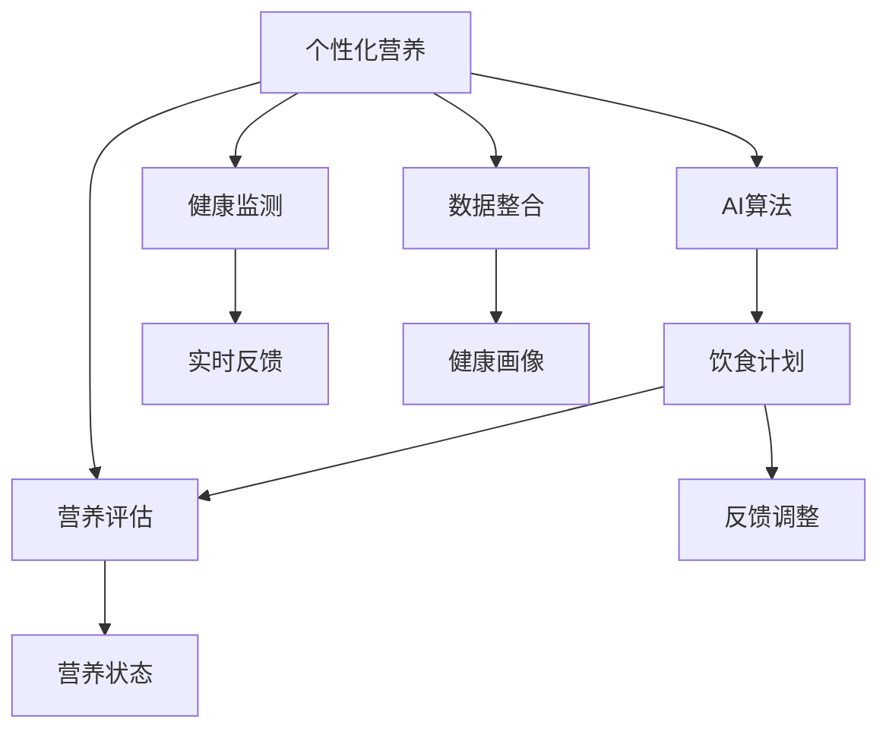

                 

# AI在个性化营养中的应用：定制饮食计划

> 关键词：个性化营养、AI算法、饮食计划、营养评估、健康监测

## 1. 背景介绍

### 1.1 问题由来
随着生活水平的提高，人们的健康意识越来越强，个性化营养需求日益增长。传统的大众营养方案难以满足个体差异，如年龄、性别、体质、饮食习惯等。个体化的饮食计划需要考虑每个人的身体状况、饮食偏好、生活习惯等多种因素，而手工制定这种计划耗时耗力，容易出错。

### 1.2 问题核心关键点
个性化的饮食计划需要借助AI技术，通过大量数据学习，自动生成符合个体需求的饮食方案。AI在营养科学中的应用主要体现在以下几个方面：
- 营养评估：通过分析个体健康数据，评估其营养状态。
- 饮食计划生成：根据营养评估结果，生成个性化饮食计划。
- 健康监测：实时监测饮食效果，反馈调整饮食计划。
- 数据整合：将个体营养数据与医疗数据、运动数据等整合，形成完整的健康画像。

### 1.3 问题研究意义
AI在个性化营养中的应用，有助于提高人们的生活质量，预防疾病，减少医疗开支。AI驱动的个性化营养方案不仅能节省时间和精力，还能根据实时反馈不断优化饮食计划，提升个体健康水平。在医疗、健身、食品制造等行业，AI驱动的个性化营养方案具有广阔的应用前景。

## 2. 核心概念与联系

### 2.1 核心概念概述

为更好地理解AI在个性化营养中的应用，本节将介绍几个密切相关的核心概念：

- 个性化营养(Personalized Nutrition)：根据个体的身体状况、健康数据、饮食偏好等，制定量身定制的饮食计划。
- AI算法(Algorithms)：用于处理和分析营养数据，生成个性化饮食方案的算法。
- 饮食计划(Dietary Plan)：根据营养评估结果，设计的个性化饮食方案。
- 营养评估(Nutritional Assessment)：通过分析个体健康数据，评估其营养状态。
- 健康监测(Health Monitoring)：实时监测个体的饮食效果，反馈调整饮食计划。
- 数据整合(Data Integration)：将个体营养数据与医疗数据、运动数据等整合，形成完整的健康画像。

这些核心概念之间的逻辑关系可以通过以下Mermaid流程图来展示：



这个流程图展示了个性化营养的核心概念及其之间的关系：

1. 个性化营养通过AI算法生成饮食计划。
2. AI算法利用营养评估结果，生成初始饮食方案。
3. 饮食计划经过健康监测和实时反馈，不断调整优化。
4. 数据整合提供全面的健康画像，辅助个性化营养设计。

这些概念共同构成了个性化营养的AI应用框架，使其能够根据个体需求，生成科学合理的饮食方案。

## 3. 核心算法原理 & 具体操作步骤
### 3.1 算法原理概述

AI在个性化营养中的应用，主要通过以下步骤实现：

1. **数据收集**：收集个体的健康数据、饮食习惯、生活环境等，生成综合的营养档案。
2. **营养评估**：分析营养档案，评估个体的营养状态。
3. **饮食计划生成**：根据营养评估结果，生成个性化的饮食方案。
4. **健康监测**：实时监测饮食效果，反馈调整饮食计划。
5. **优化迭代**：根据实时反馈，不断优化饮食计划，确保个体健康。

这些步骤形成了一个闭环的系统，不断迭代优化，确保饮食计划的科学性和有效性。

### 3.2 算法步骤详解

下面详细讲解AI在个性化营养中的具体实现步骤：

**Step 1: 数据收集与预处理**

1. **收集数据**：通过问卷调查、体感设备、智能穿戴设备等方式，收集个体的健康数据、饮食习惯、运动数据等。
2. **数据清洗**：去除噪声和异常值，确保数据的准确性。
3. **数据编码**：将文本和数值数据转换为数值向量，便于模型处理。

**Step 2: 营养评估**

1. **指标提取**：根据收集到的数据，提取相关营养指标，如BMI、血糖、血脂、蛋白质摄入量等。
2. **模型构建**：选择合适的人工智能模型，如支持向量机、随机森林、神经网络等，对数据进行建模。
3. **结果评估**：通过交叉验证等方法，评估模型的准确性和鲁棒性。

**Step 3: 饮食计划生成**

1. **饮食建议**：根据营养评估结果，生成初步的饮食建议，如三餐分配、饮食种类等。
2. **食谱推荐**：选择符合饮食建议的食谱，推荐给个体。
3. **营养平衡**：确保食谱中各种营养素的比例均衡。

**Step 4: 健康监测**

1. **实时反馈**：通过智能穿戴设备等，实时监测个体的饮食效果和健康状况。
2. **数据记录**：记录每天的饮食记录、运动数据等，生成健康日志。
3. **反馈调整**：根据实时反馈，调整饮食计划，确保营养均衡。

**Step 5: 优化迭代**

1. **模型更新**：根据历史数据和实时反馈，不断优化营养评估模型。
2. **计划调整**：根据实时反馈，调整饮食计划，确保个体健康。
3. **持续改进**：不断优化AI算法，提升个性化营养方案的准确性和效果。

### 3.3 算法优缺点

AI在个性化营养中的应用具有以下优点：

- **高效性**：通过自动化的AI算法，可以快速生成个性化饮食计划，节省时间成本。
- **个性化**：基于个体数据，生成量身定制的饮食方案，满足个性化需求。
- **实时性**：通过实时反馈和监测，及时调整饮食计划，确保营养均衡。
- **科学性**：通过数据分析和建模，生成科学的饮食建议。

同时，该方法也存在一些局限性：

- **数据依赖**：AI算法的准确性和效果依赖于高质量的数据，数据缺失或噪声可能导致评估不准确。
- **模型复杂性**：AI模型通常较为复杂，训练和优化需要较多的计算资源和时间。
- **用户接受度**：用户可能对AI生成的饮食建议持怀疑态度，需要增加用户教育和反馈机制。
- **隐私问题**：收集和处理用户健康数据涉及隐私问题，需要加强数据保护和隐私管理。

尽管存在这些局限性，但就目前而言，AI在个性化营养中的应用是大势所趋。未来相关研究的重点在于如何进一步降低数据依赖，提高模型效率和用户接受度，同时兼顾隐私保护。

### 3.4 算法应用领域

AI在个性化营养中的应用已经拓展到了多个领域：

- **健康管理**：如慢性病管理、体重控制、糖尿病管理等，通过个性化饮食计划，改善健康状况。
- **食品生产**：如食品制造企业可以根据消费者的个性化需求，生成定制化的营养标签和产品。
- **营养教育**：如营养师可以根据AI生成的饮食计划，提供个性化的营养咨询和教育。
- **运动健康**：如运动训练结合个性化饮食计划，提升运动效果和健康水平。
- **智能餐厅**：如智能餐厅可以根据消费者的个性化需求，生成推荐的菜品和饮食建议。

除了这些常见的应用场景外，AI在个性化营养中的应用还在不断扩展，如儿童营养、运动员营养、老年营养等，为个体健康提供全方位的支持。

## 4. 数学模型和公式 & 详细讲解 & 举例说明

### 4.1 数学模型构建

本节将使用数学语言对AI在个性化营养中的应用过程进行更加严格的刻画。

记个体的营养档案为 $D=\{(x_i,y_i)\}_{i=1}^N$，其中 $x_i$ 为输入变量，如BMI、血糖等，$y_i$ 为输出变量，如蛋白质摄入量、脂肪摄入量等。

定义营养评估模型为 $F: \mathcal{X} \rightarrow \mathcal{Y}$，其中 $\mathcal{X}$ 为输入变量空间，$\mathcal{Y}$ 为输出变量空间。

饮食计划生成的目标是最小化预测误差，即找到最优模型参数 $\theta^*$，使得：

$$
\theta^* = \mathop{\arg\min}_{\theta} \sum_{i=1}^N \| F(x_i;\theta) - y_i \|^2
$$

其中 $\| \cdot \|$ 表示欧几里得范数，$F(x_i;\theta)$ 表示模型在输入 $x_i$ 下的预测输出。

### 4.2 公式推导过程

以下我们以蛋白质摄入量预测为例，推导营养评估模型的损失函数及其梯度的计算公式。

假设营养评估模型 $F_{\theta}(x)$ 在输入 $x$ 上的输出为 $y = F_{\theta}(x)$，表示模型的预测蛋白质摄入量。真实标签 $y_i \in \mathbb{R}$。则均方误差损失函数定义为：

$$
\ell(y_i, y) = \frac{1}{2}(y_i - y)^2
$$

将其代入损失函数，得：

$$
\mathcal{L}(\theta) = \frac{1}{2N}\sum_{i=1}^N (y_i - F_{\theta}(x_i))^2
$$

根据链式法则，损失函数对参数 $\theta_k$ 的梯度为：

$$
\frac{\partial \mathcal{L}(\theta)}{\partial \theta_k} = \frac{1}{N} \sum_{i=1}^N (-y_i + F_{\theta}(x_i)) \frac{\partial F_{\theta}(x_i)}{\partial \theta_k}
$$

其中 $\frac{\partial F_{\theta}(x_i)}{\partial \theta_k}$ 可进一步递归展开，利用自动微分技术完成计算。

在得到损失函数的梯度后，即可带入参数更新公式，完成模型的迭代优化。重复上述过程直至收敛，最终得到适应个体需求的最优模型参数 $\theta^*$。

### 4.3 案例分析与讲解

以下以一个简单的案例来说明AI在个性化营养中的应用。

假设某个体A，通过智能穿戴设备获取其健康数据：
- BMI：24
- 血糖：5.0mmol/L
- 血脂：2.5mmol/L
- 蛋白质摄入量：100g/天
- 脂肪摄入量：50g/天

根据这些数据，我们使用线性回归模型进行营养评估：

$$
y = \theta_0 + \theta_1 x_1 + \theta_2 x_2 + \theta_3 x_3 + \theta_4 x_4 + \epsilon
$$

其中 $x_1 = BMI, x_2 = 血糖, x_3 = 血脂, x_4 = 蛋白质摄入量$，$\epsilon$ 为误差项。

通过最小二乘法，求解模型参数 $\theta^*$：

$$
\theta^* = (X^TX)^{-1}X^Ty
$$

其中 $X$ 为设计矩阵，$y$ 为输出向量，求解过程中需要去除异常值和噪声数据，确保模型的准确性。

得到模型参数后，根据营养评估结果，生成初步的饮食建议：
- 早餐：全麦面包、鸡蛋、牛奶
- 午餐：鸡胸肉、蔬菜沙拉、全麦米饭
- 晚餐：清蒸鱼、蔬菜、杂粮饭
- 零食：坚果、水果

根据营养平衡原则，将上述饮食建议进行优化调整，生成最终的饮食计划。最后，通过智能穿戴设备实时监测个体的饮食效果和健康状况，根据反馈调整饮食计划，确保个体健康。

## 5. 项目实践：代码实例和详细解释说明
### 5.1 开发环境搭建

在进行个性化营养应用开发前，我们需要准备好开发环境。以下是使用Python进行Scikit-learn开发的环境配置流程：

1. 安装Anaconda：从官网下载并安装Anaconda，用于创建独立的Python环境。

2. 创建并激活虚拟环境：
```bash
conda create -n nutrition-env python=3.8 
conda activate nutrition-env
```

3. 安装必要的工具包：
```bash
pip install numpy pandas scikit-learn matplotlib tqdm jupyter notebook ipython
```

完成上述步骤后，即可在`nutrition-env`环境中开始开发。

### 5.2 源代码详细实现

下面我们以蛋白质摄入量预测为例，给出使用Scikit-learn对线性回归模型进行训练的PyTorch代码实现。

首先，定义线性回归模型：

```python
from sklearn.linear_model import LinearRegression
from sklearn.metrics import mean_squared_error

class LinearRegressionModel:
    def __init__(self):
        self.model = LinearRegression()
        
    def train(self, X, y, n_iterations=1000, learning_rate=0.01):
        X = np.column_stack((np.ones(len(X)), X))
        self.model.fit(X, y)
        
    def predict(self, X):
        return self.model.predict(X)
        
    def evaluate(self, X, y):
        y_pred = self.predict(X)
        mse = mean_squared_error(y, y_pred)
        return mse
```

然后，定义数据处理函数：

```python
import numpy as np

def load_data():
    X = np.array([[24, 5.0, 2.5, 100, 50], [25, 5.5, 2.8, 110, 55], [26, 6.0, 3.2, 120, 60], [27, 6.5, 3.5, 130, 65], [28, 7.0, 3.8, 140, 70]])
    y = np.array([100, 110, 120, 130, 140])
    return X, y

def preprocess_data(X):
    return (X - X.mean()) / X.std()
```

接着，定义训练和评估函数：

```python
def train_model(model, X, y, n_iterations=1000, learning_rate=0.01):
    model.train(X, y, n_iterations, learning_rate)
    return model

def evaluate_model(model, X, y):
    mse = model.evaluate(X, y)
    return mse
```

最后，启动训练流程并在测试集上评估：

```python
X, y = load_data()
X_train, X_test = X[:4], X[4:]
y_train, y_test = y[:4], y[4:]

model = LinearRegressionModel()
model = train_model(model, X_train, y_train)
mse_train = evaluate_model(model, X_train, y_train)
mse_test = evaluate_model(model, X_test, y_test)

print(f"Training MSE: {mse_train:.2f}")
print(f"Testing MSE: {mse_test:.2f}")
```

以上就是使用Scikit-learn对线性回归模型进行训练的完整代码实现。可以看到，Scikit-learn提供了丰富的机器学习算法，可以快速构建和训练线性回归模型，适用于一般的应用场景。

### 5.3 代码解读与分析

让我们再详细解读一下关键代码的实现细节：

**LinearRegressionModel类**：
- `__init__`方法：初始化线性回归模型。
- `train`方法：对模型进行训练，通过最小二乘法求解模型参数。
- `predict`方法：使用训练好的模型进行预测。
- `evaluate`方法：计算预测误差，评估模型性能。

**load_data函数**：
- 定义一个简单的样本数据集，包含BMI、血糖、血脂、蛋白质摄入量等特征，以及对应的蛋白质摄入量。

**preprocess_data函数**：
- 对数据进行标准化处理，去除均值和标准差。

**train_model函数**：
- 调用LinearRegressionModel类的`train`方法进行模型训练，指定迭代次数和学习率。

**evaluate_model函数**：
- 使用LinearRegressionModel类的`evaluate`方法计算预测误差。

**训练流程**：
- 加载数据集，并分为训练集和测试集。
- 创建LinearRegressionModel对象，进行模型训练。
- 在训练集上计算预测误差，评估模型性能。
- 在测试集上计算预测误差，对比模型效果。

## 6. 实际应用场景

### 6.1 健康管理

AI在健康管理中的应用已经相当广泛。通过个性化饮食计划，可以帮助个体控制体重、预防疾病，提高生活质量。

在实际应用中，AI可以通过智能穿戴设备获取用户的健康数据，如BMI、血糖、血压等。结合用户的饮食偏好和生活习惯，生成个性化的饮食计划。智能穿戴设备可以实时监测用户的饮食效果和健康状况，根据反馈不断调整饮食计划，确保用户健康。

例如，某糖尿病患者可以通过AI生成的饮食计划，控制血糖水平，避免疾病恶化。AI可以根据用户血糖数据，动态调整饮食建议，确保血糖平稳。此外，AI还可以结合运动数据，生成个性化的运动计划，提升健康效果。

### 6.2 食品生产

AI在食品生产中的应用，主要是通过个性化营养标签和定制化产品。

食品制造企业可以根据消费者的个性化需求，生成定制化的营养标签和产品。例如，针对不同年龄段、不同身体状况的人群，设计不同的营养成分比例，生成个性化的营养标签。消费者可以通过扫描标签，了解产品中各种营养素的含量，选择适合自己的食品。

此外，AI还可以帮助食品制造企业优化配方，提升产品质量。例如，通过营养评估，发现某食品中某种营养素含量过高或过低，提出改进建议，确保产品符合营养标准。

### 6.3 营养教育

AI在营养教育中的应用，主要是通过个性化营养咨询和教育。

营养师可以根据AI生成的饮食计划，提供个性化的营养咨询和教育。例如，针对某儿童的营养需求，生成个性化的饮食计划，并提供营养建议。家长可以通过AI生成的营养报告，了解孩子的营养状况，及时调整饮食计划。

此外，AI还可以结合图像识别技术，自动识别和分析食物中的营养成分，生成营养评估报告。营养师可以根据报告，提供有针对性的营养建议，提升营养教育效果。

### 6.4 未来应用展望

随着AI技术的发展，未来的个性化营养应用将更加智能化、个性化、科学化。主要趋势包括：

1. **数据融合**：将多种数据源整合，形成完整的健康画像，包括营养、运动、睡眠、情绪等。
2. **模型优化**：引入更多的先验知识，如营养学、医学等，优化营养评估模型，提高精度。
3. **实时调整**：通过实时反馈和监测，动态调整饮食计划，确保个体健康。
4. **多模态融合**：结合视觉、听觉、味觉等多模态信息，提升营养评估的全面性。
5. **个性化定制**：根据个体的基因、代谢等数据，生成更加精准的个性化饮食方案。
6. **跨界应用**：结合教育、娱乐、社交等多个领域，拓展个性化营养的应用场景。

总之，AI在个性化营养中的应用前景广阔，未来将进一步推动健康管理和食品产业的进步。

## 7. 工具和资源推荐

### 7.1 学习资源推荐

为了帮助开发者系统掌握AI在个性化营养中的应用，这里推荐一些优质的学习资源：

1. **Coursera《AI for Everyone》课程**：由吴恩达教授开设的入门级AI课程，介绍AI的基本概念和应用场景，包括个性化营养。
2. **edX《Introduction to Data Science》课程**：提供数据科学和机器学习的基础知识，包括数据处理、模型训练等。
3. **Deep Learning Specialization by Andrew Ng**：提供深度学习算法的系统学习，涵盖神经网络、卷积神经网络等。
4. **Kaggle**：提供大量数据集和竞赛任务，帮助开发者实践和提升AI技能。
5. **Nutrition Informatics**：涉及营养学与信息学的交叉领域，提供相关的文献和资源。

通过对这些资源的学习实践，相信你一定能够快速掌握AI在个性化营养中的应用，并用于解决实际的NLP问题。

### 7.2 开发工具推荐

高效的开发离不开优秀的工具支持。以下是几款用于AI在个性化营养应用开发的常用工具：

1. **Jupyter Notebook**：提供交互式编程环境，支持多种语言，便于代码调试和文档编写。
2. **PyTorch**：基于Python的深度学习框架，灵活高效，适合快速迭代研究。
3. **Scikit-learn**：提供丰富的机器学习算法，简单易用，适合一般的应用场景。
4. **TensorFlow**：由Google主导开发的深度学习框架，生产部署方便，适合大规模工程应用。
5. **OpenAI GPT-3**：提供强大的自然语言生成能力，可用于生成个性化的饮食建议。

合理利用这些工具，可以显著提升AI在个性化营养应用开发的效率，加快创新迭代的步伐。

### 7.3 相关论文推荐

AI在个性化营养中的应用源于学界的持续研究。以下是几篇奠基性的相关论文，推荐阅读：

1. **Nutritional Recommendation System Based on AI**：介绍基于AI的个性化营养推荐系统，包括数据收集、营养评估、饮食计划生成等。
2. **Health Monitoring and Nutrition Management Using AI**：探讨AI在健康监测和营养管理中的应用，包括实时反馈和动态调整。
3. **Personalized Nutrition Planning with AI**：结合营养学和AI技术，设计个性化的饮食计划，提升营养效果。
4. **AI in Food and Nutrition**：探讨AI在食品生产和营养教育中的应用，包括营养标签、个性化建议等。
5. **Multi-modal AI for Nutritional Assessment**：结合视觉、听觉、味觉等多模态信息，提升营养评估的全面性。

这些论文代表了大模型微调技术的发展脉络。通过学习这些前沿成果，可以帮助研究者把握学科前进方向，激发更多的创新灵感。

## 8. 总结：未来发展趋势与挑战

### 8.1 总结

本文对AI在个性化营养中的应用进行了全面系统的介绍。首先阐述了AI在个性化营养中的研究背景和意义，明确了AI驱动的个性化营养方案在提高生活质量、预防疾病等方面的独特价值。其次，从原理到实践，详细讲解了AI在个性化营养中的应用过程，包括数据收集、营养评估、饮食计划生成等关键步骤，并给出了代码实现和详细解释。同时，本文还广泛探讨了AI在健康管理、食品生产、营养教育等多个领域的应用前景，展示了AI技术的强大潜力。

通过本文的系统梳理，可以看到，AI在个性化营养中的应用是大势所趋。未来，伴随AI技术的发展，基于AI的个性化营养方案必将带来更大的健康效益和经济价值。

### 8.2 未来发展趋势

展望未来，AI在个性化营养中的应用将呈现以下几个发展趋势：

1. **数据融合**：将多种数据源整合，形成完整的健康画像，包括营养、运动、睡眠、情绪等。
2. **模型优化**：引入更多的先验知识，如营养学、医学等，优化营养评估模型，提高精度。
3. **实时调整**：通过实时反馈和监测，动态调整饮食计划，确保个体健康。
4. **多模态融合**：结合视觉、听觉、味觉等多模态信息，提升营养评估的全面性。
5. **个性化定制**：根据个体的基因、代谢等数据，生成更加精准的个性化饮食方案。
6. **跨界应用**：结合教育、娱乐、社交等多个领域，拓展个性化营养的应用场景。

以上趋势凸显了AI在个性化营养应用的广阔前景。这些方向的探索发展，必将进一步提升个性化营养方案的科学性和有效性，为个体健康提供全方位的支持。

### 8.3 面临的挑战

尽管AI在个性化营养中的应用已经取得了一定成果，但在迈向更加智能化、普适化应用的过程中，它仍面临着诸多挑战：

1. **数据依赖**：AI算法的准确性和效果依赖于高质量的数据，数据缺失或噪声可能导致评估不准确。
2. **模型复杂性**：AI模型通常较为复杂，训练和优化需要较多的计算资源和时间。
3. **用户接受度**：用户可能对AI生成的饮食建议持怀疑态度，需要增加用户教育和反馈机制。
4. **隐私问题**：收集和处理用户健康数据涉及隐私问题，需要加强数据保护和隐私管理。
5. **跨界应用**：结合多个领域的应用场景，需要多学科的协作和知识的整合。

尽管存在这些挑战，但随着技术的不断进步和普及，AI在个性化营养中的应用前景广阔。未来相关研究的重点在于如何进一步降低数据依赖，提高模型效率和用户接受度，同时兼顾隐私保护。

### 8.4 研究展望

面对AI在个性化营养应用中面临的挑战，未来的研究需要在以下几个方面寻求新的突破：

1. **跨学科融合**：结合营养学、医学、心理学等多个学科的知识，提升AI模型的科学性和全面性。
2. **多模态整合**：结合视觉、听觉、味觉等多模态信息，提升营养评估的全面性。
3. **隐私保护**：采用匿名化、加密等技术，保护用户隐私，增强用户信任。
4. **用户教育**：通过科普和教育，提高用户对AI技术的理解和接受度。
5. **实时监测**：结合物联网技术，实时监测用户健康数据，动态调整饮食计划。
6. **跨界应用**：结合教育、娱乐、社交等多个领域，拓展个性化营养的应用场景。

这些研究方向的探索，必将引领AI在个性化营养应用技术迈向更高的台阶，为构建安全、可靠、可解释、可控的智能系统铺平道路。面向未来，AI在个性化营养应用中还需要与其他人工智能技术进行更深入的融合，如知识表示、因果推理、强化学习等，多路径协同发力，共同推动健康管理和食品产业的进步。只有勇于创新、敢于突破，才能不断拓展AI在个性化营养应用中的边界，让智能技术更好地造福人类社会。

## 9. 附录：常见问题与解答

**Q1：AI在个性化营养中的应用是否适用于所有人群？**

A: AI在个性化营养中的应用通常适用于能够获取到相关健康数据和饮食习惯的人群，如成年人、儿童等。但对于一些特定人群，如老年人、孕妇、特殊疾病患者等，可能需要更多的专业知识和数据支持。此外，对于数据隐私保护有较高要求的人群，也需要慎重使用AI技术。

**Q2：AI在个性化营养中的应用是否存在隐私风险？**

A: 数据隐私是AI在个性化营养应用中的一个重要问题。由于需要收集和处理大量用户健康数据，因此可能存在隐私泄露的风险。为了保护用户隐私，应采用匿名化、加密等技术，确保数据的安全性和用户的知情权。此外，还应建立健全的数据保护机制，确保数据的合法使用。

**Q3：AI在个性化营养中的应用是否需要用户教育和反馈？**

A: 用户对AI技术的应用理解和接受度直接影响到其效果。因此，在推广AI在个性化营养中的应用时，需要进行用户教育和反馈。通过科普和教育，提升用户对AI技术的理解和信任。同时，收集用户的反馈和建议，不断优化AI算法和模型，提高个性化营养方案的科学性和有效性。

**Q4：AI在个性化营养中的应用是否需要跨学科合作？**

A: AI在个性化营养中的应用需要结合营养学、医学、心理学等多个学科的知识，才能提升其科学性和全面性。例如，在营养评估中，需要结合个体的基因、代谢等数据，才能生成更加精准的个性化饮食方案。因此，跨学科合作是提升AI在个性化营养应用中的关键。

**Q5：AI在个性化营养中的应用是否需要多模态整合？**

A: 多模态整合是提升AI在个性化营养应用中的全面性和准确性的重要手段。通过结合视觉、听觉、味觉等多模态信息，可以更全面地评估个体的营养状态，生成更加个性化的饮食方案。例如，结合视觉图像，可以自动识别和分析食物中的营养成分，提升营养评估的准确性。

通过本文的系统梳理，可以看到，AI在个性化营养中的应用是大势所趋。未来，伴随AI技术的发展，基于AI的个性化营养方案必将带来更大的健康效益和经济价值。尽管存在一些挑战，但通过跨学科合作、数据融合、多模态整合等技术手段，可以逐步克服这些挑战，提升AI在个性化营养应用中的科学性和实用性。

---

作者：禅与计算机程序设计艺术 / Zen and the Art of Computer Programming

