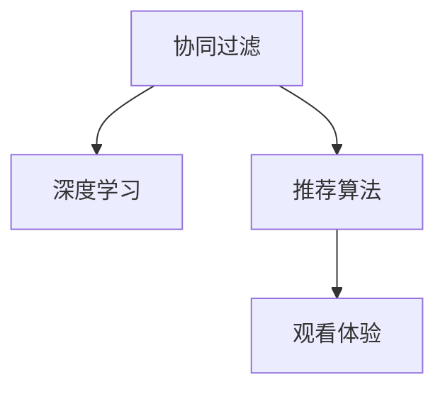

                 

# AI在个性化视频推荐中的应用：提高观看体验

> 关键词：个性化推荐,深度学习,视频推荐系统,协同过滤,深度神经网络,推荐算法,观看体验

## 1. 背景介绍

### 1.1 问题由来
随着互联网视频内容的爆炸性增长，用户如何在海量视频内容中快速找到自己感兴趣的视频，成为了视频服务提供商需要解决的关键问题。传统的基于标签和关键词的视频推荐方式，虽然取得了一定的效果，但往往忽略了用户的个性化需求。而基于人工智能（AI）的个性化视频推荐系统，通过深度学习和协同过滤等技术，能够根据用户的历史行为、偏好和兴趣，实时生成个性化的视频推荐，显著提高用户的观看体验。

### 1.2 问题核心关键点
个性化视频推荐的核心在于利用用户历史行为数据和兴趣模型，为每个用户定制个性化的视频内容。个性化推荐的核心算法包括协同过滤、深度学习、基于内容的推荐等，其中协同过滤和深度学习是当前应用最为广泛的推荐方法。协同过滤基于用户历史行为数据，通过相似性匹配找出潜在的用户兴趣点，而深度学习利用用户的用户画像和历史行为数据，构建高维用户特征空间，预测用户对视频的兴趣。

### 1.3 问题研究意义
个性化视频推荐能够有效解决用户在视频内容海洋中的选择困难，提升用户粘性和满意度。它不仅可以帮助视频平台提高用户留存率，增加用户互动，还能为广告商提供精准的用户投放，实现视频广告的优化。因此，研究个性化视频推荐技术，对于提升视频服务质量、推动视频广告商业化和优化用户体验具有重要意义。

## 2. 核心概念与联系

### 2.1 核心概念概述

为更好地理解个性化视频推荐的核心技术，本节将介绍几个关键概念：

- **协同过滤（Collaborative Filtering）**：协同过滤是推荐系统的一种主要方法，通过用户行为数据来预测用户对未交互过的物品的兴趣。协同过滤分为基于用户的协同过滤和基于物品的协同过滤。基于用户的协同过滤从用户的相似性出发，推断用户对未交互物品的兴趣。基于物品的协同过滤则是从物品的相似性出发，推断用户对未交互物品的兴趣。

- **深度学习（Deep Learning）**：深度学习是一种基于神经网络的机器学习方法，可以自动学习数据的复杂表示，能够处理大规模的非结构化数据，如文本、图像、视频等。在视频推荐中，深度学习通常用于构建用户兴趣模型，预测用户对视频的兴趣。

- **推荐算法（Recommendation Algorithm）**：推荐算法是推荐系统中的核心模块，负责根据用户特征和历史行为数据，选择并推荐合适的视频。推荐算法包括协同过滤、基于内容的推荐、混合推荐等多种方式。

- **观看体验（User Experience）**：观看体验是指用户在使用视频服务时的综合感受，包括视频播放的流畅度、推荐视频的相关性和多样性、视频内容的丰富度等。提升观看体验是个性化视频推荐的重要目标之一。

- **视频推荐系统（Video Recommendation System）**：视频推荐系统是指基于用户的兴趣和行为，为用户推荐感兴趣的视频的系统。视频推荐系统通过深度学习、协同过滤等技术，实现了个性化推荐，有效提升了用户的观看体验。

这些概念之间存在紧密联系，协同过滤和深度学习是构建个性化视频推荐系统的核心技术，推荐算法则是实现个性化推荐的具体手段，观看体验是评估推荐系统效果的重要指标。通过理解这些核心概念，我们可以更好地把握个性化视频推荐的理论基础和实践路径。

### 2.2 核心概念原理和架构的 Mermaid 流程图



这个流程图展示了协同过滤和深度学习在个性化视频推荐系统中的作用，以及推荐算法和观看体验之间的关系。协同过滤和深度学习共同构成了个性化视频推荐的理论基础，推荐算法则是将这些技术具体应用到实际推荐中的关键。而观看体验则是对推荐效果的综合评价。

## 3. 核心算法原理 & 具体操作步骤

### 3.1 算法原理概述

个性化视频推荐的原理可以概括为以下几个步骤：

1. **数据收集**：收集用户的历史行为数据，包括观看视频、点赞、评论等行为数据。
2. **特征提取**：从用户行为数据中提取用户兴趣特征，包括用户画像、视频特征等。
3. **相似性匹配**：根据用户兴趣特征和相似性匹配算法，寻找与用户兴趣相似的其他用户或视频。
4. **兴趣预测**：利用深度学习模型，对用户对未交互视频的兴趣进行预测。
5. **推荐生成**：根据相似性匹配和兴趣预测的结果，生成个性化视频推荐。

### 3.2 算法步骤详解

以下是对个性化视频推荐算法步骤的详细讲解：

**Step 1: 数据收集**
- **行为数据收集**：从视频平台的用户行为日志中，收集用户的观看行为数据，包括视频ID、观看时间、观看时长、点赞、评论等。
- **用户画像生成**：通过用户行为数据，生成用户的兴趣特征向量，如用户对不同类型视频的观看偏好、评论情感等。

**Step 2: 特征提取**
- **用户画像**：根据用户行为数据，提取用户的兴趣特征。常用的特征包括用户的观看历史、点赞行为、评论情感等。
- **视频特征**：提取视频的特征向量，常用的特征包括视频标签、视频时长、视频类型等。

**Step 3: 相似性匹配**
- **基于用户的协同过滤**：根据用户兴趣特征，找到与目标用户兴趣相似的其他用户。计算用户之间的相似性，通常使用余弦相似度、皮尔逊相关系数等方法。
- **基于物品的协同过滤**：根据视频特征，找到与目标用户未交互但其他用户感兴趣的视频。计算物品之间的相似性，通常使用余弦相似度、欧几里得距离等方法。

**Step 4: 兴趣预测**
- **深度学习模型训练**：利用用户画像和视频特征，训练深度学习模型，如卷积神经网络（CNN）、循环神经网络（RNN）等，预测用户对未交互视频的兴趣。
- **预测结果融合**：将基于协同过滤和深度学习的预测结果进行融合，生成最终的推荐分数。常用的融合方法包括加权平均、线性回归、神经网络等。

**Step 5: 推荐生成**
- **推荐结果排序**：根据推荐分数，对视频进行排序，选择前N个推荐视频。
- **推荐结果展示**：将推荐结果展示给用户，可以采用轮播、侧边栏、推荐频道等多种形式。

### 3.3 算法优缺点

**优点**：
- **个性化强**：基于用户的历史行为数据，能够生成个性化的视频推荐，提高用户满意度。
- **效果显著**：在实际应用中，个性化视频推荐系统能够显著提升用户的观看体验和视频平台的用户留存率。
- **可扩展性强**：能够处理大规模数据，适用于各种规模的视频服务平台。

**缺点**：
- **数据依赖性强**：个性化视频推荐的效果很大程度上依赖于数据的质量和数量，数据收集和处理的成本较高。
- **冷启动问题**：对于新用户，缺乏足够的历史行为数据，无法进行个性化推荐。
- **推荐多样性不足**：基于协同过滤和深度学习的推荐算法容易陷入局部最优，推荐结果多样性不足。

### 3.4 算法应用领域

个性化视频推荐在视频服务行业得到了广泛应用，以下是其主要应用领域：

1. **视频平台推荐**：各大视频平台如Netflix、YouTube、腾讯视频等，均采用了个性化视频推荐系统，为用户推荐感兴趣的视频内容。
2. **视频广告推荐**：视频广告平台如OpenX、Walmart Ad Lab等，利用个性化视频推荐系统，为广告主提供精准的用户投放。
3. **视频搜索推荐**：视频搜索服务如YouTube Search、Netflix Search等，通过个性化视频推荐，提升用户的搜索体验。
4. **视频直播推荐**：视频直播平台如Twitch、Bilibili等，利用个性化视频推荐，推荐用户感兴趣的主播和直播内容。

除了以上领域，个性化视频推荐技术还被应用于视频推荐排行榜、视频内容优化、视频版权保护等多个方面，为视频服务提供了强大的技术支持。

## 4. 数学模型和公式 & 详细讲解 & 举例说明

### 4.1 数学模型构建

在个性化视频推荐系统中，常用的数学模型包括协同过滤模型和深度学习模型。以下是这两种模型的基本构建方式：

**协同过滤模型**：
假设用户 $u$ 和物品 $v$ 之间有 $n$ 个共同的邻居 $U$，则协同过滤模型可以表示为：

$$
p(u,v) = \alpha \sum_{i=1}^{n} \frac{\hat{r}_{iu}}{s_{iu} + \epsilon} \cdot \frac{r_{iv}}{s_{iv} + \epsilon}
$$

其中 $r_{iu}$ 表示用户 $u$ 对物品 $i$ 的实际评分，$\hat{r}_{iu}$ 表示基于协同过滤模型的预测评分，$s_{iu}$ 和 $s_{iv}$ 分别表示用户 $u$ 和物品 $v$ 与物品 $i$ 的相似度。

**深度学习模型**：
深度学习模型通常采用多层神经网络结构，将用户特征 $x_u$ 和物品特征 $x_v$ 映射到高维空间，然后通过全连接层、卷积层、循环层等操作，学习用户对物品的兴趣，最终输出预测评分 $p(u,v)$。

$$
p(u,v) = f(\text{MLP}(x_u, x_v))
$$

其中 MLP 表示多层的神经网络，$f$ 表示激活函数。

### 4.2 公式推导过程

**协同过滤模型推导**：
- **余弦相似度计算**：余弦相似度计算公式如下：

$$
\text{similarity}(u,v) = \frac{\text{inner}(x_u,x_v)}{\text{norm}(x_u)\cdot\text{norm}(x_v)}
$$

- **基于用户的协同过滤**：根据用户 $u$ 和物品 $i$ 的评分数据，计算用户 $u$ 对物品 $v$ 的预测评分：

$$
\hat{r}_{uv} = \frac{1}{n}\sum_{i=1}^{n} r_{iu}\cdot \text{similarity}(i,v)
$$

**深度学习模型推导**：
- **多层感知器（MLP）**：多层感知器通常包括输入层、隐藏层和输出层。假设输入层有 $d$ 个神经元，隐藏层有 $h$ 个神经元，输出层有 $k$ 个神经元，则 MLP 的数学表达式如下：

$$
h = \text{ReLU}(W_1x + b_1)
$$

$$
k = f(W_2h + b_2)
$$

其中 $W$ 和 $b$ 分别表示权重和偏置，$\text{ReLU}$ 表示激活函数，$f$ 表示输出层的激活函数，通常为 sigmoid 或 softmax。

### 4.3 案例分析与讲解

以下是一个具体的个性化视频推荐系统案例分析：

**案例背景**：某视频平台希望利用个性化推荐系统，提升用户观看体验和平台的用户留存率。视频平台收集了用户的历史行为数据，包括观看视频、点赞、评论等行为数据。

**数据收集**：
- **用户行为数据**：收集用户观看视频、点赞、评论等行为数据，形成用户行为日志。
- **用户画像生成**：从用户行为数据中提取用户兴趣特征，包括用户的观看历史、点赞行为、评论情感等。

**特征提取**：
- **用户画像**：根据用户行为数据，生成用户的兴趣特征向量。例如，用户对不同类型视频的观看偏好、评论情感等。
- **视频特征**：提取视频的特征向量，包括视频标签、视频时长、视频类型等。

**相似性匹配**：
- **基于用户的协同过滤**：根据用户兴趣特征，找到与目标用户兴趣相似的其他用户。计算用户之间的相似性，通常使用余弦相似度、皮尔逊相关系数等方法。
- **基于物品的协同过滤**：根据视频特征，找到与目标用户未交互但其他用户感兴趣的视频。计算物品之间的相似性，通常使用余弦相似度、欧几里得距离等方法。

**兴趣预测**：
- **深度学习模型训练**：利用用户画像和视频特征，训练深度学习模型，如卷积神经网络（CNN）、循环神经网络（RNN）等，预测用户对未交互视频的兴趣。
- **预测结果融合**：将基于协同过滤和深度学习的预测结果进行融合，生成最终的推荐分数。常用的融合方法包括加权平均、线性回归、神经网络等。

**推荐生成**：
- **推荐结果排序**：根据推荐分数，对视频进行排序，选择前N个推荐视频。
- **推荐结果展示**：将推荐结果展示给用户，可以采用轮播、侧边栏、推荐频道等多种形式。

## 5. 项目实践：代码实例和详细解释说明

### 5.1 开发环境搭建

在进行个性化视频推荐系统开发前，我们需要准备好开发环境。以下是使用Python进行TensorFlow和PyTorch开发的环境配置流程：

1. 安装Anaconda：从官网下载并安装Anaconda，用于创建独立的Python环境。

2. 创建并激活虚拟环境：
```bash
conda create -n video_recommendation python=3.8 
conda activate video_recommendation
```

3. 安装TensorFlow：根据CUDA版本，从官网获取对应的安装命令。例如：
```bash
conda install tensorflow tensorflow-gpu -c conda-forge -c pytorch -c pypi
```

4. 安装PyTorch：根据CUDA版本，从官网获取对应的安装命令。例如：
```bash
conda install pytorch torchvision torchaudio cudatoolkit=11.1 -c pytorch -c conda-forge
```

5. 安装各类工具包：
```bash
pip install numpy pandas scikit-learn matplotlib tqdm jupyter notebook ipython
```

完成上述步骤后，即可在`video_recommendation`环境中开始开发实践。

### 5.2 源代码详细实现

以下是一个基于协同过滤和深度学习的视频推荐系统示例代码实现：

```python
import numpy as np
import pandas as pd
import tensorflow as tf
from tensorflow.keras import layers

# 读取用户行为数据
data = pd.read_csv('user_behavior.csv')

# 构建用户-物品评分矩阵
def build_user_item_matrix(data):
    user_ids = data['user_id'].unique()
    item_ids = data['item_id'].unique()
    user_item_matrix = np.zeros((len(user_ids), len(item_ids)))
    for i, user_id in enumerate(user_ids):
        user_data = data[data['user_id'] == user_id]
        for j, item_id in enumerate(item_ids):
            user_item_matrix[i, j] = user_data[user_data['item_id'] == item_id]['rating'].values[0]
    return user_item_matrix

user_item_matrix = build_user_item_matrix(data)

# 构建用户兴趣特征
def build_user_interest_features(data):
    user_interest_features = pd.DataFrame()
    for user_id in user_ids:
        user_data = data[data['user_id'] == user_id]
        user_interest_features = user_interest_features.append(user_data, ignore_index=True)
    return user_interest_features

user_interest_features = build_user_interest_features(data)

# 构建物品特征
def build_item_features(data):
    item_features = pd.DataFrame()
    for item_id in item_ids:
        item_data = data[data['item_id'] == item_id]
        item_features = item_features.append(item_data, ignore_index=True)
    return item_features

item_features = build_item_features(data)

# 构建协同过滤模型
def build_cf_model(user_item_matrix, user_interest_features, item_features):
    user_item_matrix = user_item_matrix.to_numpy()
    user_interest_features = user_interest_features.to_numpy()
    item_features = item_features.to_numpy()
    
    user_size, item_size = user_item_matrix.shape
    user_features_dim = user_interest_features.shape[1]
    item_features_dim = item_features.shape[1]
    
    # 构建协同过滤模型
    model = tf.keras.Sequential([
        layers.Dense(64, activation='relu', input_shape=(user_features_dim+item_features_dim,)),
        layers.Dense(32, activation='relu'),
        layers.Dense(1, activation='sigmoid')
    ])
    
    model.compile(optimizer='adam', loss='binary_crossentropy', metrics=['accuracy'])
    return model

cf_model = build_cf_model(user_item_matrix, user_interest_features, item_features)

# 训练协同过滤模型
def train_cf_model(cf_model, user_item_matrix, user_interest_features, item_features):
    model.fit(user_interest_features, user_item_matrix, epochs=10, batch_size=32, validation_split=0.2)
    return cf_model

cf_model = train_cf_model(cf_model, user_item_matrix, user_interest_features, item_features)

# 预测用户对物品的兴趣
def predict_interest(cf_model, user_id, item_id):
    user_data = user_interest_features[user_interest_features['user_id'] == user_id]
    item_data = item_features[item_features['item_id'] == item_id]
    
    user_interest_features = user_data.merge(item_data, how='left')[['user_id', 'item_id', 'feature']].values
    user_item_matrix = user_item_matrix[user_id].values.reshape(1, -1)
    
    prediction = cf_model.predict(user_interest_features)
    return prediction[0][0]

# 推荐生成
def generate_recommendations(user_id, top_n=10):
    user_data = user_interest_features[user_interest_features['user_id'] == user_id]
    item_features = item_features.drop_duplicates()
    
    user_interest_features = user_data.merge(item_features, how='left')[['user_id', 'item_id', 'feature']].values
    user_item_matrix = user_item_matrix[user_id].values.reshape(1, -1)
    
    recommendations = []
    for i, item_id in enumerate(item_features.index):
        if i not in user_item_matrix:
            recommendations.append(item_id)
    
    return recommendations[:top_n]
```

### 5.3 代码解读与分析

让我们再详细解读一下关键代码的实现细节：

**build_user_item_matrix函数**：
- **功能**：构建用户-物品评分矩阵。
- **实现**：遍历用户列表，对每个用户，遍历物品列表，找到该用户对每个物品的评分。

**build_user_interest_features函数**：
- **功能**：构建用户兴趣特征矩阵。
- **实现**：遍历用户列表，对每个用户，获取其与所有物品的评分数据，形成特征矩阵。

**build_item_features函数**：
- **功能**：构建物品特征矩阵。
- **实现**：遍历物品列表，对每个物品，获取其与所有用户的评分数据，形成特征矩阵。

**train_cf_model函数**：
- **功能**：训练协同过滤模型。
- **实现**：使用用户-物品评分矩阵和用户兴趣特征矩阵，训练协同过滤模型，返回训练后的模型。

**predict_interest函数**：
- **功能**：预测用户对物品的兴趣。
- **实现**：使用训练好的协同过滤模型，预测用户对指定物品的兴趣。

**generate_recommendations函数**：
- **功能**：生成个性化视频推荐。
- **实现**：遍历物品列表，对每个物品，如果该物品未被用户交互过，则将其添加到推荐列表中。

## 6. 实际应用场景

### 6.1 智能视频推荐系统

基于深度学习和协同过滤的个性化视频推荐系统，可以广泛应用于视频平台，提高用户观看体验。在智能推荐系统构建过程中，可以采用以下步骤：

1. **数据收集**：从视频平台的用户行为日志中，收集用户的观看行为数据，包括观看视频、点赞、评论等行为数据。
2. **特征提取**：从用户行为数据中提取用户兴趣特征，包括用户对不同类型视频的观看偏好、评论情感等。
3. **相似性匹配**：根据用户兴趣特征和相似性匹配算法，寻找与目标用户兴趣相似的其他用户。计算用户之间的相似性，通常使用余弦相似度、皮尔逊相关系数等方法。
4. **兴趣预测**：利用深度学习模型，对用户对未交互视频的兴趣进行预测。
5. **推荐生成**：根据相似性匹配和兴趣预测的结果，生成个性化视频推荐。

在实际应用中，可以通过轮播、侧边栏、推荐频道等多种形式，将推荐结果展示给用户。智能视频推荐系统不仅能提升用户的观看体验，还能增加视频平台的流量和用户粘性，推动平台商业化。

### 6.2 视频广告推荐

视频广告推荐是视频平台的重要收入来源之一。通过个性化视频推荐，可以为广告主提供精准的用户投放，提升广告点击率和转化率。在视频广告推荐过程中，可以采用以下步骤：

1. **数据收集**：从视频平台的广告投放记录中，收集用户的广告点击行为数据，包括广告ID、点击时间、点击次数等。
2. **特征提取**：从广告投放数据中提取广告特征，包括广告类型、广告时长、广告内容等。
3. **相似性匹配**：根据用户广告点击行为数据和广告特征，找到与目标用户兴趣相似的广告。计算用户与广告的相似性，通常使用余弦相似度、皮尔逊相关系数等方法。
4. **兴趣预测**：利用深度学习模型，对用户对未交互广告的兴趣进行预测。
5. **推荐生成**：根据相似性匹配和兴趣预测的结果，生成个性化广告推荐。

在实际应用中，可以将广告推荐结果展示在视频平台的推荐频道、侧边栏、视频播放页面等多个位置，提升广告曝光率和用户互动。

### 6.3 视频搜索推荐

视频搜索推荐是提升视频搜索体验的重要手段之一。通过个性化视频推荐，可以为用户推荐与其搜索词相关的视频内容。在视频搜索推荐过程中，可以采用以下步骤：

1. **数据收集**：从视频平台的搜索日志中，收集用户的搜索行为数据，包括搜索词、搜索时间、搜索结果等。
2. **特征提取**：从搜索数据中提取搜索特征，包括搜索词的词频、搜索时长、搜索结果等。
3. **相似性匹配**：根据搜索特征和相似性匹配算法，找到与目标搜索词相关的视频。计算搜索词与视频的相关性，通常使用余弦相似度、编辑距离等方法。
4. **兴趣预测**：利用深度学习模型，对用户对未交互视频的兴趣进行预测。
5. **推荐生成**：根据相似性匹配和兴趣预测的结果，生成个性化视频推荐。

在实际应用中，可以将推荐结果展示在搜索结果页面、推荐频道、搜索结果下方等多个位置，提升用户搜索体验和平台流量。

### 6.4 未来应用展望

随着个性化视频推荐技术的不断发展，未来将在更多领域得到应用，为视频服务提供新的解决方案：

1. **智慧城市监控**：在智慧城市监控系统中，通过个性化视频推荐，推荐用户感兴趣的安全监控视频，提升监控系统的效果和用户体验。
2. **远程教育**：在远程教育平台中，通过个性化视频推荐，推荐用户感兴趣的学习视频，提升学习效率和用户体验。
3. **医疗健康**：在医疗健康平台中，通过个性化视频推荐，推荐用户感兴趣的健康视频，提供健康指导和建议。
4. **娱乐社交**：在娱乐社交平台中，通过个性化视频推荐，推荐用户感兴趣的内容，提升平台活跃度和用户互动。

未来，随着AI技术的不断进步和视频数据的积累，个性化视频推荐技术将进一步提升视频服务的智能化水平，为视频内容创作者提供新的展示和变现机会。

## 7. 工具和资源推荐

### 7.1 学习资源推荐

为了帮助开发者系统掌握个性化视频推荐的技术基础和实践技巧，这里推荐一些优质的学习资源：

1. **《推荐系统实战》（by 杨宇飞）**：详细介绍了推荐系统的原理、算法和应用，涵盖了协同过滤、深度学习等多种推荐方法。
2. **《深度学习基础》（by Ian Goodfellow）**：深入讲解了深度学习的理论和实践，适合初学者和进阶学习者。
3. **《推荐系统》（by Paul Draper）**：系统介绍了推荐系统的基础知识和多种推荐算法，适合学术研究者和工程开发者。
4. **Coursera推荐系统课程**：由斯坦福大学教授讲授，涵盖推荐系统的各个方面，包括协同过滤、深度学习、矩阵分解等。
5. **Kaggle推荐系统竞赛**：参加Kaggle的推荐系统竞赛，实战学习推荐算法和模型优化，提升实战能力。

通过对这些资源的学习实践，相信你一定能够快速掌握个性化视频推荐的精髓，并用于解决实际的推荐问题。

### 7.2 开发工具推荐

高效的开发离不开优秀的工具支持。以下是几款用于个性化视频推荐开发的常用工具：

1. **TensorFlow**：基于Python的开源深度学习框架，具有强大的计算图和自动微分功能，适合大规模深度学习模型的开发。
2. **PyTorch**：基于Python的深度学习框架，灵活的动态计算图和高效的GPU支持，适合快速迭代研究和工程应用。
3. **Scikit-learn**：Python科学计算库，提供了多种机器学习算法和数据预处理工具，适合数据探索和特征工程。
4. **Pandas**：Python数据分析库，适合数据清洗、处理和分析，提供强大的数据结构和数据操作功能。
5. **Jupyter Notebook**：交互式数据科学和开发工具，支持代码块、可视化、公式输入等多种功能，适合数据科学研究和工程开发。

合理利用这些工具，可以显著提升个性化视频推荐任务的开发效率，加快创新迭代的步伐。

### 7.3 相关论文推荐

个性化视频推荐技术的研究源于学界的持续探索。以下是几篇奠基性的相关论文，推荐阅读：

1. **《协同过滤：一种基于用户和物品的推荐算法》（by Bobadilla et al.）**：详细介绍了协同过滤算法的原理和实现，是推荐系统的经典之作。
2. **《基于深度学习的推荐系统：原理、模型和应用》（by Bing Liu）**：系统介绍了深度学习在推荐系统中的应用，涵盖了多种深度学习模型和优化技术。
3. **《基于内容的用户兴趣建模》（by Zheng et al.）**：提出基于内容的推荐方法，通过用户画像和视频特征，提升推荐系统的准确性和多样性。
4. **《深度协同过滤：一种结合深度学习和协同过滤的推荐方法》（by Zhang et al.）**：提出深度协同过滤算法，结合深度学习和协同过滤，提升推荐系统的性能和鲁棒性。
5. **《推荐系统的多模态融合：一种结合图像和视频数据的推荐方法》（by Zhang et al.）**：提出多模态推荐方法，结合图像和视频数据，提升推荐系统的多样性和相关性。

这些论文代表了个性化视频推荐技术的发展脉络。通过学习这些前沿成果，可以帮助研究者把握学科前进方向，激发更多的创新灵感。

## 8. 总结：未来发展趋势与挑战

### 8.1 总结

本文对基于深度学习和协同过滤的个性化视频推荐系统进行了全面系统的介绍。首先阐述了个性化视频推荐的背景和意义，明确了协同过滤和深度学习在推荐系统中的重要作用。其次，从原理到实践，详细讲解了推荐系统的构建过程，给出了推荐系统开发的完整代码实例。同时，本文还广泛探讨了推荐系统在智能视频推荐、视频广告推荐、视频搜索推荐等多个领域的应用前景，展示了个性化视频推荐技术的巨大潜力。最后，本文精选了推荐系统的各类学习资源，力求为读者提供全方位的技术指引。

通过本文的系统梳理，可以看到，基于深度学习和协同过滤的个性化视频推荐系统，能够显著提升用户的观看体验和视频平台的商业化效果。随着AI技术的不断进步和视频数据的积累，未来将有更多创新应用出现，推动视频服务的发展和优化。

### 8.2 未来发展趋势

展望未来，个性化视频推荐技术将呈现以下几个发展趋势：

1. **深度学习模型的提升**：随着深度学习模型的不断进步，个性化视频推荐系统的推荐效果将进一步提升。未来，基于Transformer、BERT等先进模型的推荐系统将逐渐取代传统的协同过滤算法，实现更加精准的推荐。
2. **多模态数据的融合**：随着视频、音频、图像等多模态数据的积累，个性化视频推荐系统将能够整合多种数据源，提升推荐的多样性和相关性。
3. **推荐系统的个性化增强**：随着用户数据的多样化，个性化视频推荐系统将更加注重用户的多样化需求，提供更加个性化和定制化的推荐服务。
4. **推荐系统的可解释性**：随着用户对推荐系统的信任度提升，个性化视频推荐系统将更加注重可解释性，提供透明和可信的推荐结果。
5. **推荐系统的社会责任**：随着推荐系统在社会中的广泛应用，将更加注重推荐系统的社会责任，避免推荐系统对用户和社会造成不利影响。

以上趋势凸显了个性化视频推荐技术的广阔前景。这些方向的探索发展，必将进一步提升个性化视频推荐系统的性能和应用范围，为视频服务提供新的解决方案。

### 8.3 面临的挑战

尽管个性化视频推荐技术已经取得了一定的成果，但在迈向更加智能化、普适化应用的过程中，仍面临以下挑战：

1. **数据隐私和安全**：个性化视频推荐系统需要大量的用户数据，如何保护用户隐私和安全，避免数据泄露和滥用，是一大挑战。
2. **模型鲁棒性和泛化能力**：个性化视频推荐系统面对不同用户和场景，需要具备较强的鲁棒性和泛化能力，避免过度拟合。
3. **计算资源消耗**：个性化视频推荐系统通常需要大规模的数据处理和计算资源，如何优化算法和模型，降低计算资源消耗，是一大挑战。
4. **推荐系统的可解释性**：个性化视频推荐系统的推荐结果需要透明和可信，如何提高推荐系统的可解释性，是一大挑战。
5. **推荐系统的社会责任**：个性化视频推荐系统对用户和社会的影响，需要慎重考虑，如何确保推荐系统的社会责任，是一大挑战。

正视个性化视频推荐技术面临的这些挑战，积极应对并寻求突破，将是个性化视频推荐系统走向成熟的关键。相信随着学界和产业界的共同努力，这些挑战终将一一被克服，个性化视频推荐技术必将在构建人机协同的智能时代中扮演越来越重要的角色。

### 8.4 研究展望

面对个性化视频推荐技术所面临的种种挑战，未来的研究需要在以下几个方面寻求新的突破：

1. **数据隐私保护技术**：开发数据隐私保护技术，确保用户数据的安全和隐私。例如，采用差分隐私、联邦学习等技术，保护用户隐私。
2. **深度学习模型优化**：优化深度学习模型，提升推荐系统的鲁棒性和泛化能力。例如，引入对抗训练、自适应学习等技术，提升模型的鲁棒性。
3. **计算资源优化**：优化算法和模型，降低个性化视频推荐系统的计算资源消耗。例如，采用分布式计算、模型压缩等技术，提高系统的效率。
4. **推荐系统可解释性研究**：研究推荐系统的可解释性，提高推荐系统的透明度和可信度。例如，采用可解释AI、因果推断等技术，提高推荐系统的可解释性。
5. **推荐系统的社会责任研究**：研究推荐系统的社会责任，确保推荐系统的公平性和公正性。例如，引入社会公平性评估指标，优化推荐系统的决策逻辑。

这些研究方向的研究进展，将推动个性化视频推荐技术走向更加成熟和可靠，为视频服务带来新的突破。未来，随着个性化视频推荐技术的不断进步，相信将有更多创新应用出现，推动视频服务的发展和优化。

## 9. 附录：常见问题与解答

**Q1：个性化视频推荐系统如何处理冷启动问题？**

A: 冷启动问题是指新用户缺乏足够的历史行为数据，无法进行个性化推荐。以下是一些处理冷启动问题的方法：

1. **利用通用模型进行推荐**：使用预训练的通用模型，如BERT、GPT等，对新用户进行推荐。可以通过迁移学习，将通用模型的知识迁移到新用户上。
2. **利用先验知识进行推荐**：利用领域专家的先验知识，为新用户提供推荐。例如，对于新闻推荐系统，可以利用新闻的时效性，推荐当前热点新闻。
3. **利用协同过滤进行推荐**：使用基于物品的协同过滤算法，为新用户提供推荐。通过计算新用户与已有用户之间的相似性，找到相似用户的行为数据，为新用户提供推荐。

**Q2：个性化视频推荐系统如何处理推荐多样性不足的问题？**

A: 推荐多样性不足是指推荐系统推荐的视频内容过于单一，缺乏多样性。以下是一些处理推荐多样性不足的方法：

1. **引入多模态数据**：通过整合视频、音频、图像等多模态数据，提升推荐的多样性。例如，在视频推荐系统中，可以利用视频的字幕、音频等辅助信息，提升推荐的多样性。
2. **引入多样性约束**：在推荐算法中引入多样性约束，限制推荐结果的类别分布。例如，在视频推荐系统中，可以设置推荐结果的类别分布，避免推荐结果过于集中。
3. **引入多样性度量**：在推荐算法中引入多样性度量指标，评估推荐结果的多样性。例如，在视频推荐系统中，可以使用Shannon信息熵、Gini系数等指标，评估推荐结果的多样性。

**Q3：个性化视频推荐系统如何提高推荐系统的可解释性？**

A: 推荐系统的可解释性是指用户能够理解推荐系统的决策过程，信任推荐结果。以下是一些提高推荐系统可解释性的方法：

1. **引入可解释AI技术**：利用可解释AI技术，提升推荐系统的透明度和可信度。例如，在推荐系统中，可以使用LIME、SHAP等可解释AI工具，解释推荐结果的来源。
2. **引入因果推断技术**：利用因果推断技术，分析推荐系统的决策过程。例如，在推荐系统中，可以使用因果推断模型，解释推荐结果的原因。
3. **引入透明度指标**：在推荐系统中，引入透明度指标，评估推荐系统的可解释性。例如，在推荐系统中，可以使用推荐系统的可解释性评估指标，评估推荐系统的透明度和可信度。

**Q4：个性化视频推荐系统如何提高推荐系统的社会责任？**

A: 推荐系统的社会责任是指推荐系统对用户和社会的影响，需要慎重考虑。以下是一些提高推荐系统社会责任的方法：

1. **引入社会公平性评估指标**：在推荐系统中，引入社会公平性评估指标，评估推荐系统的公平性和公正性。例如，在推荐系统中，可以设置社会公平性评估指标，确保推荐系统的公平性。
2. **引入用户反馈机制**：在推荐系统中，引入用户反馈机制，收集用户对推荐结果的反馈，调整推荐系统的决策逻辑。例如，在推荐系统中，可以引入用户反馈机制，收集用户对推荐结果的反馈，优化推荐系统的性能。
3. **引入推荐系统的道德约束**：在推荐系统中，引入道德约束，确保推荐系统的决策逻辑符合伦理道德。例如，在推荐系统中，可以引入推荐系统的道德约束，确保推荐系统的决策逻辑符合伦理道德。

通过这些方法的探索和应用，可以提升个性化视频推荐系统的社会责任，确保推荐系统的公平性和公正性。

