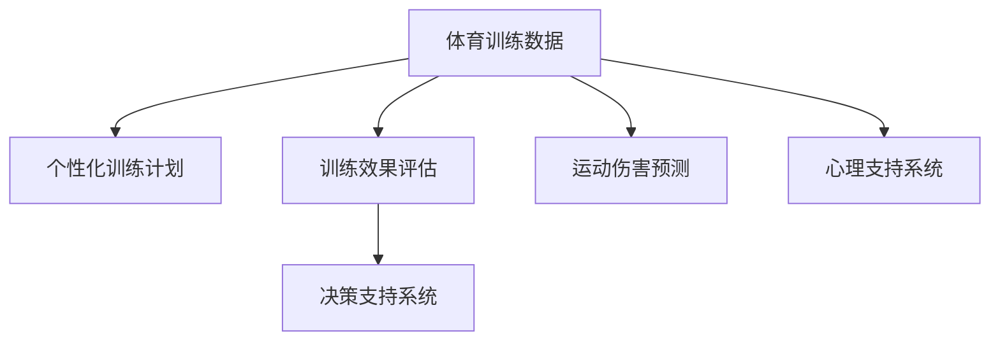

                 

# AI在体育训练中的应用：提高运动员表现

## 1. 背景介绍

### 1.1 问题由来

在现代社会中，体育训练已经成为了提高运动员表现的关键。通过科学合理的训练计划，运动员能够不断提升自身技能和体能，实现竞技水平的飞跃。然而，传统的体育训练方法往往依赖于教练的经验和直觉，存在一定的主观性和局限性。

随着人工智能（AI）技术的快速发展，越来越多的AI应用被引入到体育训练中。AI不仅可以提供更加科学、精准的训练建议，还可以实时监控运动员的训练数据，动态调整训练计划，从而极大地提升运动员的表现。

### 1.2 问题核心关键点

AI在体育训练中的应用，主要集中在以下几个方面：

1. **数据采集与分析**：通过各种传感器和设备，采集运动员的生理数据和运动数据，如心率、肌肉力量、动作轨迹等。

2. **训练计划生成**：根据运动员的生理数据和运动数据，生成个性化的训练计划。

3. **训练效果监控**：实时监控运动员的训练数据，评估训练效果，动态调整训练计划。

4. **决策辅助**：基于机器学习模型，辅助教练做出训练决策，如训练内容、强度、时长等。

5. **受伤风险预测**：通过分析训练数据，预测运动员的受伤风险，预防运动伤害。

6. **心理支持**：利用AI进行心理分析，帮助运动员调整心态，提升竞技状态。

AI技术的引入，使得体育训练更加科学、高效、个性化，有助于提升运动员的表现和健康。

## 2. 核心概念与联系

### 2.1 核心概念概述

为更好地理解AI在体育训练中的应用，本节将介绍几个密切相关的核心概念：

- **体育训练数据**：运动员在训练过程中采集的生理数据和运动数据，如心率、肌肉力量、动作轨迹等。
- **个性化训练计划**：根据运动员的生理特征、运动能力、训练目标等，生成的个性化训练方案。
- **训练效果评估**：通过对运动员训练数据进行分析，评估训练效果，判断训练计划是否有效。
- **决策支持系统**：基于机器学习模型，辅助教练进行训练决策，优化训练计划。
- **运动伤害预测**：通过分析训练数据，预测运动员的受伤风险，预防运动伤害。
- **心理支持系统**：利用AI进行心理分析，帮助运动员调整心态，提升竞技状态。

这些核心概念之间的逻辑关系可以通过以下Mermaid流程图来展示：



这个流程图展示了几大核心概念之间的关联性：

1. 体育训练数据是生成个性化训练计划的基础。
2. 训练效果评估用于判断训练计划的有效性。
3. 决策支持系统辅助教练优化训练计划。
4. 运动伤害预测有助于预防运动伤害。
5. 心理支持系统帮助运动员调整心态，提升竞技状态。

## 3. 核心算法原理 & 具体操作步骤

### 3.1 算法原理概述

AI在体育训练中的应用，主要基于以下几个算法原理：

1. **机器学习与深度学习**：通过训练数据，构建机器学习模型，预测运动员的训练效果、受伤风险等，辅助教练做出训练决策。

2. **自然语言处理（NLP）**：通过分析教练的训练建议、运动员的反馈等文本数据，进行情感分析、意图理解，辅助心理支持。

3. **数据融合与多源数据协同**：将来自不同传感器和设备的数据进行融合，形成全面的训练数据，进行协同分析，提升训练计划的科学性。

4. **强化学习**：通过试错训练，不断优化训练计划，提升运动员的训练效果和表现。

### 3.2 算法步骤详解

基于AI的体育训练过程一般包括以下几个关键步骤：

**Step 1: 数据采集与处理**

- 选择合适的传感器和设备，采集运动员的生理数据和运动数据。
- 将采集的数据进行清洗、去噪、预处理，转化为机器学习模型所需的格式。

**Step 2: 模型训练与优化**

- 选择合适的机器学习算法，如回归、分类、聚类等，构建训练模型。
- 使用历史训练数据进行模型训练，调整模型参数，优化模型性能。
- 使用交叉验证、早停等策略，防止过拟合，提升模型泛化能力。

**Step 3: 训练计划生成**

- 根据运动员的生理数据和运动数据，构建个性化训练计划。
- 将训练计划转化为具体的训练方案，如训练内容、强度、时长等。
- 生成训练计划后，进行效果评估，动态调整训练方案。

**Step 4: 训练效果监控与评估**

- 实时采集训练数据，进行数据监控，评估训练效果。
- 根据训练效果，动态调整训练计划。
- 使用机器学习模型进行训练效果预测，辅助决策。

**Step 5: 运动伤害预测与预防**

- 分析训练数据，预测运动员的受伤风险。
- 根据预测结果，提前进行干预，预防运动伤害。
- 实时监控运动员的训练数据，防止意外伤害。

**Step 6: 心理支持与情感分析**

- 分析教练的训练建议、运动员的反馈等文本数据，进行情感分析、意图理解。
- 基于分析结果，提供心理支持和训练建议。
- 实时监控运动员的心理状态，调整训练计划。

### 3.3 算法优缺点

AI在体育训练中的应用具有以下优点：

1. **科学性**：基于数据驱动的训练计划，更具科学性和可靠性。
2. **个性化**：通过分析运动员的生理和运动数据，生成个性化的训练计划，提升训练效果。
3. **实时性**：实时监控训练数据，动态调整训练计划，优化训练效果。
4. **高效性**：通过自动化决策支持系统，提升教练的训练效率。
5. **安全性**：预测运动伤害，预防意外伤害，保障运动员的健康。

同时，AI在体育训练中也存在一些局限性：

1. **数据质量依赖**：训练效果和预测结果高度依赖于数据的质量和完整性。
2. **模型复杂性**：构建高质量的机器学习模型，需要大量数据和计算资源。
3. **隐私问题**：运动员的生理和运动数据涉及隐私，需要进行严格的保护。
4. **人机交互问题**：教练与AI系统的协同需要一定时间适应，初期可能需要人工干预。

尽管存在这些局限性，但AI在体育训练中的应用已经展现出巨大的潜力，为提升运动员表现提供了新的可能性。

### 3.4 算法应用领域

AI在体育训练中的应用，已经广泛应用于以下几个领域：

1. **田径运动**：通过采集跑步数据，分析运动员的跑步姿势、速度、距离等，生成个性化的训练计划。

2. **游泳训练**：通过采集游泳数据，分析运动员的呼吸节奏、泳姿、速度等，优化训练计划。

3. **篮球训练**：通过分析运动员的投篮数据、运动轨迹等，生成个性化的训练方案。

4. **足球训练**：通过分析运动员的跑动数据、传球数据等，生成个性化的训练计划。

5. **网球训练**：通过分析运动员的击球数据、身体姿态等，生成个性化的训练计划。

6. **田径康复训练**：通过采集运动员的康复数据，预测受伤风险，进行预防性训练。

7. **心理支持**：通过分析教练的训练建议、运动员的反馈等文本数据，进行情感分析、意图理解，提供心理支持和训练建议。

## 4. 数学模型和公式 & 详细讲解 & 举例说明

### 4.1 数学模型构建

基于AI的体育训练模型，主要包括以下几个数学模型：

1. **回归模型**：用于预测运动员的训练效果和受伤风险，如线性回归、逻辑回归、多项式回归等。

2. **分类模型**：用于分类运动员的训练状态，如K近邻、决策树、随机森林等。

3. **聚类模型**：用于运动员的分群，如K-means、层次聚类等。

4. **强化学习模型**：用于动态优化训练计划，如Q-learning、SARSA等。

### 4.2 公式推导过程

以下是回归模型的推导过程：

假设训练数据为 $(x_1, y_1), (x_2, y_2), ..., (x_n, y_n)$，其中 $x_i$ 为自变量，$y_i$ 为因变量。构建线性回归模型：

$$
y = \beta_0 + \beta_1 x_1 + \beta_2 x_2 + ... + \beta_k x_k + \epsilon
$$

其中 $\beta_0, \beta_1, \beta_2, ..., \beta_k$ 为模型参数，$\epsilon$ 为误差项。

最小二乘法求解模型参数：

$$
\hat{\beta} = (X^T X)^{-1} X^T Y
$$

其中 $X = \begin{bmatrix} 1 & x_{11} & x_{12} & ... & x_{1k} \\ 1 & x_{21} & x_{22} & ... & x_{2k} \\ ... \\ 1 & x_{n1} & x_{n2} & ... & x_{nk} \end{bmatrix}$，$Y = \begin{bmatrix} y_1 \\ y_2 \\ ... \\ y_n \end{bmatrix}$。

### 4.3 案例分析与讲解

以田径运动员跑步数据为例，分析AI在训练中的应用。

**数据采集与处理**：

- 使用GPS设备采集运动员的跑步数据，包括时间、速度、距离、步频等。
- 将数据进行清洗、去噪、预处理，转化为训练模型所需的格式。

**模型训练与优化**：

- 构建线性回归模型，预测运动员的跑步速度。
- 使用历史训练数据进行模型训练，调整模型参数，优化模型性能。
- 使用交叉验证、早停等策略，防止过拟合，提升模型泛化能力。

**训练计划生成**：

- 根据跑步速度、步频等数据，生成个性化的训练计划。
- 将训练计划转化为具体的训练方案，如跑步距离、速度、时长等。
- 生成训练计划后，进行效果评估，动态调整训练方案。

**训练效果监控与评估**：

- 实时采集跑步数据，进行数据监控，评估训练效果。
- 根据训练效果，动态调整训练计划。
- 使用回归模型进行训练效果预测，辅助决策。

## 5. 项目实践：代码实例和详细解释说明

### 5.1 开发环境搭建

在进行AI体育训练项目的开发前，我们需要准备好开发环境。以下是使用Python进行PyTorch开发的环境配置流程：

1. 安装Anaconda：从官网下载并安装Anaconda，用于创建独立的Python环境。

2. 创建并激活虚拟环境：
```bash
conda create -n pytorch-env python=3.8 
conda activate pytorch-env
```

3. 安装PyTorch：根据CUDA版本，从官网获取对应的安装命令。例如：
```bash
conda install pytorch torchvision torchaudio cudatoolkit=11.1 -c pytorch -c conda-forge
```

4. 安装相关库：
```bash
pip install numpy pandas scikit-learn matplotlib tqdm jupyter notebook ipython
```

完成上述步骤后，即可在`pytorch-env`环境中开始AI体育训练项目的开发。

### 5.2 源代码详细实现

这里我们以田径运动员跑步数据为例，给出使用PyTorch进行回归模型训练和训练计划生成的PyTorch代码实现。

```python
import torch
import torch.nn as nn
import torch.optim as optim
from sklearn.model_selection import train_test_split
from sklearn.metrics import mean_squared_error

# 数据加载与预处理
data = pd.read_csv('running_data.csv')  # 加载跑步数据
X = data[['time', 'distance', 'speed']]  # 自变量
y = data['speed']  # 因变量

# 数据分割
X_train, X_test, y_train, y_test = train_test_split(X, y, test_size=0.2, random_state=42)

# 模型定义
class RunningModel(nn.Module):
    def __init__(self):
        super(RunningModel, self).__init__()
        self.linear = nn.Linear(3, 1)  # 线性回归模型

    def forward(self, x):
        return self.linear(x)

# 模型训练
model = RunningModel()
criterion = nn.MSELoss()  # 均方误差损失函数
optimizer = optim.SGD(model.parameters(), lr=0.01)  # 随机梯度下降优化器

num_epochs = 100
for epoch in range(num_epochs):
    model.train()
    optimizer.zero_grad()
    outputs = model(X_train)  # 前向传播
    loss = criterion(outputs, y_train)  # 计算损失
    loss.backward()  # 反向传播
    optimizer.step()  # 更新参数
    if (epoch + 1) % 10 == 0:
        print(f'Epoch {epoch+1}, Loss: {loss.item()}')
        
# 模型评估
model.eval()
with torch.no_grad():
    predictions = model(X_test).detach().numpy()
    rmse = np.sqrt(mean_squared_error(y_test, predictions))
    print(f'Test RMSE: {rmse}')

# 训练计划生成
X_test = X_test.iloc[0:1, :]
y_pred = model(X_test)
print(f'Predicted Speed: {y_pred.item()}')
```

### 5.3 代码解读与分析

这里我们详细解读一下关键代码的实现细节：

**数据加载与预处理**：

- 使用Pandas库加载跑步数据，并进行数据清洗、去噪、预处理。

**模型定义**：

- 定义一个线性回归模型，输入为跑步时间、距离、速度，输出为跑步速度。

**模型训练**：

- 使用均方误差损失函数，随机梯度下降优化器进行模型训练。

**模型评估**：

- 在测试集上评估模型性能，计算均方根误差（RMSE）。

**训练计划生成**：

- 使用训练好的模型，对测试集中的数据进行预测，生成跑步速度的预测值。

## 6. 实际应用场景

### 6.1 智能运动康复训练

AI在智能运动康复训练中的应用，可以帮助运动员在受伤后快速恢复。通过采集康复训练数据，预测康复进度，动态调整训练计划，加速康复过程。

在技术实现上，可以设计康复训练数据采集系统，采集运动员的康复数据，如康复时间、运动强度、心率等。使用机器学习模型，预测康复进度，根据预测结果，动态调整训练计划，优化训练效果。

### 6.2 竞技状态预测

AI可以帮助运动员预测竞技状态，为比赛做好准备。通过采集比赛前的训练数据，分析运动员的身体状况、心理状态等，预测竞技表现。

在技术实现上，可以设计竞技状态预测模型，使用历史比赛数据进行训练，分析运动员的身体状况、心理状态、训练效果等特征，预测比赛表现。根据预测结果，调整训练计划，确保运动员在比赛中发挥最佳状态。

### 6.3 运动表现分析

AI可以帮助教练分析运动员的运动表现，发现问题，改进训练计划。通过采集训练数据，分析运动员的跑步姿势、速度、距离等，生成训练报告，提供改进建议。

在技术实现上，可以设计运动表现分析系统，采集运动员的跑步数据，分析跑步姿势、速度、距离等特征，生成训练报告，提供改进建议。教练可以根据报告，优化训练计划，提升运动员的运动表现。

### 6.4 未来应用展望

随着AI技术的不断进步，基于AI的体育训练应用将进一步拓展，为运动员的表现提升提供更多可能性。

1. **虚拟教练**：通过虚拟教练系统，实时监控运动员的训练数据，提供个性化的训练建议，提升训练效果。
2. **跨领域应用**：将AI技术应用到更多体育项目中，如篮球、足球、网球等，提升训练效果和竞技表现。
3. **数据驱动决策**：利用AI技术，分析运动员的训练数据，辅助教练做出训练决策，优化训练计划。
4. **跨学科融合**：结合医学、心理学的知识，为运动员提供全方位的支持，提升训练效果和竞技表现。

## 7. 工具和资源推荐

### 7.1 学习资源推荐

为了帮助开发者系统掌握AI在体育训练中的应用，这里推荐一些优质的学习资源：

1. 《AI在体育训练中的应用》系列博文：由体育科学和AI领域专家撰写，深入浅出地介绍了AI在体育训练中的各种应用场景和技术细节。

2. 《深度学习与体育训练》课程：斯坦福大学开设的深度学习课程，结合体育训练案例，讲解深度学习技术的应用。

3. 《运动数据分析与优化》书籍：全面介绍了运动数据分析的方法和技术，结合实际案例，展示如何在体育训练中应用AI技术。

4. Weights & Biases：模型训练的实验跟踪工具，可以记录和可视化模型训练过程中的各项指标，方便对比和调优。与主流深度学习框架无缝集成。

5. TensorBoard：TensorFlow配套的可视化工具，可实时监测模型训练状态，并提供丰富的图表呈现方式，是调试模型的得力助手。

通过对这些资源的学习实践，相信你一定能够快速掌握AI在体育训练中的应用，并用于解决实际的体育训练问题。

### 7.2 开发工具推荐

高效的开发离不开优秀的工具支持。以下是几款用于AI体育训练开发的常用工具：

1. PyTorch：基于Python的开源深度学习框架，灵活动态的计算图，适合快速迭代研究。大部分机器学习模型都有PyTorch版本的实现。

2. TensorFlow：由Google主导开发的开源深度学习框架，生产部署方便，适合大规模工程应用。同样有丰富的机器学习模型资源。

3. Scikit-learn：Python机器学习库，包含多种经典机器学习算法，适合数据预处理和特征工程。

4. Weights & Biases：模型训练的实验跟踪工具，可以记录和可视化模型训练过程中的各项指标，方便对比和调优。与主流深度学习框架无缝集成。

5. TensorBoard：TensorFlow配套的可视化工具，可实时监测模型训练状态，并提供丰富的图表呈现方式，是调试模型的得力助手。

合理利用这些工具，可以显著提升AI体育训练任务的开发效率，加快创新迭代的步伐。

### 7.3 相关论文推荐

AI在体育训练中的应用源于学界的持续研究。以下是几篇奠基性的相关论文，推荐阅读：

1. "Data Mining and Statistical Learning for Sports Training"：介绍如何使用数据挖掘和统计学习技术，优化体育训练过程。

2. "Machine Learning in Sports Training: A Survey"：综述机器学习在体育训练中的应用，包括数据采集、模型训练、效果评估等方面。

3. "AI-Based Sports Training System"：介绍如何构建基于AI的体育训练系统，涵盖数据采集、模型训练、效果评估、决策支持等多个方面。

4. "Deep Learning for Athletic Performance Optimization"：介绍如何利用深度学习技术，优化运动员的训练效果和竞技表现。

这些论文代表了大语言模型微调技术的发展脉络。通过学习这些前沿成果，可以帮助研究者把握学科前进方向，激发更多的创新灵感。

## 8. 总结：未来发展趋势与挑战

### 8.1 总结

本文对AI在体育训练中的应用进行了全面系统的介绍。首先阐述了AI在体育训练中的应用背景和意义，明确了AI在训练效果提升、运动伤害预防等方面的独特价值。其次，从原理到实践，详细讲解了AI在体育训练中的数学模型和关键步骤，给出了AI体育训练项目的完整代码实例。同时，本文还广泛探讨了AI在智能运动康复训练、竞技状态预测、运动表现分析等多个领域的应用前景，展示了AI在体育训练中的巨大潜力。

通过本文的系统梳理，可以看到，AI在体育训练中的应用已经展现出了强大的能力，为运动员的表现提升提供了新的可能性。未来，伴随AI技术的持续演进，基于AI的体育训练应用将进一步拓展，为运动员的训练和竞赛带来更多的科学性和个性化支持。

### 8.2 未来发展趋势

展望未来，AI在体育训练中的应用将呈现以下几个发展趋势：

1. **数据驱动训练**：通过数据驱动的训练计划，更具科学性和可靠性。
2. **个性化训练**：通过分析运动员的生理和运动数据，生成个性化的训练计划，提升训练效果。
3. **实时监控与反馈**：实时监控训练数据，动态调整训练计划，优化训练效果。
4. **多领域融合**：结合医学、心理学的知识，为运动员提供全方位的支持，提升训练效果和竞技表现。
5. **跨学科融合**：结合计算机科学、体育科学、心理学等多个学科的知识，为运动员提供全方位的支持。

### 8.3 面临的挑战

尽管AI在体育训练中的应用已经展现出巨大的潜力，但在迈向更加智能化、普适化应用的过程中，它仍面临着诸多挑战：

1. **数据质量依赖**：训练效果和预测结果高度依赖于数据的质量和完整性。
2. **模型复杂性**：构建高质量的机器学习模型，需要大量数据和计算资源。
3. **隐私问题**：运动员的生理和运动数据涉及隐私，需要进行严格的保护。
4. **人机交互问题**：教练与AI系统的协同需要一定时间适应，初期可能需要人工干预。

尽管存在这些挑战，但AI在体育训练中的应用已经展现出巨大的潜力，为提升运动员表现提供了新的可能性。

### 8.4 研究展望

面对AI在体育训练应用所面临的挑战，未来的研究需要在以下几个方面寻求新的突破：

1. **数据采集与预处理**：提升数据采集和预处理的技术水平，确保数据质量和完整性。
2. **模型优化**：开发更高效的机器学习模型，提升训练效果和预测精度。
3. **隐私保护**：设计隐私保护机制，确保运动员的数据安全。
4. **人机协同**：提高教练与AI系统的协同水平，提升系统实用性。
5. **跨领域融合**：结合医学、心理学等领域的知识，提供全方位的支持。

这些研究方向的探索，必将引领AI在体育训练应用迈向更高的台阶，为运动员的训练和竞赛带来更多的科学性和个性化支持。

## 9. 附录：常见问题与解答

**Q1: AI在体育训练中的应用效果如何？**

A: AI在体育训练中的应用效果显著，可以通过数据分析和模型训练，生成个性化的训练计划，动态调整训练方案，提升训练效果和竞技表现。例如，在田径训练中，通过采集跑步数据，生成个性化的训练计划，提升运动员的跑步速度和距离。

**Q2: 在AI训练中如何处理数据隐私问题？**

A: 在AI训练中，数据隐私问题非常重要。可以通过数据脱敏、加密等技术，保护运动员的生理和运动数据，确保数据安全。此外，可以设计数据访问控制机制，限制数据的访问权限，防止数据泄露。

**Q3: 在AI训练中如何处理数据质量问题？**

A: 数据质量是AI训练的核心问题。可以通过数据清洗、去噪、预处理等技术，提升数据质量和完整性。此外，可以引入数据验证机制，检测数据中的异常值和错误，保证数据的质量。

**Q4: 在AI训练中如何处理模型复杂性问题？**

A: 模型复杂性是AI训练的另一个重要问题。可以通过数据增强、模型简化等技术，提升模型的泛化能力和可解释性。此外，可以引入自动机器学习技术，自动优化模型参数，提升模型性能。

**Q5: 在AI训练中如何处理人机交互问题？**

A: 人机交互问题是AI训练中的常见问题。可以通过设计友好的用户界面，提高教练与AI系统的协同水平。此外，可以引入人工干预机制，确保系统的稳定性和可靠性。

---

作者：禅与计算机程序设计艺术 / Zen and the Art of Computer Programming

