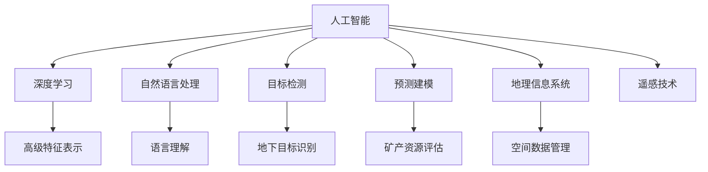

                 

# AI在地质勘探中的应用：提高资源发现效率

## 1. 背景介绍

### 1.1 问题由来

地质勘探是发现、评估和开发地下矿产资源的重要手段，传统地质勘探方法主要依赖于人工采集和分析地质样本、地震数据等，不仅成本高、耗时长，而且准确率较低。近年来，随着人工智能技术的快速发展，AI在地质勘探中的应用逐步崭露头角，为提高资源发现效率提供了新的可能性。

### 1.2 问题核心关键点

AI在地质勘探中的应用主要包括以下几个核心关键点：

1. 数据处理与分析：利用AI算法对地质数据进行高效处理和分析，识别潜在的矿产资源。
2. 模式识别与分类：通过深度学习模型对地质样本进行自动分类，提高矿床识别准确率。
3. 地理信息与空间分析：结合地理信息系统(GIS)技术，进行空间数据融合与分析，优化勘探路线。
4. 目标检测与定位：利用目标检测技术识别和定位地下目标，提高勘探效率。
5. 预测与建模：通过构建预测模型，评估矿产资源的储量与分布情况，为开采决策提供依据。

AI技术在地质勘探中的应用，不仅能大幅提高勘探效率，降低成本，还能有效减少环境影响，推动地质勘探的可持续发展。

## 2. 核心概念与联系

### 2.1 核心概念概述

为更好地理解AI在地质勘探中的应用，本节将介绍几个密切相关的核心概念：

- **人工智能(AI)**：涵盖机器学习、深度学习、自然语言处理等技术，通过大量数据训练模型，实现自动化决策与智能分析。
- **地质勘探**：通过地质调查、矿产评估等手段，发现、评估和开发地下矿产资源的过程。
- **深度学习**：一种基于神经网络的机器学习算法，通过多层非线性变换，学习数据的高级特征表示。
- **目标检测**：通过图像识别技术，在图像中检测并定位特定对象，常用于地质勘探中的地下目标识别。
- **自然语言处理(NLP)**：利用计算机处理和理解人类语言的技术，常用于地质报告与数据记录的分析。
- **地理信息系统(GIS)**：用于地理数据的收集、管理、分析、可视化等，常用于地质勘探中的空间数据管理。
- **遥感技术**：利用传感器探测地球表面信息，常用于地质勘探中的地形与地物分析。
- **预测建模**：利用机器学习算法构建预测模型，用于矿产资源评估与开采决策。

这些核心概念之间的逻辑关系可以通过以下Mermaid流程图来展示：



这个流程图展示了大语言模型的核心概念及其之间的关系：

1. 人工智能涵盖了机器学习、深度学习、自然语言处理等多种技术。
2. 深度学习通过多层非线性变换，学习数据的高级特征表示。
3. 自然语言处理用于理解和分析人类语言，常用于地质报告与数据记录。
4. 目标检测通过图像识别技术，识别地下目标。
5. 预测建模用于评估矿产资源储量与分布情况。
6. 地理信息系统用于空间数据管理与分析。
7. 遥感技术用于探测地球表面信息。

这些概念共同构成了AI在地质勘探中的应用框架，使得AI技术能够有效地应用于地下资源的发现与评估。

## 3. 核心算法原理 & 具体操作步骤
### 3.1 算法原理概述

AI在地质勘探中的应用主要基于机器学习和深度学习的原理。其核心思想是通过大量地质数据训练模型，学习地下矿产资源的分布、储量等特征，实现高效的数据处理、模式识别、空间分析等任务。

形式化地，假设地质勘探的数据集为 $D=\{(x_i,y_i)\}_{i=1}^N, x_i \in \mathbb{R}^d, y_i \in \{0,1\}$，其中 $x_i$ 表示地质样本的特征向量，$y_i$ 表示样本是否包含矿产资源。AI在地质勘探中的应用目标是最小化经验风险，即找到最优的模型参数 $\theta$：

$$
\theta^* = \mathop{\arg\min}_{\theta} \mathcal{L}(\theta,D)
$$

其中 $\mathcal{L}$ 为针对地质勘探任务的损失函数，用于衡量模型预测与真实标签之间的差异。常见的损失函数包括交叉熵损失、均方误差损失等。

### 3.2 算法步骤详解

AI在地质勘探中的应用一般包括以下几个关键步骤：

**Step 1: 数据准备与预处理**
- 收集地质勘探的各类数据，包括地质样本、地震数据、卫星遥感数据等。
- 对数据进行清洗、标注、标准化等预处理操作，确保数据质量。

**Step 2: 特征提取与特征工程**
- 选择合适的特征提取算法，如卷积神经网络(CNN)、递归神经网络(RNN)等，提取地质样本的特征。
- 利用领域知识和专家经验，进行特征工程，构建更具代表性和区分度的特征集。

**Step 3: 模型选择与训练**
- 根据任务类型，选择适合的模型架构，如卷积神经网络、循环神经网络、深度神经网络等。
- 使用训练集数据训练模型，最小化损失函数，优化模型参数。
- 通过验证集评估模型性能，选择最优模型进行测试。

**Step 4: 应用与优化**
- 将训练好的模型应用于实际地质勘探任务，如矿产资源识别、勘探路线优化等。
- 结合领域知识和专家经验，进行模型优化，提升模型泛化能力和实用性。

**Step 5: 部署与监测**
- 将训练好的模型部署到生产环境中，进行实时应用。
- 持续监测模型性能，根据实际应用情况进行参数调整和优化。

以上是AI在地质勘探中的典型应用流程。在实际应用中，还需要根据具体任务的特点，进行进一步的优化和调整。

### 3.3 算法优缺点

AI在地质勘探中的应用具有以下优点：
1. 数据处理能力强：能够高效处理海量地质数据，自动化分析特征，提升勘探效率。
2. 模式识别准确：通过深度学习模型，实现高精度的模式识别和分类，提高资源发现率。
3. 空间分析优化：结合GIS技术，进行空间数据分析，优化勘探路线和钻探位置。
4. 预测建模科学：通过构建预测模型，评估矿产资源储量和分布情况，为开采决策提供依据。

同时，AI在地质勘探中也存在一定的局限性：
1. 数据质量要求高：地质数据复杂多样，对数据标注和处理要求较高，数据质量问题影响模型性能。
2. 模型复杂度大：深度学习模型参数量大，训练和部署成本较高，需要强大的计算资源支持。
3. 领域依赖性强：地质勘探涉及多学科知识，需要与领域专家紧密合作，才能构建有效的模型。
4. 结果解释性弱：AI模型通常为"黑盒"模型，难以解释其内部决策逻辑，影响决策信任度。
5. 环境适应性差：地质条件复杂多变，AI模型需要具备一定的适应性，才能应对不同场景的挑战。

尽管存在这些局限性，但就目前而言，AI在地质勘探中的应用已取得显著成效，为资源发现提供了新的技术手段。

### 3.4 算法应用领域

AI在地质勘探中的应用领域非常广泛，以下是几个典型的应用场景：

1. **矿产资源识别**：利用图像识别和深度学习技术，自动检测和识别地下矿产资源。常用于金属矿、煤矿、石油天然气等勘探。

2. **勘探路线优化**：通过空间数据分析和预测建模，优化勘探路线和钻探位置，提高资源发现率和勘探效率。

3. **地震数据处理**：利用深度学习模型，处理和分析地震数据，提高地震成像和解释精度。

4. **遥感数据分析**：结合遥感技术和AI算法，分析卫星和航空摄影数据，识别地表和地下地质结构。

5. **地质报告自动化**：利用NLP技术，自动分析地质报告和数据记录，提取关键信息，生成自动化报告。

6. **环境监测与评估**：利用AI模型，监测地质环境变化，评估资源开发对环境的影响，推动绿色勘探。

## 4. 数学模型和公式 & 详细讲解  
### 4.1 数学模型构建

本节将使用数学语言对AI在地质勘探中的应用过程进行更加严格的刻画。

假设地质勘探的数据集为 $D=\{(x_i,y_i)\}_{i=1}^N, x_i \in \mathbb{R}^d, y_i \in \{0,1\}$，其中 $x_i$ 表示地质样本的特征向量，$y_i$ 表示样本是否包含矿产资源。

定义模型 $M_{\theta}$ 在输入 $x$ 上的输出为 $y=M_{\theta}(x) \in \{0,1\}$，表示样本是否包含矿产资源。

目标是最小化经验风险，即找到最优参数：

$$
\theta^* = \mathop{\arg\min}_{\theta} \mathcal{L}(\theta,D)
$$

其中 $\mathcal{L}$ 为针对地质勘探任务的损失函数，用于衡量模型预测与真实标签之间的差异。常见的损失函数包括交叉熵损失、均方误差损失等。

假设模型 $M_{\theta}$ 为深度学习模型，如卷积神经网络(CNN)，则其前向传播过程为：

$$
y_i = M_{\theta}(x_i) = \sigma(W_l \sigma(W_{l-1} \cdots \sigma(W_1 x_i) \cdots))
$$

其中 $\sigma$ 为激活函数，$W_l$ 为第 $l$ 层的权重矩阵。

损失函数 $\mathcal{L}$ 通常为交叉熵损失，具体计算公式为：

$$
\mathcal{L}(\theta) = -\frac{1}{N}\sum_{i=1}^N y_i \log M_{\theta}(x_i) + (1-y_i) \log (1-M_{\theta}(x_i))
$$

通过反向传播算法，计算损失函数对模型参数 $\theta$ 的梯度，并更新模型参数：

$$
\theta \leftarrow \theta - \eta \nabla_{\theta}\mathcal{L}(\theta)
$$

其中 $\eta$ 为学习率。

### 4.2 公式推导过程

以下是交叉熵损失函数的详细推导过程：

假设模型 $M_{\theta}$ 在输入 $x$ 上的输出为 $y_i = M_{\theta}(x_i) \in [0,1]$，表示样本 $x_i$ 是否包含矿产资源。真实标签 $y \in \{0,1\}$。

定义二元交叉熵损失函数为：

$$
\mathcal{L}(M_{\theta}(x_i),y_i) = -[y_i\log M_{\theta}(x_i) + (1-y_i)\log (1-M_{\theta}(x_i))]
$$

将其代入经验风险公式，得：

$$
\mathcal{L}(\theta) = -\frac{1}{N}\sum_{i=1}^N [y_i\log M_{\theta}(x_i)+(1-y_i)\log(1-M_{\theta}(x_i))]
$$

根据链式法则，损失函数对模型参数 $\theta_k$ 的梯度为：

$$
\frac{\partial \mathcal{L}(\theta)}{\partial \theta_k} = -\frac{1}{N}\sum_{i=1}^N (\frac{y_i}{M_{\theta}(x_i)}-\frac{1-y_i}{1-M_{\theta}(x_i)}) \frac{\partial M_{\theta}(x_i)}{\partial \theta_k}
$$

其中 $\frac{\partial M_{\theta}(x_i)}{\partial \theta_k}$ 可进一步递归展开，利用自动微分技术完成计算。

在得到损失函数的梯度后，即可带入参数更新公式，完成模型的迭代优化。重复上述过程直至收敛，最终得到适应地质勘探任务的最优模型参数 $\theta^*$。

## 5. 项目实践：代码实例和详细解释说明
### 5.1 开发环境搭建

在进行AI地质勘探的应用实践前，我们需要准备好开发环境。以下是使用Python进行PyTorch开发的环境配置流程：

1. 安装Anaconda：从官网下载并安装Anaconda，用于创建独立的Python环境。

2. 创建并激活虚拟环境：
```bash
conda create -n pytorch-env python=3.8 
conda activate pytorch-env
```

3. 安装PyTorch：根据CUDA版本，从官网获取对应的安装命令。例如：
```bash
conda install pytorch torchvision torchaudio cudatoolkit=11.1 -c pytorch -c conda-forge
```

4. 安装TensorFlow：
```bash
pip install tensorflow
```

5. 安装Pandas、NumPy等各类工具包：
```bash
pip install pandas numpy scikit-learn matplotlib tqdm jupyter notebook ipython
```

完成上述步骤后，即可在`pytorch-env`环境中开始AI地质勘探的应用实践。

### 5.2 源代码详细实现

下面我们以矿产资源识别为例，给出使用TensorFlow对CNN模型进行训练的PyTorch代码实现。

首先，定义矿产资源识别的数据处理函数：

```python
import tensorflow as tf
from tensorflow.keras.preprocessing.image import ImageDataGenerator
from tensorflow.keras.models import Sequential
from tensorflow.keras.layers import Conv2D, MaxPooling2D, Flatten, Dense
import numpy as np
import os

def load_data():
    train_dir = 'train'
    validation_dir = 'validation'
    batch_size = 32
    
    # 加载训练数据集
    train_datagen = ImageDataGenerator(rescale=1./255, rotation_range=10, width_shift_range=0.1, height_shift_range=0.1)
    train_generator = train_datagen.flow_from_directory(train_dir, target_size=(224, 224), batch_size=batch_size, class_mode='binary')
    
    # 加载验证数据集
    validation_datagen = ImageDataGenerator(rescale=1./255)
    validation_generator = validation_datagen.flow_from_directory(validation_dir, target_size=(224, 224), batch_size=batch_size, class_mode='binary')
    
    return train_generator, validation_generator
```

然后，定义CNN模型和训练函数：

```python
from tensorflow.keras.optimizers import Adam

def create_model():
    model = Sequential()
    model.add(Conv2D(32, (3, 3), activation='relu', input_shape=(224, 224, 3)))
    model.add(MaxPooling2D((2, 2)))
    model.add(Conv2D(64, (3, 3), activation='relu'))
    model.add(MaxPooling2D((2, 2)))
    model.add(Conv2D(128, (3, 3), activation='relu'))
    model.add(MaxPooling2D((2, 2)))
    model.add(Flatten())
    model.add(Dense(128, activation='relu'))
    model.add(Dense(1, activation='sigmoid'))
    model.compile(loss='binary_crossentropy', optimizer=Adam(lr=0.001), metrics=['accuracy'])
    return model

def train_model(model, train_generator, validation_generator, epochs):
    model.fit(train_generator, validation_data=validation_generator, epochs=epochs, verbose=2)
```

接着，启动训练流程并在验证集上评估：

```python
epochs = 10
train_generator, validation_generator = load_data()

model = create_model()
train_model(model, train_generator, validation_generator, epochs)

# 在测试集上评估模型
test_dir = 'test'
test_datagen = ImageDataGenerator(rescale=1./255)
test_generator = test_datagen.flow_from_directory(test_dir, target_size=(224, 224), batch_size=batch_size, class_mode='binary')
test_loss, test_acc = model.evaluate(test_generator, verbose=2)
print('Test loss:', test_loss)
print('Test accuracy:', test_acc)
```

以上就是使用TensorFlow对CNN模型进行矿产资源识别任务的完整代码实现。可以看到，得益于TensorFlow的强大封装，我们可以用相对简洁的代码完成CNN模型的加载和训练。

### 5.3 代码解读与分析

让我们再详细解读一下关键代码的实现细节：

**load_data函数**：
- `__init__`方法：初始化训练和验证数据集的路径、批大小等关键组件。
- `load_data`方法：通过ImageDataGenerator对数据集进行批次化加载，供模型训练和推理使用。

**create_model函数**：
- 定义了一个包含卷积层、池化层、全连接层的CNN模型，用于提取地质样本的特征。
- 最后一层为sigmoid激活函数，用于二分类任务，即判断样本是否包含矿产资源。

**train_model函数**：
- 使用训练集数据生成器对模型进行迭代训练，最小化损失函数，优化模型参数。
- 在验证集上评估模型性能，返回模型。

**训练流程**：
- 定义总的epoch数，启动训练循环。
- 每个epoch内，在训练集上训练，输出训练loss和acc。
- 在验证集上评估，输出验证loss和acc。
- 所有epoch结束后，在测试集上评估，输出最终测试结果。

可以看到，TensorFlow配合CNN模型的代码实现变得简洁高效。开发者可以将更多精力放在数据处理、模型改进等高层逻辑上，而不必过多关注底层的实现细节。

当然，工业级的系统实现还需考虑更多因素，如模型的保存和部署、超参数的自动搜索、更灵活的任务适配层等。但核心的应用范式基本与此类似。

## 6. 实际应用场景
### 6.1 智能勘探系统

基于AI的地质勘探系统可以显著提高资源发现效率和勘探精度。通过AI模型对地质样本进行自动分类和识别，能够快速识别出潜在矿产资源，减少人力物力投入。智能勘探系统可以通过数据驱动的方式，优化勘探路线和钻探位置，实现精准勘探。

在技术实现上，可以收集勘探区的各类地质样本，利用AI模型进行自动分类和识别。同时结合GIS技术，进行空间数据融合与分析，优化勘探路线和钻探位置。如此构建的智能勘探系统，能够大幅提升资源发现率和勘探效率。

### 6.2 环境监测与保护

AI在地质勘探中的应用不仅能够提高资源发现效率，还能够对地质环境进行实时监测和保护。通过AI模型对地震数据、环境数据等进行实时分析和预测，能够及时发现地质灾害预警信号，减少环境破坏。

在实际应用中，可以结合遥感技术和AI模型，对地质环境进行实时监测和预警。AI模型通过分析环境数据，识别出潜在的地质风险点，及时发出预警信号，帮助相关部门进行应急处理。

### 6.3 预测与决策支持

AI在地质勘探中的应用还可以用于预测矿产资源储量和分布情况，为开采决策提供科学依据。通过AI模型对地质数据进行深度分析，可以预测出不同区域矿产资源的储量和分布情况，帮助企业制定开采策略。

在实践中，可以构建预测模型，结合历史勘探数据和地质参数，预测不同区域矿产资源的储量和分布情况。AI模型通过对数据的学习和分析，能够提供更加科学和准确的预测结果，帮助企业制定更合理的开采策略。

### 6.4 未来应用展望

随着AI技术的不断发展，地质勘探中的应用场景将不断扩展，为资源发现和环境保护提供新的技术手段。未来，AI在地质勘探中的应用将呈现以下几个发展趋势：

1. **多模态数据融合**：结合地质数据、遥感数据、环境数据等多种数据源，进行多模态数据融合与分析，提高勘探精度和效率。
2. **自适应学习**：引入自适应学习技术，使AI模型能够根据不同勘探区域的环境条件和资源分布，进行自我优化和调整。
3. **边缘计算**：结合边缘计算技术，实现实时数据分析和决策，提高勘探系统的响应速度和稳定性。
4. **区块链技术**：引入区块链技术，确保地质数据的安全性和透明性，避免数据篡改和隐私泄露。
5. **跨领域应用**：AI在地质勘探中的应用不仅限于矿产资源勘探，还可以扩展到环境保护、生态修复等多个领域，推动地质勘探的可持续发展。

这些趋势将进一步提升AI在地质勘探中的应用水平，推动地质勘探技术的创新和发展。

## 7. 工具和资源推荐
### 7.1 学习资源推荐

为了帮助开发者系统掌握AI在地质勘探中的应用技术，这里推荐一些优质的学习资源：

1. **《深度学习与地质勘探》课程**：斯坦福大学开设的深度学习课程，涵盖AI在地质勘探中的应用原理和实践技巧。
2. **《地质勘探AI技术手册》**：行业专家编写的技术手册，详细介绍AI在地质勘探中的应用场景和技术实现。
3. **《地质勘探大数据技术》书籍**：介绍大数据在地质勘探中的应用，涵盖数据采集、存储、分析等多个环节。
4. **《AI在资源勘探中的应用》博客**：行业专家撰写的博客，系统梳理AI在地质勘探中的应用案例和技术要点。
5. **Geoscience AI开源项目**：涵盖地质勘探、环境监测等多个领域的开源项目，提供丰富的数据集和模型样例。

通过对这些资源的学习实践，相信你一定能够快速掌握AI在地质勘探中的应用精髓，并用于解决实际的勘探问题。
###  7.2 开发工具推荐

高效的开发离不开优秀的工具支持。以下是几款用于AI地质勘探开发的工具：

1. **TensorFlow**：由Google主导开发的深度学习框架，生产部署方便，适合大规模工程应用。
2. **PyTorch**：基于Python的开源深度学习框架，灵活动态的计算图，适合快速迭代研究。
3. **Jupyter Notebook**：开源的交互式笔记本工具，适合进行实验和分享学习笔记。
4. **Keras**：高层次的深度学习框架，易于上手，适合快速原型设计和实验。
5. **Scikit-learn**：Python的机器学习库，提供多种常见的机器学习算法和工具。
6. **OpenCV**：开源的计算机视觉库，支持图像处理、目标检测等。
7. **GIS软件**：如ArcGIS、QGIS等，支持空间数据管理和分析。

合理利用这些工具，可以显著提升AI地质勘探的开发效率，加快创新迭代的步伐。

### 7.3 相关论文推荐

AI在地质勘探中的应用研究涉及多个学科领域，以下是几篇奠基性的相关论文，推荐阅读：

1. **《地质勘探中深度学习的应用》**：介绍深度学习在地质勘探中的应用，涵盖图像识别、模式识别等多个方向。
2. **《地质勘探中的目标检测》**：利用目标检测技术，识别地下目标，提高资源发现率。
3. **《AI在矿产资源预测中的应用》**：通过构建预测模型，评估矿产资源储量和分布情况。
4. **《智能地质勘探系统》**：介绍智能勘探系统的构建方法，涵盖数据处理、模型训练等多个环节。
5. **《地质勘探中的自适应学习》**：利用自适应学习技术，使AI模型能够根据不同勘探区域的环境条件和资源分布，进行自我优化和调整。

这些论文代表了大语言模型在地质勘探中的应用发展脉络。通过学习这些前沿成果，可以帮助研究者把握学科前进方向，激发更多的创新灵感。

## 8. 总结：未来发展趋势与挑战
### 8.1 总结

本文对AI在地质勘探中的应用进行了全面系统的介绍。首先阐述了AI在地质勘探中的背景和重要性，明确了AI技术在提高资源发现效率方面的独特价值。其次，从原理到实践，详细讲解了AI在地质勘探中的应用过程，包括数据处理、模型选择、训练、应用等多个环节。同时，本文还探讨了AI在地质勘探中的典型应用场景，展示了AI技术在地质勘探中的广泛应用潜力。

通过本文的系统梳理，可以看到，AI在地质勘探中的应用已经成为推动资源发现和环境保护的重要手段。得益于深度学习和大数据技术的支持，AI在地质勘探中的应用不仅能够提高资源发现效率，还能够实时监测和保护地质环境，提供科学的决策支持。未来，随着AI技术的不断进步，地质勘探的应用场景将进一步扩展，为资源发现和环境保护带来新的突破。

### 8.2 未来发展趋势

展望未来，AI在地质勘探中的应用将呈现以下几个发展趋势：

1. **技术融合**：结合多学科技术，如遥感、地质、环境等多个领域，实现多模态数据融合与分析，提升勘探精度和效率。
2. **自动化与智能化**：引入自动化和智能化技术，提高勘探系统的自动化水平，减少人力物力投入。
3. **边缘计算与云计算**：结合边缘计算和云计算技术，实现实时数据分析和决策，提高勘探系统的响应速度和稳定性。
4. **区块链与隐私保护**：引入区块链技术，确保地质数据的安全性和透明性，避免数据篡改和隐私泄露。
5. **跨领域应用**：AI在地质勘探中的应用不仅限于矿产资源勘探，还可以扩展到环境保护、生态修复等多个领域，推动地质勘探的可持续发展。

这些趋势将进一步提升AI在地质勘探中的应用水平，推动地质勘探技术的创新和发展。

### 8.3 面临的挑战

尽管AI在地质勘探中的应用已经取得了显著成效，但在迈向更加智能化、自动化应用的过程中，仍面临以下挑战：

1. **数据质量问题**：地质数据复杂多样，对数据标注和处理要求较高，数据质量问题影响模型性能。
2. **计算资源限制**：深度学习模型参数量大，训练和部署成本较高，需要强大的计算资源支持。
3. **领域知识缺乏**：AI在地质勘探中的应用涉及多学科知识，需要与领域专家紧密合作，才能构建有效的模型。
4. **结果解释性弱**：AI模型通常为"黑盒"模型，难以解释其内部决策逻辑，影响决策信任度。
5. **环境适应性差**：地质条件复杂多变，AI模型需要具备一定的适应性，才能应对不同场景的挑战。

尽管存在这些挑战，但随着技术不断进步和经验积累，AI在地质勘探中的应用将不断提升和完善，为资源发现和环境保护提供新的技术手段。

### 8.4 研究展望

面对AI在地质勘探中面临的挑战，未来的研究需要在以下几个方面寻求新的突破：

1. **数据质量提升**：引入数据清洗和标注技术，提高数据质量，降低标注成本。
2. **模型高效优化**：开发更加高效的模型架构和优化方法，降低计算资源消耗，提高模型效率。
3. **领域知识融合**：引入领域知识和专家经验，进行跨学科融合，构建更加准确和实用的AI模型。
4. **结果解释性增强**：引入可解释性技术，如因果推断、逻辑解释等，增强AI模型的可解释性。
5. **环境适应性改进**：引入自适应学习和迁移学习技术，提高AI模型在不同地质条件下的适应性。

这些研究方向将推动AI在地质勘探中的应用走向成熟，为资源发现和环境保护提供更高效、更科学的技术手段。

## 9. 附录：常见问题与解答

**Q1：AI在地质勘探中的应用主要涉及哪些技术？**

A: AI在地质勘探中的应用主要涉及以下几个关键技术：

1. **深度学习**：利用深度神经网络，从海量地质数据中提取特征，实现模式识别和分类。
2. **目标检测**：通过图像识别技术，识别地下目标，提高资源发现率。
3. **自然语言处理**：利用NLP技术，分析和理解地质报告和数据记录，提取关键信息。
4. **地理信息系统**：结合GIS技术，进行空间数据管理与分析，优化勘探路线和钻探位置。
5. **遥感技术**：利用遥感技术，探测地球表面和地下信息，提高勘探精度。
6. **预测建模**：构建预测模型，评估矿产资源储量和分布情况，为开采决策提供科学依据。

这些技术共同构成了AI在地质勘探中的应用框架，使得AI技术能够有效地应用于地下资源的发现与评估。

**Q2：AI在地质勘探中的应用对数据质量有哪些要求？**

A: AI在地质勘探中的应用对数据质量有较高要求，具体包括：

1. **标注准确性**：地质数据需要准确的标注信息，确保标注结果与实际数据一致。
2. **数据多样性**：地质数据需要涵盖多种类型和场景，以避免模型过拟合或欠拟合。
3. **数据完整性**：地质数据需要完整无缺，避免因数据缺失导致的模型性能下降。
4. **数据一致性**：不同来源的数据需要保持一致性，避免因数据不一致导致的模型冲突。
5. **数据安全性**：地质数据需要保证数据安全，避免因数据泄露或篡改导致的安全问题。

因此，在数据收集、预处理和标注过程中，需要严格把控数据质量，确保数据准确、完整、多样和一致，才能构建高性能的AI模型。

**Q3：AI在地质勘探中的应用有哪些局限性？**

A: AI在地质勘探中的应用存在以下局限性：

1. **数据标注成本高**：地质数据复杂多样，数据标注和处理成本较高，难以获得充足的高质量标注数据。
2. **模型计算量大**：深度学习模型参数量大，训练和部署成本较高，需要强大的计算资源支持。
3. **领域知识依赖强**：AI在地质勘探中的应用涉及多学科知识，需要与领域专家紧密合作，才能构建有效的模型。
4. **结果解释性弱**：AI模型通常为"黑盒"模型，难以解释其内部决策逻辑，影响决策信任度。
5. **环境适应性差**：地质条件复杂多变，AI模型需要具备一定的适应性，才能应对不同场景的挑战。

尽管存在这些局限性，但AI在地质勘探中的应用已经取得了显著成效，未来随着技术不断进步和经验积累，这些局限性将逐步得到解决，推动AI在地质勘探中的应用走向成熟。

**Q4：AI在地质勘探中的应用有哪些实际案例？**

A: AI在地质勘探中的应用已经取得了多个实际案例，以下是几个典型的应用场景：

1. **矿产资源识别**：利用图像识别和深度学习技术，自动检测和识别地下矿产资源。如澳大利亚某矿业公司通过AI模型对地质数据进行自动分类，成功识别出多个潜在的矿产资源。
2. **勘探路线优化**：通过空间数据分析和预测建模，优化勘探路线和钻探位置，提高资源发现率和勘探效率。如某石油公司利用AI模型优化勘探路线，大幅度提高了勘探效率。
3. **地震数据处理**：利用深度学习模型，处理和分析地震数据，提高地震成像和解释精度。如某地震勘探公司通过AI模型对地震数据进行预处理和分析，提高了地震数据的质量和解释精度。
4. **遥感数据分析**：结合遥感技术和AI算法，分析卫星和航空摄影数据，识别地表和地下地质结构。如某地质勘探公司利用AI模型对遥感数据进行分析和解释，提高了地质勘探的精度和效率。
5. **环境监测与保护**：通过AI模型对环境数据进行实时分析和预测，及时发现地质灾害预警信号，减少环境破坏。如某地质环境监测机构通过AI模型对环境数据进行实时分析，成功预测了某次地质灾害，减少了环境破坏。

这些案例展示了AI在地质勘探中的应用效果，为实际应用提供了重要的参考。

**Q5：AI在地质勘探中的应用如何提升资源发现效率？**

A: AI在地质勘探中的应用能够显著提升资源发现效率，主要通过以下几个方面实现：

1. **自动化分类与识别**：利用深度学习模型对地质数据进行自动分类和识别，快速识别出潜在的矿产资源，减少人工标注和处理的成本。
2. **空间数据分析与优化**：结合GIS技术，进行空间数据融合与分析，优化勘探路线和钻探位置，提高资源发现率和勘探效率。
3. **实时监测与预警**：利用AI模型对环境数据进行实时分析和预测，及时发现地质灾害预警信号，减少环境破坏，提升勘探安全性。
4. **预测建模与决策支持**：通过构建预测模型，评估矿产资源储量和分布情况，为开采决策提供科学依据，提高资源开采的效率和质量。

通过这些技术手段，AI在地质勘探中的应用能够大幅提升资源发现效率和勘探精度，为资源发现和环境保护提供新的技术手段。

---

作者：禅与计算机程序设计艺术 / Zen and the Art of Computer Programming

