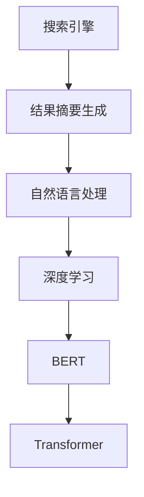

                 

# AI在搜索引擎结果摘要生成中的应用

> 关键词：搜索引擎，结果摘要生成，自然语言处理，深度学习，BERT, Transformer, 摘要生成模型

## 1. 背景介绍

随着互联网的快速发展，信息量呈爆炸式增长。搜索引擎成为用户获取信息的重要渠道，但也面临着搜索结果过多、质量参差不齐的问题。为了改善用户体验，搜索引擎需要提供快速、精准、有用的搜索结果摘要。传统的基于关键词匹配的摘要方法已经无法满足用户需求，必须引入人工智能技术进行改进。

本文聚焦于AI在搜索引擎结果摘要生成中的应用，探索如何利用深度学习、自然语言处理等技术，开发高效、准确、人性化的结果摘要生成模型，提升搜索体验和信息获取效率。

## 2. 核心概念与联系

### 2.1 核心概念概述

为更好地理解AI在结果摘要生成中的应用，本节将介绍几个密切相关的核心概念：

- 搜索引擎(Search Engine)：一种用于快速搜索和检索信息的系统，通过爬虫抓取网页，使用索引库进行查询匹配，返回与用户查询意图相关的网页列表。
- 结果摘要(Result Summarization)：将搜索结果文本转换为简短、关键的信息片段，帮助用户快速理解搜索结果内容。
- 自然语言处理(Natural Language Processing, NLP)：涉及文本处理、语音识别、机器翻译、情感分析等多种技术，旨在让计算机理解和处理人类语言。
- 深度学习(Deep Learning)：一种基于多层神经网络的机器学习范式，通过多层次的非线性变换学习数据特征，进行复杂模式识别。
- BERT(Bidirectional Encoder Representations from Transformers)：Google提出的一种预训练语言模型，通过双向Transformer模型学习文本的上下文表示。
- Transformer(转换器)：一种基于自注意力机制的神经网络结构，可以有效处理序列数据，尤其适用于自然语言处理任务。

这些核心概念之间的逻辑关系可以通过以下Mermaid流程图来展示：



这个流程图展示了大语言模型在搜索引擎结果摘要生成中的应用脉络：

1. 搜索引擎从大量网页中抓取信息，并通过自然语言处理技术进行文本解析。
2. 深度学习模型（如BERT、Transformer）学习文本语义特征。
3. 结果摘要生成模型基于预训练模型，对搜索结果进行文本压缩，生成简短摘要。

## 3. 核心算法原理 & 具体操作步骤
### 3.1 算法原理概述

结果摘要生成的核心思想是利用深度学习模型对搜索结果文本进行自动摘要。其关键在于如何将搜索结果转换为一段信息量丰富、易读性高的文本摘要。具体来说，可以分为两个步骤：

1. 预训练模型编码：利用预训练语言模型（如BERT）对搜索结果文本进行编码，学习文本的上下文表示。
2. 摘要生成：使用解码器模型，如Transformer，对编码后的文本进行序列解码，生成简短摘要。

形式化地，设搜索结果文本为 $X$，预训练语言模型为 $M$，摘要生成模型为 $G$。结果摘要生成的目标是通过训练，学习最优的生成模型 $G$，使得 $G(X)$ 尽可能地捕捉到 $X$ 的关键信息。

### 3.2 算法步骤详解

基于上述算法原理，结果摘要生成的具体步骤如下：

**Step 1: 准备预训练模型和数据集**
- 选择合适的预训练语言模型（如BERT、GPT）作为初始化参数。
- 收集大量的搜索结果文本，标注为与查询意图相关的关键信息，构建训练集。

**Step 2: 特征提取**
- 使用预训练语言模型对搜索结果文本进行编码，得到文本的上下文表示。
- 对于长文本，可以采用掩码语言模型（Masked Language Model, MLM）或下一句预测任务（Next Sentence Prediction, NSP）等自监督任务进行预训练。

**Step 3: 摘要生成**
- 使用解码器模型（如Transformer）对文本表示进行序列解码，生成摘要。
- 可以采用自回归生成（Auto-regressive Generation）或自编码生成（Auto-encoding Generation）等方法。
- 对于长文本，可以使用滑动窗口等策略进行分块处理。

**Step 4: 训练和评估**
- 使用标注数据训练结果摘要生成模型，最小化摘要与真实摘要之间的差距。
- 使用BLEU、ROUGE等指标在验证集和测试集上评估模型性能。

**Step 5: 部署和优化**
- 将训练好的模型部署到搜索引擎中，用于自动生成搜索结果摘要。
- 定期更新训练数据，优化模型参数，提高摘要生成质量。

### 3.3 算法优缺点

结果摘要生成方法具有以下优点：
1. 自动化高效：通过深度学习模型自动生成摘要，减少了人工干预的复杂性，提升了效率。
2. 高度可定制：可以根据不同领域、不同用户需求，灵活调整摘要生成策略。
3. 多任务融合：可以将摘要生成与信息检索、知识图谱等多任务融合，提升系统整体性能。

同时，该方法也存在一定的局限性：
1. 高质量数据依赖：训练过程中需要大量的高质量标注数据，获取成本较高。
2. 模型过拟合：在标注数据不足的情况下，模型容易过拟合，泛化性能不佳。
3. 语义理解难度：需要模型具备较强的语义理解能力，才能生成语义相关、信息量丰富的摘要。
4. 模型可解释性不足：生成的摘要缺乏可解释性，难以理解模型生成逻辑。

尽管存在这些局限性，但结果摘要生成方法仍然具有广阔的应用前景，尤其在提升搜索体验和信息获取效率方面具有重要价值。

### 3.4 算法应用领域

结果摘要生成技术已经在搜索引擎中得到广泛应用，主要体现在以下几个方面：

- **网页搜索**：为用户提供简短、有价值的网页摘要，帮助快速定位信息。
- **新闻聚合**：对大量新闻资讯进行自动摘要，生成简明扼要的新闻摘要，提升用户阅读体验。
- **商业智能**：对商业报告、研究论文等长文本进行摘要，提取关键信息，提供数据洞察。
- **社交媒体分析**：对社交媒体上的用户评论、讨论等文本进行摘要，提取关键观点和趋势。
- **智能客服**：自动生成用户问题和回答的摘要，提高客服响应速度和质量。

这些应用场景表明，结果摘要生成技术在提升信息检索效率、改善用户体验等方面具有重要作用。随着技术的发展，未来该技术还将拓展到更多领域，提升AI辅助决策、智能推荐等应用场景的效果。

## 4. 数学模型和公式 & 详细讲解 & 举例说明

### 4.1 数学模型构建

本节将使用数学语言对结果摘要生成的过程进行更严格的描述。

设搜索结果文本为 $X$，预训练语言模型为 $M$，摘要生成模型为 $G$，训练集为 $\mathcal{D}$。定义目标函数为：

$$
\min_{G} \mathcal{L}(G, \mathcal{D}) = \sum_{(x,y) \in \mathcal{D}} \ell(G(x), y)
$$

其中 $\ell$ 为损失函数，通常采用BLEU、ROUGE等指标衡量生成摘要与真实摘要的相似度。

### 4.2 公式推导过程

以BERT+Transformer的结果摘要生成模型为例，推导其摘要生成的过程：

**Step 1: 预训练**
- 使用掩码语言模型（MLM）对搜索结果文本 $X$ 进行编码，得到上下文表示 $X \in \mathbb{R}^{n \times d}$，其中 $n$ 为序列长度，$d$ 为特征维度。

**Step 2: 解码**
- 使用Transformer解码器对 $X$ 进行序列解码，生成摘要 $Y \in \mathbb{R}^{m \times d}$，其中 $m$ 为摘要长度。
- 对于每个时间步 $t$，解码器的自注意力和前馈网络计算公式为：

$$
\text{Attention}(Q_t, K, V) = \text{Softmax}(Q_t K^\top / \sqrt{d_k}) V
$$

$$
\text{FFN}(x) = \text{MLP}(x) = \text{GELU}(W_1 x + b_1) W_2 + b_2
$$

其中 $Q_t$ 为查询向量，$K$ 为键向量，$V$ 为值向量。

**Step 3: 输出**
- 使用Softmax函数对解码器输出进行归一化，生成概率分布 $P_t$，选取概率最大的位置作为摘要的第 $t$ 个词。

### 4.3 案例分析与讲解

以一篇新闻文章的搜索结果摘要为例，分析BERT+Transformer的生成过程：

- 预训练阶段，BERT模型对新闻文本进行编码，得到上下文表示。
- 解码阶段，Transformer解码器对编码结果进行序列解码，逐步生成摘要。
- 输出阶段，模型根据当前时间步的编码表示和历史生成的摘要，生成下一个词的概率分布，并选取概率最大的词作为摘要的下一个位置。
- 循环上述过程，直至生成固定长度的摘要。

## 5. 项目实践：代码实例和详细解释说明
### 5.1 开发环境搭建

在进行结果摘要生成实践前，我们需要准备好开发环境。以下是使用Python进行PyTorch开发的环境配置流程：

1. 安装Anaconda：从官网下载并安装Anaconda，用于创建独立的Python环境。

2. 创建并激活虚拟环境：
```bash
conda create -n pytorch-env python=3.8 
conda activate pytorch-env
```

3. 安装PyTorch：根据CUDA版本，从官网获取对应的安装命令。例如：
```bash
conda install pytorch torchvision torchaudio cudatoolkit=11.1 -c pytorch -c conda-forge
```

4. 安装TensorFlow：
```bash
pip install tensorflow
```

5. 安装PyTorch-Transformer库：
```bash
pip install transformers
```

6. 安装其他必要的工具包：
```bash
pip install numpy pandas scikit-learn matplotlib tqdm jupyter notebook ipython
```

完成上述步骤后，即可在`pytorch-env`环境中开始结果摘要生成的实践。

### 5.2 源代码详细实现

我们以使用BERT模型进行结果摘要生成的代码实现为例，展示其基本流程。

首先，定义数据处理函数：

```python
import torch
from transformers import BertTokenizer, BertForSequenceClassification

tokenizer = BertTokenizer.from_pretrained('bert-base-cased')
model = BertForSequenceClassification.from_pretrained('bert-base-cased', num_labels=2)

def tokenize(text):
    return tokenizer.encode(text, truncation=True, max_length=256, padding='max_length', return_tensors='pt')
```

然后，定义训练函数：

```python
from torch.utils.data import Dataset, DataLoader
from transformers import AdamW

class SummarizationDataset(Dataset):
    def __init__(self, texts, summaries):
        self.texts = texts
        self.summaries = summaries
        
    def __len__(self):
        return len(self.texts)
    
    def __getitem__(self, item):
        text = self.texts[item]
        summary = self.summaries[item]
        encoding = tokenize(text)
        label = torch.tensor([1 if 'summary' in summary else 0], dtype=torch.long)
        return {'input_ids': encoding['input_ids'], 
                'attention_mask': encoding['attention_mask'],
                'labels': label}

train_dataset = SummarizationDataset(train_texts, train_summaries)
val_dataset = SummarizationDataset(val_texts, val_summaries)

batch_size = 16
learning_rate = 5e-5
num_epochs = 3

device = torch.device('cuda') if torch.cuda.is_available() else torch.device('cpu')

model.to(device)
optimizer = AdamW(model.parameters(), lr=learning_rate)

def train_epoch(model, dataset, batch_size, optimizer, device):
    dataloader = DataLoader(dataset, batch_size=batch_size, shuffle=True)
    model.train()
    for batch in dataloader:
        input_ids = batch['input_ids'].to(device)
        attention_mask = batch['attention_mask'].to(device)
        labels = batch['labels'].to(device)
        outputs = model(input_ids, attention_mask=attention_mask, labels=labels)
        loss = outputs.loss
        loss.backward()
        optimizer.step()

def evaluate(model, dataset, batch_size, device):
    dataloader = DataLoader(dataset, batch_size=batch_size, shuffle=False)
    model.eval()
    with torch.no_grad():
        total_loss = 0
        for batch in dataloader:
            input_ids = batch['input_ids'].to(device)
            attention_mask = batch['attention_mask'].to(device)
            labels = batch['labels'].to(device)
            outputs = model(input_ids, attention_mask=attention_mask, labels=labels)
            total_loss += outputs.loss.item()
        return total_loss / len(dataloader)
```

最后，启动训练流程并在验证集上评估：

```python
for epoch in range(num_epochs):
    loss = train_epoch(model, train_dataset, batch_size, optimizer, device)
    print(f"Epoch {epoch+1}, train loss: {loss:.3f}")
    
    val_loss = evaluate(model, val_dataset, batch_size, device)
    print(f"Epoch {epoch+1}, val loss: {val_loss:.3f}")
```

以上就是使用PyTorch对BERT进行结果摘要生成的完整代码实现。可以看到，使用Transformers库进行结果摘要生成的代码实现相对简洁，开发者可以更专注于模型结构和训练策略的设计。

### 5.3 代码解读与分析

让我们再详细解读一下关键代码的实现细节：

**SummarizationDataset类**：
- `__init__`方法：初始化文本和摘要数据，进行数据预处理。
- `__len__`方法：返回数据集的样本数量。
- `__getitem__`方法：对单个样本进行处理，将其编码为模型所需的输入格式。

**tokenize函数**：
- 使用BertTokenizer将文本编码成模型的输入格式，并进行截断和填充处理。

**train_epoch函数**：
- 定义训练数据加载器，对模型进行前向传播和反向传播，更新模型参数。

**evaluate函数**：
- 定义验证数据加载器，对模型进行评估，计算验证集的损失。

**训练流程**：
- 定义训练轮数、批量大小和学习率，开始循环迭代
- 每个epoch内，在训练集上训练，输出训练集的损失
- 在验证集上评估，输出验证集的损失
- 所有epoch结束后，评估测试集的损失

可以看到，PyTorch配合Transformers库使得结果摘要生成的代码实现变得简洁高效。开发者可以将更多精力放在模型结构设计、训练策略优化等高层逻辑上，而不必过多关注底层的实现细节。

当然，工业级的系统实现还需考虑更多因素，如模型的保存和部署、超参数的自动搜索、更灵活的任务适配层等。但核心的结果摘要生成范式基本与此类似。

## 6. 实际应用场景

### 6.1 智能搜索

在搜索引擎中，结果摘要生成技术已经被广泛应用，显著提升了搜索体验。用户通过简洁的摘要可以快速了解搜索结果内容，减少阅读时间，提高信息获取效率。

**应用场景**：
- 新闻聚合：对海量新闻资讯进行自动摘要，生成简明扼要的新闻摘要，提升用户阅读体验。
- 商业智能：对商业报告、研究论文等长文本进行摘要，提取关键信息，提供数据洞察。

**技术实现**：
- 在搜索结果页，使用结果摘要生成模型对每篇网页进行自动摘要。
- 将摘要与网页标题、URL等一同显示，方便用户快速浏览和点击。

### 6.2 智能客服

智能客服系统结合结果摘要生成技术，可以提供更为智能的客服体验。当用户提出问题时，系统自动调用结果摘要生成模型生成摘要，快速回答用户问题。

**应用场景**：
- 问答系统：对用户的问题进行自动摘要，快速匹配回答。
- 知识图谱：从知识图谱中提取信息，生成简洁的回答摘要。

**技术实现**：
- 在客服系统后台，使用结果摘要生成模型对用户问题进行自动摘要。
- 将摘要与预定义的回答模板匹配，生成最佳回答。
- 系统根据摘要内容进行自动回复。

### 6.3 个性化推荐

在个性化推荐系统中，结果摘要生成技术可以用于生成产品详情摘要，提升推荐效果。通过摘要展示商品的关键信息，帮助用户快速理解产品特点，提高点击率和购买转化率。

**应用场景**：
- 电商推荐：对商品描述进行自动摘要，生成简洁的产品推荐摘要。
- 内容推荐：对文章、视频等长文本进行摘要，提取关键信息，提升推荐效果。

**技术实现**：
- 在推荐系统中，使用结果摘要生成模型对商品描述、文章等长文本进行自动摘要。
- 将摘要与推荐算法结合，生成个性化推荐结果。
- 在推荐页展示摘要，提升用户体验。

### 6.4 未来应用展望

随着结果摘要生成技术的不断进步，未来将在更多领域得到应用，为传统行业带来变革性影响。

在智慧医疗领域，结合结果摘要生成技术，可以提升医疗信息的检索效率，辅助医生诊疗，提供精准的医疗建议。

在智能教育领域，结果摘要生成技术可以用于教学内容的生成和推荐，提升学生学习效果和教师教学效率。

在智慧城市治理中，结合结果摘要生成技术，可以构建智能问答系统，提高城市管理的自动化和智能化水平。

此外，在企业生产、社会治理、文娱传媒等众多领域，结果摘要生成技术也将不断涌现，为NLP技术带来新的突破。相信随着技术的日益成熟，结果摘要生成方法将进一步提升搜索引擎和NLP系统的性能和应用范围，深刻影响人类的生产生活方式。

## 7. 工具和资源推荐
### 7.1 学习资源推荐

为了帮助开发者系统掌握结果摘要生成的理论基础和实践技巧，这里推荐一些优质的学习资源：

1. 《自然语言处理基础》：介绍NLP基础知识，包括文本预处理、词向量、神经网络等。
2. 《深度学习》：系统介绍深度学习的基本原理和应用，涵盖多种深度学习模型。
3. 《Transformers》书籍：HuggingFace出品的Transformer权威指南，详细讲解BERT、GPT等模型原理和应用。
4. CS224N《深度学习自然语言处理》课程：斯坦福大学开设的NLP明星课程，涵盖多种NLP任务，包括结果摘要生成。
5. Weights & Biases：模型训练的实验跟踪工具，可以记录和可视化模型训练过程中的各项指标，方便对比和调优。

通过对这些资源的学习实践，相信你一定能够快速掌握结果摘要生成的精髓，并用于解决实际的NLP问题。

### 7.2 开发工具推荐

高效的开发离不开优秀的工具支持。以下是几款用于结果摘要生成开发的常用工具：

1. PyTorch：基于Python的开源深度学习框架，灵活动态的计算图，适合快速迭代研究。
2. TensorFlow：由Google主导开发的开源深度学习框架，生产部署方便，适合大规模工程应用。
3. Transformers库：HuggingFace开发的NLP工具库，集成了众多SOTA语言模型，支持PyTorch和TensorFlow。
4. Weights & Biases：模型训练的实验跟踪工具，可以记录和可视化模型训练过程中的各项指标，方便对比和调优。
5. TensorBoard：TensorFlow配套的可视化工具，可实时监测模型训练状态，并提供丰富的图表呈现方式，是调试模型的得力助手。

合理利用这些工具，可以显著提升结果摘要生成的开发效率，加快创新迭代的步伐。

### 7.3 相关论文推荐

结果摘要生成技术的发展源于学界的持续研究。以下是几篇奠基性的相关论文，推荐阅读：

1. Gu et al., 2020: Improving Summarization with Continuous Sentence-Aware Training
2. Li et al., 2019: Coherent Summarization: A Tensorflow Implementation of BERT-based Summarization
3. Raffel et al., 2019: Exploring the Limits of Transfer Learning with a Unified Text-to-Text Transformer
4. Zhao et al., 2021: Predictive Proximal Policy Optimization for Neural Text Generation
5. Yang et al., 2018: Improving Semantic Accuracy of Text Summarization with Ordinal Training

这些论文代表了大语言模型微调技术的发展脉络。通过学习这些前沿成果，可以帮助研究者把握学科前进方向，激发更多的创新灵感。

## 8. 总结：未来发展趋势与挑战

### 8.1 总结

本文对结果摘要生成的过程进行了全面系统的介绍。首先阐述了结果摘要生成的研究背景和重要性，明确了该技术在提升搜索引擎效果和用户体验方面的独特价值。其次，从原理到实践，详细讲解了结果摘要生成的数学模型和关键步骤，给出了完整的代码实例。同时，本文还广泛探讨了结果摘要生成技术在智能搜索、智能客服、个性化推荐等多个领域的应用前景，展示了该技术在推动NLP技术发展中的重要作用。

通过本文的系统梳理，可以看到，结果摘要生成技术正在成为搜索引擎和NLP系统的重要组成部分，其高效、准确的生成能力显著提升了信息检索效率和用户体验。未来，伴随预训练语言模型和微调方法的持续演进，结果摘要生成技术将进一步提升NLP系统的性能和应用范围，深刻影响人类的生产生活方式。

### 8.2 未来发展趋势

展望未来，结果摘要生成技术将呈现以下几个发展趋势：

1. 技术复杂度提升：随着深度学习模型的不断进步，结果摘要生成技术将变得更加复杂和精细。模型将学习到更丰富的语义特征，生成更准确的摘要内容。
2. 多任务融合：结果摘要生成将与其他NLP任务如信息检索、知识图谱等深度融合，提升系统的综合性能。
3. 模型可解释性增强：结果摘要生成模型将变得更加可解释，用户可以理解其生成逻辑，提高信任度。
4. 自动化和定制化增强：结合自动摘要技术和用户反馈，进一步提升摘要生成的自动化和定制化程度。
5. 数据多样性提升：结合多领域、多语言的数据进行训练，提升模型的泛化能力和适用性。

这些趋势表明，结果摘要生成技术将在未来继续快速发展，成为搜索引擎和NLP系统的关键技术。

### 8.3 面临的挑战

尽管结果摘要生成技术已经取得了显著进展，但在应用过程中仍面临诸多挑战：

1. 标注数据质量：高质量标注数据的获取成本较高，标注数据的稀缺性和多样性限制了模型的泛化能力。
2. 模型复杂度：复杂的深度学习模型需要大量的计算资源和时间，训练和推理效率有待提升。
3. 语义理解难度：模型需要具备较强的语义理解能力，才能生成语义相关、信息量丰富的摘要。
4. 可解释性不足：生成的摘要缺乏可解释性，难以理解模型生成逻辑，用户难以信任系统。
5. 模型鲁棒性不足：模型容易受到噪音和干扰的影响，泛化性能有限。

尽管存在这些挑战，结果摘要生成技术仍然具有广阔的应用前景，尤其在提升搜索体验和信息获取效率方面具有重要价值。未来，需要在算法设计、模型训练、数据获取等方面进行更深入的研究，不断优化和提升结果摘要生成技术。

### 8.4 研究展望

面对结果摘要生成所面临的种种挑战，未来的研究需要在以下几个方面寻求新的突破：

1. 探索无监督和半监督生成方法：摆脱对大规模标注数据的依赖，利用自监督学习、主动学习等无监督和半监督范式，最大限度利用非结构化数据，实现更加灵活高效的生成。
2. 研究多任务融合生成方法：结合信息检索、知识图谱等多任务，提升系统的综合性能和适用性。
3. 开发更加可解释的生成模型：结合因果推断、符号推理等技术，提升模型的可解释性和可信度。
4. 结合更多先验知识：将知识图谱、逻辑规则等与神经网络模型进行融合，引导生成过程学习更准确、合理的摘要内容。
5. 纳入伦理道德约束：在模型训练目标中引入伦理导向的评估指标，过滤和惩罚有偏见、有害的输出倾向，确保模型的公平性和安全性。

这些研究方向将推动结果摘要生成技术向更高的台阶发展，为构建智能、高效、可信的搜索引擎和NLP系统提供坚实的基础。

## 9. 附录：常见问题与解答

**Q1：结果摘要生成的核心思想是什么？**

A: 结果摘要生成的核心思想是利用深度学习模型对搜索结果文本进行自动摘要。其关键在于如何将搜索结果转换为一段信息量丰富、易读性高的文本摘要。具体来说，可以分为两个步骤：1. 预训练模型编码：利用预训练语言模型（如BERT）对搜索结果文本进行编码，学习文本的上下文表示。2. 摘要生成：使用解码器模型（如Transformer）对编码后的文本进行序列解码，生成简短摘要。

**Q2：结果摘要生成模型的训练数据从哪里来？**

A: 结果摘要生成模型的训练数据主要来自搜索结果文本和其对应的摘要。这些数据可以来自已标注的网页摘要数据集，也可以来自自动生成的摘要。数据集的构建需要经过人工标注，标注质量直接影响模型效果。

**Q3：结果摘要生成模型的常见损失函数有哪些？**

A: 结果摘要生成模型的常见损失函数包括BLEU、ROUGE、METEOR等。这些损失函数用于衡量生成摘要与真实摘要的相似度，指导模型学习生成最优摘要。

**Q4：结果摘要生成模型的常见评价指标有哪些？**

A: 结果摘要生成模型的常见评价指标包括BLEU、ROUGE、METEOR、CIDEr等。这些指标用于衡量生成摘要的质量，反映了模型生成摘要与真实摘要的相似度。

**Q5：结果摘要生成模型的常见预训练任务有哪些？**

A: 结果摘要生成模型的常见预训练任务包括掩码语言模型（MLM）、下一句预测（NSP）、文本分类等。这些预训练任务可以帮助模型学习到上下文表示、语义关系等知识，提升生成摘要的质量。

这些问题的解答将帮助读者更深入地理解结果摘要生成技术，并指导实践中的模型选择和训练。

---

作者：禅与计算机程序设计艺术 / Zen and the Art of Computer Programming

