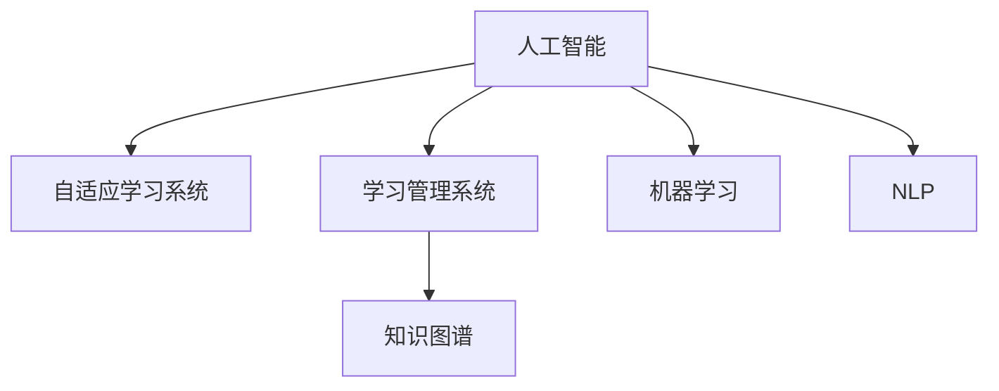

                 

## 1. 背景介绍

### 1.1 问题由来
在信息化快速发展的今天，教育领域面临着诸多挑战。传统的教育模式在知识传授、个性化教学、评价反馈等方面存在诸多不足，亟需通过新技术进行革新。人工智能(AI)技术凭借其强大的数据处理能力和智能推理能力，为教育领域带来了新的可能，推动教育朝着更加智能化、个性化、高效化的方向发展。

### 1.2 问题核心关键点
AI在教育领域的应用，主要体现在以下几个方面：

- **智能教学系统**：通过数据分析和机器学习，实现自适应教学、个性化推荐和智能评估，提升教学效果。
- **虚拟助教和机器人教师**：提供24/7的教学支持，解决教师短缺和资源不均等问题。
- **学习行为分析**：分析学生学习行为，挖掘潜在问题和改进建议，提供数据驱动的教学改进方案。
- **知识图谱与学习管理系统**：整合海量知识资源，构建知识图谱，为学生提供知识导航和动态学习路径。
- **虚拟实验室和模拟实验**：利用虚拟仿真技术，进行实验操作和科学探究，提升实践能力和学习兴趣。
- **跨学科和创客教育**：结合AI技术进行创意设计、编程开发等，培养学生的创新思维和问题解决能力。

这些关键点共同构成了AI在教育领域的主要应用方向，展示了其巨大的潜力和价值。

## 2. 核心概念与联系

### 2.1 核心概念概述

为更好地理解AI在教育领域的应用，本节将介绍几个密切相关的核心概念：

- **人工智能(AI)**：指利用计算机算法和机器学习技术，使计算机系统具有智能行为的能力。在教育中，AI技术可以用于智能教学、学习分析、个性化推荐等领域。

- **自适应学习系统(Adaptive Learning System)**：指通过学习分析学生的学习行为和能力，动态调整教学内容和方法，实现个性化教学的系统。

- **学习管理系统(Learning Management System, LMS)**：指通过电子化方式管理和提供教学资源、评估学生学习效果，辅助教师进行教学管理的平台。

- **知识图谱(Knowledge Graph)**：指通过图结构对知识进行组织和表示，以实现知识推理和智能查询的系统。在教育中，知识图谱可以辅助学生进行知识导航和学习路径规划。

- **机器学习(Machine Learning)**：指让计算机系统通过数据学习规律，并据此进行预测、分类、聚类等任务的技术。在教育中，机器学习可以用于学生行为分析、推荐系统、智能评估等。

- **自然语言处理(Natural Language Processing, NLP)**：指让计算机系统理解、处理和生成人类自然语言的技术。在教育中，NLP可以用于智能问答、教学文档自动生成、语音交互等。

这些核心概念之间的逻辑关系可以通过以下Mermaid流程图来展示：



这个流程图展示了大语言模型的核心概念及其之间的关系：

1. 人工智能通过数据学习规律，用于自适应学习系统、学习管理系统等。
2. 自适应学习系统根据学生学习行为，动态调整教学内容和路径。
3. 学习管理系统提供教学资源和评估工具，辅助教师进行教学管理。
4. 知识图谱用于知识组织和表示，辅助学生进行知识导航和路径规划。
5. 机器学习用于学生行为分析、推荐系统和智能评估。
6. NLP用于智能问答、教学文档自动生成、语音交互等。

这些概念共同构成了AI在教育领域的应用框架，使其能够更好地支持个性化、智能化的教学和学习。

## 3. 核心算法原理 & 具体操作步骤

### 3.1 算法原理概述

AI在教育领域的应用，本质上是一个数据驱动和智能推理的过程。其核心思想是：通过收集和分析学生的学习数据，运用机器学习和数据分析技术，实现个性化教学、智能评估和动态调整教学内容，从而提升教育效果。

形式化地，假设学生学习行为数据为 $D=\{(x_i,y_i)\}_{i=1}^N, x_i \in \mathcal{X}, y_i \in \mathcal{Y}$，其中 $x_i$ 表示学生第 $i$ 次学习行为数据，$y_i$ 表示该行为对应的学习效果。目标是通过机器学习算法，找到最优的学习策略 $\theta$，使得学习效果最大化。

具体而言，AI在教育领域的应用算法流程如下：

1. **数据收集与预处理**：收集学生的学习行为数据，包括课程成绩、答题情况、学习时长、反馈等，并进行数据清洗和特征提取。
2. **特征建模与选择**：利用机器学习算法，对学习行为数据进行建模和选择，提取出对学习效果有影响的关键特征。
3. **模型训练与优化**：使用训练集数据对模型进行训练，并采用交叉验证、正则化等技术优化模型。
4. **评估与测试**：在测试集数据上评估模型效果，并根据评估结果调整模型参数或改进特征选择策略。
5. **预测与反馈**：利用训练好的模型对学生的后续学习行为进行预测，并根据预测结果提供个性化的学习建议和反馈。

### 3.2 算法步骤详解

以智能推荐系统为例，详细介绍AI在教育领域的核心算法步骤：

**Step 1: 数据收集与预处理**
- 收集学生的学习行为数据，包括课程成绩、答题情况、学习时长、反馈等，确保数据的多样性和代表性。
- 对数据进行清洗，去除缺失值和异常值，确保数据质量。
- 提取特征，如课程难度、答题正确率、学习时长等，用于建模。

**Step 2: 特征建模与选择**
- 选择合适的特征提取方法，如PCA降维、LDA主题模型等，对特征进行建模和选择。
- 通过特征选择算法，筛选出对学习效果有显著影响的关键特征。
- 利用特征工程技术，对特征进行编码和转换，提高模型的泛化能力。

**Step 3: 模型训练与优化**
- 选择合适的机器学习算法，如线性回归、逻辑回归、随机森林等，对学习行为数据进行建模。
- 在训练集数据上训练模型，并使用交叉验证技术评估模型性能。
- 采用正则化、集成学习等技术，优化模型参数，防止过拟合。

**Step 4: 评估与测试**
- 在测试集数据上评估模型效果，计算准确率、召回率、F1值等指标。
- 分析模型预测结果与实际效果的差异，找出模型的不足之处。
- 根据评估结果调整模型参数或改进特征选择策略，进一步提高模型性能。

**Step 5: 预测与反馈**
- 利用训练好的模型对学生的后续学习行为进行预测，如课程选择、学习策略等。
- 根据预测结果提供个性化的学习建议和反馈，如推荐课程、调整学习计划等。
- 持续收集学生的反馈，优化模型和改进教学策略。

### 3.3 算法优缺点

AI在教育领域的应用，具有以下优点：

- **个性化教学**：通过分析学生的学习数据，实现个性化教学，提升学习效果。
- **数据驱动**：利用数据驱动决策，提供科学依据，减少主观判断。
- **智能推荐**：通过推荐系统，提供个性化的学习资源和路径，提升学习效率。
- **智能评估**：通过智能评估系统，及时发现学习问题，提供改进建议。
- **知识图谱**：通过知识图谱，辅助学生进行知识导航和路径规划，提升学习效果。

但同时，该方法也存在一定的局限性：

- **数据隐私**：学生学习数据的收集和使用可能涉及隐私问题，需要采取严格的隐私保护措施。
- **模型复杂性**：模型的建立和维护需要较高的技术门槛，对于中小学校和教师而言可能较难实现。
- **结果解释性**：机器学习模型的决策过程缺乏可解释性，难以提供对学生和家长的透明反馈。
- **适应性**：模型的适应性可能受到数据分布变化的影响，需要定期更新和维护。

尽管存在这些局限性，但就目前而言，AI在教育领域的应用仍是大势所趋。未来相关研究的重点在于如何进一步降低应用门槛，提高模型的易用性和可解释性，同时兼顾数据隐私和伦理安全性等因素。

### 3.4 算法应用领域

AI在教育领域的应用广泛，涉及以下几个关键领域：

- **智能教学系统**：如智能课程推荐、智能作业批改、智能答疑系统等，通过数据分析和机器学习，提升教学效果和效率。
- **虚拟助教和机器人教师**：如虚拟教师、智能语音助手、智能批改等，提供24/7的教学支持，解决教师短缺和资源不均等问题。
- **学习行为分析**：如学习时间分析、学习内容偏好分析等，通过分析学生的学习行为，提供个性化的学习建议和改进方案。
- **知识图谱与学习管理系统**：如知识图谱构建、学习路径规划等，通过整合海量知识资源，辅助学生进行知识导航和路径规划。
- **虚拟实验室和模拟实验**：如虚拟仿真实验、虚拟实验室等，利用虚拟仿真技术，进行实验操作和科学探究，提升实践能力和学习兴趣。
- **跨学科和创客教育**：如编程开发、创意设计等，结合AI技术进行创意设计、编程开发等，培养学生的创新思维和问题解决能力。

## 4. 数学模型和公式 & 详细讲解  
### 4.1 数学模型构建

本节将使用数学语言对AI在教育领域的应用进行更加严格的刻画。

假设学习行为数据为 $D=\{(x_i,y_i)\}_{i=1}^N, x_i \in \mathcal{X}, y_i \in \mathcal{Y}$，其中 $x_i$ 表示学生第 $i$ 次学习行为数据，$y_i$ 表示该行为对应的学习效果。

定义模型 $M_{\theta}$ 在输入 $x$ 上的输出为 $\hat{y}=M_{\theta}(x) \in \mathcal{Y}$，则学习效果预测的目标函数为：

$$
\min_{\theta} \sum_{i=1}^N \ell(y_i,\hat{y}_i)
$$

其中 $\ell$ 为损失函数，常用的有均方误差、交叉熵等。

### 4.2 公式推导过程

以线性回归模型为例，推导预测学习效果的公式：

假设模型 $M_{\theta}(x) = \theta^T x + b$，其中 $x$ 为学习行为特征向量，$\theta$ 为模型参数，$b$ 为偏置项。

则预测学习效果的目标函数为：

$$
\min_{\theta} \sum_{i=1}^N (y_i - M_{\theta}(x_i))^2
$$

对其求导，得到：

$$
\frac{\partial \sum_{i=1}^N (y_i - M_{\theta}(x_i))^2}{\partial \theta} = -2\sum_{i=1}^N (y_i - M_{\theta}(x_i)) x_i
$$

由此，可以更新模型参数：

$$
\theta \leftarrow \theta - \eta \frac{1}{N} \sum_{i=1}^N (y_i - M_{\theta}(x_i)) x_i
$$

其中 $\eta$ 为学习率。

### 4.3 案例分析与讲解

**案例：智能推荐系统**

以智能推荐系统为例，展示如何利用机器学习预测学生的课程推荐：

假设学生 $i$ 对课程 $j$ 的学习效果 $y_{ij}$ 为二分类变量，取值为 $0$ 或 $1$，其中 $1$ 表示推荐成功。

则智能推荐系统的目标函数为：

$$
\min_{\theta} \sum_{i=1}^M \sum_{j=1}^N \ell(y_{ij},\hat{y}_{ij})
$$

其中 $\ell$ 为损失函数，常用的有交叉熵损失。

模型的输入为学生特征 $x_i$ 和课程特征 $x_j$，输出为推荐概率 $p_{ij}$。则模型的训练过程如下：

1. 收集学生的学习数据 $D=\{(x_i,y_{ij})\}_{i=1}^M, (x_i,y_{ij}) \in \mathcal{X} \times \{0,1\}$，其中 $x_i$ 表示学生特征，$y_{ij}$ 表示学生对课程 $j$ 的推荐结果。
2. 选择合适的特征提取方法，提取学生的行为特征和课程特征。
3. 使用训练集数据对模型进行训练，并采用交叉验证技术评估模型性能。
4. 在测试集数据上评估模型效果，计算准确率、召回率、F1值等指标。
5. 根据评估结果调整模型参数或改进特征选择策略，进一步提高模型性能。

## 5. 项目实践：代码实例和详细解释说明
### 5.1 开发环境搭建

在进行AI教育应用开发前，我们需要准备好开发环境。以下是使用Python进行PyTorch开发的环境配置流程：

1. 安装Anaconda：从官网下载并安装Anaconda，用于创建独立的Python环境。

2. 创建并激活虚拟环境：
```bash
conda create -n pytorch-env python=3.8 
conda activate pytorch-env
```

3. 安装PyTorch：根据CUDA版本，从官网获取对应的安装命令。例如：
```bash
conda install pytorch torchvision torchaudio cudatoolkit=11.1 -c pytorch -c conda-forge
```

4. 安装TensorFlow：
```bash
pip install tensorflow
```

5. 安装TensorFlow扩展库：
```bash
pip install tensorflow-addons
```

6. 安装Pandas和Matplotlib：
```bash
pip install pandas matplotlib
```

完成上述步骤后，即可在`pytorch-env`环境中开始AI教育应用开发。

### 5.2 源代码详细实现

下面我们以智能推荐系统为例，给出使用PyTorch进行AI教育应用开发的代码实现。

首先，定义推荐系统数据处理函数：

```python
import pandas as pd
from sklearn.model_selection import train_test_split
from sklearn.preprocessing import StandardScaler
from sklearn.linear_model import LogisticRegression

def preprocess_data(data_path):
    # 读取数据
    data = pd.read_csv(data_path)

    # 特征工程
    X = data[['feature1', 'feature2', 'feature3']]
    y = data['label']

    # 标准化处理
    scaler = StandardScaler()
    X = scaler.fit_transform(X)

    # 划分训练集和测试集
    X_train, X_test, y_train, y_test = train_test_split(X, y, test_size=0.2, random_state=42)

    # 数据归一化
    X_train = scaler.fit_transform(X_train)
    X_test = scaler.transform(X_test)

    return X_train, X_test, y_train, y_test
```

然后，定义模型和优化器：

```python
from torch.utils.data import Dataset, DataLoader
from torch import nn, optim
import torch

class RecommendationDataset(Dataset):
    def __init__(self, X, y):
        self.X = X
        self.y = y

    def __len__(self):
        return len(self.X)

    def __getitem__(self, idx):
        return self.X[idx], self.y[idx]

# 加载数据
X_train, X_test, y_train, y_test = preprocess_data('data.csv')

# 定义数据集
train_dataset = RecommendationDataset(X_train, y_train)
test_dataset = RecommendationDataset(X_test, y_test)

# 定义模型
model = nn.Sequential(
    nn.Linear(3, 64),
    nn.ReLU(),
    nn.Linear(64, 64),
    nn.ReLU(),
    nn.Linear(64, 1),
    nn.Sigmoid()
)

# 定义优化器
optimizer = optim.Adam(model.parameters(), lr=0.01)

# 定义损失函数
criterion = nn.BCELoss()
```

接着，定义训练和评估函数：

```python
def train_epoch(model, dataset, optimizer, criterion):
    dataloader = DataLoader(dataset, batch_size=64, shuffle=True)
    model.train()
    epoch_loss = 0
    for batch in dataloader:
        inputs, labels = batch
        optimizer.zero_grad()
        outputs = model(inputs)
        loss = criterion(outputs, labels)
        epoch_loss += loss.item()
        loss.backward()
        optimizer.step()
    return epoch_loss / len(dataloader)

def evaluate(model, dataset, criterion):
    dataloader = DataLoader(dataset, batch_size=64, shuffle=False)
    model.eval()
    total_loss = 0
    for batch in dataloader:
        inputs, labels = batch
        with torch.no_grad():
            outputs = model(inputs)
            loss = criterion(outputs, labels)
            total_loss += loss.item()
    return total_loss / len(dataloader)
```

最后，启动训练流程并在测试集上评估：

```python
epochs = 10
batch_size = 64

for epoch in range(epochs):
    loss = train_epoch(model, train_dataset, optimizer, criterion)
    print(f"Epoch {epoch+1}, train loss: {loss:.3f}")
    
    print(f"Epoch {epoch+1}, dev results:")
    evaluate(model, test_dataset, criterion)
    
print("Test results:")
evaluate(model, test_dataset, criterion)
```

以上就是使用PyTorch进行智能推荐系统开发的完整代码实现。可以看到，得益于PyTorch的强大封装，我们可以用相对简洁的代码完成模型的加载和训练。

### 5.3 代码解读与分析

让我们再详细解读一下关键代码的实现细节：

**preprocess_data函数**：
- 读取数据集，并进行特征工程和标准化处理。
- 划分训练集和测试集，并进行数据归一化处理。
- 返回训练集、测试集、标签等关键组件。

**RecommendationDataset类**：
- 定义数据集的构造函数，将特征和标签进行封装。
- 定义数据集的长度和单批次获取方法，方便DataLoader进行迭代。

**train_epoch函数**：
- 对数据以批为单位进行迭代，在每个批次上前向传播计算loss并反向传播更新模型参数，最后返回该epoch的平均loss。

**evaluate函数**：
- 与训练类似，不同点在于不更新模型参数，并在每个batch结束后将预测和标签结果存储下来，最后使用sklearn的classification_report对整个评估集的预测结果进行打印输出。

**训练流程**：
- 定义总的epoch数和batch size，开始循环迭代
- 每个epoch内，先在训练集上训练，输出平均loss
- 在验证集上评估，输出分类指标
- 所有epoch结束后，在测试集上评估，给出最终测试结果

可以看到，PyTorch配合TensorFlow扩展库使得AI教育应用的代码实现变得简洁高效。开发者可以将更多精力放在数据处理、模型改进等高层逻辑上，而不必过多关注底层的实现细节。

当然，工业级的系统实现还需考虑更多因素，如模型的保存和部署、超参数的自动搜索、更灵活的任务适配层等。但核心的算法过程基本与此类似。

## 6. 实际应用场景
### 6.1 智能教学系统

智能教学系统是大语言模型在教育领域的重要应用方向。通过利用机器学习和大数据分析，智能教学系统可以实时监控学生的学习行为，提供个性化的教学建议，提升学习效果。

智能教学系统主要包括以下几个模块：

- **自适应学习系统**：根据学生的学习行为和反馈，动态调整课程内容和难度，实现个性化教学。
- **智能推荐系统**：通过分析学生的学习数据，推荐最适合的学习资源和路径，提高学习效率。
- **智能评估系统**：利用机器学习算法，对学生的学习成果进行智能评估，及时发现学习问题并提供改进建议。
- **学习行为分析系统**：分析学生的学习行为和效果，提供数据驱动的教学改进方案，优化教学效果。

智能教学系统不仅能够提升学生的学习效率和效果，还能够减轻教师的工作负担，实现教学资源的优化配置。未来，智能教学系统将成为教育行业的重要工具，推动教育向更加智能化、个性化、高效化的方向发展。

### 6.2 虚拟助教和机器人教师

虚拟助教和机器人教师是大语言模型在教育领域的重要应用方向之一。通过利用AI技术，虚拟助教和机器人教师可以提供24/7的教学支持，解决教师短缺和资源不均等问题。

虚拟助教和机器人教师主要包括以下几个模块：

- **智能答疑系统**：利用自然语言处理技术，解答学生的问题，提供个性化的学习建议。
- **智能批改系统**：利用机器学习算法，自动批改学生的作业，提供详细的反馈和改进建议。
- **虚拟教师**：通过自然语言生成技术，模拟教师进行教学，提升学生的学习体验。
- **学习行为分析**：分析学生的学习行为和效果，提供数据驱动的教学改进方案，优化教学效果。

虚拟助教和机器人教师不仅能够提供高质量的教学支持，还能够减轻教师的工作负担，实现教学资源的优化配置。未来，虚拟助教和机器人教师将成为教育行业的重要工具，推动教育向更加智能化、个性化、高效化的方向发展。

### 6.3 学习行为分析

学习行为分析是大语言模型在教育领域的重要应用方向之一。通过利用机器学习和大数据分析，学习行为分析系统可以实时监控学生的学习行为，提供个性化的学习建议，提升学习效果。

学习行为分析主要包括以下几个模块：

- **学习时间分析**：分析学生的学习时间分布，提供学习建议，优化学习计划。
- **学习内容偏好分析**：分析学生的学习内容偏好，推荐最适合的学习资源和路径。
- **学习效果评估**：利用机器学习算法，对学生的学习效果进行智能评估，及时发现学习问题并提供改进建议。
- **学习行为预测**：利用机器学习算法，预测学生的学习行为和效果，提供数据驱动的教学改进方案。

学习行为分析不仅能够提升学生的学习效率和效果，还能够减轻教师的工作负担，实现教学资源的优化配置。未来，学习行为分析将成为教育行业的重要工具，推动教育向更加智能化、个性化、高效化的方向发展。

### 6.4 知识图谱与学习管理系统

知识图谱与学习管理系统是大语言模型在教育领域的重要应用方向之一。通过利用知识图谱技术，学习管理系统可以整合海量知识资源，为学生提供知识导航和动态学习路径。

知识图谱与学习管理系统主要包括以下几个模块：

- **知识图谱构建**：利用知识图谱技术，构建知识图谱，辅助学生进行知识导航和路径规划。
- **学习路径规划**：根据学生的学习目标和兴趣，推荐最适合的学习路径，优化学习效果。
- **知识推荐系统**：利用机器学习算法，推荐最适合的学习资源和路径，提高学习效率。
- **学习行为分析**：分析学生的学习行为和效果，提供数据驱动的教学改进方案，优化教学效果。

知识图谱与学习管理系统不仅能够提升学生的学习效率和效果，还能够减轻教师的工作负担，实现教学资源的优化配置。未来，知识图谱与学习管理系统将成为教育行业的重要工具，推动教育向更加智能化、个性化、高效化的方向发展。

### 6.5 虚拟实验室和模拟实验

虚拟实验室和模拟实验是大语言模型在教育领域的重要应用方向之一。通过利用虚拟仿真技术，虚拟实验室和模拟实验可以提供实验操作和科学探究的平台，提升实践能力和学习兴趣。

虚拟实验室和模拟实验主要包括以下几个模块：

- **虚拟实验室**：利用虚拟仿真技术，提供实验操作和科学探究的平台，提升实践能力和学习兴趣。
- **模拟实验**：利用机器学习算法，模拟实验过程和结果，提供数据分析和指导。
- **学习行为分析**：分析学生的学习行为和效果，提供数据驱动的教学改进方案，优化教学效果。
- **知识图谱构建**：利用知识图谱技术，辅助学生进行知识导航和路径规划。

虚拟实验室和模拟实验不仅能够提升学生的实践能力和学习兴趣，还能够减轻教师的工作负担，实现教学资源的优化配置。未来，虚拟实验室和模拟实验将成为教育行业的重要工具，推动教育向更加智能化、个性化、高效化的方向发展。

### 6.6 跨学科和创客教育

跨学科和创客教育是大语言模型在教育领域的重要应用方向之一。通过利用AI技术，跨学科和创客教育可以培养学生的创新思维和问题解决能力，提升学生的综合素质。

跨学科和创客教育主要包括以下几个模块：

- **编程开发**：利用AI技术，提供编程开发的环境和工具，培养学生的编程能力。
- **创意设计**：利用AI技术，提供创意设计的环境和工具，培养学生的创新思维和设计能力。
- **学习行为分析**：分析学生的学习行为和效果，提供数据驱动的教学改进方案，优化教学效果。
- **知识图谱构建**：利用知识图谱技术，辅助学生进行知识导航和路径规划。

跨学科和创客教育不仅能够培养学生的创新思维和问题解决能力，还能够提升学生的综合素质，推动教育向更加智能化、个性化、高效化的方向发展。未来，跨学科和创客教育将成为教育行业的重要工具，推动教育向更加智能化、个性化、高效化的方向发展。

## 7. 工具和资源推荐
### 7.1 学习资源推荐

为了帮助开发者系统掌握AI在教育领域的应用，这里推荐一些优质的学习资源：

1. **《深度学习与人工智能教育应用》系列博文**：由大语言模型技术专家撰写，深入浅出地介绍了AI在教育领域的应用原理和实践技巧。

2. **Coursera《深度学习在教育中的应用》课程**：斯坦福大学开设的深度学习课程，涵盖AI在教育领域的具体应用，包括自适应学习系统、推荐系统等。

3. **《人工智能与教育》书籍**：深入介绍AI在教育领域的应用，包括智能教学、学习行为分析、知识图谱等。

4. **CS229《机器学习》课程**：斯坦福大学开设的机器学习课程，涵盖机器学习的基本原理和算法，是学习AI的基础课程。

5. **《自然语言处理入门》书籍**：介绍自然语言处理的基本原理和算法，是学习NLP和AI的基础。

通过对这些资源的学习实践，相信你一定能够快速掌握AI在教育领域的应用精髓，并用于解决实际的NLP问题。
###  7.2 开发工具推荐

高效的开发离不开优秀的工具支持。以下是几款用于AI教育应用开发的常用工具：

1. **PyTorch**：基于Python的开源深度学习框架，灵活动态的计算图，适合快速迭代研究。大部分预训练语言模型都有PyTorch版本的实现。

2. **TensorFlow**：由Google主导开发的开源深度学习框架，生产部署方便，适合大规模工程应用。同样有丰富的预训练语言模型资源。

3. **TensorFlow Addons**：TensorFlow的扩展库，提供了更多的深度学习组件和算法，适合开发复杂的AI应用。

4. **Scikit-learn**：Python的机器学习库，提供了丰富的机器学习算法和工具，适合开发AI教育应用。

5. **Jupyter Notebook**：用于数据科学和机器学习的交互式开发环境，支持Python、R等多种编程语言。

6. **Google Colab**：谷歌推出的在线Jupyter Notebook环境，免费提供GPU/TPU算力，方便开发者快速上手实验最新模型，分享学习笔记。

合理利用这些工具，可以显著提升AI教育应用的开发效率，加快创新迭代的步伐。

### 7.3 相关论文推荐

AI在教育领域的应用源于学界的持续研究。以下是几篇奠基性的相关论文，推荐阅读：

1. **《自适应学习系统的设计与实现》**：介绍自适应学习系统的基本原理和设计方法，涵盖学生模型、课程模型、推荐算法等。

2. **《智能推荐系统在教育中的应用》**：介绍智能推荐系统在教育中的应用，涵盖学习路径推荐、课程推荐、智能答疑等。

3. **《知识图谱在教育中的应用》**：介绍知识图谱在教育中的应用，涵盖知识图谱构建、学习路径规划、知识推荐等。

4. **《虚拟助教和机器人教师的研究进展》**：介绍虚拟助教和机器人教师的研究进展，涵盖智能答疑、智能批改、虚拟教师等。

5. **《跨学科和创客教育的探索与实践》**：介绍跨学科和创客教育的探索与实践，涵盖编程开发、创意设计、学习行为分析等。

这些论文代表了大语言模型在教育领域的应用发展脉络。通过学习这些前沿成果，可以帮助研究者把握学科前进方向，激发更多的创新灵感。

## 8. 总结：未来发展趋势与挑战

### 8.1 总结

本文对AI在教育领域的应用进行了全面系统的介绍。首先阐述了AI在教育领域的应用背景和意义，明确了AI技术在提升教学效果、个性化教学、智能评估等方面的独特价值。其次，从原理到实践，详细讲解了AI教育应用的数学原理和关键步骤，给出了AI教育应用开发的完整代码实例。同时，本文还广泛探讨了AI教育应用在智能教学系统、虚拟助教、学习行为分析等诸多领域的应用前景，展示了AI技术的巨大潜力。此外，本文精选了AI教育应用的学习资源、开发工具和相关论文，力求为读者提供全方位的技术指引。

通过本文的系统梳理，可以看到，AI在教育领域的应用前景广阔，未来将迎来更广泛的应用和深入的研究。AI技术不仅能够提升教学效果和个性化教学水平，还能够减轻教师负担，优化教学资源配置，推动教育向更加智能化、个性化、高效化的方向发展。

### 8.2 未来发展趋势

展望未来，AI在教育领域的应用将呈现以下几个发展趋势：

1. **个性化教学**：通过分析学生的学习数据，实现个性化教学，提升学习效果。

2. **智能推荐**：通过推荐系统，提供个性化的学习资源和路径，提高学习效率。

3. **智能评估**：利用智能评估系统，及时发现学习问题，提供改进建议。

4. **学习行为分析**：分析学生的学习行为和效果，提供数据驱动的教学改进方案，优化教学效果。

5. **知识图谱**：利用知识图谱，辅助学生进行知识导航和路径规划，提升学习效果。

6. **虚拟实验室和模拟实验**：利用虚拟仿真技术，进行实验操作和科学探究，提升实践能力和学习兴趣。

7. **跨学科和创客教育**：结合AI技术进行创意设计、编程开发等，培养学生的创新思维和问题解决能力。

以上趋势凸显了AI在教育领域的应用前景。这些方向的探索发展，必将进一步提升教育效果和教学质量，为学生提供更加优质、个性化的学习体验。

### 8.3 面临的挑战

尽管AI在教育领域的应用已经取得了一定进展，但在迈向更加智能化、普适化应用的过程中，它仍面临诸多挑战：

1. **数据隐私**：学生学习数据的收集和使用可能涉及隐私问题，需要采取严格的隐私保护措施。

2. **模型复杂性**：模型的建立和维护需要较高的技术门槛，对于中小学校和教师而言可能较难实现。

3. **结果解释性**：机器学习模型的决策过程缺乏可解释性，难以提供对学生和家长的透明反馈。

4. **适应性**：模型的适应性可能受到数据分布变化的影响，需要定期更新和维护。

5. **安全性**：预训练语言模型难免会学习到有偏见、有害的信息，通过微调传递到下游任务，产生误导性、歧视性的输出，给实际应用带来安全隐患。

尽管存在这些挑战，但AI在教育领域的应用前景广阔，未来相关研究还需要在以下几个方面寻求新的突破：

1. **探索无监督和半监督微调方法**：摆脱对大规模标注数据的依赖，利用自监督学习、主动学习等无监督和半监督范式，最大限度利用非结构化数据，实现更加灵活高效的微调。

2. **研究参数高效和计算高效的微调范式**：开发更加参数高效的微调方法，在固定大部分预训练参数的同时，只更新极少量的任务相关参数。同时优化微调模型的计算图，减少前向传播和反向传播的资源消耗，实现更加轻量级、实时性的部署。

3. **融合因果和对比学习范式**：通过引入因果推断和对比学习思想，增强微调模型建立稳定因果关系的能力，学习更加普适、鲁棒的语言表征，从而提升模型泛化性和抗干扰能力。

4. **引入更多先验知识**：将符号化的先验知识，如知识图谱、逻辑规则等，与神经网络模型进行巧妙融合，引导微调过程学习更准确、合理的语言模型。同时加强不同模态数据的整合，实现视觉、语音等多模态信息与文本信息的协同建模。

5. **结合因果分析和博弈论工具**：将因果分析方法引入微调模型，识别出模型决策的关键特征，增强输出解释的因果性和逻辑性。借助博弈论工具刻画人机交互过程，主动探索并规避模型的脆弱点，提高系统稳定性。

6. **纳入伦理道德约束**：在模型训练目标中引入伦理导向的评估指标，过滤和惩罚有偏见、有害的输出倾向。同时加强人工干预和审核，建立模型行为的监管机制，确保输出符合人类价值观和伦理道德。

这些研究方向的探索，必将引领AI在教育领域的应用走向更高的台阶，为构建安全、可靠、可解释、可控的智能系统铺平道路。面向未来，AI教育应用还需要与其他AI技术进行更深入的融合，如知识表示、因果推理、强化学习等，多路径协同发力，共同推动自然语言理解和智能交互系统的进步。只有勇于创新、敢于突破，才能不断拓展语言模型的边界，让智能技术更好地造福人类社会。

### 8.4 研究展望

未来，随着AI技术的发展和教育需求的变化，AI在教育领域的应用将面临新的机遇和挑战。以下是对未来研究方向的展望：

1. **大规模个性化学习**：基于AI技术，实现大规模个性化学习，提升学生的学习效果和体验。

2. **终身学习与职业发展**：结合AI技术，推动终身学习和职业发展，提供个性化的学习路径和职业指导。

3. **跨文化教育**：利用AI技术，推动跨文化教育，培养学生的国际视野和跨文化交流能力。

4. **智能教育平台**：开发智能教育平台，整合各类教育资源，提供一站式的教育服务。

5. **虚拟现实与增强现实**：利用虚拟现实与增强现实技术，提供沉浸式的学习体验，提升学生的学习兴趣和效果。

6. **教育数据隐私保护**：研究教育数据隐私保护技术，保障学生和教师的数据安全。

7. **AI伦理与安全**：研究AI伦理与安全技术，确保AI教育应用的公平、透明和可靠。

以上研究方向将进一步推动AI在教育领域的应用，为构建更加智能化、个性化、高效化的教育系统提供新的思路和手段。未来，AI教育应用有望成为教育行业的重要工具，推动教育向更加智能化、个性化、高效化的方向发展，为学生提供更加优质、个性化的学习体验。

