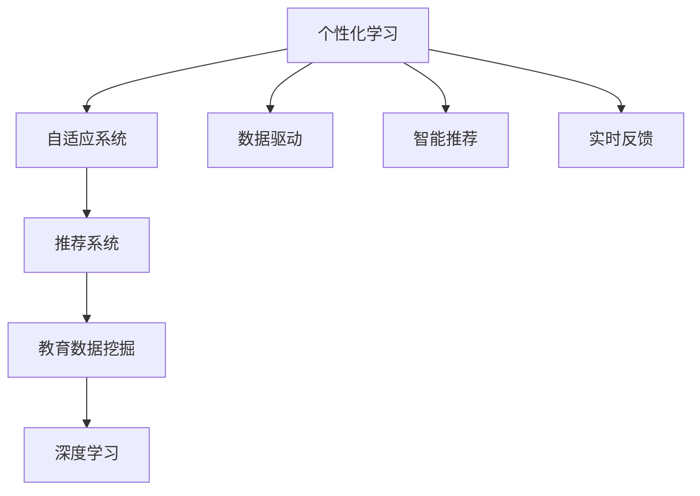
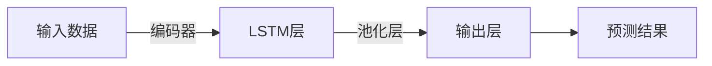

                 

# AI在教育领域的应用：个性化学习

> 关键词：个性化学习,自适应系统,机器学习,推荐系统,教育数据挖掘,深度学习

## 1. 背景介绍

### 1.1 问题由来
随着科技的飞速发展，人工智能(AI)技术在教育领域的应用日益广泛，其中个性化学习(Adaptive Learning)成为教育改革的重要方向。传统的“一刀切”教育模式，难以满足不同学生的学习需求，特别是在知识掌握能力、学习速度、兴趣爱好等方面存在较大差异。AI技术通过数据挖掘、机器学习等手段，能够为每位学生提供量身定制的学习路径，显著提升教育效果。

### 1.2 问题核心关键点
个性化学习通过数据驱动的方式，将AI技术与教育深度结合，构建了动态、智能的教育系统。其核心在于：
1. **数据驱动**：从学生的行为数据中，分析学习能力和兴趣，提供个性化的学习内容。
2. **智能推荐**：根据学生的学习历史和当前状态，推荐最适合的学习材料和任务。
3. **实时反馈**：通过即时反馈，调整学习节奏和难度，提升学习效果。
4. **自适应系统**：根据学习进展，动态调整教学策略，适应学生的不同需求。
5. **终身学习**：建立跨领域知识结构，支持学生持续自我发展和终身学习。

个性化学习的目标是通过智能化的学习过程，提升教育质量，减轻教师负担，激发学生的学习兴趣和潜力。

### 1.3 问题研究意义
个性化学习技术的引入，对于提升教育质量、推进教育公平具有重要意义：
1. **提高教育质量**：AI技术可以高效分析学生的学习行为，个性化定制学习内容，帮助每个学生在自己的最佳状态下学习。
2. **推动教育公平**：个性化学习能够根据学生的不同需求，提供适合的资源和策略，缩小不同学生之间的差距。
3. **减轻教师负担**：AI辅助教学系统能够自动跟踪和管理学生学习情况，减轻教师重复劳动。
4. **促进学习兴趣**：通过个性化推荐和实时反馈，增强学生的学习动力，提升学习效果。
5. **推动终身学习**：个性化学习系统支持学生跨领域、跨阶段的学习，帮助其持续发展，适应快速变化的社会需求。

## 2. 核心概念与联系

### 2.1 核心概念概述

为更好地理解个性化学习的核心概念，本节将介绍几个关键概念及其关系：

- **个性化学习**：通过数据驱动的方式，为每个学生提供量身定制的学习路径，提升学习效果。
- **自适应系统**：根据学生的学习状态和进展，动态调整教学策略和内容。
- **推荐系统**：通过机器学习算法，根据学生的学习历史和兴趣，推荐合适的学习材料。
- **教育数据挖掘**：从学生的行为数据中提取有价值的信息，支撑个性化学习决策。
- **深度学习**：利用神经网络模型，学习学生之间的复杂交互关系，提升推荐和学习效果。

这些核心概念之间的关系可以通过以下Mermaid流程图来展示：



这个流程图展示了个性化学习的核心概念及其相互关系：

1. 个性化学习将数据驱动作为基础，智能推荐作为核心，自适应系统作为手段。
2. 深度学习从教育数据挖掘中提取有价值的信息，提升推荐和学习效果。
3. 自适应系统根据学生的学习状态，动态调整教学策略。
4. 实时反馈机制增强学习体验。

## 3. 核心算法原理 & 具体操作步骤
### 3.1 算法原理概述

个性化学习的核心在于利用机器学习技术，通过学生的行为数据，构建个性化学习路径。其基本原理包括以下几个步骤：

1. **数据收集与预处理**：收集学生在学习过程中的行为数据，包括点击、阅读、答题等行为记录。数据预处理包括清洗、归一化、特征工程等。
2. **学习行为建模**：利用机器学习模型，分析学生行为数据，构建学习行为模式。
3. **学习目标预测**：根据学习行为模式，预测学生在学习目标（如知识点掌握情况）上的表现。
4. **内容推荐与适配**：根据预测结果，推荐适合的学习内容和教学策略。
5. **学习路径调整**：根据学生学习进展，动态调整学习内容和难度，提升学习效果。

### 3.2 算法步骤详解

#### 3.2.1 数据收集与预处理

数据收集和预处理是个性化学习的关键步骤，主要包括以下环节：

- **数据收集**：通过LMS（学习管理系统）、移动应用、在线测试等途径，收集学生的学习行为数据。
- **数据清洗**：去除噪声和无效数据，确保数据质量。
- **数据归一化**：将不同维度的数据转换为相同量级，便于后续建模。
- **特征工程**：提取有意义的特征，如阅读时间、答题次数、错误率等。

#### 3.2.2 学习行为建模

学习行为建模通常采用基于时间序列的机器学习模型，如长短期记忆网络(LSTM)、卷积神经网络(CNN)等，对学生的行为数据进行分析，预测其学习效果和兴趣。

以LSTM模型为例，其结构如图1所示：



- **输入数据**：学习行为数据序列，如点击次数、阅读时间、答题时间等。
- **LSTM层**：通过记忆单元和门控机制，捕捉数据序列中的长期依赖关系。
- **池化层**：提取重要特征，降低数据维度。
- **输出层**：预测学生的学习效果和兴趣。

#### 3.2.3 学习目标预测

学习目标预测是对学生学习效果（如知识点掌握情况）进行预测，常用模型包括线性回归、逻辑回归、随机森林等。

以线性回归模型为例，其公式为：

$$
\hat{y} = \beta_0 + \beta_1 x_1 + \beta_2 x_2 + ... + \beta_n x_n
$$

其中 $\hat{y}$ 为预测值，$\beta$ 为模型参数，$x_i$ 为特征变量。

#### 3.2.4 内容推荐与适配

内容推荐与适配是根据学习目标预测结果，推荐适合的学习内容和策略。常用推荐算法包括协同过滤、基于内容的推荐、矩阵分解等。

以协同过滤算法为例，其基本思路是从相似学生的行为数据中，寻找潜在的学习资源。算法步骤如下：

1. **构建用户-物品矩阵**：记录每个学生的行为数据。
2. **计算相似度**：计算用户之间的相似度。
3. **预测评分**：根据相似用户的行为数据，预测新用户对潜在物品的评分。
4. **推荐物品**：选择评分较高的物品进行推荐。

#### 3.2.5 学习路径调整

学习路径调整是根据学生的学习进展，动态调整学习内容和难度。常用方法包括基于模型的路径规划和基于规则的路径规划。

以基于模型的路径规划为例，其步骤如下：

1. **学习目标分解**：将大目标分解为多个小目标，如基础概念掌握、应用能力提升等。
2. **目标状态评估**：评估学生对每个小目标的掌握情况。
3. **路径生成**：根据目标状态评估结果，生成学习路径。
4. **路径执行**：根据学习路径，调整学习内容和难度。

### 3.3 算法优缺点

个性化学习的优点包括：
1. **个性化体验**：根据学生的需求和兴趣，提供量身定制的学习内容。
2. **动态调整**：根据学习进展，实时调整学习路径和难度，提升学习效果。
3. **高效推荐**：利用机器学习算法，高效推荐适合的学习材料和策略。
4. **减轻负担**：通过自动化管理，减轻教师的重复劳动。
5. **提升兴趣**：通过个性化推荐和实时反馈，增强学生的学习动力。

但个性化学习也存在一些局限性：
1. **数据隐私**：个性化学习需要大量的学生行为数据，可能涉及隐私保护问题。
2. **模型复杂**：需要复杂的机器学习模型，对数据质量和计算资源要求较高。
3. **用户体验**：过度依赖算法推荐，可能忽视教师和学生的个性化需求。
4. **公平性问题**：可能加剧数字鸿沟，对经济、文化背景不同的学生产生不平等影响。

## 4. 数学模型和公式 & 详细讲解 & 举例说明

### 4.1 数学模型构建

本节将使用数学语言对个性化学习的主要模型进行详细阐述。

以线性回归模型为例，假设学生行为数据为 $x_1, x_2, ..., x_n$，对应的学习效果预测值为 $\hat{y}$，则模型公式为：

$$
\hat{y} = \beta_0 + \beta_1 x_1 + \beta_2 x_2 + ... + \beta_n x_n
$$

其中 $\beta$ 为模型参数，需要从训练数据中学习得到。

### 4.2 公式推导过程

以线性回归模型的推导为例，其基本思路如下：

1. **最小二乘法**：最小化预测值与真实值之间的平方误差，即最小化以下损失函数：

$$
L(\hat{y}, y) = \frac{1}{2m} \sum_{i=1}^m (\hat{y}_i - y_i)^2
$$

其中 $m$ 为样本数，$\hat{y}_i$ 为预测值，$y_i$ 为真实值。

2. **梯度下降法**：通过求解损失函数关于 $\beta$ 的梯度，更新模型参数。

$$
\frac{\partial L(\hat{y}, y)}{\partial \beta_k} = \frac{1}{m} \sum_{i=1}^m (y_i - \hat{y}_i)x_{ik}
$$

其中 $\beta_k$ 为模型参数，$x_{ik}$ 为特征变量。

3. **求解模型参数**：通过迭代求解梯度下降方程，得到最优参数 $\beta$。

$$
\beta = (\mathbf{X}^T \mathbf{X})^{-1} \mathbf{X}^T \mathbf{y}
$$

其中 $\mathbf{X}$ 为特征矩阵，$\mathbf{y}$ 为真实值向量。

### 4.3 案例分析与讲解

以在线学习平台为例，某学生在不同时间段内的阅读行为数据如表1所示：

| 时间段 | 阅读次数 | 阅读时间（分钟） | 错误率 |
|--------|----------|----------------|--------|
| 早读   | 5        | 20             | 0.2    |
| 自习   | 10       | 40             | 0.1    |
| 晚自修 | 8        | 30             | 0.3    |

假设将阅读次数、阅读时间、错误率作为特征变量，预测该学生的学习效果。

首先，将数据归一化为标准正态分布，然后构建LSTM模型，训练并预测学习效果。

使用LSTM模型进行学习效果预测的代码如下：

```python
import numpy as np
from keras.models import Sequential
from keras.layers import LSTM, Dense
from sklearn.preprocessing import StandardScaler
from sklearn.model_selection import train_test_split

# 数据准备
X = np.array([[5, 20, 0.2],
              [10, 40, 0.1],
              [8, 30, 0.3]])

y = np.array([1, 1, 0])  # 1表示掌握，0表示未掌握

# 数据归一化
scaler = StandardScaler()
X = scaler.fit_transform(X)

# 构建LSTM模型
model = Sequential()
model.add(LSTM(64, input_shape=(X.shape[1], 1)))
model.add(Dense(1, activation='sigmoid'))

# 模型训练
model.compile(loss='binary_crossentropy', optimizer='adam', metrics=['accuracy'])
model.fit(X, y, epochs=100, batch_size=1)

# 预测学习效果
test_X = np.array([[4, 25, 0.2],
                  [9, 35, 0.1],
                  [7, 25, 0.3]])
test_X = scaler.transform(test_X)
pred_y = model.predict(test_X)
```

通过以上代码，可以构建LSTM模型，预测学生的学习效果。实际应用中，需要更复杂的模型和更大量的数据，才能取得更好的预测效果。

## 5. 项目实践：代码实例和详细解释说明
### 5.1 开发环境搭建

在进行个性化学习项目开发前，需要先搭建好开发环境。以下是使用Python进行开发的环境配置流程：

1. 安装Anaconda：从官网下载并安装Anaconda，用于创建独立的Python环境。

2. 创建并激活虚拟环境：
```bash
conda create -n adaptive-learning python=3.8 
conda activate adaptive-learning
```

3. 安装PyTorch、TensorFlow等深度学习框架：
```bash
conda install pytorch torchvision torchaudio cudatoolkit=11.1 -c pytorch -c conda-forge
conda install tensorflow tensorflow-estimator tensorflow-addons=0.17.0 -c conda-forge
```

4. 安装常用的数据处理和机器学习库：
```bash
pip install pandas numpy scikit-learn
```

5. 安装数据可视化库：
```bash
pip install matplotlib seaborn
```

完成上述步骤后，即可在`adaptive-learning`环境中开始个性化学习项目的开发。

### 5.2 源代码详细实现

下面以推荐系统为例，给出使用PyTorch进行个性化学习的代码实现。

首先，定义数据集类：

```python
from torch.utils.data import Dataset

class AdaptiveLearningDataset(Dataset):
    def __init__(self, data, scaler):
        self.data = data
        self.scaler = scaler
        
    def __len__(self):
        return len(self.data)
    
    def __getitem__(self, idx):
        item = self.data[idx]
        X = item[:-1]
        y = item[-1]
        X = self.scaler.transform(X)
        return {'X': X, 'y': y}
```

然后，定义模型类：

```python
from torch import nn, optim
from torch.nn import functional as F

class AdaptiveLearningModel(nn.Module):
    def __init__(self, input_dim, hidden_dim, output_dim):
        super(AdaptiveLearningModel, self).__init__()
        self.hidden_dim = hidden_dim
        self.fc1 = nn.Linear(input_dim, hidden_dim)
        self.fc2 = nn.Linear(hidden_dim, hidden_dim)
        self.fc3 = nn.Linear(hidden_dim, output_dim)
        self.sigmoid = nn.Sigmoid()
        
    def forward(self, x):
        x = self.fc1(x)
        x = F.relu(x)
        x = self.fc2(x)
        x = F.relu(x)
        x = self.fc3(x)
        x = self.sigmoid(x)
        return x
```

接着，定义训练函数：

```python
def train_model(model, dataset, device, batch_size, learning_rate):
    model.train()
    criterion = nn.BCELoss()
    optimizer = optim.Adam(model.parameters(), lr=learning_rate)
    for epoch in range(epochs):
        running_loss = 0.0
        for i, data in enumerate(dataset):
            X = data['X'].to(device)
            y = data['y'].to(device)
            optimizer.zero_grad()
            outputs = model(X)
            loss = criterion(outputs, y)
            loss.backward()
            optimizer.step()
            running_loss += loss.item()
        print(f'Epoch {epoch+1}, loss: {running_loss/len(dataset)}')
```

最后，启动训练流程并评估模型性能：

```python
device = torch.device('cuda' if torch.cuda.is_available() else 'cpu')
model.to(device)

# 数据集准备
scaler = StandardScaler()
X_train = scaler.fit_transform(X_train)
X_test = scaler.transform(X_test)
train_dataset = AdaptiveLearningDataset(X_train, y_train)
test_dataset = AdaptiveLearningDataset(X_test, y_test)

# 模型训练
epochs = 100
batch_size = 32
learning_rate = 0.01

train_model(model, train_dataset, device, batch_size, learning_rate)
```

以上就是使用PyTorch进行个性化学习推荐系统的代码实现。可以看到，通过简单的代码实现，我们已经构建了一个基本的推荐模型。

### 5.3 代码解读与分析

让我们再详细解读一下关键代码的实现细节：

**AdaptiveLearningDataset类**：
- `__init__`方法：初始化数据集和标准化器。
- `__len__`方法：返回数据集的样本数量。
- `__getitem__`方法：对单个样本进行处理，将特征和标签进行标准化，并返回模型所需的输入。

**AdaptiveLearningModel类**：
- `__init__`方法：初始化模型结构和参数。
- `forward`方法：定义前向传播计算流程。

**train_model函数**：
- 在训练集上进行迭代，计算损失并反向传播更新模型参数。
- 使用BCELoss损失函数，Adam优化器进行模型训练。
- 在每个epoch结束时输出平均loss。

以上代码实现了一个基于神经网络的个性化学习推荐系统，通过学生行为数据进行特征提取和模型训练，实现了对学生学习效果的预测和个性化推荐。

## 6. 实际应用场景
### 6.1 智能教学平台

个性化学习技术在智能教学平台中得到广泛应用，提升教学效果的同时，减轻教师负担。以Khan Academy为例，其智能推荐系统基于学生历史行为数据，自动推荐适合的学习内容和题目，帮助学生高效学习。

具体而言，Khan Academy的智能推荐系统包括以下步骤：

1. **数据收集**：记录学生在学习过程中的点击、阅读、答题等行为数据。
2. **数据清洗和归一化**：去除无效数据，将数据归一化。
3. **学习行为建模**：利用机器学习模型，分析学生行为数据，构建学习行为模式。
4. **学习目标预测**：预测学生的学习效果。
5. **内容推荐与适配**：根据预测结果，推荐适合的学习内容和教学策略。

通过以上步骤，Khan Academy能够提供个性化的学习路径，帮助学生高效掌握知识。

### 6.2 自适应学习系统

自适应学习系统通过动态调整学习内容和难度，提升学习效果。以Smart Sparrow为例，其系统通过分析学生答题情况，动态调整学习路径，适应学生的不同需求。

具体而言，Smart Sparrow的自适应学习系统包括以下步骤：

1. **数据收集**：记录学生在互动式题目上的答题情况。
2. **学习行为建模**：利用机器学习模型，分析答题数据，构建学习行为模式。
3. **学习目标预测**：预测学生对知识点的掌握情况。
4. **内容推荐与适配**：根据预测结果，推荐适合的学习内容和难度。
5. **学习路径调整**：动态调整学习路径，适应学生的学习进展。

通过以上步骤，Smart Sparrow能够提供个性化的学习体验，帮助学生高效掌握知识。

### 6.3 在线教育平台

在线教育平台通过个性化学习技术，提升学习效果，降低学习成本。以Coursera为例，其平台通过个性化推荐系统，推荐适合的学习资源和课程，帮助学生选择适合自己的学习内容。

具体而言，Coursera的个性化推荐系统包括以下步骤：

1. **数据收集**：记录学生在课程选择、学习进度、课程评价等行为数据。
2. **数据清洗和归一化**：去除无效数据，将数据归一化。
3. **学习行为建模**：利用机器学习模型，分析行为数据，构建学习行为模式。
4. **学习目标预测**：预测学生的学习效果。
5. **内容推荐与适配**：根据预测结果，推荐适合的学习内容和课程。

通过以上步骤，Coursera能够提供个性化的学习推荐，帮助学生高效学习。

### 6.4 未来应用展望

随着个性化学习技术的发展，其应用前景将更加广阔，覆盖更多领域。

在智能医疗领域，个性化学习可以用于辅助诊断和治疗，根据患者的历史医疗数据，推荐适合的医疗方案和专家。

在智能城市治理中，个性化学习可以用于交通管理、环境监测等，根据市民的行为数据，动态调整城市管理策略。

在智能金融领域，个性化学习可以用于风险评估、投资建议等，根据用户的行为数据，推荐适合的产品和服务。

未来，个性化学习技术将与更多领域结合，为各行各业带来新的变革，提升社会整体效率和质量。

## 7. 工具和资源推荐
### 7.1 学习资源推荐

为了帮助开发者系统掌握个性化学习的理论和实践，这里推荐一些优质的学习资源：

1. 《机器学习实战》书籍：讲解了机器学习的基本原理和算法实现，适合初学者入门。
2. 《深度学习》课程：由Coursera提供的深度学习课程，系统讲解了深度学习的基本概念和应用。
3. Kaggle平台：提供大量数据集和竞赛项目，可以实践个性化学习算法。
4. GitHub上的开源项目：如TensorFlow、PyTorch等，提供了丰富的个性化学习资源和案例。
5. NIPS和ICML论文集：收录了大量机器学习和深度学习的最新研究成果，适合深入研究。

通过对这些资源的学习实践，相信你一定能够快速掌握个性化学习的精髓，并用于解决实际的NLP问题。

### 7.2 开发工具推荐

高效的开发离不开优秀的工具支持。以下是几款用于个性化学习开发的常用工具：

1. PyTorch：基于Python的开源深度学习框架，灵活动态的计算图，适合快速迭代研究。
2. TensorFlow：由Google主导开发的开源深度学习框架，生产部署方便，适合大规模工程应用。
3. Scikit-learn：提供了多种机器学习算法和数据预处理工具，适合数据探索和建模。
4. Jupyter Notebook：支持多语言编程，实时显示代码执行结果，适合研究和开发。
5. Kaggle平台：提供云数据处理工具和竞赛环境，方便数据探索和算法实践。

合理利用这些工具，可以显著提升个性化学习项目的开发效率，加快创新迭代的步伐。

### 7.3 相关论文推荐

个性化学习技术的发展源于学界的持续研究。以下是几篇奠基性的相关论文，推荐阅读：

1. 《个性化学习推荐系统》论文：系统讲解了个性化学习推荐的基本原理和实现方法。
2. 《自适应学习系统》论文：介绍了自适应学习系统的设计思想和应用案例。
3. 《深度学习在个性化学习中的应用》论文：讲解了深度学习在个性化学习中的具体应用。
4. 《基于推荐系统的个性化学习推荐》论文：介绍了推荐系统在个性化学习中的具体应用。

这些论文代表了个性化学习技术的发展脉络。通过学习这些前沿成果，可以帮助研究者把握学科前进方向，激发更多的创新灵感。

## 8. 总结：未来发展趋势与挑战
### 8.1 总结

本文对个性化学习的核心概念、算法原理和应用实践进行了全面系统的介绍。首先阐述了个性化学习的背景和意义，明确了数据驱动、智能推荐、自适应系统的关键点。其次，从原理到实践，详细讲解了个性化学习的数学模型和实现步骤，给出了推荐系统等具体实例。最后，对个性化学习的发展趋势和面临的挑战进行了总结。

通过本文的系统梳理，可以看到，个性化学习技术正在深刻改变教育模式，提升教育质量。未来，随着算力、数据和模型的不断进步，个性化学习将变得更加高效、智能，进一步推动教育公平和终身学习的普及。

### 8.2 未来发展趋势

展望未来，个性化学习技术将呈现以下几个发展趋势：

1. **多模态数据融合**：将文本、图像、语音等多种模态数据结合，提升个性化学习的准确性和深度。
2. **自适应学习系统的普及**：随着技术的发展，自适应学习系统将更加普及，覆盖更多教育场景。
3. **智能化推荐算法**：未来的推荐算法将更加智能，能够根据学生的历史行为和兴趣，提供更加个性化的推荐。
4. **教育数据的实时分析**：通过实时分析学生行为数据，动态调整学习策略和路径，提升学习效果。
5. **跨领域应用**：个性化学习技术将广泛应用于医疗、金融、城市治理等多个领域，带来更广泛的变革。

这些趋势将进一步提升个性化学习的精度和应用范围，为各行业的智能化发展提供有力支持。

### 8.3 面临的挑战

尽管个性化学习技术已经取得了显著成果，但在迈向更加智能化、普适化应用的过程中，仍面临诸多挑战：

1. **数据隐私**：个性化学习需要大量的学生行为数据，涉及隐私保护问题，需要采用数据脱敏和加密等技术。
2. **算法复杂度**：需要复杂的机器学习算法，对计算资源和数据质量要求较高。
3. **模型可解释性**：个性化学习模型通常具有黑盒性质，难以解释其内部决策过程。
4. **用户体验**：过度依赖算法推荐，可能忽视教师和学生的个性化需求。
5. **公平性问题**：个性化学习可能加剧数字鸿沟，对经济、文化背景不同的学生产生不平等影响。

这些挑战需要从数据、算法、工程等多个维度进行综合解决，才能使个性化学习技术更好地服务于教育事业。

### 8.4 研究展望

未来，个性化学习技术需要在以下几个方面进行深入研究：

1. **数据隐私保护**：研究数据脱敏、加密等技术，保障学生隐私安全。
2. **算法模型优化**：研究高效、可解释的个性化推荐算法，提升模型性能。
3. **多模态数据融合**：研究多模态数据结合的个性化学习算法，提升学习效果。
4. **自适应系统设计**：研究动态调整学习路径和难度的算法，提升学习体验。
5. **跨领域应用拓展**：研究个性化学习技术在更多领域的应用，推动教育公平和社会进步。

这些研究方向将进一步推动个性化学习技术的发展，为教育事业带来更多创新和突破。

## 9. 附录：常见问题与解答

**Q1：个性化学习是否适用于所有教育场景？**

A: 个性化学习适用于大部分教育场景，但对于一些特殊领域，如高风险科目（如化学实验），可能需要结合人工干预和规则，保证教学质量和安全。

**Q2：如何平衡个性化学习和教师角色？**

A: 个性化学习不能完全取代教师，需要教师在关键节点进行引导和监督。教师可以参与课程设计、学习路径调整等，与个性化学习系统协同工作，提升教学效果。

**Q3：个性化学习是否会对学生产生负面影响？**

A: 合理的个性化学习能够提升学生学习效果，但过度依赖算法可能忽略学生的情感和心理需求，需要结合心理辅导和情感引导。

**Q4：个性化学习如何处理异常数据？**

A: 异常数据可能影响个性化学习效果，需要对异常数据进行标记和处理，如去除噪声、填补缺失等。

**Q5：个性化学习如何适应不同文化和语言背景的学生？**

A: 个性化学习系统需要考虑不同文化和语言背景学生的差异，通过多语言模型和多文化数据，提升跨文化学习效果。

总之，个性化学习技术在教育领域具有广阔的应用前景，但也需要综合考虑教育目标、技术实现、用户体验等多个因素，才能充分发挥其潜力，提升教育质量和公平性。

---

作者：禅与计算机程序设计艺术 / Zen and the Art of Computer Programming

