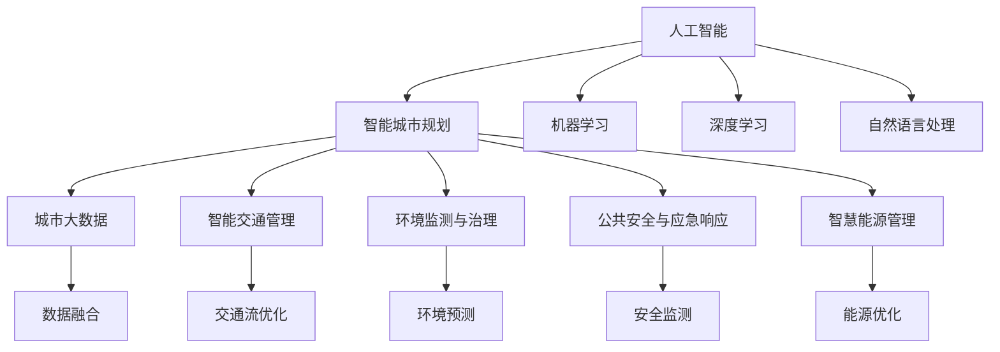

                 

# AI在智能城市规划中的应用：提高生活质量

> 关键词：人工智能,智能城市规划,城市管理,生活质量,大数据,预测模型,规划决策,智慧城市

## 1. 背景介绍

随着人口的快速增长和城市化的持续推进，全球范围内城市规划和管理的压力日益增大。如何构建高效、智能、可持续的城市环境，改善居民生活质量，成为当前城市决策者面临的重大挑战。人工智能(AI)技术的快速发展，为智能城市规划提供了新的思路和工具，成为提升城市管理水平和居民生活质量的重要驱动力。

### 1.1 问题由来
传统的城市规划和管理系统依赖于人工的规划设计、数据分析和决策制定。这些过程往往耗时耗力，且容易受人为因素干扰，难以实现高效、公平和可持续的发展目标。伴随大数据、物联网、云计算等技术的普及，AI技术开始融入城市管理各个环节，形成了智能城市规划的全新范式。AI不仅能够处理海量数据，进行深度分析和精确预测，还能提供智能化决策支持，极大提升了城市规划的科学性和效率。

### 1.2 问题核心关键点
AI在智能城市规划中的应用主要体现在以下几个方面：
- **数据驱动决策**：利用大数据和AI技术，进行精细化城市分析，辅助制定科学规划。
- **智能交通管理**：通过交通监控、数据分析和预测，优化交通流，减少拥堵，提高交通效率。
- **环境监测与治理**：利用传感器和AI模型，实时监测环境污染，预测灾害，采取有效措施保护环境。
- **公共安全与应急响应**：通过视频监控、行为分析等技术，提升城市安全性和应急反应能力。
- **智慧能源管理**：借助AI算法优化能源分配和调度，实现节能减排，提升能源利用效率。

这些应用不仅能够提升城市运行效率，还能显著改善居民生活质量，实现城市的可持续发展。

## 2. 核心概念与联系

### 2.1 核心概念概述

为更好地理解AI在智能城市规划中的应用，本节将介绍几个关键概念及其联系：

- **人工智能(AI)**：以机器学习、深度学习、自然语言处理等技术为核心的计算技术，能够模拟、延伸和扩展人的智能能力。
- **智能城市规划**：融合大数据、AI和IoT等技术，通过智能分析和预测，辅助城市决策，实现科学、高效的城市规划。
- **城市大数据**：城市各个领域产生的海量数据，包括交通流量、环境监测、居民行为等，是AI决策的基础。
- **智能交通管理**：利用AI技术优化交通流、减少拥堵、提高出行效率的实践。
- **环境监测与治理**：通过传感器和AI模型实时监测环境状况，预测灾害，提升环境治理效果。
- **公共安全与应急响应**：使用AI技术进行视频监控、行为分析等，提升城市安全性和应急响应能力。
- **智慧能源管理**：利用AI算法优化能源分配和调度，实现节能减排，提升能源利用效率。

这些概念之间的逻辑关系可以通过以下Mermaid流程图来展示：



这个流程图展示了我文章涉及的主要概念及其之间的关系：

1. AI为智能城市规划提供技术支撑。
2. 城市大数据是AI分析决策的基础。
3. 智能交通、环境监测、公共安全、智慧能源等应用，是智能城市规划的具体实践。
4. 机器学习、深度学习、自然语言处理等技术，是AI应用的基石。
5. 数据融合、交通流优化、环境预测、安全监测、能源优化等，是智能应用的具体实现。

## 3. 核心算法原理 & 具体操作步骤
### 3.1 算法原理概述

基于AI的智能城市规划，其核心算法原理主要基于机器学习、深度学习等技术，通过构建预测模型和优化算法，实现数据驱动的决策支持。以下详细说明核心算法原理：

1. **数据预处理**：对城市大数据进行清洗、归一化、特征提取等预处理，确保数据质量。
2. **特征选择**：从大量数据中选择最相关、最有用的特征，构建特征空间，提升模型泛化能力。
3. **模型训练**：使用机器学习算法或深度神经网络，在标注数据上训练模型，学习数据规律和关联。
4. **模型评估**：使用交叉验证、均方误差、准确率等指标评估模型性能，选取最优模型。
5. **预测与优化**：将训练好的模型应用到实际场景中，进行预测和优化决策。

### 3.2 算法步骤详解

AI在智能城市规划中的应用主要涉及以下几个步骤：

**Step 1: 数据收集与预处理**
- 收集城市各个领域的大数据，如交通流量、环境监测、居民行为等。
- 对数据进行清洗、归一化、特征提取等预处理，确保数据质量。

**Step 2: 模型训练与评估**
- 根据具体应用需求，选择合适的模型，如回归模型、分类模型、聚类模型等。
- 在标注数据集上训练模型，使用交叉验证、均方误差等评估模型性能。
- 选择合适的超参数，如学习率、批次大小、迭代轮数等，进行模型优化。

**Step 3: 应用模型与优化**
- 将训练好的模型应用到实际场景中，进行交通流优化、环境监测、安全管理等决策支持。
- 实时监测模型预测结果，根据反馈数据不断优化模型，提升决策准确性和实时性。

### 3.3 算法优缺点

AI在智能城市规划中的应用，具有以下优点：
1. 数据驱动决策：能够基于海量数据进行精确分析和预测，提升决策科学性。
2. 高效实时：AI算法能够快速处理数据，提供实时决策支持，提升城市管理效率。
3. 精度高：通过深度学习等复杂模型，提升预测和优化的准确性。

同时，该方法也存在一些局限性：
1. 依赖标注数据：模型的训练和优化需要高质量标注数据，获取这些数据的成本较高。
2. 模型复杂性：复杂的AI模型需要大量的计算资源和专业知识，难以大规模推广应用。
3. 泛化能力受限：模型在特定领域或场景下的泛化能力有限，可能需要针对性地优化和训练。
4. 数据隐私与安全：城市大数据可能包含个人隐私信息，数据处理和存储需要严格的安全措施。

尽管存在这些局限性，但AI在智能城市规划中的作用已不容忽视，未来仍需进一步优化和完善。

### 3.4 算法应用领域

AI在智能城市规划中已广泛应用于多个领域：

- **交通管理**：通过AI技术优化交通信号灯、路线规划，减少交通拥堵。
- **环境监测**：利用传感器和AI模型实时监测空气质量、水质、噪音等，预测环境灾害，提前采取措施。
- **公共安全**：通过视频监控、行为分析等技术，提升城市安全性和应急响应能力。
- **能源管理**：利用AI算法优化能源分配和调度，实现节能减排，提升能源利用效率。
- **智慧教育**：AI辅助教育资源分配和优化，提升教育公平性和质量。
- **智能医疗**：AI在医疗资源配置、疾病预测等方面发挥作用，提升医疗服务水平。

以上应用展示了AI在智能城市规划中的广泛前景，随着技术的不断进步，AI在更多领域的应用将得到拓展和深化。

## 4. 数学模型和公式 & 详细讲解 & 举例说明

### 4.1 数学模型构建

本节将使用数学语言对AI在智能城市规划中的应用进行严格刻画。

记城市大数据集为 $D=\{(x_i,y_i)\}_{i=1}^N$，其中 $x_i$ 为特征向量，$y_i$ 为对应标签。设模型为 $M_{\theta}$，其参数 $\theta$ 需要优化。假设选择线性回归模型进行预测，则模型为：

$$
M_{\theta}(x) = \theta^T x + b
$$

其中 $b$ 为偏置项，$\theta$ 为模型参数，$x$ 为输入特征向量。假设训练数据集的均方误差为 $L$，则目标函数为：

$$
L = \frac{1}{N} \sum_{i=1}^N (y_i - M_{\theta}(x_i))^2
$$

### 4.2 公式推导过程

接下来，我们将以线性回归模型为例，推导训练过程和预测过程的公式。

在训练过程中，使用梯度下降算法更新模型参数 $\theta$。梯度下降算法的更新公式为：

$$
\theta \leftarrow \theta - \eta \nabla_{\theta}L
$$

其中 $\eta$ 为学习率。对目标函数 $L$ 求偏导，得：

$$
\nabla_{\theta}L = -2\sum_{i=1}^N (y_i - M_{\theta}(x_i))x_i
$$

将上述公式代入梯度下降算法中，得：

$$
\theta \leftarrow \theta - \eta (-2\sum_{i=1}^N (y_i - M_{\theta}(x_i))x_i)
$$

简化得：

$$
\theta \leftarrow \theta + \eta \sum_{i=1}^N (y_i - M_{\theta}(x_i))x_i
$$

在预测过程中，给定新的输入特征 $x'$，模型预测结果为：

$$
M_{\theta}(x') = \theta^T x' + b
$$

### 4.3 案例分析与讲解

以智能交通管理为例，分析AI在实际应用中的模型构建和训练过程。

假设目标是优化交通信号灯的控制策略，输入特征为交通流量、车辆类型、道路宽度等，输出为绿灯时长。在训练过程中，使用历史交通数据作为标注数据，选择线性回归模型进行预测。具体步骤如下：

**Step 1: 数据预处理**
- 收集历史交通数据，进行清洗、归一化等预处理。
- 选择与目标相关的特征，构建特征向量 $x$。

**Step 2: 模型训练**
- 使用梯度下降算法训练线性回归模型，学习流量与绿灯时长的关系。
- 在训练过程中，逐步调整学习率、批次大小等超参数，选择最优模型。

**Step 3: 模型应用**
- 将训练好的模型应用到实际交通场景中，根据实时流量预测绿灯时长。
- 实时监测模型预测结果，根据反馈数据不断优化模型，提升决策准确性和实时性。

## 5. 项目实践：代码实例和详细解释说明
### 5.1 开发环境搭建

在进行AI在智能城市规划中的应用实践前，我们需要准备好开发环境。以下是使用Python进行PyTorch开发的环境配置流程：

1. 安装Anaconda：从官网下载并安装Anaconda，用于创建独立的Python环境。

2. 创建并激活虚拟环境：
```bash
conda create -n ai-env python=3.8 
conda activate ai-env
```

3. 安装PyTorch：根据CUDA版本，从官网获取对应的安装命令。例如：
```bash
conda install pytorch torchvision torchaudio cudatoolkit=11.1 -c pytorch -c conda-forge
```

4. 安装TensorFlow：
```bash
pip install tensorflow==2.9.0
```

5. 安装各类工具包：
```bash
pip install numpy pandas scikit-learn matplotlib tqdm jupyter notebook ipython
```

完成上述步骤后，即可在`ai-env`环境中开始项目实践。

### 5.2 源代码详细实现

下面我们以智能交通管理为例，给出使用PyTorch和TensorFlow进行AI在智能城市规划中的应用代码实现。

首先，定义数据预处理函数：

```python
import pandas as pd
import numpy as np
from sklearn.model_selection import train_test_split
from sklearn.preprocessing import StandardScaler
from tensorflow.keras.models import Sequential
from tensorflow.keras.layers import Dense, Dropout
from tensorflow.keras.optimizers import Adam
from tensorflow.keras.metrics import MeanSquaredError

# 加载交通数据
data = pd.read_csv('traffic_data.csv')

# 数据清洗和预处理
data = data.dropna()
features = ['流量', '车辆类型', '道路宽度']
targets = ['绿灯时长']
X = data[features]
y = data[targets]

# 特征归一化
scaler = StandardScaler()
X = scaler.fit_transform(X)

# 划分训练集和测试集
X_train, X_test, y_train, y_test = train_test_split(X, y, test_size=0.2, random_state=42)
```

然后，定义模型和优化器：

```python
# 定义模型
model = Sequential()
model.add(Dense(64, input_dim=X_train.shape[1], activation='relu'))
model.add(Dropout(0.5))
model.add(Dense(64, activation='relu'))
model.add(Dense(1, activation='linear'))

# 定义优化器和损失函数
optimizer = Adam(lr=0.001)
mse = MeanSquaredError()

# 编译模型
model.compile(optimizer=optimizer, loss=mse, metrics=['mse'])
```

接着，定义训练和评估函数：

```python
from tensorflow.keras.callbacks import EarlyStopping

def train_model(model, X_train, y_train, X_test, y_test, epochs=100, batch_size=32):
    early_stopping = EarlyStopping(monitor='val_loss', patience=10)
    model.fit(X_train, y_train, epochs=epochs, batch_size=batch_size, validation_split=0.2, callbacks=[early_stopping])
    test_loss = model.evaluate(X_test, y_test)
    return test_loss

# 训练模型
test_loss = train_model(model, X_train, y_train, X_test, y_test)
print(f'Test Loss: {test_loss:.4f}')
```

最后，启动训练流程并在测试集上评估：

```python
# 训练模型
test_loss = train_model(model, X_train, y_train, X_test, y_test)

# 打印测试集损失
print(f'Test Loss: {test_loss:.4f}')
```

以上就是使用PyTorch和TensorFlow进行智能交通管理AI应用的完整代码实现。可以看到，借助这些开源库，我们可以快速实现线性回归模型的训练和评估。

### 5.3 代码解读与分析

让我们再详细解读一下关键代码的实现细节：

**数据预处理函数**：
- 使用Pandas读取交通数据，并进行清洗、归一化等预处理。
- 划分特征和标签，并使用标准差归一化特征数据。
- 使用train_test_split将数据集划分为训练集和测试集。

**模型定义**：
- 使用Keras的Sequential模型，构建包含两个全连接层和一个线性输出层的神经网络。
- 添加Dropout层以防止过拟合。
- 使用Adam优化器和均方误差损失函数进行模型编译。

**训练函数**：
- 定义EarlyStopping回调函数，避免过拟合。
- 使用fit方法训练模型，设置训练轮数和批次大小。
- 在测试集上评估模型，返回测试集损失。

**模型应用**：
- 调用训练函数，返回模型在测试集上的损失。
- 打印测试集损失，评估模型性能。

通过以上代码实现，可以系统地了解AI在智能交通管理中的应用过程，理解模型训练和评估的关键步骤。

## 6. 实际应用场景
### 6.1 智能交通管理

AI在智能交通管理中的应用，能够实时监测交通状况，优化信号灯控制策略，提升交通效率。

以智能红绿灯控制为例，利用AI模型对历史交通数据进行分析，学习不同时间段的交通流量变化规律。在实时交通数据输入后，模型能够预测当前时段的车流量，并根据车流密度自动调整绿灯时长，减少等待时间，提升通行效率。具体步骤如下：

**Step 1: 数据收集与预处理**
- 收集交通流量、车辆类型、道路宽度等数据。
- 进行数据清洗和归一化处理。

**Step 2: 模型训练**
- 选择线性回归或深度学习模型进行训练。
- 在训练过程中不断调整超参数，选择最优模型。

**Step 3: 模型应用**
- 将训练好的模型应用到实际交通场景中，实时监测车流密度。
- 根据模型预测结果自动调整绿灯时长，优化交通信号控制。

### 6.2 环境监测与治理

AI在环境监测与治理中的应用，能够实时监测环境污染，预测环境灾害，提升环境治理效果。

以空气质量监测为例，利用传感器和AI模型实时监测PM2.5、PM10等污染物浓度。模型能够根据历史数据和实时数据，预测未来几小时内的污染物变化趋势，提前采取措施减少污染物排放。具体步骤如下：

**Step 1: 数据收集与预处理**
- 收集空气质量监测数据。
- 进行数据清洗和归一化处理。

**Step 2: 模型训练**
- 选择时间序列模型或深度学习模型进行训练。
- 在训练过程中不断调整超参数，选择最优模型。

**Step 3: 模型应用**
- 将训练好的模型应用到实际环境监测中，实时监测污染物浓度。
- 根据模型预测结果提前采取措施，减少污染物排放。

### 6.3 公共安全与应急响应

AI在公共安全与应急响应中的应用，能够通过视频监控和行为分析，提升城市安全性和应急响应能力。

以视频监控系统为例，利用AI模型分析监控视频中的行为，检测异常情况，提前预警潜在威胁。具体步骤如下：

**Step 1: 数据收集与预处理**
- 收集监控视频数据。
- 进行数据标注和预处理。

**Step 2: 模型训练**
- 选择图像识别模型进行训练。
- 在训练过程中不断调整超参数，选择最优模型。

**Step 3: 模型应用**
- 将训练好的模型应用到视频监控中，实时分析监控视频。
- 检测异常情况，提前预警潜在威胁。

### 6.4 智慧能源管理

AI在智慧能源管理中的应用，能够优化能源分配和调度，实现节能减排，提升能源利用效率。

以智慧电网为例，利用AI模型预测用电量变化趋势，优化电力分配和调度。具体步骤如下：

**Step 1: 数据收集与预处理**
- 收集电网运行数据。
- 进行数据清洗和归一化处理。

**Step 2: 模型训练**
- 选择时间序列模型或深度学习模型进行训练。
- 在训练过程中不断调整超参数，选择最优模型。

**Step 3: 模型应用**
- 将训练好的模型应用到电网运行中，实时监测用电量变化。
- 根据模型预测结果优化电力分配和调度，实现节能减排。

## 7. 工具和资源推荐
### 7.1 学习资源推荐

为了帮助开发者系统掌握AI在智能城市规划中的应用，这里推荐一些优质的学习资源：

1. 《Python深度学习》（原书第二版）：本书详细介绍了深度学习的基本原理和实践应用，适合入门学习。
2. TensorFlow官方文档：TensorFlow提供了详尽的文档和示例，帮助用户快速上手和使用TensorFlow进行模型开发。
3. PyTorch官方文档：PyTorch提供了丰富的API和教程，帮助用户快速实现深度学习模型。
4. Kaggle竞赛平台：Kaggle提供了大量真实数据集和竞赛，是提升AI实战能力的最佳场所。
5. Coursera机器学习课程：由斯坦福大学开设的机器学习课程，系统讲解了机器学习的基础和应用。
6. Udacity深度学习专项课程：Udacity提供了一系列深度学习课程，涵盖深度学习的基本原理和实践应用。

通过对这些资源的学习实践，相信你一定能够快速掌握AI在智能城市规划中的应用方法，并用于解决实际的智能城市问题。
###  7.2 开发工具推荐

高效的开发离不开优秀的工具支持。以下是几款用于AI在智能城市规划应用开发的常用工具：

1. PyTorch：基于Python的开源深度学习框架，灵活动态的计算图，适合快速迭代研究。大部分AI应用都有PyTorch版本的实现。
2. TensorFlow：由Google主导开发的开源深度学习框架，生产部署方便，适合大规模工程应用。
3. Weights & Biases：模型训练的实验跟踪工具，可以记录和可视化模型训练过程中的各项指标，方便对比和调优。
4. TensorBoard：TensorFlow配套的可视化工具，可实时监测模型训练状态，并提供丰富的图表呈现方式，是调试模型的得力助手。
5. Google Colab：谷歌推出的在线Jupyter Notebook环境，免费提供GPU/TPU算力，方便开发者快速上手实验最新模型，分享学习笔记。

合理利用这些工具，可以显著提升AI在智能城市规划中的应用开发效率，加快创新迭代的步伐。

### 7.3 相关论文推荐

AI在智能城市规划的应用源于学界的持续研究。以下是几篇奠基性的相关论文，推荐阅读：

1. Smart Cities and Machine Learning: Opportunities and Challenges：文章探讨了AI在智能城市中的应用机会和挑战。
2. Data-Driven Approach for Traffic Flow Optimization: A Case Study：文章以交通优化为例，展示了AI在大数据驱动决策中的应用。
3. Deep Learning for Smart Cities: A Survey：文章总结了AI在智能城市中的各种应用，并对未来发展进行了展望。
4. Real-Time Traffic Prediction with Deep Learning: A Survey：文章综述了AI在实时交通预测中的应用，分析了不同模型的优缺点。
5. AI for Smart Cities: Challenges, Opportunities, and Strategies：文章探讨了AI在智能城市中的挑战、机会和策略。

这些论文代表了大规模AI在智能城市规划中的发展脉络。通过学习这些前沿成果，可以帮助研究者把握学科前进方向，激发更多的创新灵感。

## 8. 总结：未来发展趋势与挑战
### 8.1 总结

本文对AI在智能城市规划中的应用进行了全面系统的介绍。首先阐述了AI在智能城市规划中的背景和意义，明确了数据驱动决策、智能交通管理、环境监测与治理、公共安全与应急响应、智慧能源管理等具体应用场景。其次，从原理到实践，详细讲解了AI在各个场景中的应用流程，包括数据预处理、模型训练、模型应用等关键步骤，并给出了相应的代码实现。同时，本文还探讨了AI在智能城市规划中面临的挑战和未来发展趋势。

通过本文的系统梳理，可以看到，AI在智能城市规划中具有广泛的应用前景，能够极大地提升城市管理的科学性和效率，改善居民生活质量，实现城市的可持续发展。

### 8.2 未来发展趋势

展望未来，AI在智能城市规划中的应用将呈现以下几个发展趋势：

1. 数据规模持续增大：伴随物联网、5G等技术的普及，城市大数据规模将不断增长，为AI模型提供更多数据支持。
2. 模型复杂性不断提升：深度学习、强化学习等复杂模型在城市管理中的应用将不断拓展，提升AI模型的决策能力和泛化能力。
3. 实时性要求提升：AI模型需要实时处理大量数据，快速响应各种突发事件，实时性成为关键性能指标。
4. 跨领域融合：AI与大数据、物联网、物联网、地理信息系统(GIS)等技术的融合，将实现更加全面、深入的城市管理。
5. 智能化协同：AI与人类专家、其他AI系统进行协同，提升城市管理系统的智能性和可靠性。

这些趋势展示了AI在智能城市规划中的广阔前景，相信随着技术的不断进步，AI在更多领域的应用将得到拓展和深化。

### 8.3 面临的挑战

尽管AI在智能城市规划中取得了显著进展，但仍面临以下挑战：

1. 数据隐私与安全：城市大数据可能包含个人隐私信息，数据处理和存储需要严格的安全措施。
2. 计算资源需求高：AI模型需要大量的计算资源，对硬件设备的要求较高。
3. 模型可解释性不足：AI模型往往被视为"黑盒"系统，难以解释其内部工作机制和决策逻辑。
4. 多模态数据融合难度大：不同模态数据的整合和协同建模，仍然是一个难题。
5. 算法偏见问题：AI模型可能学习到固有的偏见，导致决策不公或歧视。

尽管存在这些挑战，但AI在智能城市规划中的应用前景广阔，未来仍需继续努力，攻克难题，推动AI技术更好地服务于城市管理。

### 8.4 研究展望

面对AI在智能城市规划中面临的挑战，未来的研究需要在以下几个方面寻求新的突破：

1. 数据隐私保护技术：研究如何保护城市大数据中的隐私信息，确保数据安全。
2. 高效计算资源管理：开发更加高效的计算框架和模型压缩技术，降低AI应用的硬件需求。
3. 模型可解释性提升：研究如何增强AI模型的可解释性，提升决策透明度和可信度。
4. 多模态数据融合方法：研究如何高效整合不同模态数据，实现全面、深入的城市管理。
5. 算法偏见缓解技术：研究如何消除AI模型中的固有偏见，提升决策公平性和公正性。

这些研究方向的探索，将推动AI在智能城市规划中的应用不断向前发展，为构建安全、可靠、可解释、可控的智能系统铺平道路。面向未来，AI技术还需要与其他人工智能技术进行更深入的融合，如知识表示、因果推理、强化学习等，多路径协同发力，共同推动城市管理向更加智能化、高效化的方向迈进。

## 9. 附录：常见问题与解答

**Q1：AI在智能城市规划中的应用是否需要高质量标注数据？**

A: 高质量标注数据对于AI在智能城市规划中的应用至关重要。标注数据需要包含丰富、详细的城市管理信息，如交通流量、环境监测、居民行为等。标注数据的准确性和完整性直接影响模型的预测效果和决策科学性。因此，获取高质量标注数据是AI在智能城市规划中的关键步骤。

**Q2：如何优化AI在智能城市规划中的应用？**

A: 优化AI在智能城市规划中的应用需要从多个方面入手，包括：
1. 数据预处理：对城市大数据进行清洗、归一化、特征提取等预处理，确保数据质量。
2. 模型选择：选择适合具体应用场景的模型，如回归模型、分类模型、聚类模型等。
3. 超参数调优：通过网格搜索、随机搜索等方法，调整模型的超参数，选择最优模型。
4. 模型融合：将多个模型进行集成，提升模型性能和鲁棒性。
5. 实时优化：实时监测模型预测结果，根据反馈数据不断优化模型，提升决策准确性和实时性。

通过以上步骤，可以显著提升AI在智能城市规划中的应用效果。

**Q3：AI在智能城市规划中的应用是否存在数据隐私和安全问题？**

A: AI在智能城市规划中的应用确实存在数据隐私和安全问题。城市大数据中可能包含个人隐私信息，如居民出行轨迹、家庭成员信息等。在数据处理和存储过程中，需要采取严格的安全措施，如数据加密、匿名化、访问控制等。同时，模型本身也可能存在安全隐患，如模型劫持、模型窃取等，需要加强模型的安全防护，确保数据和模型的安全。

**Q4：AI在智能城市规划中的应用是否受限于硬件资源？**

A: AI在智能城市规划中的应用确实对硬件资源有较高要求。AI模型通常需要大量的计算资源，包括GPU、TPU等高性能设备。同时，模型训练和推理过程中，也需要大量的内存和存储资源。为降低硬件需求，可以采用模型压缩、稀疏化存储等技术，提升模型的计算效率和资源利用率。

**Q5：AI在智能城市规划中的应用是否需要跨领域融合？**

A: AI在智能城市规划中的应用确实需要跨领域融合。城市管理涉及交通、环境、安全、能源等多个领域，单一模型难以全面覆盖。通过跨领域融合，可以实现不同领域的协同建模，提升城市管理的全面性和深入性。同时，AI模型也需要与人类专家、其他AI系统进行协同，提升城市管理系统的智能性和可靠性。

**Q6：AI在智能城市规划中的应用是否面临算法偏见问题？**

A: AI在智能城市规划中的应用确实面临算法偏见问题。AI模型可能学习到固有的偏见，导致决策不公或歧视。如在交通流量预测中，模型可能偏向于预测特定的交通模式，而忽视其他模式。为缓解算法偏见，需要在模型训练过程中引入公平性约束，如数据平衡、模型纠偏等技术。同时，也需要加强对模型决策的监控和审核，确保其公平性和公正性。

这些常见问题及解答，有助于读者更好地理解AI在智能城市规划中的应用现状和未来发展方向。通过系统学习和不断实践，相信广大开发者能够更好地掌握AI在智能城市规划中的应用，推动城市管理的智能化、高效化和可持续发展。

