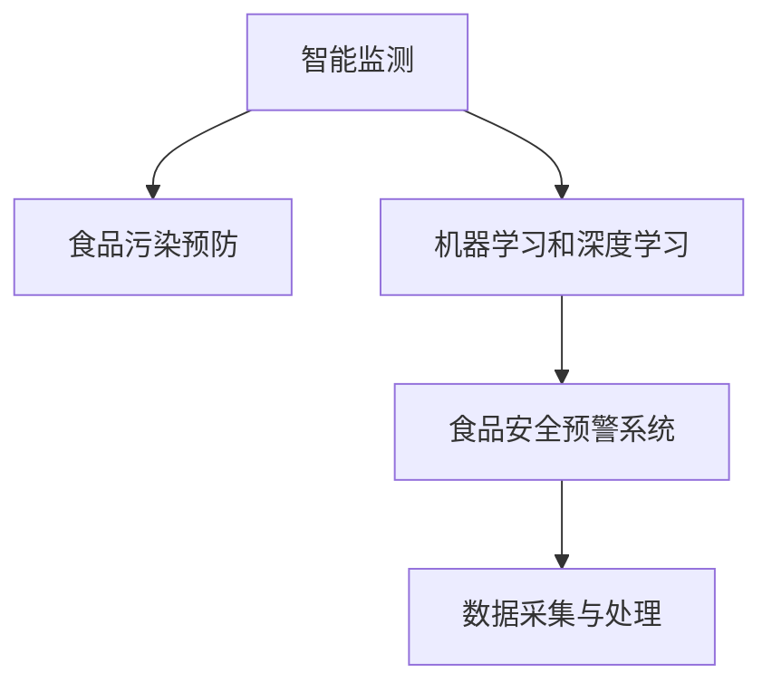

                 

# AI在智能食品安全监测中的应用：预防食品污染

> 关键词：人工智能, 智能食品安全监测, 食品污染预防, 机器学习, 深度学习, 食品安全预警系统

## 1. 背景介绍

食品安全是全球关注的重大问题，近年来频发的食品安全事件，如食品添加剂超量、假冒伪劣、生物污染等，给消费者健康带来了严重威胁。在传统的食品安全监管中，主要依赖人工检测和抽样调查，效率低、成本高且无法覆盖所有环节。因此，利用现代信息技术和AI技术进行智能食品安全监测，成为保障食品安全的必要手段。

### 1.1 智能食品安全监测的重要性

智能食品安全监测是指通过传感器、摄像头、互联网等技术手段，结合AI算法对食品生产、存储、运输、销售等环节进行实时监控，从而实现食品安全的智能预警和监管。其重要性体现在以下几个方面：

1. **提高食品安全监管效率**：智能监测技术可以覆盖传统人工抽检难以触及的微小环节，实现全天候、无死角的食品监管，大幅提升监管效率。
2. **降低食品安全风险**：通过及时检测和预警，能够有效避免食品污染事件的发生，保护消费者健康。
3. **优化食品安全管理**：智能监测系统能够自动收集和分析大量数据，为政府和企业在食品安全管理上提供科学依据。
4. **促进行业规范**：通过智能监测，能够推动食品生产企业加强自我管理和质量控制，提升整体行业水平。

### 1.2 智能食品安全监测的现状和挑战

当前，智能食品安全监测技术已在一些国家和地区得到应用，如美国、欧盟、中国等。例如，美国的FDA（食品和药物管理局）通过智能检测技术对食品生产环节进行监管，中国的食品药品监管总局也建立了食品安全追溯体系，利用AI技术进行食品质量和安全监测。然而，智能食品安全监测技术仍面临以下挑战：

1. **数据质量问题**：智能监测系统依赖大量的数据采集，如果数据质量不高，将直接影响监测效果。
2. **算法复杂度**：智能监测涉及的算法复杂，需要高精度的计算资源。
3. **模型可解释性**：智能监测模型的输出结果需要可解释性，以便监管部门理解和接受。
4. **跨界融合难度**：智能监测需要与多领域的知识结合，如农业、化学、生物学等，跨界融合难度较大。

## 2. 核心概念与联系

### 2.1 核心概念概述

为了更好地理解智能食品安全监测的核心概念，本节将介绍几个关键概念：

- **智能监测**：利用传感器、摄像头等技术手段，结合AI算法对食品生产和流通环节进行实时监控，实现食品安全的智能预警和监管。
- **食品污染预防**：通过智能监测系统，及时发现和处理食品污染事件，防止污染扩散。
- **机器学习和深度学习**：利用算法模型对数据进行分析和预测，是智能监测的核心技术手段。
- **食品安全预警系统**：基于智能监测技术，建立的食物安全预警和监管系统。
- **数据采集与处理**：智能监测系统需要大量的数据采集和处理，保证数据的质量和实时性。

这些概念之间的关系可以通过以下Mermaid流程图来展示：



这个流程图展示智能食品安全监测的核心概念及其之间的关系：

1. 智能监测是实现食品污染预防的基础。
2. 机器学习和深度学习提供智能监测的算法支持。
3. 食品安全预警系统是智能监测的输出结果。
4. 数据采集与处理是智能监测的输入来源。

这些概念共同构成了智能食品安全监测的核心技术框架，使得智能监测系统能够有效预警和预防食品污染事件。

## 3. 核心算法原理 & 具体操作步骤

### 3.1 算法原理概述

智能食品安全监测的核心算法原理基于机器学习和深度学习，通过构建预测模型对食品生产、存储、运输、销售等环节进行实时监控和预测，从而实现食品安全的智能预警和监管。

具体来说，智能监测系统通过对食品样本进行化学、物理、生物等方面的检测，获取大量特征数据，利用机器学习和深度学习算法，训练出能够自动识别和分类食品污染事件的模型。这些模型可以应用于食品生产、存储、运输、销售等环节，实现食品安全的智能预警和监管。

### 3.2 算法步骤详解

智能食品安全监测的算法步骤大致可以分为以下几个阶段：

**Step 1: 数据采集与预处理**
- 利用传感器、摄像头等技术手段，采集食品生产、存储、运输、销售等环节的实时数据。
- 对采集的数据进行预处理，如清洗、归一化、特征提取等，保证数据的质量和一致性。

**Step 2: 模型训练与优化**
- 选择合适的机器学习或深度学习算法，如支持向量机、随机森林、卷积神经网络等。
- 使用训练数据集训练模型，并通过交叉验证等方法对模型进行调参和优化。

**Step 3: 模型部署与监控**
- 将训练好的模型部署到智能监测系统中，实现对食品生产和流通环节的实时监控。
- 实时监控系统对采集的数据进行特征提取和预测，输出食品污染事件的风险评估结果。

**Step 4: 预警与反馈**
- 根据模型输出的风险评估结果，及时预警食品污染事件，并通知相关监管部门进行处理。
- 对处理结果进行反馈，用于进一步优化模型参数，提升预测精度。

**Step 5: 数据可视化与分析**
- 对模型输出的风险评估结果进行可视化，方便监管部门理解和决策。
- 对历史数据进行分析，提供科学依据和统计报告，指导食品企业的质量控制。

### 3.3 算法优缺点

智能食品安全监测的机器学习和深度学习算法具有以下优点：

1. **高效性**：能够快速处理大量数据，实时监控食品生产和流通环节，提升食品安全监管效率。
2. **准确性**：通过深度学习模型，能够精准预测食品污染事件，提高预警的准确性。
3. **可扩展性**：机器学习和深度学习算法易于扩展，适用于不同规模和类型的食品企业。

同时，这些算法也存在以下缺点：

1. **数据依赖性高**：模型的效果依赖于高质量的数据，如果数据采集和处理不准确，将直接影响模型的性能。
2. **模型复杂度高**：深度学习模型复杂度高，需要大量的计算资源进行训练和推理。
3. **可解释性差**：机器学习和深度学习模型通常是"黑盒"系统，难以解释其内部工作机制和决策逻辑。
4. **跨领域融合难度大**：智能监测涉及多领域的知识，如农业、化学、生物学等，跨领域融合难度较大。

### 3.4 算法应用领域

智能食品安全监测的机器学习和深度学习算法已广泛应用于以下领域：

1. **食品生产环节**：利用传感器对食品原料、加工过程、环境条件等进行实时监控，及时预警食品安全风险。
2. **食品存储环节**：通过摄像头和传感器监测食品存储条件，如温度、湿度、光照等，防止食品变质。
3. **食品运输环节**：利用GPS和传感器监测食品运输过程中的温度、湿度等参数，防止食品在运输过程中受到污染。
4. **食品销售环节**：通过摄像头和传感器监测食品销售过程中的卫生状况，防止食品受到污染。
5. **食品安全预警**：基于智能监测系统，建立食品安全预警和监管系统，及时预警食品污染事件。

## 4. 数学模型和公式 & 详细讲解 & 举例说明

### 4.1 数学模型构建

假设智能监测系统采集的食品样本数据为 $X = \{x_1, x_2, ..., x_n\}$，其中 $x_i$ 表示第 $i$ 个食品样本的特征向量。利用机器学习和深度学习算法，构建预测模型 $M$，输出食品污染事件的风险评估结果 $y$。模型训练的目标是最大化模型在训练集上的准确率，即：

$$
\max_{M} \frac{1}{n} \sum_{i=1}^{n} \mathbb{I}[M(x_i) = y_i]
$$

其中 $\mathbb{I}$ 表示指示函数，当 $M(x_i) = y_i$ 时，函数值为1，否则为0。

### 4.2 公式推导过程

以深度学习中的卷积神经网络（CNN）为例，其公式推导过程如下：

1. **输入层**：假设输入层有 $m$ 个神经元，每个神经元对应一个特征向量 $x_i$。

2. **卷积层**：卷积层对输入层进行卷积操作，得到特征图 $f_1 = [f_{11}, f_{12}, ..., f_{1m}]$。卷积操作公式为：

$$
f_{ik} = \sum_{j=1}^{n} w_{ij}x_{ij} + b_i
$$

其中 $w_{ij}$ 表示卷积核，$b_i$ 表示偏置项。

3. **池化层**：对卷积层输出的特征图进行池化操作，减少特征图的大小，降低计算复杂度。

4. **全连接层**：将池化层输出的特征图与全连接层连接，得到输出向量 $z = [z_1, z_2, ..., z_k]$，其中 $z_i$ 表示第 $i$ 个神经元的输出。

5. **输出层**：利用softmax函数将输出向量转换为概率分布，即：

$$
\hat{y_i} = \frac{e^{z_i}}{\sum_{j=1}^{k} e^{z_j}}
$$

6. **损失函数**：使用交叉熵损失函数对模型进行训练，即：

$$
L = -\frac{1}{n} \sum_{i=1}^{n} y_i \log \hat{y_i}
$$

7. **反向传播**：利用反向传播算法对模型进行训练，更新卷积核 $w_{ij}$ 和偏置项 $b_i$，使得模型在训练集上的准确率最大化。

### 4.3 案例分析与讲解

以智能监测系统中常用的深度学习算法卷积神经网络（CNN）为例，进行案例分析。

**案例1: 食品生产环节**
- **输入数据**：采集食品生产过程中的温度、湿度、光照等传感器数据。
- **模型设计**：设计卷积神经网络，对输入数据进行卷积、池化等操作，提取关键特征。
- **模型训练**：使用训练集进行模型训练，优化卷积核和偏置项，提高预测精度。
- **模型部署**：将训练好的模型部署到智能监测系统中，实现对食品生产环节的实时监控。

**案例2: 食品存储环节**
- **输入数据**：采集食品存储过程中的温度、湿度、光照等传感器数据。
- **模型设计**：设计卷积神经网络，对输入数据进行卷积、池化等操作，提取关键特征。
- **模型训练**：使用训练集进行模型训练，优化卷积核和偏置项，提高预测精度。
- **模型部署**：将训练好的模型部署到智能监测系统中，实现对食品存储环节的实时监控。

## 5. 项目实践：代码实例和详细解释说明

### 5.1 开发环境搭建

在进行智能食品安全监测的实践开发前，需要准备好开发环境。以下是使用Python进行TensorFlow开发的环境配置流程：

1. 安装Anaconda：从官网下载并安装Anaconda，用于创建独立的Python环境。

2. 创建并激活虚拟环境：
```bash
conda create -n tf-env python=3.8 
conda activate tf-env
```

3. 安装TensorFlow：根据CUDA版本，从官网获取对应的安装命令。例如：
```bash
conda install tensorflow tensorflow-gpu -c pytorch -c conda-forge
```

4. 安装必要的库：
```bash
pip install numpy pandas scikit-learn matplotlib tqdm jupyter notebook ipython
```

完成上述步骤后，即可在`tf-env`环境中开始智能食品安全监测的实践开发。

### 5.2 源代码详细实现

下面以卷积神经网络（CNN）为例，给出智能食品安全监测系统的Python代码实现。

```python
import tensorflow as tf
from tensorflow.keras import layers, models

# 定义CNN模型
def build_model(input_shape):
    model = models.Sequential([
        layers.Conv2D(32, (3, 3), activation='relu', input_shape=input_shape),
        layers.MaxPooling2D((2, 2)),
        layers.Conv2D(64, (3, 3), activation='relu'),
        layers.MaxPooling2D((2, 2)),
        layers.Conv2D(128, (3, 3), activation='relu'),
        layers.MaxPooling2D((2, 2)),
        layers.Flatten(),
        layers.Dense(128, activation='relu'),
        layers.Dense(2, activation='softmax')
    ])
    return model

# 定义训练数据
train_data = tf.keras.preprocessing.image.ImageDataGenerator(rescale=1./255).flow_from_directory(
    'train',
    target_size=(32, 32),
    class_mode='categorical'
)

# 定义测试数据
test_data = tf.keras.preprocessing.image.ImageDataGenerator(rescale=1./255).flow_from_directory(
    'test',
    target_size=(32, 32),
    class_mode='categorical'
)

# 构建模型
model = build_model((32, 32, 3))

# 编译模型
model.compile(optimizer='adam', loss='categorical_crossentropy', metrics=['accuracy'])

# 训练模型
model.fit(train_data, epochs=10, validation_data=test_data)
```

以上代码实现了CNN模型的构建、训练和验证，用于智能食品安全监测系统的开发。需要注意的是，实际应用中需要根据具体的输入数据和任务需求，对模型进行相应的调整和优化。

### 5.3 代码解读与分析

让我们再详细解读一下关键代码的实现细节：

**CNN模型构建**
- 使用`Sequential`模型构建CNN，依次添加卷积层、池化层、全连接层等。
- 卷积层采用3x3的卷积核，激活函数为ReLU。
- 池化层采用2x2的池化窗口。
- 全连接层和输出层分别包含128个和2个神经元，激活函数分别为ReLU和Softmax。

**训练数据生成**
- 使用`ImageDataGenerator`生成训练和测试数据集，并进行归一化处理。
- 设置输入数据的大小为32x32，通道数为3。
- 设置类别模式为categorical，表示二分类任务。

**模型训练**
- 编译模型，使用adam优化器和交叉熵损失函数。
- 设置训练轮数为10，并在测试集上进行验证。

以上代码实现了智能食品安全监测系统的基本功能，包括模型构建、数据生成和训练。在实际应用中，还需要对模型进行进一步优化和调参，以提高预测精度和稳定性。

## 6. 实际应用场景

### 6.1 智能监测系统在食品生产环节的应用

在食品生产环节，智能监测系统通过传感器实时采集温度、湿度、光照等参数，对食品生产过程进行监控。利用CNN等深度学习模型，对采集的数据进行分析和预测，及时预警食品安全风险，防止食品污染事件的发生。

例如，某食品生产企业使用智能监测系统，对原料存储、加工过程和成品包装等环节进行监控。通过传感器采集温度、湿度、光照等参数，输入到CNN模型中进行特征提取和预测。模型输出的风险评估结果通过可视化界面显示，监管部门可以实时监控食品生产过程，及时发现和处理食品安全问题。

### 6.2 智能监测系统在食品存储环节的应用

在食品存储环节，智能监测系统通过摄像头和传感器实时监控食品存储条件，如温度、湿度、光照等，防止食品变质。利用CNN等深度学习模型，对采集的数据进行分析和预测，及时预警食品安全风险，防止食品污染事件的发生。

例如，某食品仓储企业使用智能监测系统，对食品存储过程中的温度、湿度、光照等参数进行实时监控。通过摄像头和传感器采集数据，输入到CNN模型中进行特征提取和预测。模型输出的风险评估结果通过可视化界面显示，监管部门可以实时监控食品存储条件，及时发现和处理食品安全问题。

### 6.3 智能监测系统在食品运输环节的应用

在食品运输环节，智能监测系统通过GPS和传感器实时监控食品运输过程中的温度、湿度等参数，防止食品在运输过程中受到污染。利用CNN等深度学习模型，对采集的数据进行分析和预测，及时预警食品安全风险，防止食品污染事件的发生。

例如，某食品物流企业使用智能监测系统，对食品运输过程中的温度、湿度等参数进行实时监控。通过GPS和传感器采集数据，输入到CNN模型中进行特征提取和预测。模型输出的风险评估结果通过可视化界面显示，监管部门可以实时监控食品运输条件，及时发现和处理食品安全问题。

### 6.4 智能监测系统在食品销售环节的应用

在食品销售环节，智能监测系统通过摄像头和传感器实时监控食品销售过程中的卫生状况，防止食品受到污染。利用CNN等深度学习模型，对采集的数据进行分析和预测，及时预警食品安全风险，防止食品污染事件的发生。

例如，某食品零售企业使用智能监测系统，对食品销售过程中的卫生状况进行实时监控。通过摄像头和传感器采集数据，输入到CNN模型中进行特征提取和预测。模型输出的风险评估结果通过可视化界面显示，监管部门可以实时监控食品销售过程中的卫生状况，及时发现和处理食品安全问题。

### 6.5 智能监测系统在食品安全预警中的应用

在食品安全预警环节，智能监测系统基于前述环节的实时监控数据，构建食品安全预警和监管系统，及时预警食品污染事件，防止食品污染事件的发生。

例如，某食品安全监管部门使用智能监测系统，对食品生产、存储、运输和销售等环节进行实时监控，构建食品安全预警和监管系统。通过采集和分析数据，及时预警食品安全风险，防止食品污染事件的发生。

## 7. 工具和资源推荐

### 7.1 学习资源推荐

为了帮助开发者系统掌握智能食品安全监测的理论基础和实践技巧，这里推荐一些优质的学习资源：

1. 《深度学习基础》系列书籍：适合初学者入门，详细介绍了深度学习的基本概念和核心算法。
2. 《机器学习实战》系列书籍：适合有经验的开发者，涵盖大量实战案例和代码实现。
3. 《Python深度学习》系列书籍：适合有一定编程基础的开发者，详细介绍了深度学习在Python中的实现方法。
4. TensorFlow官方文档：提供了详尽的TensorFlow教程和API文档，适合深入学习和实践。
5. PyTorch官方文档：提供了详尽的PyTorch教程和API文档，适合深入学习和实践。

通过对这些资源的学习实践，相信你一定能够快速掌握智能食品安全监测的精髓，并用于解决实际的食品安全问题。

### 7.2 开发工具推荐

高效的开发离不开优秀的工具支持。以下是几款用于智能食品安全监测开发的常用工具：

1. TensorFlow：由Google主导开发的开源深度学习框架，生产部署方便，适合大规模工程应用。
2. PyTorch：由Facebook主导开发的开源深度学习框架，灵活性高，适合快速迭代研究。
3. OpenCV：开源计算机视觉库，提供了丰富的图像处理和分析功能。
4. TensorBoard：TensorFlow配套的可视化工具，可实时监测模型训练状态，提供丰富的图表呈现方式。
5. Weights & Biases：模型训练的实验跟踪工具，可以记录和可视化模型训练过程中的各项指标，方便对比和调优。

合理利用这些工具，可以显著提升智能食品安全监测任务的开发效率，加快创新迭代的步伐。

### 7.3 相关论文推荐

智能食品安全监测的研究涉及多领域的知识，以下是几篇奠基性的相关论文，推荐阅读：

1. 《Using Deep Learning for Food Safety Monitoring》（使用深度学习进行食品安全监测）：详细介绍了深度学习在食品安全监测中的应用。
2. 《Real-time Food Safety Monitoring Using Convolutional Neural Networks》（使用卷积神经网络进行实时食品安全监测）：展示了卷积神经网络在实时食品安全监测中的应用。
3. 《Anomaly Detection in Food Quality Using Machine Learning》（使用机器学习进行食品质量异常检测）：介绍了机器学习在食品质量检测中的应用。

这些论文代表了大语言模型微调技术的发展脉络。通过学习这些前沿成果，可以帮助研究者把握学科前进方向，激发更多的创新灵感。

## 8. 总结：未来发展趋势与挑战

### 8.1 总结

本文对智能食品安全监测技术进行了全面系统的介绍。首先阐述了智能食品安全监测的重要性，明确了其在大规模食品安全监管中的价值。其次，从原理到实践，详细讲解了智能食品安全监测的数学原理和关键步骤，给出了智能食品安全监测系统的完整代码实现。同时，本文还广泛探讨了智能食品安全监测在食品生产、存储、运输、销售等环节的应用前景，展示了智能监测范式的巨大潜力。此外，本文精选了智能食品安全监测的学习资源，力求为读者提供全方位的技术指引。

通过本文的系统梳理，可以看到，智能食品安全监测技术正在成为食品安全监管的重要手段，极大地提升了食品安全监管的效率和准确性。未来，伴随智能监测技术的不断发展，智能食品安全监测必将在更广泛的领域得到应用，为食品安全保障提供新的解决方案。

### 8.2 未来发展趋势

展望未来，智能食品安全监测技术将呈现以下几个发展趋势：

1. **智能化水平提升**：随着深度学习技术的不断进步，智能食品安全监测系统的智能化水平将进一步提升，能够更加精准地预警食品安全风险。
2. **跨领域融合**：智能食品安全监测将与其他领域的技术进行深度融合，如物联网、大数据、人工智能等，构建更加全面、智能的食品安全监管系统。
3. **数据驱动**：智能食品安全监测将更加依赖于高质量的数据，通过数据驱动的方式提升系统性能。
4. **可解释性和透明性增强**：智能食品安全监测系统的输出结果需要更高的可解释性和透明性，便于监管部门理解和接受。
5. **动态优化**：智能食品安全监测系统将能够动态优化，及时调整模型参数，适应数据分布的变化。

这些趋势凸显了智能食品安全监测技术的广阔前景。这些方向的探索发展，必将进一步提升智能食品安全监测系统的性能和应用范围，为食品安全保障提供新的解决方案。

### 8.3 面临的挑战

尽管智能食品安全监测技术已经取得了瞩目成就，但在迈向更加智能化、普适化应用的过程中，它仍面临诸多挑战：

1. **数据质量问题**：智能监测系统依赖大量的数据采集，如果数据质量不高，将直接影响监测效果。
2. **算法复杂度**：智能监测涉及的算法复杂，需要高精度的计算资源。
3. **模型可解释性**：智能监测模型的输出结果需要可解释性，以便监管部门理解和接受。
4. **跨领域融合难度大**：智能监测涉及多领域的知识，如农业、化学、生物学等，跨领域融合难度较大。
5. **实时性要求高**：智能食品安全监测需要实时监控，对系统的实时性和稳定性要求较高。

### 8.4 研究展望

面对智能食品安全监测所面临的挑战，未来的研究需要在以下几个方面寻求新的突破：

1. **数据质量优化**：通过数据清洗、预处理等技术，提升数据质量，确保数据的一致性和准确性。
2. **算法优化**：开发更加高效、易于优化的算法，降低计算资源消耗，提升实时性。
3. **模型可解释性增强**：开发可解释性强的模型，便于监管部门理解和接受。
4. **跨领域融合**：探索跨领域融合技术，提高智能食品安全监测系统的普适性和应用范围。
5. **动态优化技术**：开发动态优化算法，实时调整模型参数，适应数据分布的变化。

这些研究方向的探索，必将引领智能食品安全监测技术迈向更高的台阶，为食品安全保障提供新的解决方案。面向未来，智能食品安全监测技术还需要与其他技术进行更深入的融合，如知识表示、因果推理、强化学习等，多路径协同发力，共同推动食品安全技术的进步。只有勇于创新、敢于突破，才能不断拓展食品安全技术的边界，让智能技术更好地造福人类社会。

## 9. 附录：常见问题与解答

**Q1: 智能食品安全监测系统如何部署？**

A: 智能食品安全监测系统的部署需要考虑多个方面，以下是关键步骤：

1. **硬件资源准备**：确保系统部署所需的硬件资源，如高性能服务器、网络设备等。
2. **软件安装**：在服务器上安装必要的软件，如TensorFlow、OpenCV等。
3. **模型加载**：将训练好的模型加载到服务器上，进行实时监控和预测。
4. **数据采集**：通过传感器、摄像头等设备采集食品生产和流通环节的实时数据。
5. **数据处理**：对采集的数据进行预处理，如清洗、归一化、特征提取等。
6. **模型推理**：利用加载的模型对处理后的数据进行推理，输出食品安全风险评估结果。
7. **可视化界面**：建立可视化界面，将风险评估结果展示给监管部门，便于实时监控和预警。

通过以上步骤，智能食品安全监测系统即可部署到实际环境中，实现对食品生产和流通环节的实时监控和预警。

**Q2: 智能食品安全监测系统的核心算法是什么？**

A: 智能食品安全监测系统的核心算法主要包括机器学习和深度学习算法，如卷积神经网络（CNN）、随机森林、支持向量机等。这些算法能够对食品生产、存储、运输、销售等环节的实时数据进行分析和预测，及时预警食品安全风险，防止食品污染事件的发生。

**Q3: 智能食品安全监测系统如何处理异常数据？**

A: 智能食品安全监测系统通过以下方式处理异常数据：

1. **数据清洗**：对采集的数据进行清洗，去除噪声和错误数据，确保数据的质量和一致性。
2. **异常检测**：利用异常检测算法，如基于统计学的方法、基于深度学习的方法等，检测并过滤异常数据。
3. **模型优化**：通过模型优化，增强系统对异常数据的鲁棒性，提升系统的稳定性和准确性。

通过以上步骤，智能食品安全监测系统能够有效处理异常数据，确保系统的稳定性和准确性。

**Q4: 智能食品安全监测系统如何确保数据的隐私和安全性？**

A: 智能食品安全监测系统通过以下方式确保数据的隐私和安全性：

1. **数据加密**：对采集的数据进行加密处理，防止数据泄露和篡改。
2. **访问控制**：设置严格的访问控制，确保只有授权人员能够访问和使用系统。
3. **匿名化处理**：对敏感数据进行匿名化处理，防止数据泄露对个人隐私的侵害。
4. **安全审计**：建立安全审计机制，对系统的操作和数据访问进行监控和记录。

通过以上措施，智能食品安全监测系统能够确保数据的隐私和安全性，防止数据泄露和滥用。

**Q5: 智能食品安全监测系统如何提高模型的鲁棒性？**

A: 智能食品安全监测系统通过以下方式提高模型的鲁棒性：

1. **数据增强**：通过数据增强技术，扩充训练数据集，提高模型的泛化能力。
2. **对抗训练**：引入对抗样本，训练模型对噪声和异常数据的鲁棒性。
3. **正则化**：利用L2正则、Dropout等技术，防止模型过拟合，提升模型的泛化能力。
4. **集成学习**：通过模型集成技术，提升系统的鲁棒性和稳定性。

通过以上措施，智能食品安全监测系统能够提高模型的鲁棒性，提升系统的稳定性和准确性。

---

作者：禅与计算机程序设计艺术 / Zen and the Art of Computer Programming

