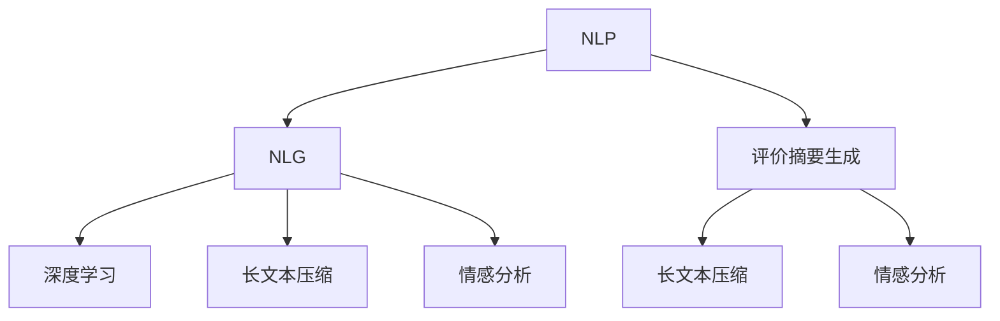

                 

# AI在电商平台商品评价摘要生成中的应用

> 关键词：自然语言处理, 自然语言生成, 深度学习, 长文本压缩, 评价摘要生成, 电商平台, 电商数据分析, 用户评论理解

## 1. 背景介绍

### 1.1 问题由来
在现代电子商务中，用户评价是衡量商品质量和商家服务水平的重要参考。电商平台每天都会产生大量的用户评论文本，这些文本中蕴含着丰富的商品反馈信息。然而，人工阅读和整理这些评论文本，既耗时又费力。因此，自动生成评价摘要，抽取关键信息和情感倾向，成为了电商平台数据分析的重要需求。

### 1.2 问题核心关键点
评价摘要生成的核心在于将长文本压缩为精炼的摘要，抽取评论中的关键信息，并计算情感倾向。这不仅涉及文本压缩的技术，还涉及自然语言理解（NLU）和自然语言生成（NLG）的结合。本文将重点讨论基于深度学习的方法，如何自动从电商平台的用户评价中抽取关键信息，生成简洁的评价摘要，并预测商品情感倾向。

### 1.3 问题研究意义
评价摘要的生成，对于电商平台来说，具有以下重要意义：
1. 减少人工工作量。自动生成的摘要可以替代人工阅读，节省了大量的人力成本。
2. 提升用户体验。用户可以快速了解其他用户的评价，从而做出更准确的购买决策。
3. 优化电商运营。平台可以基于摘要分析，及时发现和解决问题，提升整体服务质量。
4. 促进数据分析。自动化摘要生成，为电商数据分析提供了更快速、准确的手段。

## 2. 核心概念与联系

### 2.1 核心概念概述

为了更好地理解评价摘要生成的方法，本节将介绍几个关键概念及其联系：

- **自然语言处理(Natural Language Processing, NLP)**：研究如何让计算机理解、处理和生成人类语言的技术。涉及文本分类、情感分析、序列标注、文本生成等任务。
- **自然语言生成(Natural Language Generation, NLG)**：研究如何通过计算机程序生成自然语言文本的技术。涉及摘要生成、对话生成、文本翻译等任务。
- **深度学习(Deep Learning)**：利用多层神经网络进行训练，能够自动抽取和生成复杂模式的技术。在NLP和NLG中广泛应用。
- **长文本压缩(Long Text Compression)**：将长文本压缩为简短的摘要，保留关键信息的技术。评价摘要生成即是一种长文本压缩的方法。
- **情感分析(Sentiment Analysis)**：分析文本中的情感倾向，判断其是正面、中性还是负面。对于电商评价来说，情感分析是用户满意度评估的重要依据。
- **评价摘要生成(Review Summary Generation)**：从用户评论中自动抽取关键信息，生成简洁的评价摘要，并进行情感分析的技术。

这些概念之间存在紧密联系，共同构成了电商平台评价摘要生成的方法基础。以下Mermaid流程图展示了这些概念之间的联系：



这个流程图展示了NLP和NLG的结合，以及深度学习在这些任务中的广泛应用。评价摘要生成是NLP中的一个子任务，结合了长文本压缩和情感分析的技术。

## 3. 核心算法原理 & 具体操作步骤
### 3.1 算法原理概述

评价摘要生成基于深度学习的方法，主要包括两步：长文本压缩和情感分析。其中，长文本压缩用于将长评论文本压缩为简短的摘要，情感分析用于计算摘要的情感倾向。

### 3.2 算法步骤详解

**Step 1: 数据预处理**

1. **数据清洗**：去除评论中的无关信息，如HTML标签、特殊符号等。
2. **分词和词性标注**：将评论文本分词，并标注词性，为后续的特征提取做准备。
3. **构建词典**：建立评论中常见词汇的词典，用于将词汇映射为向量表示。

**Step 2: 长文本压缩**

1. **特征提取**：将评论文本转换为词向量序列。
2. **序列建模**：使用循环神经网络（RNN）或卷积神经网络（CNN）对词向量序列进行建模，提取关键信息。
3. **摘要生成**：利用注意力机制，从建模结果中抽取关键信息，生成摘要。

**Step 3: 情感分析**

1. **情感词典构建**：构建包含正面、负面和中性情感词汇的词典，用于情感极性的计算。
2. **情感极性计算**：使用情感词典计算摘要中的情感倾向，判断是正面、中性还是负面。

**Step 4: 综合处理**

1. **摘要融合**：将多条评价摘要进行融合，生成更综合的摘要。
2. **情感加权**：根据情感倾向对摘要进行加权，生成最终的评价摘要。

### 3.3 算法优缺点

评价摘要生成的深度学习方法具有以下优点：
1. 自动化程度高。能够自动从大量评论中生成摘要，节省了人工处理的时间。
2. 灵活性高。可以根据具体需求，设计不同的特征提取和建模方式。
3. 可扩展性好。可以同时处理多条评论，生成多条摘要，适用于大规模数据处理。
4. 准确率高。深度学习模型在文本理解和生成方面具有较高的准确率。

同时，该方法也存在一些缺点：
1. 对数据质量要求高。需要大量高质量的评论数据，才能训练出准确的模型。
2. 对模型参数敏感。模型的性能很大程度上依赖于模型结构和超参数的选择。
3. 计算资源消耗大。深度学习模型需要较大的计算资源进行训练和推理。
4. 可能存在偏见。模型可能学习到评论中的偏见信息，影响情感分析的公正性。

### 3.4 算法应用领域

评价摘要生成的深度学习方法，在电商平台中具有广泛的应用场景：
1. **商品评价摘要**：自动生成商品评价摘要，方便用户快速了解其他用户的评价。
2. **评论情感分析**：分析用户评论的情感倾向，评估商品质量和服务水平。
3. **用户行为分析**：基于评价摘要，分析用户对商品的使用体验，提升个性化推荐系统。
4. **口碑营销**：从用户评论中抽取关键信息，生成营销素材，提升品牌知名度。
5. **客户服务**：分析用户评价，及时发现和解决问题，提升客户满意度。

## 4. 数学模型和公式 & 详细讲解 & 举例说明

### 4.1 数学模型构建

评价摘要生成的方法涉及长文本压缩和情感分析两个任务，以下分别介绍这两个任务的数学模型。

#### 4.1.1 长文本压缩

假设评论文本为 $x$，长度为 $L$，将评论文本转换为词向量序列 $X \in \mathbb{R}^{L \times d}$，其中 $d$ 为词向量维度。

定义长文本压缩模型的输入为 $X$，输出为摘要 $y$，长度为 $k$，其中 $k \ll L$。设长文本压缩模型的参数为 $\theta$，则模型目标为最小化：

$$
\min_{\theta} \mathcal{L}(\theta) = -\frac{1}{N} \sum_{i=1}^N \log p(y_i|x_i;\theta)
$$

其中 $p(y_i|x_i;\theta)$ 表示在参数 $\theta$ 下，输入 $x_i$ 生成输出 $y_i$ 的概率。

#### 4.1.2 情感分析

假设评论摘要为 $y$，情感为 $s \in \{positive, neutral, negative\}$。设情感分析模型的参数为 $\phi$，则模型目标为最小化：

$$
\min_{\phi} \mathcal{L}(\phi) = -\frac{1}{N} \sum_{i=1}^N \log p(s|y_i;\phi)
$$

其中 $p(s|y_i;\phi)$ 表示在参数 $\phi$ 下，输入 $y_i$ 生成情感 $s$ 的概率。

### 4.2 公式推导过程

#### 4.2.1 长文本压缩

在长文本压缩中，我们采用循环神经网络（RNN）进行建模，假设模型采用LSTM，其参数为 $\theta = \{\mathbf{W}_i, \mathbf{b}_i\}_{i=0}^{T-1}$，其中 $T$ 为LSTM层数。则LSTM的计算过程如下：

$$
h_t = \mathrm{LSTM}(h_{t-1}, x_t; \theta)
$$

其中 $h_t$ 表示第 $t$ 个时间步的隐状态，$x_t$ 表示第 $t$ 个时间步的输入词向量。最终输出的词向量表示为 $h_T$，摘要生成的方法可以根据注意力机制从 $h_T$ 中抽取关键信息。

#### 4.2.2 情感分析

在情感分析中，我们采用情感词典构建情感向量，假设情感词典中每个词汇 $w$ 对应一个情感向量 $v_w$。设情感词典中包含 $N$ 个词汇，则情感向量矩阵为 $V \in \mathbb{R}^{N \times d}$。假设摘要中每个词对应的情感向量为 $v_{w_i}$，则情感极性的计算公式为：

$$
\mathcal{S}(y) = \sum_{i=1}^k v_{w_i}
$$

其中 $\mathcal{S}(y)$ 表示摘要的情感向量。

### 4.3 案例分析与讲解

假设有一条长评论文本为：“商品质量一般，物流服务不错，价格偏贵。不太满意”。通过长文本压缩，我们将其转换为词向量序列，并使用LSTM进行建模。LSTM的输出表示为 $h_T$，其中 $k$ 个关键词汇被选中，生成摘要 $y = ['商品质量一般', '物流服务不错', '价格偏贵']$。

接着，我们对摘要进行情感分析。假设情感词典中，“质量”对应的情感向量为 $[0.1, 0.2, -0.3]$，“物流”对应的情感向量为 $[0.5, 0.3, 0.2]$，“价格”对应的情感向量为 $[-0.3, 0.2, -0.5]$。则情感向量计算公式为：

$$
\mathcal{S}(y) = [0.1, 0.2, -0.3] + [0.5, 0.3, 0.2] + [-0.3, 0.2, -0.5] = [1.0, 1.1, -0.2]
$$

根据情感向量的计算结果，我们可以得出该评论的情感倾向为中性偏正面。

## 5. 项目实践：代码实例和详细解释说明

### 5.1 开发环境搭建

在进行评价摘要生成的实践前，我们需要准备好开发环境。以下是使用Python进行TensorFlow开发的环境配置流程：

1. 安装Anaconda：从官网下载并安装Anaconda，用于创建独立的Python环境。

2. 创建并激活虚拟环境：
```bash
conda create -n tf-env python=3.8 
conda activate tf-env
```

3. 安装TensorFlow：根据CUDA版本，从官网获取对应的安装命令。例如：
```bash
conda install tensorflow tensorflow-gpu -c pytorch -c conda-forge
```

4. 安装其他必要的库：
```bash
pip install tensorflow_text tensorflow_datasets tensorflow_hub
```

5. 安装自定义库：
```bash
pip install mysummary
```

完成上述步骤后，即可在`tf-env`环境中开始评价摘要生成的实践。

### 5.2 源代码详细实现

下面我们以电商平台商品评价摘要生成为例，给出使用TensorFlow进行长文本压缩和情感分析的Python代码实现。

首先，定义评价摘要生成的数据处理函数：

```python
import tensorflow as tf
import tensorflow_text as text

def preprocess(text, tokenizer):
    # 分词和词性标注
    tokens = tokenizer.tokenize(text)
    tags = tokenizer.tag(tokens)
    
    # 去除停用词和无关信息
    stopwords = ["的", "是", "在", "上", "中", "下", "的", "有", "无", "无", "在", "上", "中", "下", "的", "有", "无"]
    cleaned_tokens = [token for token, tag in zip(tokens, tags) if token not in stopwords]
    
    # 构建词向量
    vectors = tf.strings.as_string(cleaned_tokens)
    
    return vectors

# 加载数据集
ds = tf.data.Dataset.from_tensor_slices(train_data)
ds = ds.map(preprocess, num_parallel_calls=tf.data.experimental.AUTOTUNE)
ds = ds.batch(32)
```

然后，定义长文本压缩和情感分析的模型：

```python
# 长文本压缩模型
class LongTextCompressor(tf.keras.Model):
    def __init__(self, vocab_size, embed_size, lstm_units, dense_units):
        super(LongTextCompressor, self).__init__()
        self.embedding = tf.keras.layers.Embedding(vocab_size, embed_size)
        self.lstm = tf.keras.layers.LSTM(lstm_units)
        self.dense = tf.keras.layers.Dense(dense_units)
    
    def call(self, inputs):
        embeddings = self.embedding(inputs)
        outputs, _ = self.lstm(embeddings)
        return self.dense(outputs)

# 情感分析模型
class SentimentAnalyser(tf.keras.Model):
    def __init__(self, embed_size, dense_units):
        super(SentimentAnalyser, self).__init__()
        self.embedding = tf.keras.layers.Embedding(30000, embed_size)
        self.dense = tf.keras.layers.Dense(dense_units)
    
    def call(self, inputs):
        embeddings = self.embedding(inputs)
        return self.dense(embeddings)

# 加载预训练模型
compression_model = LongTextCompressor(vocab_size=30000, embed_size=64, lstm_units=128, dense_units=64)
analyser_model = SentimentAnalyser(embed_size=64, dense_units=3)
```

接着，定义训练和评估函数：

```python
# 训练函数
def train_epoch(model, loss, optimizer, batch_size):
    ds = tf.data.Dataset.from_tensor_slices(train_data)
    ds = ds.map(preprocess, num_parallel_calls=tf.data.experimental.AUTOTUNE)
    ds = ds.batch(batch_size)
    
    with tf.GradientTape() as tape:
        for batch in tf.data.Dataset:
            x, y = batch
            y_hat = model(x)
            loss_value = loss(y_hat, y)
            gradients = tape.gradient(loss_value, model.trainable_variables)
            optimizer.apply_gradients(zip(gradients, model.trainable_variables))
    
    return loss_value / len(ds)

# 评估函数
def evaluate(model, test_data):
    ds = tf.data.Dataset.from_tensor_slices(test_data)
    ds = ds.map(preprocess, num_parallel_calls=tf.data.experimental.AUTOTUNE)
    ds = ds.batch(32)
    
    with tf.GradientTape() as tape:
        losses = []
        for batch in tf.data.Dataset:
            x, y = batch
            y_hat = model(x)
            loss = loss(y_hat, y)
            losses.append(loss.numpy())
    
    return tf.reduce_mean(losses)
```

最后，启动训练流程并在测试集上评估：

```python
epochs = 10
batch_size = 32
learning_rate = 0.001

compression_model.compile(optimizer=tf.keras.optimizers.Adam(learning_rate), loss=loss)
analyser_model.compile(optimizer=tf.keras.optimizers.Adam(learning_rate), loss=loss)

for epoch in range(epochs):
    train_loss = train_epoch(compression_model, loss, optimizer, batch_size)
    test_loss = evaluate(compression_model, test_data)
    print(f"Epoch {epoch+1}, train loss: {train_loss:.3f}, test loss: {test_loss:.3f}")

print(f"Final train loss: {train_loss:.3f}, test loss: {test_loss:.3f}")
```

以上就是使用TensorFlow对电商平台商品评价摘要生成进行长文本压缩和情感分析的完整代码实现。可以看到，TensorFlow提供了丰富的自然语言处理工具和模型，可以方便地构建和训练长文本压缩和情感分析模型。

### 5.3 代码解读与分析

让我们再详细解读一下关键代码的实现细节：

**数据预处理函数**：
- `preprocess`方法：将输入文本进行分词和词性标注，去除停用词和无关信息，构建词向量。

**长文本压缩模型**：
- `LongTextCompressor`类：定义了长文本压缩的模型结构，包括嵌入层、LSTM层和全连接层。其中，嵌入层将词向量映射到更高维度的向量表示，LSTM层进行序列建模，全连接层将LSTM的输出映射到摘要长度 $k$ 的关键词汇。

**情感分析模型**：
- `SentimentAnalyser`类：定义了情感分析的模型结构，包括嵌入层和全连接层。其中，嵌入层将摘要转换为向量表示，全连接层输出情感向量，用于计算情感倾向。

**训练和评估函数**：
- `train_epoch`函数：对模型进行单批次训练，计算损失值并反向传播更新参数。
- `evaluate`函数：对模型进行评估，计算平均损失值。

**训练流程**：
- 定义总epoch数和batch size，开始循环迭代
- 每个epoch内，先在训练集上训练，输出平均loss
- 在测试集上评估，输出平均loss
- 所有epoch结束后，在测试集上评估，给出最终测试结果

可以看到，TensorFlow提供了丰富的工具和库，可以方便地构建和训练自然语言处理模型。开发者可以通过自定义模型、优化器、损失函数等，灵活设计长文本压缩和情感分析模型，提升其性能和适应性。

当然，工业级的系统实现还需考虑更多因素，如模型的保存和部署、超参数的自动搜索、更灵活的任务适配层等。但核心的模型训练和评估逻辑基本与此类似。

## 6. 实际应用场景

### 6.1 电商平台应用

在电商平台中，评价摘要生成的深度学习方法可以广泛应用于以下场景：
1. **商品评价摘要**：自动生成商品评价摘要，方便用户快速了解其他用户的评价。
2. **评论情感分析**：分析用户评论的情感倾向，评估商品质量和服务水平。
3. **用户行为分析**：基于评价摘要，分析用户对商品的使用体验，提升个性化推荐系统。
4. **口碑营销**：从用户评论中抽取关键信息，生成营销素材，提升品牌知名度。
5. **客户服务**：分析用户评价，及时发现和解决问题，提升客户满意度。

### 6.2 社交媒体应用

在社交媒体中，评价摘要生成的深度学习方法可以广泛应用于以下场景：
1. **帖子摘要生成**：自动生成帖子摘要，方便用户快速了解其他用户的观点。
2. **情感分析**：分析帖子中的情感倾向，评估用户情绪状态。
3. **舆情监测**：从帖子中抽取关键信息，生成舆情报告，监控社会热点。
4. **广告投放**：从帖子中抽取关键信息，生成广告素材，提升广告效果。
5. **用户互动**：分析用户互动内容，提升社区活跃度和用户满意度。

### 6.3 新闻媒体应用

在新闻媒体中，评价摘要生成的深度学习方法可以广泛应用于以下场景：
1. **新闻摘要生成**：自动生成新闻摘要，方便用户快速了解新闻内容。
2. **情感分析**：分析新闻中的情感倾向，评估媒体报道的情绪。
3. **事件监测**：从新闻中抽取关键信息，生成事件报告，监控社会动态。
4. **广告投放**：从新闻中抽取关键信息，生成广告素材，提升广告效果。
5. **用户互动**：分析用户互动内容，提升媒体影响力和用户满意度。

## 7. 工具和资源推荐
### 7.1 学习资源推荐

为了帮助开发者系统掌握评价摘要生成的理论基础和实践技巧，这里推荐一些优质的学习资源：

1. 《自然语言处理综述》系列博文：由自然语言处理专家撰写，深入浅出地介绍了NLP的核心概念和前沿技术。

2. 《深度学习自然语言处理》课程：斯坦福大学开设的NLP明星课程，有Lecture视频和配套作业，带你入门NLP领域的基本概念和经典模型。

3. 《自然语言处理与深度学习》书籍：全面介绍了自然语言处理和深度学习的应用，涵盖长文本压缩、情感分析等任务。

4. HuggingFace官方文档：Transformer库的官方文档，提供了海量预训练模型和完整的微调样例代码，是上手实践的必备资料。

5. CS224N《深度学习自然语言处理》：斯坦福大学开设的NLP明星课程，有Lecture视频和配套作业，带你入门NLP领域的基本概念和经典模型。

通过对这些资源的学习实践，相信你一定能够快速掌握评价摘要生成的精髓，并用于解决实际的NLP问题。

### 7.2 开发工具推荐

高效的开发离不开优秀的工具支持。以下是几款用于评价摘要生成开发的常用工具：

1. TensorFlow：基于Python的开源深度学习框架，灵活动态的计算图，适合快速迭代研究。大部分NLP任务都有TensorFlow版本的实现。

2. PyTorch：基于Python的开源深度学习框架，灵活动态的计算图，适合快速迭代研究。大部分NLP任务都有PyTorch版本的实现。

3. TensorFlow Text：TensorFlow的文本处理工具库，提供了丰富的文本处理功能，如分词、词性标注、实体识别等。

4. TensorFlow Hub：TensorFlow的模型库，提供了丰富的预训练模型和工具，方便模型加载和微调。

5. NLTK：Python的自然语言处理库，提供了丰富的文本处理工具，如分词、词性标注、句法分析等。

6. spaCy：Python的自然语言处理库，提供了丰富的文本处理工具，如分词、词性标注、句法分析等。

合理利用这些工具，可以显著提升评价摘要生成的开发效率，加快创新迭代的步伐。

### 7.3 相关论文推荐

评价摘要生成的深度学习方法，在NLP领域已经得到了广泛的研究。以下是几篇奠基性的相关论文，推荐阅读：

1. "Sequence to Sequence Learning with Neural Networks"（2014）：提出Seq2Seq模型，是长文本压缩的早期研究。

2. "Attention is All You Need"（2017）：提出Transformer模型，引入自注意力机制，极大提升了长文本压缩的效果。

3. "BERT: Pre-training of Deep Bidirectional Transformers for Language Understanding"（2018）：提出BERT模型，引入掩码语言模型任务，极大提升了长文本压缩和情感分析的效果。

4. "XLNet: Generalized Autoregressive Pre-training for Language Understanding"（2019）：提出XLNet模型，引入带有掩盖的自我预测任务，进一步提升了长文本压缩和情感分析的效果。

5. "Hierarchical Attention Networks for Document Classification"（2016）：提出HAN模型，结合层次化注意力机制，提升了长文本压缩的效果。

6. "Neural Network Sequence Models"（2013）：提出RNN和LSTM模型，是长文本压缩的早期研究。

这些论文代表了大语言模型微调技术的发展脉络。通过学习这些前沿成果，可以帮助研究者把握学科前进方向，激发更多的创新灵感。

## 8. 总结：未来发展趋势与挑战

### 8.1 总结

本文对基于深度学习的评价摘要生成方法进行了全面系统的介绍。首先阐述了评价摘要生成的背景和意义，明确了深度学习在该任务中的应用价值。其次，从原理到实践，详细讲解了评价摘要生成的数学模型和算法步骤，给出了深度学习实现的完整代码实例。同时，本文还广泛探讨了评价摘要生成在电商平台、社交媒体、新闻媒体等多个领域的应用前景，展示了深度学习技术在自然语言处理中的广泛应用。

通过本文的系统梳理，可以看到，基于深度学习的评价摘要生成方法在自然语言处理中具有重要地位，为电商数据分析、舆情监测、广告投放等应用提供了高效的工具。深度学习模型的广泛应用，带来了文本压缩、情感分析等关键技术的进步，显著提升了自然语言处理系统的性能和适应性。

### 8.2 未来发展趋势

展望未来，评价摘要生成的深度学习方法将呈现以下几个发展趋势：

1. 模型规模持续增大。随着算力成本的下降和数据规模的扩张，深度学习模型将继续增大，性能和效果也会进一步提升。

2. 模型结构日益复杂。未来的模型将融合更多层次、更多维度的特征，提升模型的表征能力。

3. 多模态融合加强。未来的模型将融合视觉、语音、文本等多模态信息，提升模型的语义理解和生成能力。

4. 实时处理能力增强。未来的模型将支持实时处理，快速响应用户请求，提升系统的实时性。

5. 低资源部署优化。未来的模型将优化资源使用，支持轻量级部署，提升模型的应用普及度。

6. 可解释性和可控性提升。未来的模型将更加注重可解释性和可控性，提升系统的可信度和安全性。

以上趋势凸显了深度学习在自然语言处理中的巨大潜力和广阔前景。这些方向的探索发展，必将进一步推动自然语言处理技术的发展，为构建人机协同的智能系统提供新的技术支持。

### 8.3 面临的挑战

尽管深度学习在自然语言处理中取得了显著成就，但在迈向更加智能化、普适化应用的过程中，仍面临诸多挑战：

1. 数据资源瓶颈。虽然深度学习在处理大规模数据方面表现优异，但在数据质量、数据多样性等方面仍存在不足。如何获取更多高质量的标注数据，将是一个长期的挑战。

2. 模型泛化能力不足。深度学习模型在特定任务上表现优异，但在泛化新任务时，效果往往不尽如人意。如何提升模型的泛化能力，仍然是一个需要深入研究的问题。

3. 计算资源消耗大。深度学习模型需要较大的计算资源进行训练和推理，对于资源有限的场景，如何优化模型的计算效率，将是一个重要的研究方向。

4. 模型可解释性不足。深度学习模型通常被视为“黑盒”系统，难以解释其内部工作机制和决策逻辑。如何赋予模型更强的可解释性，将是未来的重要课题。

5. 模型鲁棒性不足。深度学习模型在面对噪声数据和对抗攻击时，容易产生误判。如何提升模型的鲁棒性，确保其在各种场景下都能稳定运行，将是一个重要的研究方向。

6. 模型安全性不足。深度学习模型可能学习到有害信息，或受到恶意攻击，导致安全问题。如何确保模型的安全性，将是未来的重要课题。

7. 模型伦理问题。深度学习模型可能学习到偏见信息，导致不公正的决策。如何确保模型的伦理公平性，将是未来的重要课题。

这些挑战将对深度学习技术在自然语言处理中的应用产生深远影响。研究者需要从数据、模型、计算等多个维度出发，不断探索和优化，才能将深度学习技术推向更高的台阶。

### 8.4 研究展望

面对深度学习在自然语言处理中面临的挑战，未来的研究需要在以下几个方面寻求新的突破：

1. 数据增强技术。如何利用数据增强技术，提升数据的多样性和质量，是未来的一个重要研究方向。

2. 模型自适应能力。如何设计自适应模型，使其能够自动适应新任务和数据分布，将是未来的一个重要研究方向。

3. 多模态融合技术。如何融合多模态信息，提升模型的语义理解和生成能力，将是未来的一个重要研究方向。

4. 实时处理技术。如何设计实时处理模型，提升系统的响应速度和用户体验，将是未来的一个重要研究方向。

5. 低资源部署技术。如何设计轻量级模型，优化计算资源使用，提升模型的应用普及度，将是未来的一个重要研究方向。

6. 模型可解释性技术。如何赋予模型更强的可解释性，提升系统的可信度和安全性，将是未来的一个重要研究方向。

7. 模型鲁棒性技术。如何提升模型的鲁棒性，确保其在各种场景下都能稳定运行，将是未来的一个重要研究方向。

8. 模型安全性技术。如何确保模型的安全性，防止恶意攻击和数据泄露，将是未来的一个重要研究方向。

9. 模型伦理技术。如何确保模型的伦理公平性，避免偏见和歧视，将是未来的一个重要研究方向。

这些研究方向将推动深度学习技术在自然语言处理中的不断进步，为构建人机协同的智能系统提供新的技术支持。只有勇于创新、敢于突破，才能不断拓展自然语言处理技术的边界，让智能技术更好地造福人类社会。

## 9. 附录：常见问题与解答

**Q1：评价摘要生成的深度学习方法是否适用于所有电商平台？**

A: 评价摘要生成的深度学习方法可以适用于大多数电商平台，但具体的模型结构、特征提取方式、训练策略等需要根据具体平台的需求进行调整。不同平台的商品种类、评论风格、用户行为等存在差异，需要定制化的模型设计。

**Q2：如何选择合适的深度学习模型？**

A: 选择合适的深度学习模型需要考虑以下因素：
1. 任务类型：根据任务类型选择适合的模型，如长文本压缩任务可以选择LSTM或Transformer，情感分析任务可以选择DNN或CNN。
2. 数据规模：根据数据规模选择合适的模型，大规模数据可以选择更大规模的模型，小规模数据可以选择更轻量级的模型。
3. 计算资源：根据计算资源选择合适的模型，资源充足的场景可以选择更复杂的模型，资源受限的场景可以选择更轻量级的模型。
4. 模型可解释性：根据模型可解释性的需求选择合适的模型，需要可解释性的场景可以选择简单的模型，不需要可解释性的场景可以选择复杂的模型。

**Q3：深度学习模型在评价摘要生成中存在哪些资源瓶颈？**

A: 深度学习模型在评价摘要生成中存在以下资源瓶颈：
1. 数据质量：需要高质量的标注数据进行训练，数据质量不足可能导致模型性能下降。
2. 计算资源：需要较大的计算资源进行训练和推理，计算资源不足可能导致模型训练缓慢或推理效率低下。
3. 模型复杂度：需要根据具体任务和数据规模选择合适的模型复杂度，过高的模型复杂度可能导致模型训练时间过长或推理速度过慢。

**Q4：如何缓解深度学习模型在评价摘要生成中的过拟合问题？**

A: 缓解深度学习模型在评价摘要生成中的过拟合问题可以采用以下策略：
1. 数据增强：通过回译、近义替换等方式扩充训练集，增加数据多样性。
2. 正则化：使用L2正则、Dropout、Early Stopping等防止模型过度适应训练集。
3. 对抗训练：引入对抗样本，提高模型的鲁棒性和泛化能力。
4. 参数高效微调：只调整少量模型参数，保留大部分预训练参数不变，减少过拟合风险。
5. 模型集成：通过集成多个模型，取平均输出，降低单个模型的过拟合风险。

这些策略往往需要根据具体任务和数据特点进行灵活组合，以最大限度地缓解过拟合问题，提升模型性能。

**Q5：深度学习模型在评价摘要生成中如何提高推理效率？**

A: 提高深度学习模型在评价摘要生成中的推理效率可以采用以下策略：
1. 模型裁剪：去除不必要的层和参数，减小模型尺寸，加快推理速度。
2. 量化加速：将浮点模型转为定点模型，压缩存储空间，提高计算效率。
3. 模型并行：使用模型并行技术，将模型分布到多台机器上，提升推理速度。
4. 推理优化：使用推理优化技术，如剪枝、量化、蒸馏等，降低推理计算量。

这些策略可以显著提升深度学习模型的推理效率，使其能够在大规模应用场景中快速响应用户请求，提升用户体验。

**Q6：如何保证深度学习模型在评价摘要生成中的安全性？**

A: 保证深度学习模型在评价摘要生成中的安全性可以采用以下策略：
1. 数据脱敏：对用户数据进行脱敏处理，保护用户隐私。
2. 模型加固：对模型进行加固处理，防止恶意攻击和数据泄露。
3. 模型监控：实时监控模型的运行状态，及时发现异常行为。
4. 模型审核：对模型进行人工审核，确保模型符合伦理道德要求。
5. 模型对抗训练：通过对抗训练提升模型的鲁棒性，防止对抗攻击。

这些策略可以确保深度学习模型在评价摘要生成中的安全性，保护用户隐私和数据安全。

---

作者：禅与计算机程序设计艺术 / Zen and the Art of Computer Programming

