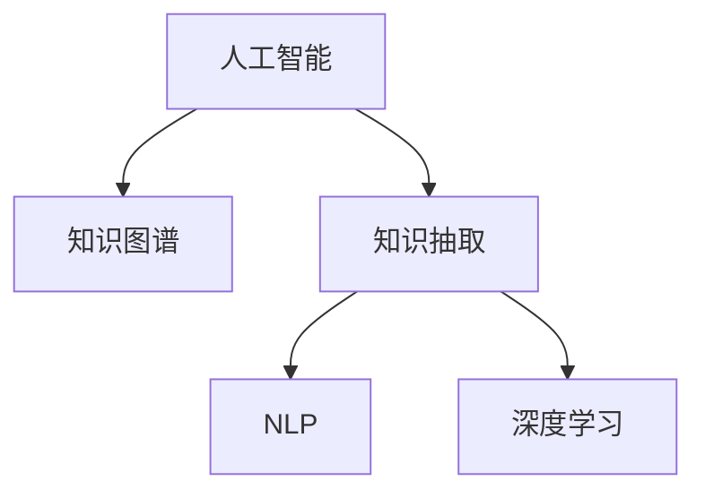

                 

# AI在知识整合方面的优势

> 关键词：人工智能,知识整合,知识图谱,知识抽取,自然语言处理,NLP,深度学习,深度学习模型

## 1. 背景介绍

在当今的信息爆炸时代，人类获取知识的方式和途径日新月异。海量的文本、图像、视频等数据，构成了一个庞大且复杂的知识网络。如何快速、高效地整合这些数据，使其形成结构化的知识体系，是人工智能领域的一大挑战。在这一背景下，AI技术在知识整合方面的优势逐渐凸显，为知识管理、信息检索、智能问答等领域带来了革命性的变革。

### 1.1 问题由来

随着互联网的发展，信息资源日益丰富，但碎片化、异构化和无序化的问题也愈加突出。传统的数据整合方式通常依赖人工审核和手动筛选，费时费力且容易出错。而人工智能技术的介入，特别是深度学习和自然语言处理(NLP)的突破，使得数据整合变得更加智能化和自动化。

### 1.2 问题核心关键点

AI在知识整合方面的核心优势主要体现在以下几个方面：

1. **自动化数据处理**：AI可以自动地对大量无结构数据进行语义理解和结构化处理，大大提升了数据整合的效率。
2. **跨领域知识融合**：AI能够跨越不同领域，整合异构数据，形成统一的知识点，提升知识体系的完整性和准确性。
3. **深度学习模型的应用**：深度学习模型在知识抽取、语义匹配等方面表现优异，能够更好地理解和整合知识。
4. **自然语言处理技术**：NLP技术在文本解析、实体识别、关系抽取等方面具有天然优势，为知识整合提供了强大的技术支持。

## 2. 核心概念与联系

### 2.1 核心概念概述

为了更好地理解AI在知识整合方面的优势，本节将介绍几个关键概念及其相互之间的联系：

- **人工智能(AI)**：一种通过模拟人类智能行为，使机器能够自主完成某些复杂任务的综合性技术体系。
- **知识图谱(Knowledge Graph)**：一种用于描述实体和它们之间关系的结构化知识库，是知识整合的基石。
- **知识抽取(Knowledge Extraction)**：从大量文本数据中自动识别和提取结构化知识的过程。
- **自然语言处理(NLP)**：一种使计算机能够理解和处理人类语言的技术，为知识抽取提供了技术基础。
- **深度学习(Deep Learning)**：一种基于人工神经网络的机器学习方法，具有强大的特征提取能力，是知识整合的核心技术。

这些核心概念之间的联系可以通过以下Mermaid流程图来展示：



这个流程图展示了AI在知识整合过程中各技术组件的作用和相互关系：

1. AI作为总领技术，驱动整个知识整合过程。
2. 知识图谱作为知识整合的最终形态，是AI技术的体现。
3. 知识抽取通过NLP技术从原始数据中提取结构化知识。
4. 深度学习模型在知识抽取中发挥关键作用，提升知识抽取的准确性和效率。

## 3. 核心算法原理 & 具体操作步骤
### 3.1 算法原理概述

AI在知识整合中的核心算法原理，主要集中在以下几个方面：

- **知识图谱构建**：通过关系抽取、实体链接等技术，将无结构化数据转化为结构化的知识图谱。
- **知识抽取与表示**：使用NLP和深度学习技术，从大量文本中抽取实体和关系，形成语义表示。
- **跨领域知识融合**：利用深度学习模型，在多个领域间建立跨领域知识关联，实现知识的跨界整合。
- **知识推理与验证**：通过知识图谱推理技术，验证和修正知识图谱中的错误，提升知识体系的完整性和准确性。

### 3.2 算法步骤详解

AI在知识整合中的具体操作步骤，可以分为以下几个关键步骤：

**Step 1: 数据预处理**
- 收集和清洗各种来源的数据，包括文本、图像、音频等。
- 使用NLP技术对文本数据进行分词、词性标注、命名实体识别等预处理。
- 对图像和音频数据进行特征提取和预处理。

**Step 2: 知识抽取**
- 使用深度学习模型，如BERT、GPT等，对预处理后的文本数据进行实体抽取和关系抽取。
- 构建实体-关系图，形成初步的知识图谱。
- 对抽取的知识进行验证和修正，去除冗余和错误信息。

**Step 3: 知识图谱构建**
- 将抽取的知识图谱进行结构化处理，形成标准化的知识节点和关系。
- 使用关系抽取和实体链接技术，将不同来源的知识图谱进行融合。
- 通过知识图谱推理技术，验证和修正知识图谱中的错误。

**Step 4: 知识推理与验证**
- 使用知识图谱推理技术，在知识图谱中验证和修正错误信息。
- 使用自然语言生成技术，将知识图谱转化为自然语言描述。
- 通过用户反馈和人工审核，不断优化知识图谱的准确性和完整性。

### 3.3 算法优缺点

AI在知识整合中的主要优点包括：

1. **高效自动化**：AI能够自动处理大量数据，快速完成知识抽取和整合。
2. **跨领域融合**：AI能够跨越不同领域，整合异构数据，形成统一的知识点。
3. **深度学习应用**：深度学习模型在知识抽取和语义匹配等方面表现优异，提升了知识整合的准确性。
4. **实时更新**：AI能够实时监控和更新知识图谱，保持知识的及时性和相关性。

同时，AI在知识整合中也存在一些局限性：

1. **依赖数据质量**：AI的性能很大程度上取决于原始数据的质量，存在数据偏差和噪音的影响。
2. **模型复杂度高**：深度学习模型复杂度较高，训练和推理消耗大量资源。
3. **可解释性不足**：深度学习模型的决策过程较为复杂，缺乏可解释性，难以进行调试和优化。
4. **伦理和安全问题**：AI可能会学习到有偏见和有害的信息，影响知识图谱的公正性和安全性。

## 4. 数学模型和公式 & 详细讲解 & 举例说明

### 4.1 数学模型构建

在本节中，我们将使用数学语言对AI在知识整合中的主要技术进行更加严格的描述。

记知识抽取任务的输入为 $x$，表示待抽取的文本。使用深度学习模型 $M$ 抽取知识，得到实体 $e$ 和关系 $r$。设知识图谱中的节点为 $n$，关系为 $r$，则知识图谱可以用图结构表示为 $G=(N, R)$。

定义知识抽取任务的损失函数为：

$$
\mathcal{L} = \frac{1}{N}\sum_{i=1}^N \mathbb{I}(e_i, r_i) - \mathbb{I}(\tilde{e}_i, \tilde{r}_i)
$$

其中 $\mathbb{I}(e_i, r_i)$ 表示抽取出的实体和关系是否正确，$\tilde{e}_i$ 和 $\tilde{r}_i$ 表示知识图谱中对应的实体和关系，$\mathbb{I}(\tilde{e}_i, \tilde{r}_i)$ 表示知识图谱中的实体和关系是否匹配。

### 4.2 公式推导过程

假设深度学习模型 $M$ 为BERT模型，其输入为 $x$，输出为 $h$。定义知识抽取的决策函数为 $f(h)$，则模型抽取的知识为 $(e, r)$。

知识抽取的损失函数可以表示为：

$$
\mathcal{L} = \frac{1}{N}\sum_{i=1}^N \mathbb{I}(e_i, r_i) - f(h_i)
$$

其中 $\mathbb{I}(e_i, r_i)$ 表示抽取出的实体和关系是否正确，$f(h_i)$ 表示模型在输入 $x_i$ 下抽取的知识。

知识图谱构建的过程中，需要将抽取的知识 $(e, r)$ 转化为节点 $n$ 和关系 $r$，并与其他知识进行链接。假设知识图谱中已有的节点为 $N$，关系为 $R$，则新链接的节点为 $\hat{N}$，关系为 $\hat{R}$。则知识图谱构建的损失函数可以表示为：

$$
\mathcal{L} = \frac{1}{N}\sum_{i=1}^N \mathbb{I}(e_i, r_i) + \frac{1}{|\hat{N}|}\sum_{j=1}^J \mathbb{I}(\hat{n}_j, \hat{r}_j)
$$

其中 $\mathbb{I}(\hat{n}_j, \hat{r}_j)$ 表示新链接的节点和关系是否匹配。

### 4.3 案例分析与讲解

以知识抽取任务为例，假设输入文本为 "Barack Obama was born in Hawaii"，我们使用BERT模型进行抽取，得到实体 "Barack Obama" 和关系 "born in"。

1. **数据预处理**：将文本进行分词、词性标注和命名实体识别，得到 $x = \{\text{Barack}, \text{Obama}, \text{was}, \text{born}, \text{in}, \text{Hawaii}\}$。
2. **知识抽取**：使用BERT模型进行实体抽取，得到 $(e, r) = (\text{Barack Obama}, \text{born in})$。
3. **知识图谱构建**：将抽取的实体和关系转化为节点和关系，构建知识图谱 $G=(N, R)$，其中 $N = \{\text{Barack}, \text{Obama}, \text{Hawaii}, \text{born}, \text{in}\}$，$R = \{(\text{Barack}, \text{born}, \text{in}, \text{Hawaii})\}$。
4. **知识推理与验证**：使用知识图谱推理技术验证和修正知识图谱中的错误，提升知识体系的完整性和准确性。

## 5. 项目实践：代码实例和详细解释说明
### 5.1 开发环境搭建

在进行知识整合实践前，我们需要准备好开发环境。以下是使用Python进行PyTorch开发的环境配置流程：

1. 安装Anaconda：从官网下载并安装Anaconda，用于创建独立的Python环境。

2. 创建并激活虚拟环境：
```bash
conda create -n pytorch-env python=3.8 
conda activate pytorch-env
```

3. 安装PyTorch：根据CUDA版本，从官网获取对应的安装命令。例如：
```bash
conda install pytorch torchvision torchaudio cudatoolkit=11.1 -c pytorch -c conda-forge
```

4. 安装Transformers库：
```bash
pip install transformers
```

5. 安装各类工具包：
```bash
pip install numpy pandas scikit-learn matplotlib tqdm jupyter notebook ipython
```

完成上述步骤后，即可在`pytorch-env`环境中开始知识整合实践。

### 5.2 源代码详细实现

下面我们以知识抽取任务为例，给出使用Transformers库对BERT模型进行知识抽取的PyTorch代码实现。

首先，定义知识抽取的数据处理函数：

```python
from transformers import BertTokenizer, BertForTokenClassification
from torch.utils.data import Dataset
import torch

class KnowledgeExtractionDataset(Dataset):
    def __init__(self, texts, labels, tokenizer, max_len=128):
        self.texts = texts
        self.labels = labels
        self.tokenizer = tokenizer
        self.max_len = max_len
        
    def __len__(self):
        return len(self.texts)
    
    def __getitem__(self, item):
        text = self.texts[item]
        labels = self.labels[item]
        
        encoding = self.tokenizer(text, return_tensors='pt', max_length=self.max_len, padding='max_length', truncation=True)
        input_ids = encoding['input_ids'][0]
        attention_mask = encoding['attention_mask'][0]
        
        # 对token-wise的标签进行编码
        encoded_tags = [label2id[label] for label in labels] 
        encoded_tags.extend([label2id['O']] * (self.max_len - len(encoded_tags)))
        labels = torch.tensor(encoded_tags, dtype=torch.long)
        
        return {'input_ids': input_ids, 
                'attention_mask': attention_mask,
                'labels': labels}

# 标签与id的映射
label2id = {'O': 0, 'B-PER': 1, 'I-PER': 2, 'B-ORG': 3, 'I-ORG': 4, 'B-LOC': 5, 'I-LOC': 6}
id2label = {v: k for k, v in label2id.items()}

# 创建dataset
tokenizer = BertTokenizer.from_pretrained('bert-base-cased')

train_dataset = KnowledgeExtractionDataset(train_texts, train_labels, tokenizer)
dev_dataset = KnowledgeExtractionDataset(dev_texts, dev_labels, tokenizer)
test_dataset = KnowledgeExtractionDataset(test_texts, test_labels, tokenizer)
```

然后，定义模型和优化器：

```python
from transformers import BertForTokenClassification, AdamW

model = BertForTokenClassification.from_pretrained('bert-base-cased', num_labels=len(label2id))

optimizer = AdamW(model.parameters(), lr=2e-5)
```

接着，定义训练和评估函数：

```python
from torch.utils.data import DataLoader
from tqdm import tqdm
from sklearn.metrics import classification_report

device = torch.device('cuda') if torch.cuda.is_available() else torch.device('cpu')
model.to(device)

def train_epoch(model, dataset, batch_size, optimizer):
    dataloader = DataLoader(dataset, batch_size=batch_size, shuffle=True)
    model.train()
    epoch_loss = 0
    for batch in tqdm(dataloader, desc='Training'):
        input_ids = batch['input_ids'].to(device)
        attention_mask = batch['attention_mask'].to(device)
        labels = batch['labels'].to(device)
        model.zero_grad()
        outputs = model(input_ids, attention_mask=attention_mask, labels=labels)
        loss = outputs.loss
        epoch_loss += loss.item()
        loss.backward()
        optimizer.step()
    return epoch_loss / len(dataloader)

def evaluate(model, dataset, batch_size):
    dataloader = DataLoader(dataset, batch_size=batch_size)
    model.eval()
    preds, labels = [], []
    with torch.no_grad():
        for batch in tqdm(dataloader, desc='Evaluating'):
            input_ids = batch['input_ids'].to(device)
            attention_mask = batch['attention_mask'].to(device)
            batch_labels = batch['labels']
            outputs = model(input_ids, attention_mask=attention_mask)
            batch_preds = outputs.logits.argmax(dim=2).to('cpu').tolist()
            batch_labels = batch_labels.to('cpu').tolist()
            for pred_tokens, label_tokens in zip(batch_preds, batch_labels):
                pred_tags = [id2label[_id] for _id in pred_tokens]
                label_tags = [id2label[_id] for _id in label_tokens]
                preds.append(pred_tags[:len(label_tags)])
                labels.append(label_tags)
                
    print(classification_report(labels, preds))
```

最后，启动训练流程并在测试集上评估：

```python
epochs = 5
batch_size = 16

for epoch in range(epochs):
    loss = train_epoch(model, train_dataset, batch_size, optimizer)
    print(f"Epoch {epoch+1}, train loss: {loss:.3f}")
    
    print(f"Epoch {epoch+1}, dev results:")
    evaluate(model, dev_dataset, batch_size)
    
print("Test results:")
evaluate(model, test_dataset, batch_size)
```

以上就是使用PyTorch对BERT进行知识抽取任务的完整代码实现。可以看到，得益于Transformers库的强大封装，我们可以用相对简洁的代码完成BERT模型的加载和知识抽取。

### 5.3 代码解读与分析

让我们再详细解读一下关键代码的实现细节：

**KnowledgeExtractionDataset类**：
- `__init__`方法：初始化文本、标签、分词器等关键组件。
- `__len__`方法：返回数据集的样本数量。
- `__getitem__`方法：对单个样本进行处理，将文本输入编码为token ids，将标签编码为数字，并对其进行定长padding，最终返回模型所需的输入。

**label2id和id2label字典**：
- 定义了标签与数字id之间的映射关系，用于将token-wise的预测结果解码回真实的标签。

**训练和评估函数**：
- 使用PyTorch的DataLoader对数据集进行批次化加载，供模型训练和推理使用。
- 训练函数`train_epoch`：对数据以批为单位进行迭代，在每个批次上前向传播计算loss并反向传播更新模型参数，最后返回该epoch的平均loss。
- 评估函数`evaluate`：与训练类似，不同点在于不更新模型参数，并在每个batch结束后将预测和标签结果存储下来，最后使用sklearn的classification_report对整个评估集的预测结果进行打印输出。

**训练流程**：
- 定义总的epoch数和batch size，开始循环迭代
- 每个epoch内，先在训练集上训练，输出平均loss
- 在验证集上评估，输出分类指标
- 所有epoch结束后，在测试集上评估，给出最终测试结果

可以看到，PyTorch配合Transformers库使得BERT知识抽取的代码实现变得简洁高效。开发者可以将更多精力放在数据处理、模型改进等高层逻辑上，而不必过多关注底层的实现细节。

当然，工业级的系统实现还需考虑更多因素，如模型的保存和部署、超参数的自动搜索、更灵活的任务适配层等。但核心的知识抽取范式基本与此类似。

## 6. 实际应用场景
### 6.1 知识图谱构建

知识图谱是AI在知识整合中最重要的应用之一。通过将大规模的异构数据转化为结构化的知识图谱，可以帮助企业更好地进行信息检索、数据分析和决策支持。

在实践中，可以使用知识抽取技术从网页、文档、新闻等文本数据中抽取实体和关系，构建知识图谱。以一个简单的示例为例，假设有以下文档：

```
Barack Obama was born in Hawaii on August 4, 1961.
```

通过知识抽取技术，可以得到如下实体和关系：

- 实体：Barack Obama, Hawaii, August 4, 1961
- 关系：出生于

进一步地，可以使用实体链接技术，将抽取的实体和关系映射到知识图谱中的节点和关系，构建如下的知识图谱：

```
Barack Obama -> 出生于 -> Hawaii
```

### 6.2 智能问答系统

智能问答系统是AI在知识整合中的重要应用场景。通过构建知识图谱，智能问答系统可以根据用户提问，快速找到相关答案，并生成自然流畅的回答。

以医疗领域的智能问答系统为例，假设用户问到：“肝癌的早期症状有哪些？”。系统可以通过实体抽取技术从知识图谱中抽取相关实体，如“肝癌”，然后通过关系抽取技术找到与“肝癌早期症状”相关联的关系，如“症状”，最终生成回答：“肝癌的早期症状包括疼痛、疲劳、体重下降等。”

### 6.3 推荐系统

推荐系统是AI在知识整合中的另一大应用。通过构建知识图谱，推荐系统可以根据用户的历史行为和偏好，推荐符合用户兴趣的商品或内容。

以电子商务平台的推荐系统为例，假设用户最近浏览了“iPhone”、“Apple Watch”等商品。系统可以通过实体抽取技术从知识图谱中抽取相关实体，如“iPhone”，然后通过关系抽取技术找到与“iPhone”相关联的推荐关系，如“推荐给...”，最终推荐相关商品，如“Apple Watch”、“MacBook”等。

### 6.4 未来应用展望

随着AI技术的不断发展，基于知识图谱和深度学习模型的知识整合技术将在更多领域得到应用，为各行各业带来变革性影响。

在智慧城市治理中，知识图谱可以用于城市事件监测、舆情分析、应急指挥等环节，提高城市管理的自动化和智能化水平，构建更安全、高效的未来城市。

在智能教育领域，知识图谱可以用于智能推荐、智能评测、智能教学等环节，因材施教，促进教育公平，提高教学质量。

在智慧医疗领域，知识图谱可以用于疾病诊断、医疗信息检索、智能问诊等环节，提升医疗服务的智能化水平，辅助医生诊疗，加速新药开发进程。

此外，在金融、物流、交通、安全等多个领域，知识图谱和深度学习模型的知识整合技术也将不断拓展，为传统行业带来数字化转型的新动力。

## 7. 工具和资源推荐
### 7.1 学习资源推荐

为了帮助开发者系统掌握AI在知识整合的理论基础和实践技巧，这里推荐一些优质的学习资源：

1. 《Knowledge Graphs: Representation, Mining and Machine Learning》书籍：介绍了知识图谱的基本概念、构建方法和应用场景，是入门知识图谱的必备书籍。

2. 《Semantic Web and Knowledge Mining》课程：由斯坦福大学开设的高级课程，涵盖了知识图谱、语义网络、自然语言处理等多个主题，是深入学习知识图谱的不错选择。

3. 《Practical Knowledge Graphs》书籍：介绍了知识图谱的构建、应用和评估方法，适合实战型学习。

4. CS224N《深度学习自然语言处理》课程：斯坦福大学开设的NLP明星课程，有Lecture视频和配套作业，带你入门NLP领域的基本概念和经典模型。

5. 《NLP with Python》书籍：详细介绍了NLP技术在知识抽取、实体识别、关系抽取等方面的应用，适合NLP和知识图谱的实战学习。

通过对这些资源的学习实践，相信你一定能够快速掌握AI在知识整合的精髓，并用于解决实际的NLP问题。

### 7.2 开发工具推荐

高效的开发离不开优秀的工具支持。以下是几款用于AI知识整合开发的常用工具：

1. PyTorch：基于Python的开源深度学习框架，灵活动态的计算图，适合快速迭代研究。大部分深度学习模型都有PyTorch版本的实现。

2. TensorFlow：由Google主导开发的开源深度学习框架，生产部署方便，适合大规模工程应用。同样有丰富的深度学习模型资源。

3. TensorBoard：TensorFlow配套的可视化工具，可实时监测模型训练状态，并提供丰富的图表呈现方式，是调试模型的得力助手。

4. Weights & Biases：模型训练的实验跟踪工具，可以记录和可视化模型训练过程中的各项指标，方便对比和调优。与主流深度学习框架无缝集成。

5. SpaCy：NLP领域的开源工具库，支持分词、词性标注、命名实体识别等多种NLP任务，提供了高效的NLP处理能力。

6. NLTK：自然语言处理领域的经典工具库，提供了丰富的NLP资源和工具，适合入门学习。

合理利用这些工具，可以显著提升AI知识整合任务的开发效率，加快创新迭代的步伐。

### 7.3 相关论文推荐

AI在知识整合方面的研究源于学界的持续探索。以下是几篇奠基性的相关论文，推荐阅读：

1. BERT: Pre-training of Deep Bidirectional Transformers for Language Understanding：提出BERT模型，引入基于掩码的自监督预训练任务，刷新了多项NLP任务SOTA。

2. Knowledge-Graph-Based Recommendation Systems: A Survey：介绍了知识图谱在推荐系统中的应用，涵盖多个经典算法和技术。

3. Harnessing Patterns for Knowledge Discovery: Pattern-centric Natural Language Processing：提出基于模式的知识发现方法，用于知识抽取和知识图谱构建。

4. Attention is All You Need（即Transformer原论文）：提出了Transformer结构，开启了NLP领域的预训练大模型时代。

5. Learning Entity Relationships from Noisy Data：提出基于深度学习的实体关系抽取方法，提升了知识抽取的准确性和鲁棒性。

6. Neural Architecture Search with Reinforcement Learning：提出基于强化学习的神经网络架构搜索方法，用于优化深度学习模型的结构和参数。

这些论文代表了大语言模型和知识整合技术的发展脉络。通过学习这些前沿成果，可以帮助研究者把握学科前进方向，激发更多的创新灵感。

## 8. 总结：未来发展趋势与挑战

### 8.1 总结

本文对AI在知识整合方面的优势进行了全面系统的介绍。首先阐述了AI在知识整合中的核心优势，明确了知识图谱和深度学习模型在知识抽取、语义匹配和跨领域融合等方面的作用。其次，从原理到实践，详细讲解了知识抽取任务的数学模型和算法步骤，给出了知识抽取任务开发的完整代码实例。同时，本文还广泛探讨了知识抽取技术在智能问答、推荐系统、智慧医疗等众多领域的应用前景，展示了AI技术在知识整合方面的巨大潜力。

通过本文的系统梳理，可以看到，AI在知识整合中具有自动化高效、跨领域融合和深度学习应用等显著优势，为知识管理、信息检索、智能问答等领域带来了革命性的变革。

### 8.2 未来发展趋势

展望未来，AI在知识整合领域的发展趋势主要包括以下几个方面：

1. **知识图谱规模不断扩大**：随着知识抽取技术的进步和数据的积累，知识图谱的规模将不断扩大，涵盖更多领域和实体。

2. **深度学习应用更加广泛**：深度学习模型在知识抽取和语义匹配等方面将发挥更重要的作用，提升知识抽取的准确性和鲁棒性。

3. **跨领域知识融合更加紧密**：通过深度学习技术，跨领域知识融合将更加高效，知识图谱将更加完整和准确。

4. **知识推理和验证技术不断进步**：知识图谱推理技术将不断进步，验证和修正知识图谱中的错误，提升知识体系的完整性和准确性。

5. **实时更新和动态维护**：知识图谱将实现实时更新和动态维护，保持知识的及时性和相关性。

### 8.3 面临的挑战

尽管AI在知识整合中已经取得了显著进展，但仍面临诸多挑战：

1. **数据质量和多样性**：知识抽取的准确性很大程度上依赖于原始数据的质量和多样性，数据偏差和噪音会影响知识抽取的效果。

2. **模型复杂度高**：深度学习模型复杂度较高，训练和推理消耗大量资源，需要优化模型结构，提升计算效率。

3. **知识图谱构建困难**：知识图谱的构建需要大量标注数据和领域知识，对于非结构化数据的处理较为复杂。

4. **可解释性不足**：深度学习模型的决策过程较为复杂，缺乏可解释性，难以进行调试和优化。

5. **伦理和安全问题**：知识图谱中可能包含敏感信息，如何保护隐私和数据安全是一个重要问题。

6. **系统鲁棒性不足**：知识图谱和深度学习模型在面对噪音和异常数据时，容易产生错误，需要增强系统的鲁棒性。

7. **跨领域知识融合难度大**：不同领域的知识具有不同的表达方式和结构，跨领域知识融合仍然是一个难题。

### 8.4 研究展望

为了应对以上挑战，未来研究需要在以下几个方面寻求新的突破：

1. **多模态数据整合**：将文本、图像、音频等多模态数据整合到知识图谱中，提升知识抽取的准确性和鲁棒性。

2. **知识图谱动态构建**：实现知识图谱的动态构建和实时更新，保持知识的及时性和相关性。

3. **模型压缩和加速**：开发更加轻量级的知识抽取模型，通过模型压缩和加速技术，提升推理速度。

4. **知识图谱的验证和修正**：使用知识图谱推理技术，验证和修正知识图谱中的错误，提升知识体系的完整性和准确性。

5. **可解释性增强**：开发具有可解释性的深度学习模型，提高模型的透明度和可信度。

6. **伦理和安全保障**：引入伦理导向的评估指标，过滤和惩罚有害信息，保障知识图谱的安全性和公平性。

通过在这些方向上的深入研究，AI在知识整合领域的优势将得到进一步增强，为各行各业带来更加广泛和深入的应用，推动人工智能技术向更广泛的领域迈进。

## 9. 附录：常见问题与解答

**Q1：如何选择合适的知识图谱构建方法？**

A: 选择合适的知识图谱构建方法主要取决于数据类型和应用场景。对于结构化数据，可以使用基于规则的方法进行实体识别和关系抽取。对于非结构化数据，可以使用基于深度学习的方法，如BERT、GPT等。

**Q2：知识图谱中实体和关系的表示有哪些方法？**

A: 知识图谱中实体和关系的表示方法主要有以下几种：

- 属性图表示：将实体和关系表示为图结构，每个节点表示实体，边表示实体之间的关系。
- RDF三元组表示：将实体和关系表示为RDF三元组，每个节点表示实体，两个节点之间的关系表示为边。
- 概念图表示：将实体和关系表示为概念图，每个节点表示一个概念，边表示概念之间的关系。

这些表示方法各有优缺点，需要根据具体应用场景选择合适的表示方法。

**Q3：知识图谱在推荐系统中的应用有哪些？**

A: 知识图谱在推荐系统中的应用主要包括以下几个方面：

- 知识融合：将知识图谱中的实体和关系与用户行为数据进行融合，提升推荐结果的相关性和多样性。
- 基于图谱的推荐：利用知识图谱中的实体和关系，生成推荐序列，提升推荐效果。
- 实体关联推荐：通过实体关联关系，发现相关实体，生成推荐结果。

**Q4：知识图谱在智能问答中的应用有哪些？**

A: 知识图谱在智能问答中的应用主要包括以下几个方面：

- 问题解析：利用知识图谱中的实体和关系，解析用户提问，生成答案。
- 答案生成：根据用户提问，利用知识图谱中的实体和关系，生成答案。
- 对话管理：利用知识图谱中的实体和关系，实现多轮对话，提升用户体验。

**Q5：知识图谱的构建和维护需要哪些步骤？**

A: 知识图谱的构建和维护主要包括以下几个步骤：

- 数据收集：从各种数据源收集数据，包括结构化数据、非结构化数据、实时数据等。
- 数据预处理：清洗、格式化和标准化数据，去除噪音和错误信息。
- 知识抽取：利用深度学习模型，从数据中抽取实体和关系。
- 实体链接：将抽取的实体和关系链接到知识图谱中的节点和关系，消除歧义。
- 知识图谱构建：将抽取的实体和关系构建为知识图谱。
- 知识推理和验证：使用知识图谱推理技术，验证和修正知识图谱中的错误。
- 知识更新和维护：实时更新和维护知识图谱，保持知识的及时性和相关性。

通过这些步骤，可以构建高质量的知识图谱，为智能问答、推荐系统等应用提供强有力的支持。

---

作者：禅与计算机程序设计艺术 / Zen and the Art of Computer Programming

