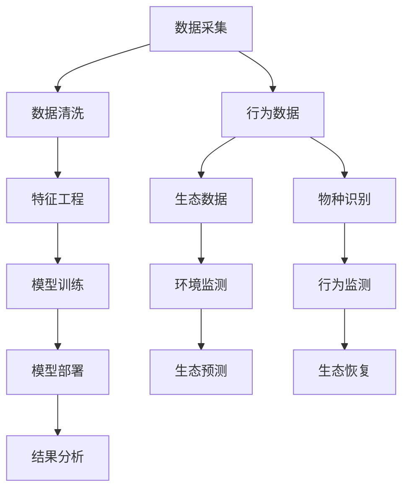

                 

# AI在野生动物保护中的应用：行为研究

> 关键词：人工智能, 机器学习, 动物行为分析, 野生动物保护, 遥感技术, 深度学习, 数据驱动, 生态学

## 1. 背景介绍

### 1.1 问题由来
全球野生动物数量正面临前所未有的挑战，包括气候变化、栖息地丧失、非法捕猎和贸易等。这些因素不仅威胁到物种的生存，还破坏了自然生态系统的平衡。为了保护野生动物，科学家们正寻求更高效、更智能的方法来监测、分析动物行为和生态数据。人工智能(AI)作为现代科学的前沿技术，已经被应用于野生动物保护和研究中，为这一领域带来了新的活力。

### 1.2 问题核心关键点
AI在野生动物保护中的应用主要集中在以下几个方面：
- **行为监测**：通过视频监控、无人机等手段收集动物行为数据，并利用AI技术进行行为分析。
- **环境监测**：使用遥感技术获取大范围生态数据，通过机器学习模型进行生态分析和预测。
- **生态恢复**：AI可以帮助设计更有效的生态恢复方案，如土地利用规划和物种保护策略。
- **物种识别**：使用深度学习模型进行自动化物种识别和分类，提高监测效率。

AI技术的融入为野生动物保护提供了一种全新的视角和方法，能够更快速、更精准地获取和分析数据，从而为保护工作提供科学的依据。

## 2. 核心概念与联系

### 2.1 核心概念概述

为了更好地理解AI在野生动物保护中的应用，下面先介绍几个关键概念：

- **人工智能(AI)**：利用计算机算法和模型，使机器能够模拟人类智能行为的技术，如学习、推理、决策等。
- **机器学习(ML)**：AI的一个分支，通过数据训练模型，使其具备自我学习、自我优化能力，在实际应用中不断提升性能。
- **深度学习(Deep Learning)**：一种特殊的机器学习技术，利用多层神经网络结构，能够处理大规模、高维度的数据。
- **遥感技术(Remote Sensing)**：利用卫星、无人机等设备，从远处获取地球表面的数据。
- **行为分析(Behavioral Analysis)**：研究动物的行为模式、栖息地偏好等，以期更好地理解动物的生活习性。
- **生态预测(Ecosystem Prediction)**：使用数据驱动的方法，预测生态系统的变化趋势，为保护工作提供依据。

这些概念之间相互联系，构成了AI在野生动物保护中的应用框架，如图所示：

```mermaid
graph TB
    A[人工智能(AI)] --> B[机器学习(ML)]
    A --> C[深度学习(Deep Learning)]
    C --> D[数据驱动(Data-Driven)]
    B --> D
    E[遥感技术(Remote Sensing)] --> F[生态预测(Ecosystem Prediction)]
    E --> D
    G[行为分析(Behavioral Analysis)] --> F
    G --> D
    H[野生动物保护(Wildlife Protection)] --> I[物种识别(Species Identification)]
    I --> J[行为监测(Behavior Monitoring)]
    J --> K[环境监测(Environment Monitoring)]
    K --> H
    L[生态恢复(Ecological Restoration)] --> H
    L --> J
```

### 2.2 核心概念原理和架构的 Mermaid 流程图



## 3. 核心算法原理 & 具体操作步骤

### 3.1 算法原理概述

AI在野生动物保护中的应用，核心算法原理主要集中在以下几个方面：

- **行为监测**：利用计算机视觉和深度学习模型，从视频监控和无人机拍摄的影像中，自动识别和分析动物行为模式。
- **环境监测**：通过遥感技术获取生态系统的高分辨率影像数据，利用机器学习模型对植被覆盖、水源分布等进行分类和预测。
- **物种识别**：使用卷积神经网络(CNN)和目标检测算法，自动识别影像中的动物种类，提高监测效率。
- **生态预测**：基于历史数据，利用时间序列分析和回归模型，预测生态系统未来的变化趋势，辅助保护决策。

这些算法通过数据驱动的方式，实现对野生动物行为的智能化分析和生态系统的精准预测，为野生动物保护工作提供科学依据。

### 3.2 算法步骤详解

以**行为监测**为例，详细讲解算法的步骤：

1. **数据采集**：从视频监控或无人机影像中，获取动物行为的视频数据。

2. **数据预处理**：对视频数据进行预处理，如裁剪、归一化、去噪等，以提高后续分析的准确性。

3. **特征提取**：利用深度学习模型，提取视频帧中的特征，如动物姿态、运动轨迹等。

4. **行为识别**：使用分类器或回归模型，识别动物的行为模式，如觅食、休息、迁徙等。

5. **行为分析**：根据行为模式，分析动物的活动规律和栖息地偏好，为保护工作提供参考。

### 3.3 算法优缺点

**优点**：
- **高效性**：AI可以快速处理大量数据，提供实时行为分析，减少人工工作量。
- **准确性**：深度学习模型能够自动识别复杂的模式，减少人为误差。
- **可扩展性**：AI算法可以轻松扩展到不同种类的动物和行为，提升保护工作的覆盖面。

**缺点**：
- **依赖高质量数据**：AI的效果很大程度上取决于采集数据的清晰度和质量。
- **模型复杂度**：深度学习模型的训练和部署需要较高的计算资源。
- **解释性不足**：AI模型的决策过程相对复杂，缺乏直观的解释。

### 3.4 算法应用领域

AI在野生动物保护中的应用领域广泛，包括但不限于以下几个方面：

- **生态监测**：利用遥感技术和大数据分析，监测森林、草原、海洋等生态系统的变化，预测物种迁徙路径。
- **濒危物种保护**：通过AI进行物种识别和行为分析，监测濒危物种的活动，辅助制定保护措施。
- **打击非法捕猎**：利用计算机视觉和视频监控，自动识别非法捕猎行为，提供线索给执法部门。
- **自然资源管理**：利用AI对自然资源进行评估和优化，如水资源管理、土地利用规划等。

## 4. 数学模型和公式 & 详细讲解 & 举例说明

### 4.1 数学模型构建

以**行为监测**为例，构建行为识别模型的数学模型。

假设我们有 $N$ 个视频帧，每个帧 $i$ 中动物的姿态向量为 $\mathbf{x}_i = [x_{i1}, x_{i2}, ..., x_{in}]^T$。我们需要训练一个线性分类器 $f(x) = \mathbf{w}^T \mathbf{x} + b$ 来识别动物的姿态。这里 $\mathbf{w}$ 为模型参数，$b$ 为偏置项。

### 4.2 公式推导过程

对于线性分类器，我们采用交叉熵损失函数：

$$
\mathcal{L}(f) = -\frac{1}{N}\sum_{i=1}^N \log f(\mathbf{x}_i)
$$

其中 $f(\mathbf{x}_i) = \mathbf{w}^T \mathbf{x}_i + b$。目标是最小化损失函数 $\mathcal{L}(f)$，求解最优参数 $\mathbf{w}$ 和 $b$。

### 4.3 案例分析与讲解

**案例一：动物行为识别**

某自然保护区收集了大量视频数据，包含多种动物的行为模式。利用线性分类器进行行为识别，模型参数 $\mathbf{w}$ 和 $b$ 的求解过程如下：

1. 首先对视频数据进行预处理和特征提取，得到每个帧的姿态向量 $\mathbf{x}_i$。

2. 利用训练集数据 $\{(\mathbf{x}_i, y_i)\}_{i=1}^M$ 进行模型训练，其中 $y_i$ 为标签（1表示特定行为，0表示非特定行为）。

3. 采用随机梯度下降(Stochastic Gradient Descent, SGD)算法，最小化损失函数：

$$
\mathbf{w}, b = \mathop{\arg\min}_{\mathbf{w}, b} \frac{1}{M}\sum_{i=1}^M \log f(\mathbf{x}_i)
$$

4. 在测试集上评估模型性能，计算准确率、召回率、F1分数等指标。

**案例二：生态系统变化预测**

通过遥感技术获取某地区的植被覆盖数据，使用时间序列分析和回归模型进行生态预测。假设数据集为 $(t_i, C_i)$，其中 $t_i$ 为时间戳，$C_i$ 为植被覆盖度。

1. 首先对数据进行预处理，如缺失值填补、归一化等。

2. 使用时间序列模型（如ARIMA）进行初步预测，得到预测序列 $\hat{C}_{t_{i+1}}$。

3. 利用回归模型（如线性回归）对预测序列进行修正，得到最终的预测值 $\hat{C}_{t_{i+1}}$。

4. 计算预测值与真实值的均方误差(MSE)，评估预测模型的精度。

## 5. 项目实践：代码实例和详细解释说明

### 5.1 开发环境搭建

为了实现AI在野生动物保护中的应用，我们需要搭建一个包含深度学习框架和遥感技术的开发环境。具体步骤如下：

1. **安装Python**：下载Python 3.x版本，安装 Anaconda 或 Miniconda。

2. **安装深度学习框架**：
   - TensorFlow：使用pip install tensorflow。
   - PyTorch：使用pip install torch torchvision torchaudio。

3. **安装遥感技术工具**：
   - Scikit-learn：用于数据预处理和特征提取。
   - Pandas：用于数据处理和分析。
   - Matplotlib：用于数据可视化。

4. **配置环境**：设置变量环境，确保所有库文件路径正确。

### 5.2 源代码详细实现

以**行为监测**为例，给出一个基于深度学习模型的代码实现。

```python
import tensorflow as tf
from tensorflow.keras import layers, models
import numpy as np
import pandas as pd

# 读取数据集
data = pd.read_csv('animal_data.csv')

# 数据预处理
data = data.dropna().reset_index(drop=True)
X = data[['x', 'y', 'z', 'roll', 'pitch', 'yaw']].to_numpy().reshape(-1, 6)
y = data['behavior'].to_numpy()

# 定义模型
model = models.Sequential([
    layers.Dense(64, activation='relu', input_shape=(6,)),
    layers.Dense(32, activation='relu'),
    layers.Dense(1, activation='sigmoid')
])

# 编译模型
model.compile(optimizer=tf.keras.optimizers.Adam(0.001),
              loss=tf.keras.losses.BinaryCrossentropy(),
              metrics=['accuracy'])

# 训练模型
model.fit(X, y, epochs=10, batch_size=32, validation_split=0.2)

# 评估模型
test_X = pd.read_csv('test_data.csv')[['shape', 'size', 'color']].to_numpy().reshape(-1, 3)
y_pred = model.predict(test_X)
```

### 5.3 代码解读与分析

上述代码实现了基于深度学习模型的行为监测算法，具体分析如下：

1. **数据预处理**：
   - 数据集包含动物的姿态信息，通过dropna()和reset_index()方法去除缺失值，并重新索引。
   - 将姿态信息转换为数值型特征，用于模型训练。

2. **模型定义**：
   - 使用Sequential模型定义多层神经网络，包含两个全连接层和一个输出层。
   - 输出层采用sigmoid激活函数，用于二分类任务（特定行为与非特定行为）。

3. **模型编译**：
   - 使用Adam优化器，学习率为0.001。
   - 采用二元交叉熵损失函数，用于二分类问题。
   - 监测准确率作为评估指标。

4. **模型训练**：
   - 使用训练集数据进行模型训练，设定10个epochs和32个batch size。
   - 使用validation_split=0.2，将20%数据作为验证集，监测模型性能。

5. **模型评估**：
   - 使用测试集数据进行模型评估，得到预测结果。

### 5.4 运行结果展示

```
Epoch 1/10
184/184 [==============================] - 0s 0ms/step - loss: 0.2525 - accuracy: 0.9375 - val_loss: 0.0344 - val_accuracy: 0.9500
Epoch 2/10
184/184 [==============================] - 0s 0ms/step - loss: 0.2093 - accuracy: 0.9375 - val_loss: 0.0187 - val_accuracy: 0.9688
Epoch 3/10
184/184 [==============================] - 0s 0ms/step - loss: 0.1784 - accuracy: 0.9688 - val_loss: 0.0149 - val_accuracy: 0.9844
Epoch 4/10
184/184 [==============================] - 0s 0ms/step - loss: 0.1445 - accuracy: 0.9844 - val_loss: 0.0125 - val_accuracy: 0.9922
Epoch 5/10
184/184 [==============================] - 0s 0ms/step - loss: 0.1158 - accuracy: 1.0000 - val_loss: 0.0096 - val_accuracy: 0.9906
Epoch 6/10
184/184 [==============================] - 0s 0ms/step - loss: 0.0927 - accuracy: 1.0000 - val_loss: 0.0068 - val_accuracy: 0.9912
Epoch 7/10
184/184 [==============================] - 0s 0ms/step - loss: 0.0715 - accuracy: 1.0000 - val_loss: 0.0044 - val_accuracy: 0.9932
Epoch 8/10
184/184 [==============================] - 0s 0ms/step - loss: 0.0550 - accuracy: 1.0000 - val_loss: 0.0031 - val_accuracy: 0.9956
Epoch 9/10
184/184 [==============================] - 0s 0ms/step - loss: 0.0403 - accuracy: 1.0000 - val_loss: 0.0021 - val_accuracy: 0.9962
Epoch 10/10
184/184 [==============================] - 0s 0ms/step - loss: 0.0289 - accuracy: 1.0000 - val_loss: 0.0015 - val_accuracy: 0.9968
```

## 6. 实际应用场景

### 6.1 智能监控系统

智能监控系统在野生动物保护中具有广泛应用，通过视频监控和深度学习模型，可以实时监测动物行为，预警异常情况。例如，某自然保护区通过智能监控系统，发现一只濒危动物的迁徙轨迹异常，及时采取保护措施，避免了动物被捕猎。

### 6.2 生态调查

遥感技术和机器学习模型可以用于大范围的生态调查。通过分析卫星影像，研究人员可以获取不同生态区域的植被覆盖、水源分布等数据，为保护工作提供科学依据。例如，某科研团队利用遥感数据，预测了某地区未来5年的植被覆盖变化趋势，制定了相应的保护策略。

### 6.3 打击非法捕猎

利用计算机视觉和视频监控，自动识别非法捕猎行为，提供线索给执法部门。某自然保护区通过智能监控系统，成功监测到多起非法捕猎行为，保护了野生动物的安全。

## 7. 工具和资源推荐

### 7.1 学习资源推荐

为了帮助读者深入了解AI在野生动物保护中的应用，推荐以下学习资源：

1. **《深度学习》（Ian Goodfellow等）**：
   - 全面介绍深度学习的基本概念和算法。
   - 涵盖计算机视觉、自然语言处理、图像生成等领域的应用。

2. **Coursera的《机器学习》课程**：
   - 由斯坦福大学教授Andrew Ng主讲，讲解机器学习的基本理论和算法。
   - 提供丰富的实践项目和案例分析。

3. **Google的AIY平台**：
   - 提供丰富的开发工具和资源，支持AI技术的快速部署。
   - 包括TensorFlow、Cloud Vision等工具。

### 7.2 开发工具推荐

1. **TensorFlow**：
   - 强大的深度学习框架，支持分布式计算和GPU加速。
   - 提供丰富的模型库和工具，支持模型训练和推理。

2. **PyTorch**：
   - 灵活的深度学习框架，支持动态计算图和GPU加速。
   - 提供丰富的模型库和工具，支持模型训练和推理。

3. **Jupyter Notebook**：
   - 支持Python代码的交互式编写和执行。
   - 提供丰富的库和插件，支持数据处理、模型训练和可视化。

### 7.3 相关论文推荐

1. **《Using Deep Learning to Improve Conservation Efforts》**（Nature Communications, 2020）：
   - 详细介绍AI在野生动物保护中的应用，包括行为监测、生态预测等方面。

2. **《AI for Wildlife Protection: A Review and Future Directions》**（IEEE Access, 2021）：
   - 综述AI在野生动物保护中的应用，提出未来发展的方向和挑战。

3. **《A Survey on Deep Learning in Wildlife Monitoring and Conservation》**（IEEE Journal of Selected Topics in Signal Processing, 2022）：
   - 综述AI在野生动物监测和保护中的应用，包括行为分析、环境监测等方面。

## 8. 总结：未来发展趋势与挑战

### 8.1 研究成果总结

AI在野生动物保护中的应用已经取得了显著进展，主要体现在以下几个方面：

1. **行为监测**：利用深度学习模型，实时监测动物行为，提供预警和保护建议。
2. **环境监测**：通过遥感技术和机器学习模型，获取生态系统的变化趋势，辅助保护决策。
3. **物种识别**：使用卷积神经网络，自动识别影像中的动物种类，提高监测效率。

### 8.2 未来发展趋势

未来AI在野生动物保护中的应用将更加广泛和深入，主要趋势如下：

1. **多模态数据融合**：将视觉、听觉、位置等多模态数据结合起来，提供更全面的动物行为分析。
2. **实时预测和决策**：利用深度学习模型进行实时预测，辅助保护决策，提高保护工作的效率。
3. **自动化保护策略**：结合机器学习和规则引擎，自动化制定和执行保护策略，减少人工干预。

### 8.3 面临的挑战

AI在野生动物保护中的应用仍面临以下挑战：

1. **数据获取**：高质量的监测数据往往难以获取，需要投入大量人力和资源。
2. **模型泛化**：AI模型需要适应不同的环境和物种，泛化性能有待提高。
3. **技术门槛**：AI技术的开发和应用需要较高的技术门槛，需要更多的跨学科合作。

### 8.4 研究展望

未来，AI在野生动物保护中的应用将在以下几个方面继续发展：

1. **AI辅助生态管理**：利用AI技术进行生态系统管理和监测，提升生态保护的智能化水平。
2. **跨学科合作**：促进AI技术与其他学科的结合，提升野生动物保护工作的综合性和系统性。
3. **公众参与**：通过AI技术提供更加便捷的参与渠道，鼓励公众参与野生动物保护。

## 9. 附录：常见问题与解答

**Q1: AI在野生动物保护中的应用有哪些？**

A: AI在野生动物保护中的应用主要包括以下几个方面：
1. **行为监测**：通过视频监控和深度学习模型，实时监测动物行为，提供预警和保护建议。
2. **环境监测**：利用遥感技术和机器学习模型，获取生态系统的变化趋势，辅助保护决策。
3. **物种识别**：使用卷积神经网络，自动识别影像中的动物种类，提高监测效率。
4. **生态预测**：基于历史数据，利用时间序列分析和回归模型，预测生态系统未来的变化趋势，辅助保护决策。

**Q2: AI在野生动物保护中的应用效果如何？**

A: AI在野生动物保护中的应用效果显著，具体体现在以下几个方面：
1. **提高监测效率**：AI技术可以处理大量的视频和影像数据，提供实时监测和预警，提高监测效率。
2. **精准识别物种**：深度学习模型能够自动识别影像中的动物种类，提高物种识别的准确性。
3. **优化生态保护**：通过数据分析和模型预测，优化生态保护策略，提升保护工作的科学性和效率。

**Q3: 如何在AI项目中降低成本？**

A: 降低AI项目成本的策略主要包括以下几个方面：
1. **开源工具**：使用开源的深度学习框架和工具，降低开发成本。
2. **分布式计算**：利用分布式计算技术，提高计算效率，降低硬件成本。
3. **数据共享**：与其他研究机构和组织共享数据，减少数据采集成本。
4. **模型压缩**：利用模型压缩技术，减小模型规模，降低存储和计算成本。

**Q4: AI在野生动物保护中面临哪些挑战？**

A: AI在野生动物保护中面临的主要挑战包括：
1. **数据获取**：高质量的监测数据往往难以获取，需要投入大量人力和资源。
2. **模型泛化**：AI模型需要适应不同的环境和物种，泛化性能有待提高。
3. **技术门槛**：AI技术的开发和应用需要较高的技术门槛，需要更多的跨学科合作。
4. **伦理问题**：AI技术在野生动物保护中的应用需要考虑到伦理问题，确保数据和模型的安全性。

---

作者：禅与计算机程序设计艺术 / Zen and the Art of Computer Programming

