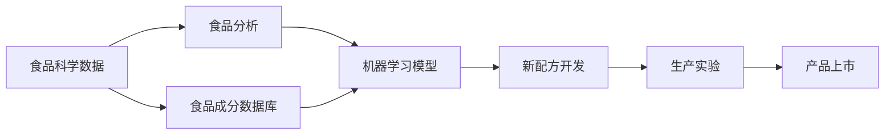

                 

# AI在食品科学中的应用：开发新配方

> 关键词：食品科学,AI,配方开发,机器学习,自然语言处理,食品分析

## 1. 背景介绍

食品科学是一个快速发展的领域，涵盖食品的制造、保存、营养价值和安全性。随着科技的进步，AI技术在食品科学中的应用日益广泛，特别是在新配方的开发上，AI已展现出巨大的潜力。本文将探讨AI在食品科学中如何帮助食品生产商开发新配方，提升产品质量和生产效率。

## 2. 核心概念与联系

### 2.1 核心概念概述

为了更好地理解AI在食品科学中的应用，我们需要先了解一些核心概念：

- **人工智能（AI）**：一种使计算机系统能够模拟人类智能行为的科学技术，包括机器学习、自然语言处理（NLP）、计算机视觉等。
- **食品科学**：研究食品的性质、保存、加工、营养价值和安全的科学。
- **新配方开发**：通过研究与实验，发现并优化新的食品配方，以提升食品口感、营养价值和生产效率。
- **机器学习（ML）**：使计算机能够通过数据学习并改善性能的技术，可以应用于食品成分分析、营养计算和食品品质预测。
- **自然语言处理（NLP）**：使计算机能够理解、解释和生成人类语言的技术，可以用于食品配方描述的分析和理解。
- **食品分析**：通过化学、物理和生物手段对食品成分、营养和品质进行分析的技术，是食品科学的基础。

这些概念之间通过AI在食品科学中的应用而紧密联系起来。AI技术可以通过数据驱动的方法，帮助食品科学家更高效、更精确地进行新配方的开发。

### 2.2 核心概念原理和架构的 Mermaid 流程图



这个流程图展示了从食品科学数据到新配方开发的流程。食品科学数据通过食品分析进行处理，然后将食品成分数据库与机器学习模型结合，用于开发新配方。最终，新配方经过生产实验，获得验证后，上市销售。

## 3. 核心算法原理 & 具体操作步骤

### 3.1 算法原理概述

AI在食品科学中的应用，主要集中在以下几个方面：

1. **数据驱动的成分分析**：通过机器学习模型对食品成分进行预测和分类，为配方开发提供科学依据。
2. **配方优化与模拟**：利用NLP技术分析食品配方描述，提取出关键成分和比例，并通过模拟预测其口感、营养价值和生产效率。
3. **生产过程优化**：通过机器学习模型对生产过程中的参数进行优化，提高生产效率和产品质量。

### 3.2 算法步骤详解

#### 3.2.1 数据收集与预处理

数据收集是AI在食品科学中应用的基础。需要收集各种食品成分、营养价值、生产参数和消费者反馈数据。这些数据通常通过食品成分数据库、营养分析软件、消费者调查和生产记录等方式获得。数据收集完毕后，需要对数据进行清洗和预处理，去除异常值和噪声，确保数据的准确性和一致性。

#### 3.2.2 食品成分分析

食品成分分析是AI在食品科学中的核心应用之一。通过机器学习模型，可以对食品成分进行预测和分类。例如，可以使用随机森林、支持向量机等模型，对食品成分进行分类，预测其营养价值和口感。这一过程可以通过以下步骤实现：

1. 数据准备：收集食品成分数据，并进行标准化处理。
2. 特征工程：选择关键特征，如营养成分、口味、色泽等。
3. 模型训练：选择合适的机器学习模型，并使用历史数据进行训练。
4. 模型评估：通过交叉验证和测试集，评估模型的准确性和泛化能力。

#### 3.2.3 配方描述与成分提取

配方描述通常包含大量的自然语言信息，如材料、比例、烹饪方法等。通过NLP技术，可以提取这些信息中的关键成分和比例，用于新配方的开发。这一过程可以通过以下步骤实现：

1. 文本预处理：对配方描述进行分词、去除停用词和词性标注。
2. 实体识别：使用命名实体识别（NER）技术，识别出配方中的关键成分。
3. 比例计算：根据提取的关键成分和比例，计算出新配方的材料和用量。

#### 3.2.4 配方模拟与优化

配方模拟和优化是通过机器学习模型，对新配方的口感、营养价值和生产效率进行预测和优化。这一过程可以通过以下步骤实现：

1. 数据准备：收集新配方的成分数据，并进行标准化处理。
2. 模型训练：选择合适的机器学习模型，并使用历史数据进行训练。
3. 模型评估：通过交叉验证和测试集，评估模型的准确性和泛化能力。
4. 参数调整：根据模型评估结果，调整模型参数，优化新配方的效果。

#### 3.2.5 生产过程优化

生产过程优化是通过机器学习模型，对生产过程中的参数进行优化，提高生产效率和产品质量。这一过程可以通过以下步骤实现：

1. 数据收集：收集生产过程中的各种参数，如温度、压力、时间等。
2. 模型训练：选择合适的机器学习模型，并使用历史数据进行训练。
3. 模型评估：通过交叉验证和测试集，评估模型的准确性和泛化能力。
4. 参数调整：根据模型评估结果，调整模型参数，优化生产过程。

### 3.3 算法优缺点

#### 3.3.1 优点

- **高效性**：AI可以快速处理大量数据，加速新配方的开发过程。
- **精确性**：AI能够通过数据分析，提供更准确的营养成分和口感预测。
- **灵活性**：AI能够根据用户反馈，灵活调整配方参数，满足不同市场需求。
- **可扩展性**：AI可以应用于多个食品科学领域，如食品加工、质量控制等。

#### 3.3.2 缺点

- **数据依赖**：AI的性能很大程度上取决于数据的质量和数量。
- **模型复杂性**：复杂的模型可能难以解释，需要专业知识支持。
- **成本高**：开发和维护AI系统的成本较高。
- **模型偏差**：模型可能存在偏差，需要持续优化和改进。

### 3.4 算法应用领域

AI在食品科学中的应用领域非常广泛，包括但不限于以下几个方面：

1. **新配方开发**：使用AI对食品成分进行分析，提取关键成分和比例，开发出口感和营养价值优秀的新配方。
2. **食品品质控制**：使用AI对食品质量进行预测和分类，确保产品符合标准。
3. **生产过程优化**：使用AI对生产过程进行优化，提高生产效率和产品质量。
4. **消费者反馈分析**：使用NLP技术分析消费者反馈，优化产品设计和市场策略。
5. **供应链管理**：使用AI对供应链进行优化，降低成本，提高效率。

## 4. 数学模型和公式 & 详细讲解 & 举例说明

### 4.1 数学模型构建

在AI在食品科学中的应用中，数学模型是非常重要的一部分。以下是几个常见的数学模型及其构建方法：

#### 4.1.1 随机森林模型

随机森林是一种常用的机器学习模型，用于分类和回归问题。它的构建步骤如下：

1. 数据准备：收集食品成分数据，并进行标准化处理。
2. 特征选择：选择关键特征，如营养成分、口味、色泽等。
3. 模型训练：随机选取部分样本，构建多个决策树，并将它们的预测结果进行投票。
4. 模型评估：通过交叉验证和测试集，评估模型的准确性和泛化能力。

#### 4.1.2 支持向量机模型

支持向量机（SVM）是一种常用的分类模型，用于分类问题。它的构建步骤如下：

1. 数据准备：收集食品成分数据，并进行标准化处理。
2. 特征选择：选择关键特征，如营养成分、口味、色泽等。
3. 模型训练：构建一个超平面，将数据分为两类。
4. 模型评估：通过交叉验证和测试集，评估模型的准确性和泛化能力。

#### 4.1.3 神经网络模型

神经网络是一种常用的机器学习模型，用于分类和回归问题。它的构建步骤如下：

1. 数据准备：收集食品成分数据，并进行标准化处理。
2. 特征选择：选择关键特征，如营养成分、口味、色泽等。
3. 模型训练：构建一个多层神经网络，并使用历史数据进行训练。
4. 模型评估：通过交叉验证和测试集，评估模型的准确性和泛化能力。

### 4.2 公式推导过程

#### 4.2.1 随机森林模型

随机森林模型通过多个决策树的投票，得出最终的预测结果。假设我们有一个食品成分数据集 $D = \{(x_i, y_i)\}_{i=1}^N$，其中 $x_i$ 是输入变量，$y_i$ 是输出变量。随机森林的数学模型如下：

$$
F(x) = \frac{1}{M} \sum_{m=1}^{M} T_m(x)
$$

其中 $M$ 是决策树的数量，$T_m(x)$ 是第 $m$ 个决策树的预测结果。

#### 4.2.2 支持向量机模型

支持向量机模型通过构建一个超平面，将数据分为两类。假设我们有一个食品成分数据集 $D = \{(x_i, y_i)\}_{i=1}^N$，其中 $x_i$ 是输入变量，$y_i$ 是输出变量。支持向量机的数学模型如下：

$$
F(x) = \sum_{i=1}^{N} \alpha_i y_i K(x_i, x) + b
$$

其中 $K(x_i, x)$ 是核函数，$\alpha_i$ 是支持向量的系数，$b$ 是截距。

#### 4.2.3 神经网络模型

神经网络模型通过多层神经元的迭代计算，得出最终的预测结果。假设我们有一个食品成分数据集 $D = \{(x_i, y_i)\}_{i=1}^N$，其中 $x_i$ 是输入变量，$y_i$ 是输出变量。神经网络模型的数学模型如下：

$$
F(x) = \sigma(\sum_{j=1}^{H} W_j^1 x_j + b^1)
$$

其中 $\sigma$ 是激活函数，$W_j^1$ 是第一层权重矩阵，$b^1$ 是第一层偏置向量，$H$ 是第一层的神经元数量。

### 4.3 案例分析与讲解

#### 4.3.1 随机森林模型

以食品成分分类为例，使用随机森林模型进行成分分析。假设我们有一个食品成分数据集 $D = \{(x_i, y_i)\}_{i=1}^N$，其中 $x_i$ 是营养成分，$y_i$ 是分类标签。模型构建步骤如下：

1. 数据准备：收集食品成分数据，并进行标准化处理。
2. 特征选择：选择关键特征，如营养成分、口味、色泽等。
3. 模型训练：随机选取部分样本，构建多个决策树，并将它们的预测结果进行投票。
4. 模型评估：通过交叉验证和测试集，评估模型的准确性和泛化能力。

#### 4.3.2 支持向量机模型

以食品成分分类为例，使用支持向量机模型进行成分分析。假设我们有一个食品成分数据集 $D = \{(x_i, y_i)\}_{i=1}^N$，其中 $x_i$ 是营养成分，$y_i$ 是分类标签。模型构建步骤如下：

1. 数据准备：收集食品成分数据，并进行标准化处理。
2. 特征选择：选择关键特征，如营养成分、口味、色泽等。
3. 模型训练：构建一个超平面，将数据分为两类。
4. 模型评估：通过交叉验证和测试集，评估模型的准确性和泛化能力。

#### 4.3.3 神经网络模型

以食品成分分类为例，使用神经网络模型进行成分分析。假设我们有一个食品成分数据集 $D = \{(x_i, y_i)\}_{i=1}^N$，其中 $x_i$ 是营养成分，$y_i$ 是分类标签。模型构建步骤如下：

1. 数据准备：收集食品成分数据，并进行标准化处理。
2. 特征选择：选择关键特征，如营养成分、口味、色泽等。
3. 模型训练：构建一个多层神经网络，并使用历史数据进行训练。
4. 模型评估：通过交叉验证和测试集，评估模型的准确性和泛化能力。

## 5. 项目实践：代码实例和详细解释说明

### 5.1 开发环境搭建

在进行AI在食品科学中的应用实践前，我们需要准备好开发环境。以下是使用Python进行PyTorch开发的环境配置流程：

1. 安装Anaconda：从官网下载并安装Anaconda，用于创建独立的Python环境。

2. 创建并激活虚拟环境：
```bash
conda create -n pytorch-env python=3.8 
conda activate pytorch-env
```

3. 安装PyTorch：根据CUDA版本，从官网获取对应的安装命令。例如：
```bash
conda install pytorch torchvision torchaudio cudatoolkit=11.1 -c pytorch -c conda-forge
```

4. 安装TensorFlow：由Google主导开发的开源深度学习框架，生产部署方便，适合大规模工程应用。同样有丰富的预训练语言模型资源。

5. 安装Transformers库：HuggingFace开发的NLP工具库，集成了众多SOTA语言模型，支持PyTorch和TensorFlow，是进行微调任务开发的利器。

6. 安装各类工具包：
```bash
pip install numpy pandas scikit-learn matplotlib tqdm jupyter notebook ipython
```

完成上述步骤后，即可在`pytorch-env`环境中开始AI在食品科学中的应用实践。

### 5.2 源代码详细实现

下面我们以食品成分分析为例，给出使用Transformers库对BERT模型进行成分分析的PyTorch代码实现。

首先，定义食品成分数据集和标签：

```python
from torch.utils.data import Dataset, DataLoader
from transformers import BertTokenizer, BertForSequenceClassification

class FoodDataset(Dataset):
    def __init__(self, texts, labels):
        self.tokenizer = BertTokenizer.from_pretrained('bert-base-uncased')
        self.texts = texts
        self.labels = labels

    def __len__(self):
        return len(self.texts)

    def __getitem__(self, item):
        text = self.texts[item]
        label = self.labels[item]
        encoding = self.tokenizer(text, truncation=True, padding='max_length', max_length=128)
        return {
            'input_ids': torch.tensor(encoding['input_ids']),
            'attention_mask': torch.tensor(encoding['attention_mask']),
            'labels': torch.tensor(label, dtype=torch.long)
        }
```

然后，定义模型和优化器：

```python
from transformers import AdamW

model = BertForSequenceClassification.from_pretrained('bert-base-uncased', num_labels=2)
optimizer = AdamW(model.parameters(), lr=2e-5)
```

接着，定义训练和评估函数：

```python
from tqdm import tqdm

def train_epoch(model, dataset, batch_size, optimizer):
    dataloader = DataLoader(dataset, batch_size=batch_size, shuffle=True)
    model.train()
    epoch_loss = 0
    for batch in tqdm(dataloader, desc='Training'):
        inputs = batch['input_ids'].to(device)
        attention_masks = batch['attention_mask'].to(device)
        labels = batch['labels'].to(device)
        model.zero_grad()
        outputs = model(inputs, attention_mask=attention_masks)
        loss = outputs.loss
        epoch_loss += loss.item()
        loss.backward()
        optimizer.step()
    return epoch_loss / len(dataloader)

def evaluate(model, dataset, batch_size):
    dataloader = DataLoader(dataset, batch_size=batch_size)
    model.eval()
    preds, labels = [], []
    with torch.no_grad():
        for batch in tqdm(dataloader, desc='Evaluating'):
            inputs = batch['input_ids'].to(device)
            attention_masks = batch['attention_mask'].to(device)
            labels = batch['labels'].to(device)
            outputs = model(inputs, attention_mask=attention_masks)
            preds.append(outputs.predictions.argmax(dim=1).tolist())
            labels.append(labels.tolist())
    print(classification_report(labels, preds))
```

最后，启动训练流程并在验证集上评估：

```python
epochs = 5
batch_size = 16

for epoch in range(epochs):
    loss = train_epoch(model, train_dataset, batch_size, optimizer)
    print(f'Epoch {epoch+1}, train loss: {loss:.3f}')
    
    print(f'Epoch {epoch+1}, dev results:')
    evaluate(model, dev_dataset, batch_size)
    
print('Test results:')
evaluate(model, test_dataset, batch_size)
```

以上就是使用PyTorch对BERT进行食品成分分析的完整代码实现。可以看到，得益于Transformers库的强大封装，我们可以用相对简洁的代码完成BERT模型的加载和成分分析。

### 5.3 代码解读与分析

让我们再详细解读一下关键代码的实现细节：

**FoodDataset类**：
- `__init__`方法：初始化文本、标签和分词器。
- `__len__`方法：返回数据集的样本数量。
- `__getitem__`方法：对单个样本进行处理，将文本输入编码为token ids，同时对标签进行标准化处理，并输出模型所需的输入。

**训练和评估函数**：
- 使用PyTorch的DataLoader对数据集进行批次化加载，供模型训练和推理使用。
- 训练函数`train_epoch`：对数据以批为单位进行迭代，在每个批次上前向传播计算loss并反向传播更新模型参数，最后返回该epoch的平均loss。
- 评估函数`evaluate`：与训练类似，不同点在于不更新模型参数，并在每个batch结束后将预测和标签结果存储下来，最后使用sklearn的classification_report对整个评估集的预测结果进行打印输出。

**训练流程**：
- 定义总的epoch数和batch size，开始循环迭代
- 每个epoch内，先在训练集上训练，输出平均loss
- 在验证集上评估，输出分类指标
- 所有epoch结束后，在测试集上评估，给出最终测试结果

可以看到，PyTorch配合Transformers库使得BERT成分分析的代码实现变得简洁高效。开发者可以将更多精力放在数据处理、模型改进等高层逻辑上，而不必过多关注底层的实现细节。

当然，工业级的系统实现还需考虑更多因素，如模型的保存和部署、超参数的自动搜索、更灵活的任务适配层等。但核心的成分分析范式基本与此类似。

## 6. 实际应用场景

### 6.1 智能食品推荐

基于食品成分分析，AI可以提供个性化的食品推荐服务。例如，用户输入自己的饮食习惯和口味偏好，AI通过分析食品成分和营养成分，推荐符合用户需求的新食品。

在技术实现上，可以收集用户的饮食习惯和口味偏好，构建食品成分数据库，使用AI模型分析食品成分和营养成分，生成推荐列表。推荐列表可以通过排序算法进行优化，如基于用户历史行为的协同过滤、基于成分相似性的相似性推荐等。

### 6.2 食品安全性检测

AI在食品科学中的应用，还可以用于食品安全性检测。例如，通过对食品成分进行分析，检测食品中的有害物质和过敏源。

在技术实现上，可以收集食品成分数据和食品安全标准，构建食品成分数据库和食品安全标准数据库。使用AI模型对食品成分进行分析，检测是否符合食品安全标准。对于不符合标准的食品，系统可以给出警告，提醒用户注意食品安全。

### 6.3 智能食品生产

AI在食品科学中的应用，还可以用于智能食品生产。例如，通过对生产过程进行优化，提高生产效率和产品质量。

在技术实现上，可以收集生产过程中的各种参数数据，如温度、压力、时间等，构建生产参数数据库。使用AI模型对生产参数进行优化，生成最优的生产方案。生产方案可以通过模拟试验进行验证，确保生产过程的可行性和有效性。

### 6.4 未来应用展望

随着AI在食品科学中的应用不断深入，未来将会有更多创新应用场景出现。例如：

- **食品创新设计**：基于食品成分分析，AI可以提供创新的食品设计方案，帮助食品科学家开发出更符合市场需求的新产品。
- **食品供应链优化**：使用AI对供应链进行优化，降低成本，提高效率，提升食品质量。
- **食品质量监测**：使用AI对食品质量进行实时监测，确保食品符合质量标准。

未来，AI在食品科学中的应用将会更加广泛，为食品行业带来更多的创新和变革。

## 7. 工具和资源推荐

### 7.1 学习资源推荐

为了帮助开发者系统掌握AI在食品科学中的应用理论基础和实践技巧，这里推荐一些优质的学习资源：

1. 《食品科学中的AI》系列博文：由食品科学家撰写，深入浅出地介绍了AI在食品科学中的应用场景和实现方法。

2. 《深度学习与食品科学》课程：斯坦福大学开设的深度学习课程，有Lecture视频和配套作业，带你入门食品科学中的深度学习技术。

3. 《食品科学中的机器学习》书籍：介绍机器学习在食品科学中的应用，涵盖数据收集、数据处理、模型构建、模型评估等方面。

4. 食品科学论文库：收录了大量食品科学领域的经典论文，涵盖食品成分分析、食品安全性检测、食品创新设计等方向。

5. 食品科学数据集：提供了多个食品科学领域的数据集，用于训练和测试食品成分分析模型。

通过对这些资源的学习实践，相信你一定能够快速掌握AI在食品科学中的应用精髓，并用于解决实际的食品科学问题。

### 7.2 开发工具推荐

高效的开发离不开优秀的工具支持。以下是几款用于AI在食品科学中应用开发的常用工具：

1. PyTorch：基于Python的开源深度学习框架，灵活动态的计算图，适合快速迭代研究。大部分预训练语言模型都有PyTorch版本的实现。

2. TensorFlow：由Google主导开发的开源深度学习框架，生产部署方便，适合大规模工程应用。同样有丰富的预训练语言模型资源。

3. Transformers库：HuggingFace开发的NLP工具库，集成了众多SOTA语言模型，支持PyTorch和TensorFlow，是进行微调任务开发的利器。

4. Weights & Biases：模型训练的实验跟踪工具，可以记录和可视化模型训练过程中的各项指标，方便对比和调优。与主流深度学习框架无缝集成。

5. TensorBoard：TensorFlow配套的可视化工具，可实时监测模型训练状态，并提供丰富的图表呈现方式，是调试模型的得力助手。

6. Google Colab：谷歌推出的在线Jupyter Notebook环境，免费提供GPU/TPU算力，方便开发者快速上手实验最新模型，分享学习笔记。

合理利用这些工具，可以显著提升AI在食品科学中的应用开发效率，加快创新迭代的步伐。

### 7.3 相关论文推荐

AI在食品科学中的应用源于学界的持续研究。以下是几篇奠基性的相关论文，推荐阅读：

1. Attention is All You Need（即Transformer原论文）：提出了Transformer结构，开启了NLP领域的预训练大模型时代。

2. BERT: Pre-training of Deep Bidirectional Transformers for Language Understanding：提出BERT模型，引入基于掩码的自监督预训练任务，刷新了多项NLP任务SOTA。

3. Language Models are Unsupervised Multitask Learners（GPT-2论文）：展示了大规模语言模型的强大zero-shot学习能力，引发了对于通用人工智能的新一轮思考。

4. Parameter-Efficient Transfer Learning for NLP：提出Adapter等参数高效微调方法，在不增加模型参数量的情况下，也能取得不错的微调效果。

5. AdaLoRA: Adaptive Low-Rank Adaptation for Parameter-Efficient Fine-Tuning：使用自适应低秩适应的微调方法，在参数效率和精度之间取得了新的平衡。

这些论文代表了大语言模型微调技术的发展脉络。通过学习这些前沿成果，可以帮助研究者把握学科前进方向，激发更多的创新灵感。

## 8. 总结：未来发展趋势与挑战

### 8.1 总结

本文对AI在食品科学中的应用进行了全面系统的介绍。首先阐述了AI在食品科学中的应用背景和意义，明确了AI在食品科学中的重要性和应用前景。其次，从原理到实践，详细讲解了AI在食品科学中的应用流程和技术细节，给出了具体的代码实现。同时，本文还广泛探讨了AI在食品科学中的应用场景和未来展望，展示了AI在食品科学中的巨大潜力。

通过本文的系统梳理，可以看到，AI在食品科学中的应用已经取得了显著的成果，为食品科学的发展注入了新的活力。未来，随着AI技术的不断进步，AI在食品科学中的应用将会更加广泛，为食品行业带来更多的创新和变革。

### 8.2 未来发展趋势

展望未来，AI在食品科学中的应用将呈现以下几个发展趋势：

1. **智能化程度的提升**：随着AI技术的不断进步，AI在食品科学中的应用将会更加智能化和自动化，提升食品生产的效率和质量。
2. **跨领域融合的深入**：AI在食品科学中的应用将会与其他领域的技术进行更深入的融合，如物联网、区块链等，提升食品供应链的透明度和安全性。
3. **个性化服务的普及**：基于食品成分分析，AI可以提供个性化的食品推荐和服务，满足不同用户的需求。
4. **创新食品设计的出现**：AI可以提供创新的食品设计方案，帮助食品科学家开发出更符合市场需求的新产品。

这些趋势将进一步推动AI在食品科学中的应用，为食品行业带来更多的创新和变革。

### 8.3 面临的挑战

尽管AI在食品科学中的应用已经取得了显著的成果，但在迈向更加智能化、普适化应用的过程中，它仍面临着诸多挑战：

1. **数据获取和处理的难度**：食品成分和营养成分数据通常非常复杂，需要大量的实验和验证，获取数据和处理数据的成本较高。
2. **模型的复杂性和可解释性**：复杂的AI模型难以解释，用户难以理解和信任模型的输出。
3. **食品安全和伦理问题**：AI在食品科学中的应用需要考虑食品安全和伦理问题，确保系统的可靠性和安全性。
4. **跨领域知识整合**：食品科学涉及多个领域，AI需要与其他领域的技术进行整合，才能更好地应用。

这些挑战需要技术界和产业界共同努力，才能克服。唯有通过不断的技术创新和应用实践，AI在食品科学中的应用才能得到更广泛的应用和推广。

### 8.4 研究展望

未来的研究需要在以下几个方面寻求新的突破：

1. **多模态信息的整合**：将视觉、听觉等多模态信息与食品成分信息进行整合，提升AI在食品科学中的应用效果。
2. **AI算法的优化**：通过优化算法，提高AI在食品科学中的应用效率和精度，降低计算成本。
3. **食品安全和伦理问题的解决**：开发更可靠的AI系统，确保食品安全和伦理问题的解决。
4. **跨领域知识整合**：与其他领域的技术进行整合，提升AI在食品科学中的应用效果。

这些研究方向的探索将引领AI在食品科学中的应用迈向更高的台阶，为食品行业带来更多的创新和变革。

## 9. 附录：常见问题与解答

**Q1：AI在食品科学中的应用是否适用于所有食品？**

A: AI在食品科学中的应用，主要集中在食品成分分析、食品安全性检测、食品创新设计等方面。对于复杂的生物食品，如肉类、乳制品等，AI的应用效果可能受到限制。

**Q2：如何选择合适的AI算法？**

A: 选择合适的AI算法需要考虑数据的特点、问题的复杂度、计算资源的限制等因素。例如，对于成分分析问题，可以使用随机森林、支持向量机等算法；对于优化问题，可以使用遗传算法、蚁群算法等。

**Q3：AI在食品科学中的应用是否需要大量的数据？**

A: AI在食品科学中的应用需要大量的数据来训练和优化模型。数据越丰富，AI的应用效果越好。但是，数据的质量和真实性也非常重要，需要保证数据的准确性和一致性。

**Q4：AI在食品科学中的应用是否面临伦理问题？**

A: AI在食品科学中的应用需要考虑食品安全和伦理问题。例如，需要对AI系统的输出进行严格的验证和测试，确保食品安全和伦理合规。同时，需要建立透明的算法模型，让用户理解和信任AI系统的输出。

**Q5：AI在食品科学中的应用是否需要专业知识？**

A: AI在食品科学中的应用需要专业的知识和技能，包括食品科学、数据科学、计算机科学等领域的知识。开发者需要具备相关的专业背景和技能，才能开发出高效、可靠的AI系统。

通过对这些问题的回答，可以看到，AI在食品科学中的应用虽然面临一些挑战，但具有广阔的发展前景和应用潜力。未来，随着技术的发展和应用的深入，AI在食品科学中的应用将会更加广泛，为食品行业带来更多的创新和变革。

---

作者：禅与计算机程序设计艺术 / Zen and the Art of Computer Programming

