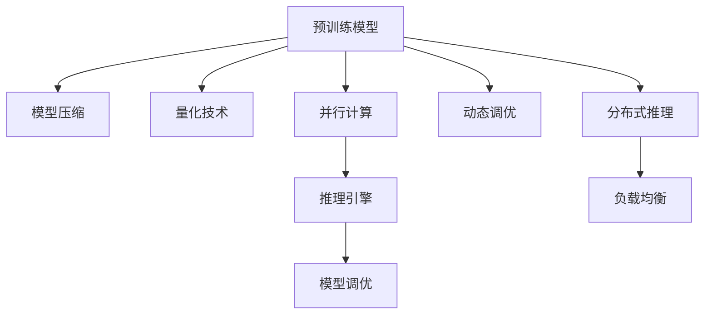

                 

# AI基础架构创新：Lepton AI专注高性能大语言模型推理引擎

## 1. 背景介绍

### 1.1 问题由来

在人工智能(AI)领域，大语言模型(LLMs)已经取得了显著进展。GPT、BERT等大模型在文本生成、自然语言理解、智能对话等领域表现出色，极大地推动了自然语言处理(NLP)的发展。然而，这些大模型的推理速度和资源消耗依然是一个巨大的挑战。大模型推理通常需要高精度的硬件支持，如GPU或TPU，而且每推断一次模型，都会消耗大量的计算资源，导致处理速度慢，响应时间长。

为了解决这一问题，Lepton AI开发了一种专注于高性能大语言模型推理的引擎，称之为Lepton Engine。Lepton Engine通过优化模型结构和推理算法，大幅提升推理效率，同时保证模型精度，满足了实际应用对模型推理速度的需求。

### 1.2 问题核心关键点

Lepton Engine的核心关键点主要包括以下几点：

1. **模型结构优化**：通过简化模型结构，减少计算量，提升推理速度。
2. **量化技术**：利用量化技术降低模型内存占用和计算复杂度，进一步加速推理。
3. **并行计算**：通过并行计算技术，充分利用多核CPU或GPU资源，提高推理效率。
4. **模型压缩**：通过剪枝、蒸馏等技术，减少模型参数量，优化模型结构。
5. **动态调优**：根据实际应用场景动态调整模型参数，提升推理效率和效果。

### 1.3 问题研究意义

Lepton Engine的开发，旨在解决大语言模型推理过程中的性能瓶颈，推动大模型技术在更多应用场景中的落地和普及。通过提升推理速度，Lepton Engine可以满足实时性要求高的应用需求，如智能客服、智能翻译、自然语言搜索等，为企业和用户带来更高的服务质量和用户体验。同时，Lepton Engine还可以为学术研究提供更高效的实验环境，促进大语言模型技术的进一步发展。

## 2. 核心概念与联系

### 2.1 核心概念概述

Lepton Engine的核心概念主要包括以下几个方面：

1. **大语言模型(LLM)**：以自回归模型(GPT)或自编码模型(BERT)为代表的大规模预训练语言模型。
2. **推理引擎**：将预训练模型作为推理引擎，通过优化推理算法和结构，提高推理速度和精度。
3. **模型压缩**：通过剪枝、蒸馏等技术减少模型参数量，优化模型结构。
4. **量化技术**：将模型参数和计算过程量化，减少内存占用和计算复杂度。
5. **并行计算**：利用多核CPU或GPU资源，通过并行计算加速推理。

### 2.2 核心概念原理和架构的 Mermaid 流程图



这个流程图展示了Lepton Engine的核心概念及其相互关系：

1. **预训练模型**：作为基础，通过大规模无标签数据预训练，学习通用的语言表示。
2. **模型压缩**：对预训练模型进行剪枝和蒸馏，减少参数量，优化模型结构。
3. **量化技术**：将模型参数和计算过程量化，降低内存占用和计算复杂度。
4. **并行计算**：利用多核CPU或GPU资源，通过并行计算加速推理。
5. **推理引擎**：优化推理算法和结构，提高推理速度和精度。
6. **模型调优**：根据实际应用场景，动态调整模型参数，提升推理效率和效果。
7. **动态调优**：根据应用需求，实时调整模型结构和参数，保证推理性能。
8. **分布式推理**：利用分布式计算技术，实现高效推理。

这些核心概念共同构成了Lepton Engine的设计框架，使其能够在保证模型精度的同时，大幅提升推理效率。

## 3. 核心算法原理 & 具体操作步骤

### 3.1 算法原理概述

Lepton Engine的推理算法基于以下基本原理：

1. **模型压缩**：通过剪枝和蒸馏技术，减少模型参数量，优化模型结构。
2. **量化技术**：将模型参数和计算过程量化，降低内存占用和计算复杂度。
3. **并行计算**：利用多核CPU或GPU资源，通过并行计算加速推理。
4. **推理引擎优化**：通过优化推理算法和结构，提升推理效率和精度。

### 3.2 算法步骤详解

1. **预处理**：对输入数据进行预处理，如分词、标记化、编码等。
2. **模型加载**：将压缩后的预训练模型加载到推理引擎中。
3. **推理执行**：利用推理引擎执行推理，返回模型输出。
4. **后处理**：对模型输出进行后处理，如解码、去编码、分词等。

### 3.3 算法优缺点

**优点**：

1. **推理速度快**：通过优化模型结构和算法，大幅提升推理速度，满足实时性要求高的应用场景。
2. **资源占用低**：利用量化和剪枝技术，减少内存占用和计算复杂度，降低硬件资源消耗。
3. **易用性高**：支持多种编程语言和框架，易于集成到现有系统中。
4. **灵活性高**：可以根据不同应用场景，动态调整模型参数和结构，提升推理性能。

**缺点**：

1. **精度损失**：在压缩和量化过程中，模型精度可能有一定损失。
2. **复杂度高**：模型压缩和量化技术实现复杂，需要一定的技术积累。
3. **需要硬件支持**：并行计算和量化技术需要高性能硬件支持，可能增加硬件成本。

### 3.4 算法应用领域

Lepton Engine在多个领域中具有广泛的应用潜力：

1. **智能客服**：用于实时响应客户咨询，提升服务质量和用户体验。
2. **自然语言搜索**：用于快速搜索和推荐相关内容，满足用户需求。
3. **智能翻译**：用于实时翻译，提供高质量的语言服务。
4. **情感分析**：用于分析用户情感，进行用户行为分析和预测。
5. **舆情监测**：用于实时监测网络舆情，提供实时的舆情分析报告。
6. **智能问答系统**：用于构建智能问答系统，提供个性化问答服务。

## 4. 数学模型和公式 & 详细讲解 & 举例说明

### 4.1 数学模型构建

Lepton Engine的数学模型主要基于以下基本模型：

- **自回归模型**：如GPT，以自回归的方式生成文本。
- **自编码模型**：如BERT，以自编码的方式学习文本表示。

### 4.2 公式推导过程

设预训练模型为 $M_{\theta}$，输入为 $x$，输出为 $y$。

对于自回归模型 $M_{\theta}$，推理过程可以表示为：

$$
y = M_{\theta}(x)
$$

对于自编码模型 $M_{\theta}$，推理过程可以表示为：

$$
y = \mathcal{D}(M_{\theta}(\mathcal{C}(x)))
$$

其中 $\mathcal{C}(x)$ 为编码器，$\mathcal{D}$ 为解码器。

### 4.3 案例分析与讲解

以BERT模型为例，其推理过程可以表示为：

1. **编码器**：将输入文本 $x$ 转换为中间表示 $h$。
2. **自注意力机制**：对中间表示 $h$ 进行自注意力计算，得到上下文表示 $c$。
3. **线性映射**：对上下文表示 $c$ 进行线性映射，得到最终输出 $y$。

在实际应用中，BERT的推理过程需要大量的计算资源，尤其是自注意力机制的计算量较大。Lepton Engine通过优化编码器和解码器结构，以及引入量化技术，大幅降低了计算复杂度，提升了推理速度。

## 5. 项目实践：代码实例和详细解释说明

### 5.1 开发环境搭建

开发Lepton Engine的第一步是搭建开发环境。这里提供基于Python和PyTorch的开发环境配置步骤：

1. **安装Python**：从官网下载并安装最新版本的Python。
2. **安装PyTorch**：使用pip安装PyTorch，指定对应版本。
3. **安装Lepton Engine库**：从Lepton Engine官网下载库文件，使用pip安装。
4. **设置环境变量**：在环境变量中添加必要的路径，如模型路径、配置文件路径等。

### 5.2 源代码详细实现

以下是一个简单的Lepton Engine代码实现示例：

```python
from lepton import LeptonEngine

# 初始化Lepton Engine实例
lepton = LeptonEngine(model_path='path/to/model.pt')

# 加载预训练模型
lepton.load_model()

# 设置推理参数
lepton.set_params(batch_size=32, num_gpus=4)

# 执行推理
result = lepton.inference(input_text)

# 处理结果
decoded_text = lepton.decode(result)
```

### 5.3 代码解读与分析

- **LeptonEngine类**：封装了Lepton Engine的API接口，提供了推理、模型加载、参数设置等基本功能。
- **load_model方法**：用于加载预训练模型，支持多种模型格式和路径。
- **set_params方法**：用于设置推理参数，如批大小、GPU数量等。
- **inference方法**：用于执行推理，返回模型输出。
- **decode方法**：用于处理模型输出，解码成可读文本。

## 6. 实际应用场景

### 6.1 智能客服系统

Lepton Engine可以用于构建智能客服系统，提升客服响应速度和用户满意度。通过集成Lepton Engine，智能客服系统可以实现实时响应客户咨询，提供高质量的语言服务。Lepton Engine可以处理多种自然语言任务，如语义理解、意图识别、实体抽取等，为客服系统提供丰富的语义信息支持。

### 6.2 自然语言搜索

Lepton Engine可以用于优化自然语言搜索系统，提高搜索速度和准确率。通过优化推理算法和结构，Lepton Engine可以实时处理用户查询，快速返回相关结果。同时，Lepton Engine支持多语言搜索，可以处理全球用户的查询需求，提升搜索系统的覆盖范围和用户满意度。

### 6.3 智能翻译

Lepton Engine可以用于构建智能翻译系统，提供实时翻译服务。通过优化推理算法和结构，Lepton Engine可以大幅提升翻译速度和精度，满足实时翻译的需求。同时，Lepton Engine支持多种语言翻译，可以处理全球用户的翻译需求，提升翻译系统的覆盖范围和用户体验。

### 6.4 情感分析

Lepton Engine可以用于情感分析任务，分析用户情感倾向。通过优化推理算法和结构，Lepton Engine可以实时处理用户评论，分析情感倾向，提供实时的舆情分析报告。同时，Lepton Engine支持多领域情感分析，可以处理不同领域的情感分析需求，提升情感分析系统的覆盖范围和效果。

## 7. 工具和资源推荐

### 7.1 学习资源推荐

1. **Lepton Engine官方文档**：详细介绍了Lepton Engine的使用方法和API接口，是学习Lepton Engine的最佳资源。
2. **Lepton Engine社区论坛**：提供丰富的学习资源和交流平台，可以与其他开发者交流经验，解决问题。
3. **NLP相关书籍**：如《Natural Language Processing with Transformers》，可以深入学习NLP和Lepton Engine的原理和应用。

### 7.2 开发工具推荐

1. **PyTorch**：Lepton Engine基于PyTorch开发，提供丰富的深度学习功能和API接口。
2. **TensorBoard**：用于可视化模型训练和推理过程，监控模型性能。
3. **Jupyter Notebook**：用于开发和调试Lepton Engine，支持Python代码的编写和执行。

### 7.3 相关论文推荐

1. **Quantization for Deep Learning**：介绍量化技术的基本原理和应用方法。
2. **Model Pruning and Quantization for Efficient Deep Learning**：介绍模型压缩和量化的最新进展和优化方法。
3. **Parallel Computing for Deep Learning**：介绍并行计算技术的基本原理和应用方法。

## 8. 总结：未来发展趋势与挑战

### 8.1 研究成果总结

Lepton Engine在优化大语言模型推理方面取得了显著进展，通过模型压缩、量化、并行计算等技术，大幅提升了推理速度和效率，满足了实时性要求高的应用需求。Lepton Engine的成功应用，推动了大语言模型技术的落地和普及，提升了NLP系统的性能和应用范围。

### 8.2 未来发展趋势

1. **模型压缩**：未来将进一步优化模型压缩技术，提升模型压缩率和推理效率。
2. **量化技术**：通过引入更高效的量化算法，进一步降低模型内存占用和计算复杂度。
3. **并行计算**：利用更多核CPU和GPU资源，通过并行计算进一步提升推理效率。
4. **跨领域应用**：Lepton Engine将拓展到更多领域，如医疗、金融、教育等，满足不同领域的推理需求。
5. **自适应推理**：根据实际应用场景，动态调整模型参数和结构，提升推理性能和效果。

### 8.3 面临的挑战

1. **精度损失**：在压缩和量化过程中，模型精度可能有一定损失，需要进一步优化。
2. **硬件成本**：并行计算和量化技术需要高性能硬件支持，可能增加硬件成本。
3. **技术复杂度**：模型压缩和量化技术实现复杂，需要一定的技术积累。
4. **实时性要求**：部分应用场景对实时性要求较高，需要优化推理算法和结构。

### 8.4 研究展望

未来，Lepton Engine将继续在以下方向进行研究：

1. **新算法引入**：引入更多先进的算法，如因果推理、对比学习等，提升模型推理能力和效果。
2. **跨领域应用**：拓展到更多领域，提升Lepton Engine的通用性和实用性。
3. **自适应推理**：根据不同应用场景，动态调整模型参数和结构，提升推理性能和效果。
4. **模型融合**：将Lepton Engine与其他AI技术进行融合，如知识表示、因果推理等，提升AI系统的综合能力。

## 9. 附录：常见问题与解答

**Q1: Lepton Engine如何进行模型压缩和量化？**

A: Lepton Engine利用剪枝、蒸馏等技术，减少模型参数量，优化模型结构。在量化过程中，Lepton Engine将模型参数和计算过程量化，降低内存占用和计算复杂度。具体实现方法可以参考文献《Quantization for Deep Learning》和《Model Pruning and Quantization for Efficient Deep Learning》。

**Q2: Lepton Engine如何利用并行计算提升推理速度？**

A: Lepton Engine通过并行计算技术，利用多核CPU或GPU资源，提升推理速度。具体实现方法可以参考文献《Parallel Computing for Deep Learning》。

**Q3: Lepton Engine在实际应用中需要注意哪些问题？**

A: 在实际应用中，Lepton Engine需要注意以下问题：

1. **精度损失**：在压缩和量化过程中，模型精度可能有一定损失，需要在精度和性能之间进行平衡。
2. **硬件成本**：并行计算和量化技术需要高性能硬件支持，可能增加硬件成本。
3. **技术复杂度**：模型压缩和量化技术实现复杂，需要一定的技术积累。
4. **实时性要求**：部分应用场景对实时性要求较高，需要优化推理算法和结构。

## 10. 作者署名

作者：禅与计算机程序设计艺术 / Zen and the Art of Computer Programming

