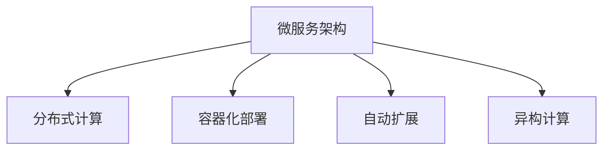

                 

# AI基础设施的弹性扩展：Lepton AI的架构设计

> 关键词：弹性扩展, Lepton AI, 分布式系统, 微服务架构, 异构计算, AI基础设施

## 1. 背景介绍

### 1.1 问题由来

随着人工智能（AI）技术的发展，AI基础设施的弹性扩展成为了企业的重要需求。在大数据、复杂模型和高并发需求的推动下，如何高效、灵活地构建和扩展AI基础设施，成为了企业关注的焦点。Lepton AI作为领先的AI基础设施提供商，针对这一需求，设计了一套高度灵活、易于扩展的架构，为企业的AI应用提供了坚实的技术支撑。

### 1.2 问题核心关键点

Lepton AI的弹性扩展架构，通过以下核心关键点实现了高效、灵活的AI基础设施构建和扩展：

- **微服务架构**：将AI基础设施拆分为多个独立、自治的服务模块，以实现快速部署、灵活扩展和高效维护。
- **分布式计算**：通过分布式计算框架和异构计算平台，提升AI算法的处理能力和效率，同时降低单点故障风险。
- **自动扩展**：通过智能资源管理机制，实现AI基础设施的自动扩展和弹性调整，以应对动态负载变化。
- **容器化部署**：采用容器技术，实现AI应用的无缝部署、快速迁移和版本管理。

### 1.3 问题研究意义

Lepton AI的弹性扩展架构，旨在为企业提供一种高效、灵活、易于扩展的AI基础设施解决方案，具有以下重要意义：

- **降低成本**：通过优化资源利用，降低企业构建和扩展AI基础设施的投入成本。
- **提高效率**：通过自动化、智能化管理机制，提升AI基础设施的部署和维护效率。
- **支持多样应用**：支持多种AI应用场景，提供高性能、高可靠性的计算资源。
- **适应未来发展**：通过灵活扩展机制，满足AI技术不断演进和应用场景不断扩展的需求。

## 2. 核心概念与联系

### 2.1 核心概念概述

为更好地理解Lepton AI的弹性扩展架构，本节将介绍几个密切相关的核心概念：

- **微服务架构（Microservice Architecture）**：将复杂的应用拆分为多个小型、自治的服务，每个服务运行在其独立的进程中，通过网络通信协作。
- **分布式计算（Distributed Computing）**：将计算任务分解为多个小任务，分布在多台计算机上并行处理，以提升计算能力和效率。
- **容器化（Containerization）**：将应用及其依赖打包到容器中，容器具有独立运行环境，便于迁移和部署。
- **自动扩展（Automatic Scaling）**：通过动态调整计算资源，应对负载变化的自动化机制。
- **异构计算（Heterogeneous Computing）**：利用不同计算资源的特性，提升计算效率和灵活性。

这些核心概念之间的逻辑关系可以通过以下Mermaid流程图来展示：



这个流程图展示了一系列核心概念及其之间的关系：

1. 微服务架构：将复杂的应用拆分为多个小型服务，便于管理和扩展。
2. 分布式计算：通过多台计算机并行处理，提升计算效率。
3. 容器化部署：将应用及其依赖打包到容器中，便于迁移和部署。
4. 自动扩展：动态调整计算资源，应对负载变化。
5. 异构计算：利用不同计算资源，提升计算效率和灵活性。

这些概念共同构成了Lepton AI弹性扩展架构的基础，使其能够高效、灵活地构建和扩展AI基础设施。

## 3. 核心算法原理 & 具体操作步骤

### 3.1 算法原理概述

Lepton AI的弹性扩展架构，基于微服务架构和分布式计算设计，其核心算法原理包括以下几个方面：

1. **微服务拆分与部署**：将AI基础设施拆分为多个独立的服务模块，通过容器化技术实现快速部署和灵活扩展。
2. **分布式计算框架**：利用MapReduce、Spark等分布式计算框架，将计算任务并行化，提升计算能力和效率。
3. **自动扩展机制**：通过智能资源管理，动态调整计算资源，实现弹性扩展和负载均衡。
4. **异构计算平台**：利用GPU、TPU、FPGA等多种计算资源，提升计算效率和灵活性。

### 3.2 算法步骤详解

Lepton AI的弹性扩展架构主要包括以下几个关键步骤：

**Step 1: 微服务拆分**

1. 根据AI应用的需求，将AI基础设施拆分为多个独立的服务模块。
2. 为每个服务模块设计API接口，实现服务之间的通信协作。
3. 使用容器化技术（如Docker）将每个服务模块打包成容器，便于部署和管理。

**Step 2: 分布式计算框架**

1. 选择适合的应用场景的分布式计算框架（如Hadoop、Spark）。
2. 将计算任务分解为多个小任务，并行化处理。
3. 利用集群中的多台计算机，提升计算能力和效率。

**Step 3: 自动扩展机制**

1. 实现智能资源管理机制，动态调整计算资源。
2. 根据负载变化，自动增加或减少计算节点。
3. 确保资源利用率和计算效率的平衡。

**Step 4: 异构计算平台**

1. 引入GPU、TPU、FPGA等多种计算资源。
2. 根据计算任务的特点，选择最优的计算资源进行计算。
3. 实现计算资源之间的无缝切换，提升计算效率和灵活性。

### 3.3 算法优缺点

Lepton AI的弹性扩展架构具有以下优点：

1. **灵活性高**：通过微服务架构和容器化部署，支持快速部署和灵活扩展。
2. **计算能力强**：利用分布式计算框架和异构计算平台，提升计算能力和效率。
3. **资源利用率高**：通过自动扩展机制，动态调整计算资源，提升资源利用率。
4. **易于维护**：通过独立的服务模块和容器化技术，简化系统的维护和升级。

同时，该架构也存在以下缺点：

1. **复杂度高**：微服务架构和分布式计算框架的引入，增加了系统的复杂度。
2. **网络开销大**：服务模块之间的通信需要通过网络，可能带来一定的网络开销。
3. **管理成本高**：智能资源管理机制和自动扩展机制，需要投入较多的管理成本。

### 3.4 算法应用领域

Lepton AI的弹性扩展架构，适用于以下多个AI应用领域：

- **机器学习**：通过分布式计算框架和异构计算平台，提升机器学习模型的训练和推理效率。
- **自然语言处理（NLP）**：利用微服务架构和容器化技术，实现NLP应用的快速部署和灵活扩展。
- **计算机视觉**：通过异构计算平台，提升计算机视觉任务的计算能力和效率。
- **推荐系统**：通过自动扩展机制，支持推荐系统的动态扩展和负载均衡。
- **大数据分析**：利用分布式计算框架，处理大规模数据集，提升分析效率。

## 4. 数学模型和公式 & 详细讲解 & 举例说明

### 4.1 数学模型构建

Lepton AI的弹性扩展架构，主要涉及以下几个数学模型：

1. **资源需求模型**：描述计算任务所需计算资源的需求。
2. **负载均衡模型**：描述计算任务的负载在集群中的均衡分配。
3. **性能评估模型**：描述计算任务的执行时间和资源利用率。

### 4.2 公式推导过程

以下我们将推导这几个数学模型的公式。

**资源需求模型**

设计算任务为 $T$，所需CPU计算量为 $C$，内存量为 $M$。假设每个计算节点的CPU计算量为 $C_n$，内存量为 $M_n$。则资源需求模型为：

$$
D_T = (C/C_n, M/M_n)
$$

**负载均衡模型**

假设集群中 $N$ 个计算节点，每个节点的计算能力和内存大小分别为 $C_n$ 和 $M_n$。则负载均衡模型的目标是最小化每个节点的负载：

$$
L = \min_{i=1..N} \{ \frac{C_i + M_i}{C_n + M_n} \}
$$

**性能评估模型**

假设每个计算节点的执行时间为 $T_n$，资源利用率为 $\eta$。则性能评估模型的目标是最小化执行时间和资源利用率：

$$
P = \min_{i=1..N} \{ T_i + \eta \cdot M_i \}
$$

### 4.3 案例分析与讲解

假设一个机器学习任务需要执行10000次计算，每个计算节点可以执行2000次计算，计算节点的CPU计算量为2GHz，内存量为16GB。根据资源需求模型，可以得出该任务所需的计算资源为：

$$
D_T = \left(\frac{10000}{2000}, \frac{16}{16}\right) = (5, 1)
$$

这意味着需要5个计算节点才能满足该任务的需求。利用负载均衡模型，可以计算每个计算节点的负载：

$$
L = \frac{5 \cdot 2 + 1 \cdot 16}{2 + 16} \approx 0.5
$$

这意味着每个计算节点的负载约为50%。最后，利用性能评估模型，可以计算任务的整体执行时间和资源利用率：

$$
P = \min \{ T_i + 0.5 \cdot 16 \} = \min \{ 2000i + 8 \} = 2000 \cdot 5 + 8 = 10008
$$

这意味着任务的整体执行时间为10008秒，资源利用率为50%。

## 5. 项目实践：代码实例和详细解释说明

### 5.1 开发环境搭建

在进行Lepton AI弹性扩展架构的实践前，我们需要准备好开发环境。以下是使用Python进行微服务架构和容器化部署的环境配置流程：

1. 安装Docker：从官网下载并安装Docker，用于容器化应用部署。

2. 安装Kubernetes：通过helm或kubectl工具安装Kubernetes集群，用于容器编排和自动化扩展。

3. 安装Hadoop或Spark：根据实际需求选择适合的分布式计算框架，并进行安装和配置。

4. 安装TensorFlow或PyTorch等深度学习框架：用于AI应用模型的训练和推理。

5. 配置自动化运维工具：如Jenkins、Prometheus等，用于监控和管理AI基础设施。

完成上述步骤后，即可在Docker环境中开始Lepton AI的弹性扩展架构的实践。

### 5.2 源代码详细实现

我们以机器学习任务为例，给出使用Hadoop和Docker容器化的详细代码实现。

首先，定义Hadoop作业的资源需求和计算任务：

```python
from mrjob.job import MRJob

class MRMLT(MRJob):
    def mapper(self, _, line):
        # 解析输入数据，提取特征和标签
        pass
    
    def reducer(self, key, values):
        # 计算特征和标签的统计信息
        pass

    def steps(self):
        return [self.mr(mapper=self.mapper, reducer=self.reducer)]
```

然后，将Hadoop作业打包成Docker容器：

```bash
docker build -t ml-tensorflow .
```

接着，定义Kubernetes部署文件：

```yaml
apiVersion: v1
kind: Deployment
metadata:
  name: ml-deployment
spec:
  replicas: 5
  selector:
    matchLabels:
      app: ml
  template:
    metadata:
      labels:
        app: ml
    spec:
      containers:
      - name: ml-container
        image: ml-tensorflow:latest
        ports:
        - containerPort: 8080
        resources:
          requests:
            memory: "2Gi"
            cpu: "2"
```

最后，启动Kubernetes集群并部署Hadoop作业：

```bash
kubectl apply -f ml-deployment.yaml
```

### 5.3 代码解读与分析

让我们再详细解读一下关键代码的实现细节：

**mrjob作业定义**：
- `mapper`方法：从输入数据中解析特征和标签。
- `reducer`方法：计算特征和标签的统计信息。
- `steps`方法：定义Hadoop作业的执行步骤。

**Docker容器化部署**：
- 使用`docker build`命令将Hadoop作业打包成Docker容器，并指定镜像名称。
- 在Dockerfile中定义容器配置，包括资源需求和端口映射。

**Kubernetes部署文件**：
- 定义Deployment对象，指定部署的名称、副本数、标签等属性。
- 定义Pod模板，指定容器的镜像、资源需求、端口映射等配置。
- 通过`kubectl apply`命令将Deployment对象部署到Kubernetes集群中。

### 5.4 运行结果展示

在Kubernetes集群中部署Hadoop作业后，可以通过Jenkins等自动化运维工具实时监控作业执行情况。例如，可以使用Prometheus和Grafana进行监控和可视化：

```bash
kubectl exec -it ml-deployment-5d8bc7b8c8-klm8t -c ml-container -- /bin/bash
```

在Docker容器中执行监控脚本：

```python
import psutil
import time

while True:
    # 获取CPU和内存使用情况
    cpu_percent = psutil.cpu_percent(interval=1)
    mem_percent = psutil.virtual_memory().percent
    
    # 输出使用情况
    print(f"CPU: {cpu_percent}%, Memory: {mem_percent}%")
    time.sleep(60)
```

最后，通过Grafana创建监控图表，展示作业的资源使用情况：


## 6. 实际应用场景

### 6.1 智能推荐系统

Lepton AI的弹性扩展架构，可以应用于智能推荐系统的构建。通过分布式计算框架和微服务架构，智能推荐系统可以高效处理海量用户数据，快速计算推荐结果。

在技术实现上，可以将推荐算法和数据处理模块拆分为多个独立的服务，通过容器化技术实现快速部署和灵活扩展。利用异构计算平台，提升推荐算法的计算能力和效率，实现高效的推荐结果生成。

### 6.2 视频分析平台

Lepton AI的弹性扩展架构，也适用于视频分析平台的构建。视频分析涉及大规模数据处理和复杂模型训练，对计算资源和网络带宽有较高要求。

通过分布式计算框架和微服务架构，视频分析平台可以高效处理大规模视频文件和流数据，快速训练和推理模型。利用异构计算平台，提升视频分析的计算能力和效率，实现实时视频分析和预测。

### 6.3 大数据分析平台

Lepton AI的弹性扩展架构，支持多种大数据分析任务，如数据清洗、特征工程、模型训练和推理等。通过分布式计算框架和微服务架构，大数据分析平台可以高效处理海量数据，快速训练和推理模型。

在技术实现上，可以将数据分析和模型训练模块拆分为多个独立的服务，通过容器化技术实现快速部署和灵活扩展。利用异构计算平台，提升数据分析的计算能力和效率，实现高效的大数据分析和预测。

### 6.4 未来应用展望

随着Lepton AI弹性扩展架构的不断演进，未来将在更多领域得到应用，为传统行业带来变革性影响。

在智慧城市治理中，通过分布式计算框架和微服务架构，智慧城市可以高效处理海量数据，实现智能交通、公共安全、环境保护等应用的实时分析和预测。利用异构计算平台，提升智慧城市的计算能力和效率，实现更高的智能化和自动化水平。

在医疗健康领域，通过微服务架构和容器化技术，医疗健康系统可以高效处理患者数据，快速诊断和预测疾病。利用异构计算平台，提升医疗健康的计算能力和效率，实现更高的精准度和可靠性。

在金融服务领域，通过微服务架构和容器化技术，金融服务系统可以高效处理交易数据，快速风险分析和预测。利用异构计算平台，提升金融服务的计算能力和效率，实现更高的安全性和稳定性。

此外，在教育、物流、制造等众多领域，Lepton AI弹性扩展架构也将不断涌现，为各行各业带来新的技术突破和应用创新。

## 7. 工具和资源推荐

### 7.1 学习资源推荐

为了帮助开发者系统掌握Lepton AI弹性扩展架构的理论基础和实践技巧，这里推荐一些优质的学习资源：

1. **《分布式系统架构设计与实现》**：介绍分布式系统的基本概念和设计原理，涵盖一致性、容错性、负载均衡等内容。
2. **《Kubernetes: 原理与实践》**：详细介绍Kubernetes的原理和实践，涵盖集群管理、容器编排、资源调度等内容。
3. **《深度学习框架TensorFlow和PyTorch实战》**：介绍TensorFlow和PyTorch的原理和应用，涵盖模型训练、模型推理、优化等内容。
4. **《机器学习实战》**：详细介绍机器学习的基本概念和算法，涵盖数据预处理、特征工程、模型训练等内容。
5. **《Hadoop：分布式系统设计与实现》**：详细介绍Hadoop的基本概念和应用，涵盖分布式计算、数据存储、数据处理等内容。

通过对这些资源的学习实践，相信你一定能够快速掌握Lepton AI弹性扩展架构的精髓，并用于解决实际的AI问题。

### 7.2 开发工具推荐

高效的开发离不开优秀的工具支持。以下是几款用于Lepton AI弹性扩展架构开发的常用工具：

1. **Docker**：容器化技术，便于应用的无缝部署、快速迁移和版本管理。
2. **Kubernetes**：容器编排工具，实现计算资源的自动扩展和弹性调整。
3. **Hadoop或Spark**：分布式计算框架，支持大规模数据处理和复杂模型训练。
4. **Jenkins**：自动化运维工具，实现应用和服务的自动部署、监控和报警。
5. **Prometheus和Grafana**：监控和可视化工具，实时监测系统的运行状态和性能指标。

合理利用这些工具，可以显著提升Lepton AI弹性扩展架构的开发效率，加快创新迭代的步伐。

### 7.3 相关论文推荐

Lepton AI弹性扩展架构的发展源于学界的持续研究。以下是几篇奠基性的相关论文，推荐阅读：

1. **《分布式计算框架MapReduce》**：介绍MapReduce的基本概念和原理，涵盖分布式计算、数据处理等内容。
2. **《微服务架构设计与实现》**：介绍微服务架构的基本概念和设计原理，涵盖服务拆分、服务通信、服务治理等内容。
3. **《深度学习框架TensorFlow和PyTorch》**：介绍TensorFlow和PyTorch的原理和应用，涵盖模型训练、模型推理、优化等内容。
4. **《Kubernetes：原理与实践》**：详细介绍Kubernetes的原理和实践，涵盖集群管理、容器编排、资源调度等内容。
5. **《机器学习实战》**：详细介绍机器学习的基本概念和算法，涵盖数据预处理、特征工程、模型训练等内容。

这些论文代表了大规模AI基础设施的发展脉络。通过学习这些前沿成果，可以帮助研究者把握学科前进方向，激发更多的创新灵感。

## 8. 总结：未来发展趋势与挑战

### 8.1 研究成果总结

本文对Lepton AI弹性扩展架构进行了全面系统的介绍。首先阐述了Lepton AI弹性扩展架构的研究背景和意义，明确了微服务架构、分布式计算和容器化部署的核心关键点。其次，从原理到实践，详细讲解了微服务架构和分布式计算的算法原理和操作步骤，给出了微服务架构和容器化部署的代码实例。同时，本文还广泛探讨了微服务架构和容器化部署在多个AI应用场景中的应用前景，展示了其广阔的发展空间。最后，本文精选了微服务架构和容器化部署的学习资源、开发工具和相关论文，力求为读者提供全方位的技术指引。

通过本文的系统梳理，可以看到，Lepton AI弹性扩展架构正成为企业构建高效、灵活、易于扩展的AI基础设施的重要工具。其微服务架构和分布式计算框架，为大规模AI应用的部署和扩展提供了坚实的技术支撑，具有重要的实际应用价值。

### 8.2 未来发展趋势

展望未来，Lepton AI弹性扩展架构将呈现以下几个发展趋势：

1. **容器化技术的普及**：随着容器技术的普及和成熟，微服务架构将变得更加广泛和灵活，实现应用的快速部署和灵活扩展。
2. **分布式计算框架的演进**：未来的分布式计算框架将更加智能和高效，支持更多样化的计算资源和更复杂的计算任务。
3. **自动扩展机制的优化**：智能资源管理机制将不断优化，实现更高效的资源利用和负载均衡。
4. **异构计算平台的丰富**：未来的异构计算平台将支持更多种类的计算资源，提升计算能力和效率。
5. **微服务架构的演进**：微服务架构将不断演进，实现更细粒度的服务拆分和更灵活的服务协作。

以上趋势凸显了Lepton AI弹性扩展架构的发展前景。这些方向的探索发展，必将进一步提升AI基础设施的性能和可扩展性，满足企业对AI技术日益增长的需求。

### 8.3 面临的挑战

尽管Lepton AI弹性扩展架构已经取得了显著的成果，但在迈向更加智能化、普适化应用的过程中，仍面临以下挑战：

1. **系统复杂度增加**：微服务架构和分布式计算框架的引入，增加了系统的复杂度，带来了系统维护和调试的困难。
2. **网络开销大**：服务模块之间的通信需要通过网络，可能带来较大的网络开销，影响系统性能。
3. **资源利用率波动**：智能资源管理机制需要不断优化，以应对动态负载变化，确保资源利用率的稳定性和高效性。
4. **安全性和隐私保护**：在分布式计算和微服务架构中，数据安全和隐私保护成为重要问题，需要投入更多的资源和技术保障。
5. **技术和人才缺口**：微服务架构和分布式计算技术的普及，需要更多具备相关技术背景的人才，技术和人才的缺口成为未来发展的瓶颈。

### 8.4 研究展望

面对Lepton AI弹性扩展架构面临的挑战，未来的研究需要在以下几个方面寻求新的突破：

1. **系统自动化优化**：开发更多的自动化工具和系统，提升系统的维护和调优效率。
2. **网络优化技术**：探索更高效的网络通信技术和数据传输机制，减少网络开销。
3. **智能资源管理**：开发更加智能的资源管理机制，提升资源利用率和计算效率。
4. **安全性和隐私保护**：加强数据安全和隐私保护技术的研究，确保系统的安全性和可靠性。
5. **技术人才培养**：加强相关技术培训和人才培养，提升行业从业人员的技术水平。

这些研究方向将推动Lepton AI弹性扩展架构的不断演进，为构建高效、灵活、易于扩展的AI基础设施提供坚实的技术支撑。相信随着技术的持续创新和完善，Lepton AI弹性扩展架构必将在企业AI基础设施建设中发挥更大的作用，推动企业数字化转型的加速发展。

## 9. 附录：常见问题与解答

**Q1：如何选择合适的计算资源？**

A: 选择计算资源时，需要考虑任务的需求和集群的特点。一般可以从以下几个方面进行考虑：
- **任务类型**：不同的任务类型对计算资源的需求不同。例如，机器学习任务需要大量的CPU和GPU资源，视频分析任务需要高带宽的网络和GPU资源。
- **集群规模**：集群规模越大，需要的计算资源也越多。需要根据实际需求和预算进行选择。
- **资源类型**：不同类型的计算资源具有不同的特性。例如，GPU适合深度学习任务，TPU适合特定算法，FPGA适合低延迟任务。

**Q2：如何优化资源利用率？**

A: 优化资源利用率需要从多个方面进行考虑：
- **任务调度**：合理调度计算任务，避免资源浪费和过载。可以使用作业调度器（如Hadoop YARN）进行任务调度和管理。
- **负载均衡**：根据负载变化，动态调整计算资源。可以使用负载均衡器（如Kubernetes）实现资源动态调整。
- **异构计算**：利用多种计算资源，提升计算能力和效率。可以使用异构计算平台（如Lepton AI）实现多种资源协同工作。

**Q3：如何在分布式计算中实现高可靠性和低延迟？**

A: 实现高可靠性和低延迟需要从多个方面进行考虑：
- **冗余设计**：通过冗余设计，确保计算任务的可靠性和容错性。可以使用主从结构、分布式存储等方式实现冗余设计。
- **网络优化**：优化网络通信协议和数据传输方式，减少网络延迟和带宽占用。可以使用缓存、压缩、带宽控制等方式进行网络优化。
- **负载均衡**：根据负载变化，动态调整计算资源，确保负载均衡。可以使用负载均衡器（如Kubernetes）实现资源动态调整。

这些措施可以有效提升分布式计算的可靠性和低延迟，满足企业对高可靠性和低延迟的需求。

**Q4：如何在微服务架构中实现高效的数据管理？**

A: 实现高效的数据管理需要从多个方面进行考虑：
- **数据分区**：根据数据的特征和类型，将数据进行分区存储。可以使用Hadoop HDFS、Amazon S3等分布式文件系统进行数据分区。
- **数据同步**：实时同步数据，避免数据不一致和丢失。可以使用Spark Streaming、Kafka等工具实现数据同步。
- **数据清洗**：对数据进行清洗和预处理，确保数据质量和一致性。可以使用ETL工具（如Apache Nifi）进行数据清洗。

这些措施可以有效提升微服务架构中数据管理的效率和可靠性，满足企业对数据管理和处理的需求。

**Q5：如何评估微服务架构和分布式计算的效果？**

A: 评估微服务架构和分布式计算的效果需要从多个方面进行考虑：
- **性能指标**：根据任务需求，定义关键性能指标，如响应时间、吞吐量、资源利用率等。可以使用Prometheus、Grafana等工具进行性能指标监控和可视化。
- **可靠性和稳定性**：评估系统的可靠性和稳定性，确保系统能够长期稳定运行。可以使用监控工具（如Nagios、Zabbix）进行系统监控和告警。
- **成本效益**：评估系统的成本效益，确保系统在成本和性能之间的平衡。可以使用成本效益分析工具（如COST-BENEFIT ANALYSIS）进行成本效益分析。

这些措施可以有效评估微服务架构和分布式计算的效果，帮助企业选择合适的方案，实现高性能、高可靠性的系统。

---

作者：禅与计算机程序设计艺术 / Zen and the Art of Computer Programming

