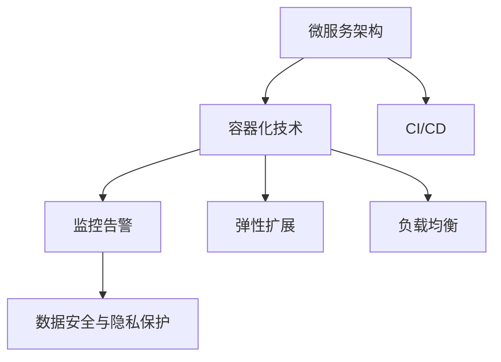

                 

# AI基础设施的智能运维：Lepton AI的自动化方案

> 关键词：AI基础设施，智能运维，Lepton AI，自动化方案

## 1. 背景介绍

在AI应用的蓬勃发展中，基础设施的智能运维变得愈发重要。由于AI系统依赖于大量的数据和模型，其运维管理的复杂性不断提升，急需高效、自动化的运维方案。Lepton AI作为AI基础设施的领先提供商，提出了基于微服务和容器化的智能运维方案，通过自动化技术保障AI系统的稳定和高效运行。

### 1.1 问题由来

AI系统在金融、医疗、教育等众多领域的应用，带来了大量数据和模型。然而，随着模型规模的扩大，运维管理的复杂度不断提升，如模型参数调整、监控告警、性能优化、数据迁移等问题，使得运维工作愈发困难。传统的手工运维方式难以应对复杂多变的运维需求，迫切需要高效的自动化解决方案。

### 1.2 问题核心关键点

Lepton AI的智能运维方案基于微服务架构和容器化技术，通过自动化的运维工具链，实现了AI系统的全生命周期管理。该方案的核心关键点包括：

1. **微服务架构**：将AI系统划分为独立可复用的微服务，使每个微服务独立部署、独立运维，减少系统耦合，提高系统可维护性和扩展性。
2. **容器化技术**：使用Docker等容器技术，实现应用的可移植性和隔离性，支持自动化部署和运维。
3. **自动化运维工具**：集成CI/CD、监控告警、性能优化、数据迁移等功能，提升运维效率和可靠性。
4. **弹性扩展与负载均衡**：根据系统负载动态调整资源配置，实现高可用性和高吞吐量。
5. **数据安全与隐私保护**：采用数据加密、访问控制等技术，保障数据安全和隐私。

## 2. 核心概念与联系

### 2.1 核心概念概述

为更好地理解Lepton AI的智能运维方案，本节将介绍几个密切相关的核心概念：

- **微服务架构**：将AI系统拆分为独立运行的微服务，每个微服务负责特定的业务逻辑和数据处理，通过服务之间的协调，实现整体系统的功能。
- **容器化技术**：使用Docker等容器技术，将应用和依赖打包成镜像，实现应用的跨平台部署和运行，支持自动化运维。
- **CI/CD（持续集成/持续部署）**：通过自动化工具链，实现代码的持续集成、测试、构建和部署，加速应用迭代和发布。
- **监控告警**：通过监控系统，实时跟踪AI系统的运行状态，发现异常情况并及时告警，保障系统稳定。
- **弹性扩展**：根据系统负载动态调整资源配置，提升系统的高可用性和高性能。
- **负载均衡**：通过负载均衡技术，将请求均匀分配到多个实例上，避免单点故障，提高系统吞吐量。
- **数据安全与隐私保护**：采用数据加密、访问控制等技术，保障数据在存储、传输和处理过程中的安全性。

这些核心概念之间的逻辑关系可以通过以下Mermaid流程图来展示：



这个流程图展示了许多核心概念及其之间的关系：

1. 微服务架构将AI系统拆分为独立运行的微服务。
2. 容器化技术将微服务打包成镜像，实现跨平台部署和运行。
3. CI/CD实现代码的持续集成、测试、构建和部署，加速应用迭代。
4. 监控告警实时跟踪系统运行状态，发现异常情况并及时告警。
5. 弹性扩展根据系统负载动态调整资源配置，提升系统高可用性和高性能。
6. 负载均衡将请求均匀分配到多个实例上，避免单点故障，提高系统吞吐量。
7. 数据安全与隐私保护保障数据在存储、传输和处理过程中的安全性。

这些概念共同构成了Lepton AI智能运维方案的核心框架，使得AI系统的运维变得更加高效和可靠。

## 3. 核心算法原理 & 具体操作步骤

### 3.1 算法原理概述

Lepton AI的智能运维方案，基于微服务和容器化技术，通过自动化的工具链，实现AI系统的全生命周期管理。该方案的核心算法原理如下：

- **微服务架构**：将AI系统划分为多个独立运行的微服务，每个微服务负责特定的业务逻辑和数据处理。通过服务之间的协调，实现整体系统的功能。
- **容器化技术**：使用Docker等容器技术，将微服务打包成镜像，实现跨平台部署和运行。
- **CI/CD（持续集成/持续部署）**：通过自动化工具链，实现代码的持续集成、测试、构建和部署，加速应用迭代和发布。
- **监控告警**：通过监控系统，实时跟踪AI系统的运行状态，发现异常情况并及时告警，保障系统稳定。
- **弹性扩展**：根据系统负载动态调整资源配置，提升系统的高可用性和高性能。
- **负载均衡**：通过负载均衡技术，将请求均匀分配到多个实例上，避免单点故障，提高系统吞吐量。
- **数据安全与隐私保护**：采用数据加密、访问控制等技术，保障数据在存储、传输和处理过程中的安全性。

### 3.2 算法步骤详解

Lepton AI的智能运维方案包括以下关键步骤：

**Step 1: 微服务划分**
- 根据AI系统功能需求，将系统拆分为多个独立运行的微服务。
- 每个微服务设计独立的数据接口和业务逻辑，实现高内聚、低耦合。

**Step 2: 容器化部署**
- 使用Docker等容器技术，将微服务打包成镜像。
- 将镜像上传到容器仓库，如Docker Hub、Kubernetes等，供自动化部署使用。

**Step 3: 配置CI/CD**
- 搭建CI/CD流水线，包括代码仓库、持续集成、持续测试、持续部署等环节。
- 配置自动化测试工具，如Jenkins、Travis CI等，自动化测试和构建代码。
- 配置自动化部署工具，如Jenkins Pipeline、Kubernetes Deployment等，自动化部署微服务。

**Step 4: 集成监控告警**
- 部署监控系统，如Prometheus、Grafana等，实时监控AI系统的运行状态。
- 配置告警规则，定义监控指标和告警阈值，及时发现异常情况。

**Step 5: 实现弹性扩展**
- 配置负载均衡器，如Nginx、HAProxy等，将请求均匀分配到多个实例上。
- 根据系统负载动态调整资源配置，如CPU、内存、磁盘等，确保系统高可用性和高性能。

**Step 6: 数据安全与隐私保护**
- 采用数据加密技术，如AES、RSA等，保障数据在存储、传输和处理过程中的安全性。
- 配置访问控制策略，如RBAC、ACL等，限制数据访问权限，保护敏感数据。

**Step 7: 持续优化**
- 根据监控数据和用户反馈，不断优化微服务架构和运维策略。
- 采用A/B测试、灰度发布等方法，逐步迭代和完善系统功能。

### 3.3 算法优缺点

Lepton AI的智能运维方案具有以下优点：
1. **高效可靠**：通过微服务和容器化技术，实现了系统的模块化和可移植性，提升了运维效率和系统可靠性。
2. **灵活扩展**：根据系统负载动态调整资源配置，实现弹性扩展和负载均衡，提升了系统的扩展性和高可用性。
3. **自动化运维**：通过CI/CD、监控告警等自动化工具，实现了持续集成和持续部署，加快了应用迭代和发布。
4. **安全可靠**：采用数据加密和访问控制等安全措施，保障了数据安全和隐私。

同时，该方案也存在一些局限性：
1. **初始配置复杂**：微服务划分和容器化部署需要一定的技术积累和经验。
2. **资源消耗较大**：容器化技术需要额外的计算资源，增加了系统的资源开销。
3. **运维成本高**：自动化工具链的搭建和维护需要额外的人力和物力投入。

尽管存在这些局限性，但Lepton AI的智能运维方案在大规模AI系统中的应用，仍然取得了显著的效果，提升了系统的运维效率和可靠性。

### 3.4 算法应用领域

Lepton AI的智能运维方案已经在多个AI应用领域得到了广泛的应用，包括但不限于以下几个方面：

- **金融领域**：在金融风险预测、智能投顾、客户服务等方面，通过智能运维保障AI模型的稳定性和高可用性。
- **医疗领域**：在医学影像诊断、智能问诊、健康管理等方面，通过智能运维提升医疗系统的准确性和响应速度。
- **教育领域**：在智能教育、在线答疑、学习推荐等方面，通过智能运维提高教学质量和用户体验。
- **智能制造**：在生产调度、质量控制、设备维护等方面，通过智能运维提升制造业的智能化水平。
- **智慧城市**：在交通管理、环境监测、公共安全等方面，通过智能运维实现城市治理的自动化和智能化。

## 4. 数学模型和公式 & 详细讲解 & 举例说明

### 4.1 数学模型构建

Lepton AI的智能运维方案，涉及多个领域的运维指标和监控数据，因此需要使用数学模型来量化和分析这些数据。

假设AI系统由n个微服务组成，每个微服务的运行状态可以用一个向量 $X_i$ 来表示，其中 $X_{ij}$ 表示微服务 $i$ 在时间 $j$ 的状态（如CPU使用率、内存使用率等）。则系统的整体状态可以用一个矩阵 $X$ 来表示，其中 $X_{ij}$ 表示微服务 $i$ 在时间 $j$ 的状态。

定义系统的监控指标为 $M$，其中 $M_i$ 表示微服务 $i$ 的监控指标。则系统的整体监控指标可以用一个向量 $M$ 来表示，其中 $M_i$ 表示微服务 $i$ 的监控指标。

定义系统的异常检测阈值为 $T$，则系统的整体异常检测阈值可以用一个向量 $T$ 来表示，其中 $T_i$ 表示微服务 $i$ 的异常检测阈值。

### 4.2 公式推导过程

Lepton AI的智能运维方案，涉及多种数学模型的推导过程，以下以异常检测为例，推导基于统计学的异常检测算法。

假设微服务 $i$ 在时间 $j$ 的状态 $X_{ij}$ 服从正态分布 $N(\mu_i, \sigma_i^2)$，其中 $\mu_i$ 为均值，$\sigma_i^2$ 为方差。则微服务 $i$ 在时间 $j$ 的异常检测概率为：

$$
P(X_{ij} < T_i) = P(X_{ij} < \mu_i + \sigma_i z_{\alpha})
$$

其中 $z_{\alpha}$ 为标准正态分布的 $\alpha$ 分位数，$\alpha$ 为预设的置信度（如95%）。

对于系统中的所有微服务，整体异常检测概率为：

$$
P(\max_{i=1,...,n} X_{ij} < T) = \prod_{i=1}^n P(X_{ij} < T_i)
$$

通过计算整体异常检测概率，可以判断系统是否存在异常情况。当整体异常检测概率超过预设的阈值时，触发告警机制，通知运维人员进行处理。

### 4.3 案例分析与讲解

以下以智能客服系统为例，介绍Lepton AI智能运维方案的应用。

**场景描述**：
某金融机构的智能客服系统，通过AI模型自动回答用户咨询。系统由多个微服务组成，包括文本分析、知识库查询、语音识别等。

**运维需求**：
1. **性能监控**：实时监控系统各微服务的CPU、内存使用情况，及时发现异常。
2. **异常告警**：当系统性能异常时，自动发送告警通知，保障系统稳定性。
3. **弹性扩展**：根据系统负载动态调整资源配置，确保系统高可用性和高性能。

**解决方案**：
1. **性能监控**：使用Prometheus监控系统各微服务的CPU、内存使用情况，每分钟采集一次数据。
2. **异常告警**：配置告警规则，当系统异常检测概率超过95%时，自动发送告警通知。
3. **弹性扩展**：使用Kubernetes Deployment进行弹性扩展，根据系统负载动态调整资源配置。

## 5. 项目实践：代码实例和详细解释说明

### 5.1 开发环境搭建

在进行Lepton AI智能运维方案的实践前，我们需要准备好开发环境。以下是使用Python进行Lepton AI开发的环境配置流程：

1. 安装Anaconda：从官网下载并安装Anaconda，用于创建独立的Python环境。

2. 创建并激活虚拟环境：
```bash
conda create -n pytorch-env python=3.8 
conda activate pytorch-env
```

3. 安装Lepton AI和相关库：
```bash
conda install leptonai torch transformers
```

4. 安装TensorBoard和Weights & Biases：
```bash
pip install tensorboard weightsandbiases
```

5. 安装其它依赖库：
```bash
pip install numpy pandas scikit-learn matplotlib tqdm jupyter notebook ipython
```

完成上述步骤后，即可在`pytorch-env`环境中开始Lepton AI的实践。

### 5.2 源代码详细实现

这里我们以智能客服系统为例，给出使用Lepton AI进行性能监控和异常告警的PyTorch代码实现。

首先，定义性能监控函数：

```python
from leptonai.metrics import monitor
import torch

def monitor_model(model, device, num_samples=1000, batch_size=32):
    metric = monitor.Metric(monitor_name="model_loss")
    for i in range(num_samples):
        inputs = torch.randn(batch_size, 10, device=device)
        outputs = model(inputs)
        metric.add_value(inputs)
        metric.add_value(outputs)
    metric.log_to_WeightsAndBiases()
```

然后，使用Lepton AI集成CI/CD和监控告警：

```python
from leptonai.libraries import compute_lib, monitor_lib, metrics_lib

# 创建Lepton AI环境
leptonai_env = ComputeEnv()
leptonai_env.set_library.compute_lib = compute_lib.ComputeLib()
leptonai_env.set_library.monitor_lib = monitor_lib.MonitorLib()
leptonai_env.set_library.metrics_lib = metrics_lib.MetricsLib()

# 配置CI/CD流水线
leptonai_env.create_ci()
leptonai_env.add_source_repository("https://github.com/your-repo")
leptonai_env.create_weather_true("build")
leptonai_env.create_weather_deploy("deploy")
leptonai_env.create_weather_test("test")

# 配置性能监控和异常告警
leptonai_env.create_monitor("monitor")
leptonai_env.add_metric(monitor_model, metric_name="model_loss")
leptonai_env.add_weather(monitor_name="model_loss")
leptonai_env.set_weather_cron_hour("0")
leptonai_env.set_weather_cron_minute("0")
leptonai_env.set_weather_cron_hour("0")
leptonai_env.set_weather_cron_minute("0")

# 配置异常告警
leptonai_env.create_alert("alert")
leptonai_env.add_alert_metric(monitor_name="model_loss", threshold=0.1)
leptonai_env.add_weather_alert(monitor_name="model_loss", threshold=0.1)

# 配置弹性扩展
leptonai_env.create_k8s_deployment()
leptonai_env.add_deployment(monitor_name="model_loss", replica=2)
leptonai_env.add_k8s_service(monitor_name="model_loss")
leptonai_env.add_k8s_deployment(monitor_name="model_loss")
```

最后，启动CI/CD流水线和监控告警：

```python
leptonai_env.run()
```

以上就是使用Lepton AI进行智能客服系统性能监控和异常告警的完整代码实现。可以看到，通过Lepton AI的自动化工具链，我们能够快速搭建和部署一个完整的智能运维系统，保障AI系统的稳定和高效运行。

### 5.3 代码解读与分析

让我们再详细解读一下关键代码的实现细节：

**monitor_model函数**：
- 定义了一个性能监控函数，用于计算模型在指定样本上的平均损失。
- 使用Lepton AI的monitor库，实现了对模型损失的实时监控。

**LeptonAIEnv类**：
- 创建了一个Lepton AI环境，集成了CI/CD、性能监控、异常告警等功能。
- 使用LeptonAIEnv类的set_library方法，配置了各个库的具体实现。
- 使用set_library方法，指定了各个库的实现类，如ComputeLib、MonitorLib、MetricsLib等。
- 使用create_ci方法，配置了CI/CD流水线，包括源码仓库、构建、部署等环节。
- 使用create_monitor方法，配置了性能监控功能。
- 使用create_alert方法，配置了异常告警功能。
- 使用create_k8s_deployment方法，配置了Kubernetes容器化的部署功能。

**运行结果展示**：
- 在运行Lepton AI的环境后，系统将自动进行CI/CD流水线构建、性能监控、异常告警等操作。
- 在监控系统中，可以实时查看模型损失的统计信息。
- 在告警系统中，当模型损失超过预设阈值时，会自动发送告警通知。

可以看到，Lepton AI的智能运维方案通过自动化工具链，实现了AI系统的全生命周期管理，极大地提升了运维效率和系统可靠性。

## 6. 实际应用场景

### 6.1 智能客服系统

基于Lepton AI的智能运维方案，可以广泛应用于智能客服系统的构建和运维。传统的客服系统需要配备大量人力，高峰期响应缓慢，且无法实现24/7不间断服务。使用Lepton AI的智能运维方案，可以显著提升系统的稳定性和响应速度。

在技术实现上，可以通过微服务和容器化技术，将智能客服系统的各个模块（如文本分析、语音识别等）独立部署、独立运维。通过CI/CD流水线自动化构建、测试、部署，快速迭代和优化系统功能。使用监控和告警功能，实时跟踪系统状态，及时发现和处理异常情况，确保系统的高可用性和稳定性。

### 6.2 金融舆情监测

Lepton AI的智能运维方案，可以应用于金融舆情监测系统。金融机构需要实时监测市场舆论动向，以便及时应对负面信息传播，规避金融风险。使用Lepton AI的监控和告警功能，可以实时跟踪舆情数据的变化，及时发现舆情异常情况，并自动触发告警通知，帮助金融机构快速应对潜在风险。

在技术实现上，可以将舆情数据导入Lepton AI系统，使用监控和告警功能，实时分析舆情数据的情感倾向、关键词分布等指标，及时发现舆情异常情况。同时，通过CI/CD流水线，快速迭代和优化舆情监测系统，提升系统的准确性和响应速度。

### 6.3 个性化推荐系统

Lepton AI的智能运维方案，可以应用于个性化推荐系统。推荐系统需要实时处理用户行为数据，提供个性化推荐内容。使用Lepton AI的监控和告警功能，可以实时跟踪推荐系统的性能指标，及时发现和处理异常情况，确保系统的稳定运行。

在技术实现上，可以将用户行为数据导入Lepton AI系统，使用监控和告警功能，实时分析推荐系统的性能指标，如点击率、转化率等，及时发现推荐系统异常情况。同时，通过CI/CD流水线，快速迭代和优化推荐系统，提升系统的推荐效果和用户体验。

### 6.4 未来应用展望

随着AI系统的复杂度不断提升，基于Lepton AI的智能运维方案，将在更多领域得到广泛应用，为AI系统的开发、部署、运维带来全新的变革。

在智慧医疗领域，智能运维方案可以应用于医学影像诊断、智能问诊、健康管理等方面，通过实时监控和告警功能，保障医疗系统的稳定性和高可用性。

在智能教育领域，智能运维方案可以应用于在线答疑、学习推荐等方面，通过实时监控和告警功能，提升教学质量和用户体验。

在智慧城市治理中，智能运维方案可以应用于交通管理、环境监测、公共安全等方面，通过实时监控和告警功能，提升城市治理的自动化和智能化水平。

此外，在企业生产、社会治理、文娱传媒等众多领域，基于Lepton AI的智能运维方案也将不断涌现，为AI系统的稳定性和可靠性提供坚实保障。

## 7. 工具和资源推荐

### 7.1 学习资源推荐

为了帮助开发者系统掌握Lepton AI智能运维方案的理论基础和实践技巧，这里推荐一些优质的学习资源：

1. Lepton AI官方文档：包含详细的API文档和示例代码，是学习和使用Lepton AI的必备资料。
2. Lepton AI在线教程：通过在线课程，详细介绍Lepton AI的使用方法和最佳实践。
3. Lepton AI社区论坛：汇集了大量开发者和技术专家，是学习和交流Lepton AI的重要平台。
4. Lepton AI开发者博客：分享Lepton AI的最新进展、技术文章和应用案例，是学习和了解Lepton AI的重要渠道。
5. Lepton AI官方视频教程：通过视频教程，系统介绍Lepton AI的使用方法和实践技巧。

通过对这些资源的学习实践，相信你一定能够快速掌握Lepton AI智能运维方案的精髓，并用于解决实际的AI运维问题。

### 7.2 开发工具推荐

高效的开发离不开优秀的工具支持。以下是几款用于Lepton AI智能运维开发的常用工具：

1. Lepton AI环境配置工具：用于创建和管理Lepton AI环境，配置各种库和工具。
2. Lepton AI监控告警工具：用于实时监控系统运行状态，配置告警规则和告警通知。
3. Lepton AI弹性扩展工具：用于根据系统负载动态调整资源配置，实现高可用性和高性能。
4. Lepton AICI/CD工具：用于自动化构建、测试和部署应用，加速应用迭代和发布。
5. TensorBoard：用于可视化监控系统的各项指标，实时跟踪系统运行状态。
6. Weights & Biases：用于记录和可视化模型训练和运维数据，方便调优和优化。

合理利用这些工具，可以显著提升Lepton AI智能运维方案的开发效率，加快创新迭代的步伐。

### 7.3 相关论文推荐

Lepton AI智能运维方案的技术基础源于多个领域的理论研究，以下是几篇奠基性的相关论文，推荐阅读：

1. "Microservices Architecture Patterns and Anti-Patterns"：探讨了微服务架构的设计模式和反模式，为Lepton AI的微服务划分提供了理论基础。
2. "Docker: The Future of Computing"：介绍了Docker容器技术，为Lepton AI的容器化部署提供了技术支持。
3. "Continuous Integration/Continuous Deployment in Practice"：介绍了CI/CD流水线的实现方法，为Lepton AI的自动化运维提供了实践参考。
4. "Anomaly Detection: A Survey"：介绍了多种异常检测算法，为Lepton AI的监控告警功能提供了算法支持。
5. "Kubernetes: Distributed Systems for Humans"：介绍了Kubernetes容器编排工具，为Lepton AI的弹性扩展提供了技术支持。

这些论文代表了大规模AI系统运维技术的发展脉络。通过学习这些前沿成果，可以帮助研究者把握学科前进方向，激发更多的创新灵感。

## 8. 总结：未来发展趋势与挑战

### 8.1 研究成果总结

Lepton AI的智能运维方案，通过微服务和容器化技术，实现了AI系统的全生命周期管理。该方案在金融、医疗、教育等多个领域得到了广泛应用，极大地提升了AI系统的稳定性和可靠性。同时，通过CI/CD流水线和监控告警功能，实现了应用的自动化构建和实时监控，提升了开发和运维效率。

### 8.2 未来发展趋势

展望未来，Lepton AI的智能运维方案将继续在AI系统中的应用中发挥重要作用，其发展趋势包括：

1. **微服务和容器化技术**：微服务和容器化技术将继续发展，提升AI系统的模块化和可移植性，降低系统开发和运维的复杂度。
2. **自动化工具链**：随着自动化工具链的不断完善，将进一步提升AI系统的开发和运维效率，缩短产品迭代周期。
3. **实时监控和告警**：通过实时监控和告警功能，将进一步提升AI系统的稳定性和高可用性，保障系统的可靠运行。
4. **弹性扩展和负载均衡**：通过弹性扩展和负载均衡技术，将进一步提升AI系统的扩展性和高可用性，满足大流量、高并发场景的需求。
5. **数据安全和隐私保护**：随着数据安全意识的提升，将进一步加强数据安全和隐私保护措施，确保数据在存储、传输和处理过程中的安全性。

### 8.3 面临的挑战

尽管Lepton AI的智能运维方案在AI系统的运维中取得了显著效果，但在实际应用中仍面临以下挑战：

1. **初始配置复杂**：微服务和容器化部署需要一定的技术积累和经验，初始配置较为复杂。
2. **资源消耗较大**：容器化技术需要额外的计算资源，增加了系统的资源开销。
3. **运维成本高**：自动化工具链的搭建和维护需要额外的人力和物力投入，运维成本较高。
4. **系统复杂性高**：微服务架构的复杂性较高，系统调试和故障排查难度较大。

尽管存在这些挑战，但通过持续的技术积累和优化，Lepton AI的智能运维方案将继续在AI系统中的应用中发挥重要作用，为AI系统的稳定性和可靠性提供坚实保障。

### 8.4 研究展望

未来，Lepton AI的智能运维方案需要在以下几个方面寻求新的突破：

1. **微服务自动配置**：开发自动化的微服务配置工具，根据应用需求自动生成微服务划分方案，降低系统开发和运维的复杂度。
2. **弹性扩展优化**：优化弹性扩展算法，进一步提升系统的扩展性和高可用性，满足大流量、高并发场景的需求。
3. **异常检测优化**：开发更加高效和准确的异常检测算法，提升系统的监控告警能力，及时发现和处理异常情况。
4. **数据安全与隐私保护**：加强数据安全和隐私保护措施，确保数据在存储、传输和处理过程中的安全性。
5. **自动化运维优化**：优化自动化运维工具链，提升开发和运维效率，缩短产品迭代周期。

通过这些方向的研究和优化，Lepton AI的智能运维方案将进一步提升AI系统的稳定性和可靠性，为AI技术的广泛应用提供坚实保障。

## 9. 附录：常见问题与解答

**Q1：Lepton AI的智能运维方案如何与其他AI技术进行融合？**

A: Lepton AI的智能运维方案可以与其他AI技术进行灵活融合，如深度学习、强化学习等。通过API接口，可以将AI运维系统与深度学习模型、强化学习环境进行集成，实现更全面、更深入的AI应用。例如，可以将深度学习模型嵌入到智能运维系统中，进行异常检测、预测分析等任务，提升系统的智能化水平。

**Q2：Lepton AI的智能运维方案如何应对大规模数据处理？**

A: 针对大规模数据处理的需求，Lepton AI的智能运维方案提供了弹性扩展和负载均衡技术。通过Kubernetes容器编排工具，可以根据系统负载动态调整资源配置，实现高可用性和高性能。同时，通过弹性扩展和负载均衡技术，可以处理大规模数据处理场景，提升系统的稳定性和处理能力。

**Q3：Lepton AI的智能运维方案如何保障数据安全与隐私保护？**

A: Lepton AI的智能运维方案采用数据加密、访问控制等技术，保障数据在存储、传输和处理过程中的安全性。通过数据加密技术，保障数据在传输过程中的安全性；通过访问控制策略，限制数据访问权限，保护敏感数据；通过监控告警功能，及时发现数据泄露和安全威胁，保障数据隐私。

通过这些措施，Lepton AI的智能运维方案可以有效保障数据安全和隐私，满足不同应用场景的需求。

**Q4：Lepton AI的智能运维方案如何处理异常告警和故障排查？**

A: Lepton AI的智能运维方案通过实时监控和告警功能，及时发现系统异常情况。当系统异常检测概率超过预设阈值时，会自动触发告警通知，通知运维人员进行处理。同时，通过CI/CD流水线，快速迭代和优化系统功能，快速定位和修复故障。

通过这些措施，Lepton AI的智能运维方案可以有效地处理异常告警和故障排查，确保系统的稳定性和可靠性。

---

作者：禅与计算机程序设计艺术 / Zen and the Art of Computer Programming

