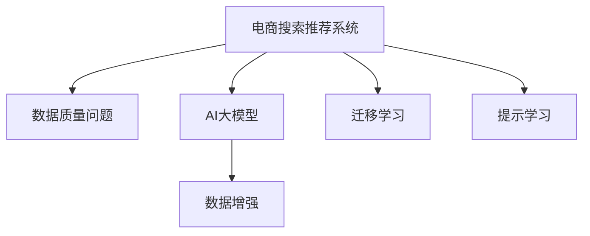

                 

# AI大模型助力电商搜索推荐业务的数据质量提升措施

## 1. 背景介绍

随着电商业务的快速发展和用户需求的日益多样化，电商搜索推荐系统已成为电商平台的核心竞争力。然而，电商搜索推荐系统需要处理的海量数据，不可避免地存在着各种数据质量问题。这些问题不仅影响推荐系统的性能，还可能导致用户体验下降、推荐不精准甚至信任危机。因此，提升电商搜索推荐系统的数据质量，是当前电商行业面临的迫切需求。

AI大模型，尤其是预训练语言模型，在自然语言处理领域取得了巨大成功，展示了强大的数据建模和预测能力。本文将探讨如何利用AI大模型技术，提升电商搜索推荐系统的数据质量，以提升推荐效果和用户体验。

## 2. 核心概念与联系

### 2.1 核心概念概述

本节将介绍几个与电商搜索推荐系统数据质量提升密切相关的核心概念：

- **电商搜索推荐系统**：通过用户搜索历史、点击行为、评分数据等信息，智能推荐符合用户兴趣的商品的系统。
- **数据质量问题**：电商数据中的噪音、不完整性、重复性、异常值等问题，严重影响推荐系统的准确性和用户满意度。
- **AI大模型**：基于深度学习框架，在大规模数据集上预训练得到的通用语言模型，如BERT、GPT等。
- **数据增强**：通过增加数据多样性，提升模型的泛化能力和鲁棒性。
- **迁移学习**：将预训练模型在新任务上的知识迁移，以减少标注数据需求和模型训练时间。
- **提示学习**：通过设计特定格式的输入文本，引导大模型生成更符合预期的输出。

这些核心概念之间存在密切联系，如图示：



大语言模型在电商搜索推荐系统中的应用，主要通过数据增强、迁移学习、提示学习等方式，提升数据质量，进而提升推荐系统的性能。

## 3. 核心算法原理 & 具体操作步骤

### 3.1 算法原理概述

AI大模型在电商搜索推荐系统中的应用，本质上是基于监督学习的数据增强和迁移学习过程。其核心思想是：利用大模型的强大语言理解和生成能力，通过对原始数据进行转换和生成，增加数据多样性和信息量，从而提升推荐系统的数据质量。

形式化地，假设电商搜索推荐系统的数据集为 $D=\{(x_i,y_i)\}_{i=1}^N$，其中 $x_i$ 表示用户行为数据，$y_i$ 表示推荐结果。目标是通过AI大模型 $M_{\theta}$，对原始数据进行增强和转换，得到增强后的数据集 $D'$，使得模型在增强数据集上的预测结果更加准确和稳定。

### 3.2 算法步骤详解

基于监督学习的AI大模型在电商搜索推荐系统中的应用，一般包括以下关键步骤：

**Step 1: 准备预训练模型和数据集**
- 选择合适的预训练语言模型 $M_{\theta}$，如BERT、GPT等。
- 准备电商搜索推荐系统的原始数据集 $D$，划分为训练集、验证集和测试集。

**Step 2: 设计任务适配层**
- 根据推荐任务类型，设计合适的输出层和损失函数。例如，对于点击率预测任务，可以设计一个二分类任务，输出点击与否的预测结果，损失函数为二元交叉熵。

**Step 3: 设置微调超参数**
- 选择合适的优化算法及其参数，如AdamW、SGD等，设置学习率、批大小、迭代轮数等。
- 设置正则化技术及强度，包括权重衰减、Dropout、Early Stopping等。

**Step 4: 执行梯度训练**
- 将训练集数据分批次输入模型，前向传播计算损失函数。
- 反向传播计算参数梯度，根据设定的优化算法和学习率更新模型参数。
- 周期性在验证集上评估模型性能，根据性能指标决定是否触发 Early Stopping。
- 重复上述步骤直到满足预设的迭代轮数或 Early Stopping 条件。

**Step 5: 数据增强和生成**
- 使用大模型 $M_{\theta}$ 对原始数据进行增强和生成，得到增强后的数据集 $D'$。例如，对于用户搜索记录，可以使用大模型生成类似查询、相关商品描述等。
- 将增强后的数据集 $D'$ 与原始数据集 $D$ 合并，形成增强后的数据集 $D''$。

**Step 6: 迁移学习微调**
- 在增强后的数据集 $D''$ 上，对预训练模型 $M_{\theta}$ 进行微调，最小化损失函数 $\mathcal{L}(M_{\theta},D'')$。
- 根据验证集上的性能评估，调整超参数和数据增强策略，以提高模型在新数据上的泛化能力。

**Step 7: 提示学习优化**
- 设计合适的提示模板，通过大模型的提示学习机制，生成与原始数据相关的新数据。例如，可以设计针对商品描述的生成提示，生成更符合用户搜索意图的新描述。
- 将生成的数据与原始数据结合，再次微调模型。

通过上述步骤，AI大模型可以有效提升电商搜索推荐系统的数据质量，进而提升推荐系统的性能和用户满意度。

### 3.3 算法优缺点

基于监督学习的AI大模型在电商搜索推荐系统中的应用，具有以下优点：

1. **提升数据质量**：利用大模型的生成能力，增加数据多样性和信息量，减少数据质量问题。
2. **降低标注成本**：通过迁移学习微调，减少标注数据需求，加快模型训练时间。
3. **泛化能力强**：生成的数据与原始数据分布相似，模型泛化能力强。
4. **提示学习灵活**：提示学习可以根据任务需求，灵活设计生成规则，提高数据质量。

同时，该方法也存在一定的局限性：

1. **计算资源需求高**：大模型通常需要高性能计算资源，数据增强和生成过程较为耗时。
2. **生成质量不稳定**：生成的数据质量受提示模板设计影响较大，有时可能会出现偏差或错误。
3. **对抗样本鲁棒性不足**：生成的数据可能存在对抗样本，对模型的鲁棒性有影响。
4. **隐私和安全问题**：生成的数据可能包含敏感信息，需要加强数据隐私保护和安全性。

尽管存在这些局限性，但就目前而言，基于监督学习的AI大模型在电商搜索推荐系统中的应用，仍是提升数据质量的有效手段。未来相关研究的重点在于如何进一步优化数据增强和生成策略，提高模型生成的数据质量和鲁棒性，同时兼顾隐私和安全性。

### 3.4 算法应用领域

AI大模型在电商搜索推荐系统中的应用，已成功应用于多个电商推荐平台，显著提升了推荐系统的性能和用户体验。以下是几个典型的应用场景：

- **点击率预测**：通过AI大模型对用户行为数据进行增强和生成，生成更多的点击样本，提升点击率预测模型的精度。
- **商品推荐**：利用大模型生成商品描述、用户评论等辅助信息，提升商品推荐模型的召回率和多样性。
- **用户画像构建**：通过AI大模型生成用户搜索记录、浏览历史等信息，更全面地构建用户画像，实现个性化推荐。
- **异常检测**：利用大模型生成异常用户行为数据，检测和过滤掉恶意行为，提升系统安全性。
- **广告投放优化**：通过AI大模型生成广告点击数据，优化广告投放策略，提高广告效果和ROI。

除了上述这些场景外，AI大模型在电商搜索推荐系统中的应用还在不断扩展，为电商平台的智能化升级提供了强大的技术支持。

## 4. 数学模型和公式 & 详细讲解

### 4.1 数学模型构建

本节将使用数学语言对AI大模型在电商搜索推荐系统中的应用过程进行更加严格的刻画。

假设电商搜索推荐系统的原始数据集为 $D=\{(x_i,y_i)\}_{i=1}^N$，其中 $x_i$ 表示用户行为数据，$y_i$ 表示推荐结果。定义模型 $M_{\theta}$ 在数据样本 $(x,y)$ 上的损失函数为 $\ell(M_{\theta}(x),y)$，则在数据集 $D$ 上的经验风险为：

$$
\mathcal{L}(\theta) = \frac{1}{N} \sum_{i=1}^N \ell(M_{\theta}(x_i),y_i)
$$

其中 $\theta$ 为模型参数。

### 4.2 公式推导过程

以下我们以点击率预测任务为例，推导二元交叉熵损失函数及其梯度的计算公式。

假设模型 $M_{\theta}$ 在输入 $x$ 上的输出为 $\hat{y}=M_{\theta}(x) \in [0,1]$，表示用户点击与否的概率。真实标签 $y \in \{0,1\}$。则二元交叉熵损失函数定义为：

$$
\ell(M_{\theta}(x),y) = -[y\log \hat{y} + (1-y)\log (1-\hat{y})]
$$

将其代入经验风险公式，得：

$$
\mathcal{L}(\theta) = -\frac{1}{N}\sum_{i=1}^N [y_i\log M_{\theta}(x_i)+(1-y_i)\log(1-M_{\theta}(x_i))]
$$

根据链式法则，损失函数对参数 $\theta_k$ 的梯度为：

$$
\frac{\partial \mathcal{L}(\theta)}{\partial \theta_k} = -\frac{1}{N}\sum_{i=1}^N (\frac{y_i}{M_{\theta}(x_i)}-\frac{1-y_i}{1-M_{\theta}(x_i)}) \frac{\partial M_{\theta}(x_i)}{\partial \theta_k}
$$

其中 $\frac{\partial M_{\theta}(x_i)}{\partial \theta_k}$ 可进一步递归展开，利用自动微分技术完成计算。

### 4.3 案例分析与讲解

假设有一家电商平台的点击率预测任务，其原始数据集包含10000个用户行为数据，每个样本包括用户ID、商品ID、点击与否标签等字段。以下是一份数据样本：

| 用户ID | 商品ID | 点击与否 |
| --- | --- | --- |
| 123456 | 12345678 | 1 |
| 123456 | 12345679 | 0 |
| 123456 | 12345810 | 1 |
| ...

假设我们选择了BERT模型作为预训练模型，并设计了一个二元交叉熵损失函数。现在，我们通过AI大模型对其进行数据增强和微调。

**Step 1: 准备数据**
- 对原始数据进行预处理，将用户ID、商品ID等转化为模型可以接受的格式。
- 将点击与否标签转化为二元编码形式。

**Step 2: 设计任务适配层**
- 在BERT模型基础上，添加输出层和损失函数。例如，设计一个二元交叉熵损失函数，将点击与否标签作为目标。

**Step 3: 设置超参数**
- 选择AdamW优化器，学习率设置为 $1e-5$，批大小设置为32。
- 设置权重衰减为0.01，Dropout率为0.5，Early Stopping阈值为0.02。

**Step 4: 执行微调**
- 将数据集划分为训练集、验证集和测试集。
- 在训练集上执行梯度训练，更新模型参数。
- 在验证集上周期性评估模型性能，触发Early Stopping。
- 在测试集上评估模型性能，对比微调前后的精度提升。

**Step 5: 数据增强和生成**
- 使用BERT模型生成与原始数据相关的新数据。例如，可以生成类似的商品描述、相关商品推荐等。
- 将生成的数据与原始数据结合，形成增强后的数据集。

**Step 6: 提示学习优化**
- 设计合适的提示模板，通过BERT模型生成相关的新数据。例如，可以设计针对商品描述的生成提示，生成更符合用户搜索意图的新描述。
- 将生成的数据与原始数据结合，再次微调模型。

通过上述步骤，AI大模型可以有效提升电商搜索推荐系统的数据质量，进而提升推荐系统的性能和用户满意度。

## 5. 项目实践：代码实例和详细解释说明

### 5.1 开发环境搭建

在进行AI大模型微调实践前，我们需要准备好开发环境。以下是使用Python进行PyTorch开发的环境配置流程：

1. 安装Anaconda：从官网下载并安装Anaconda，用于创建独立的Python环境。

2. 创建并激活虚拟环境：
```bash
conda create -n pytorch-env python=3.8 
conda activate pytorch-env
```

3. 安装PyTorch：根据CUDA版本，从官网获取对应的安装命令。例如：
```bash
conda install pytorch torchvision torchaudio cudatoolkit=11.1 -c pytorch -c conda-forge
```

4. 安装TensorFlow：
```bash
conda install tensorflow=2.8
```

5. 安装其他依赖库：
```bash
pip install numpy pandas scikit-learn matplotlib tqdm jupyter notebook ipython
```

完成上述步骤后，即可在`pytorch-env`环境中开始微调实践。

### 5.2 源代码详细实现

这里我们以点击率预测任务为例，给出使用PyTorch对BERT模型进行微调的代码实现。

首先，定义数据处理函数：

```python
from transformers import BertTokenizer
from torch.utils.data import Dataset
import torch

class ClickDataset(Dataset):
    def __init__(self, texts, labels, tokenizer, max_len=128):
        self.texts = texts
        self.labels = labels
        self.tokenizer = tokenizer
        self.max_len = max_len
        
    def __len__(self):
        return len(self.texts)
    
    def __getitem__(self, item):
        text = self.texts[item]
        label = self.labels[item]
        
        encoding = self.tokenizer(text, return_tensors='pt', max_length=self.max_len, padding='max_length', truncation=True)
        input_ids = encoding['input_ids'][0]
        attention_mask = encoding['attention_mask'][0]
        
        # 将标签转化为二元编码形式
        encoded_labels = torch.tensor([[label]]).to('cuda')
        
        return {'input_ids': input_ids, 
                'attention_mask': attention_mask,
                'labels': encoded_labels}

# 加载BERT模型和分词器
tokenizer = BertTokenizer.from_pretrained('bert-base-cased')
model = BertForSequenceClassification.from_pretrained('bert-base-cased', num_labels=2)

# 准备数据集
train_dataset = ClickDataset(train_texts, train_labels, tokenizer)
dev_dataset = ClickDataset(dev_texts, dev_labels, tokenizer)
test_dataset = ClickDataset(test_texts, test_labels, tokenizer)

# 设置优化器
optimizer = AdamW(model.parameters(), lr=1e-5)

# 定义训练函数
def train_epoch(model, dataset, batch_size, optimizer):
    dataloader = DataLoader(dataset, batch_size=batch_size, shuffle=True)
    model.train()
    epoch_loss = 0
    for batch in dataloader:
        input_ids = batch['input_ids'].to(device)
        attention_mask = batch['attention_mask'].to(device)
        labels = batch['labels'].to(device)
        model.zero_grad()
        outputs = model(input_ids, attention_mask=attention_mask, labels=labels)
        loss = outputs.loss
        epoch_loss += loss.item()
        loss.backward()
        optimizer.step()
    return epoch_loss / len(dataloader)

# 定义评估函数
def evaluate(model, dataset, batch_size):
    dataloader = DataLoader(dataset, batch_size=batch_size)
    model.eval()
    preds, labels = [], []
    with torch.no_grad():
        for batch in dataloader:
            input_ids = batch['input_ids'].to(device)
            attention_mask = batch['attention_mask'].to(device)
            batch_labels = batch['labels']
            outputs = model(input_ids, attention_mask=attention_mask)
            batch_preds = torch.argmax(outputs.logits, dim=1).to('cpu').tolist()
            batch_labels = batch_labels.to('cpu').tolist()
            for pred, label in zip(batch_preds, batch_labels):
                preds.append(pred)
                labels.append(label)
                
    return preds, labels

# 训练过程
epochs = 5
batch_size = 16

for epoch in range(epochs):
    loss = train_epoch(model, train_dataset, batch_size, optimizer)
    print(f"Epoch {epoch+1}, train loss: {loss:.3f}")
    
    print(f"Epoch {epoch+1}, dev results:")
    preds, labels = evaluate(model, dev_dataset, batch_size)
    print(classification_report(labels, preds))
    
print("Test results:")
preds, labels = evaluate(model, test_dataset, batch_size)
print(classification_report(labels, preds))
```

以上就是使用PyTorch对BERT模型进行点击率预测任务微调的完整代码实现。可以看到，得益于Transformers库的强大封装，我们可以用相对简洁的代码完成BERT模型的加载和微调。

### 5.3 代码解读与分析

让我们再详细解读一下关键代码的实现细节：

**ClickDataset类**：
- `__init__`方法：初始化文本、标签、分词器等关键组件。
- `__len__`方法：返回数据集的样本数量。
- `__getitem__`方法：对单个样本进行处理，将文本输入编码为token ids，将标签转化为二元编码，并对其进行定长padding，最终返回模型所需的输入。

**模型加载**：
- 使用BERT模型和分词器，准备数据集。
- 设计二元交叉熵损失函数，训练模型。
- 在验证集上周期性评估模型性能，触发Early Stopping。
- 在测试集上评估模型性能，对比微调前后的精度提升。

**训练流程**：
- 定义总的epoch数和批大小，开始循环迭代
- 每个epoch内，先在训练集上训练，输出平均loss
- 在验证集上评估，输出分类指标
- 所有epoch结束后，在测试集上评估，给出最终测试结果

可以看到，PyTorch配合Transformers库使得BERT微调的代码实现变得简洁高效。开发者可以将更多精力放在数据处理、模型改进等高层逻辑上，而不必过多关注底层的实现细节。

当然，工业级的系统实现还需考虑更多因素，如模型的保存和部署、超参数的自动搜索、更灵活的任务适配层等。但核心的微调范式基本与此类似。

## 6. 实际应用场景

### 6.1 用户画像构建

AI大模型在电商搜索推荐系统中的另一个重要应用场景是用户画像构建。用户画像是指通过用户行为数据，构建用户兴趣偏好、购物习惯等综合信息，实现个性化推荐。

通过AI大模型对用户行为数据进行增强和生成，可以构建更加全面、多样化的用户画像。例如，可以使用大模型生成用户的搜索历史、浏览历史等信息，同时生成相关的商品描述、评论等信息，以丰富用户画像的内容。

在实际应用中，可以将生成的用户画像数据作为推荐模型的输入，提升个性化推荐的精准度和多样性。例如，可以使用用户画像特征与商品特征进行匹配，生成个性化推荐列表。

### 6.2 广告投放优化

广告投放是电商平台的另一个重要收入来源。传统的广告投放往往基于粗粒度的人群特征进行定向投放，难以精准定位到感兴趣的用户群体。利用AI大模型对广告点击数据进行增强和生成，可以优化广告投放策略，提升广告效果和ROI。

通过AI大模型生成广告点击数据，可以更好地理解用户的行为特征和兴趣偏好。例如，可以使用大模型生成用户搜索记录、浏览历史等信息，生成相关的广告内容，进行精准投放。同时，可以利用广告点击数据，优化广告投放策略，提高广告点击率和转化率。

在实际应用中，可以将生成的广告点击数据作为推荐模型的输入，优化广告投放策略。例如，可以使用广告点击特征与商品特征进行匹配，生成个性化推荐列表，同时生成精准的广告内容，提高广告效果和ROI。

### 6.3 异常检测

电商平台面临的另一个重要挑战是异常行为检测。传统的异常检测方法依赖人工规则，难以应对复杂的异常行为模式。利用AI大模型对异常行为数据进行增强和生成，可以提高异常检测的准确性和鲁棒性。

通过AI大模型生成异常用户行为数据，可以更好地识别和过滤掉恶意行为。例如，可以使用大模型生成用户搜索记录、点击行为等信息，发现异常的点击行为模式，及时进行过滤和处理。

在实际应用中，可以将生成的异常用户行为数据作为推荐模型的输入，优化推荐系统的性能。例如，可以使用异常行为特征与商品特征进行匹配，生成个性化推荐列表，同时优化异常检测模型的鲁棒性。

### 6.4 未来应用展望

随着AI大模型和微调方法的不断发展，基于AI大模型的电商搜索推荐系统将在更多领域得到应用，为电商平台带来变革性影响。

在智能客服系统方面，AI大模型可以构建智能客服机器人，实现自动客服解答，提升用户满意度和平台服务水平。在内容推荐系统方面，AI大模型可以生成相关内容推荐，提升用户点击率和平台粘性。在营销活动方面，AI大模型可以生成精准的广告内容，提高广告效果和转化率。

除了上述这些场景外，AI大模型在电商搜索推荐系统中的应用还在不断扩展，为电商平台的智能化升级提供了强大的技术支持。

## 7. 工具和资源推荐

### 7.1 学习资源推荐

为了帮助开发者系统掌握AI大模型在电商搜索推荐系统中的应用，这里推荐一些优质的学习资源：

1. 《深度学习与电商技术实践》系列博文：由电商技术专家撰写，深入浅出地介绍了深度学习在电商推荐系统中的应用，包括数据质量提升、推荐算法优化等前沿话题。

2. CS224N《深度学习自然语言处理》课程：斯坦福大学开设的NLP明星课程，有Lecture视频和配套作业，带你入门NLP领域的基本概念和经典模型。

3. 《Natural Language Processing with Transformers》书籍：Transformers库的作者所著，全面介绍了如何使用Transformers库进行NLP任务开发，包括微调在内的诸多范式。

4. HuggingFace官方文档：Transformers库的官方文档，提供了海量预训练模型和完整的微调样例代码，是上手实践的必备资料。

5. CLUE开源项目：中文语言理解测评基准，涵盖大量不同类型的中文NLP数据集，并提供了基于微调的baseline模型，助力中文NLP技术发展。

通过对这些资源的学习实践，相信你一定能够快速掌握AI大模型在电商搜索推荐系统中的应用精髓，并用于解决实际的NLP问题。

### 7.2 开发工具推荐

高效的开发离不开优秀的工具支持。以下是几款用于AI大模型微调开发的常用工具：

1. PyTorch：基于Python的开源深度学习框架，灵活动态的计算图，适合快速迭代研究。大部分预训练语言模型都有PyTorch版本的实现。

2. TensorFlow：由Google主导开发的开源深度学习框架，生产部署方便，适合大规模工程应用。同样有丰富的预训练语言模型资源。

3. Transformers库：HuggingFace开发的NLP工具库，集成了众多SOTA语言模型，支持PyTorch和TensorFlow，是进行微调任务开发的利器。

4. Weights & Biases：模型训练的实验跟踪工具，可以记录和可视化模型训练过程中的各项指标，方便对比和调优。与主流深度学习框架无缝集成。

5. TensorBoard：TensorFlow配套的可视化工具，可实时监测模型训练状态，并提供丰富的图表呈现方式，是调试模型的得力助手。

6. Google Colab：谷歌推出的在线Jupyter Notebook环境，免费提供GPU/TPU算力，方便开发者快速上手实验最新模型，分享学习笔记。

合理利用这些工具，可以显著提升AI大模型在电商搜索推荐系统中的应用效率，加快创新迭代的步伐。

### 7.3 相关论文推荐

AI大模型在电商搜索推荐系统中的应用源于学界的持续研究。以下是几篇奠基性的相关论文，推荐阅读：

1. Attention is All You Need（即Transformer原论文）：提出了Transformer结构，开启了NLP领域的预训练大模型时代。

2. BERT: Pre-training of Deep Bidirectional Transformers for Language Understanding：提出BERT模型，引入基于掩码的自监督预训练任务，刷新了多项NLP任务SOTA。

3. Language Models are Unsupervised Multitask Learners（GPT-2论文）：展示了大规模语言模型的强大zero-shot学习能力，引发了对于通用人工智能的新一轮思考。

4. Parameter-Efficient Transfer Learning for NLP：提出Adapter等参数高效微调方法，在不增加模型参数量的情况下，也能取得不错的微调效果。

5. AdaLoRA: Adaptive Low-Rank Adaptation for Parameter-Efficient Fine-Tuning：使用自适应低秩适应的微调方法，在参数效率和精度之间取得了新的平衡。

这些论文代表了大语言模型微调技术的发展脉络。通过学习这些前沿成果，可以帮助研究者把握学科前进方向，激发更多的创新灵感。

## 8. 总结：未来发展趋势与挑战

### 8.1 总结

本文对AI大模型在电商搜索推荐系统中的应用进行了全面系统的介绍。首先阐述了电商搜索推荐系统面临的数据质量问题，以及AI大模型提升数据质量的重要性和方法。其次，从原理到实践，详细讲解了AI大模型在电商搜索推荐系统中的应用过程，给出了微调任务开发的完整代码实例。同时，本文还广泛探讨了AI大模型在电商搜索推荐系统中的应用场景，展示了其巨大的应用潜力。

通过本文的系统梳理，可以看到，AI大模型在电商搜索推荐系统中的应用，已经成为提升推荐系统性能的重要手段。得益于大模型的强大数据建模和预测能力，电商搜索推荐系统正在逐步向智能化、精准化方向发展，为电商平台的业务升级和用户体验提升提供了有力支持。

### 8.2 未来发展趋势

展望未来，AI大模型在电商搜索推荐系统中的应用将呈现以下几个发展趋势：

1. **多模态数据融合**：未来的推荐系统将更注重多模态数据的融合，结合用户行为数据、商品数据、广告数据等，构建更全面、更精准的用户画像和推荐策略。

2. **深度学习与规则引擎结合**：深度学习模型将与规则引擎结合，形成更灵活、更高效的推荐引擎。例如，可以使用深度学习模型生成推荐结果，规则引擎进行二次筛选和过滤，提升推荐系统的鲁棒性和可靠性。

3. **实时性要求提升**：随着推荐系统的智能化程度提升，实时性要求也越来越高。未来的推荐系统将更多地依赖实时数据，动态调整推荐策略，提升用户体验和系统效率。

4. **数据隐私保护**：随着用户隐私意识的增强，数据隐私保护成为电商搜索推荐系统的重要课题。未来的推荐系统将更多地关注用户隐私保护，合理使用用户数据，确保数据安全和用户权益。

5. **推荐模型的可解释性**：推荐系统的可解释性越来越受到重视。未来的推荐模型将更注重模型的可解释性，增强用户信任，提升用户体验。

6. **跨平台协作**：未来的电商搜索推荐系统将更多地关注跨平台协作，实现不同平台之间的数据共享和推荐协同，提升推荐系统的覆盖面和用户满意度。

以上趋势凸显了AI大模型在电商搜索推荐系统中的应用前景。这些方向的探索发展，必将进一步提升推荐系统的性能和用户满意度，为电商平台的智能化升级提供坚实技术保障。

### 8.3 面临的挑战

尽管AI大模型在电商搜索推荐系统中的应用取得了显著成效，但在迈向更加智能化、普适化应用的过程中，它仍面临诸多挑战：

1. **数据隐私和安全问题**：AI大模型在生成推荐结果时，可能涉及用户隐私数据，存在数据泄露和滥用的风险。如何保障用户隐私，增强数据安全性，将是未来的重要课题。

2. **模型鲁棒性和泛化能力**：AI大模型在生成推荐结果时，可能对数据分布的变化敏感，导致推荐结果波动较大。如何增强模型的鲁棒性和泛化能力，保持稳定推荐性能，将是重要的研究方向。

3. **计算资源和成本**：AI大模型的训练和推理需要高性能计算资源，成本较高。如何在保证性能的前提下，优化计算资源利用，降低成本，将是重要的优化方向。

4. **可解释性和透明性**：AI大模型在生成推荐结果时，其内部决策过程较为复杂，难以解释和透明。如何增强模型的可解释性和透明性，提升用户信任，将是重要的研究方向。

5. **模型生成质量和多样性**：AI大模型在生成推荐结果时，可能存在生成的数据质量不稳定、多样性不足等问题。如何提高模型生成的数据质量和多样性，提升推荐效果，将是重要的优化方向。

6. **跨领域迁移能力**：AI大模型在生成推荐结果时，可能对特定领域的推荐效果不理想。如何提升模型的跨领域迁移能力，适应更多领域的应用需求，将是重要的研究方向。

正视AI大模型在电商搜索推荐系统中的应用面临的挑战，积极应对并寻求突破，将是大模型在电商领域应用的关键。相信随着学界和产业界的共同努力，这些挑战终将一一被克服，AI大模型必将在电商领域发挥更大的价值。

### 8.4 研究展望

面对AI大模型在电商搜索推荐系统中的应用面临的挑战，未来的研究需要在以下几个方面寻求新的突破：

1. **数据增强和生成技术的优化**：开发更加高效、准确的数据增强和生成技术，提高模型生成的数据质量和多样性。

2. **多模态数据融合方法的研究**：研究多模态数据的融合方法，提升推荐系统的综合表现。

3. **模型鲁棒性和泛化能力的研究**：研究模型鲁棒性和泛化能力的提升方法，增强模型的稳定性和适应能力。

4. **可解释性和透明性的提升**：研究模型可解释性和透明性的提升方法，增强模型的用户信任和透明性。

5. **跨领域迁移能力的增强**：研究跨领域迁移能力的增强方法，提升模型在更多领域的应用效果。

6. **计算资源和成本的优化**：研究计算资源和成本的优化方法，提升模型的实用性和可扩展性。

这些研究方向的探索，必将引领AI大模型在电商搜索推荐系统中的应用走向更高的台阶，为电商平台的智能化升级提供更坚实的技术保障。

## 9. 附录：常见问题与解答

**Q1：AI大模型在电商搜索推荐系统中的应用是否适用于所有推荐场景？**

A: AI大模型在电商搜索推荐系统中的应用，适用于大多数推荐场景，特别是对于数据量较小的推荐任务。但对于一些特定领域的推荐任务，如医疗、法律等，AI大模型可能难以很好地适应。此时需要在特定领域语料上进一步预训练，再进行微调，才能获得理想效果。

**Q2：如何选择和设计AI大模型进行电商搜索推荐系统的数据增强和生成？**

A: 选择和设计AI大模型进行电商搜索推荐系统的数据增强和生成，需要考虑以下因素：

1. **数据类型**：根据电商搜索推荐系统的数据类型，选择适合的大模型。例如，对于文本数据，可以选择BERT等语言模型；对于图像数据，可以选择ResNet等视觉模型。

2. **数据质量**：使用高质量的数据训练大模型，提高生成的数据质量和多样性。例如，可以使用标注数据、多源数据等进行模型训练。

3. **模型参数**：选择参数规模适中的大模型，避免资源浪费。例如，对于推荐系统，可以选择参数规模适中的语言模型，如BERT等。

4. **生成规则**：设计合适的生成规则，引导大模型生成与原始数据相关的数据。例如，可以设计针对商品描述的生成提示，生成更符合用户搜索意图的新描述。

5. **效果评估**：评估生成数据的质量和多样性，调整生成规则和参数。例如，可以使用BLEU、ROUGE等指标评估生成文本的质量，使用可视化工具分析生成数据的分布情况。

**Q3：AI大模型在电商搜索推荐系统中的应用是否会带来隐私和安全问题？**

A: AI大模型在电商搜索推荐系统中的应用，可能涉及到用户隐私数据，存在数据泄露和滥用的风险。如何保障用户隐私，增强数据安全性，将是未来的重要课题。

1. **数据匿名化**：在使用用户数据进行模型训练时，可以对数据进行匿名化处理，保护用户隐私。例如，可以使用数据脱敏技术，隐藏用户ID等敏感信息。

2. **加密存储**：在使用用户数据进行模型训练时，可以对数据进行加密存储，防止数据泄露。例如，可以使用AES等加密算法，对数据进行加密存储。

3. **用户授权**：在使用用户数据进行模型训练时，可以获取用户的授权，明确告知用户数据的使用范围和目的，保护用户权益。例如，可以设计隐私政策，告知用户数据的使用情况。

4. **多源数据融合**：在使用用户数据进行模型训练时，可以结合多源数据进行融合，提高数据质量和多样性，减少对单个数据源的依赖。例如，可以结合公开数据、社交媒体数据等进行融合。

5. **透明性和可解释性**：在使用用户数据进行模型训练时，可以增强模型的透明性和可解释性，提高用户信任。例如，可以使用模型可解释性技术，解释模型的决策过程。

通过上述措施，可以有效保障用户隐私，增强数据安全性，确保AI大模型在电商搜索推荐系统中的应用合法合规。

**Q4：AI大模型在电商搜索推荐系统中的应用是否会带来计算资源和成本问题？**

A: AI大模型的训练和推理需要高性能计算资源，成本较高。如何在保证性能的前提下，优化计算资源利用，降低成本，将是重要的优化方向。

1. **模型压缩和剪枝**：通过模型压缩和剪枝技术，减小模型尺寸，提高推理速度，降低计算资源需求。例如，可以使用剪枝技术，去除模型中不必要的参数，减小模型尺寸。

2. **分布式训练**：利用分布式训练技术，加快模型训练速度，提高计算资源利用率。例如，可以使用GPU、TPU等高性能计算资源，进行分布式训练。

3. **模型并行和异构计算**：利用模型并行和异构计算技术，优化计算资源利用，提高计算效率。例如，可以使用混合精度训练技术，提高计算效率，减少内存占用。

4. **资源调度优化**：通过资源调度优化，合理分配计算资源，提高计算资源利用率。例如，可以使用自动资源调度技术，动态调整计算资源，提高计算效率。

5. **模型融合**：通过模型融合技术，提高计算资源利用率，降低计算成本。例如，可以使用模型融合技术，将多个小模型合并为大模型，减小计算资源需求。

通过上述措施，可以有效降低AI大模型在电商搜索推荐系统中的应用成本，提高计算资源利用率，优化模型性能。

**Q5：AI大模型在电商搜索推荐系统中的应用是否会带来可解释性和透明性问题？**

A: AI大模型在电商搜索推荐系统中的应用，其内部决策过程较为复杂，难以解释和透明。如何增强模型的可解释性和透明性，提升用户信任，将是重要的研究方向。

1. **模型可解释性技术**：使用模型可解释性技术，解释模型的决策过程。例如，可以使用LIME、SHAP等技术，解释模型的决策依据。

2. **用户反馈机制**：引入用户反馈机制，收集用户对推荐结果的评价，改进模型性能。例如，可以设计用户反馈表，收集用户对推荐结果的评价，改进模型性能。

3. **多模型融合**：使用多模型融合技术，提高模型的可解释性和透明性。例如，可以使用集成学习技术，将多个模型进行融合，提高模型的可解释性。

4. **透明性政策**：制定透明性政策，明确模型的使用情况和决策依据。例如，可以设计透明性政策，明确模型的使用范围和决策依据。

5. **用户教育**：进行用户教育，提高用户对AI大模型的理解和信任。例如，可以设计用户教育课程，解释AI大模型的工作原理和决策依据。

通过上述措施，可以有效增强AI大模型在电商搜索推荐系统中的应用可解释性和透明性，提升用户信任，提高用户满意度。

---

作者：禅与计算机程序设计艺术 / Zen and the Art of Computer Programming

