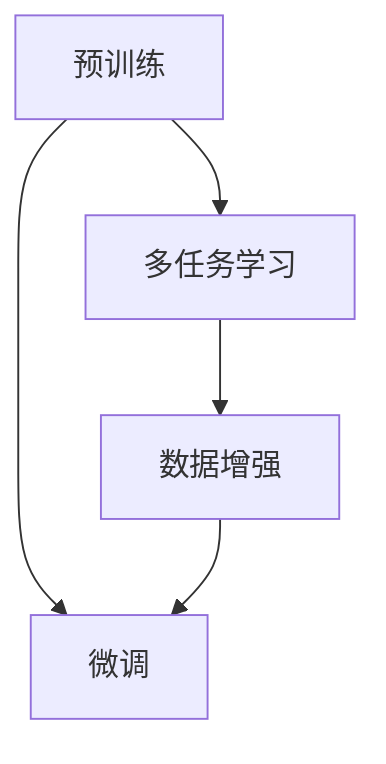

                 

# AI大模型在商品属性抽取中的应用

> 关键词：商品属性抽取,大语言模型,自然语言处理,NLP,微调,Fine-Tuning

## 1. 背景介绍

### 1.1 问题由来

在当今电商和零售领域，商品属性抽取成为了一个重要的基础任务。商品属性包括名称、描述、价格、类别等，对商品搜索、推荐、销售预测等业务流程至关重要。传统方法多采用手工规则或关键词匹配等方式进行属性抽取，但面临维数灾难、计算复杂度高、鲁棒性差等问题。

近年来，基于深度学习和大模型的方法在商品属性抽取领域取得了突破性进展。大模型如BERT、GPT-3等，具有强大的语言理解和生成能力，能够高效地从文本数据中提取出有价值的信息。通过微调技术，大模型可以更好地适应特定领域的任务，从而提升属性抽取的准确度和鲁棒性。

### 1.2 问题核心关键点

商品属性抽取的核心问题在于如何从商品标题、描述等文本数据中，自动识别出有代表性的属性，并将其标注到商品信息中。大模型通过预训练学习到了丰富的语言表示，可以辅助我们解决该问题。

主要关键点包括：

- 大模型的预训练：使用大规模无标签文本语料进行预训练，学习到通用的语言表示。
- 微调技术：基于预训练模型，使用少量有标签数据进行微调，提升在特定任务上的性能。
- 多任务学习：同时进行多个任务的属性抽取，提升整体性能和泛化能力。
- 数据增强：通过数据增强技术扩充训练集，提高模型的鲁棒性。

这些关键技术点构成了商品属性抽取的基础，使得大模型在文本信息抽取任务中能够发挥更大的作用。

### 1.3 问题研究意义

研究基于大模型的商品属性抽取方法，对于电商和零售领域的智能化升级，具有重要意义：

- 提高商品信息处理的自动化水平，减少人工干预，提升效率。
- 增强商品信息的准确性和全面性，改善用户体验。
- 促进电商推荐系统、库存管理等业务的精准化和个性化。
- 提升智能客服系统的响应准确度，增强客户满意度。
- 提供有价值的数据支持，帮助企业进行市场分析和决策支持。

## 2. 核心概念与联系

### 2.1 核心概念概述

为了更好地理解大模型在商品属性抽取中的应用，本节将介绍几个关键概念：

- 大语言模型(Large Language Model, LLM)：如BERT、GPT-3等，通过自监督学习任务训练，具备强大的语言理解能力。
- 预训练(Pre-training)：使用大规模无标签文本数据进行预训练，学习通用的语言表示。
- 微调(Fine-Tuning)：基于预训练模型，使用少量有标签数据进行微调，提升在特定任务上的性能。
- 多任务学习(Multi-task Learning, MTL)：同时进行多个相关任务的微调，提高模型的泛化能力。
- 数据增强(Data Augmentation)：通过改写、回译等方式扩充训练集，提升模型的鲁棒性。

这些概念通过以下Mermaid流程图进行展示，帮助理解它们之间的联系：



该流程图展示了预训练、微调、多任务学习、数据增强这四个核心概念之间的关系：

- 预训练是大模型学习通用语言表示的基础。
- 微调是基于预训练模型，针对特定任务进行优化。
- 多任务学习通过同时进行多个相关任务的微调，提升模型的整体泛化能力。
- 数据增强通过扩充训练集，提高模型的鲁棒性和泛化能力。

这些概念的有机结合，使得大模型在商品属性抽取等任务中表现出色。

## 3. 核心算法原理 & 具体操作步骤
### 3.1 算法原理概述

基于大模型的商品属性抽取方法，本质上是通过微调技术，将通用语言表示转化为特定任务的能力。其核心思想是：使用预训练模型作为初始化参数，通过有监督地训练来优化模型在商品属性抽取任务上的性能。

形式化地，假设预训练模型为 $M_{\theta}$，其中 $\theta$ 为预训练得到的模型参数。给定商品属性抽取任务的训练集 $D=\{(x_i, y_i)\}_{i=1}^N$，其中 $x_i$ 为商品描述文本，$y_i$ 为商品属性标签。微调的目标是找到新的模型参数 $\hat{\theta}$，使得模型能够准确抽取商品的属性。

微调的过程可以表示为：

$$
\hat{\theta}=\mathop{\arg\min}_{\theta} \mathcal{L}(M_{\theta},D)
$$

其中 $\mathcal{L}$ 为针对商品属性抽取任务的损失函数，用于衡量模型输出与真实标签之间的差异。常见的损失函数包括交叉熵损失、F1-Score等。

### 3.2 算法步骤详解

基于大模型的商品属性抽取流程如下：

**Step 1: 准备预训练模型和数据集**

- 选择适合的预训练模型，如BERT、GPT-3等。
- 收集商品属性抽取任务的标注数据集，划分为训练集、验证集和测试集。

**Step 2: 任务适配层设计**

- 设计商品属性抽取任务适配层。
- 对于分类任务，通常使用线性分类器和交叉熵损失函数。
- 对于生成任务，使用语言模型的解码器输出概率分布，并以负对数似然为损失函数。

**Step 3: 设置微调超参数**

- 选择合适的优化算法及其参数，如AdamW、SGD等。
- 设置学习率、批大小、迭代轮数等超参数。
- 设置正则化技术及强度，包括权重衰减、Dropout、Early Stopping等。

**Step 4: 执行梯度训练**

- 将训练集数据分批次输入模型，前向传播计算损失函数。
- 反向传播计算参数梯度，根据设定的优化算法和学习率更新模型参数。
- 周期性在验证集上评估模型性能，根据性能指标决定是否触发 Early Stopping。
- 重复上述步骤直到满足预设的迭代轮数或 Early Stopping 条件。

**Step 5: 测试和部署**

- 在测试集上评估微调后模型 $M_{\hat{\theta}}$ 的性能，对比微调前后的精度提升。
- 使用微调后的模型对新商品描述文本进行属性抽取，集成到实际的商品信息系统中。

### 3.3 算法优缺点

基于大模型的商品属性抽取方法具有以下优点：

1. **高效性**：预训练模型具备强大的语言表示能力，微调过程可以在少量标注数据下快速完成。
2. **泛化能力**：大模型通过预训练和微调，可以适应不同领域的商品属性抽取任务。
3. **稳定性**：大模型参数量巨大，微调时即使部分参数冻结，仍能有效提升模型性能。

同时，该方法也存在一些缺点：

1. **数据依赖**：微调效果受标注数据质量的影响较大，标注成本较高。
2. **计算资源需求高**：大规模预训练模型的计算和存储资源消耗较大，训练成本高。
3. **过拟合风险**：大模型参数量大，微调过程中容易发生过拟合。
4. **模型复杂度**：模型结构复杂，调试和维护难度较大。

尽管存在这些局限性，但基于大模型的商品属性抽取方法在实际应用中已经取得了显著效果，值得进一步研究和发展。

### 3.4 算法应用领域

基于大模型的商品属性抽取方法，已经在多个电商和零售领域得到广泛应用，例如：

- 商品搜索系统：自动提取商品标题、描述中的属性信息，提升搜索准确度。
- 推荐系统：根据商品属性信息，推荐相似商品，提升用户体验。
- 库存管理：自动提取商品信息中的关键属性，辅助库存盘点，提高效率。
- 智能客服：自动分析商品描述中的属性信息，快速响应客户咨询。
- 广告投放：自动提取商品属性，进行定向广告投放，提升广告效果。

此外，该方法还可以应用于商品分类、产品评价等更多场景中，为电商和零售业务的智能化升级提供技术支持。

## 4. 数学模型和公式 & 详细讲解 & 举例说明

### 4.1 数学模型构建

假设预训练模型为 $M_{\theta}$，商品属性抽取任务的数据集为 $D=\{(x_i, y_i)\}_{i=1}^N$，其中 $x_i$ 为商品描述文本，$y_i$ 为商品属性标签。微调的目标是最小化经验风险，即找到最优参数 $\theta^*$：

$$
\theta^* = \mathop{\arg\min}_{\theta} \mathcal{L}(M_{\theta},D)
$$

其中 $\mathcal{L}$ 为损失函数，可以表示为：

$$
\mathcal{L}(M_{\theta},D) = \frac{1}{N}\sum_{i=1}^N \ell(M_{\theta}(x_i),y_i)
$$

对于分类任务，常用的损失函数为交叉熵损失：

$$
\ell(M_{\theta}(x_i),y_i) = -y_i \log M_{\theta}(x_i) - (1-y_i) \log (1-M_{\theta}(x_i))
$$

其中 $M_{\theta}(x_i)$ 为模型在商品描述文本 $x_i$ 上的输出概率。

### 4.2 公式推导过程

以下以交叉熵损失为例，推导其计算公式：

假设预训练模型为 $M_{\theta}$，商品描述文本为 $x_i$，标签为 $y_i$。则模型在 $x_i$ 上的输出为 $M_{\theta}(x_i)$。交叉熵损失函数为：

$$
\ell(M_{\theta}(x_i),y_i) = -y_i \log M_{\theta}(x_i) - (1-y_i) \log (1-M_{\theta}(x_i))
$$

其梯度为：

$$
\frac{\partial \ell}{\partial \theta} = -y_i \frac{\partial M_{\theta}(x_i)}{\partial \theta} + (1-y_i) \frac{\partial M_{\theta}(x_i)}{\partial \theta}
$$

其中 $\frac{\partial M_{\theta}(x_i)}{\partial \theta}$ 可以通过反向传播计算得到。

### 4.3 案例分析与讲解

以商品分类任务为例，展示如何使用大模型进行微调：

1. 收集商品分类任务的数据集，划分为训练集、验证集和测试集。
2. 选择BERT模型作为预训练模型，进行微调。
3. 设计商品分类任务适配层，包括线性分类器、交叉熵损失函数等。
4. 设置微调超参数，如学习率、批大小等。
5. 执行梯度训练，进行微调。
6. 在测试集上评估微调后模型的分类准确度。

通过上述步骤，可以高效地实现商品分类任务的微调，提升模型的分类精度和泛化能力。

## 5. 项目实践：代码实例和详细解释说明
### 5.1 开发环境搭建

在进行商品属性抽取的微调实践前，需要先准备开发环境：

1. 安装Anaconda：从官网下载并安装Anaconda，用于创建独立的Python环境。

2. 创建并激活虚拟环境：
```bash
conda create -n pytorch-env python=3.8 
conda activate pytorch-env
```

3. 安装PyTorch：根据CUDA版本，从官网获取对应的安装命令。例如：
```bash
conda install pytorch torchvision torchaudio cudatoolkit=11.1 -c pytorch -c conda-forge
```

4. 安装Transformers库：
```bash
pip install transformers
```

5. 安装各类工具包：
```bash
pip install numpy pandas scikit-learn matplotlib tqdm jupyter notebook ipython
```

完成上述步骤后，即可在`pytorch-env`环境中开始微调实践。

### 5.2 源代码详细实现

下面我们以商品分类任务为例，给出使用Transformers库对BERT模型进行微调的PyTorch代码实现。

首先，定义商品分类任务的数据处理函数：

```python
from transformers import BertTokenizer
from torch.utils.data import Dataset
import torch

class ProductClassificationDataset(Dataset):
    def __init__(self, texts, labels, tokenizer, max_len=128):
        self.texts = texts
        self.labels = labels
        self.tokenizer = tokenizer
        self.max_len = max_len
        
    def __len__(self):
        return len(self.texts)
    
    def __getitem__(self, item):
        text = self.texts[item]
        label = self.labels[item]
        
        encoding = self.tokenizer(text, return_tensors='pt', max_length=self.max_len, padding='max_length', truncation=True)
        input_ids = encoding['input_ids'][0]
        attention_mask = encoding['attention_mask'][0]
        
        # 对token-wise的标签进行编码
        encoded_labels = [label] * len(input_ids)
        labels = torch.tensor(encoded_labels, dtype=torch.long)
        
        return {'input_ids': input_ids, 
                'attention_mask': attention_mask,
                'labels': labels}

# 标签与id的映射
label2id = {'0': 0, '1': 1, '2': 2, '3': 3, '4': 4, '5': 5}
id2label = {v: k for k, v in label2id.items()}

# 创建dataset
tokenizer = BertTokenizer.from_pretrained('bert-base-cased')

train_dataset = ProductClassificationDataset(train_texts, train_labels, tokenizer)
dev_dataset = ProductClassificationDataset(dev_texts, dev_labels, tokenizer)
test_dataset = ProductClassificationDataset(test_texts, test_labels, tokenizer)
```

然后，定义模型和优化器：

```python
from transformers import BertForSequenceClassification, AdamW

model = BertForSequenceClassification.from_pretrained('bert-base-cased', num_labels=len(label2id))

optimizer = AdamW(model.parameters(), lr=2e-5)
```

接着，定义训练和评估函数：

```python
from torch.utils.data import DataLoader
from tqdm import tqdm
from sklearn.metrics import classification_report

device = torch.device('cuda') if torch.cuda.is_available() else torch.device('cpu')
model.to(device)

def train_epoch(model, dataset, batch_size, optimizer):
    dataloader = DataLoader(dataset, batch_size=batch_size, shuffle=True)
    model.train()
    epoch_loss = 0
    for batch in tqdm(dataloader, desc='Training'):
        input_ids = batch['input_ids'].to(device)
        attention_mask = batch['attention_mask'].to(device)
        labels = batch['labels'].to(device)
        model.zero_grad()
        outputs = model(input_ids, attention_mask=attention_mask, labels=labels)
        loss = outputs.loss
        epoch_loss += loss.item()
        loss.backward()
        optimizer.step()
    return epoch_loss / len(dataloader)

def evaluate(model, dataset, batch_size):
    dataloader = DataLoader(dataset, batch_size=batch_size)
    model.eval()
    preds, labels = [], []
    with torch.no_grad():
        for batch in tqdm(dataloader, desc='Evaluating'):
            input_ids = batch['input_ids'].to(device)
            attention_mask = batch['attention_mask'].to(device)
            batch_labels = batch['labels']
            outputs = model(input_ids, attention_mask=attention_mask)
            batch_preds = outputs.logits.argmax(dim=2).to('cpu').tolist()
            batch_labels = batch_labels.to('cpu').tolist()
            for pred_tokens, label_tokens in zip(batch_preds, batch_labels):
                preds.append(pred_tokens[:len(label_tokens)])
                labels.append(label_tokens)
                
    print(classification_report(labels, preds))
```

最后，启动训练流程并在测试集上评估：

```python
epochs = 5
batch_size = 16

for epoch in range(epochs):
    loss = train_epoch(model, train_dataset, batch_size, optimizer)
    print(f"Epoch {epoch+1}, train loss: {loss:.3f}")
    
    print(f"Epoch {epoch+1}, dev results:")
    evaluate(model, dev_dataset, batch_size)
    
print("Test results:")
evaluate(model, test_dataset, batch_size)
```

以上就是使用PyTorch对BERT进行商品分类任务微调的完整代码实现。可以看到，得益于Transformers库的强大封装，我们可以用相对简洁的代码完成BERT模型的加载和微调。

### 5.3 代码解读与分析

让我们再详细解读一下关键代码的实现细节：

**ProductClassificationDataset类**：
- `__init__`方法：初始化文本、标签、分词器等关键组件。
- `__len__`方法：返回数据集的样本数量。
- `__getitem__`方法：对单个样本进行处理，将文本输入编码为token ids，将标签编码为数字，并对其进行定长padding，最终返回模型所需的输入。

**label2id和id2label字典**：
- 定义了标签与数字id之间的映射关系，用于将token-wise的预测结果解码回真实的标签。

**训练和评估函数**：
- 使用PyTorch的DataLoader对数据集进行批次化加载，供模型训练和推理使用。
- 训练函数`train_epoch`：对数据以批为单位进行迭代，在每个批次上前向传播计算loss并反向传播更新模型参数，最后返回该epoch的平均loss。
- 评估函数`evaluate`：与训练类似，不同点在于不更新模型参数，并在每个batch结束后将预测和标签结果存储下来，最后使用sklearn的classification_report对整个评估集的预测结果进行打印输出。

**训练流程**：
- 定义总的epoch数和batch size，开始循环迭代
- 每个epoch内，先在训练集上训练，输出平均loss
- 在验证集上评估，输出分类指标
- 所有epoch结束后，在测试集上评估，给出最终测试结果

可以看到，PyTorch配合Transformers库使得BERT微调的代码实现变得简洁高效。开发者可以将更多精力放在数据处理、模型改进等高层逻辑上，而不必过多关注底层的实现细节。

当然，工业级的系统实现还需考虑更多因素，如模型的保存和部署、超参数的自动搜索、更灵活的任务适配层等。但核心的微调范式基本与此类似。

## 6. 实际应用场景
### 6.1 智能推荐系统

商品属性抽取是大模型在推荐系统中的重要应用之一。基于属性信息的推荐，可以帮助用户更快地找到感兴趣的商品，提升推荐系统的个性化和精准度。

在技术实现上，可以收集用户的历史浏览、购买行为数据，通过商品属性抽取模型提取商品的关键属性，再结合用户的兴趣偏好进行推荐。微调后的属性抽取模型能够准确识别商品描述中的属性信息，辅助推荐系统进行个性化推荐，提高用户满意度和转化率。

### 6.2 商品监控与风险控制

电商平台上商品质量参差不齐，假冒伪劣商品时有出现。通过商品属性抽取技术，可以自动检测商品描述中的关键属性，识别出与真实商品不符的虚假描述。进一步结合评分、评论等信息，能够更全面地监控商品质量，及时发现和处理违规商品，保障用户权益。

### 6.3 品牌管理与营销推广

品牌商家可以通过商品属性抽取技术，自动抓取官网、电商平台上的商品信息，生成详细的商品清单，辅助进行库存管理和市场分析。同时，品牌可以在商品描述中插入关键属性信息，增强营销效果，吸引更多消费者关注和购买。

### 6.4 未来应用展望

随着大语言模型微调技术的不断发展，基于商品属性抽取的方法将在更多领域得到应用，为电商和零售业务的智能化升级提供技术支持。

在智慧物流领域，基于商品属性抽取的商品信息，可以用于智能仓储和配送规划，优化物流效率，降低成本。

在智能客服系统中，商品属性抽取技术可以辅助客服系统，自动理解用户需求，提供准确的商品推荐和解释。

此外，在供应链管理、广告投放等更多场景中，商品属性抽取技术也能够发挥重要作用，为电商和零售业务的智能化转型提供有力支持。

## 7. 工具和资源推荐
### 7.1 学习资源推荐

为了帮助开发者系统掌握大模型在商品属性抽取中的应用，这里推荐一些优质的学习资源：

1. 《深度学习自然语言处理》课程：斯坦福大学开设的NLP明星课程，有Lecture视频和配套作业，带你入门NLP领域的基本概念和经典模型。

2. 《Transformers: A Deep Learning Book》：谷歌开源的Transformer介绍书籍，详细讲解了Transformer的原理、应用及实现细节。

3. 《商品属性抽取与数据分析》在线课程：针对电商领域的商品属性抽取任务，讲解了数据预处理、模型选择、微调技术等。

4. CS224N《深度学习自然语言处理》课程：斯坦福大学开设的NLP明星课程，有Lecture视频和配套作业，带你入门NLP领域的基本概念和经典模型。

5. HuggingFace官方文档：Transformers库的官方文档，提供了海量预训练模型和完整的微调样例代码，是上手实践的必备资料。

通过对这些资源的学习实践，相信你一定能够快速掌握大模型在商品属性抽取中的应用，并用于解决实际的电商问题。

### 7.2 开发工具推荐

高效的开发离不开优秀的工具支持。以下是几款用于商品属性抽取微调开发的常用工具：

1. PyTorch：基于Python的开源深度学习框架，灵活动态的计算图，适合快速迭代研究。大部分预训练语言模型都有PyTorch版本的实现。

2. TensorFlow：由Google主导开发的开源深度学习框架，生产部署方便，适合大规模工程应用。同样有丰富的预训练语言模型资源。

3. Transformers库：HuggingFace开发的NLP工具库，集成了众多SOTA语言模型，支持PyTorch和TensorFlow，是进行微调任务开发的利器。

4. Weights & Biases：模型训练的实验跟踪工具，可以记录和可视化模型训练过程中的各项指标，方便对比和调优。与主流深度学习框架无缝集成。

5. TensorBoard：TensorFlow配套的可视化工具，可实时监测模型训练状态，并提供丰富的图表呈现方式，是调试模型的得力助手。

6. Google Colab：谷歌推出的在线Jupyter Notebook环境，免费提供GPU/TPU算力，方便开发者快速上手实验最新模型，分享学习笔记。

合理利用这些工具，可以显著提升商品属性抽取微调任务的开发效率，加快创新迭代的步伐。

### 7.3 相关论文推荐

大模型在商品属性抽取领域的应用，得益于学界的持续研究。以下是几篇奠基性的相关论文，推荐阅读：

1. Attention is All You Need：提出了Transformer结构，开启了NLP领域的预训练大模型时代。

2. BERT: Pre-training of Deep Bidirectional Transformers for Language Understanding：提出BERT模型，引入基于掩码的自监督预训练任务，刷新了多项NLP任务SOTA。

3. Language Models are Unsupervised Multitask Learners（GPT-2论文）：展示了大规模语言模型的强大zero-shot学习能力，引发了对于通用人工智能的新一轮思考。

4. Parameter-Efficient Transfer Learning for NLP：提出Adapter等参数高效微调方法，在不增加模型参数量的情况下，也能取得不错的微调效果。

5. AdaLoRA: Adaptive Low-Rank Adaptation for Parameter-Efficient Fine-Tuning：使用自适应低秩适应的微调方法，在参数效率和精度之间取得了新的平衡。

6. Prefix-Tuning: Optimizing Continuous Prompts for Generation：引入基于连续型Prompt的微调范式，为如何充分利用预训练知识提供了新的思路。

这些论文代表了大模型在商品属性抽取领域的最新进展，通过学习这些前沿成果，可以帮助研究者把握学科前进方向，激发更多的创新灵感。

## 8. 总结：未来发展趋势与挑战

### 8.1 总结

本文对基于大模型的商品属性抽取方法进行了全面系统的介绍。首先阐述了大模型在商品属性抽取中的研究背景和意义，明确了微调在拓展预训练模型应用、提升商品属性抽取效果方面的独特价值。其次，从原理到实践，详细讲解了商品属性抽取的数学模型和算法流程，给出了微调任务开发的完整代码实例。同时，本文还广泛探讨了商品属性抽取在电商和零售领域的应用前景，展示了微调范式的巨大潜力。此外，本文精选了微调技术的各类学习资源，力求为读者提供全方位的技术指引。

通过本文的系统梳理，可以看到，基于大模型的商品属性抽取方法正在成为电商和零售领域的重要技术手段，极大地提升了商品信息处理的自动化水平，改善了用户体验，促进了业务智能化升级。未来，伴随大语言模型微调技术的不断发展，基于商品属性抽取的方法将在更多领域得到应用，为电商和零售业务的智能化转型提供更广泛的技术支持。

### 8.2 未来发展趋势

展望未来，大模型在商品属性抽取领域的发展趋势如下：

1. 模型规模持续增大。随着算力成本的下降和数据规模的扩张，预训练语言模型的参数量还将持续增长。超大规模语言模型蕴含的丰富语言知识，有望支撑更加复杂多变的商品属性抽取任务。

2. 微调方法日趋多样。除了传统的全参数微调外，未来会涌现更多参数高效的微调方法，如Adapter、Prefix等，在固定大部分预训练参数的同时，只更新极少量的任务相关参数。

3. 持续学习成为常态。随着数据分布的不断变化，微调模型也需要持续学习新知识以保持性能。如何在不遗忘原有知识的同时，高效吸收新样本信息，将成为重要的研究课题。

4. 标注样本需求降低。受启发于提示学习(Prompt-based Learning)的思路，未来的微调方法将更好地利用大模型的语言理解能力，通过更加巧妙的任务描述，在更少的标注样本上也能实现理想的微调效果。

5. 少样本学习(Few-shot Learning)。通过引入少样本学习技术，可以使得模型仅利用少量标注样本，即能够进行有效的属性抽取。

6. 多任务学习(MTL)：同时进行多个相关任务的微调，提高模型的泛化能力，如商品分类、属性抽取、情感分析等任务。

7. 多模态微调(Multi-modal Fine-tuning)：结合文本、图像、视频等多模态数据进行微调，提升模型对复杂场景的理解能力。

以上趋势凸显了大模型在商品属性抽取领域的广阔前景。这些方向的探索发展，必将进一步提升商品属性抽取的准确度和鲁棒性，为电商和零售业务的智能化转型提供更坚实的基础。

### 8.3 面临的挑战

尽管大模型在商品属性抽取领域已经取得了显著进展，但在迈向更加智能化、普适化应用的过程中，仍面临诸多挑战：

1. 标注成本瓶颈。虽然微调可以显著降低标注数据需求，但对于长尾应用场景，标注成本仍是一个难以回避的问题。如何进一步降低微调对标注样本的依赖，将是一大难题。

2. 模型鲁棒性不足。大模型在面对域外数据时，泛化性能往往大打折扣。对于测试样本的微小扰动，微调模型的预测也容易发生波动。如何提高微调模型的鲁棒性，避免灾难性遗忘，还需要更多理论和实践的积累。

3. 推理效率有待提高。虽然大模型精度高，但在实际部署时往往面临推理速度慢、内存占用大等效率问题。如何在保证性能的同时，简化模型结构，提升推理速度，优化资源占用，将是重要的优化方向。

4. 可解释性亟需加强。当前微调模型更像是"黑盒"系统，难以解释其内部工作机制和决策逻辑。对于医疗、金融等高风险应用，算法的可解释性和可审计性尤为重要。如何赋予微调模型更强的可解释性，将是亟待攻克的难题。

5. 安全性有待保障。预训练语言模型难免会学习到有偏见、有害的信息，通过微调传递到商品属性抽取任务中，可能带来负面影响。如何从数据和算法层面消除模型偏见，避免恶意用途，确保输出的安全性，也将是重要的研究课题。

6. 知识整合能力不足。现有的微调模型往往局限于任务内数据，难以灵活吸收和运用更广泛的先验知识。如何让微调过程更好地与外部知识库、规则库等专家知识结合，形成更加全面、准确的信息整合能力，还有很大的想象空间。

正视微调面临的这些挑战，积极应对并寻求突破，将是大模型在商品属性抽取领域迈向成熟的必由之路。相信随着学界和产业界的共同努力，这些挑战终将一一被克服，大模型在商品属性抽取中将发挥更大的作用。

### 8.4 研究展望

面向未来，大语言模型在商品属性抽取领域的研究展望如下：

1. 探索无监督和半监督微调方法。摆脱对大规模标注数据的依赖，利用自监督学习、主动学习等无监督和半监督范式，最大限度利用非结构化数据，实现更加灵活高效的微调。

2. 研究参数高效和计算高效的微调范式。开发更加参数高效的微调方法，在固定大部分预训练参数的同时，只更新极少量的任务相关参数。同时优化微调模型的计算图，减少前向传播和反向传播的资源消耗，实现更加轻量级、实时性的部署。

3. 融合因果和对比学习范式。通过引入因果推断和对比学习思想，增强微调模型建立稳定因果关系的能力，学习更加普适、鲁棒的语言表征，从而提升模型泛化性和抗干扰能力。

4. 引入更多先验知识。将符号化的先验知识，如知识图谱、逻辑规则等，与神经网络模型进行巧妙融合，引导微调过程学习更准确、合理的语言模型。同时加强不同模态数据的整合，实现视觉、语音等多模态信息与文本信息的协同建模。

5. 结合因果分析和博弈论工具。将因果分析方法引入微调模型，识别出模型决策的关键特征，增强输出解释的因果性和逻辑性。借助博弈论工具刻画人机交互过程，主动探索并规避模型的脆弱点，提高系统稳定性。

6. 纳入伦理道德约束。在模型训练目标中引入伦理导向的评估指标，过滤和惩罚有偏见、有害的输出倾向。同时加强人工干预和审核，建立模型行为的监管机制，确保输出符合人类价值观和伦理道德。

这些研究方向的探索，必将引领大语言模型在商品属性抽取领域迈向更高的台阶，为电商和零售业务的智能化转型提供更坚实的基础。未来，伴随大语言模型微调技术的不断发展，基于商品属性抽取的方法将在更多领域得到应用，为电商和零售业务的智能化转型提供更广泛的技术支持。

## 9. 附录：常见问题与解答

**Q1：大模型微调与传统方法相比有何优势？**

A: 大模型微调具有以下优势：
1. 数据需求低：只需少量标注数据，即可对大模型进行微调，减少数据收集和标注成本。
2. 性能提升显著：大模型在微调过程中能够快速适应特定任务，提升模型精度和鲁棒性。
3. 泛化能力强：大模型预训练得到通用的语言表示，微调后能够更好地泛化到新数据和新任务上。

**Q2：大模型微调过程中的标注样本是否越多越好？**

A: 虽然标注样本越多，微调效果越好，但标注样本过多会增加数据标注成本。在实际应用中，需要根据数据特点和任务需求，合理选择标注样本数量。对于任务复杂度高的场景，可能需要更多的标注样本。

**Q3：大模型微调过程中如何避免过拟合？**

A: 避免过拟合可以采取以下措施：
1. 数据增强：通过数据增强技术，扩充训练集，提高模型的鲁棒性。
2. 正则化：使用L2正则、Dropout、Early Stopping等，防止模型过度适应训练集。
3. 参数冻结：固定预训练模型的部分层，只微调顶层，减少需优化的参数。
4. 模型集成：通过多个微调模型的平均输出，抑制过拟合。

**Q4：大模型微调时如何选择预训练模型？**

A: 选择预训练模型时，需要考虑以下几个因素：
1. 数据类型：根据数据类型（文本、图像、视频等）选择适合的预训练模型。
2. 任务复杂度：根据任务复杂度选择模型大小和架构。
3. 预训练数据规模：选择大规模预训练模型，学习到更丰富的语言表示。
4. 计算资源：考虑算力和硬件设备，选择适合模型进行微调。

**Q5：大模型微调后如何评估模型效果？**

A: 评估模型效果时，可以使用以下指标：
1. 准确度(Accuracy)：模型正确预测样本的比例。
2. 精确度(Precision)：模型预测为正样本且真实为正样本的比例。
3. 召回率(Recall)：模型预测为正样本且真实为正样本的比例。
4. F1-Score：精确度和召回率的调和平均，综合衡量模型性能。
5. AUC-ROC：ROC曲线下的面积，用于衡量分类器的性能。

以上指标可以根据具体任务需求进行灵活选择和组合，全面评估模型效果。

---

作者：禅与计算机程序设计艺术 / Zen and the Art of Computer Programming

