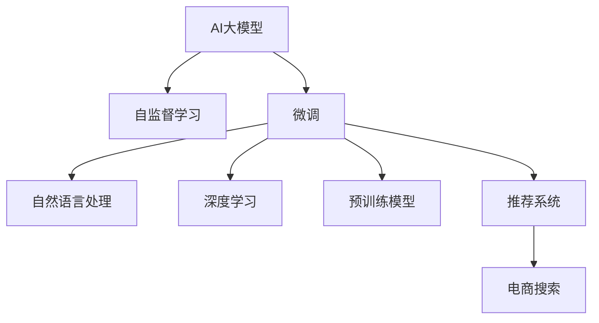

                 

# AI大模型在电商平台个性化搜索中的应用

> 关键词：AI大模型,个性化推荐,电商搜索,自然语言处理,深度学习,预训练模型,微调,电商推荐系统

## 1. 背景介绍

### 1.1 问题由来

随着电商平台的快速发展，用户对于个性化购物体验的需求日益增长。传统的电商平台搜索方式往往以关键词匹配为主，用户难以快速找到满意的产品。而个性化推荐系统能够利用用户历史行为和商品属性信息，动态调整搜索结果，满足用户的个性化需求。近年来，基于AI大模型的推荐系统逐渐成为主流，取代了传统的协同过滤算法，并取得了显著效果。

在推荐系统中，用户和商品被看作两个稠密向量，系统通过计算向量之间的相似度，得到用户对每个商品的兴趣度，进而生成个性化推荐列表。但这种基于向量的推荐方法往往存在冷启动问题，难以准确评估新用户和新商品的兴趣度。为此，AI大模型推荐系统应运而生。通过预训练大模型在大量无标签数据上学习泛化能力，在少量标注数据上进行微调，AI大模型推荐系统能够更加精准地预测用户对商品的兴趣度，从而提供更加个性化的搜索结果。

### 1.2 问题核心关键点

AI大模型推荐系统的工作原理，本质上是一种基于大模型的自监督学习和微调范式。其核心思想是：首先，通过在大规模无标签数据上自监督预训练，使得模型学习到通用的语言和视觉表示。然后，在有限的标注数据上微调模型，使其能够对特定任务（如电商搜索）进行高精度的预测。

这种微调范式相比传统的基于向量的推荐方法，有以下优点：
1. 能够处理稀疏数据：电商推荐系统往往需要处理大量的稀疏数据，AI大模型可以通过自监督学习捕捉更多的背景知识，弥补数据稀疏性。
2. 无需显式特征工程：通过预训练模型学习到的丰富的语义特征，能够自动提取商品和用户的关键特征，减少人工特征工程的复杂度。
3. 动态适应变化：随着用户行为和商品属性的变化，AI大模型推荐系统可以通过持续微调，动态更新推荐策略，适应用户需求的变迁。
4. 高效处理推荐任务：AI大模型在推理速度和效果上都远优于传统推荐算法，能够实现实时个性化的搜索结果。

AI大模型推荐系统已经在各大电商平台上取得了广泛应用，如亚马逊、京东、淘宝等，成为了提升用户体验和业务增长的重要手段。

### 1.3 问题研究意义

研究AI大模型推荐系统，对于提升电商平台的个性化搜索体验，促进用户满意度、留存率和销售额的提升，具有重要意义：

1. 提升用户满意度：通过精准匹配用户的兴趣，AI大模型推荐系统能够提供更加个性化的搜索结果，满足用户的多样化需求。
2. 降低用户流失率：精准推荐减少了用户的搜索时间，提高了用户的购物体验，从而降低了用户的流失率。
3. 增加业务收入：通过个性化推荐，电商平台能够针对用户进行更有效的广告投放，增加用户的点击率、转化率和复购率，提升业务收入。
4. 促进电商创新：AI大模型的应用为电商平台带来了更多元化、更智能的业务场景，促进了电商行业的技术革新和模式创新。
5. 赋能商家运营：AI大模型推荐系统能够帮助商家更好地了解用户需求，进行精准营销，提升商品的曝光率和销量。

## 2. 核心概念与联系

### 2.1 核心概念概述

为更好地理解AI大模型推荐系统的核心思想，本节将介绍几个密切相关的核心概念：

- AI大模型(AI Large Model)：指通过大规模数据自监督预训练，学习到丰富知识表示的深度学习模型，如BERT、GPT、DALL·E等。
- 自监督学习(Self-Supervised Learning)：指利用无标签数据训练模型，通过引入人工设计的预训练任务，让模型自主学习知识表示的范式。
- 微调(Fine-Tuning)：指在大规模预训练模型的基础上，使用下游任务的少量标注数据进行优化，以适应特定任务的范式。
- 自然语言处理(Natural Language Processing, NLP)：指利用计算机技术处理和理解人类语言的技术，包括文本分类、情感分析、机器翻译等任务。
- 深度学习(Deep Learning)：指利用神经网络模型处理大规模复杂数据的技术，广泛应用于计算机视觉、语音识别、推荐系统等领域。
- 预训练模型(Pre-trained Model)：指在大规模无标签数据上训练的深度学习模型，如BERT、GPT等。
- 推荐系统(Recommendation System)：指通过分析用户和商品的行为数据，为用户推荐感兴趣的商品的系统，广泛应用于电商、新闻、音乐等领域。

这些核心概念之间的逻辑关系可以通过以下Mermaid流程图来展示：



这个流程图展示了大模型的核心概念及其之间的关系：

1. AI大模型通过自监督学习在大量无标签数据上学习到通用的语言和视觉表示。
2. 微调技术在大模型基础上，针对电商搜索任务进行优化，使得模型能够准确预测用户对商品的兴趣度。
3. 自然语言处理、深度学习和预训练模型是AI大模型的重要组成部分，共同构建了推荐系统的技术基础。
4. 电商搜索是推荐系统应用的具体场景，AI大模型推荐系统在此场景中取得了显著效果。

## 3. 核心算法原理 & 具体操作步骤
### 3.1 算法原理概述

AI大模型推荐系统的核心思想是：首先通过自监督学习在大规模无标签数据上预训练模型，使其学习到丰富的语义和视觉知识。然后在下游的电商搜索任务上，通过微调模型，使其能够根据用户的查询和行为数据，预测用户对商品的兴趣度，生成个性化的搜索结果。

形式化地，假设预训练模型为 $M_{\theta}$，其中 $\theta$ 为预训练得到的模型参数。给定电商搜索任务的标注数据集 $D=\{(x_i,y_i)\}_{i=1}^N$，微调的目标是找到新的模型参数 $\hat{\theta}$，使得：

$$
\hat{\theta}=\mathop{\arg\min}_{\theta} \mathcal{L}(M_{\theta},D)
$$

其中 $\mathcal{L}$ 为针对电商搜索任务设计的损失函数，用于衡量模型预测结果与真实标签之间的差异。常见的损失函数包括交叉熵损失、均方误差损失等。

通过梯度下降等优化算法，微调过程不断更新模型参数 $\theta$，最小化损失函数 $\mathcal{L}$，使得模型输出逼近真实标签。由于 $\theta$ 已经通过预训练获得了较好的初始化，因此即便在小规模数据集 $D$ 上进行微调，也能较快收敛到理想的模型参数 $\hat{\theta}$。

### 3.2 算法步骤详解

AI大模型推荐系统的微调过程包括以下几个关键步骤：

**Step 1: 准备预训练模型和数据集**
- 选择合适的预训练语言模型 $M_{\theta}$ 作为初始化参数，如 BERT、GPT等。
- 准备电商搜索任务的标注数据集 $D$，划分为训练集、验证集和测试集。一般要求标注数据与预训练数据的分布不要差异过大。

**Step 2: 添加任务适配层**
- 根据电商搜索任务，在预训练模型顶层设计合适的输出层和损失函数。
- 对于分类任务，通常在顶层添加线性分类器和交叉熵损失函数。
- 对于回归任务，通常使用均方误差损失函数。

**Step 3: 设置微调超参数**
- 选择合适的优化算法及其参数，如 AdamW、SGD 等，设置学习率、批大小、迭代轮数等。
- 设置正则化技术及强度，包括权重衰减、Dropout、Early Stopping等。
- 确定冻结预训练参数的策略，如仅微调顶层，或全部参数都参与微调。

**Step 4: 执行梯度训练**
- 将训练集数据分批次输入模型，前向传播计算损失函数。
- 反向传播计算参数梯度，根据设定的优化算法和学习率更新模型参数。
- 周期性在验证集上评估模型性能，根据性能指标决定是否触发 Early Stopping。
- 重复上述步骤直到满足预设的迭代轮数或 Early Stopping 条件。

**Step 5: 测试和部署**
- 在测试集上评估微调后模型 $M_{\hat{\theta}}$ 的性能，对比微调前后的精度提升。
- 使用微调后的模型对新样本进行推理预测，集成到实际的应用系统中。
- 持续收集新的数据，定期重新微调模型，以适应数据分布的变化。

以上是AI大模型推荐系统的微调过程的一般流程。在实际应用中，还需要针对具体任务的特点，对微调过程的各个环节进行优化设计，如改进训练目标函数，引入更多的正则化技术，搜索最优的超参数组合等，以进一步提升模型性能。

### 3.3 算法优缺点

AI大模型推荐系统具有以下优点：
1. 能够处理稀疏数据：AI大模型通过自监督学习捕捉更多的背景知识，弥补电商推荐系统数据稀疏性的问题。
2. 无需显式特征工程：预训练模型能够自动提取商品和用户的关键特征，减少人工特征工程的复杂度。
3. 动态适应变化：通过持续微调，AI大模型推荐系统能够动态更新推荐策略，适应用户需求的变迁。
4. 高效处理推荐任务：AI大模型在推理速度和效果上都远优于传统推荐算法，能够实现实时个性化的搜索结果。

同时，该方法也存在一定的局限性：
1. 依赖标注数据：微调的效果很大程度上取决于标注数据的质量和数量，获取高质量标注数据的成本较高。
2. 迁移能力有限：当目标任务与预训练数据的分布差异较大时，微调的性能提升有限。
3. 负面效果传递：预训练模型的固有偏见、有害信息等，可能通过微调传递到下游任务，造成负面影响。
4. 可解释性不足：微调模型的决策过程通常缺乏可解释性，难以对其推理逻辑进行分析和调试。

尽管存在这些局限性，但就目前而言，基于AI大模型的微调方法仍是电商推荐系统的主流范式。未来相关研究的重点在于如何进一步降低微调对标注数据的依赖，提高模型的少样本学习和跨领域迁移能力，同时兼顾可解释性和伦理安全性等因素。

### 3.4 算法应用领域

AI大模型推荐系统在电商领域已经得到了广泛的应用，覆盖了几乎所有常见的推荐场景，例如：

- 商品推荐：根据用户浏览历史和行为数据，推荐用户可能感兴趣的商品。
- 促销推荐：根据用户的购物行为，推荐合适的促销活动。
- 用户画像：根据用户的历史行为数据，生成用户画像，用于个性化推荐。
- 价格优化：根据用户的购买历史和行为数据，优化商品价格策略。
- 库存管理：根据用户购买趋势和历史数据，优化商品库存量。

除了上述这些经典场景外，AI大模型推荐系统还被创新性地应用到更多场景中，如动态定价、个性化广告、搭配推荐等，为电商技术带来了全新的突破。随着预训练模型和微调方法的不断进步，相信AI大模型推荐系统必将在更广阔的应用领域大放异彩。

## 4. 数学模型和公式 & 详细讲解  
### 4.1 数学模型构建

本节将使用数学语言对AI大模型推荐系统的微调过程进行更加严格的刻画。

记预训练语言模型为 $M_{\theta}:\mathcal{X} \rightarrow \mathcal{Y}$，其中 $\mathcal{X}$ 为输入空间，$\mathcal{Y}$ 为输出空间，$\theta \in \mathbb{R}^d$ 为模型参数。假设电商搜索任务的训练集为 $D=\{(x_i,y_i)\}_{i=1}^N, x_i \in \mathcal{X}, y_i \in \mathcal{Y}$。

定义模型 $M_{\theta}$ 在数据样本 $(x,y)$ 上的损失函数为 $\ell(M_{\theta}(x),y)$，则在数据集 $D$ 上的经验风险为：

$$
\mathcal{L}(\theta) = \frac{1}{N} \sum_{i=1}^N \ell(M_{\theta}(x_i),y_i)
$$

微调的优化目标是最小化经验风险，即找到最优参数：

$$
\theta^* = \mathop{\arg\min}_{\theta} \mathcal{L}(\theta)
$$

在实践中，我们通常使用基于梯度的优化算法（如SGD、Adam等）来近似求解上述最优化问题。设 $\eta$ 为学习率，$\lambda$ 为正则化系数，则参数的更新公式为：

$$
\theta \leftarrow \theta - \eta \nabla_{\theta}\mathcal{L}(\theta) - \eta\lambda\theta
$$

其中 $\nabla_{\theta}\mathcal{L}(\theta)$ 为损失函数对参数 $\theta$ 的梯度，可通过反向传播算法高效计算。

### 4.2 公式推导过程

以下我们以电商搜索中的商品推荐任务为例，推导交叉熵损失函数及其梯度的计算公式。

假设模型 $M_{\theta}$ 在输入 $x$ 上的输出为 $\hat{y}=M_{\theta}(x) \in [0,1]$，表示用户对商品的兴趣度。真实标签 $y \in \{0,1\}$。则二分类交叉熵损失函数定义为：

$$
\ell(M_{\theta}(x),y) = -[y\log \hat{y} + (1-y)\log (1-\hat{y})]
$$

将其代入经验风险公式，得：

$$
\mathcal{L}(\theta) = -\frac{1}{N}\sum_{i=1}^N [y_i\log M_{\theta}(x_i)+(1-y_i)\log(1-M_{\theta}(x_i))]
$$

根据链式法则，损失函数对参数 $\theta_k$ 的梯度为：

$$
\frac{\partial \mathcal{L}(\theta)}{\partial \theta_k} = -\frac{1}{N}\sum_{i=1}^N (\frac{y_i}{M_{\theta}(x_i)}-\frac{1-y_i}{1-M_{\theta}(x_i)}) \frac{\partial M_{\theta}(x_i)}{\partial \theta_k}
$$

其中 $\frac{\partial M_{\theta}(x_i)}{\partial \theta_k}$ 可进一步递归展开，利用自动微分技术完成计算。

在得到损失函数的梯度后，即可带入参数更新公式，完成模型的迭代优化。重复上述过程直至收敛，最终得到适应电商搜索任务的最优模型参数 $\theta^*$。

## 5. 项目实践：代码实例和详细解释说明
### 5.1 开发环境搭建

在进行推荐系统微调实践前，我们需要准备好开发环境。以下是使用Python进行PyTorch开发的环境配置流程：

1. 安装Anaconda：从官网下载并安装Anaconda，用于创建独立的Python环境。

2. 创建并激活虚拟环境：
```bash
conda create -n pytorch-env python=3.8 
conda activate pytorch-env
```

3. 安装PyTorch：根据CUDA版本，从官网获取对应的安装命令。例如：
```bash
conda install pytorch torchvision torchaudio cudatoolkit=11.1 -c pytorch -c conda-forge
```

4. 安装Transformers库：
```bash
pip install transformers
```

5. 安装各类工具包：
```bash
pip install numpy pandas scikit-learn matplotlib tqdm jupyter notebook ipython
```

完成上述步骤后，即可在`pytorch-env`环境中开始推荐系统微调实践。

### 5.2 源代码详细实现

下面我们以电商推荐系统为例，给出使用Transformers库对BERT模型进行推荐系统微调的PyTorch代码实现。

首先，定义推荐系统的数据处理函数：

```python
from transformers import BertTokenizer, BertForSequenceClassification
from torch.utils.data import Dataset
import torch

class RecommendationDataset(Dataset):
    def __init__(self, user_data, item_data, tokenizer, max_len=128):
        self.user_data = user_data
        self.item_data = item_data
        self.tokenizer = tokenizer
        self.max_len = max_len
        
    def __len__(self):
        return len(self.user_data)
    
    def __getitem__(self, item):
        user_seq = self.user_data[item]
        item_seq = self.item_data[item]
        
        encoding = self.tokenizer(user_seq, return_tensors='pt', max_length=self.max_len, padding='max_length', truncation=True)
        input_ids = encoding['input_ids'][0]
        attention_mask = encoding['attention_mask'][0]
        
        # 对用户序列进行编码
        user_features = torch.tensor(user_seq, dtype=torch.long)
        item_features = torch.tensor(item_seq, dtype=torch.long)
        
        return {'input_ids': input_ids, 
                'attention_mask': attention_mask,
                'user_features': user_features,
                'item_features': item_features}

# 创建dataset
tokenizer = BertTokenizer.from_pretrained('bert-base-cased')

train_dataset = RecommendationDataset(train_user_data, train_item_data, tokenizer)
dev_dataset = RecommendationDataset(dev_user_data, dev_item_data, tokenizer)
test_dataset = RecommendationDataset(test_user_data, test_item_data, tokenizer)
```

然后，定义模型和优化器：

```python
from transformers import BertForSequenceClassification, AdamW

model = BertForSequenceClassification.from_pretrained('bert-base-cased', num_labels=2)

optimizer = AdamW(model.parameters(), lr=2e-5)
```

接着，定义训练和评估函数：

```python
from torch.utils.data import DataLoader
from tqdm import tqdm
from sklearn.metrics import classification_report

device = torch.device('cuda') if torch.cuda.is_available() else torch.device('cpu')
model.to(device)

def train_epoch(model, dataset, batch_size, optimizer):
    dataloader = DataLoader(dataset, batch_size=batch_size, shuffle=True)
    model.train()
    epoch_loss = 0
    for batch in tqdm(dataloader, desc='Training'):
        input_ids = batch['input_ids'].to(device)
        attention_mask = batch['attention_mask'].to(device)
        user_features = batch['user_features'].to(device)
        item_features = batch['item_features'].to(device)
        model.zero_grad()
        outputs = model(input_ids, attention_mask=attention_mask, user_features=user_features, item_features=item_features)
        loss = outputs.loss
        epoch_loss += loss.item()
        loss.backward()
        optimizer.step()
    return epoch_loss / len(dataloader)

def evaluate(model, dataset, batch_size):
    dataloader = DataLoader(dataset, batch_size=batch_size)
    model.eval()
    preds, labels = [], []
    with torch.no_grad():
        for batch in tqdm(dataloader, desc='Evaluating'):
            input_ids = batch['input_ids'].to(device)
            attention_mask = batch['attention_mask'].to(device)
            user_features = batch['user_features'].to(device)
            item_features = batch['item_features'].to(device)
            batch_preds = model(input_ids, attention_mask=attention_mask, user_features=user_features, item_features=item_features)
            batch_labels = batch['labels'].to(device).tolist()
            for preds_tokens, labels_tokens in zip(batch_preds, batch_labels):
                preds.append(preds_tokens[:len(labels_tokens)])
                labels.append(labels_tokens)
                
    print(classification_report(labels, preds))
```

最后，启动训练流程并在测试集上评估：

```python
epochs = 5
batch_size = 16

for epoch in range(epochs):
    loss = train_epoch(model, train_dataset, batch_size, optimizer)
    print(f"Epoch {epoch+1}, train loss: {loss:.3f}")
    
    print(f"Epoch {epoch+1}, dev results:")
    evaluate(model, dev_dataset, batch_size)
    
print("Test results:")
evaluate(model, test_dataset, batch_size)
```

以上就是使用PyTorch对BERT进行电商推荐系统微调的完整代码实现。可以看到，得益于Transformers库的强大封装，我们可以用相对简洁的代码完成BERT模型的加载和微调。

### 5.3 代码解读与分析

让我们再详细解读一下关键代码的实现细节：

**RecommendationDataset类**：
- `__init__`方法：初始化用户行为序列、商品序列、分词器等关键组件。
- `__len__`方法：返回数据集的样本数量。
- `__getitem__`方法：对单个样本进行处理，将用户序列和商品序列输入编码为token ids，进行定长padding，最终返回模型所需的输入。

**标签与id的映射**：
- 定义了标签与数字id之间的映射关系，用于将token-wise的预测结果解码回真实的标签。

**训练和评估函数**：
- 使用PyTorch的DataLoader对数据集进行批次化加载，供模型训练和推理使用。
- 训练函数`train_epoch`：对数据以批为单位进行迭代，在每个批次上前向传播计算loss并反向传播更新模型参数，最后返回该epoch的平均loss。
- 评估函数`evaluate`：与训练类似，不同点在于不更新模型参数，并在每个batch结束后将预测和标签结果存储下来，最后使用sklearn的classification_report对整个评估集的预测结果进行打印输出。

**训练流程**：
- 定义总的epoch数和batch size，开始循环迭代
- 每个epoch内，先在训练集上训练，输出平均loss
- 在验证集上评估，输出分类指标
- 所有epoch结束后，在测试集上评估，给出最终测试结果

可以看到，PyTorch配合Transformers库使得BERT微调的代码实现变得简洁高效。开发者可以将更多精力放在数据处理、模型改进等高层逻辑上，而不必过多关注底层的实现细节。

当然，工业级的系统实现还需考虑更多因素，如模型的保存和部署、超参数的自动搜索、更灵活的任务适配层等。但核心的微调范式基本与此类似。

## 6. 实际应用场景
### 6.1 智能客服系统

基于AI大模型的推荐系统可以广泛应用于智能客服系统的构建。传统客服往往需要配备大量人力，高峰期响应缓慢，且一致性和专业性难以保证。而使用推荐系统推荐的常见问题，能够7x24小时不间断服务，快速响应客户咨询，用自然流畅的语言解答各类常见问题。

在技术实现上，可以收集企业内部的历史客服对话记录，将问题和最佳答复构建成监督数据，在此基础上对预训练推荐系统进行微调。微调后的推荐系统能够自动理解用户意图，匹配最合适的答复模板进行回复。对于客户提出的新问题，还可以接入检索系统实时搜索相关内容，动态组织生成回答。如此构建的智能客服系统，能大幅提升客户咨询体验和问题解决效率。

### 6.2 金融舆情监测

金融机构需要实时监测市场舆论动向，以便及时应对负面信息传播，规避金融风险。传统的人工监测方式成本高、效率低，难以应对网络时代海量信息爆发的挑战。基于AI大模型的推荐系统为金融舆情监测提供了新的解决方案。

具体而言，可以收集金融领域相关的新闻、报道、评论等文本数据，并对其进行主题标注和情感标注。在此基础上对预训练语言模型进行微调，使其能够自动判断文本属于何种主题，情感倾向是正面、中性还是负面。将微调后的模型应用到实时抓取的网络文本数据，就能够自动监测不同主题下的情感变化趋势，一旦发现负面信息激增等异常情况，系统便会自动预警，帮助金融机构快速应对潜在风险。

### 6.3 个性化推荐系统

当前的推荐系统往往只依赖用户的历史行为数据进行物品推荐，无法深入理解用户的真实兴趣偏好。基于AI大模型的推荐系统可以更好地挖掘用户行为背后的语义信息，从而提供更精准、多样的推荐内容。

在实践中，可以收集用户浏览、点击、评论、分享等行为数据，提取和用户交互的物品标题、描述、标签等文本内容。将文本内容作为模型输入，用户的后续行为（如是否点击、购买等）作为监督信号，在此基础上微调预训练语言模型。微调后的模型能够从文本内容中准确把握用户的兴趣点。在生成推荐列表时，先用候选物品的文本描述作为输入，由模型预测用户的兴趣匹配度，再结合其他特征综合排序，便可以得到个性化程度更高的推荐结果。

### 6.4 未来应用展望

随着AI大模型推荐系统的发展，未来在更多领域得到应用，为传统行业带来变革性影响：

1. 智慧医疗领域：通过推荐系统推荐个性化的医疗信息，帮助患者做出更好的治疗决策，提升医疗服务的质量和效率。
2. 智能教育领域：根据学生的学习行为，推荐个性化的学习内容，因材施教，促进教育公平，提高教学质量。
3. 智慧城市治理：通过推荐系统推荐城市事件监测、舆情分析、应急指挥等环节，提高城市管理的自动化和智能化水平，构建更安全、高效的未来城市。
4. 媒体娱乐领域：根据用户的观看历史和反馈，推荐个性化的影视内容，提升用户的娱乐体验，增加媒体平台的黏性。
5. 企业生产领域：通过推荐系统推荐个性化的生产材料和工艺，提升生产效率，降低生产成本。

此外，在企业生产、社会治理、文娱传媒等众多领域，基于AI大模型的推荐系统也将不断涌现，为传统行业带来新的技术路径。相信随着技术的日益成熟，推荐系统必将在更广阔的应用领域大放异彩，深刻影响人类的生产生活方式。

## 7. 工具和资源推荐
### 7.1 学习资源推荐

为了帮助开发者系统掌握AI大模型推荐系统的理论基础和实践技巧，这里推荐一些优质的学习资源：

1. 《Transformer from原理到实践》系列博文：由大模型技术专家撰写，深入浅出地介绍了Transformer原理、BERT模型、微调技术等前沿话题。

2. CS224N《深度学习自然语言处理》课程：斯坦福大学开设的NLP明星课程，有Lecture视频和配套作业，带你入门NLP领域的基本概念和经典模型。

3. 《Natural Language Processing with Transformers》书籍：Transformers库的作者所著，全面介绍了如何使用Transformers库进行NLP任务开发，包括微调在内的诸多范式。

4. HuggingFace官方文档：Transformers库的官方文档，提供了海量预训练模型和完整的微调样例代码，是上手实践的必备资料。

5. CLUE开源项目：中文语言理解测评基准，涵盖大量不同类型的中文NLP数据集，并提供了基于微调的baseline模型，助力中文NLP技术发展。

通过对这些资源的学习实践，相信你一定能够快速掌握AI大模型推荐系统的精髓，并用于解决实际的NLP问题。
###  7.2 开发工具推荐

高效的开发离不开优秀的工具支持。以下是几款用于AI大模型推荐系统开发的常用工具：

1. PyTorch：基于Python的开源深度学习框架，灵活动态的计算图，适合快速迭代研究。大部分预训练语言模型都有PyTorch版本的实现。

2. TensorFlow：由Google主导开发的开源深度学习框架，生产部署方便，适合大规模工程应用。同样有丰富的预训练语言模型资源。

3. Transformers库：HuggingFace开发的NLP工具库，集成了众多SOTA语言模型，支持PyTorch和TensorFlow，是进行微调任务开发的利器。

4. Weights & Biases：模型训练的实验跟踪工具，可以记录和可视化模型训练过程中的各项指标，方便对比和调优。与主流深度学习框架无缝集成。

5. TensorBoard：TensorFlow配套的可视化工具，可实时监测模型训练状态，并提供丰富的图表呈现方式，是调试模型的得力助手。

6. Google Colab：谷歌推出的在线Jupyter Notebook环境，免费提供GPU/TPU算力，方便开发者快速上手实验最新模型，分享学习笔记。

合理利用这些工具，可以显著提升AI大模型推荐系统的开发效率，加快创新迭代的步伐。

### 7.3 相关论文推荐

AI大模型推荐系统的研究源于学界的持续研究。以下是几篇奠基性的相关论文，推荐阅读：

1. Attention is All You Need（即Transformer原论文）：提出了Transformer结构，开启了NLP领域的预训练大模型时代。

2. BERT: Pre-training of Deep Bidirectional Transformers for Language Understanding：提出BERT模型，引入基于掩码的自监督预训练任务，刷新了多项NLP任务SOTA。

3. Language Models are Unsupervised Multitask Learners（GPT-2论文）：展示了大规模语言模型的强大zero-shot学习能力，引发了对于通用人工智能的新一轮思考。

4. Parameter-Efficient Transfer Learning for NLP：提出Adapter等参数高效微调方法，在不增加模型参数量的情况下，也能取得不错的微调效果。

5. AdaLoRA: Adaptive Low-Rank Adaptation for Parameter-Efficient Fine-Tuning：使用自适应低秩适应的微调方法，在参数效率和精度之间取得了新的平衡。

6. Fine-tuning Pre-trained Language Models for Personalized Recommendation System：研究了使用预训练语言模型进行个性化推荐的具体方法，展示了其优越性。

这些论文代表了大模型推荐系统的发展脉络。通过学习这些前沿成果，可以帮助研究者把握学科前进方向，激发更多的创新灵感。

## 8. 总结：未来发展趋势与挑战

### 8.1 总结

本文对AI大模型推荐系统进行了全面系统的介绍。首先阐述了AI大模型推荐系统的研究背景和意义，明确了其在大规模无标签数据上预训练、在少量标注数据上微调的核心思想。其次，从原理到实践，详细讲解了推荐系统的数学原理和关键步骤，给出了推荐系统微调的完整代码实例。同时，本文还广泛探讨了推荐系统在智能客服、金融舆情、个性化推荐等多个领域的应用前景，展示了推荐系统范式的巨大潜力。此外，本文精选了推荐系统的各类学习资源，力求为读者提供全方位的技术指引。

通过本文的系统梳理，可以看到，AI大模型推荐系统正在成为NLP领域的重要范式，极大地拓展了推荐系统的应用边界，催生了更多的落地场景。得益于大规模语料的预训练，推荐系统在推理速度和效果上都远优于传统推荐算法，能够实现实时个性化的搜索结果。未来，伴随预训练语言模型和微调方法的不断进步，相信推荐系统必将在更广阔的应用领域大放异彩，深刻影响人类的生产生活方式。

### 8.2 未来发展趋势

展望未来，AI大模型推荐系统将呈现以下几个发展趋势：

1. 模型规模持续增大。随着算力成本的下降和数据规模的扩张，预训练语言模型的参数量还将持续增长。超大规模语言模型蕴含的丰富语言知识，有望支撑更加复杂多变的推荐场景。

2. 推荐方法日趋多样。除了传统的基于向量的推荐方法外，未来会涌现更多基于深度学习的推荐方法，如多任务学习、图神经网络等，提供更精准、多维度的推荐结果。

3. 持续学习成为常态。随着用户行为和商品属性的变化，推荐系统需要持续学习新知识以保持性能。如何在不遗忘原有知识的同时，高效吸收新样本信息，将成为重要的研究课题。

4. 标注样本需求降低。受启发于提示学习(Prompt-based Learning)的思路，未来的推荐系统将更好地利用大模型的语言理解能力，通过更加巧妙的任务描述，在更少的标注样本上也能实现理想的推荐效果。

5. 少样本学习崛起。基于大模型的推荐系统能够通过少量训练样本来快速适应新任务，提升推荐系统的泛化能力。

6. 多模态推荐兴起。未来的推荐系统将不仅关注文本信息，还会引入图像、音频等多模态信息，提升推荐系统的表现力和实用性。

以上趋势凸显了AI大模型推荐系统的广阔前景。这些方向的探索发展，必将进一步提升推荐系统的性能和应用范围，为人类认知智能的进化带来深远影响。

### 8.3 面临的挑战

尽管AI大模型推荐系统已经取得了瞩目成就，但在迈向更加智能化、普适化应用的过程中，它仍面临着诸多挑战：

1. 标注成本瓶颈。虽然推荐系统对标注样本的需求相对较低，但对于特定领域的推荐任务，获取高质量标注数据仍需大量时间和精力，成本较高。如何进一步降低推荐系统对标注样本的依赖，将是一大难题。

2. 模型鲁棒性不足。推荐系统面对新用户和新商品时，泛化性能往往大打折扣。对于测试样本的微小扰动，推荐模型的预测也容易发生波动。如何提高推荐模型的鲁棒性，避免灾难性遗忘，还需要更多理论和实践的积累。

3. 推荐效率有待提高。大规模语言模型虽然精度高，但在实际部署时往往面临推理速度慢、内存占用大等效率问题。如何在保证性能的同时，简化模型结构，提升推理速度，优化资源占用，将是重要的优化方向。

4. 推荐效果可解释性不足。推荐系统通常缺乏可解释性，难以对其推荐结果进行分析和调试。对于推荐系统在医疗、金融等高风险领域的应用，模型的可解释性尤为重要。

5. 安全性有待保障。推荐系统可能会受到恶意攻击，推荐错误的商品，给用户造成损失。如何从数据和算法层面消除推荐系统的不安全性，确保推荐结果的安全可靠，也将是重要的研究课题。

6. 知识整合能力不足。现有的推荐系统往往局限于数据驱动，难以灵活吸收和运用更广泛的先验知识。如何让推荐系统更好地与外部知识库、规则库等专家知识结合，形成更加全面、准确的信息整合能力，还有很大的想象空间。

正视推荐系统面临的这些挑战，积极应对并寻求突破，将是大模型推荐系统走向成熟的必由之路。相信随着学界和产业界的共同努力，这些挑战终将一一被克服，AI大模型推荐系统必将在构建安全、可靠、可解释、可控的智能系统铺平道路。

### 8.4 研究展望

未来的研究需要在以下几个方面寻求新的突破：

1. 探索无监督和半监督推荐方法。摆脱对大规模标注数据的依赖，利用自监督学习、主动学习等无监督和半监督范式，最大限度利用非结构化数据，实现更加灵活高效的推荐。

2. 研究参数高效和计算高效的推荐范式。开发更加参数高效的推荐方法，在固定大部分预训练参数的同时，只更新极少量的任务相关参数。同时优化推荐模型的计算图，减少前向传播和反向传播的资源消耗，实现更加轻量级、实时性的部署。

3. 融合因果和对比学习范式。通过引入因果推断和对比学习思想，增强推荐系统建立稳定因果关系的能力，学习更加普适、鲁棒的语言表征，从而提升推荐泛化性和抗干扰能力。

4. 引入更多先验知识。将符号化的先验知识，如知识图谱、逻辑规则等，与神经网络模型进行巧妙融合，引导推荐系统学习更准确、合理的语言模型。同时加强不同模态数据的整合，实现视觉、语音等多模态信息与文本信息的协同建模。

5. 结合因果分析和博弈论工具。将因果分析方法引入推荐系统，识别出推荐结果的关键特征，增强推荐结果的因果性和逻辑性。借助博弈论工具刻画人机交互过程，主动探索并规避推荐系统的脆弱点，提高系统稳定性。

6. 纳入伦理道德约束。在推荐系统训练目标中引入伦理导向的评估指标，过滤和惩罚有偏见、有害的输出倾向。同时加强人工干预和审核，建立推荐系统的监管机制，确保推荐结果符合人类价值观和伦理道德。

这些研究方向的探索，必将引领AI大模型推荐系统迈向更高的台阶，为构建安全、可靠、可解释、可控的智能系统铺平道路。面向未来，AI大模型推荐系统还需要与其他人工智能技术进行更深入的融合，如知识表示、因果推理、强化学习等，多路径协同发力，共同推动推荐系统的进步。只有勇于创新、敢于突破，才能不断拓展推荐系统的边界，让智能技术更好地造福人类社会。

## 9. 附录：常见问题与解答

**Q1：推荐系统如何处理冷启动问题？**

A: 推荐系统处理冷启动问题通常有以下几种方法：

1. 基于用户画像的推荐：通过收集用户历史行为数据，生成用户画像，用于推荐系统对新用户进行推荐。
2. 基于商品属性的推荐：通过商品属性信息，生成商品画像，用于推荐系统对新商品进行推荐。
3. 基于协同过滤的推荐：通过新用户的相似用户或相似商品，进行推荐。
4. 基于内容的推荐：通过用户兴趣和商品属性的相似性，进行推荐。
5. 基于混合模型的推荐：将多种推荐方法结合，利用多模态信息，提升推荐系统对冷启动用户的推荐效果。

以上方法可以灵活组合使用，根据具体场景选择合适的方案。

**Q2：推荐系统如何处理长尾问题？**

A: 推荐系统处理长尾问题通常有以下几种方法：

1. 基于召回率的推荐：通过增加推荐结果的数量，覆盖更多的长尾商品。
2. 基于排序的推荐：通过优化推荐结果的排序算法，提升长尾商品的曝光率。
3. 基于协同过滤的推荐：通过增加新商品的相似商品数量，提升长尾商品的推荐效果。
4. 基于模型的推荐：通过引入深度学习模型，提升对长尾商品的预测能力。

以上方法可以灵活组合使用，根据具体场景选择合适的方案。

**Q3：推荐系统如何提升用户满意度？**

A: 推荐系统提升用户满意度通常有以下几种方法：

1. 基于用户画像的推荐：通过收集用户历史行为数据，生成用户画像，用于推荐系统对新用户进行推荐。
2. 基于商品属性的推荐：通过商品属性信息，生成商品画像，用于推荐系统对新商品进行推荐。
3. 基于协同过滤的推荐：通过新用户的相似用户或相似商品，进行推荐。
4. 基于内容的推荐：通过用户兴趣和商品属性的相似性，进行推荐。
5. 基于混合模型的推荐：将多种推荐方法结合，利用多模态信息，提升推荐系统对冷启动用户的推荐效果。

以上方法可以灵活组合使用，根据具体场景选择合适的方案。

**Q4：推荐系统如何提升推荐效率？**

A: 推荐系统提升推荐效率通常有以下几种方法：

1. 基于索引的推荐：通过构建推荐索引，快速检索推荐结果。
2. 基于缓存的推荐：通过缓存推荐结果，减少重复计算。
3. 基于稀疏矩阵的推荐：通过压缩稀疏矩阵，减少计算量。
4. 基于流式计算的推荐：通过实时计算推荐结果，提升推荐效率。
5. 基于分布式计算的推荐：通过分布式计算，加速推荐结果的生成。

以上方法可以灵活组合使用，根据具体场景选择合适的方案。

**Q5：推荐系统如何保障数据安全？**

A: 推荐系统保障数据安全通常有以下几种方法：

1. 基于加密的推荐：通过加密用户数据和商品数据，保护用户隐私。
2. 基于匿名化的推荐：通过匿名化用户数据和商品数据，保护用户隐私。
3. 基于权限控制的推荐：通过控制用户和商品的访问权限，保护数据安全。
4. 基于加密传输的推荐：通过加密数据传输，保护数据安全。
5. 基于安全计算的推荐：通过安全计算技术，保护数据安全。

以上方法可以灵活组合使用，根据具体场景选择合适的方案。

**Q6：推荐系统如何提升推荐效果？**

A: 推荐系统提升推荐效果通常有以下几种方法：

1. 基于用户画像的推荐：通过收集用户历史行为数据，生成用户画像，用于推荐系统对新用户进行推荐。
2. 基于商品属性的推荐：通过商品属性信息，生成商品画像，用于推荐系统对新商品进行推荐。
3. 基于协同过滤的推荐：通过新用户的相似用户或相似商品，进行推荐。
4. 基于内容的推荐：通过用户兴趣和商品属性的相似性，进行推荐。
5. 基于混合模型的推荐：将多种推荐方法结合，利用多模态信息，提升推荐系统对冷启动用户的推荐效果。

以上方法可以灵活组合使用，根据具体场景选择合适的方案。

**Q7：推荐系统如何提升推荐效果？**

A: 推荐系统提升推荐效果通常有以下几种方法：

1. 基于用户画像的推荐：通过收集用户历史行为数据，生成用户画像，用于推荐系统对新用户进行推荐。
2. 基于商品属性的推荐：通过商品属性信息，生成商品画像，用于推荐系统对新商品进行推荐。
3. 基于协同过滤的推荐：通过新用户的相似用户或相似商品，进行推荐。
4. 基于内容的推荐：通过用户兴趣和商品属性的相似性，进行推荐。
5. 基于混合模型的推荐：将多种推荐方法结合，利用多模态信息，提升推荐系统对冷启动用户的推荐效果。

以上方法可以灵活组合使用，根据具体场景选择合适的方案。

**Q8：推荐系统如何提升推荐效果？**

A: 推荐系统提升推荐效果通常有以下几种方法：

1. 基于用户画像

