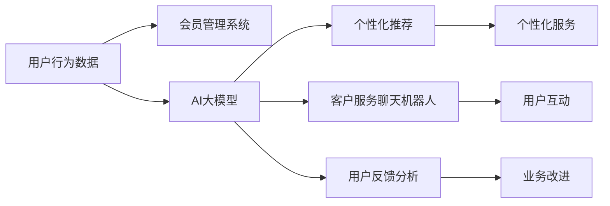

                 

# AI大模型在电商平台会员管理中的应用

## 1. 背景介绍

在当今数字化的消费时代，电商平台已经成为了消费者购物的重要渠道。面对激烈的市场竞争，提升用户体验、增加用户黏性、优化会员管理成为了各大电商平台的关键挑战。随着AI技术的发展，特别是大语言模型在自然语言处理领域的应用，电商平台开始探索如何利用大语言模型来优化会员管理，提升会员体验。

## 2. 核心概念与联系

### 2.1 核心概念概述

在本节中，我们将介绍一些与AI大模型在电商平台会员管理中应用相关的核心概念，包括：

- **AI大模型**：指使用大规模无标签数据进行预训练，具有强大语言理解、生成能力的人工智能模型，如GPT、BERT等。
- **会员管理**：指电商平台对用户注册、登录、积分、优惠、推荐等内容的管理。
- **自然语言处理（NLP）**：指利用计算机技术处理、分析和生成自然语言的过程。
- **推荐系统**：指基于用户行为数据，向用户推荐商品、服务等内容的技术。
- **个性化服务**：指根据用户特征提供定制化的服务，如个性化推荐、专属优惠等。

### 2.2 核心概念原理和架构的 Mermaid 流程图



这个流程图展示了AI大模型在电商平台会员管理中的应用流程：首先，用户行为数据被输入到会员管理系统，然后通过AI大模型进行分析和处理，生成个性化推荐和个性化服务，同时客户服务聊天机器人和用户反馈分析也利用AI大模型的能力来提升用户体验和业务改进。

## 3. 核心算法原理 & 具体操作步骤

### 3.1 算法原理概述

AI大模型在电商平台会员管理中的应用，主要基于以下几个核心算法原理：

- **预训练**：使用大规模无标签数据对AI大模型进行预训练，使其具备强大的语言理解和生成能力。
- **微调**：根据电商平台会员管理的具体需求，对预训练模型进行微调，使其能够处理具体业务。
- **推荐系统**：基于用户行为数据和会员信息，使用AI大模型进行推荐，提升用户购物体验。
- **自然语言处理（NLP）**：使用AI大模型处理用户的查询和反馈，提升客户服务的效率和质量。
- **个性化服务**：根据用户的历史行为和会员信息，生成个性化的服务和推荐，提高用户黏性。

### 3.2 算法步骤详解

下面详细介绍AI大模型在电商平台会员管理中的具体操作步骤：

**Step 1: 准备数据集和预训练模型**

- 收集电商平台的会员注册、登录、购买、浏览、评价等行为数据。
- 选择合适的预训练模型，如BERT、GPT等，作为初始化参数。
- 将会员数据转化为适合模型训练的格式，如序列化向量表示。

**Step 2: 添加任务适配层**

- 在预训练模型的顶层添加特定的任务适配层，如分类层、回归层等。
- 针对会员管理任务，可以添加会员等级分类、会员积分计算、专属优惠推荐等适配层。

**Step 3: 设置微调超参数**

- 设置优化算法及其参数，如AdamW、SGD等，学习率、批大小、迭代轮数等。
- 设置正则化技术及强度，如L2正则、Dropout、Early Stopping等。
- 确定冻结预训练参数的策略，如仅微调顶层，或全部参数都参与微调。

**Step 4: 执行梯度训练**

- 将会员数据分批次输入模型，前向传播计算损失函数。
- 反向传播计算参数梯度，根据设定的优化算法和学习率更新模型参数。
- 周期性在验证集上评估模型性能，根据性能指标决定是否触发 Early Stopping。
- 重复上述步骤直到满足预设的迭代轮数或 Early Stopping 条件。

**Step 5: 测试和部署**

- 在测试集上评估微调后模型在会员管理任务上的性能，对比微调前后的精度提升。
- 使用微调后的模型对新会员进行推理预测，集成到实际的应用系统中。
- 持续收集新的会员数据，定期重新微调模型，以适应数据分布的变化。

### 3.3 算法优缺点

AI大模型在电商平台会员管理中的优点包括：

- **提升用户体验**：个性化推荐和个性化服务能够提升用户的购物体验，增加用户黏性。
- **提高业务效率**：AI大模型可以自动化处理大量的会员数据，提高业务效率。
- **减少人工成本**：自动化处理和推荐可以减少人工干预，降低人工成本。

缺点包括：

- **数据依赖**：模型的效果很大程度上取决于会员数据的数量和质量。
- **模型复杂度**：大规模预训练模型需要高算力支持，增加了系统复杂度。
- **安全隐私问题**：用户的隐私数据需要妥善处理，以避免数据泄露风险。
- **模型偏见**：模型可能会学习到数据中的偏见，影响推荐公正性。

### 3.4 算法应用领域

AI大模型在电商平台会员管理中的应用领域包括：

- **会员推荐系统**：根据用户的浏览历史和购买行为，生成个性化的商品推荐。
- **会员积分系统**：根据用户行为，动态计算和更新会员积分。
- **会员等级管理**：根据用户的消费行为和积分情况，调整会员等级和特权。
- **客户服务聊天机器人**：利用大模型处理用户的查询和反馈，提升客服效率。
- **用户行为分析**：分析用户的行为模式，优化业务策略。

## 4. 数学模型和公式 & 详细讲解 & 举例说明

### 4.1 数学模型构建

在本节中，我们将介绍用于电商平台会员管理的数学模型。

假设预训练模型为 $M_{\theta}$，其中 $\theta$ 为预训练得到的模型参数。给定会员行为数据集 $D=\{(x_i,y_i)\}_{i=1}^N$，其中 $x_i$ 为会员的行为特征，$y_i$ 为相应的行为标签。微调的目标是找到新的模型参数 $\hat{\theta}$，使得：

$$
\hat{\theta}=\mathop{\arg\min}_{\theta} \mathcal{L}(M_{\theta},D)
$$

其中 $\mathcal{L}$ 为针对会员管理任务设计的损失函数，用于衡量模型预测输出与真实标签之间的差异。常见的损失函数包括交叉熵损失、均方误差损失等。

### 4.2 公式推导过程

以会员推荐系统为例，假设模型的输出为 $\hat{y}=M_{\theta}(x_i) \in [0,1]$，表示会员对商品的偏好程度。真实标签 $y \in \{0,1\}$。则二分类交叉熵损失函数定义为：

$$
\ell(M_{\theta}(x_i),y) = -[y\log \hat{y} + (1-y)\log (1-\hat{y})]
$$

将其代入经验风险公式，得：

$$
\mathcal{L}(\theta) = -\frac{1}{N}\sum_{i=1}^N [y_i\log M_{\theta}(x_i)+(1-y_i)\log(1-M_{\theta}(x_i))]
$$

根据链式法则，损失函数对参数 $\theta_k$ 的梯度为：

$$
\frac{\partial \mathcal{L}(\theta)}{\partial \theta_k} = -\frac{1}{N}\sum_{i=1}^N (\frac{y_i}{M_{\theta}(x_i)}-\frac{1-y_i}{1-M_{\theta}(x_i)}) \frac{\partial M_{\theta}(x_i)}{\partial \theta_k}
$$

其中 $\frac{\partial M_{\theta}(x_i)}{\partial \theta_k}$ 可进一步递归展开，利用自动微分技术完成计算。

### 4.3 案例分析与讲解

以会员推荐系统为例，展示具体的数学模型构建和推导过程。

假设会员行为数据集 $D$ 包含 $N$ 个样本，每个样本由特征向量 $x_i \in \mathbb{R}^d$ 和标签 $y_i \in \{0,1\}$ 组成。使用会员推荐系统的输出为 $\hat{y}=M_{\theta}(x_i) \in [0,1]$，表示会员对商品的偏好程度。

- **数据处理**：首先，将会员行为数据转化为适合模型训练的格式，如序列化向量表示。
- **模型构建**：其次，在预训练模型的顶层添加分类层，以二分类任务为例，分类层输出为 $\hat{y}=M_{\theta}(x_i)$。
- **损失函数**：基于二分类交叉熵损失函数 $\ell(M_{\theta}(x_i),y_i)$，构建会员推荐系统的损失函数 $\mathcal{L}(\theta)$。
- **梯度计算**：利用链式法则计算损失函数对参数 $\theta_k$ 的梯度。

## 5. 项目实践：代码实例和详细解释说明

### 5.1 开发环境搭建

在进行会员管理系统的开发前，我们需要准备好开发环境。以下是使用Python进行PyTorch开发的环境配置流程：

1. 安装Anaconda：从官网下载并安装Anaconda，用于创建独立的Python环境。

2. 创建并激活虚拟环境：
```bash
conda create -n pytorch-env python=3.8 
conda activate pytorch-env
```

3. 安装PyTorch：根据CUDA版本，从官网获取对应的安装命令。例如：
```bash
conda install pytorch torchvision torchaudio cudatoolkit=11.1 -c pytorch -c conda-forge
```

4. 安装Transformers库：
```bash
pip install transformers
```

5. 安装各类工具包：
```bash
pip install numpy pandas scikit-learn matplotlib tqdm jupyter notebook ipython
```

完成上述步骤后，即可在`pytorch-env`环境中开始会员管理系统的开发。

### 5.2 源代码详细实现

下面我们以会员推荐系统为例，给出使用Transformers库对BERT模型进行微调的PyTorch代码实现。

首先，定义会员推荐任务的数据处理函数：

```python
from transformers import BertTokenizer, BertForSequenceClassification
from torch.utils.data import Dataset
import torch

class MemberRecommendationDataset(Dataset):
    def __init__(self, features, labels, tokenizer, max_len=128):
        self.features = features
        self.labels = labels
        self.tokenizer = tokenizer
        self.max_len = max_len
        
    def __len__(self):
        return len(self.features)
    
    def __getitem__(self, item):
        feature = self.features[item]
        label = self.labels[item]
        
        encoding = self.tokenizer(feature, return_tensors='pt', max_length=self.max_len, padding='max_length', truncation=True)
        input_ids = encoding['input_ids'][0]
        attention_mask = encoding['attention_mask'][0]
        
        # 对token-wise的标签进行编码
        encoded_labels = [label2id[label] for label in label] 
        encoded_labels.extend([label2id['O']] * (self.max_len - len(encoded_labels)))
        labels = torch.tensor(encoded_labels, dtype=torch.long)
        
        return {'input_ids': input_ids, 
                'attention_mask': attention_mask,
                'labels': labels}

# 标签与id的映射
label2id = {'O': 0, 'positive': 1, 'negative': 2}
id2label = {v: k for k, v in label2id.items()}

# 创建dataset
tokenizer = BertTokenizer.from_pretrained('bert-base-cased')

train_dataset = MemberRecommendationDataset(train_features, train_labels, tokenizer)
dev_dataset = MemberRecommendationDataset(dev_features, dev_labels, tokenizer)
test_dataset = MemberRecommendationDataset(test_features, test_labels, tokenizer)
```

然后，定义模型和优化器：

```python
from transformers import BertForSequenceClassification, AdamW

model = BertForSequenceClassification.from_pretrained('bert-base-cased', num_labels=len(label2id))

optimizer = AdamW(model.parameters(), lr=2e-5)
```

接着，定义训练和评估函数：

```python
from torch.utils.data import DataLoader
from tqdm import tqdm
from sklearn.metrics import classification_report

device = torch.device('cuda') if torch.cuda.is_available() else torch.device('cpu')
model.to(device)

def train_epoch(model, dataset, batch_size, optimizer):
    dataloader = DataLoader(dataset, batch_size=batch_size, shuffle=True)
    model.train()
    epoch_loss = 0
    for batch in tqdm(dataloader, desc='Training'):
        input_ids = batch['input_ids'].to(device)
        attention_mask = batch['attention_mask'].to(device)
        labels = batch['labels'].to(device)
        model.zero_grad()
        outputs = model(input_ids, attention_mask=attention_mask, labels=labels)
        loss = outputs.loss
        epoch_loss += loss.item()
        loss.backward()
        optimizer.step()
    return epoch_loss / len(dataloader)

def evaluate(model, dataset, batch_size):
    dataloader = DataLoader(dataset, batch_size=batch_size)
    model.eval()
    preds, labels = [], []
    with torch.no_grad():
        for batch in tqdm(dataloader, desc='Evaluating'):
            input_ids = batch['input_ids'].to(device)
            attention_mask = batch['attention_mask'].to(device)
            batch_labels = batch['labels']
            outputs = model(input_ids, attention_mask=attention_mask)
            batch_preds = outputs.logits.argmax(dim=2).to('cpu').tolist()
            batch_labels = batch_labels.to('cpu').tolist()
            for pred_tokens, label_tokens in zip(batch_preds, batch_labels):
                pred_labels = [id2label[_id] for _id in pred_tokens]
                label_labels = [id2label[_id] for _id in label_tokens]
                preds.append(pred_labels[:len(label_labels)])
                labels.append(label_labels)
                
    print(classification_report(labels, preds))
```

最后，启动训练流程并在测试集上评估：

```python
epochs = 5
batch_size = 16

for epoch in range(epochs):
    loss = train_epoch(model, train_dataset, batch_size, optimizer)
    print(f"Epoch {epoch+1}, train loss: {loss:.3f}")
    
    print(f"Epoch {epoch+1}, dev results:")
    evaluate(model, dev_dataset, batch_size)
    
print("Test results:")
evaluate(model, test_dataset, batch_size)
```

以上就是使用PyTorch对BERT进行会员推荐系统微调的完整代码实现。可以看到，得益于Transformers库的强大封装，我们可以用相对简洁的代码完成BERT模型的加载和微调。

### 5.3 代码解读与分析

让我们再详细解读一下关键代码的实现细节：

**MemberRecommendationDataset类**：
- `__init__`方法：初始化特征、标签、分词器等关键组件。
- `__len__`方法：返回数据集的样本数量。
- `__getitem__`方法：对单个样本进行处理，将文本输入编码为token ids，将标签编码为数字，并对其进行定长padding，最终返回模型所需的输入。

**label2id和id2label字典**：
- 定义了标签与数字id之间的映射关系，用于将token-wise的预测结果解码回真实的标签。

**训练和评估函数**：
- 使用PyTorch的DataLoader对数据集进行批次化加载，供模型训练和推理使用。
- 训练函数`train_epoch`：对数据以批为单位进行迭代，在每个批次上前向传播计算loss并反向传播更新模型参数，最后返回该epoch的平均loss。
- 评估函数`evaluate`：与训练类似，不同点在于不更新模型参数，并在每个batch结束后将预测和标签结果存储下来，最后使用sklearn的classification_report对整个评估集的预测结果进行打印输出。

**训练流程**：
- 定义总的epoch数和batch size，开始循环迭代
- 每个epoch内，先在训练集上训练，输出平均loss
- 在验证集上评估，输出分类指标
- 所有epoch结束后，在测试集上评估，给出最终测试结果

可以看到，PyTorch配合Transformers库使得BERT微调的代码实现变得简洁高效。开发者可以将更多精力放在数据处理、模型改进等高层逻辑上，而不必过多关注底层的实现细节。

当然，工业级的系统实现还需考虑更多因素，如模型的保存和部署、超参数的自动搜索、更灵活的任务适配层等。但核心的微调范式基本与此类似。

## 6. 实际应用场景

### 6.1 智能客服系统

基于AI大模型微调的对话技术，可以广泛应用于智能客服系统的构建。传统客服往往需要配备大量人力，高峰期响应缓慢，且一致性和专业性难以保证。而使用微调后的对话模型，可以7x24小时不间断服务，快速响应客户咨询，用自然流畅的语言解答各类常见问题。

在技术实现上，可以收集企业内部的历史客服对话记录，将问题和最佳答复构建成监督数据，在此基础上对预训练对话模型进行微调。微调后的对话模型能够自动理解用户意图，匹配最合适的答案模板进行回复。对于客户提出的新问题，还可以接入检索系统实时搜索相关内容，动态组织生成回答。如此构建的智能客服系统，能大幅提升客户咨询体验和问题解决效率。

### 6.2 金融舆情监测

金融机构需要实时监测市场舆论动向，以便及时应对负面信息传播，规避金融风险。传统的人工监测方式成本高、效率低，难以应对网络时代海量信息爆发的挑战。基于大语言模型微调的文本分类和情感分析技术，为金融舆情监测提供了新的解决方案。

具体而言，可以收集金融领域相关的新闻、报道、评论等文本数据，并对其进行主题标注和情感标注。在此基础上对预训练语言模型进行微调，使其能够自动判断文本属于何种主题，情感倾向是正面、中性还是负面。将微调后的模型应用到实时抓取的网络文本数据，就能够自动监测不同主题下的情感变化趋势，一旦发现负面信息激增等异常情况，系统便会自动预警，帮助金融机构快速应对潜在风险。

### 6.3 个性化推荐系统

当前的推荐系统往往只依赖用户的历史行为数据进行物品推荐，无法深入理解用户的真实兴趣偏好。基于大语言模型微调技术，个性化推荐系统可以更好地挖掘用户行为背后的语义信息，从而提供更精准、多样的推荐内容。

在实践中，可以收集用户浏览、点击、评论、分享等行为数据，提取和用户交互的物品标题、描述、标签等文本内容。将文本内容作为模型输入，用户的后续行为（如是否点击、购买等）作为监督信号，在此基础上微调预训练语言模型。微调后的模型能够从文本内容中准确把握用户的兴趣点。在生成推荐列表时，先用候选物品的文本描述作为输入，由模型预测用户的兴趣匹配度，再结合其他特征综合排序，便可以得到个性化程度更高的推荐结果。

### 6.4 未来应用展望

随着大语言模型微调技术的发展，其在电商平台的会员管理中的应用前景将更加广阔。未来，AI大模型将在以下几个方面继续发挥其优势：

- **多模态融合**：将视觉、语音、文本等多模态数据融合，提供更加丰富、全面的会员服务。
- **实时反馈优化**：利用在线用户反馈，实时调整推荐策略，提升推荐效果。
- **跨域迁移学习**：将通用领域的知识迁移到具体场景中，提升会员管理系统的泛化能力。
- **自动化流程**：利用自然语言处理技术，自动化处理会员的咨询、投诉等流程，提高服务效率。

以上应用场景展示了AI大模型在电商平台会员管理中的强大潜力。未来，随着技术的不断进步，AI大模型将进一步融入电商平台的各个环节，提升用户体验，优化业务流程，推动电商行业的数字化转型升级。

## 7. 工具和资源推荐

### 7.1 学习资源推荐

为了帮助开发者系统掌握AI大模型在电商平台会员管理中的应用，这里推荐一些优质的学习资源：

1. 《Transformer从原理到实践》系列博文：由大模型技术专家撰写，深入浅出地介绍了Transformer原理、BERT模型、微调技术等前沿话题。

2. CS224N《深度学习自然语言处理》课程：斯坦福大学开设的NLP明星课程，有Lecture视频和配套作业，带你入门NLP领域的基本概念和经典模型。

3. 《Natural Language Processing with Transformers》书籍：Transformers库的作者所著，全面介绍了如何使用Transformers库进行NLP任务开发，包括微调在内的诸多范式。

4. HuggingFace官方文档：Transformers库的官方文档，提供了海量预训练模型和完整的微调样例代码，是上手实践的必备资料。

5. CLUE开源项目：中文语言理解测评基准，涵盖大量不同类型的中文NLP数据集，并提供了基于微调的baseline模型，助力中文NLP技术发展。

通过对这些资源的学习实践，相信你一定能够快速掌握AI大模型在电商平台会员管理中的应用，并用于解决实际的NLP问题。

### 7.2 开发工具推荐

高效的开发离不开优秀的工具支持。以下是几款用于会员管理系统中大模型微调开发的常用工具：

1. PyTorch：基于Python的开源深度学习框架，灵活动态的计算图，适合快速迭代研究。大部分预训练语言模型都有PyTorch版本的实现。

2. TensorFlow：由Google主导开发的开源深度学习框架，生产部署方便，适合大规模工程应用。同样有丰富的预训练语言模型资源。

3. Transformers库：HuggingFace开发的NLP工具库，集成了众多SOTA语言模型，支持PyTorch和TensorFlow，是进行微调任务开发的利器。

4. Weights & Biases：模型训练的实验跟踪工具，可以记录和可视化模型训练过程中的各项指标，方便对比和调优。与主流深度学习框架无缝集成。

5. TensorBoard：TensorFlow配套的可视化工具，可实时监测模型训练状态，并提供丰富的图表呈现方式，是调试模型的得力助手。

6. Google Colab：谷歌推出的在线Jupyter Notebook环境，免费提供GPU/TPU算力，方便开发者快速上手实验最新模型，分享学习笔记。

合理利用这些工具，可以显著提升会员管理系统中大模型微调的开发效率，加快创新迭代的步伐。

### 7.3 相关论文推荐

AI大模型在电商平台会员管理中的应用源于学界的持续研究。以下是几篇奠基性的相关论文，推荐阅读：

1. Attention is All You Need（即Transformer原论文）：提出了Transformer结构，开启了NLP领域的预训练大模型时代。

2. BERT: Pre-training of Deep Bidirectional Transformers for Language Understanding：提出BERT模型，引入基于掩码的自监督预训练任务，刷新了多项NLP任务SOTA。

3. Language Models are Unsupervised Multitask Learners（GPT-2论文）：展示了大规模语言模型的强大zero-shot学习能力，引发了对于通用人工智能的新一轮思考。

4. Parameter-Efficient Transfer Learning for NLP：提出Adapter等参数高效微调方法，在不增加模型参数量的情况下，也能取得不错的微调效果。

5. Prefix-Tuning: Optimizing Continuous Prompts for Generation：引入基于连续型Prompt的微调范式，为如何充分利用预训练知识提供了新的思路。

6. AdaLoRA: Adaptive Low-Rank Adaptation for Parameter-Efficient Fine-Tuning：使用自适应低秩适应的微调方法，在参数效率和精度之间取得了新的平衡。

这些论文代表了大语言模型微调技术的发展脉络。通过学习这些前沿成果，可以帮助研究者把握学科前进方向，激发更多的创新灵感。

## 8. 总结：未来发展趋势与挑战

### 8.1 总结

本文对AI大模型在电商平台会员管理中的应用进行了全面系统的介绍。首先阐述了AI大模型和微调技术的研究背景和意义，明确了微调在提升会员管理效率、优化用户体验方面的独特价值。其次，从原理到实践，详细讲解了会员推荐系统的数学模型构建和微调操作流程。同时，本文还探讨了AI大模型在智能客服、金融舆情、个性化推荐等多个领域的应用前景，展示了微调范式的巨大潜力。最后，本文精选了微调技术的各类学习资源，力求为读者提供全方位的技术指引。

通过本文的系统梳理，可以看到，AI大模型在电商平台会员管理中的应用正在成为NLP技术的重要范式，极大地提升了会员管理的智能化水平，为电商平台的数字化转型提供了新的动力。未来，随着AI大模型和微调方法的不断演进，会员管理系统的功能将更加丰富、高效，将为电商平台带来更多商业价值和社会效益。

### 8.2 未来发展趋势

展望未来，AI大模型在电商平台会员管理中的应用将呈现以下几个发展趋势：

1. **多模态融合**：将视觉、语音、文本等多模态数据融合，提供更加丰富、全面的会员服务。
2. **实时反馈优化**：利用在线用户反馈，实时调整推荐策略，提升推荐效果。
3. **跨域迁移学习**：将通用领域的知识迁移到具体场景中，提升会员管理系统的泛化能力。
4. **自动化流程**：利用自然语言处理技术，自动化处理会员的咨询、投诉等流程，提高服务效率。
5. **边缘计算**：将大模型部署到边缘计算设备中，降低网络延迟，提高用户体验。
6. **联邦学习**：在保护用户隐私的前提下，通过联邦学习机制进行分布式微调，提升模型性能。

以上趋势展示了AI大模型在电商平台会员管理中的广阔前景。这些方向的探索发展，必将进一步提升会员管理系统的智能化水平，为电商平台的数字化转型带来新的突破。

### 8.3 面临的挑战

尽管AI大模型在电商平台会员管理中的应用已经取得显著进展，但在迈向更加智能化、普适化应用的过程中，仍面临一些挑战：

1. **数据质量**：模型的效果很大程度上取决于会员数据的数量和质量。数据缺失、标注不规范等问题会影响模型的性能。
2. **计算资源**：大模型需要高算力支持，推理和训练过程中需要大量的计算资源。如何高效利用计算资源，降低成本，是一个重要的挑战。
3. **隐私保护**：会员数据的隐私保护是一个敏感话题。如何保护用户隐私，避免数据泄露，是一个重要的研究方向。
4. **模型偏见**：模型可能会学习到数据中的偏见，影响推荐公正性。如何消除模型偏见，提升推荐公平性，是一个重要的研究方向。
5. **部署效率**：大模型在边缘设备上的部署和推理效率较低。如何优化部署流程，提高部署效率，是一个重要的研究方向。

### 8.4 研究展望

面对AI大模型在电商平台会员管理中面临的挑战，未来的研究需要在以下几个方面寻求新的突破：

1. **多模态融合技术**：研究如何高效融合视觉、语音、文本等多模态数据，提升会员管理系统的智能化水平。
2. **联邦学习机制**：研究如何通过分布式微调机制，保护用户隐私，提升模型性能。
3. **实时反馈系统**：研究如何利用在线用户反馈，实时调整推荐策略，提升推荐效果。
4. **自动化流程设计**：研究如何利用自然语言处理技术，自动化处理会员的咨询、投诉等流程，提高服务效率。
5. **模型压缩技术**：研究如何压缩模型，优化推理速度，提高边缘设备上的部署效率。
6. **隐私保护技术**：研究如何在保护用户隐私的前提下，进行模型训练和部署。

这些研究方向展示了AI大模型在电商平台会员管理中的应用潜力。通过持续的技术创新和优化，相信AI大模型将进一步提升会员管理系统的智能化水平，推动电商平台的数字化转型升级。

## 9. 附录：常见问题与解答

**Q1：会员管理系统中如何处理大规模无标签数据？**

A: 在会员管理系统中，可以使用无监督学习的方法处理大规模无标签数据，如使用自编码器、自回归模型等对数据进行预处理，提取其特征表示。这些特征表示可以作为模型的输入，进一步训练会员管理系统。

**Q2：如何优化会员推荐系统的性能？**

A: 优化会员推荐系统的性能可以从以下几个方面入手：
1. 数据预处理：进行数据清洗、特征工程、数据增强等预处理步骤，提升数据质量。
2. 模型选择：选择合适的模型结构和优化算法，如BERT、GPT、AdamW等。
3. 超参数调优：通过网格搜索、随机搜索等方法，寻找最优的超参数组合。
4. 多模型集成：将多个模型的预测结果进行集成，提升推荐效果。
5. 实时反馈优化：利用在线用户反馈，实时调整推荐策略。

**Q3：如何在边缘设备上部署大模型？**

A: 在边缘设备上部署大模型，需要考虑以下几个方面：
1. 模型压缩：使用模型压缩技术，如剪枝、量化、蒸馏等，降低模型大小，提升推理速度。
2. 模型优化：优化模型的计算图，使用低精度计算、混合精度计算等技术，提升推理效率。
3. 分布式部署：利用分布式计算资源，将模型分散部署在多个边缘设备上，提升推理能力。

**Q4：如何保护会员数据的隐私？**

A: 保护会员数据的隐私可以从以下几个方面入手：
1. 数据加密：对会员数据进行加密处理，防止数据泄露。
2. 差分隐私：使用差分隐私技术，在保护用户隐私的前提下，进行数据建模。
3. 联邦学习：采用联邦学习机制，将模型训练分布在多个设备上，避免集中处理敏感数据。
4. 匿名化处理：对会员数据进行匿名化处理，防止用户身份泄露。

通过合理设计技术方案，可以保护会员数据的隐私，确保会员管理系统的安全性和可靠性。

**Q5：大模型在会员管理系统中面临哪些技术挑战？**

A: 大模型在会员管理系统中面临以下几个技术挑战：
1. 数据质量：模型的效果很大程度上取决于会员数据的数量和质量。数据缺失、标注不规范等问题会影响模型的性能。
2. 计算资源：大模型需要高算力支持，推理和训练过程中需要大量的计算资源。如何高效利用计算资源，降低成本，是一个重要的挑战。
3. 隐私保护：会员数据的隐私保护是一个敏感话题。如何保护用户隐私，避免数据泄露，是一个重要的研究方向。
4. 模型偏见：模型可能会学习到数据中的偏见，影响推荐公正性。如何消除模型偏见，提升推荐公平性，是一个重要的研究方向。
5. 部署效率：大模型在边缘设备上的部署和推理效率较低。如何优化部署流程，提高部署效率，是一个重要的研究方向。

通过这些挑战的逐一攻克，大模型将在会员管理系统中发挥更大的作用，进一步提升会员管理系统的智能化水平，推动电商平台的数字化转型升级。

---

作者：禅与计算机程序设计艺术 / Zen and the Art of Computer Programming

