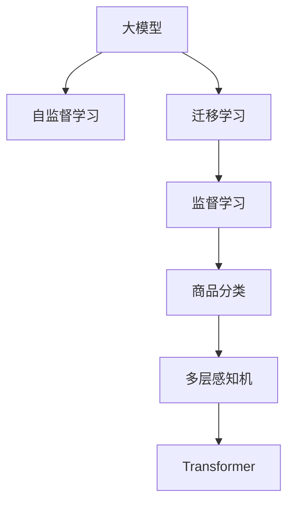

                 

# AI大模型在电商平台商品分类优化中的应用

> 关键词：电商、商品分类、优化、大模型、迁移学习、自监督学习、监督学习、MLP、Transformer

## 1. 背景介绍

### 1.1 问题由来
随着电子商务的迅猛发展，电商平台的海量商品数据分类成为制约用户体验和业务运营效率的重要问题。传统的手工分类方法，不仅耗时耗力，且容易受到主观因素的影响。而基于大模型的自动化分类方法，能够高效、准确地完成分类任务，提升电商平台的运营效率和服务质量。因此，本文聚焦于大模型在电商平台商品分类中的应用，探讨如何通过迁移学习、自监督学习等技术手段，优化分类模型，提升商品分类的准确率和效率。

### 1.2 问题核心关键点
电商商品分类问题涉及将商品数据进行归入不同类别，如服装、家电、图书等。其核心关键点包括：
- 数据质量：标注数据的准确性和完备性直接影响分类模型的效果。
- 模型复杂度：如何平衡模型复杂度和分类精度。
- 技术方法：选择何种技术方法进行分类，如监督学习、无监督学习、半监督学习等。
- 应用场景：如何在大模型基础上，针对具体电商场景进行微调，提升分类效果。

### 1.3 问题研究意义
通过优化电商商品分类模型，可以显著提升用户购物体验和平台运营效率。具体意义包括：
1. **提升用户购物体验**：准确的商品分类，能够快速找到用户需要的商品，减少购物时间和决策成本。
2. **提高平台运营效率**：自动化的分类系统能够减轻人工标注的负担，降低运营成本，提高分类速度。
3. **增强业务决策支持**：通过大数据分析，掌握商品销售趋势和用户偏好，优化商品推荐和促销策略，提高营销效果。
4. **促进电商创新**：分类模型的优化，有助于发现商品间的关联性，推动个性化推荐和跨品类推荐等业务创新。

## 2. 核心概念与联系

### 2.1 核心概念概述

为了更好地理解大模型在电商平台商品分类中的应用，本节将介绍几个关键概念：

- **大模型(Massive Model)**：如BERT、GPT等，指使用大规模数据进行预训练的深度学习模型，具备强大的语言表示能力和泛化能力。
- **迁移学习(Transfer Learning)**：将一个领域学习到的知识迁移到另一个领域，利用大模型进行预训练，再针对特定任务进行微调。
- **自监督学习(Self-supervised Learning)**：使用无标注数据进行预训练，通过自我监督任务学习模型参数，利用数据自身的结构信息。
- **监督学习(Supervised Learning)**：使用有标注数据进行微调，通过任务的监督信号调整模型参数。
- **多层感知机(Multilayer Perceptron, MLP)**：经典的前馈神经网络结构，常用于图像分类等任务。
- **Transformer**：近年来在NLP领域取得重大突破的模型结构，能够有效处理序列数据，广泛用于大模型的预训练。

这些概念之间的逻辑关系可以通过以下Mermaid流程图来展示：



这个流程图展示了大模型在商品分类任务中的应用流程：

1. 大模型通过自监督学习进行预训练。
2. 在特定任务上，通过迁移学习进行微调。
3. 在微调过程中，可以使用监督学习，也可以使用多模态输入，如图片、标签等。
4. 最终使用多层感知机或Transformer等模型结构，实现商品分类的高效优化。

## 3. 核心算法原理 & 具体操作步骤
### 3.1 算法原理概述

基于大模型的商品分类方法，本质上是一种迁移学习的应用。其核心思想是：将大模型在通用数据上预训练得到的知识，迁移到特定的商品分类任务中，通过监督学习或自监督学习进一步优化模型，使其能够在特定场景下高效准确地进行分类。

形式化地，假设大模型为 $M_{\theta}$，其中 $\theta$ 为预训练得到的模型参数。给定商品分类任务 $T$ 的标注数据集 $D=\{(x_i, y_i)\}_{i=1}^N$，分类模型的优化目标是最小化损失函数 $\mathcal{L}$，使得模型能够准确分类商品。具体而言，分类任务的损失函数可以表示为：

$$
\mathcal{L}(\theta) = \frac{1}{N} \sum_{i=1}^N \ell(y_i, M_{\theta}(x_i))
$$

其中 $\ell$ 为分类损失函数，$y_i$ 为商品的实际类别，$M_{\theta}(x_i)$ 为模型对输入 $x_i$ 的预测分类。

通过梯度下降等优化算法，微调过程不断更新模型参数 $\theta$，最小化损失函数 $\mathcal{L}$，使得模型输出逼近真实标签。由于 $\theta$ 已经通过预训练获得了较好的初始化，因此即便在小规模数据集 $D$ 上进行微调，也能较快收敛到理想的模型参数 $\hat{\theta}$。

### 3.2 算法步骤详解

基于大模型的商品分类方法一般包括以下几个关键步骤：

**Step 1: 准备预训练模型和数据集**
- 选择合适的预训练语言模型 $M_{\theta}$，如BERT、GPT等，作为初始化参数。
- 收集电商平台的商品描述和类别信息，准备训练集、验证集和测试集。训练集应包含足够的标注数据，验证集和测试集用于评估模型性能。

**Step 2: 添加任务适配层**
- 根据商品分类任务的特点，设计合适的输出层和损失函数。
- 对于分类任务，通常添加softmax分类器，使用交叉熵损失函数。
- 对于多类别分类任务，可能需要设计多路分支的多层感知机或Transformer结构。

**Step 3: 设置微调超参数**
- 选择合适的优化算法及其参数，如Adam、SGD等，设置学习率、批大小、迭代轮数等。
- 设置正则化技术及强度，包括权重衰减、Dropout、Early Stopping等。
- 确定冻结预训练参数的策略，如仅微调顶层，或全部参数都参与微调。

**Step 4: 执行梯度训练**
- 将训练集数据分批次输入模型，前向传播计算损失函数。
- 反向传播计算参数梯度，根据设定的优化算法和学习率更新模型参数。
- 周期性在验证集上评估模型性能，根据性能指标决定是否触发Early Stopping。
- 重复上述步骤直到满足预设的迭代轮数或Early Stopping条件。

**Step 5: 测试和部署**
- 在测试集上评估微调后模型 $M_{\hat{\theta}}$ 的性能，对比微调前后的精度提升。
- 使用微调后的模型对新商品进行分类预测，集成到实际的商品推荐系统或搜索系统中。
- 持续收集新的商品信息，定期重新微调模型，以适应数据分布的变化。

以上是基于大模型的商品分类方法的通用流程。在实际应用中，还需要针对具体商品分类任务的特殊需求，进行进一步的优化设计。

### 3.3 算法优缺点

基于大模型的商品分类方法具有以下优点：
1. 高效性：利用大模型丰富的语言知识和泛化能力，在少量标注数据下也能获得较好的分类效果。
2. 准确性：大模型的预训练和微调过程能够捕捉到商品描述中的关键信息，提升分类准确率。
3. 可扩展性：大模型易于在新的商品数据上快速适配，拓展分类能力。
4. 鲁棒性：大模型经过多领域预训练，具备较强的鲁棒性和泛化能力。

同时，该方法也存在一些局限性：
1. 依赖标注数据：需要高质量的商品描述和类别标签，标注成本较高。
2. 模型复杂度高：大模型通常参数量较大，需要较高级的计算资源支持。
3. 数据分布限制：商品数据分布和预训练数据的分布可能存在较大差异，影响微调效果。
4. 对抗性攻击：大模型可能对对抗性样本较为敏感，需要额外增加对抗训练。
5. 解释性不足：大模型的决策过程缺乏可解释性，难以进行调试和分析。

尽管存在这些局限性，但就目前而言，基于大模型的商品分类方法仍是目前电商领域的主流范式。未来相关研究的主要方向在于如何进一步降低对标注数据的依赖，提高模型的少样本学习和跨领域迁移能力，同时兼顾可解释性和伦理安全性等因素。

### 3.4 算法应用领域

大模型的商品分类方法在电商领域已经得到了广泛的应用，例如：

- **商品推荐系统**：利用商品分类结果，实现个性化推荐，提升用户购物体验。
- **搜索引擎优化(搜索引擎优化，SEO)**：通过商品分类，优化搜索结果，提升搜索精度和覆盖率。
- **库存管理**：根据商品分类结果，进行库存管理和补货策略优化。
- **广告投放**：利用商品分类结果，优化广告投放策略，提高广告转化率。

除了上述这些经典应用外，大模型的商品分类技术还被创新性地应用到更多场景中，如可控文本生成、跨品类推荐、用户行为分析等，为电商技术带来了全新的突破。随着预训练模型和商品分类方法的不断进步，相信大模型将会在更多电商应用场景中发挥重要作用，推动电商行业数字化转型升级。

## 4. 数学模型和公式 & 详细讲解
### 4.1 数学模型构建

本节将使用数学语言对大模型在商品分类任务中的应用进行更加严格的刻画。

记预训练语言模型为 $M_{\theta}$，其中 $\theta$ 为预训练得到的模型参数。假设商品分类任务 $T$ 的训练集为 $D=\{(x_i, y_i)\}_{i=1}^N$，$x_i$ 为商品描述，$y_i$ 为商品类别。分类模型的输出为 $M_{\theta}(x_i)$，为模型对输入 $x_i$ 的预测分类。

定义分类模型在数据样本 $(x,y)$ 上的损失函数为 $\ell(y_i, M_{\theta}(x_i))$，则在数据集 $D$ 上的经验风险为：

$$
\mathcal{L}(\theta) = \frac{1}{N} \sum_{i=1}^N \ell(y_i, M_{\theta}(x_i))
$$

常用的分类损失函数包括交叉熵损失函数，其表达式为：

$$
\ell(y_i, M_{\theta}(x_i)) = -y_i \log M_{\theta}(x_i) + (1-y_i) \log (1-M_{\theta}(x_i))
$$

将损失函数带入经验风险公式，得：

$$
\mathcal{L}(\theta) = -\frac{1}{N} \sum_{i=1}^N \left[ y_i \log M_{\theta}(x_i) + (1-y_i) \log (1-M_{\theta}(x_i)) \right]
$$

在得到损失函数的梯度后，即可带入参数更新公式，完成模型的迭代优化。

### 4.2 公式推导过程

以二分类任务为例，推导交叉熵损失函数及其梯度的计算公式。

假设模型 $M_{\theta}$ 在输入 $x_i$ 上的输出为 $\hat{y}=M_{\theta}(x_i) \in [0,1]$，表示样本属于正类的概率。真实标签 $y \in \{0,1\}$。则二分类交叉熵损失函数定义为：

$$
\ell(y_i, M_{\theta}(x_i)) = -[y_i\log \hat{y}_i + (1-y_i)\log (1-\hat{y}_i)]
$$

将其代入经验风险公式，得：

$$
\mathcal{L}(\theta) = -\frac{1}{N}\sum_{i=1}^N [y_i\log M_{\theta}(x_i)+(1-y_i)\log(1-M_{\theta}(x_i))]
$$

根据链式法则，损失函数对参数 $\theta_k$ 的梯度为：

$$
\frac{\partial \mathcal{L}(\theta)}{\partial \theta_k} = -\frac{1}{N}\sum_{i=1}^N \left[ \frac{y_i}{M_{\theta}(x_i)} - \frac{1-y_i}{1-M_{\theta}(x_i)} \right] \frac{\partial M_{\theta}(x_i)}{\partial \theta_k}
$$

其中 $\frac{\partial M_{\theta}(x_i)}{\partial \theta_k}$ 可进一步递归展开，利用自动微分技术完成计算。

在得到损失函数的梯度后，即可带入参数更新公式，完成模型的迭代优化。重复上述过程直至收敛，最终得到适应商品分类任务的最优模型参数 $\theta^*$。

## 5. 项目实践：代码实例和详细解释说明
### 5.1 开发环境搭建

在进行商品分类实践前，我们需要准备好开发环境。以下是使用Python进行PyTorch开发的环境配置流程：

1. 安装Anaconda：从官网下载并安装Anaconda，用于创建独立的Python环境。

2. 创建并激活虚拟环境：
```bash
conda create -n pytorch-env python=3.8 
conda activate pytorch-env
```

3. 安装PyTorch：根据CUDA版本，从官网获取对应的安装命令。例如：
```bash
conda install pytorch torchvision torchaudio cudatoolkit=11.1 -c pytorch -c conda-forge
```

4. 安装TensorFlow：
```bash
pip install tensorflow
```

5. 安装各类工具包：
```bash
pip install numpy pandas scikit-learn matplotlib tqdm jupyter notebook ipython
```

完成上述步骤后，即可在`pytorch-env`环境中开始商品分类实践。

### 5.2 源代码详细实现

下面我们以商品分类任务为例，给出使用PyTorch对BERT模型进行商品分类的PyTorch代码实现。

首先，定义商品分类任务的数据处理函数：

```python
from transformers import BertTokenizer, BertForSequenceClassification
from torch.utils.data import Dataset, DataLoader
import torch

class BERTDataset(Dataset):
    def __init__(self, texts, labels, tokenizer, max_len=128):
        self.texts = texts
        self.labels = labels
        self.tokenizer = tokenizer
        self.max_len = max_len
        
    def __len__(self):
        return len(self.texts)
    
    def __getitem__(self, item):
        text = self.texts[item]
        label = self.labels[item]
        
        encoding = self.tokenizer(text, return_tensors='pt', max_length=self.max_len, padding='max_length', truncation=True)
        input_ids = encoding['input_ids'][0]
        attention_mask = encoding['attention_mask'][0]
        
        # 对label进行编码
        encoded_labels = [label2id[label] for label in label2id]
        labels = torch.tensor(encoded_labels, dtype=torch.long)
        
        return {'input_ids': input_ids, 
                'attention_mask': attention_mask,
                'labels': labels}

# 标签与id的映射
label2id = {'clothing': 0, 'home': 1, 'electronics': 2, 'food': 3, 'sports': 4}
id2label = {v: k for k, v in label2id.items()}

# 创建dataset
tokenizer = BertTokenizer.from_pretrained('bert-base-cased')

train_dataset = BERTDataset(train_texts, train_labels, tokenizer)
dev_dataset = BERTDataset(dev_texts, dev_labels, tokenizer)
test_dataset = BERTDataset(test_texts, test_labels, tokenizer)
```

然后，定义模型和优化器：

```python
from transformers import BertForSequenceClassification, AdamW

model = BertForSequenceClassification.from_pretrained('bert-base-cased', num_labels=len(label2id))

optimizer = AdamW(model.parameters(), lr=2e-5)
```

接着，定义训练和评估函数：

```python
from sklearn.metrics import classification_report

device = torch.device('cuda') if torch.cuda.is_available() else torch.device('cpu')
model.to(device)

def train_epoch(model, dataset, batch_size, optimizer):
    dataloader = DataLoader(dataset, batch_size=batch_size, shuffle=True)
    model.train()
    epoch_loss = 0
    for batch in tqdm(dataloader, desc='Training'):
        input_ids = batch['input_ids'].to(device)
        attention_mask = batch['attention_mask'].to(device)
        labels = batch['labels'].to(device)
        model.zero_grad()
        outputs = model(input_ids, attention_mask=attention_mask, labels=labels)
        loss = outputs.loss
        epoch_loss += loss.item()
        loss.backward()
        optimizer.step()
    return epoch_loss / len(dataloader)

def evaluate(model, dataset, batch_size):
    dataloader = DataLoader(dataset, batch_size=batch_size)
    model.eval()
    preds, labels = [], []
    with torch.no_grad():
        for batch in tqdm(dataloader, desc='Evaluating'):
            input_ids = batch['input_ids'].to(device)
            attention_mask = batch['attention_mask'].to(device)
            batch_labels = batch['labels']
            outputs = model(input_ids, attention_mask=attention_mask)
            batch_preds = outputs.logits.argmax(dim=1).to('cpu').tolist()
            batch_labels = batch_labels.to('cpu').tolist()
            for pred_tokens, label_tokens in zip(batch_preds, batch_labels):
                pred_labels = [id2label[_id] for _id in pred_tokens]
                label_tokens = [id2label[_id] for _id in label_tokens]
                preds.append(pred_labels[:len(label_tokens)])
                labels.append(label_tokens)
                
    print(classification_report(labels, preds))
```

最后，启动训练流程并在测试集上评估：

```python
epochs = 5
batch_size = 16

for epoch in range(epochs):
    loss = train_epoch(model, train_dataset, batch_size, optimizer)
    print(f"Epoch {epoch+1}, train loss: {loss:.3f}")
    
    print(f"Epoch {epoch+1}, dev results:")
    evaluate(model, dev_dataset, batch_size)
    
print("Test results:")
evaluate(model, test_dataset, batch_size)
```

以上就是使用PyTorch对BERT进行商品分类任务微调的完整代码实现。可以看到，得益于Transformers库的强大封装，我们可以用相对简洁的代码完成BERT模型的加载和微调。

### 5.3 代码解读与分析

让我们再详细解读一下关键代码的实现细节：

**BERTDataset类**：
- `__init__`方法：初始化文本、标签、分词器等关键组件。
- `__len__`方法：返回数据集的样本数量。
- `__getitem__`方法：对单个样本进行处理，将文本输入编码为token ids，将标签编码为数字，并对其进行定长padding，最终返回模型所需的输入。

**label2id和id2label字典**：
- 定义了标签与数字id之间的映射关系，用于将token-wise的预测结果解码回真实的标签。

**训练和评估函数**：
- 使用PyTorch的DataLoader对数据集进行批次化加载，供模型训练和推理使用。
- 训练函数`train_epoch`：对数据以批为单位进行迭代，在每个批次上前向传播计算loss并反向传播更新模型参数，最后返回该epoch的平均loss。
- 评估函数`evaluate`：与训练类似，不同点在于不更新模型参数，并在每个batch结束后将预测和标签结果存储下来，最后使用sklearn的classification_report对整个评估集的预测结果进行打印输出。

**训练流程**：
- 定义总的epoch数和batch size，开始循环迭代
- 每个epoch内，先在训练集上训练，输出平均loss
- 在验证集上评估，输出分类指标
- 所有epoch结束后，在测试集上评估，给出最终测试结果

可以看到，PyTorch配合Transformers库使得BERT微调的代码实现变得简洁高效。开发者可以将更多精力放在数据处理、模型改进等高层逻辑上，而不必过多关注底层的实现细节。

当然，工业级的系统实现还需考虑更多因素，如模型的保存和部署、超参数的自动搜索、更灵活的任务适配层等。但核心的微调范式基本与此类似。

## 6. 实际应用场景
### 6.1 智能客服系统

利用大模型进行商品分类，可以应用于智能客服系统的构建。传统客服往往需要配备大量人力，高峰期响应缓慢，且一致性和专业性难以保证。而使用商品分类模型对用户问题进行分类，能够快速匹配合适的客服人员或生成预回复，提升客服系统的响应速度和质量。

在技术实现上，可以收集用户提问数据，标注不同类型的问题，如查询商品信息、投诉商品质量、询问物流状态等。在此基础上对预训练分类模型进行微调，使其能够自动识别用户问题类型。对于不同的问题类型，可以自动调用相应的预回复模板，或由真人客服进一步解答。如此构建的智能客服系统，能大幅提升客服响应速度和效率。

### 6.2 库存管理

准确的商品分类是库存管理的基础。通过大模型进行商品分类，电商企业可以更精确地统计各品类商品的库存情况，及时进行补货和库存调整。例如，利用商品分类结果，可以实时监控畅销商品的库存状态，避免库存积压或短缺。同时，也可以根据分类结果优化供应链管理，提高采购和物流效率。

### 6.3 个性化推荐系统

基于大模型的商品分类，可以实现个性化推荐。推荐系统可以根据用户的历史浏览和购买记录，利用分类模型识别用户兴趣，推荐相关商品。例如，对于喜欢运动类商品的用户，可以推荐运动装备、运动服饰等，提升用户购物体验。同时，还可以结合商品属性和用户偏好，生成动态的推荐结果，提高推荐效果。

### 6.4 未来应用展望

随着大模型和商品分类技术的不断发展，基于大模型的商品分类方法将迎来更多创新应用，为电商行业带来深远影响。

在智慧物流领域，基于大模型的商品分类技术可以用于自动化的仓库管理，实现商品的自动分拣和库存盘库，提高物流效率。

在智能广告投放中，商品分类模型可以用于目标用户的精准定位，提升广告投放的效果和转化率。

在消费者行为分析中，通过商品分类数据，可以深入挖掘用户的消费习惯和偏好，推动精准营销和产品创新。

此外，在供应链管理、跨境电商、智慧零售等众多领域，基于大模型的商品分类技术也将不断涌现，为电商行业带来新的突破。相信随着技术的日益成熟，大模型商品分类必将在电商应用场景中发挥越来越重要的作用，推动电商行业数字化转型升级。

## 7. 工具和资源推荐
### 7.1 学习资源推荐

为了帮助开发者系统掌握大模型在电商商品分类中的应用，这里推荐一些优质的学习资源：

1. 《Transformer from the ground up》系列博文：由大模型技术专家撰写，深入浅出地介绍了Transformer原理、BERT模型、商品分类任务等前沿话题。

2. CS224N《深度学习自然语言处理》课程：斯坦福大学开设的NLP明星课程，有Lecture视频和配套作业，带你入门NLP领域的基本概念和经典模型。

3. 《Natural Language Processing with Transformers》书籍：Transformers库的作者所著，全面介绍了如何使用Transformers库进行NLP任务开发，包括商品分类在内的诸多范式。

4. HuggingFace官方文档：Transformers库的官方文档，提供了海量预训练模型和完整的商品分类样例代码，是上手实践的必备资料。

5. Kaggle商品分类竞赛：提供了大量商品分类数据集，鼓励开发者通过比赛练习商品分类技能，掌握大模型的应用。

通过对这些资源的学习实践，相信你一定能够快速掌握大模型在商品分类中的应用精髓，并用于解决实际的电商问题。
###  7.2 开发工具推荐

高效的开发离不开优秀的工具支持。以下是几款用于大模型商品分类开发的常用工具：

1. PyTorch：基于Python的开源深度学习框架，灵活动态的计算图，适合快速迭代研究。大部分预训练语言模型都有PyTorch版本的实现。

2. TensorFlow：由Google主导开发的开源深度学习框架，生产部署方便，适合大规模工程应用。同样有丰富的预训练语言模型资源。

3. Transformers库：HuggingFace开发的NLP工具库，集成了众多SOTA语言模型，支持PyTorch和TensorFlow，是进行商品分类任务的开发的利器。

4. Weights & Biases：模型训练的实验跟踪工具，可以记录和可视化模型训练过程中的各项指标，方便对比和调优。与主流深度学习框架无缝集成。

5. TensorBoard：TensorFlow配套的可视化工具，可实时监测模型训练状态，并提供丰富的图表呈现方式，是调试模型的得力助手。

6. Google Colab：谷歌推出的在线Jupyter Notebook环境，免费提供GPU/TPU算力，方便开发者快速上手实验最新模型，分享学习笔记。

合理利用这些工具，可以显著提升大模型商品分类任务的开发效率，加快创新迭代的步伐。

### 7.3 相关论文推荐

大模型商品分类技术的发展源于学界的持续研究。以下是几篇奠基性的相关论文，推荐阅读：

1. Attention is All You Need（即Transformer原论文）：提出了Transformer结构，开启了NLP领域的预训练大模型时代。

2. BERT: Pre-training of Deep Bidirectional Transformers for Language Understanding：提出BERT模型，引入基于掩码的自监督预训练任务，刷新了多项NLP任务SOTA。

3. Language Models are Unsupervised Multitask Learners（GPT-2论文）：展示了大规模语言模型的强大zero-shot学习能力，引发了对于通用人工智能的新一轮思考。

4. Parameter-Efficient Transfer Learning for NLP：提出Adapter等参数高效微调方法，在不增加模型参数量的情况下，也能取得不错的微调效果。

5. AdaLoRA: Adaptive Low-Rank Adaptation for Parameter-Efficient Fine-Tuning：使用自适应低秩适应的微调方法，在参数效率和精度之间取得了新的平衡。

这些论文代表了大模型商品分类技术的发展脉络。通过学习这些前沿成果，可以帮助研究者把握学科前进方向，激发更多的创新灵感。

## 8. 总结：未来发展趋势与挑战

### 8.1 总结

本文对大模型在电商平台商品分类中的应用进行了全面系统的介绍。首先阐述了大模型和商品分类的研究背景和意义，明确了商品分类在大模型微调中的应用价值。其次，从原理到实践，详细讲解了大模型商品分类的数学原理和关键步骤，给出了商品分类任务开发的完整代码实例。同时，本文还广泛探讨了大模型商品分类在智能客服、库存管理、个性化推荐等多个电商领域的应用前景，展示了商品分类方法的巨大潜力。此外，本文精选了商品分类任务的各类学习资源，力求为读者提供全方位的技术指引。

通过本文的系统梳理，可以看到，大模型商品分类方法在电商领域已经得到了广泛的应用，成为电商运营的重要技术手段。受益于大规模语料的预训练，商品分类模型在少量标注数据下也能获得较优的表现，显著提升了电商平台的运营效率和服务质量。未来，伴随大模型和商品分类技术的不断进步，相信大模型将在更多电商应用场景中发挥重要作用，推动电商行业数字化转型升级。

### 8.2 未来发展趋势

展望未来，大模型商品分类技术将呈现以下几个发展趋势：

1. **模型规模持续增大**：随着算力成本的下降和数据规模的扩张，大模型预训练的参数量还将持续增长。超大规模语言模型蕴含的丰富语言知识，将支撑更加复杂多变的商品分类任务。

2. **商品分类多模态融合**：未来的商品分类不仅依赖文本数据，还将融合图像、声音、视频等多模态信息，构建更全面的商品理解模型。例如，通过图片分类辅助商品标签提取，提升分类精度。

3. **迁移学习范式多样化**：除了传统的监督学习，未来将涌现更多迁移学习方法，如自监督学习、半监督学习、零样本学习等，降低商品分类对标注数据的需求。

4. **跨领域迁移能力增强**：大模型商品分类将能够跨领域迁移，应用于更多垂直领域的商品分类，如医疗、教育、旅游等。

5. **模型解释性和鲁棒性提升**：未来的商品分类模型将具备更强的可解释性，能够清晰展示分类过程和决策依据。同时，模型也将具备更高的鲁棒性，能够抵御对抗性攻击和噪音干扰。

6. **知识图谱和常识推理的应用**：商品分类模型将与知识图谱和常识推理技术结合，增强模型对商品的语义理解和推理能力，提升分类的全面性和准确性。

以上趋势凸显了大模型商品分类技术的广阔前景。这些方向的探索发展，必将进一步提升电商平台的运营效率和服务质量，为电商行业带来更广阔的发展空间。

### 8.3 面临的挑战

尽管大模型商品分类技术已经取得了瞩目成就，但在迈向更加智能化、普适化应用的过程中，它仍面临着诸多挑战：

1. **标注成本瓶颈**：高质量的商品描述和标签标注需要耗费大量人力物力，标注成本较高。如何降低标注成本，提升标注质量，将是未来的一个重要研究方向。

2. **模型鲁棒性不足**：商品数据和预训练数据的分布可能存在较大差异，大模型在面对域外数据时，泛化性能往往大打折扣。如何提高模型的鲁棒性，避免灾难性遗忘，还需要更多理论和实践的积累。

3. **数据分布限制**：商品数据分布和预训练数据的分布可能存在较大差异，影响微调效果。如何进一步降低商品分类对标注数据的依赖，提高模型的跨领域迁移能力，将是未来的重要研究方向。

4. **对抗性攻击风险**：大模型可能对对抗性样本较为敏感，需要额外增加对抗训练。如何增强模型的鲁棒性，抵御对抗性攻击，将是重要的研究方向。

5. **知识整合能力不足**：现有的商品分类模型往往局限于商品数据，难以灵活吸收和运用更广泛的先验知识。如何让大模型商品分类过程更好地与外部知识库、规则库等专家知识结合，形成更加全面、准确的信息整合能力，还有很大的想象空间。

6. **可解释性和公平性问题**：大模型的决策过程缺乏可解释性，难以进行调试和分析。同时，大模型商品分类模型可能学习到商品标签中的偏见和歧视，需要额外设计和监测公平性指标。

尽管存在这些挑战，但随着大模型和商品分类技术的不断进步，相信这些挑战终将一一被克服，大模型商品分类必将在电商领域发挥更大的作用，推动电商行业数字化转型升级。未来，我们需要在模型优化、标注改进、应用拓展等方面进行更多研究，才能使大模型商品分类技术真正落地应用，助力电商行业的持续发展。

### 8.4 研究展望

未来，大模型商品分类技术的研究方向包括但不限于以下几个方面：

1. **少样本和零样本学习**：如何在少量标注数据下进行商品分类，甚至在没有标注数据的情况下，通过类比、迁移等方式进行分类，将是重要的研究方向。

2. **跨领域迁移学习**：如何将大模型商品分类技术应用于其他垂直领域，如医疗、教育、旅游等，进行商品分类，提升垂直领域的数据处理能力。

3. **多模态融合**：如何通过多模态数据融合，提升商品分类的准确性和鲁棒性，将是未来的一个重要研究方向。

4. **知识图谱应用**：如何将知识图谱与大模型商品分类模型结合，增强模型的知识整合能力和语义理解能力，提升分类的全面性和准确性。

5. **模型公平性和解释性**：如何在商品分类模型中加入公平性约束，防止模型输出中的偏见和歧视。同时，如何提升模型的可解释性，增强用户信任，也是未来的一个重要研究方向。

6. **数据增强和对抗训练**：如何通过数据增强和对抗训练等手段，提升商品分类模型的泛化能力和鲁棒性，将是未来的一个重要研究方向。

通过在这些方向上的持续探索，相信大模型商品分类技术将更加成熟和稳定，为电商行业带来更广泛的应用和更深刻的影响。未来，我们需要更多跨学科的合作和协同创新，才能将大模型商品分类技术推向更高的台阶，实现其在电商领域的应用价值。

## 9. 附录：常见问题与解答

**Q1：大模型商品分类是否适用于所有电商场景？**

A: 大模型商品分类在大多数电商场景中都能取得较好的效果，特别是对于有大量商品数据的应用。但对于某些特定场景，如冷门商品、品牌商品等，由于缺乏足够的标注数据，可能难以获得理想的分类效果。此时需要在特定领域语料上进一步预训练，再进行微调，才能获得理想效果。

**Q2：如何选择合适的学习率？**

A: 商品分类任务中，合适的学习率通常比预训练时更小，一般在1e-5到5e-5之间。如果使用过大的学习率，容易破坏预训练权重，导致过拟合。一般建议从1e-5开始调参，逐步减小学习率，直至收敛。也可以使用warmup策略，在开始阶段使用较小的学习率，再逐渐过渡到预设值。需要注意的是，不同的优化器(如Adam、SGD等)以及不同的学习率调度策略，可能需要设置不同的学习率阈值。

**Q3：大模型商品分类面临哪些资源瓶颈？**

A: 大模型商品分类任务需要较大的计算资源和存储空间，特别是在模型参数量较大的情况下。因此，优化模型结构、采用混合精度训练、使用分布式训练等技术手段，是提高大模型商品分类性能的重要方向。

**Q4：如何缓解大模型商品分类的过拟合问题？**

A: 过拟合是商品分类面临的主要挑战，特别是在标注数据不足的情况下。常见的缓解策略包括：
1. 数据增强：通过回译、近义替换等方式扩充训练集
2. 正则化：使用L2正则、Dropout、Early Stopping等避免过拟合
3. 对抗训练：引入对抗样本，提高模型鲁棒性
4. 参数高效微调：只调整少量参数(如Adapter、Prefix等)，减小过拟合风险
5. 多模型集成：训练多个商品分类模型，取平均输出，抑制过拟合

这些策略往往需要根据具体任务和数据特点进行灵活组合。只有在数据、模型、训练、推理等各环节进行全面优化，才能最大限度地发挥大模型商品分类的威力。

**Q5：如何提高大模型商品分类的可解释性？**

A: 大模型的决策过程缺乏可解释性，难以进行调试和分析。可以通过引入因果分析、模型可视化等技术手段，提升模型的可解释性。例如，通过分析模型特征重要性，找出对分类影响较大的特征，增强模型的可解释性。

**Q6：如何确保大模型商品分类的公平性？**

A: 大模型商品分类模型可能学习到商品标签中的偏见和歧视，需要额外设计和监测公平性指标。可以通过引入公平性约束，如对抗性公平、受保护属性公平等，确保模型输出符合公平性要求。同时，可以通过数据增强、模型微调等手段，减小模型的偏见和歧视。

通过这些问题的探讨，希望能够更好地理解大模型在电商商品分类中的应用，进一步提升电商平台的运营效率和服务质量。未来，随着大模型和商品分类技术的不断进步，相信大模型将在电商领域发挥更大的作用，推动电商行业数字化转型升级。

