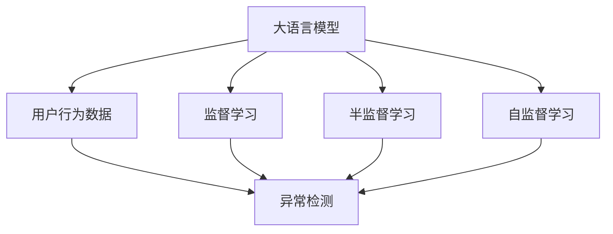

                 

## 1. 背景介绍

在电商平台的发展过程中，用户行为分析发挥着至关重要的作用。用户行为数据不仅可以用于提高电商平台的个性化推荐、用户增长、流量优化等策略，还能帮助平台发现潜在的风险，如欺诈交易、广告作弊等。然而，电商平台的运营模式和市场环境的复杂性，导致用户行为数据的海量性和多维性，使得传统的数据分析方法难以有效处理。近年来，随着深度学习技术的发展，大语言模型在电商平台用户行为分析中的应用逐渐引起了业界的关注。

### 1.1 问题由来

电商平台用户行为分析的核心目标在于，通过分析和理解用户的购买行为、浏览行为、搜索行为等数据，发现潜在风险和优化运营策略。然而，电商平台的数据具有以下特点：

- **数据量大**：电商平台每天产生的海量交易数据，包含了用户的浏览记录、购物记录、评价信息等，数据量常常以TB为单位。
- **数据维度高**：用户行为数据不仅包含传统的数值型数据，还涉及文本型数据、时序数据等多种数据类型。
- **数据质量参差不齐**：电商平台上存在噪声数据、异常数据等问题，数据质量难以保障。
- **数据实时性要求高**：为了及时发现异常行为和优化运营策略，电商平台需要实时处理和分析用户行为数据。

这些特点使得电商平台的用户行为分析变得复杂和困难。传统的统计分析方法，如基于规则的方法、基于模型的统计方法等，难以应对电商平台的动态数据和复杂需求。近年来，随着大语言模型在自然语言处理领域的突破，其应用范围逐步扩展到电商平台用户行为分析，并逐渐展现出了强大的潜力。

## 2. 核心概念与联系

### 2.1 核心概念概述

为了更好地理解大语言模型在电商平台用户行为异常检测中的应用，我们先介绍几个核心概念：

- **大语言模型**：大语言模型指的是通过自监督或监督学习的方式，在大规模文本数据上预训练得到的模型。典型的大语言模型包括BERT、GPT、T5等。
- **用户行为异常检测**：指通过分析和理解用户的购买行为、浏览行为、搜索行为等数据，发现异常行为的过程。异常行为可能是欺诈交易、广告作弊等，也可能是个性化推荐中的异常推荐。
- **监督学习**：通过标注数据，训练模型进行有监督学习，以识别异常行为。监督学习的关键在于选择合适的特征和算法。
- **半监督学习**：在少量标注数据和大量未标注数据上，训练模型进行学习，以识别异常行为。半监督学习能够充分利用未标注数据，提高模型的泛化能力。
- **自监督学习**：利用未标注数据，通过模型自身的自我监督机制进行学习，以识别异常行为。自监督学习能够从数据中挖掘出更多有用的信息。

这些核心概念之间的逻辑关系可以通过以下Mermaid流程图来展示：



这个流程图展示了大语言模型在电商平台用户行为异常检测中的核心概念及其之间的关系：

1. 大语言模型通过预训练获得基础能力。
2. 监督学习、半监督学习、自监督学习等方式，使模型学习到用户行为中的异常特征。
3. 异常检测任务，识别和标注出用户行为中的异常行为。
4. 异常检测的结果可以进一步用于电商平台的运营策略优化和风险控制。

## 3. 核心算法原理 & 具体操作步骤

### 3.1 算法原理概述

在电商平台中，用户行为异常检测通常采用监督学习或半监督学习的方式，通过大语言模型实现。其核心思想是：利用大语言模型的预训练能力，通过标注数据或未标注数据，训练模型识别用户行为中的异常行为。

形式化地，假设大语言模型为 $M_{\theta}$，其中 $\theta$ 为模型参数。用户行为数据为 $D=\{(x_i, y_i)\}_{i=1}^N$，其中 $x_i$ 为用户行为数据，$y_i$ 为标注的异常标签（0表示正常行为，1表示异常行为）。模型的目标是通过有监督学习或半监督学习，优化模型参数 $\theta$，使得模型能够准确识别用户行为中的异常行为。

具体而言，假设模型在输入 $x_i$ 上的预测输出为 $\hat{y}$，则异常检测的目标函数为：

$$
\mathcal{L}(M_{\theta},D) = \frac{1}{N}\sum_{i=1}^N \ell(\hat{y},y_i)
$$

其中 $\ell(\hat{y},y_i)$ 为损失函数，如交叉熵损失、均方误差损失等，用于衡量模型预测输出与真实标签之间的差异。通过最小化损失函数，使得模型能够准确预测用户行为的异常标签。

### 3.2 算法步骤详解

基于监督学习的大语言模型在电商平台用户行为异常检测中，通常包括以下几个关键步骤：

**Step 1: 准备数据集和模型**

- 收集电商平台的用户行为数据，包括用户的浏览记录、购物记录、评价信息等。
- 标注数据集 $D$，划分为训练集、验证集和测试集。标注数据集应该覆盖不同类型、不同维度的用户行为数据。
- 选择合适的大语言模型 $M_{\theta}$，如BERT、GPT等。模型应该具备强大的语言理解和生成能力，能够处理多种类型的用户行为数据。

**Step 2: 特征提取**

- 对用户行为数据进行预处理，包括数据清洗、特征选择、特征提取等。例如，将用户浏览记录转化为词向量表示，将购物记录转化为时间序列特征。
- 利用大语言模型的预训练能力，提取用户行为的高级语义特征。例如，通过微调BERT模型，获取用户行为的上下文信息。

**Step 3: 训练模型**

- 选择合适的损失函数 $\ell(\hat{y},y_i)$，如交叉熵损失、均方误差损失等。
- 使用监督学习算法，如梯度下降、Adam等，训练模型 $M_{\theta}$。确保模型能够准确预测用户行为的异常标签。
- 在验证集上评估模型性能，避免过拟合。例如，使用准确率、召回率、F1值等指标评估模型的效果。

**Step 4: 应用模型**

- 将训练好的模型 $M_{\theta}$ 应用到新的用户行为数据上，识别和标注异常行为。
- 利用模型的输出结果，进行风险控制和运营策略优化。例如，对于高风险用户行为，进行二次审核；对于低风险用户行为，进行个性化推荐。

### 3.3 算法优缺点

基于监督学习的大语言模型在电商平台用户行为异常检测中，具有以下优点：

1. **精度高**：大语言模型通过预训练获得强大的语言理解和生成能力，能够提取用户行为的高级语义特征，提高异常检测的精度。
2. **适应性强**：大语言模型能够处理多种类型的用户行为数据，适应电商平台复杂多样的数据环境。
3. **可扩展性好**：大语言模型可以在不同规模的电商平台中应用，具有很好的可扩展性。
4. **处理能力强**：大语言模型可以处理大规模的用户行为数据，具有很好的处理能力。

同时，该方法也存在一定的局限性：

1. **标注成本高**：监督学习需要大量标注数据，标注成本较高。
2. **模型复杂度高**：大语言模型的复杂度高，训练和推理成本较高。
3. **泛化能力受限**：在标注数据不足或标注质量不高的情况下，模型泛化能力较弱。
4. **数据隐私问题**：用户行为数据包含敏感信息，模型的训练和应用需要考虑数据隐私和安全问题。

尽管存在这些局限性，但就目前而言，基于监督学习的微调方法仍是大语言模型应用的主流范式。未来相关研究的重点在于如何进一步降低标注数据的需求，提高模型的泛化能力，同时兼顾数据隐私和安全等因素。

### 3.4 算法应用领域

基于大语言模型用户行为异常检测方法，已经在电商平台中得到了广泛的应用，涵盖了以下多个方面：

- **欺诈交易检测**：利用大语言模型识别用户购买行为中的欺诈特征，如虚假交易、恶意退款等。
- **广告作弊检测**：利用大语言模型识别广告中的虚假信息、伪造用户数据等行为。
- **个性化推荐优化**：利用大语言模型识别用户行为中的异常推荐，优化推荐算法。
- **流量优化**：利用大语言模型识别用户行为中的异常流量，优化电商平台的用户流量分配策略。

除了上述这些应用外，大语言模型还可以在电商平台的其他领域中得到应用，如用户画像构建、搜索体验优化等，为电商平台的运营策略优化和风险控制提供新的技术手段。

## 4. 数学模型和公式 & 详细讲解 & 举例说明

### 4.1 数学模型构建

在电商平台用户行为异常检测中，我们通常使用二分类任务作为目标。假设用户行为数据 $x_i$ 经过特征提取后，转化为向量 $\vec{x_i}$。设 $y_i \in \{0,1\}$，表示用户行为 $x_i$ 是否为异常行为。则异常检测的任务可以表示为二分类问题，模型 $M_{\theta}$ 的输出 $\hat{y_i} = M_{\theta}(\vec{x_i})$。

### 4.2 公式推导过程

我们以基于BERT的二分类异常检测为例，推导其模型的损失函数和梯度更新公式。

假设模型在输入 $\vec{x_i}$ 上的输出为 $\hat{y_i} = M_{\theta}(\vec{x_i})$，表示用户行为 $x_i$ 为异常行为的概率。定义交叉熵损失函数为：

$$
\ell(\hat{y},y) = -[y\log\hat{y} + (1-y)\log(1-\hat{y})]
$$

将交叉熵损失函数应用到训练集 $D$ 上的经验风险为：

$$
\mathcal{L}(\theta) = \frac{1}{N}\sum_{i=1}^N \ell(\hat{y_i},y_i)
$$

利用梯度下降算法优化损失函数 $\mathcal{L}(\theta)$，得到模型参数 $\theta$ 的更新公式为：

$$
\theta \leftarrow \theta - \eta \nabla_{\theta}\mathcal{L}(\theta)
$$

其中 $\eta$ 为学习率。

在训练过程中，为了提高模型的泛化能力，通常会引入正则化技术，如L2正则、Dropout等。例如，在损失函数中引入L2正则项：

$$
\mathcal{L}_{reg}(\theta) = \frac{\lambda}{N}\sum_{i=1}^N (\|\theta_i\|_2^2)
$$

其中 $\lambda$ 为正则化系数，$\theta_i$ 为模型参数。

综合考虑损失函数和正则化项，得到最终的损失函数为：

$$
\mathcal{L}(\theta) = \mathcal{L}(\theta) + \mathcal{L}_{reg}(\theta)
$$

在模型训练过程中，为了进一步提高模型的泛化能力，通常会引入对抗训练、数据增强等技术。例如，在输入中加入对抗样本，使得模型更加鲁棒：

$$
\mathcal{L}_{adv}(\theta) = \frac{1}{N}\sum_{i=1}^N \ell(\hat{y_i},y_i) + \alpha\mathcal{L}_{adv}(x_i)
$$

其中 $\alpha$ 为对抗样本的权重系数，$\mathcal{L}_{adv}(x_i)$ 为对抗样本的损失函数。

### 4.3 案例分析与讲解

以电商平台欺诈交易检测为例，分析如何利用大语言模型进行异常检测。

假设电商平台的用户行为数据包含用户的浏览记录、购买记录、评价信息等。我们可以将用户浏览记录转化为词向量表示，将购买记录转化为时间序列特征。然后，利用BERT模型对用户行为数据进行预训练，提取高级语义特征。最后，使用二分类任务作为目标，训练模型 $M_{\theta}$ 识别欺诈交易。

具体步骤如下：

1. 收集电商平台的用户行为数据，划分为训练集、验证集和测试集。标注数据集 $D$ 应该覆盖不同类型、不同维度的用户行为数据。
2. 利用BERT模型对用户行为数据进行预训练，提取高级语义特征。
3. 将预训练后的用户行为数据输入模型 $M_{\theta}$，输出 $\hat{y_i}$。
4. 利用交叉熵损失函数计算损失 $\mathcal{L}(\theta)$，并使用梯度下降算法优化模型参数 $\theta$。
5. 在验证集上评估模型性能，避免过拟合。
6. 将训练好的模型 $M_{\theta}$ 应用到新的用户行为数据上，识别和标注欺诈交易。

通过上述步骤，利用大语言模型在电商平台中实现欺诈交易检测，可以显著提高检测的精度和效率。

## 5. 项目实践：代码实例和详细解释说明

### 5.1 开发环境搭建

在进行电商平台用户行为异常检测的实践前，我们需要准备好开发环境。以下是使用Python进行PyTorch开发的环境配置流程：

1. 安装Anaconda：从官网下载并安装Anaconda，用于创建独立的Python环境。

2. 创建并激活虚拟环境：
```bash
conda create -n pytorch-env python=3.8 
conda activate pytorch-env
```

3. 安装PyTorch：根据CUDA版本，从官网获取对应的安装命令。例如：
```bash
conda install pytorch torchvision torchaudio cudatoolkit=11.1 -c pytorch -c conda-forge
```

4. 安装Transformers库：
```bash
pip install transformers
```

5. 安装各类工具包：
```bash
pip install numpy pandas scikit-learn matplotlib tqdm jupyter notebook ipython
```

完成上述步骤后，即可在`pytorch-env`环境中开始项目实践。

### 5.2 源代码详细实现

下面我们以电商平台欺诈交易检测为例，给出使用Transformers库对BERT模型进行二分类异常检测的PyTorch代码实现。

首先，定义模型和数据处理函数：

```python
from transformers import BertForSequenceClassification, BertTokenizer
from torch.utils.data import Dataset, DataLoader
import torch

class FraudDetectionDataset(Dataset):
    def __init__(self, texts, labels, tokenizer, max_len=128):
        self.texts = texts
        self.labels = labels
        self.tokenizer = tokenizer
        self.max_len = max_len
        
    def __len__(self):
        return len(self.texts)
    
    def __getitem__(self, item):
        text = self.texts[item]
        label = self.labels[item]
        
        encoding = self.tokenizer(text, return_tensors='pt', max_length=self.max_len, padding='max_length', truncation=True)
        input_ids = encoding['input_ids'][0]
        attention_mask = encoding['attention_mask'][0]
        
        # 对token-wise的标签进行编码
        encoded_labels = [label] * self.max_len
        encoded_labels = torch.tensor(encoded_labels, dtype=torch.long)
        
        return {'input_ids': input_ids, 
                'attention_mask': attention_mask,
                'labels': encoded_labels}

# 标签与id的映射
label2id = {'normal': 0, 'fraud': 1}
id2label = {v: k for k, v in label2id.items()}

# 创建dataset
tokenizer = BertTokenizer.from_pretrained('bert-base-uncased')

train_dataset = FraudDetectionDataset(train_texts, train_labels, tokenizer)
dev_dataset = FraudDetectionDataset(dev_texts, dev_labels, tokenizer)
test_dataset = FraudDetectionDataset(test_texts, test_labels, tokenizer)
```

然后，定义模型和优化器：

```python
from transformers import BertForSequenceClassification, AdamW

model = BertForSequenceClassification.from_pretrained('bert-base-uncased', num_labels=len(label2id))

optimizer = AdamW(model.parameters(), lr=2e-5)
```

接着，定义训练和评估函数：

```python
from torch.utils.data import DataLoader
from tqdm import tqdm
from sklearn.metrics import classification_report

device = torch.device('cuda') if torch.cuda.is_available() else torch.device('cpu')
model.to(device)

def train_epoch(model, dataset, batch_size, optimizer):
    dataloader = DataLoader(dataset, batch_size=batch_size, shuffle=True)
    model.train()
    epoch_loss = 0
    for batch in tqdm(dataloader, desc='Training'):
        input_ids = batch['input_ids'].to(device)
        attention_mask = batch['attention_mask'].to(device)
        labels = batch['labels'].to(device)
        model.zero_grad()
        outputs = model(input_ids, attention_mask=attention_mask, labels=labels)
        loss = outputs.loss
        epoch_loss += loss.item()
        loss.backward()
        optimizer.step()
    return epoch_loss / len(dataloader)

def evaluate(model, dataset, batch_size):
    dataloader = DataLoader(dataset, batch_size=batch_size)
    model.eval()
    preds, labels = [], []
    with torch.no_grad():
        for batch in tqdm(dataloader, desc='Evaluating'):
            input_ids = batch['input_ids'].to(device)
            attention_mask = batch['attention_mask'].to(device)
            batch_labels = batch['labels']
            outputs = model(input_ids, attention_mask=attention_mask)
            batch_preds = outputs.logits.argmax(dim=2).to('cpu').tolist()
            batch_labels = batch_labels.to('cpu').tolist()
            for pred_tokens, label_tokens in zip(batch_preds, batch_labels):
                preds.append(pred_tokens[:len(label_tokens)])
                labels.append(label_tokens)
                
    print(classification_report(labels, preds))
```

最后，启动训练流程并在测试集上评估：

```python
epochs = 5
batch_size = 16

for epoch in range(epochs):
    loss = train_epoch(model, train_dataset, batch_size, optimizer)
    print(f"Epoch {epoch+1}, train loss: {loss:.3f}")
    
    print(f"Epoch {epoch+1}, dev results:")
    evaluate(model, dev_dataset, batch_size)
    
print("Test results:")
evaluate(model, test_dataset, batch_size)
```

以上就是使用PyTorch对BERT进行电商平台欺诈交易检测的完整代码实现。可以看到，得益于Transformers库的强大封装，我们可以用相对简洁的代码完成BERT模型的加载和训练。

### 5.3 代码解读与分析

让我们再详细解读一下关键代码的实现细节：

**FraudDetectionDataset类**：
- `__init__`方法：初始化训练集、验证集、测试集的文本、标签、分词器等关键组件。
- `__len__`方法：返回数据集的样本数量。
- `__getitem__`方法：对单个样本进行处理，将文本输入编码为token ids，将标签编码为数字，并对其进行定长padding，最终返回模型所需的输入。

**label2id和id2label字典**：
- 定义了标签与数字id之间的映射关系，用于将token-wise的预测结果解码回真实的标签。

**训练和评估函数**：
- 使用PyTorch的DataLoader对数据集进行批次化加载，供模型训练和推理使用。
- 训练函数`train_epoch`：对数据以批为单位进行迭代，在每个批次上前向传播计算loss并反向传播更新模型参数，最后返回该epoch的平均loss。
- 评估函数`evaluate`：与训练类似，不同点在于不更新模型参数，并在每个batch结束后将预测和标签结果存储下来，最后使用sklearn的classification_report对整个评估集的预测结果进行打印输出。

**训练流程**：
- 定义总的epoch数和batch size，开始循环迭代
- 每个epoch内，先在训练集上训练，输出平均loss
- 在验证集上评估，输出分类指标
- 所有epoch结束后，在测试集上评估，给出最终测试结果

可以看到，PyTorch配合Transformers库使得BERT微调的代码实现变得简洁高效。开发者可以将更多精力放在数据处理、模型改进等高层逻辑上，而不必过多关注底层的实现细节。

当然，工业级的系统实现还需考虑更多因素，如模型的保存和部署、超参数的自动搜索、更灵活的任务适配层等。但核心的微调范式基本与此类似。

## 6. 实际应用场景

### 6.1 智能客服系统

基于大语言模型用户行为异常检测技术，智能客服系统可以实时监控用户的互动行为，识别潜在的问题和风险，提供及时的支持。

在技术实现上，可以收集用户与客服的对话记录，将对话文本作为输入，利用BERT等大语言模型提取高级语义特征。通过二分类任务，训练模型识别用户的异常行为，如恶意投诉、不合理要求等。对于识别出的异常行为，系统可以自动记录，并通知人工客服进行干预。此外，系统还可以分析异常行为的特征，进行归因分析，优化客服策略，提升用户体验。

### 6.2 金融风控系统

金融风控系统需要实时监控用户的交易行为，识别潜在的欺诈风险。基于大语言模型用户行为异常检测技术，金融风控系统可以实时分析用户的交易数据，提取高级语义特征，训练模型识别异常交易行为。

在具体应用中，可以收集用户的交易记录，将交易文本作为输入，利用BERT等大语言模型提取高级语义特征。通过二分类任务，训练模型识别异常交易行为，如恶意支付、虚假交易等。对于识别出的异常交易行为，系统可以自动标记，并进行二次审核。此外，系统还可以分析异常交易行为的特征，进行风险预警，优化风控策略，保护用户资产安全。

### 6.3 电商平台用户画像

电商平台需要深入理解用户的购买行为和行为特征，构建精准的用户画像。基于大语言模型用户行为异常检测技术，电商平台可以分析用户的浏览记录、购买记录、评价信息等，提取高级语义特征，训练模型识别用户的异常行为。

在具体应用中，可以收集用户的浏览记录，将浏览文本作为输入，利用BERT等大语言模型提取高级语义特征。通过二分类任务，训练模型识别用户的异常行为，如恶意下单、虚假评价等。对于识别出的异常行为，系统可以自动标记，并进行二次审核。此外，系统还可以分析异常行为的特征，优化推荐算法，提升用户满意度。

### 6.4 未来应用展望

随着大语言模型和用户行为异常检测技术的不断发展，其在电商平台的落地应用将更加广泛，带来更多的业务价值。

在智慧零售领域，基于大语言模型用户行为异常检测技术，可以实现对用户的精准推荐和风险控制，提升用户粘性和平台收益。

在智能家居领域，基于大语言模型用户行为异常检测技术，可以实现对用户的智能推荐和风险预警，提升用户的生活体验。

在智能制造领域，基于大语言模型用户行为异常检测技术，可以实现对用户的个性化推荐和风险预警，提升生产效率和产品质量。

此外，在智慧交通、智能安防、智能健康等多个领域，基于大语言模型用户行为异常检测技术的应用也将不断涌现，为各行业的数字化转型升级提供新的技术手段。

## 7. 工具和资源推荐

### 7.1 学习资源推荐

为了帮助开发者系统掌握大语言模型用户行为异常检测的理论基础和实践技巧，这里推荐一些优质的学习资源：

1. 《Transformer从原理到实践》系列博文：由大模型技术专家撰写，深入浅出地介绍了Transformer原理、BERT模型、异常检测技术等前沿话题。

2. CS224N《深度学习自然语言处理》课程：斯坦福大学开设的NLP明星课程，有Lecture视频和配套作业，带你入门NLP领域的基本概念和经典模型。

3. 《Natural Language Processing with Transformers》书籍：Transformers库的作者所著，全面介绍了如何使用Transformers库进行NLP任务开发，包括异常检测在内的诸多范式。

4. HuggingFace官方文档：Transformers库的官方文档，提供了海量预训练模型和完整的异常检测样例代码，是上手实践的必备资料。

5. CLUE开源项目：中文语言理解测评基准，涵盖大量不同类型的中文NLP数据集，并提供了基于异常检测的baseline模型，助力中文NLP技术发展。

通过对这些资源的学习实践，相信你一定能够快速掌握大语言模型用户行为异常检测的精髓，并用于解决实际的NLP问题。

### 7.2 开发工具推荐

高效的开发离不开优秀的工具支持。以下是几款用于大语言模型用户行为异常检测开发的常用工具：

1. PyTorch：基于Python的开源深度学习框架，灵活动态的计算图，适合快速迭代研究。大部分预训练语言模型都有PyTorch版本的实现。

2. TensorFlow：由Google主导开发的开源深度学习框架，生产部署方便，适合大规模工程应用。同样有丰富的预训练语言模型资源。

3. Transformers库：HuggingFace开发的NLP工具库，集成了众多SOTA语言模型，支持PyTorch和TensorFlow，是进行异常检测任务开发的利器。

4. Weights & Biases：模型训练的实验跟踪工具，可以记录和可视化模型训练过程中的各项指标，方便对比和调优。与主流深度学习框架无缝集成。

5. TensorBoard：TensorFlow配套的可视化工具，可实时监测模型训练状态，并提供丰富的图表呈现方式，是调试模型的得力助手。

6. Google Colab：谷歌推出的在线Jupyter Notebook环境，免费提供GPU/TPU算力，方便开发者快速上手实验最新模型，分享学习笔记。

合理利用这些工具，可以显著提升大语言模型用户行为异常检测任务的开发效率，加快创新迭代的步伐。

### 7.3 相关论文推荐

大语言模型用户行为异常检测技术的发展源于学界的持续研究。以下是几篇奠基性的相关论文，推荐阅读：

1. Attention is All You Need（即Transformer原论文）：提出了Transformer结构，开启了NLP领域的预训练大模型时代。

2. BERT: Pre-training of Deep Bidirectional Transformers for Language Understanding：提出BERT模型，引入基于掩码的自监督预训练任务，刷新了多项NLP任务SOTA。

3. Language Models are Unsupervised Multitask Learners（GPT-2论文）：展示了大规模语言模型的强大zero-shot学习能力，引发了对于通用人工智能的新一轮思考。

4. Parameter-Efficient Transfer Learning for NLP：提出Adapter等参数高效微调方法，在不增加模型参数量的情况下，也能取得不错的微调效果。

5. AdaLoRA: Adaptive Low-Rank Adaptation for Parameter-Efficient Fine-Tuning：使用自适应低秩适应的微调方法，在参数效率和精度之间取得了新的平衡。

6. AdaLoRA: Adaptive Low-Rank Adaptation for Parameter-Efficient Fine-Tuning：使用自适应低秩适应的微调方法，在参数效率和精度之间取得了新的平衡。

这些论文代表了大语言模型异常检测技术的发展脉络。通过学习这些前沿成果，可以帮助研究者把握学科前进方向，激发更多的创新灵感。

## 8. 总结：未来发展趋势与挑战

### 8.1 总结

本文对基于监督学习的大语言模型在电商平台用户行为异常检测中的应用进行了全面系统的介绍。首先阐述了大语言模型和用户行为异常检测的研究背景和意义，明确了异常检测在电商平台风险控制和运营策略优化中的重要价值。其次，从原理到实践，详细讲解了异常检测的数学原理和关键步骤，给出了异常检测任务开发的完整代码实例。同时，本文还广泛探讨了异常检测方法在电商平台中的实际应用，展示了异常检测技术带来的显著效果。

通过本文的系统梳理，可以看到，基于大语言模型的用户行为异常检测方法在电商平台中具有广阔的应用前景。得益于大语言模型的强大语言理解和生成能力，异常检测方法的精度和泛化能力得到了显著提升，有力推动了电商平台的智能化进程。未来，伴随预训练语言模型和异常检测方法的持续演进，相信电商平台的用户行为分析将更加精准和高效，为用户体验和运营效益带来新的突破。

### 8.2 未来发展趋势

展望未来，大语言模型在电商平台用户行为异常检测中的应用将呈现以下几个发展趋势：

1. **模型规模持续增大**：随着算力成本的下降和数据规模的扩张，预训练语言模型的参数量还将持续增长。超大规模语言模型蕴含的丰富语言知识，有望支撑更加复杂多变的用户行为异常检测任务。

2. **异常检测方法多样化**：除了传统的二分类任务，未来会涌现更多异常检测任务，如多分类任务、序列标注任务等。这些任务将进一步拓展异常检测的覆盖范围，提高异常检测的精度和泛化能力。

3. **跨模态异常检测**：当前异常检测方法主要聚焦于文本数据，未来会进一步拓展到图像、视频、语音等多种模态数据异常检测。多模态信息的融合，将显著提升异常检测的鲁棒性和准确性。

4. **分布式训练和推理**：随着模型规模的增大，单机的训练和推理效率难以满足需求。分布式训练和推理技术的应用，将大幅提升异常检测任务的开发效率和处理能力。

5. **实时异常检测**：实时异常检测系统能够在用户行为发生时，立即识别并反馈异常行为，为电商平台提供实时风险控制能力。实时异常检测将依赖于高效的模型推理和数据流处理技术。

6. **隐私保护技术**：用户行为数据包含敏感信息，异常检测方法的开发需要考虑数据隐私和安全问题。隐私保护技术的应用，将确保异常检测过程中的数据安全性和用户隐私保护。

以上趋势凸显了大语言模型用户行为异常检测技术的广阔前景。这些方向的探索发展，必将进一步提升异常检测任务的精度和泛化能力，为电商平台的运营策略优化和风险控制提供新的技术手段。

### 8.3 面临的挑战

尽管大语言模型用户行为异常检测技术已经取得了瞩目成就，但在迈向更加智能化、普适化应用的过程中，它仍面临着诸多挑战：

1. **标注数据成本高**：异常检测方法依赖于标注数据，标注成本较高。如何降低标注数据的需求，提高模型的自监督学习能力，是未来研究的重点。

2. **模型鲁棒性不足**：异常检测模型在标注数据不足或标注质量不高的情况下，泛化能力较弱。如何提高模型的鲁棒性，避免模型对异常数据的过度拟合，是未来研究的难点。

3. **计算资源消耗大**：异常检测模型的计算复杂度高，需要消耗大量的计算资源。如何降低计算资源的消耗，提高异常检测的实时性，是未来研究的关键。

4. **模型可解释性不足**：异常检测模型通常难以解释其内部工作机制和决策逻辑，缺乏可解释性。如何赋予异常检测模型更强的可解释性，是未来研究的方向。

5. **数据隐私问题**：用户行为数据包含敏感信息，异常检测方法的开发需要考虑数据隐私和安全问题。如何确保异常检测过程中的数据安全性和用户隐私保护，是未来研究的重点。

尽管存在这些挑战，但就目前而言，基于监督学习的微调方法仍是大语言模型应用的主流范式。未来相关研究的重点在于如何进一步降低标注数据的需求，提高模型的泛化能力，同时兼顾数据隐私和安全等因素。

### 8.4 研究展望

面对大语言模型用户行为异常检测所面临的种种挑战，未来的研究需要在以下几个方面寻求新的突破：

1. **探索无监督和半监督异常检测方法**：摆脱对大规模标注数据的依赖，利用自监督学习、主动学习等无监督和半监督范式，最大限度利用未标注数据，实现更加灵活高效的异常检测。

2. **研究参数高效和计算高效的异常检测方法**：开发更加参数高效的异常检测方法，在固定大部分预训练参数的同时，只更新极少量的任务相关参数。同时优化异常检测模型的计算图，减少前向传播和反向传播的资源消耗，实现更加轻量级、实时性的部署。

3. **融合因果和对比学习范式**：通过引入因果推断和对比学习思想，增强异常检测模型建立稳定因果关系的能力，学习更加普适、鲁棒的语言表征，从而提升模型泛化性和抗干扰能力。

4. **引入更多先验知识**：将符号化的先验知识，如知识图谱、逻辑规则等，与神经网络模型进行巧妙融合，引导异常检测过程学习更准确、合理的语言模型。同时加强不同模态数据的整合，实现视觉、语音等多模态信息与文本信息的协同建模。

5. **结合因果分析和博弈论工具**：将因果分析方法引入异常检测模型，识别出模型决策的关键特征，增强输出解释的因果性和逻辑性。借助博弈论工具刻画人机交互过程，主动探索并规避模型的脆弱点，提高系统稳定性。

6. **纳入伦理道德约束**：在异常检测模型的训练目标中引入伦理导向的评估指标，过滤和惩罚有害的输出倾向。同时加强人工干预和审核，建立模型行为的监管机制，确保输出符合人类价值观和伦理道德。

这些研究方向的探索，必将引领大语言模型异常检测技术迈向更高的台阶，为构建安全、可靠、可解释、可控的智能系统铺平道路。面向未来，大语言模型异常检测技术还需要与其他人工智能技术进行更深入的融合，如知识表示、因果推理、强化学习等，多路径协同发力，共同推动自然语言理解和智能交互系统的进步。只有勇于创新、敢于突破，才能不断拓展语言模型的边界，让智能技术更好地造福人类社会。

## 9. 附录：常见问题与解答

**Q1：大语言模型用户行为异常检测是否适用于所有电商平台？**

A: 大语言模型用户行为异常检测在大多数电商平台上都能取得不错的效果，特别是对于数据量较大的电商平台。但对于一些小型电商平台，由于数据规模较小，标注成本较高，可能难以获得充足的高质量标注数据，成为制约异常检测效果的瓶颈。此时需要在数据预处理和特征工程上进一步优化，提升模型泛化能力。

**Q2：如何选择合适的学习率？**

A: 异常检测的学习率一般要比预训练时小1-2个数量级，如果使用过大的学习率，容易破坏预训练权重，导致过拟合。一般建议从1e-5开始调参，逐步减小学习率，直至收敛。也可以使用warmup策略，在开始阶段使用较小的学习率，再逐渐过渡到预设值。需要注意的是，不同的优化器(如AdamW、Adafactor等)以及不同的学习率调度策略，可能需要设置不同的学习率阈值。

**Q3：采用大语言模型异常检测时会面临哪些资源瓶颈？**

A: 当前主流的预训练大模型动辄以亿计的参数规模，对算力、内存、存储都提出了很高的要求。GPU/TPU等高性能设备是必不可少的，但即便如此，超大批次的训练和推理也可能遇到显存不足的问题。因此需要采用一些资源优化技术，如梯度积累、混合精度训练、模型并行等，来突破硬件瓶颈。同时，模型的存储和读取也可能占用大量时间和空间，需要采用模型压缩、稀疏化存储等方法进行优化。

**Q4：如何缓解异常检测过程中的过拟合问题？**

A: 过拟合是异常检测面临的主要挑战，尤其是在标注数据不足的情况下。常见的缓解策略包括：
1. 数据增强：通过回译、近义替换等方式扩充训练集
2. 正则化：使用L2正则、Dropout、Early Stopping等避免过拟合
3. 对抗训练：引入对抗样本，提高模型鲁棒性
4. 参数高效异常检测方法：只调整少量参数(如Adapter、Prefix等)，减小过拟合风险
5. 多模型集成：训练多个异常检测模型，取平均输出，抑制过拟合

这些策略往往需要根据具体任务和数据特点进行灵活组合。只有在数据、模型、训练、推理等各环节进行全面优化，才能最大限度地发挥大语言模型异常检测的威力。

**Q5：异常检测模型在落地部署时需要注意哪些问题？**

A: 将异常检测模型转化为实际应用，还需要考虑以下因素：
1. 模型裁剪：去除不必要的层和参数，减小模型尺寸，加快推理速度
2. 量化加速：将浮点模型转为定点模型，压缩存储空间，提高计算效率
3. 服务化封装：将模型封装为标准化服务接口，便于集成调用
4. 弹性伸缩：根据请求流量动态调整资源配置，平衡服务质量和成本
5. 监控告警：实时采集系统指标，设置异常告警阈值，确保服务稳定性
6. 安全防护：采用访问鉴权、数据脱敏等措施，保障数据和模型安全

大语言模型异常检测为电商平台提供了实时风险控制能力，但如何将强大的性能转化为稳定、高效、安全的业务价值，还需要工程实践的不断打磨。唯有从数据、算法、工程、业务等多个维度协同发力，才能真正实现人工智能技术在垂直行业的规模化落地。总之，异常检测需要开发者根据具体任务，不断迭代和优化模型、数据和算法，方能得到理想的效果。

---

作者：禅与计算机程序设计艺术 / Zen and the Art of Computer Programming

