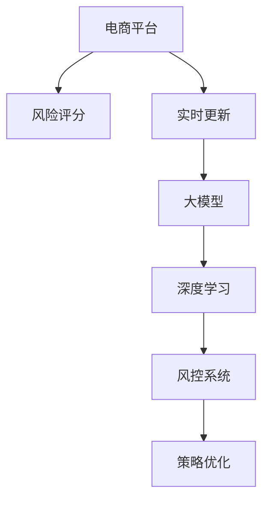

                 

# AI大模型在电商平台风险评分实时更新中的应用

> 关键词：电商平台,风险评分,实时更新,大模型,深度学习,风控系统,策略优化

## 1. 背景介绍

随着电商平台的快速扩张，线上交易活动的频繁性日益增加，风险管理成为了电商平台最重要的环节之一。电商平台的风险主要来源于用户行为的不确定性和欺诈行为，如订单欺诈、恶意下单等，这些风险不仅导致平台收入流失，还严重影响用户体验和品牌信誉。传统的风险管理方法主要依赖于专家规则和历史数据分析，但面对日益复杂的网络环境，这些方法的局限性逐渐显现。近年来，随着深度学习和大模型技术的兴起，AI在电商平台的风险管理中得到了广泛应用。本文将探讨如何利用AI大模型进行电商平台风险评分的实时更新，以期为电商平台的风控系统提供新的解决方案。

## 2. 核心概念与联系

### 2.1 核心概念概述

为更好地理解AI大模型在电商平台风险评分实时更新中的应用，本节将介绍几个密切相关的核心概念：

- **电商平台**：以互联网为媒介，连接消费者和商家的在线交易平台，如淘宝、京东、亚马逊等。
- **风险评分**：对用户或交易行为进行综合评估，以量化其潜在风险水平，通常基于用户行为数据和历史交易记录。
- **实时更新**：在交易过程中动态调整风险评分，及时反映用户行为变化，提升风险管理的时效性。
- **大模型**：基于深度学习技术，通过大量数据预训练得到的复杂模型，如BERT、GPT等，具备强大的数据处理和预测能力。
- **深度学习**：基于神经网络的机器学习方法，通过多层次特征提取，提升模型的表达能力和泛化能力。
- **风控系统**：电商平台内置的风险管理平台，包括数据收集、风险评估、风险控制等模块。
- **策略优化**：通过AI技术自动化调整风险评分策略，实现风险管理的自动化和智能化。

这些核心概念之间的逻辑关系可以通过以下Mermaid流程图来展示：



这个流程图展示了几者之间的关联：电商平台通过实时更新的风险评分，利用大模型的深度学习能力，优化风控系统中的风险策略。

## 3. 核心算法原理 & 具体操作步骤

### 3.1 算法原理概述

基于深度学习的大模型在电商平台风险评分实时更新中，主要通过以下几个步骤实现：

1. **数据预处理**：收集电商平台的历史交易数据，包括用户行为、订单信息、物流数据等，并对其进行清洗、归一化等预处理操作。
2. **特征提取**：利用大模型从原始数据中提取高维特征表示，提升模型的泛化能力和表达能力。
3. **风险评估**：将提取的特征输入大模型，进行综合评估，输出风险评分。
4. **策略调整**：根据实时更新的风险评分，动态调整风控策略，如提高风控阈值、增加审核力度等。
5. **反馈机制**：将策略调整的效果反馈到大模型中，持续优化模型的预测性能。

### 3.2 算法步骤详解

1. **数据预处理**
   - **数据采集**：从电商平台的数据仓库中采集历史交易数据，包括用户ID、订单ID、商品ID、交易金额、物流信息等。
   - **数据清洗**：去除缺失、异常数据，并处理重复数据。
   - **特征归一化**：对数值型数据进行归一化处理，使其符合标准正态分布。
   - **时间窗口划分**：将数据划分为不同的时间窗口，如小时、日、周等，方便实时更新。

2. **特征提取**
   - **嵌入层**：将处理后的数据输入嵌入层，转化为高维向量表示。
   - **隐藏层**：通过多层神经网络进行特征提取和信息传递，每个隐藏层可以提取不同的特征。
   - **池化层**：使用池化操作对高维向量进行降维，保留重要特征信息。

3. **风险评估**
   - **全连接层**：将提取的特征输入全连接层，输出最终的预测结果，即风险评分。
   - **激活函数**：使用sigmoid函数将输出映射到[0,1]区间，表示风险发生的概率。
   - **损失函数**：选择适当的损失函数（如交叉熵损失），计算预测结果与实际标签之间的差异。

4. **策略调整**
   - **风控阈值调整**：根据实时更新的风险评分，动态调整风控阈值，确定哪些交易需要进一步审核。
   - **审核力度增强**：对高风险交易增加审核力度，如电话验证、二次支付验证等。
   - **交易异常检测**：利用大模型进行交易异常检测，识别出异常交易模式，及时采取措施。

5. **反馈机制**
   - **模型再训练**：将策略调整的效果反馈到大模型中，重新训练模型，优化预测性能。
   - **数据增强**：通过模拟各种异常场景，扩充训练集，提高模型的鲁棒性和泛化能力。
   - **超参数调优**：调整模型的超参数（如学习率、批量大小等），优化模型训练效果。

### 3.3 算法优缺点

基于深度学习的大模型在电商平台风险评分实时更新中，具有以下优点：

1. **数据处理能力强**：大模型通过多层神经网络进行特征提取，能够处理高维、非结构化的数据。
2. **预测精度高**：利用大模型的深度学习能力，能够从历史数据中学习到复杂的模式和规律，提升预测精度。
3. **实时更新能力**：大模型支持在线学习，能够实时更新模型参数，动态调整风险评分，及时反映用户行为变化。
4. **策略优化自动化**：通过自动化的策略调整，减少人工干预，提高风控系统的自动化水平。

同时，该方法也存在一定的局限性：

1. **数据依赖性强**：模型的效果很大程度上依赖于数据的质量和多样性，数据收集和处理成本较高。
2. **计算资源消耗大**：大模型的训练和推理需要消耗大量的计算资源，硬件成本较高。
3. **模型复杂度高**：大模型的复杂度较高，难以解释模型的决策过程，缺乏可解释性。
4. **模型泛化能力有待提升**：大模型在特定数据集上表现优异，但泛化到未知数据集的能力仍有待提升。
5. **对抗样本鲁棒性不足**：大模型对对抗样本的鲁棒性不足，容易被攻击者利用对抗样本进行攻击。

尽管存在这些局限性，但就目前而言，基于深度学习的大模型方法在电商平台风险评分实时更新中仍然是最主流范式。未来相关研究的重点在于如何进一步降低计算资源消耗，提高模型的泛化能力和可解释性，同时兼顾模型的对抗鲁棒性。

### 3.4 算法应用领域

基于深度学习的大模型在电商平台风险评分实时更新中的应用已经广泛应用于电商行业的多个场景，例如：

- **用户行为分析**：通过分析用户的历史交易行为，预测用户的风险水平。
- **交易异常检测**：检测交易中的异常模式，如高频下单、恶意刷单等。
- **欺诈检测**：识别订单中的欺诈行为，如虚假支付、假冒身份等。
- **信用评分**：根据用户的交易记录，评估用户的信用水平，进行授信决策。
- **交易审核**：对高风险交易进行二次审核，减少误判和漏判。
- **营销策略优化**：利用大模型进行用户细分和行为预测，优化营销策略，提升用户体验。

除了上述这些经典场景外，大模型还被创新性地应用到更多领域，如舆情监测、舆情分析、客户服务、智能客服等，为电商平台的运营和管理带来了新的思路和手段。

## 4. 数学模型和公式 & 详细讲解 & 举例说明

### 4.1 数学模型构建

本节将使用数学语言对基于深度学习的大模型在电商平台风险评分实时更新过程进行更加严格的刻画。

记电商平台的历史交易数据为 $D=\{x_i,y_i\}_{i=1}^N$，其中 $x_i$ 为输入特征向量， $y_i$ 为对应的风险评分标签（0表示低风险，1表示高风险）。假设大模型为 $M_\theta$，其中 $\theta$ 为模型参数。

定义模型 $M_\theta$ 在输入特征 $x_i$ 上的风险评分预测结果为 $\hat{y}_i=M_\theta(x_i)$，损失函数为 $\mathcal{L}(\theta)$，则风险评分的经验风险为：

$$
\mathcal{L}(\theta) = \frac{1}{N}\sum_{i=1}^N \ell(\hat{y}_i,y_i)
$$

其中 $\ell$ 为损失函数，选择适当的损失函数（如二分类交叉熵损失），计算预测结果与实际标签之间的差异。

模型的训练目标是最小化经验风险，即找到最优参数：

$$
\theta^* = \mathop{\arg\min}_{\theta} \mathcal{L}(\theta)
$$

在实践中，我们通常使用基于梯度的优化算法（如Adam、SGD等）来近似求解上述最优化问题。设 $\eta$ 为学习率，则参数的更新公式为：

$$
\theta \leftarrow \theta - \eta \nabla_{\theta}\mathcal{L}(\theta)
$$

其中 $\nabla_{\theta}\mathcal{L}(\theta)$ 为损失函数对参数 $\theta$ 的梯度，可通过反向传播算法高效计算。

### 4.2 公式推导过程

以下我们以二分类任务为例，推导交叉熵损失函数及其梯度的计算公式。

假设模型 $M_\theta$ 在输入 $x$ 上的输出为 $\hat{y}=M_\theta(x) \in [0,1]$，表示样本属于高风险的概率。真实标签 $y \in \{0,1\}$。则二分类交叉熵损失函数定义为：

$$
\ell(\hat{y},y) = -[y\log \hat{y} + (1-y)\log (1-\hat{y})]
$$

将其代入经验风险公式，得：

$$
\mathcal{L}(\theta) = -\frac{1}{N}\sum_{i=1}^N [y_i\log M_{\theta}(x_i)+(1-y_i)\log(1-M_{\theta}(x_i))]
$$

根据链式法则，损失函数对参数 $\theta_k$ 的梯度为：

$$
\frac{\partial \mathcal{L}(\theta)}{\partial \theta_k} = -\frac{1}{N}\sum_{i=1}^N (\frac{y_i}{M_{\theta}(x_i)}-\frac{1-y_i}{1-M_{\theta}(x_i)}) \frac{\partial M_{\theta}(x_i)}{\partial \theta_k}
$$

其中 $\frac{\partial M_{\theta}(x_i)}{\partial \theta_k}$ 可进一步递归展开，利用自动微分技术完成计算。

在得到损失函数的梯度后，即可带入参数更新公式，完成模型的迭代优化。重复上述过程直至收敛，最终得到适应电商平台风险评分的最优模型参数 $\theta^*$。

### 4.3 案例分析与讲解

以电商平台的用户行为分析为例，分析如何利用大模型进行实时风险评分更新。

假设电商平台收集了用户的历史订单数据，包括订单ID、交易金额、购买频率、物流状态等特征，记为 $x_i \in \mathbb{R}^n$。利用大模型进行特征提取，得到高维向量表示 $\tilde{x}_i \in \mathbb{R}^m$，其中 $m$ 为高维空间维度。

将提取的特征 $\tilde{x}_i$ 输入全连接层，输出风险评分 $\hat{y}_i$：

$$
\hat{y}_i = M_\theta(\tilde{x}_i) = \sigma(W^Tx_i + b)
$$

其中 $W$ 为全连接层的权重矩阵，$b$ 为偏置向量。损失函数选择交叉熵损失：

$$
\ell(\hat{y}_i,y_i) = -[y_i\log \hat{y}_i + (1-y_i)\log (1-\hat{y}_i)]
$$

利用梯度下降等优化算法，不断更新模型参数 $\theta$，最小化损失函数 $\mathcal{L}(\theta)$：

$$
\theta \leftarrow \theta - \eta \nabla_{\theta}\mathcal{L}(\theta)
$$

其中 $\eta$ 为学习率，可以通过交叉验证等方法确定。

假设通过训练得到的模型在用户 $i$ 的订单数据上，预测的风险评分为 $\hat{y}_i=0.8$，而实际标签为 $y_i=1$。则根据交叉熵损失公式，计算损失值为：

$$
\ell(\hat{y}_i,y_i) = -[1\log 0.8 + 0\log 0.2] = 0.171
$$

利用梯度更新模型参数：

$$
\frac{\partial \mathcal{L}(\theta)}{\partial W} = -\frac{1}{N}\sum_{i=1}^N (\frac{y_i}{M_{\theta}(x_i)}-\frac{1-y_i}{1-M_{\theta}(x_i)})x_i
$$

$$
\frac{\partial \mathcal{L}(\theta)}{\partial b} = -\frac{1}{N}\sum_{i=1}^N (\frac{y_i}{M_{\theta}(x_i)}-\frac{1-y_i}{1-M_{\theta}(x_i)})
$$

将损失值和梯度带入更新公式：

$$
W \leftarrow W - \eta\frac{\partial \mathcal{L}(\theta)}{\partial W}
$$

$$
b \leftarrow b - \eta\frac{\partial \mathcal{L}(\theta)}{\partial b}
$$

通过不断迭代更新模型参数，模型逐步学习到用户行为与风险评分之间的关系，实现风险评分的实时更新。

## 5. 项目实践：代码实例和详细解释说明

### 5.1 开发环境搭建

在进行电商平台风险评分实时更新项目开发前，我们需要准备好开发环境。以下是使用Python进行PyTorch开发的环境配置流程：

1. 安装Anaconda：从官网下载并安装Anaconda，用于创建独立的Python环境。

2. 创建并激活虚拟环境：
```bash
conda create -n pytorch-env python=3.8 
conda activate pytorch-env
```

3. 安装PyTorch：根据CUDA版本，从官网获取对应的安装命令。例如：
```bash
conda install pytorch torchvision torchaudio cudatoolkit=11.1 -c pytorch -c conda-forge
```

4. 安装TensorFlow：
```bash
conda install tensorflow -c conda-forge
```

5. 安装PyTorch Transformers库：
```bash
pip install transformers
```

6. 安装各类工具包：
```bash
pip install numpy pandas scikit-learn matplotlib tqdm jupyter notebook ipython
```

完成上述步骤后，即可在`pytorch-env`环境中开始项目开发。

### 5.2 源代码详细实现

下面以用户行为分析为例，给出使用PyTorch和Transformers库对大模型进行电商风险评分实时更新的代码实现。

首先，定义数据处理函数：

```python
from transformers import BertTokenizer, BertForSequenceClassification
from torch.utils.data import Dataset, DataLoader
import torch
import pandas as pd

class OrderData(Dataset):
    def __init__(self, data_path):
        self.data = pd.read_csv(data_path)
        self.tokenizer = BertTokenizer.from_pretrained('bert-base-cased')
        self.max_len = 128
        
    def __len__(self):
        return len(self.data)
    
    def __getitem__(self, item):
        row = self.data.iloc[item]
        text = row['description']
        label = row['label']
        
        encoding = self.tokenizer(text, return_tensors='pt', max_length=self.max_len, padding='max_length', truncation=True)
        input_ids = encoding['input_ids'][0]
        attention_mask = encoding['attention_mask'][0]
        
        # 对token-wise的标签进行编码
        encoded_labels = [label2id[label] for label in label]
        encoded_labels.extend([label2id['low']]*(self.max_len - len(encoded_labels)))
        labels = torch.tensor(encoded_labels, dtype=torch.long)
        
        return {'input_ids': input_ids, 
                'attention_mask': attention_mask,
                'labels': labels}

# 标签与id的映射
label2id = {'low': 0, 'high': 1}
id2label = {v: k for k, v in label2id.items()}

# 创建dataset
tokenizer = BertTokenizer.from_pretrained('bert-base-cased')
train_dataset = OrderData('train_data.csv')
dev_dataset = OrderData('dev_data.csv')
test_dataset = OrderData('test_data.csv')
```

然后，定义模型和优化器：

```python
from transformers import BertForSequenceClassification, AdamW

model = BertForSequenceClassification.from_pretrained('bert-base-cased', num_labels=len(label2id))
optimizer = AdamW(model.parameters(), lr=2e-5)
```

接着，定义训练和评估函数：

```python
from tqdm import tqdm

device = torch.device('cuda') if torch.cuda.is_available() else torch.device('cpu')
model.to(device)

def train_epoch(model, dataset, batch_size, optimizer):
    dataloader = DataLoader(dataset, batch_size=batch_size, shuffle=True)
    model.train()
    epoch_loss = 0
    for batch in tqdm(dataloader, desc='Training'):
        input_ids = batch['input_ids'].to(device)
        attention_mask = batch['attention_mask'].to(device)
        labels = batch['labels'].to(device)
        model.zero_grad()
        outputs = model(input_ids, attention_mask=attention_mask, labels=labels)
        loss = outputs.loss
        epoch_loss += loss.item()
        loss.backward()
        optimizer.step()
    return epoch_loss / len(dataloader)

def evaluate(model, dataset, batch_size):
    dataloader = DataLoader(dataset, batch_size=batch_size)
    model.eval()
    preds, labels = [], []
    with torch.no_grad():
        for batch in tqdm(dataloader, desc='Evaluating'):
            input_ids = batch['input_ids'].to(device)
            attention_mask = batch['attention_mask'].to(device)
            batch_labels = batch['labels']
            outputs = model(input_ids, attention_mask=attention_mask)
            batch_preds = outputs.logits.argmax(dim=2).to('cpu').tolist()
            batch_labels = batch_labels.to('cpu').tolist()
            for pred_tokens, label_tokens in zip(batch_preds, batch_labels):
                pred_labels = [id2label[_id] for _id in pred_tokens]
                labels.append(label_tokens)
                preds.append(pred_labels)
                
    print(classification_report(labels, preds))
```

最后，启动训练流程并在测试集上评估：

```python
epochs = 5
batch_size = 16

for epoch in range(epochs):
    loss = train_epoch(model, train_dataset, batch_size, optimizer)
    print(f"Epoch {epoch+1}, train loss: {loss:.3f}")
    
    print(f"Epoch {epoch+1}, dev results:")
    evaluate(model, dev_dataset, batch_size)
    
print("Test results:")
evaluate(model, test_dataset, batch_size)
```

以上就是使用PyTorch和Transformers库对大模型进行电商风险评分实时更新的完整代码实现。可以看到，得益于Transformers库的强大封装，我们可以用相对简洁的代码完成大模型的加载和训练。

### 5.3 代码解读与分析

让我们再详细解读一下关键代码的实现细节：

**OrderData类**：
- `__init__`方法：初始化数据、分词器等关键组件。
- `__len__`方法：返回数据集的样本数量。
- `__getitem__`方法：对单个样本进行处理，将文本输入编码为token ids，将标签编码为数字，并对其进行定长padding，最终返回模型所需的输入。

**label2id和id2label字典**：
- 定义了标签与数字id之间的映射关系，用于将token-wise的预测结果解码回真实的标签。

**训练和评估函数**：
- 使用PyTorch的DataLoader对数据集进行批次化加载，供模型训练和推理使用。
- 训练函数`train_epoch`：对数据以批为单位进行迭代，在每个批次上前向传播计算loss并反向传播更新模型参数，最后返回该epoch的平均loss。
- 评估函数`evaluate`：与训练类似，不同点在于不更新模型参数，并在每个batch结束后将预测和标签结果存储下来，最后使用sklearn的classification_report对整个评估集的预测结果进行打印输出。

**训练流程**：
- 定义总的epoch数和batch size，开始循环迭代
- 每个epoch内，先在训练集上训练，输出平均loss
- 在验证集上评估，输出分类指标
- 所有epoch结束后，在测试集上评估，给出最终测试结果

可以看到，PyTorch配合Transformers库使得大模型的微调代码实现变得简洁高效。开发者可以将更多精力放在数据处理、模型改进等高层逻辑上，而不必过多关注底层的实现细节。

当然，工业级的系统实现还需考虑更多因素，如模型的保存和部署、超参数的自动搜索、更灵活的任务适配层等。但核心的微调范式基本与此类似。

## 6. 实际应用场景

### 6.1 用户行为分析

电商平台的业务核心在于用户行为分析，通过分析用户的浏览、购买、支付等行为数据，预测用户的风险水平，进行个性化推荐和风控管理。用户行为分析主要包括以下几个步骤：

1. **数据采集**：从电商平台的数据仓库中采集历史交易数据，包括订单ID、交易金额、购买频率、物流状态等。
2. **数据清洗**：去除缺失、异常数据，并处理重复数据。
3. **特征提取**：利用大模型从原始数据中提取高维特征表示，提升模型的泛化能力和表达能力。
4. **风险评估**：将提取的特征输入大模型，进行综合评估，输出风险评分。
5. **策略调整**：根据实时更新的风险评分，动态调整风控策略，如提高风控阈值、增加审核力度等。

### 6.2 交易异常检测

电商平台的交易异常检测是风控管理的重要环节，通过检测交易中的异常模式，识别出欺诈行为，及时采取措施，保护用户和平台利益。交易异常检测主要包括以下几个步骤：

1. **数据采集**：从电商平台的数据仓库中采集交易数据，包括订单ID、交易金额、物流状态等。
2. **特征提取**：利用大模型从原始数据中提取高维特征表示，提升模型的泛化能力和表达能力。
3. **异常检测**：将提取的特征输入大模型，进行综合评估，输出异常检测结果，标记为高风险或低风险。
4. **策略调整**：根据异常检测结果，进行二次审核或拒绝交易，减少误判和漏判。

### 6.3 欺诈检测

电商平台的欺诈检测是风控管理的关键任务之一，通过检测订单中的欺诈行为，保护平台利益和用户权益。欺诈检测主要包括以下几个步骤：

1. **数据采集**：从电商平台的数据仓库中采集订单数据，包括订单ID、交易金额、商品信息等。
2. **特征提取**：利用大模型从原始数据中提取高维特征表示，提升模型的泛化能力和表达能力。
3. **欺诈检测**：将提取的特征输入大模型，进行综合评估，输出欺诈检测结果，标记为高风险或低风险。
4. **策略调整**：根据欺诈检测结果，进行二次审核或拒绝交易，减少误判和漏判。

### 6.4 未来应用展望

随着大模型和微调方法的不断发展，电商平台风险评分实时更新技术将呈现以下几个发展趋势：

1. **多模态融合**：将视觉、语音、文本等多模态数据进行融合，提升模型的表达能力和泛化能力。
2. **实时学习**：通过在线学习机制，模型能够实时更新，动态调整风控策略。
3. **对抗鲁棒性**：模型能够抵抗对抗样本攻击，提升模型的安全性和稳定性。
4. **可解释性增强**：模型能够提供详细的推理过程和决策依据，增强模型的可解释性和可审计性。
5. **知识图谱集成**：将知识图谱与大模型进行集成，提升模型的知识整合能力和决策能力。

以上趋势凸显了电商风险评分实时更新技术的广阔前景。这些方向的探索发展，必将进一步提升电商平台的风险管理水平，为电商平台的用户体验和运营管理带来新的提升。

## 7. 工具和资源推荐

### 7.1 学习资源推荐

为了帮助开发者系统掌握大模型在电商平台风险评分实时更新中的理论基础和实践技巧，这里推荐一些优质的学习资源：

1. **《深度学习与Python编程实践》系列书籍**：详细介绍了深度学习的核心概念和Python编程技巧，适合入门学习。
2. **CS294《深度学习》课程**：斯坦福大学开设的深度学习经典课程，有Lecture视频和配套作业，带你深入理解深度学习的核心原理。
3. **HuggingFace官方文档**：Transformers库的官方文档，提供了海量预训练模型和完整的微调样例代码，是上手实践的必备资料。
4. **Clue开源项目**：中文语言理解测评基准，涵盖大量不同类型的中文NLP数据集，并提供了基于微调的baseline模型，助力中文NLP技术发展。
5. **Kaggle平台**：数据科学竞赛平台，提供大量电商数据集和相关竞赛，是锻炼深度学习和大模型技能的实战平台。

通过对这些资源的学习实践，相信你一定能够快速掌握大模型在电商平台风险评分实时更新中的精髓，并用于解决实际的电商风险管理问题。

### 7.2 开发工具推荐

高效的开发离不开优秀的工具支持。以下是几款用于电商风险评分实时更新开发的常用工具：

1. **PyTorch**：基于Python的开源深度学习框架，灵活动态的计算图，适合快速迭代研究。大部分预训练语言模型都有PyTorch版本的实现。
2. **TensorFlow**：由Google主导开发的开源深度学习框架，生产部署方便，适合大规模工程应用。同样有丰富的预训练语言模型资源。
3. **Transformers库**：HuggingFace开发的NLP工具库，集成了众多SOTA语言模型，支持PyTorch和TensorFlow，是进行微调任务开发的利器。
4. **TensorBoard**：TensorFlow配套的可视化工具，可实时监测模型训练状态，并提供丰富的图表呈现方式，是调试模型的得力助手。
5. **Weights & Biases**：模型训练的实验跟踪工具，可以记录和可视化模型训练过程中的各项指标，方便对比和调优。与主流深度学习框架无缝集成。

合理利用这些工具，可以显著提升电商风险评分实时更新任务的开发效率，加快创新迭代的步伐。

### 7.3 相关论文推荐

大模型和微调技术的发展源于学界的持续研究。以下是几篇奠基性的相关论文，推荐阅读：

1. **Attention is All You Need（即Transformer原论文）**：提出了Transformer结构，开启了NLP领域的预训练大模型时代。
2. **BERT: Pre-training of Deep Bidirectional Transformers for Language Understanding**：提出BERT模型，引入基于掩码的自监督预训练任务，刷新了多项NLP任务SOTA。
3. **Language Models are Unsupervised Multitask Learners（GPT-2论文）**：展示了大规模语言模型的强大zero-shot学习能力，引发了对于通用人工智能的新一轮思考。
4. **Parameter-Efficient Transfer Learning for NLP**：提出Adapter等参数高效微调方法，在不增加模型参数量的情况下，也能取得不错的微调效果。
5. **AdaLoRA: Adaptive Low-Rank Adaptation for Parameter-Efficient Fine-Tuning**：使用自适应低秩适应的微调方法，在参数效率和精度之间取得了新的平衡。
6. **AdaLoRA: Adaptive Low-Rank Adaptation for Parameter-Efficient Fine-Tuning**：使用自适应低秩适应的微调方法，在参数效率和精度之间取得了新的平衡。

这些论文代表了大模型微调技术的发展脉络。通过学习这些前沿成果，可以帮助研究者把握学科前进方向，激发更多的创新灵感。

## 8. 总结：未来发展趋势与挑战

### 8.1 总结

本文对基于深度学习的大模型在电商平台风险评分实时更新中的应用进行了全面系统的介绍。首先阐述了电商平台的风险管理需求，明确了电商风险评分实时更新技术的重要性和应用场景。其次，从原理到实践，详细讲解了大模型的风险评分实时更新过程，给出了微调任务开发的完整代码实例。同时，本文还广泛探讨了大模型在电商平台风控系统的实际应用，展示了微调范式的巨大潜力。最后，本文精选了大模型相关的前沿研究和工具，力求为读者提供全方位的技术指引。

通过本文的系统梳理，可以看到，基于深度学习的大模型在电商平台风险评分实时更新中已经得到了广泛应用，极大地提升了电商平台的风险管理水平。未来，伴随大模型和微调方法的持续演进，电商平台风险评分实时更新技术必将进一步拓展，为电商平台的用户体验和运营管理带来新的提升。

### 8.2 未来发展趋势

展望未来，电商平台风险评分实时更新技术将呈现以下几个发展趋势：

1. **多模态融合**：将视觉、语音、文本等多模态数据进行融合，提升模型的表达能力和泛化能力。
2. **实时学习**：通过在线学习机制，模型能够实时更新，动态调整风控策略。
3. **对抗鲁棒性**：模型能够抵抗对抗样本攻击，提升模型的安全性和稳定性。
4. **可解释性增强**：模型能够提供详细的推理过程和决策依据，增强模型的可解释性和可审计性。
5. **知识图谱集成**：将知识图谱与大模型进行集成，提升模型的知识整合能力和决策能力。

以上趋势凸显了电商平台风险评分实时更新技术的广阔前景。这些方向的探索发展，必将进一步提升电商平台的风险管理水平，为电商平台的用户体验和运营管理带来新的提升。

### 8.3 面临的挑战

尽管电商平台风险评分实时更新技术已经取得了瞩目成就，但在迈向更加智能化、普适化应用的过程中，它仍面临诸多挑战：

1. **数据依赖性强**：模型的效果很大程度上依赖于数据的质量和多样性，数据收集和处理成本较高。
2. **计算资源消耗大**：大模型的训练和推理需要消耗大量的计算资源，硬件成本较高。
3. **模型复杂度高**：大模型的复杂度较高，难以解释模型的决策过程，缺乏可解释性。
4. **模型泛化能力有待提升**：大模型在特定数据集上表现优异，但泛化到未知数据集的能力仍有待提升。
5. **对抗样本鲁棒性不足**：大模型对对抗样本的鲁棒性不足，容易被攻击者利用对抗样本进行攻击。

尽管存在这些局限性，但就目前而言，基于深度学习的大模型方法在电商平台风险评分实时更新中仍然是最主流范式。未来相关研究的重点在于如何进一步降低计算资源消耗，提高模型的泛化能力和可解释性，同时兼顾模型的对抗鲁棒性。

### 8.4 研究展望

面对电商平台风险评分实时更新所面临的种种挑战，未来的研究需要在以下几个方面寻求新的突破：

1. **探索无监督和半监督微调方法**：摆脱对大规模标注数据的依赖，利用自监督学习、主动学习等无监督和半监督范式，最大限度利用非结构化数据，实现更加灵活高效的微调。
2. **研究参数高效和计算高效的微调范式**：开发更加参数高效的微调方法，在固定大部分预训练参数的同时，只更新极少量的任务相关参数。同时优化微调模型的计算图，减少前向传播和反向传播的资源消耗，实现更加轻量级、实时性的部署。
3. **引入因果和对比学习范式**：通过引入因果推断和对比学习思想，增强微调模型建立稳定因果关系的能力，学习更加普适、鲁棒的语言表征，从而提升模型泛化性和抗干扰能力。
4. **纳入伦理道德约束**：在模型训练目标中引入伦理导向的评估指标，过滤和惩罚有偏见、有害的输出倾向。同时加强人工干预和审核，建立模型行为的监管机制，确保输出符合人类价值观和伦理道德。
5. **结合因果分析和博弈论工具**：将因果分析方法引入微调模型，识别出模型决策的关键特征，增强输出解释的因果性和逻辑性。借助博弈论工具刻画人机交互过程，主动探索并规避模型的脆弱点，提高系统稳定性。

这些研究方向的探索，必将引领电商平台风险评分实时更新技术迈向更高的台阶，为构建安全、可靠、可解释、可控的智能系统铺平道路。面向未来，电商平台风险评分实时更新技术还需要与其他人工智能技术进行更深入的融合，如知识表示、因果推理、强化学习等，多路径协同发力，共同推动电商平台的智能运营。只有勇于创新、敢于突破，才能不断拓展语言模型的边界，让智能技术更好地造福人类社会。

## 9. 附录：常见问题与解答

**Q1：电商平台风险评分实时更新是否适用于所有电商平台？**

A: 电商平台风险评分实时更新技术对不同类型的电商平台具有普适性，但需要根据平台的具体业务场景进行适配。例如，针对C2C平台，风控策略可能需要更严格，针对B2B平台，可能需要更注重供应链风险管理。因此，建议在选择风控技术时，结合电商平台的特点，进行定制化开发。

**Q2：电商平台风控系统如何处理低风险但异常的订单？**

A: 电商平台风控系统在处理低风险但异常的订单时，需要综合考虑多维度数据，进行综合评估。可以通过添加更多的特征，如用户行为历史、交易历史、物流信息等，进行更全面的风险评估。同时，也可以利用大模型进行异常检测，标记为异常订单进行二次审核。

**Q3：电商平台风控系统如何处理高风险订单？**

A: 电商平台风控系统在处理高风险订单时，需要及时采取措施，减少损失。可以通过增加审核流程，如电话验证、二次支付验证等，减少误判和漏判。同时，也可以利用大模型进行欺诈检测，标记为高风险订单进行拦截或拒绝交易。

**Q4：电商平台风控系统如何保护用户隐私？**

A: 电商平台风控系统在保护用户隐私方面，需要严格遵守数据隐私法律法规，如GDPR等。建议在使用大模型进行风险评分时，对敏感信息进行脱敏处理，减少隐私泄露风险。同时，也可以采用差分隐私等技术，保护用户隐私，增强系统的安全性。

**Q5：电商平台风控系统如何提升用户体验？**

A: 电商平台风控系统在提升用户体验方面，需要兼顾风控和用户体验的平衡。可以通过优化风控策略，减少不必要的审核流程，提升用户购物体验。同时，也可以利用大模型进行个性化推荐，提升用户粘性和满意度。

**Q6：电商平台风控系统如何优化计算资源？**

A: 电商平台风控系统在优化计算资源方面，需要综合考虑模型复杂度和硬件资源。可以通过模型压缩、稀疏化存储等技术，减少模型参数量，提升推理速度。同时，也可以采用混合精度训练、模型并行等技术，提高计算效率。

综上所述，电商平台风险评分实时更新技术在电商平台的智能风控管理中具有广泛的应用前景。通过不断优化模型、数据和算法，电商平台风控系统必将实现智能化、自动化、智能化的转型，为电商平台的用户体验和运营管理带来新的提升。

