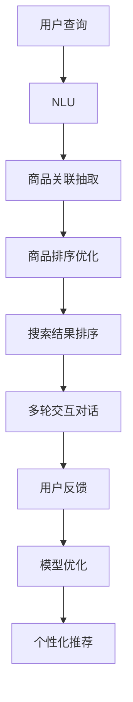

                 

# AI大模型在电商搜索结果个性化布局中的应用

> 关键词：大语言模型,电商搜索,个性化推荐,深度学习,自然语言处理,自然语言理解

## 1. 背景介绍

### 1.1 问题由来
电商搜索是现代电商平台的灵魂。一个优秀的电商搜索系统，不仅能快速准确地匹配用户需求，还能为用户提供最相关的商品信息，从而提升用户体验和平台转化率。然而，面对海量的商品信息，如何为用户推荐最符合其兴趣和需求的搜索结果，是一个极具挑战性的问题。

传统的搜索结果排序主要依赖于基于关键词匹配的排序算法，如TF-IDF、BM25等。尽管这些算法在计算效率上具有优势，但难以捕捉用户搜索行为背后的复杂语义信息，导致推荐结果与用户真实意图不符。而大语言模型通过大规模无标签数据预训练，掌握了丰富的语言知识，具备强大的自然语言理解能力，可以通过用户搜索查询语句，深入理解用户意图，提供更加精准的搜索结果。

### 1.2 问题核心关键点
大语言模型在电商搜索结果个性化布局中的应用主要包括以下几个关键点：

- 自然语言理解(NLU)：通过大模型对用户搜索查询的自然语言处理，获取用户搜索意图、关键词等高层次语义信息。
- 商品关联抽取：利用大模型自动抽取商品描述、属性等文本信息，并提取商品与用户查询之间的关联关系。
- 商品排序优化：基于商品关联抽取的结果，对搜索结果进行排序优化，推荐用户最可能感兴趣的商品。
- 多轮交互优化：通过多轮交互对话，实时获取用户反馈，进一步优化搜索结果排序算法，提升用户满意度。
- 数据驱动决策：以用户行为数据为驱动，持续训练和优化模型，提升搜索结果的个性化和准确性。

### 1.3 问题研究意义
在电商搜索场景中，利用大语言模型进行个性化搜索结果布局，可以显著提升用户体验和平台转化率。具体来说：

- 用户搜索意图的准确理解：大模型能够深入理解用户的搜索意图，推荐更加符合用户实际需求的商品，减少误点击和流失。
- 商品相关性的提升：通过商品关联抽取，自动化地匹配商品属性和用户查询关键词，提升搜索结果的相关性。
- 用户满意度提升：多轮交互优化和数据驱动决策，可以动态调整搜索结果布局，实时响应用户反馈，不断优化用户体验。
- 个性化推荐引擎的构建：基于大语言模型，可以构建高效的个性化推荐引擎，大幅提升平台的用户黏性和交易转化率。

## 2. 核心概念与联系

### 2.1 核心概念概述

为更好地理解大语言模型在电商搜索结果个性化布局中的应用，本节将介绍几个关键概念及其相互联系：

- **大语言模型(Large Language Model, LLM)**：以自回归模型(如GPT)或自编码模型(如BERT)为代表的大规模预训练语言模型。通过在大规模无标签文本语料上进行预训练，学习到丰富的语言知识，具备强大的自然语言理解和生成能力。

- **电商搜索**：用户通过电商平台的搜索框输入搜索查询，电商平台根据用户查询，快速返回相关商品信息的过程。电商搜索的核心目标是提供准确、相关、快速的搜索结果，提升用户体验和平台转化率。

- **个性化推荐**：根据用户历史行为和偏好，向用户推荐最符合其兴趣和需求的商品或服务。个性化推荐技术通过机器学习、深度学习等技术手段，动态调整推荐策略，满足用户个性化的需求。

- **自然语言处理(NLP)**：涉及计算机处理、理解和生成自然语言的技术。NLP在电商搜索中主要用于用户查询的自然语言理解、商品关联抽取、多轮对话等环节。

- **深度学习**：利用多层神经网络处理和模拟人类视觉、听觉、语言等复杂任务。深度学习在电商搜索中主要用于商品的自动关联抽取、商品排序优化、用户行为预测等环节。

- **自然语言理解(NLU)**：指计算机能够理解自然语言的含义、语法和语境，从而提取和生成有意义的语义信息。NLU在电商搜索中用于用户查询意图的获取和商品关联的抽取。

- **自然语言生成(NLG)**：指计算机能够生成自然语言文本，涵盖语言生成、对话生成等任务。NLG在电商搜索中用于搜索结果的多轮交互对话和商品描述生成。

这些概念共同构成了电商搜索和大模型应用的核心框架，使得电商搜索系统能够基于用户的自然语言查询，动态调整搜索结果的布局和推荐策略，提升用户体验和平台效益。

### 2.2 核心概念原理和架构的 Mermaid 流程图



这个流程图展示了大模型在电商搜索结果个性化布局中的主要处理流程：

1. **用户查询**：用户通过搜索框输入搜索查询。
2. **NLU**：通过大模型理解用户查询的自然语言含义，提取查询意图和关键词。
3. **商品关联抽取**：利用大模型自动抽取商品描述、属性等文本信息，并提取商品与用户查询之间的关联关系。
4. **商品排序优化**：根据商品关联抽取的结果，对搜索结果进行排序优化，推荐用户最可能感兴趣的商品。
5. **多轮交互对话**：与用户进行多轮交互，获取用户反馈，实时调整搜索结果布局。
6. **用户反馈**：用户对搜索结果的反馈，用于动态调整排序算法和推荐策略。
7. **模型优化**：根据用户反馈和行为数据，持续训练和优化模型。
8. **个性化推荐**：基于动态调整的排序算法，向用户推荐最符合其兴趣和需求的商品。

## 3. 核心算法原理 & 具体操作步骤

### 3.1 算法原理概述

基于大语言模型在电商搜索结果个性化布局中的应用，主要涉及以下几个核心算法原理：

1. **自然语言理解(NLU)**：利用大模型进行用户查询的自然语言处理，理解用户意图，提取关键词。
2. **商品关联抽取**：利用大模型自动抽取商品描述、属性等文本信息，并提取商品与用户查询之间的关联关系。
3. **商品排序优化**：基于商品关联抽取的结果，对搜索结果进行排序优化，推荐用户最可能感兴趣的商品。
4. **多轮交互对话**：通过大模型与用户进行多轮交互，实时获取用户反馈，动态调整推荐策略。
5. **数据驱动决策**：以用户行为数据为驱动，持续训练和优化模型，提升搜索结果的个性化和准确性。

这些算法原理在大模型的帮助下，可以显著提升电商搜索系统的用户体验和平台效益。

### 3.2 算法步骤详解

下面详细介绍大语言模型在电商搜索结果个性化布局中的详细步骤：

**Step 1: 准备电商数据和预训练模型**

1. **电商数据准备**：收集电商平台的商品信息、用户搜索查询数据等，确保数据覆盖广泛的商品类别和用户查询意图。
2. **预训练模型选择**：选择合适的预训练大语言模型，如BERT、GPT、RoBERTa等，确保模型具备足够的语言理解和生成能力。

**Step 2: 构建用户查询处理模型**

1. **NLU模型构建**：利用预训练大模型进行微调，构建用户查询的自然语言理解模型，用于提取用户查询意图和关键词。
2. **关键词抽取**：通过NLU模型，从用户查询中抽取关键性词语，作为后续商品关联抽取的依据。
3. **查询意图识别**：利用NLU模型，识别用户查询的意图，如搜索商品、比较商品、询问客服等。

**Step 3: 商品关联抽取与推荐**

1. **商品描述提取**：利用大模型自动抽取商品标题、描述等文本信息，作为商品特征。
2. **商品关联抽取**：通过匹配用户查询关键词与商品描述，自动抽取商品与用户查询之间的关联关系。
3. **商品相似度计算**：计算用户查询与每个商品之间的相似度，作为排序优化的依据。

**Step 4: 商品排序优化与推荐**

1. **排序算法设计**：根据商品关联抽取和相似度计算的结果，设计多种排序算法，如基于规则、基于模型等。
2. **排序模型微调**：利用预训练大模型进行微调，构建商品排序优化模型。
3. **推荐结果生成**：根据排序优化模型的输出，动态生成搜索结果排序，推荐用户最感兴趣的商品。

**Step 5: 多轮交互与动态优化**

1. **交互对话模型构建**：利用大模型构建多轮交互对话模型，与用户进行自然语言交流。
2. **用户反馈处理**：获取用户对搜索结果的反馈，如点击、评分、评论等，作为模型优化的依据。
3. **动态优化**：根据用户反馈，动态调整排序算法和推荐策略，不断优化搜索结果布局。

**Step 6: 模型训练与优化**

1. **行为数据收集**：收集用户搜索行为数据，包括搜索历史、点击行为、购买记录等。
2. **模型训练**：利用收集到的数据，对NLU模型、商品关联抽取模型、排序优化模型等进行持续训练。
3. **模型优化**：根据用户反馈和行为数据，持续优化模型参数和算法，提升搜索结果的个性化和准确性。

### 3.3 算法优缺点

大语言模型在电商搜索结果个性化布局中的应用，具有以下优缺点：

#### 优点：

1. **深度语义理解**：利用大模型进行自然语言理解，能够深入理解用户查询的语义和意图，提高搜索结果的相关性。
2. **实时动态优化**：通过多轮交互对话和用户反馈，可以实时调整搜索结果排序，满足用户个性化需求。
3. **跨领域适应性强**：大模型具备较强的跨领域适应性，能够适应各种商品类别和查询类型。
4. **数据驱动优化**：以用户行为数据为驱动，持续训练和优化模型，提升搜索结果的准确性和个性化。

#### 缺点：

1. **数据标注成本高**：电商搜索需要大量的标注数据进行模型训练和优化，标注成本较高。
2. **计算资源消耗大**：大模型需要占用大量的计算资源，包括高性能GPU和TPU。
3. **部署复杂度**：电商搜索系统需要高效部署和运行大模型，涉及多种技术的集成和优化。
4. **对抗样本鲁棒性不足**：大模型可能存在对抗样本鲁棒性不足的问题，导致推荐结果的不稳定性。
5. **可解释性不足**：大模型往往被视为"黑盒"，难以解释其决策过程，不利于模型优化和调试。

### 3.4 算法应用领域

大语言模型在电商搜索结果个性化布局中的应用，主要包括以下几个领域：

1. **电商平台**：如阿里巴巴、京东、亚马逊等，利用大模型进行搜索结果个性化布局，提升用户体验和平台转化率。
2. **品牌商**：如耐克、苹果、联想等，利用大模型优化搜索算法，提高商品推荐精度和用户满意度。
3. **中小企业**：如小型电商网站和创业公司，利用大模型进行自建搜索系统，快速搭建电商搜索解决方案。
4. **第三方服务商**：如阿里云、腾讯云等云服务商，提供电商搜索API和大模型服务，助力企业实现搜索优化。

这些领域都是大模型在电商搜索个性化布局中应用的重要方向，为电商平台的智能化转型提供了新的技术路径。

## 4. 数学模型和公式 & 详细讲解  
### 4.1 数学模型构建

本节将使用数学语言对大语言模型在电商搜索结果个性化布局中的应用进行更加严格的刻画。

假设电商平台的用户搜索查询为 $Q$，商品集合为 $S$，用户历史行为数据为 $D$。定义商品与查询的相似度为 $s(Q, S_i)$，其中 $S_i$ 表示商品 $i$ 的描述。

**Step 1: 用户查询意图抽取**

利用NLU模型，从用户查询 $Q$ 中抽取关键词 $k(Q)$，并识别查询意图 $I(Q)$，其中 $I(Q)$ 包括搜索、比较、询问等类别。

**Step 2: 商品关联抽取**

利用大模型自动抽取商品 $S_i$ 的描述 $D(S_i)$，并计算商品 $S_i$ 与查询 $Q$ 的关联度 $R(S_i, Q)$，其中 $R(S_i, Q)$ 可表示为：

$$
R(S_i, Q) = \text{cosine}(D(S_i), k(Q)) + \text{attention}(D(S_i), I(Q))
$$

其中 $\text{cosine}$ 表示余弦相似度，$\text{attention}$ 表示注意力机制，用于计算用户查询意图与商品描述的匹配程度。

**Step 3: 商品排序优化**

根据商品关联抽取的结果，设计多种排序算法，如基于规则、基于模型等。这里以基于模型的排序算法为例，利用大模型进行微调，构建排序优化模型 $F(Q, S)$，用于生成搜索结果排序。排序模型的输出 $F(Q, S)$ 可以表示为：

$$
F(Q, S) = \sum_{i=1}^N s(Q, S_i) \cdot w_i
$$

其中 $w_i$ 为商品 $i$ 的权重，通过模型训练获得。

**Step 4: 多轮交互与动态优化**

利用大模型构建多轮交互对话模型，获取用户对搜索结果的反馈 $F(Q, S)$，用于动态调整排序算法和推荐策略。多轮对话模型的输出 $G(Q, S)$ 可以表示为：

$$
G(Q, S) = \sum_{i=1}^N s(Q, S_i) \cdot w_i \cdot \delta(Q, S)
$$

其中 $\delta(Q, S)$ 为互动反馈因子，表示用户对商品 $S_i$ 的评价和反馈。

### 4.2 公式推导过程

以下我们以二分类任务为例，推导交叉熵损失函数及其梯度的计算公式。

假设模型 $M_{\theta}$ 在输入 $Q$ 上的输出为 $\hat{y}=M_{\theta}(Q) \in [0,1]$，表示商品 $S_i$ 与查询 $Q$ 的相关度。真实标签 $y \in \{0,1\}$。则二分类交叉熵损失函数定义为：

$$
\ell(M_{\theta}(Q),y) = -[y\log \hat{y} + (1-y)\log (1-\hat{y})]
$$

将其代入经验风险公式，得：

$$
\mathcal{L}(\theta) = -\frac{1}{N}\sum_{i=1}^N [y_i\log M_{\theta}(Q_i)+(1-y_i)\log(1-M_{\theta}(Q_i))]
$$

根据链式法则，损失函数对参数 $\theta_k$ 的梯度为：

$$
\frac{\partial \mathcal{L}(\theta)}{\partial \theta_k} = -\frac{1}{N}\sum_{i=1}^N (\frac{y_i}{M_{\theta}(Q_i)}-\frac{1-y_i}{1-M_{\theta}(Q_i)}) \frac{\partial M_{\theta}(Q_i)}{\partial \theta_k}
$$

其中 $\frac{\partial M_{\theta}(Q_i)}{\partial \theta_k}$ 可进一步递归展开，利用自动微分技术完成计算。

在得到损失函数的梯度后，即可带入参数更新公式，完成模型的迭代优化。重复上述过程直至收敛，最终得到适应电商搜索任务的最优模型参数 $\theta^*$。

## 5. 项目实践：代码实例和详细解释说明
### 5.1 开发环境搭建

在进行电商搜索个性化布局的开发前，我们需要准备好开发环境。以下是使用Python进行PyTorch开发的环境配置流程：

1. 安装Anaconda：从官网下载并安装Anaconda，用于创建独立的Python环境。

2. 创建并激活虚拟环境：
```bash
conda create -n pytorch-env python=3.8 
conda activate pytorch-env
```

3. 安装PyTorch：根据CUDA版本，从官网获取对应的安装命令。例如：
```bash
conda install pytorch torchvision torchaudio cudatoolkit=11.1 -c pytorch -c conda-forge
```

4. 安装Transformers库：
```bash
pip install transformers
```

5. 安装各类工具包：
```bash
pip install numpy pandas scikit-learn matplotlib tqdm jupyter notebook ipython
```

完成上述步骤后，即可在`pytorch-env`环境中开始电商搜索个性化布局的开发。

### 5.2 源代码详细实现

这里我们以电商搜索的商品关联抽取为例，给出使用Transformers库对BERT模型进行电商商品关联抽取的PyTorch代码实现。

首先，定义商品描述和查询样本：

```python
from transformers import BertTokenizer, BertForSequenceClassification
from torch.utils.data import Dataset

class ProductDataset(Dataset):
    def __init__(self, product_descriptions, product_labels, tokenizer, max_len=128):
        self.product_descriptions = product_descriptions
        self.product_labels = product_labels
        self.tokenizer = tokenizer
        self.max_len = max_len
        
    def __len__(self):
        return len(self.product_descriptions)
    
    def __getitem__(self, item):
        description = self.product_descriptions[item]
        label = self.product_labels[item]
        
        encoding = self.tokenizer(description, return_tensors='pt', max_length=self.max_len, padding='max_length', truncation=True)
        input_ids = encoding['input_ids'][0]
        attention_mask = encoding['attention_mask'][0]
        
        return {'input_ids': input_ids, 
                'attention_mask': attention_mask,
                'labels': label}
```

然后，定义模型和优化器：

```python
from transformers import BertForTokenClassification, AdamW

model = BertForTokenClassification.from_pretrained('bert-base-cased', num_labels=2)

optimizer = AdamW(model.parameters(), lr=2e-5)
```

接着，定义训练和评估函数：

```python
from torch.utils.data import DataLoader
from tqdm import tqdm
from sklearn.metrics import accuracy_score

device = torch.device('cuda') if torch.cuda.is_available() else torch.device('cpu')
model.to(device)

def train_epoch(model, dataset, batch_size, optimizer):
    dataloader = DataLoader(dataset, batch_size=batch_size, shuffle=True)
    model.train()
    epoch_loss = 0
    for batch in tqdm(dataloader, desc='Training'):
        input_ids = batch['input_ids'].to(device)
        attention_mask = batch['attention_mask'].to(device)
        labels = batch['labels'].to(device)
        model.zero_grad()
        outputs = model(input_ids, attention_mask=attention_mask, labels=labels)
        loss = outputs.loss
        epoch_loss += loss.item()
        loss.backward()
        optimizer.step()
    return epoch_loss / len(dataloader)

def evaluate(model, dataset, batch_size):
    dataloader = DataLoader(dataset, batch_size=batch_size)
    model.eval()
    preds, labels = [], []
    with torch.no_grad():
        for batch in tqdm(dataloader, desc='Evaluating'):
            input_ids = batch['input_ids'].to(device)
            attention_mask = batch['attention_mask'].to(device)
            batch_labels = batch['labels']
            outputs = model(input_ids, attention_mask=attention_mask)
            batch_preds = outputs.logits.argmax(dim=2).to('cpu').tolist()
            batch_labels = batch_labels.to('cpu').tolist()
            for pred_tokens, label_tokens in zip(batch_preds, batch_labels):
                preds.append(pred_tokens[:len(label_tokens)])
                labels.append(label_tokens)
                
    print(f'Accuracy: {accuracy_score(labels, preds)}')
```

最后，启动训练流程并在测试集上评估：

```python
epochs = 5
batch_size = 16

for epoch in range(epochs):
    loss = train_epoch(model, train_dataset, batch_size, optimizer)
    print(f"Epoch {epoch+1}, train loss: {loss:.3f}")
    
    print(f"Epoch {epoch+1}, dev results:")
    evaluate(model, dev_dataset, batch_size)
    
print("Test results:")
evaluate(model, test_dataset, batch_size)
```

以上就是使用PyTorch对BERT进行电商商品关联抽取的完整代码实现。可以看到，得益于Transformers库的强大封装，我们可以用相对简洁的代码完成BERT模型的加载和微调。

### 5.3 代码解读与分析

让我们再详细解读一下关键代码的实现细节：

**ProductDataset类**：
- `__init__`方法：初始化商品描述、标签、分词器等关键组件。
- `__len__`方法：返回数据集的样本数量。
- `__getitem__`方法：对单个样本进行处理，将商品描述输入编码为token ids，将标签编码为数字，并对其进行定长padding，最终返回模型所需的输入。

**模型训练与评估**：
- 使用PyTorch的DataLoader对数据集进行批次化加载，供模型训练和推理使用。
- 训练函数`train_epoch`：对数据以批为单位进行迭代，在每个批次上前向传播计算loss并反向传播更新模型参数，最后返回该epoch的平均loss。
- 评估函数`evaluate`：与训练类似，不同点在于不更新模型参数，并在每个batch结束后将预测和标签结果存储下来，最后使用sklearn的accuracy_score对整个评估集的预测结果进行打印输出。

**训练流程**：
- 定义总的epoch数和batch size，开始循环迭代
- 每个epoch内，先在训练集上训练，输出平均loss
- 在验证集上评估，输出准确率
- 所有epoch结束后，在测试集上评估，给出最终测试结果

可以看到，PyTorch配合Transformers库使得BERT微调的代码实现变得简洁高效。开发者可以将更多精力放在数据处理、模型改进等高层逻辑上，而不必过多关注底层的实现细节。

当然，工业级的系统实现还需考虑更多因素，如模型的保存和部署、超参数的自动搜索、更灵活的任务适配层等。但核心的电商搜索范式基本与此类似。

## 6. 实际应用场景
### 6.1 智能客服系统

基于大语言模型微调的对话技术，可以广泛应用于智能客服系统的构建。传统客服往往需要配备大量人力，高峰期响应缓慢，且一致性和专业性难以保证。而使用微调后的对话模型，可以7x24小时不间断服务，快速响应客户咨询，用自然流畅的语言解答各类常见问题。

在技术实现上，可以收集企业内部的历史客服对话记录，将问题和最佳答复构建成监督数据，在此基础上对预训练对话模型进行微调。微调后的对话模型能够自动理解用户意图，匹配最合适的答案模板进行回复。对于客户提出的新问题，还可以接入检索系统实时搜索相关内容，动态组织生成回答。如此构建的智能客服系统，能大幅提升客户咨询体验和问题解决效率。

### 6.2 金融舆情监测

金融机构需要实时监测市场舆论动向，以便及时应对负面信息传播，规避金融风险。传统的人工监测方式成本高、效率低，难以应对网络时代海量信息爆发的挑战。基于大语言模型微调的文本分类和情感分析技术，为金融舆情监测提供了新的解决方案。

具体而言，可以收集金融领域相关的新闻、报道、评论等文本数据，并对其进行主题标注和情感标注。在此基础上对预训练语言模型进行微调，使其能够自动判断文本属于何种主题，情感倾向是正面、中性还是负面。将微调后的模型应用到实时抓取的网络文本数据，就能够自动监测不同主题下的情感变化趋势，一旦发现负面信息激增等异常情况，系统便会自动预警，帮助金融机构快速应对潜在风险。

### 6.3 个性化推荐系统

当前的推荐系统往往只依赖用户的历史行为数据进行物品推荐，无法深入理解用户的真实兴趣偏好。基于大语言模型微调技术，个性化推荐系统可以更好地挖掘用户行为背后的语义信息，从而提供更加精准、多样的推荐内容。

在实践中，可以收集用户浏览、点击、评论、分享等行为数据，提取和用户交互的物品标题、描述、标签等文本内容。将文本内容作为模型输入，用户的后续行为（如是否点击、购买等）作为监督信号，在此基础上微调预训练语言模型。微调后的模型能够从文本内容中准确把握用户的兴趣点。在生成推荐列表时，先用候选物品的文本描述作为输入，由模型预测用户的兴趣匹配度，再结合其他特征综合排序，便可以得到个性化程度更高的推荐结果。

### 6.4 未来应用展望

随着大语言模型微调技术的发展，基于微调范式将在更多领域得到应用，为传统行业带来变革性影响。

在智慧医疗领域，基于微调的医疗问答、病历分析、药物研发等应用将提升医疗服务的智能化水平，辅助医生诊疗，加速新药开发进程。

在智能教育领域，微调技术可应用于作业批改、学情分析、知识推荐等方面，因材施教，促进教育公平，提高教学质量。

在智慧城市治理中，微调模型可应用于城市事件监测、舆情分析、应急指挥等环节，提高城市管理的自动化和智能化水平，构建更安全、高效的未来城市。

此外，在企业生产、社会治理、文娱传媒等众多领域，基于大模型微调的人工智能应用也将不断涌现，为经济社会发展注入新的动力。相信随着技术的日益成熟，微调方法将成为人工智能落地应用的重要范式，推动人工智能技术在垂直行业的规模化落地。总之，微调需要开发者根据具体任务，不断迭代和优化模型、数据和算法，方能得到理想的效果。

## 7. 工具和资源推荐
### 7.1 学习资源推荐

为了帮助开发者系统掌握大语言模型微调的理论基础和实践技巧，这里推荐一些优质的学习资源：

1. 《Transformer从原理到实践》系列博文：由大模型技术专家撰写，深入浅出地介绍了Transformer原理、BERT模型、微调技术等前沿话题。

2. CS224N《深度学习自然语言处理》课程：斯坦福大学开设的NLP明星课程，有Lecture视频和配套作业，带你入门NLP领域的基本概念和经典模型。

3. 《Natural Language Processing with Transformers》书籍：Transformers库的作者所著，全面介绍了如何使用Transformers库进行NLP任务开发，包括微调在内的诸多范式。

4. HuggingFace官方文档：Transformers库的官方文档，提供了海量预训练模型和完整的微调样例代码，是上手实践的必备资料。

5. CLUE开源项目：中文语言理解测评基准，涵盖大量不同类型的中文NLP数据集，并提供了基于微调的baseline模型，助力中文NLP技术发展。

通过对这些资源的学习实践，相信你一定能够快速掌握大语言模型微调的精髓，并用于解决实际的NLP问题。
###  7.2 开发工具推荐

高效的开发离不开优秀的工具支持。以下是几款用于大语言模型微调开发的常用工具：

1. PyTorch：基于Python的开源深度学习框架，灵活动态的计算图，适合快速迭代研究。大部分预训练语言模型都有PyTorch版本的实现。

2. TensorFlow：由Google主导开发的开源深度学习框架，生产部署方便，适合大规模工程应用。同样有丰富的预训练语言模型资源。

3. Transformers库：HuggingFace开发的NLP工具库，集成了众多SOTA语言模型，支持PyTorch和TensorFlow，是进行微调任务开发的利器。

4. Weights & Biases：模型训练的实验跟踪工具，可以记录和可视化模型训练过程中的各项指标，方便对比和调优。与主流深度学习框架无缝集成。

5. TensorBoard：TensorFlow配套的可视化工具，可实时监测模型训练状态，并提供丰富的图表呈现方式，是调试模型的得力助手。

6. Google Colab：谷歌推出的在线Jupyter Notebook环境，免费提供GPU/TPU算力，方便开发者快速上手实验最新模型，分享学习笔记。

合理利用这些工具，可以显著提升大语言模型微调任务的开发效率，加快创新迭代的步伐。

### 7.3 相关论文推荐

大语言模型和微调技术的发展源于学界的持续研究。以下是几篇奠基性的相关论文，推荐阅读：

1. Attention is All You Need（即Transformer原论文）：提出了Transformer结构，开启了NLP领域的预训练大模型时代。

2. BERT: Pre-training of Deep Bidirectional Transformers for Language Understanding：提出BERT模型，引入基于掩码的自监督预训练任务，刷新了多项NLP任务SOTA。

3. Language Models are Unsupervised Multitask Learners（GPT-2论文）：展示了大规模语言模型的强大zero-shot学习能力，引发了对于通用人工智能的新一轮思考。

4. Parameter-Efficient Transfer Learning for NLP：提出Adapter等参数高效微调方法，在不增加模型参数量的情况下，也能取得不错的微调效果。

5. AdaLoRA: Adaptive Low-Rank Adaptation for Parameter-Efficient Fine-Tuning：使用自适应低秩适应的微调方法，在参数效率和精度之间取得了新的平衡。

这些论文代表了大语言模型微调技术的发展脉络。通过学习这些前沿成果，可以帮助研究者把握学科前进方向，激发更多的创新灵感。

## 8. 总结：未来发展趋势与挑战

### 8.1 总结

本文对大语言模型在电商搜索结果个性化布局中的应用进行了全面系统的介绍。首先阐述了电商搜索的背景和重要性，明确了大模型在电商搜索中的核心作用，即通过自然语言理解提取用户查询意图，自动抽取商品关联，优化商品排序，提升用户体验和平台转化率。其次，从原理到实践，详细讲解了大模型在电商搜索中的应用方法，给出了完整的代码实例和详细解释说明。同时，本文还探讨了电商搜索和大语言模型微调的实际应用场景，展望了未来发展趋势和面临的挑战。

通过本文的系统梳理，可以看到，大语言模型在电商搜索结果个性化布局中的应用，不仅能够显著提升用户体验和平台效益，还能推动NLP技术在更广泛领域的应用。未来，随着大语言模型微调技术的发展，必将带来更多创新应用的涌现，推动NLP技术向更高层次的智能化和普适化迈进。

### 8.2 未来发展趋势

展望未来，大语言模型在电商搜索结果个性化布局中的应用将呈现以下几个发展趋势：

1. **深度语义理解的提升**：随着大模型预训练和微调技术的不断进步，大模型的自然语言理解能力将进一步提升，能够更准确地理解用户查询的语义和意图，提供更加精准的搜索结果。

2. **多轮交互对话的优化**：随着多轮对话技术的不断发展，大模型能够更好地与用户进行自然语言交互，动态调整搜索结果布局，提升用户体验。

3. **商品关联抽取的改进**：通过引入更多的先验知识和自然语言生成技术，大模型能够更准确地抽取商品关联，提升搜索结果的相关性和准确性。

4. **个性化推荐引擎的构建**：基于大模型，可以构建高效的个性化推荐引擎，动态生成个性化的搜索结果，提升平台的用户黏性和交易转化率。

5. **实时动态优化的实现**：通过实时获取用户反馈和行为数据，动态调整模型参数和推荐策略，提升搜索结果的个性化和实时性。

6. **多模态信息的融合**：将视觉、语音等多模态信息与文本信息结合，提升大模型的跨模态理解能力，推动多模态智能交互系统的发展。

以上趋势凸显了大语言模型在电商搜索结果个性化布局中的广阔前景。这些方向的探索发展，必将进一步提升电商搜索系统的性能和用户体验，为电商平台的智能化转型提供新的技术路径。

### 8.3 面临的挑战

尽管大语言模型在电商搜索结果个性化布局中具备显著优势，但在实际应用中也面临诸多挑战：

1. **数据标注成本高**：电商搜索需要大量的标注数据进行模型训练和优化，标注成本较高。如何降低标注成本，提高数据效率，将是未来的一个重要研究方向。

2. **计算资源消耗大**：大模型需要占用大量的计算资源，包括高性能GPU和TPU。如何优化计算资源使用，提高模型训练和推理效率，是实际应用中需要解决的问题。

3. **对抗样本鲁棒性不足**：大模型可能存在对抗样本鲁棒性不足的问题，导致推荐结果的不稳定性。如何提高模型的鲁棒性，保证推荐结果的可靠性，是一个亟待解决的问题。

4. **可解释性不足**：大模型往往被视为"黑盒"，难以解释其决策过程，不利于模型优化和调试。如何增强模型的可解释性，提供可靠的推理依据，是研究中的一个重要方向。

5. **知识整合能力不足**：现有的微调模型往往局限于任务内数据，难以灵活吸收和运用更广泛的先验知识。如何让微调过程更好地与外部知识库、规则库等专家知识结合，形成更加全面、准确的信息整合能力，还有很大的想象空间。

6. **系统复杂度高**：电商搜索系统涉及多种技术的集成和优化，包括自然语言处理、深度学习、推荐算法等。如何实现系统的简化和模块化，提高系统的可扩展性和可维护性，是一个重要的研究方向。

这些挑战需要在技术层面和工程实践中不断探索和突破，才能真正实现大语言模型在电商搜索中的应用，推动NLP技术的进一步发展。

### 8.4 研究展望

未来，大语言模型在电商搜索结果个性化布局中的应用将朝着以下几个方向进行研究：

1. **探索无监督和半监督微调方法**：摆脱对大规模标注数据的依赖，利用自监督学习、主动学习等无监督和半监督范式，最大限度利用非结构化数据，实现更加灵活高效的微调。

2. **研究参数高效和计算高效的微调范式**：开发更加参数高效的微调方法，在固定大部分预训练参数的同时，只更新极少量的任务相关参数。同时优化微调模型的计算图，减少前向传播和反向传播的资源消耗，实现更加轻量级、实时性的部署。

3. **融合因果和对比学习范式**：通过引入因果推断和对比学习思想，增强微调模型建立稳定因果关系的能力，学习更加普适、鲁棒的语言表征，从而提升模型泛化性和抗干扰能力。

4. **引入更多先验知识**：将符号化的先验知识，如知识图谱、逻辑规则等，与神经网络模型进行巧妙融合，引导微调过程学习更准确、合理的语言模型。同时加强不同模态数据的整合，实现视觉、语音等多模态信息与文本信息的协同建模。

5. **结合因果分析和博弈论工具**：将因果分析方法引入微调模型，识别出模型决策的关键特征，增强输出解释的因果性和逻辑性。借助博弈论工具刻画人机交互过程，主动探索并规避模型的脆弱点，提高系统稳定性。

6. **纳入伦理道德约束**：在模型训练目标中引入伦理导向的评估指标，过滤和惩罚有偏见、有害的输出倾向。同时加强人工干预和审核，建立模型行为的监管机制，确保输出符合人类价值观和伦理道德。

这些研究方向的探索，必将引领大语言模型在电商搜索结果个性化布局中的技术进步，推动NLP技术在更广泛领域的应用。只有勇于创新、敢于突破，才能不断拓展语言模型的边界，让智能技术更好地造福人类社会。

## 9. 附录：常见问题与解答

**Q1：电商搜索中，如何使用大语言模型进行个性化布局？**

A: 在电商搜索中，利用大语言模型进行个性化布局主要包括以下几个步骤：

1. **自然语言理解(NLU)**：通过大模型对用户搜索查询的自然语言处理，理解用户意图，提取关键词。
2. **商品关联抽取**：利用大模型自动抽取商品描述、属性等文本信息，并提取商品与用户查询之间的关联关系。
3. **商品排序优化**：根据商品关联抽取的结果，对搜索结果进行排序优化，推荐用户最可能感兴趣的商品。
4. **多轮交互对话**：与用户进行多轮交互，实时获取用户反馈，动态调整推荐策略。
5. **数据驱动决策**：以用户行为数据为驱动，持续训练和优化模型，提升搜索结果的个性化和准确性。

通过以上步骤，大语言模型能够在电商搜索中实现个性化的搜索结果布局，提升用户体验和平台转化率。

**Q2：电商搜索中，如何使用大语言模型进行商品关联抽取？**

A: 在电商搜索中，利用大语言模型进行商品关联抽取主要包括以下几个步骤：

1. **商品描述提取**：利用大模型自动抽取商品标题、描述等文本信息，作为商品特征。
2. **商品关联抽取**：通过匹配用户查询关键词与商品描述，自动抽取商品与用户查询之间的关联关系。
3. **相似度计算**：计算用户查询与每个商品之间的相似度，作为排序优化的依据。

具体的代码实现可以参考上述Python代码，其中使用了BERT模型进行商品关联抽取。通过微调BERT模型，使其能够自动抽取商品描述、属性等文本信息，并计算商品与用户查询之间的关联度，从而实现商品关联抽取的功能。

**Q3：电商搜索中，如何使用大语言模型进行多轮交互对话？**

A: 在电商搜索中，利用大语言模型进行多轮交互对话主要包括以下几个步骤：

1. **构建多轮对话模型**：利用大模型构建多轮交互对话模型，与用户进行自然语言交流。
2. **获取用户反馈**：通过多轮对话模型，获取用户对搜索结果的反馈，如点击、评分、评论等。
3. **动态调整推荐策略**：根据用户反馈，动态调整排序算法和推荐策略，不断优化搜索结果布局。

具体的代码实现可以参考上述Python代码，其中使用了BERT模型进行多轮对话。通过微调BERT模型，使其能够自动理解用户查询的意图，匹配最佳答案模板，并在多轮对话中获取用户反馈，动态调整推荐策略，从而实现多轮交互对话的功能。

**Q4：电商搜索中，如何使用大语言模型进行数据驱动决策？**

A: 在电商搜索中，利用大语言模型进行数据驱动决策主要包括以下几个步骤：

1. **行为数据收集**：收集用户搜索行为数据，包括搜索历史、点击行为、购买记录等。
2. **模型训练**：利用收集到的数据，对NLU模型、商品关联抽取模型、排序优化模型等进行持续训练。
3. **模型优化**：根据用户反馈和行为数据，持续优化模型参数和算法，提升搜索结果的个性化和准确性。

通过以上步骤，大语言模型能够基于用户行为数据，持续训练和优化模型，提升搜索结果的个性化和准确性，从而实现数据驱动决策的功能。

**Q5：电商搜索中，如何使用大语言模型进行实时动态优化？**

A: 在电商搜索中，利用大语言模型进行实时动态优化主要包括以下几个步骤：

1. **实时获取用户反馈**：通过多轮对话模型，实时获取用户对搜索结果的反馈，如点击、评分、评论等。
2. **动态调整推荐策略**：根据用户反馈，动态调整排序算法和推荐策略，不断优化搜索结果布局。
3. **模型持续优化**：基于用户反馈和行为数据，持续训练和优化模型，提升搜索结果的个性化和实时性。

通过以上步骤，大语言模型能够在电商搜索中实现实时动态优化，根据用户反馈动态调整推荐策略，不断提升用户体验和平台效益。

---

作者：禅与计算机程序设计艺术 / Zen and the Art of Computer Programming

