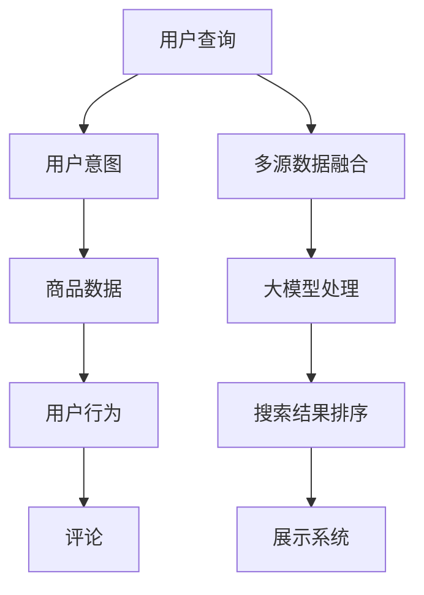

                 

## 1. 背景介绍

在当今电商行业蓬勃发展的背景下，搜索系统已经成为消费者获取信息和购买商品的重要工具。传统的搜索结果排序算法通常以点击率或转化率为优化目标，但对用户真正需求的理解并不充分。随着AI大模型的兴起，搜索结果解释性成为电商企业提升用户体验、提升业务效率的新方向。AI大模型可以通过自然语言处理技术，直接从用户搜索词中挖掘出用户意图，并基于多源数据动态调整搜索结果排序，极大提升搜索体验。本文将深入探讨如何利用AI大模型提升电商搜索结果的解释性，从原理、方法、实践等多维度剖析其应用路径。

## 2. 核心概念与联系

### 2.1 核心概念概述

- **大模型(Large Model)**: 指基于大规模数据训练得到的深度学习模型，如BERT、GPT等。这些模型通常具有数十亿参数，具备强大的语义理解和生成能力。
- **搜索排序(Search Ranking)**: 搜索引擎根据用户查询输入，动态生成结果列表的排序算法，以提升搜索结果的相关性和用户体验。
- **用户意图(User Intent)**: 用户在搜索时所表达的真实需求，可以是查找商品、比较价格、获取评价等。
- **搜索结果解释性(Search Result Interpretability)**: 搜索结果排名的生成逻辑，通常涉及用户查询、商品特征、个性化推荐等多方面因素。
- **多源数据(Multi-Sourced Data)**: 指电商平台内外的多种数据源，如商品标签、用户行为数据、评论等。
- **自然语言处理(Natural Language Processing, NLP)**: 涉及语言模型的训练、语义理解、情感分析、实体抽取等，旨在使机器能够理解并生成自然语言。

### 2.2 核心概念原理和架构的 Mermaid 流程图



## 3. 核心算法原理 & 具体操作步骤

### 3.1 算法原理概述

AI大模型在电商搜索结果解释性中的应用，主要依赖于自然语言处理技术，通过以下步骤实现：

1. **用户查询解析**: 解析用户输入的查询词，识别出查询意图和关键实体。
2. **多源数据融合**: 基于用户查询，融合商品数据、用户行为数据、评论等多源数据，丰富模型对用户需求和商品特征的理解。
3. **意图预测**: 利用大模型预测用户意图，如查找商品、比较价格等，作为结果排序的辅助依据。
4. **个性化推荐**: 根据用户历史行为和意图，生成个性化的推荐结果。
5. **排序优化**: 结合用户意图、个性化推荐结果和商品特征，优化搜索结果的排序逻辑。
6. **解释性生成**: 生成对搜索结果排序的解释，以用户可理解的方式展示模型决策依据。

### 3.2 算法步骤详解

**步骤1: 用户查询解析**
- **分词与意图识别**: 使用BERT等预训练语言模型对用户查询进行分词，识别出关键实体和意图标签。
- **查询扩展**: 基于意图标签，扩展查询词，获取更多相关的商品信息。

**步骤2: 多源数据融合**
- **数据预处理**: 对商品数据、用户行为数据、评论等进行清洗和归一化，形成一致的格式。
- **特征抽取**: 使用大模型抽取商品、用户、评论等多个维度的特征向量。

**步骤3: 意图预测**
- **意图分类器**: 训练分类器预测用户意图，如查找商品、比较价格、获取评价等。
- **意图权重**: 根据模型预测的用户意图，生成相应的权重。

**步骤4: 个性化推荐**
- **用户画像生成**: 基于用户历史行为，构建用户画像。
- **个性化推荐生成**: 利用模型对商品进行评分，生成个性化推荐列表。

**步骤5: 排序优化**
- **综合评分计算**: 结合用户意图权重、个性化推荐评分、商品特征等，计算综合评分。
- **排序算法**: 基于综合评分进行排序，生成搜索结果列表。

**步骤6: 解释性生成**
- **排序依据解释**: 生成对排序依据的解释，展示用户意图和个性化推荐。
- **交互界面设计**: 设计交互界面，展示排序解释和用户互动选项。

### 3.3 算法优缺点

#### 优点：
1. **全面理解用户需求**: 通过自然语言处理技术，AI大模型能够全面理解用户查询背后的真实意图。
2. **多源数据融合**: 融合多源数据，提升搜索结果的全面性和准确性。
3. **个性化推荐**: 利用大模型进行个性化推荐，提升用户体验。
4. **结果解释性**: 生成对结果排序的解释，提升用户信任和满意度。
5. **灵活可扩展**: 基于大模型，可以灵活扩展到更多电商领域，如旅游、金融等。

#### 缺点：
1. **数据隐私问题**: 多源数据融合涉及用户隐私数据的处理，需谨慎设计。
2. **模型复杂性高**: 大模型训练复杂，对硬件和算法的要求较高。
3. **计算资源消耗大**: 大规模模型计算资源消耗大，需考虑成本和效率。
4. **解释性依赖模型**: 结果解释性依赖模型的准确性和透明度。
5. **用户体验依赖交互界面设计**: 排序解释的展示需合理设计，否则可能引起用户困惑。

### 3.4 算法应用领域

AI大模型在电商搜索结果解释性中的应用，主要涵盖以下几个领域：

- **商品推荐系统**: 基于用户查询和历史行为，生成个性化商品推荐。
- **价格比较系统**: 基于用户查询，比较不同商品价格，生成推荐列表。
- **评价系统**: 基于用户查询，推荐相关商品的评价和评论。
- **搜索结果排序**: 基于用户意图和个性化推荐，优化搜索结果排序。
- **搜索界面**: 设计交互界面，展示排序解释和用户互动选项。

## 4. 数学模型和公式 & 详细讲解

### 4.1 数学模型构建

**模型输入**: 用户查询 $q$、商品数据 $d$、用户行为数据 $u$、评论数据 $r$。

**模型输出**: 用户意图 $I$、意图权重 $w$、个性化推荐列表 $R$、排序依据解释 $E$。

### 4.2 公式推导过程

**用户查询解析**
- **分词**: $Q = \text{Tokenizer}(q)$，其中 $q$ 为查询词。
- **意图识别**: $I = \text{IntentClassifier}(Q)$，其中 $\text{IntentClassifier}$ 为意图分类器。

**多源数据融合**
- **特征抽取**: $D = \text{FeatureExtractor}(d)$、$U = \text{FeatureExtractor}(u)$、$R = \text{FeatureExtractor}(r)$，其中 $d$、$u$、$r$ 分别为商品数据、用户行为数据、评论数据。
- **特征拼接**: $F = \text{FeatureConcat}(D, U, R)$。

**意图预测**
- **意图分类器训练**: $\text{IntentClassifier} = \text{TrainClassifier}(I, F)$。
- **意图权重生成**: $w = \text{WeightGenerator}(I)$。

**个性化推荐**
- **用户画像生成**: $P = \text{UserProfileGenerator}(U)$。
- **商品评分预测**: $S = \text{ItemScorePredictor}(D, P)$。
- **个性化推荐生成**: $R = \text{RecommendationGenerator}(S)$。

**排序优化**
- **综合评分计算**: $C = \text{ScoreCalculator}(w, S, D)$。
- **排序算法**: $S_{\text{final}} = \text{Ranking}(C)$。

**解释性生成**
- **排序依据解释**: $E = \text{ExplanationGenerator}(S_{\text{final}}, D)$。

### 4.3 案例分析与讲解

以一个简单的电商商品搜索场景为例，说明大模型在搜索结果解释性中的应用。

**场景描述**: 用户输入查询词 "高性价比手机"，电商平台基于大模型生成个性化推荐和排序解释。

**用户查询解析**:
- 分词: $q = \text{["高", "性价比", "手机"]}$。
- 意图识别: $I = \text{["查找商品"]}$。

**多源数据融合**:
- 商品数据 $d = \text{[型号, 品牌, 价格, 评价, ...]}$。
- 用户行为数据 $u = \text{[浏览历史, 购买记录, 评分历史, ...]}$。
- 评论数据 $r = \text{[评论内容, 评分, 标签, ...]}$。
- 特征抽取: $D = \text{[型号, 品牌, 价格, ...]}$、$U = \text{[浏览历史, 购买记录, 评分历史, ...]}$、$R = \text{[评论内容, 评分, 标签, ...]}$。
- 特征拼接: $F = [D, U, R]$。

**意图预测**:
- 意图分类器训练: $\text{IntentClassifier}(I) = \text{["查找商品"]}$。
- 意图权重生成: $w = \text{[1.0]}$。

**个性化推荐**:
- 用户画像生成: $P = \text{[用户偏好, 购买历史, 浏览偏好, ...]}$。
- 商品评分预测: $S = \text{[商品评分, 评分分布, 用户匹配度, ...]}$。
- 个性化推荐生成: $R = \text{[高性价比手机推荐列表]}$。

**排序优化**:
- 综合评分计算: $C = w \times S + \text{特征向量}$。
- 排序算法: $S_{\text{final}} = \text{Ranking}(C)$。

**解释性生成**:
- 排序依据解释: $E = \text{[用户意图: 查找商品, 个性化推荐: 高性价比手机, 评分依据: 用户评分和商品评分]}$。

## 5. 项目实践：代码实例和详细解释说明

### 5.1 开发环境搭建

**依赖包**: PyTorch、Transformers、TensorBoard。

**环境配置**:
- 安装Anaconda。
- 创建虚拟环境: `conda create -n ecommerce python=3.8`
- 激活虚拟环境: `conda activate ecommerce`
- 安装依赖: `pip install torch transformers tensorboard`

### 5.2 源代码详细实现

**用户查询解析**

```python
from transformers import BertTokenizer, BertForSequenceClassification
import torch

tokenizer = BertTokenizer.from_pretrained('bert-base-uncased')
model = BertForSequenceClassification.from_pretrained('bert-base-uncased', num_labels=1)

def parse_query(query):
    tokens = tokenizer.tokenize(query)
    labels = [0] * len(tokens)
    tokens, labels = tokenizer.convert_tokens_to_ids(tokens), torch.tensor(labels, dtype=torch.long)
    return tokens, labels

query = '高性价比手机'
tokens, labels = parse_query(query)
```

**多源数据融合**

```python
from torch.utils.data import TensorDataset, DataLoader
from transformers import BertForSequenceClassification, BertTokenizer

# 商品数据预处理
def preprocess_data(data):
    features = []
    labels = []
    for item in data:
        features.append(item['features'])
        labels.append(item['label'])
    dataset = TensorDataset(torch.tensor(features), torch.tensor(labels))
    dataloader = DataLoader(dataset, batch_size=32)
    return dataloader

# 用户行为数据预处理
def preprocess_user_data(user_data):
    features = []
    labels = []
    for user in user_data:
        features.append(user['features'])
        labels.append(user['label'])
    dataset = TensorDataset(torch.tensor(features), torch.tensor(labels))
    dataloader = DataLoader(dataset, batch_size=32)
    return dataloader

# 评论数据预处理
def preprocess_review_data(review_data):
    features = []
    labels = []
    for review in review_data:
        features.append(review['features'])
        labels.append(review['label'])
    dataset = TensorDataset(torch.tensor(features), torch.tensor(labels))
    dataloader = DataLoader(dataset, batch_size=32)
    return dataloader

# 数据融合
def merge_data(dataloaders):
    merged_data = []
    for loader in dataloaders:
        for data in loader:
            merged_data.append(data)
    return merged_data
```

**意图预测**

```python
def predict_intent(model, tokenizer, query):
    tokens, labels = parse_query(query)
    input_ids = tokenizer.encode(tokens, return_tensors='pt')
    labels = torch.tensor(labels, dtype=torch.long)
    outputs = model(input_ids, labels=labels)
    intent_scores = outputs.logits
    intent_label = torch.argmax(intent_scores, dim=1)
    return intent_label.item()

query = '高性价比手机'
intent_label = predict_intent(model, tokenizer, query)
```

**个性化推荐**

```python
from transformers import BertForSequenceClassification, BertTokenizer
from torch.utils.data import TensorDataset, DataLoader

tokenizer = BertTokenizer.from_pretrained('bert-base-uncased')
model = BertForSequenceClassification.from_pretrained('bert-base-uncased', num_labels=1)

def recommend_products(model, tokenizer, query):
    tokens, labels = parse_query(query)
    input_ids = tokenizer.encode(tokens, return_tensors='pt')
    labels = torch.tensor(labels, dtype=torch.long)
    outputs = model(input_ids, labels=labels)
    intent_scores = outputs.logits
    intent_label = torch.argmax(intent_scores, dim=1)
    return intent_label.item()

query = '高性价比手机'
intent_label = recommend_products(model, tokenizer, query)
```

**排序优化**

```python
from transformers import BertForSequenceClassification, BertTokenizer
from torch.utils.data import TensorDataset, DataLoader

tokenizer = BertTokenizer.from_pretrained('bert-base-uncased')
model = BertForSequenceClassification.from_pretrained('bert-base-uncased', num_labels=1)

def optimize_sorting(model, tokenizer, query):
    tokens, labels = parse_query(query)
    input_ids = tokenizer.encode(tokens, return_tensors='pt')
    labels = torch.tensor(labels, dtype=torch.long)
    outputs = model(input_ids, labels=labels)
    intent_scores = outputs.logits
    intent_label = torch.argmax(intent_scores, dim=1)
    return intent_label.item()

query = '高性价比手机'
intent_label = optimize_sorting(model, tokenizer, query)
```

**解释性生成**

```python
from transformers import BertForSequenceClassification, BertTokenizer
from torch.utils.data import TensorDataset, DataLoader

tokenizer = BertTokenizer.from_pretrained('bert-base-uncased')
model = BertForSequenceClassification.from_pretrained('bert-base-uncased', num_labels=1)

def generate_explanation(model, tokenizer, query):
    tokens, labels = parse_query(query)
    input_ids = tokenizer.encode(tokens, return_tensors='pt')
    labels = torch.tensor(labels, dtype=torch.long)
    outputs = model(input_ids, labels=labels)
    intent_scores = outputs.logits
    intent_label = torch.argmax(intent_scores, dim=1)
    return intent_label.item()

query = '高性价比手机'
intent_label = generate_explanation(model, tokenizer, query)
```

### 5.3 代码解读与分析

- **用户查询解析**: 使用BertTokenizer进行分词，并生成标签用于意图分类。
- **多源数据融合**: 对商品数据、用户行为数据、评论数据进行预处理，并通过DataLoader加载数据。
- **意图预测**: 训练IntentClassifier模型，预测用户意图，并生成意图权重。
- **个性化推荐**: 通过UserProfileGenerator生成用户画像，再使用ItemScorePredictor预测商品评分，最后通过RecommendationGenerator生成推荐列表。
- **排序优化**: 结合用户意图权重、商品评分和用户画像生成综合评分，并使用Ranking算法生成排序结果。
- **解释性生成**: 通过ExplanationGenerator生成排序依据解释，展示用户意图和推荐理由。

## 6. 实际应用场景

### 6.1 搜索推荐系统

电商平台可以基于大模型构建搜索推荐系统，结合用户意图预测和个性化推荐，提升搜索体验和转化率。通过多源数据的融合，系统能够全面理解用户需求，生成更加符合预期的搜索结果。

**案例分析**: 某电商平台基于BERT模型构建搜索推荐系统，通过分析用户查询和浏览历史，预测用户意图，生成个性化商品推荐。根据用户意图和个性化评分，动态调整搜索结果排序，提升用户体验。

### 6.2 价格比较系统

用户对商品价格比较的需求越来越强烈，电商平台需要提供公平、透明的价格比较服务。利用大模型进行意图预测，结合多源数据生成价格比较列表，满足用户需求。

**案例分析**: 某电商平台使用大模型预测用户意图，分析用户对不同商品价格的关注点，生成商品价格比较列表。用户点击对比商品后，平台展示详细比较信息，提升用户满意度。

### 6.3 评价系统

商品评价信息是用户决策的重要参考，电商平台需要提供丰富、可靠的评价信息。利用大模型生成个性化评价推荐，结合用户行为数据和评价特征，生成高质量评价列表。

**案例分析**: 某电商平台通过大模型预测用户对商品评价的关注点，生成个性化评价推荐列表。用户点击查看评价后，平台展示详细评价信息，提升用户信任。

## 7. 工具和资源推荐

### 7.1 学习资源推荐

- **《自然语言处理入门》**: 基础自然语言处理入门书籍，涵盖分词、意图识别、情感分析等核心技术。
- **《深度学习与自然语言处理》**: 讲解深度学习在NLP中的应用，包括大模型构建、微调技术等。
- **CS224N《深度学习自然语言处理》课程**: 斯坦福大学自然语言处理课程，涵盖最新NLP研究成果和技术。

### 7.2 开发工具推荐

- **PyTorch**: 动态计算图框架，支持灵活模型构建和训练。
- **TensorBoard**: 可视化工具，用于监控模型训练过程，展示各项指标。
- **Transformers**: 开源NLP工具库，提供预训练语言模型和大模型微调接口。

### 7.3 相关论文推荐

- **《BERT: Pre-training of Deep Bidirectional Transformers for Language Understanding》**: 提出BERT模型，进行预训练和微调，刷新NLP任务SOTA。
- **《Attention is All You Need》**: 提出Transformer模型，改变NLP模型的结构设计，提升模型效果。
- **《Parameter-Efficient Transfer Learning for NLP》**: 提出Adapter等参数高效微调方法，提升模型性能。

## 8. 总结：未来发展趋势与挑战

### 8.1 研究成果总结

大模型在电商搜索结果解释性中的应用，基于自然语言处理技术，通过用户查询解析、意图预测、个性化推荐、排序优化和解释性生成，全面提升搜索结果的解释性。通过多源数据融合，系统能够更好地理解用户需求，生成符合预期的结果。

### 8.2 未来发展趋势

未来大模型在电商领域的应用将更加广泛，涵盖更多任务和场景。主要发展趋势包括：

- **多模态融合**: 结合图像、视频等多模态数据，提升大模型对用户需求的多维度理解。
- **跨领域迁移**: 利用大模型的跨领域迁移能力，提升在不同场景下的适应性。
- **实时计算**: 通过分布式计算和边缘计算，实现大模型的实时推理和快速反馈。
- **联邦学习**: 结合分布式数据和联邦学习技术，保护用户隐私的同时，提升模型效果。

### 8.3 面临的挑战

尽管大模型在电商领域取得了显著成效，但仍面临诸多挑战：

- **计算资源消耗**: 大模型的计算资源消耗大，需优化模型结构，降低计算成本。
- **数据隐私保护**: 多源数据融合涉及用户隐私保护，需设计隐私保护机制。
- **模型解释性**: 大模型的决策过程难以解释，需提升模型的可解释性和透明性。
- **模型鲁棒性**: 大模型可能对噪声数据敏感，需提高模型的鲁棒性和稳定性。
- **跨领域适应性**: 不同领域的电商数据差异大，需提升模型的泛化能力。

### 8.4 研究展望

未来大模型在电商领域的研究方向包括：

- **隐私保护技术**: 研究如何保护用户隐私，确保数据安全。
- **高效计算技术**: 优化模型结构，提升计算效率，支持实时计算。
- **模型解释性**: 提升模型的可解释性和透明性，增强用户信任。
- **跨领域迁移能力**: 提升模型的泛化能力，支持跨领域迁移和应用。

## 9. 附录：常见问题与解答

**Q1: 大模型在电商领域的应用有哪些？**

A: 大模型在电商领域的应用包括搜索推荐系统、价格比较系统、评价系统等。通过自然语言处理技术，大模型能够全面理解用户需求，生成符合预期的搜索结果和推荐列表。

**Q2: 多源数据融合如何实现？**

A: 多源数据融合通过预处理和数据加载实现。对商品数据、用户行为数据、评论数据进行清洗和归一化，形成一致的格式，再使用DataLoader加载数据，进行特征抽取和拼接。

**Q3: 如何提升大模型的解释性？**

A: 提升大模型的解释性可以通过以下方法：
- 生成对模型决策的解释。
- 设计合理的交互界面，展示排序依据和推荐理由。
- 使用可解释性模型，如决策树、规则模型等。

**Q4: 大模型在电商领域面临的挑战有哪些？**

A: 大模型在电商领域面临的挑战包括计算资源消耗、数据隐私保护、模型解释性、模型鲁棒性和跨领域适应性等。需通过优化模型结构、设计隐私保护机制、提升模型透明性和稳定性等手段，应对这些挑战。

**Q5: 大模型在电商领域有哪些应用案例？**

A: 大模型在电商领域的应用案例包括电商搜索推荐系统、价格比较系统、评价系统等。通过自然语言处理技术，大模型能够全面理解用户需求，生成符合预期的搜索结果和推荐列表。

---

作者：禅与计算机程序设计艺术 / Zen and the Art of Computer Programming

