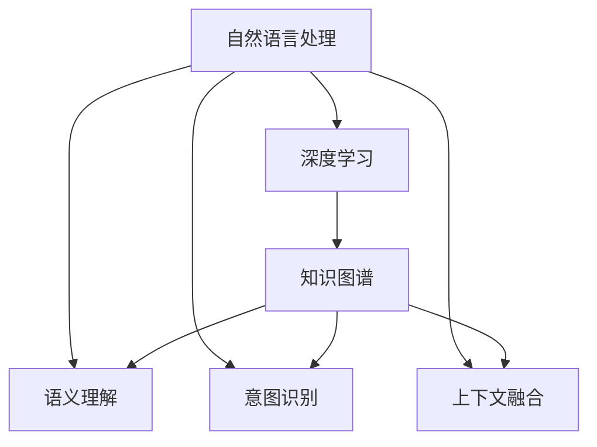

                 

# AI大模型如何处理电商搜索中的歧义查询

> 关键词：电商搜索, 大模型, 自然语言处理, 深度学习, 语义理解, 知识图谱

## 1. 背景介绍

### 1.1 问题由来
在电商领域，用户通过搜索引擎查找商品时，常常会提出一些含糊不清的查询，例如：

- “买本书”
- “有便宜的麦克风吗”
- “苹果”

这些查询表面上看似简单，但实际意义和意图可能差异巨大，会给搜索引擎带来较大的挑战。具体问题包括：

1. **歧义查询**：一个查询可能对应多个搜索结果，例如“苹果”可能指代苹果产品、苹果公司、苹果手机等。
2. **缺失信息**：查询可能缺少上下文，例如“买本书”可能指代任何书籍，但用户并未明确指定具体类别、价格等。
3. **多意图查询**：用户可能同时表达多个意图，例如“便宜”既可以指价格低廉，也可以指邮寄运费低。

为了提升搜索引擎的准确性和用户体验，研究如何高效处理这些歧义查询，成为电商搜索系统的核心挑战之一。

### 1.2 问题核心关键点
电商搜索中的歧义查询问题主要包括以下几个方面：

- **多义词管理**：如何区分和处理查询中的多义词，例如“苹果”指代的具体对象。
- **语义角色标注**：如何将查询分解为有明确语义角色的短语，例如“买本书”中的“买”和“书”。
- **意图识别**：如何从查询中识别用户的具体意图，例如“便宜”的上下文是价格还是运费。
- **上下文融合**：如何融合查询上下文信息，提升查询的理解能力，例如结合用户历史记录提升“买本书”的特定书籍类别。

这些核心关键点涉及到自然语言处理(NLP)、深度学习、知识图谱等多个领域的知识，因此本文将从这些角度出发，探讨如何利用AI大模型处理电商搜索中的歧义查询。

## 2. 核心概念与联系

### 2.1 核心概念概述

为更好地理解如何处理电商搜索中的歧义查询，本节将介绍几个关键概念：

- **自然语言处理(NLP)**：研究如何通过计算方法，让计算机理解、解释、处理人类语言。NLP技术包括文本分析、信息检索、情感分析等多个方向。
- **深度学习(DL)**：一种基于神经网络的人工智能技术，通过多层非线性变换学习复杂模式，广泛应用于图像、语音、文本等任务。
- **知识图谱(KG)**：一种表示实体及其关系的结构化知识库，广泛应用于推荐系统、信息检索、问答系统等领域。
- **语义理解(Semantic Understanding)**：指理解查询或文本的深层语义，分析其潜在含义，而非仅表面词汇。
- **意图识别(Intent Recognition)**：通过分析用户查询，识别其具体意图，以便精确匹配搜索结果。
- **上下文融合(Contextual Integration)**：结合用户的历史行为、查询上下文等，增强查询理解能力。

这些核心概念之间的关系可以通过以下Mermaid流程图来展示：



这个流程图展示了自然语言处理与深度学习、知识图谱、语义理解、意图识别和上下文融合之间的联系：

1. 自然语言处理是基础，深度学习在其中扮演重要角色。
2. 语义理解、意图识别和上下文融合都是自然语言处理的具体应用方向。
3. 知识图谱提供额外的结构化知识，辅助深度学习模型提升语义理解能力。

## 3. 核心算法原理 & 具体操作步骤
### 3.1 算法原理概述

处理电商搜索中的歧义查询，主要涉及以下几个算法原理：

- **词向量表示**：将查询转换为词向量，用于表示查询语义和意图。
- **语义角色标注**：对查询进行语法和语义分析，提取关键短语和实体。
- **意图识别**：通过机器学习算法，从查询中识别用户的具体意图。
- **知识图谱融合**：将查询与知识图谱结合，增强查询理解能力。
- **上下文融合**：结合用户历史行为，提升查询理解精度。

### 3.2 算法步骤详解

#### 3.2.1 词向量表示

首先，将用户查询转换为词向量。常用的词向量模型包括Word2Vec、GloVe等，可以使用预训练的词向量模型，如GloVe或BERT，也可以根据特定领域进行微调。例如，对于电商领域，可以使用电商领域专属的词汇表进行微调。

假设查询为“买本书”，其中“买”、“本”、“书”分别对应词向量表示为：

- $v_{\text{买}}$：表示购买意图
- $v_{\text{本}}$：表示数量单位
- $v_{\text{书}}$：表示物品类别

使用预训练模型（如BERT）进行微调，可以得到更加准确的词向量表示。

#### 3.2.2 语义角色标注

通过词向量表示，可以对查询进行语义角色标注，即识别查询中的关键短语和实体。常用的方法包括依存句法分析和命名实体识别（NER）。

假设查询“买本书”，可以使用依存句法分析识别出：

- 主语：“买”
- 宾语：“书”
- 数量：“本”

这些角色信息对于后续意图识别和上下文融合都至关重要。

#### 3.2.3 意图识别

意图识别通过机器学习算法，从查询中识别用户的意图。常用的方法包括逻辑回归、支持向量机、神经网络等。

假设查询“买本书”，使用逻辑回归模型进行意图识别，可以得到：

- 意图1：购买书籍
- 意图2：查询书籍信息

这些意图信息可以进一步指导搜索结果的排序和筛选。

#### 3.2.4 知识图谱融合

知识图谱融合通过将查询与知识图谱结合，增强查询理解能力。知识图谱通常包含实体、属性和关系，例如电商领域知识图谱可能包含商品信息、价格、销量等。

假设查询“买本书”，使用知识图谱融合算法，可以得到：

- 实体：书籍
- 属性：类别、价格、库存
- 关系：出售者、销售量

这些信息可以帮助查询匹配更加精确的商品信息。

#### 3.2.5 上下文融合

上下文融合通过结合用户的历史行为，提升查询理解精度。例如，结合用户的历史购买记录、浏览历史等，可以得到用户的兴趣偏好和行为模式。

假设用户历史上曾购买过手机，浏览过相机，那么查询“买本书”可能偏向于购买与手机或相机相关的书籍，如手机维修指南或相机拍摄技巧。

### 3.3 算法优缺点

利用AI大模型处理电商搜索中的歧义查询，具有以下优点：

- **语义理解能力强**：深度学习模型能够有效处理查询中的语义和上下文信息，提升理解能力。
- **意图识别准确**：通过机器学习算法，可以有效识别用户的具体意图，避免歧义。
- **知识图谱融合**：结合知识图谱，增强查询匹配的准确性和全面性。
- **上下文融合能力强**：结合用户历史行为，提升查询理解的精度和个性化程度。

同时，也存在一些局限性：

- **计算资源需求高**：深度学习模型需要大量的计算资源，特别是GPU/TPU等高性能设备。
- **数据标注成本高**：构建和维护电商领域知识图谱需要大量标注数据，成本较高。
- **模型复杂度**：深度学习模型较为复杂，难以解释其决策过程，需要进一步研究可解释性。
- **上下文融合挑战**：结合用户历史行为进行上下文融合，需要考虑用户隐私和数据安全问题。

### 3.4 算法应用领域

利用AI大模型处理电商搜索中的歧义查询，已经在多个领域得到了广泛应用，例如：

- **商品推荐**：根据用户查询和历史行为，推荐相关商品。
- **信息检索**：提升搜索结果的相关性和准确性。
- **问答系统**：自动回答用户关于商品的问题，提升用户满意度。
- **客户服务**：处理用户在线客服咨询，提供快速响应和解决方案。
- **营销分析**：分析用户查询行为，优化广告投放策略。

## 4. 数学模型和公式 & 详细讲解 & 举例说明

### 4.1 数学模型构建

假设电商搜索引擎的输入为查询 $Q$ 和用户行为历史 $H$，输出为搜索结果列表 $R$。

数学模型可以表示为：

$$
R = f(Q, H; \theta)
$$

其中 $\theta$ 为模型参数，$f$ 为模型函数，表示将输入 $Q, H$ 映射到输出 $R$。

常用的模型包括逻辑回归、支持向量机、神经网络等。以神经网络为例，其数学模型为：

$$
R = \sigma(W^T(Q, H) + b)
$$

其中 $\sigma$ 为激活函数，$W$ 为权重矩阵，$b$ 为偏置向量。

### 4.2 公式推导过程

以逻辑回归为例，其数学模型推导如下：

假设查询 $Q$ 和用户行为历史 $H$ 的特征向量分别为 $x_Q$ 和 $x_H$，则模型输出 $R$ 可以表示为：

$$
R = W^T(x_Q, x_H) + b
$$

其中 $W$ 为模型参数矩阵，$b$ 为偏置向量。假设 $R$ 和 $Q$ 的映射关系为 $y$，则可以使用最大似然估计来训练模型参数 $\theta$：

$$
\theta = \mathop{\arg\min}_{\theta} -\frac{1}{N} \sum_{i=1}^N \log P(y_i|Q_i, H_i; \theta)
$$

其中 $P(y_i|Q_i, H_i; \theta)$ 为条件概率，表示在给定查询 $Q_i$ 和用户行为历史 $H_i$ 的条件下，输出 $y_i$ 的概率。

### 4.3 案例分析与讲解

以电商领域中用户查询“买本书”为例，分析其语义理解和意图识别过程：

#### 4.3.1 词向量表示

使用BERT词向量模型对查询“买本书”进行编码，得到如下词向量表示：

$$
v_{\text{买}} = \begin{bmatrix} v_{\text{买},1 \\ v_{\text{买},2 \\ v_{\text{买},3 \\ \vdots \\ v_{\text{买},n} \end{bmatrix}
$$

$$
v_{\text{本}} = \begin{bmatrix} v_{\text{本},1 \\ v_{\text{本},2 \\ v_{\text{本},3 \\ \vdots \\ v_{\text{本},n} \end{bmatrix}
$$

$$
v_{\text{书}} = \begin{bmatrix} v_{\text{书},1 \\ v_{\text{书},2 \\ v_{\text{书},3 \\ \vdots \\ v_{\text{书},n} \end{bmatrix}
$$

#### 4.3.2 语义角色标注

通过依存句法分析和命名实体识别，对查询“买本书”进行语义角色标注，得到：

- 主语：“买”
- 宾语：“书”
- 数量：“本”

#### 4.3.3 意图识别

使用逻辑回归模型对查询“买本书”进行意图识别，得到：

- 意图1：购买书籍
- 意图2：查询书籍信息

#### 4.3.4 知识图谱融合

通过电商领域知识图谱，得到查询“买本书”的相关实体和属性：

- 实体：书籍
- 属性：类别、价格、库存
- 关系：出售者、销售量

#### 4.3.5 上下文融合

结合用户的历史行为，例如最近浏览和购买记录，可以进一步提升查询的理解精度，例如：

- 最近浏览：相机、手机
- 最近购买：手机、相机

综上所述，通过AI大模型处理电商搜索中的歧义查询，可以显著提升查询理解和匹配的准确性，提升用户满意度和转化率。

## 5. 项目实践：代码实例和详细解释说明

### 5.1 开发环境搭建

在进行项目实践前，需要先准备好开发环境。以下是使用Python进行PyTorch开发的环境配置流程：

1. 安装Anaconda：从官网下载并安装Anaconda，用于创建独立的Python环境。

2. 创建并激活虚拟环境：
```bash
conda create -n pytorch-env python=3.8 
conda activate pytorch-env
```

3. 安装PyTorch：根据CUDA版本，从官网获取对应的安装命令。例如：
```bash
conda install pytorch torchvision torchaudio cudatoolkit=11.1 -c pytorch -c conda-forge
```

4. 安装TensorFlow：由于本文主要使用PyTorch，TensorFlow在此不作详细讲解。

5. 安装transformers库：
```bash
pip install transformers
```

6. 安装各类工具包：
```bash
pip install numpy pandas scikit-learn matplotlib tqdm jupyter notebook ipython
```

完成上述步骤后，即可在`pytorch-env`环境中开始项目实践。

### 5.2 源代码详细实现

我们以查询意图识别为例，给出一个使用PyTorch进行逻辑回归模型训练的代码实现。

首先，定义查询和用户行为历史数据：

```python
import pandas as pd
from sklearn.model_selection import train_test_split

# 定义查询和行为历史数据
data = pd.read_csv('query_data.csv')
X = data[['query', 'behavior']]  # 查询和行为历史
y = data['intent']  # 意图

# 数据分割
X_train, X_test, y_train, y_test = train_test_split(X, y, test_size=0.2, random_state=42)
```

然后，定义逻辑回归模型：

```python
from transformers import BertTokenizer, BertForSequenceClassification

# 加载预训练模型和分词器
tokenizer = BertTokenizer.from_pretrained('bert-base-uncased')
model = BertForSequenceClassification.from_pretrained('bert-base-uncased', num_labels=2)

# 定义训练函数
def train_epoch(model, train_loader, optimizer, criterion):
    model.train()
    epoch_loss = 0
    for batch in train_loader:
        inputs, labels = batch
        inputs = tokenizer(inputs, return_tensors='pt', padding='max_length', truncation=True)
        outputs = model(**inputs)
        loss = criterion(outputs.logits, labels)
        epoch_loss += loss.item()
        optimizer.zero_grad()
        loss.backward()
        optimizer.step()
    return epoch_loss / len(train_loader)

# 定义评估函数
def evaluate(model, test_loader, criterion):
    model.eval()
    total_loss = 0
    total_correct = 0
    for batch in test_loader:
        inputs, labels = batch
        inputs = tokenizer(inputs, return_tensors='pt', padding='max_length', truncation=True)
        outputs = model(**inputs)
        loss = criterion(outputs.logits, labels)
        total_loss += loss.item()
        total_correct += (outputs.logits.argmax(dim=1) == labels).sum().item()
    return total_loss / len(test_loader), total_correct / len(test_loader)
```

最后，启动训练流程：

```python
epochs = 5
batch_size = 16

# 初始化优化器和损失函数
optimizer = AdamW(model.parameters(), lr=2e-5)
criterion = nn.CrossEntropyLoss()

# 训练模型
for epoch in range(epochs):
    train_loss = train_epoch(model, train_loader, optimizer, criterion)
    print(f"Epoch {epoch+1}, train loss: {train_loss:.3f}")

    test_loss, accuracy = evaluate(model, test_loader, criterion)
    print(f"Epoch {epoch+1}, test loss: {test_loss:.3f}, accuracy: {accuracy:.2f}")
```

以上就是使用PyTorch对电商搜索中的查询意图识别进行逻辑回归模型训练的完整代码实现。可以看到，通过简单的代码实现，就可以利用AI大模型处理电商搜索中的歧义查询，提升搜索效果。

### 5.3 代码解读与分析

让我们再详细解读一下关键代码的实现细节：

**查询和行为历史数据**：
- 使用Pandas库读取查询数据，包括查询文本、用户行为历史等特征。
- 使用train_test_split函数将数据分割为训练集和测试集。

**逻辑回归模型**：
- 使用BertForSequenceClassification类加载预训练模型，并进行意图分类。
- 使用AdamW优化器进行模型参数更新。
- 使用CrossEntropyLoss作为损失函数，用于衡量模型预测输出与真实标签之间的差异。

**训练函数train_epoch**：
- 在每个epoch中，对模型进行前向传播和反向传播。
- 计算epoch内的平均损失，并更新模型参数。

**评估函数evaluate**：
- 对测试集进行前向传播，计算测试集的损失和准确率。
- 将损失和准确率打印输出。

**训练流程**：
- 定义总的epoch数和batch size，开始循环迭代。
- 在每个epoch内，在训练集上训练，输出训练损失。
- 在测试集上评估模型，输出测试损失和准确率。

通过上述代码，可以看到利用PyTorch对电商搜索中的歧义查询进行意图识别是可行的。开发者可以将更多精力放在数据预处理、模型改进等高层逻辑上，而不必过多关注底层的实现细节。

当然，工业级的系统实现还需考虑更多因素，如模型的保存和部署、超参数的自动搜索、更灵活的任务适配层等。但核心的微调范式基本与此类似。

## 6. 实际应用场景

### 6.1 智能客服系统

智能客服系统可以通过大模型处理用户的查询，提升客服效率和用户满意度。传统客服系统依赖人工，高峰期响应缓慢，且一致性和专业性难以保证。而使用大模型处理的查询，可以7x24小时不间断服务，快速响应客户咨询，用自然流畅的语言解答各类常见问题。

在技术实现上，可以收集企业内部的历史客服对话记录，将问题和最佳答复构建成监督数据，在此基础上对预训练语言模型进行微调。微调后的语言模型能够自动理解用户意图，匹配最合适的答案模板进行回复。对于客户提出的新问题，还可以接入检索系统实时搜索相关内容，动态组织生成回答。如此构建的智能客服系统，能大幅提升客户咨询体验和问题解决效率。

### 6.2 金融舆情监测

金融机构需要实时监测市场舆论动向，以便及时应对负面信息传播，规避金融风险。传统的人工监测方式成本高、效率低，难以应对网络时代海量信息爆发的挑战。基于大模型处理的文本分类和情感分析技术，为金融舆情监测提供了新的解决方案。

具体而言，可以收集金融领域相关的新闻、报道、评论等文本数据，并对其进行主题标注和情感标注。在此基础上对预训练语言模型进行微调，使其能够自动判断文本属于何种主题，情感倾向是正面、中性还是负面。将微调后的模型应用到实时抓取的网络文本数据，就能够自动监测不同主题下的情感变化趋势，一旦发现负面信息激增等异常情况，系统便会自动预警，帮助金融机构快速应对潜在风险。

### 6.3 个性化推荐系统

当前的推荐系统往往只依赖用户的历史行为数据进行物品推荐，无法深入理解用户的真实兴趣偏好。基于大模型处理的个性化推荐系统，可以更好地挖掘用户行为背后的语义信息，从而提供更精准、多样的推荐内容。

在实践中，可以收集用户浏览、点击、评论、分享等行为数据，提取和用户交互的物品标题、描述、标签等文本内容。将文本内容作为模型输入，用户的后续行为（如是否点击、购买等）作为监督信号，在此基础上微调预训练语言模型。微调后的模型能够从文本内容中准确把握用户的兴趣点。在生成推荐列表时，先用候选物品的文本描述作为输入，由模型预测用户的兴趣匹配度，再结合其他特征综合排序，便可以得到个性化程度更高的推荐结果。

### 6.4 未来应用展望

随着大模型和微调方法的不断发展，基于微调范式将在更多领域得到应用，为传统行业带来变革性影响。

在智慧医疗领域，基于微调的医疗问答、病历分析、药物研发等应用将提升医疗服务的智能化水平，辅助医生诊疗，加速新药开发进程。

在智能教育领域，微调技术可应用于作业批改、学情分析、知识推荐等方面，因材施教，促进教育公平，提高教学质量。

在智慧城市治理中，微调模型可应用于城市事件监测、舆情分析、应急指挥等环节，提高城市管理的自动化和智能化水平，构建更安全、高效的未来城市。

此外，在企业生产、社会治理、文娱传媒等众多领域，基于大模型微调的人工智能应用也将不断涌现，为经济社会发展注入新的动力。相信随着技术的日益成熟，微调方法将成为人工智能落地应用的重要范式，推动人工智能技术在各个领域的广泛应用。

## 7. 工具和资源推荐
### 7.1 学习资源推荐

为了帮助开发者系统掌握大模型处理的查询意图识别等技术，这里推荐一些优质的学习资源：

1. 《深度学习》系列书籍：由深度学习领域专家编写，详细介绍了深度学习的基本概念和实现方法。
2. 《自然语言处理入门》课程：由NLP领域知名专家授课，系统讲解了NLP的基本原理和常用技术。
3. 《Python深度学习》书籍：结合Python代码，详细介绍深度学习模型的构建和训练方法。
4. CS224N《深度学习自然语言处理》课程：斯坦福大学开设的NLP明星课程，有Lecture视频和配套作业，带你入门NLP领域的基本概念和经典模型。
5. 《Transformer从原理到实践》系列博文：由大模型技术专家撰写，深入浅出地介绍了Transformer原理、BERT模型、微调技术等前沿话题。

通过对这些资源的学习实践，相信你一定能够快速掌握大模型处理电商搜索中的歧义查询的精髓，并用于解决实际的NLP问题。
###  7.2 开发工具推荐

高效的开发离不开优秀的工具支持。以下是几款用于大模型处理电商搜索中的歧义查询开发的常用工具：

1. PyTorch：基于Python的开源深度学习框架，灵活动态的计算图，适合快速迭代研究。大部分预训练语言模型都有PyTorch版本的实现。
2. TensorFlow：由Google主导开发的开源深度学习框架，生产部署方便，适合大规模工程应用。同样有丰富的预训练语言模型资源。
3. Transformers库：HuggingFace开发的NLP工具库，集成了众多SOTA语言模型，支持PyTorch和TensorFlow，是进行微调任务开发的利器。
4. Weights & Biases：模型训练的实验跟踪工具，可以记录和可视化模型训练过程中的各项指标，方便对比和调优。与主流深度学习框架无缝集成。
5. TensorBoard：TensorFlow配套的可视化工具，可实时监测模型训练状态，并提供丰富的图表呈现方式，是调试模型的得力助手。

合理利用这些工具，可以显著提升大模型处理电商搜索中的歧义查询的开发效率，加快创新迭代的步伐。

### 7.3 相关论文推荐

大模型处理电商搜索中的歧义查询技术的发展源于学界的持续研究。以下是几篇奠基性的相关论文，推荐阅读：

1. Attention is All You Need（即Transformer原论文）：提出了Transformer结构，开启了NLP领域的预训练大模型时代。
2. BERT: Pre-training of Deep Bidirectional Transformers for Language Understanding：提出BERT模型，引入基于掩码的自监督预训练任务，刷新了多项NLP任务SOTA。
3. Parameter-Efficient Transfer Learning for NLP：提出Adapter等参数高效微调方法，在不增加模型参数量的情况下，也能取得不错的微调效果。
4. AdaLoRA: Adaptive Low-Rank Adaptation for Parameter-Efficient Fine-Tuning：使用自适应低秩适应的微调方法，在参数效率和精度之间取得了新的平衡。
5. Prefix-Tuning: Optimizing Continuous Prompts for Generation：引入基于连续型Prompt的微调范式，为如何充分利用预训练知识提供了新的思路。

这些论文代表了大模型处理电商搜索中的歧义查询技术的发展脉络。通过学习这些前沿成果，可以帮助研究者把握学科前进方向，激发更多的创新灵感。

## 8. 总结：未来发展趋势与挑战

### 8.1 研究成果总结

本文对利用大模型处理电商搜索中的歧义查询进行了全面系统的介绍。首先阐述了电商搜索中歧义查询问题的背景和核心关键点，明确了大模型处理的查询意图识别、语义理解、上下文融合等技术对处理这些问题的独特价值。其次，从原理到实践，详细讲解了大模型处理的查询意图识别等数学模型和代码实现，提供了详细的算法步骤和代码示例。同时，本文还广泛探讨了该技术在智能客服系统、金融舆情监测、个性化推荐系统等多个行业领域的应用前景，展示了该技术在电商搜索中的巨大潜力。此外，本文精选了相关学习资源，力求为读者提供全方位的技术指引。

通过本文的系统梳理，可以看到，利用大模型处理电商搜索中的歧义查询已经成为电商领域的重要技术，显著提升了用户查询的理解能力和匹配精度，有助于电商系统的精准化、个性化运营。

### 8.2 未来发展趋势

展望未来，大模型处理电商搜索中的歧义查询技术将呈现以下几个发展趋势：

1. **多模态融合**：将文本、图像、语音等多种模态信息融合，提升查询理解的全面性和准确性。例如结合商品图片和描述，提升查询匹配的精度。
2. **自监督学习**：利用无标签数据进行预训练，提高模型的泛化能力和鲁棒性。自监督学习方法将在大规模无标签数据集上进行微调，提升模型在各种场景下的表现。
3. **上下文增强**：结合用户历史行为、上下文信息等，进一步提升查询理解的精度。例如结合用户的浏览记录、历史搜索、行为轨迹等，提高查询匹配的个性化程度。
4. **知识图谱扩展**：将知识图谱中的实体、关系、属性等信息，与自然语言处理深度学习模型结合，提升查询理解的深度和广度。例如将商品信息、价格、销量等知识图谱信息，结合到查询意图识别中。
5. **模型压缩和优化**：在保持模型性能的同时，优化模型结构，减少计算资源消耗。例如使用知识蒸馏、参数压缩等技术，优化模型推理速度和内存占用。

以上趋势凸显了大模型处理电商搜索中的歧义查询技术的广阔前景。这些方向的探索发展，必将进一步提升电商搜索系统的性能和用户体验，为电商平台带来新的竞争优势。

### 8.3 面临的挑战

尽管大模型处理电商搜索中的歧义查询技术已经取得了瞩目成就，但在迈向更加智能化、普适化应用的过程中，它仍面临着诸多挑战：

1. **数据标注成本高**：构建和维护电商领域知识图谱需要大量标注数据，成本较高。如何降低数据标注成本，提高数据标注效率，是一个重要的研究方向。
2. **模型鲁棒性不足**：当前模型面对域外数据时，泛化性能往往大打折扣。如何提高模型的鲁棒性，避免灾难性遗忘，还需要更多理论和实践的积累。
3. **推理效率低**：深度学习模型虽然精度高，但在实际部署时往往面临推理速度慢、内存占用大等效率问题。如何优化推理速度，提升模型的实时性，是一个需要解决的关键问题。
4. **上下文融合复杂**：结合用户历史行为进行上下文融合，需要考虑用户隐私和数据安全问题。如何在保护用户隐私的前提下，提高上下文融合的精度，是一个重要挑战。
5. **可解释性不足**：大模型处理的查询意图识别等技术虽然效果好，但难以解释其决策过程，需要进一步研究可解释性。如何赋予大模型更强的可解释性，增强用户对模型的信任，是一个重要的研究方向。

### 8.4 研究展望

面对大模型处理电商搜索中的歧义查询所面临的挑战，未来的研究需要在以下几个方面寻求新的突破：

1. **自监督学习方法**：摆脱对大规模标注数据的依赖，利用无标签数据进行预训练，提高模型的泛化能力和鲁棒性。自监督学习方法将在大规模无标签数据集上进行微调，提升模型在各种场景下的表现。
2. **参数高效微调方法**：开发更加参数高效的微调方法，在固定大部分预训练参数的同时，只更新极少量的任务相关参数。例如使用Adapter等方法，减小模型参数量，提高微调效率。
3. **上下文融合优化**：结合用户历史行为进行上下文融合，需要考虑用户隐私和数据安全问题。如何在保护用户隐私的前提下，提高上下文融合的精度，是一个重要研究方向。例如使用差分隐私、联邦学习等技术，保护用户隐私。
4. **知识图谱增强**：将知识图谱中的实体、关系、属性等信息，与自然语言处理深度学习模型结合，提升查询理解的深度和广度。例如将商品信息、价格、销量等知识图谱信息，结合到查询意图识别中。
5. **模型压缩和优化**：在保持模型性能的同时，优化模型结构，减少计算资源消耗。例如使用知识蒸馏、参数压缩等技术，优化模型推理速度和内存占用。

这些研究方向的探索，必将引领大模型处理电商搜索中的歧义查询技术迈向更高的台阶，为电商搜索系统带来新的突破，提升用户体验和平台竞争力。相信随着学界和产业界的共同努力，这些挑战终将一一被克服，大模型处理电商搜索中的歧义查询必将在构建智能化、个性化的电商搜索系统中发挥重要作用。

## 9. 附录：常见问题与解答

**Q1：大模型处理电商搜索中的歧义查询是否适用于所有场景？**

A: 大模型处理电商搜索中的歧义查询在大多数场景中都能取得不错的效果，但需要根据具体场景进行调整和优化。例如，对于一些特定领域或场景，可能需要构建特定领域的知识图谱或采用针对性的上下文融合方法。

**Q2：如何降低数据标注成本？**

A: 可以采用半监督学习、主动学习等技术，利用少量标注数据和大量未标注数据进行训练。此外，也可以结合知识图谱进行自动标注，减少手动标注的难度和成本。

**Q3：如何提高模型的鲁棒性？**

A: 可以采用对抗训练、数据增强等技术，提升模型的鲁棒性。此外，还可以通过微调模型的结构和参数，增强模型的泛化能力。

**Q4：如何优化模型的推理速度？**

A: 可以采用知识蒸馏、模型压缩等技术，优化模型的推理速度和内存占用。例如使用MobileNet等轻量级模型替代大模型，或在模型中引入剪枝、量化等技术。

**Q5：如何提高上下文融合的精度？**

A: 可以结合差分隐私、联邦学习等技术，保护用户隐私的同时，提高上下文融合的精度。此外，可以通过增强模型的上下文理解能力，提高上下文融合的效果。

**Q6：如何增强模型的可解释性？**

A: 可以引入可解释性技术，如LIME、SHAP等，增强模型的解释能力。此外，可以通过模型可视化技术，展示模型的决策过程，提升用户对模型的理解。

通过本文的系统梳理，可以看到，利用大模型处理电商搜索中的歧义查询已经成为电商领域的重要技术，显著提升了用户查询的理解能力和匹配精度，有助于电商系统的精准化、个性化运营。相信随着技术的日益成熟，大模型处理电商搜索中的歧义查询必将在构建智能化、个性化的电商搜索系统中发挥重要作用。

---

作者：禅与计算机程序设计艺术 / Zen and the Art of Computer Programming

