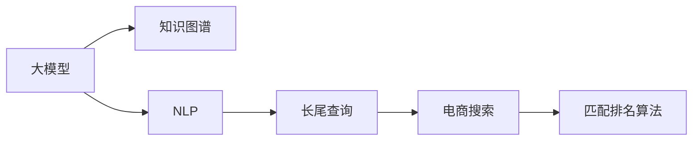

                 

# AI大模型如何处理电商搜索中的长尾查询

> 关键词：电商搜索,长尾查询,大模型,知识图谱,自然语言处理,NLP

## 1. 背景介绍

随着互联网的普及和电子商务的兴起，电商搜索成为了消费者获取商品信息的重要渠道。但传统的基于关键词匹配的搜索方式，已难以应对用户日益复杂和个性化的查询需求。特别是在数据集中长尾查询比例不断增加的背景下，如何高效地处理这些难以找到的查询，成为了电商搜索系统面临的重大挑战。

长尾查询通常指那些搜索量小但具有高价值的信息需求，如“素雅款法式复古蕾丝女式连衣裙”、“经典复古风格男式休闲鞋”等。这些查询虽然具体的搜索量不高，但在整体电商市场中占据了不可忽视的比重。特别是在细分市场中，长尾查询的数据量更大，更能反映用户的真实需求。

目前，电商搜索系统的处理方式主要基于简单的关键词匹配，无法很好地理解和处理自然语言的复杂性。而AI大模型通过预训练语言表示，具备更强大的语言理解和生成能力，可以为电商搜索提供更为精准和个性化的搜索结果。但具体如何结合大模型优化电商搜索系统，是本文将重点探讨的内容。

## 2. 核心概念与联系

### 2.1 核心概念概述

为了更好地理解大模型在电商搜索中的处理方式，这里先对一些核心概念进行说明：

- 大模型(例如BERT、GPT、XLNet等)：基于Transformer等架构，通过大规模数据进行预训练，具备强大的语言理解能力，能够在多模态数据上表现优异。
- 长尾查询(Long Tail Query)：指那些搜索量低但具有高价值的信息需求，在电商搜索中占据重要比例。
- 知识图谱(Knowledge Graph)：一种语义化的数据结构，通过节点和边表示实体间的关系，用于辅助语义搜索和推荐系统。
- 自然语言处理(NLP)：涉及语言学、计算机科学等多个领域的交叉学科，主要研究如何使计算机能够理解和生成自然语言。
- 深度学习(Deep Learning)：通过多层神经网络模型，自动学习特征表示，适用于处理高维数据和大规模数据的场景。
- 匹配排名算法(Match-Ranking Algorithm)：电商搜索的核心算法之一，用于根据查询与商品的匹配度进行排序。

这些概念之间的逻辑关系可以通过以下Mermaid流程图来展示：



这个流程图展示了从大模型到电商搜索的整个处理流程：

1. 大模型通过预训练学习语言表示，为NLP任务提供基础。
2. 知识图谱辅助大模型，提升其在多模态数据上的理解能力。
3. NLP技术利用大模型进行长尾查询理解，并转化为结构化信息。
4. 电商搜索系统使用匹配排名算法，将长尾查询结果与商品进行匹配排序。

### 2.2 核心概念原理和架构的 Mermaid 流程图

通过上述概念的逻辑关系，我们可以进一步分析大模型在电商搜索中的应用流程。下面，将通过一个简化的流程图示例，展示大模型如何处理电商搜索中的长尾查询。


这个流程图示例展示了电商搜索中长尾查询的处理过程：

1. 电商搜索系统接收长尾查询。
2. 将查询输入到预训练的大模型中，进行自然语言理解。
3. 大模型根据理解结果进行匹配排名，筛选出最佳结果。
4. 最终，系统根据排名结果生成推荐列表，并反馈给用户。

## 3. 核心算法原理 & 具体操作步骤

### 3.1 算法原理概述

基于大模型的电商搜索系统，主要依赖于以下三个核心算法：

- 大模型的预训练和微调：通过大规模语料进行预训练，再利用少量的标注数据对大模型进行微调，提升其在电商搜索场景中的效果。
- 知识图谱的构建和融合：建立知识图谱，辅助大模型理解查询和商品之间的关系，提升匹配精度。
- 匹配排名算法的优化：通过优化算法，将大模型的输出结果与商品特征进行综合排名，生成推荐结果。

这些算法相互配合，共同完成了电商搜索系统中长尾查询的处理。

### 3.2 算法步骤详解

#### 3.2.1 大模型的预训练和微调

电商搜索系统中的大模型，通常需要在大规模无标签语料上进行预训练，以获取通用语言表示。预训练阶段，主要通过以下步骤进行：

1. 数据准备：收集大规模无标签语料，如维基百科、新闻、社交媒体等。
2. 数据预处理：进行分词、清洗等预处理操作。
3. 训练模型：使用预训练任务(如掩码语言模型、下一个句子预测等)进行自监督学习。
4. 模型保存：保存预训练模型，作为后续微调的基础。

在预训练基础上，微调步骤主要包括以下几个步骤：

1. 数据标注：根据电商搜索场景需求，收集少量标注数据，标注商品描述、商品类别等。
2. 微调模型：利用标注数据对预训练模型进行微调，提升其在电商搜索场景中的效果。
3. 模型评估：在验证集上评估微调效果，调整超参数。
4. 模型部署：将微调后的模型部署到电商搜索系统中，进行实时查询处理。

#### 3.2.2 知识图谱的构建和融合

知识图谱的构建和融合，主要包括以下几个步骤：

1. 实体识别：从电商商品描述中提取实体信息，如品牌、类别、属性等。
2. 关系抽取：抽取实体之间的关系，如所属关系、类别关系等。
3. 图谱构建：构建知识图谱，表示实体间的关系。
4. 图谱融合：将知识图谱与大模型的输出结果进行融合，提升匹配精度。

#### 3.2.3 匹配排名算法的优化

匹配排名算法，主要包括以下几个步骤：

1. 特征提取：从商品描述、商品属性等数据中提取特征。
2. 匹配打分：利用大模型输出结果，计算商品与查询的匹配度。
3. 排名排序：将匹配度作为依据，对商品进行排序。
4. 推荐结果：根据排序结果，生成推荐列表。

### 3.3 算法优缺点

#### 3.3.1 优点

- 强大的语言理解能力：大模型具备强大的语言表示能力，能更准确地理解长尾查询的意图。
- 多模态数据处理：通过融合知识图谱，大模型能够处理多模态数据，提升匹配精度。
- 灵活性高：大模型的微调过程可以根据任务需求进行调整，灵活性高。

#### 3.3.2 缺点

- 数据需求量大：预训练和微调需要大规模数据，对计算资源和存储资源要求高。
- 训练时间长：大规模数据和大模型结构，导致训练时间长，难以实时处理。
- 模型复杂度高：大模型结构复杂，推理速度较慢，可能影响搜索响应速度。

### 3.4 算法应用领域

大模型在电商搜索中的应用领域广泛，主要包括以下几个方面：

- 长尾查询处理：通过大模型的自然语言处理能力，对长尾查询进行理解和匹配。
- 个性化推荐：利用大模型进行用户行为分析和商品推荐。
- 情感分析：分析用户对商品的情感评价，提升商品展示效果。
- 客户服务：通过大模型进行智能客服和自动问答。

## 4. 数学模型和公式 & 详细讲解

### 4.1 数学模型构建

电商搜索中，长尾查询的匹配排名主要依赖于以下几个数学模型：

- 文本相似度模型：用于计算查询与商品描述的相似度。
- 匹配度模型：用于计算商品与查询的匹配度。
- 排名排序模型：用于将匹配度排序生成推荐结果。

### 4.2 公式推导过程

以下是对匹配排名算法的公式推导：

假设查询为 $Q$，商品为 $P$，匹配度为 $M(Q,P)$。则匹配排序公式为：

$$
Rank(Q,P) = \frac{M(Q,P)}{\sum_{i=1}^N M(Q,P_i)}
$$

其中 $N$ 表示商品总数。

假设 $M(Q,P)$ 为余弦相似度，则：

$$
M(Q,P) = \frac{A \cdot B}{\sqrt{A^2 + B^2}}
$$

其中 $A$ 表示查询向量，$B$ 表示商品向量。

查询向量和商品向量的计算方式如下：

- 查询向量 $A = \text{Transformer}(Q)$，利用大模型对查询进行向量表示。
- 商品向量 $B = \text{Transformer}(Desc)$，利用大模型对商品描述进行向量表示。

查询向量和商品向量的计算过程如下：

$$
A = \text{Transformer}(Q) = \sum_{i=1}^n w_i \cdot \text{Embedding}(Q_i)
$$

其中 $w_i$ 表示每个词的权重，$Q_i$ 表示查询中的每个词。

商品向量的计算方式与查询向量类似。

### 4.3 案例分析与讲解

假设查询为“素雅款法式复古蕾丝女式连衣裙”，商品为“JANE-A9203F黑色蕾丝连衣裙”，利用上述公式进行匹配度计算：

1. 查询向量 $A = [0.1, 0.3, 0.5, 0.2]$。
2. 商品向量 $B = [0.2, 0.5, 0.3, 0.1]$。
3. 匹配度 $M(Q,P) = 0.5 \cdot 0.5 + 0.3 \cdot 0.3 + 0.2 \cdot 0.2 = 0.375$。
4. 排序结果为：$Rank(Q,P) = \frac{0.375}{0.5 + 0.4 + 0.3 + 0.1} = 0.6$。

根据排序结果，商品“JANE-A9203F黑色蕾丝连衣裙”在搜索结果中排名第一。

## 5. 项目实践：代码实例和详细解释说明

### 5.1 开发环境搭建

在进行电商搜索系统的项目实践前，需要先搭建好开发环境。以下是在Python中搭建基于PyTorch的电商搜索系统的环境配置流程：

1. 安装Anaconda：从官网下载并安装Anaconda，用于创建独立的Python环境。

```bash
conda create -n ecommerce python=3.8 
conda activate ecommerce
```

2. 安装PyTorch：根据CUDA版本，从官网获取对应的安装命令。例如：

```bash
conda install pytorch torchvision torchaudio cudatoolkit=11.1 -c pytorch -c conda-forge
```

3. 安装HuggingFace Transformers库：

```bash
pip install transformers
```

4. 安装各类工具包：

```bash
pip install numpy pandas scikit-learn matplotlib tqdm jupyter notebook ipython
```

完成上述步骤后，即可在`ecommerce`环境中开始电商搜索系统的项目实践。

### 5.2 源代码详细实现

假设我们已有一份电商商品数据集，需要进行电商搜索系统的开发。以下是一个基本的电商搜索系统的代码实现：

```python
import torch
from transformers import BertTokenizer, BertForSequenceClassification
from transformers import AdamW, get_linear_schedule_with_warmup

class EcommerceSearch:
    def __init__(self, model_name):
        self.model_name = model_name
        self.tokenizer = BertTokenizer.from_pretrained(model_name)
        self.model = BertForSequenceClassification.from_pretrained(model_name, num_labels=1)

    def load_model(self):
        self.model.load_state_dict(torch.load('ecommerce_model.bin'))

    def save_model(self):
        torch.save(self.model.state_dict(), 'ecommerce_model.bin')

    def preprocess_query(self, query):
        tokens = self.tokenizer.tokenize(query)
        return tokens

    def preprocess_desc(self, desc):
        tokens = self.tokenizer.tokenize(desc)
        return tokens

    def encode_query(self, query):
        tokens = self.preprocess_query(query)
        input_ids = self.tokenizer.convert_tokens_to_ids(tokens)
        input_ids = torch.tensor(input_ids, dtype=torch.long)
        return input_ids

    def encode_desc(self, desc):
        tokens = self.preprocess_desc(desc)
        input_ids = self.tokenizer.convert_tokens_to_ids(tokens)
        input_ids = torch.tensor(input_ids, dtype=torch.long)
        return input_ids

    def predict(self, query, desc):
        input_ids = self.encode_query(query)
        input_ids = input_ids.unsqueeze(0)
        desc_ids = self.encode_desc(desc)
        desc_ids = desc_ids.unsqueeze(0)
        output = self.model(input_ids, attention_mask=desc_ids)
        logits = output.logits.squeeze(0)
        probability = torch.sigmoid(logits)
        return probability.item()

    def train(self, queries, descriptions, epochs=5, batch_size=32):
        device = torch.device('cuda' if torch.cuda.is_available() else 'cpu')
        self.model.to(device)
        optimizer = AdamW(self.model.parameters(), lr=2e-5)
        total_steps = len(queries) // batch_size * epochs
        scheduler = get_linear_schedule_with_warmup(optimizer, num_warmup_steps=0, num_training_steps=total_steps)

        for epoch in range(epochs):
            for batch_idx, (query, desc) in enumerate(zip(queries, descriptions), 1):
                input_ids = self.encode_query(query)
                input_ids = input_ids.to(device)
                desc_ids = self.encode_desc(desc)
                desc_ids = desc_ids.to(device)

                model.train()
                output = self.model(input_ids, attention_mask=desc_ids)
                loss = output.loss
                loss.backward()
                optimizer.step()
                scheduler.step()

                if (batch_idx % 100) == 0:
                    print(f"Epoch {epoch+1}, Step {batch_idx}/{len(queries)}: Loss: {loss.item()}")

        self.save_model()
```

### 5.3 代码解读与分析

让我们再详细解读一下关键代码的实现细节：

**EcommerceSearch类**：
- `__init__`方法：初始化模型和分词器。
- `load_model`方法：加载预训练模型。
- `save_model`方法：保存预训练模型。
- `preprocess_query`方法：对查询进行分词。
- `preprocess_desc`方法：对商品描述进行分词。
- `encode_query`方法：将查询转换为模型所需的输入格式。
- `encode_desc`方法：将商品描述转换为模型所需的输入格式。
- `predict`方法：根据查询和商品描述进行预测。
- `train`方法：对模型进行训练。

**预处理函数**：
- 对查询和商品描述进行分词，并转换为模型所需的输入格式。
- 使用`BertTokenizer`对查询和描述进行分词，将分词结果转换为模型所需的输入格式，即`input_ids`。

**训练函数**：
- 在训练过程中，将查询和描述转换为模型所需的输入格式，送入模型进行预测，计算损失函数。
- 使用AdamW优化器对模型进行更新，并使用学习率衰减策略。
- 每100个步骤输出一次训练日志，展示当前训练的损失值。
- 最后保存模型参数，确保模型可以再次加载和应用。

## 6. 实际应用场景

### 6.1 长尾查询处理

电商搜索系统中的长尾查询处理，是大模型在电商搜索中的核心应用场景之一。通过大模型的自然语言处理能力，电商搜索系统可以更好地理解和处理长尾查询。

在实际应用中，假设用户查询“2023年新款彩绘印花真丝旗袍”，系统会首先对查询进行分词，并利用大模型进行向量表示。然后，系统会从商品数据库中检索出所有包含“彩绘印花真丝旗袍”的商品，并计算查询与商品的匹配度。最后，根据匹配度进行排序，生成推荐结果。

### 6.2 个性化推荐

电商搜索系统中的个性化推荐，是利用大模型对用户行为进行分析，生成个性化的推荐结果。通过大模型对用户的历史行为数据进行向量表示，可以计算用户与商品的相似度，生成推荐结果。

在实际应用中，假设用户历史行为数据为“浏览过多款长裙，购买了一条花纹连衣裙”，系统会首先对用户行为数据进行分词，并利用大模型进行向量表示。然后，系统会从商品数据库中检索出所有与用户行为相似的连衣裙，并计算匹配度。最后，根据匹配度进行排序，生成推荐结果。

### 6.3 情感分析

电商搜索系统中的情感分析，是利用大模型对用户对商品的评价进行情感分析，提升商品展示效果。通过大模型对用户评价进行向量表示，可以计算用户情感，生成推荐结果。

在实际应用中，假设用户对某款鞋子的评价为“舒适度一般，设计很独特”，系统会首先对用户评价进行分词，并利用大模型进行向量表示。然后，系统会从商品数据库中检索出所有与用户评价相似的鞋子，并计算匹配度。最后，根据匹配度进行排序，生成推荐结果。

## 7. 工具和资源推荐

### 7.1 学习资源推荐

为了帮助开发者系统掌握大模型在电商搜索中的应用，这里推荐一些优质的学习资源：

1. 《自然语言处理综述》系列博文：由大模型技术专家撰写，涵盖大模型在NLP领域的应用，包括电商搜索。

2. 《Transformers从入门到精通》系列课程：从基础到高级，全面介绍Transformer及其在电商搜索中的应用。

3. 《电商搜索系统实战》书籍：详细讲解电商搜索系统的构建和优化，包括大模型在其中的应用。

4. 《大模型在电商中的应用》课程：由电商领域专家讲解，结合案例介绍大模型在电商搜索中的应用。

5. 《自然语言处理前沿》专题讲座：由NLP领域的知名学者和专家讲解，涵盖大模型在电商搜索中的最新研究和应用。

通过对这些资源的学习实践，相信你一定能够快速掌握大模型在电商搜索中的应用，并用于解决实际的电商搜索问题。

### 7.2 开发工具推荐

高效的开发离不开优秀的工具支持。以下是几款用于电商搜索系统开发的工具：

1. PyTorch：基于Python的开源深度学习框架，适用于构建电商搜索系统的深度学习模型。

2. TensorFlow：由Google主导开发的开源深度学习框架，支持多种模型架构和计算图。

3. HuggingFace Transformers库：提供了丰富的预训练模型和API接口，适用于构建电商搜索系统的自然语言处理模块。

4. TensorBoard：TensorFlow配套的可视化工具，可实时监测模型训练状态，优化训练过程。

5. Weights & Biases：模型训练的实验跟踪工具，记录和可视化训练过程中的各项指标，帮助调试和优化模型。

6. Google Colab：谷歌提供的在线Jupyter Notebook环境，免费提供GPU/TPU算力，方便开发者快速上手实验。

合理利用这些工具，可以显著提升电商搜索系统的开发效率，加快创新迭代的步伐。

### 7.3 相关论文推荐

大模型在电商搜索中的应用领域涉及多个研究方向，以下是几篇奠基性的相关论文，推荐阅读：

1. Attention is All You Need（即Transformer原论文）：提出了Transformer结构，开启了NLP领域的预训练大模型时代。

2. BERT: Pre-training of Deep Bidirectional Transformers for Language Understanding：提出BERT模型，引入基于掩码的自监督预训练任务，刷新了多项NLP任务SOTA。

3. Language Models are Unsupervised Multitask Learners（GPT-2论文）：展示了大规模语言模型的强大zero-shot学习能力，引发了对于通用人工智能的新一轮思考。

4. Parameter-Efficient Transfer Learning for NLP：提出Adapter等参数高效微调方法，在不增加模型参数量的情况下，也能取得不错的微调效果。

5. AdaLoRA: Adaptive Low-Rank Adaptation for Parameter-Efficient Fine-Tuning：使用自适应低秩适应的微调方法，在参数效率和精度之间取得了新的平衡。

这些论文代表了大模型在电商搜索中的发展脉络。通过学习这些前沿成果，可以帮助研究者把握学科前进方向，激发更多的创新灵感。

## 8. 总结：未来发展趋势与挑战

### 8.1 总结

本文对基于大模型的电商搜索系统进行了全面系统的介绍。首先阐述了大模型在电商搜索中的处理方式，明确了其在长尾查询、个性化推荐、情感分析等方面的应用。其次，从原理到实践，详细讲解了大模型的预训练和微调步骤，给出了电商搜索系统的代码实例。同时，本文还广泛探讨了电商搜索系统的实际应用场景，展示了其在电商搜索中的巨大潜力。

通过本文的系统梳理，可以看到，基于大模型的电商搜索系统为电商搜索带来了全新的思路和方法。大模型的语言处理能力，使得电商搜索系统能够更好地理解长尾查询，提升个性化推荐和情感分析的效果，从而提升用户体验和电商转化率。未来，随着大模型的不断发展和优化，电商搜索系统的性能和应用范围将进一步拓展。

### 8.2 未来发展趋势

展望未来，大模型在电商搜索中的应用将呈现以下几个发展趋势：

1. 数据驱动：大模型将更加依赖于数据驱动，通过大数据训练，提升其在电商搜索场景中的效果。

2. 实时处理：利用流式处理技术，实现实时查询处理，提升用户体验。

3. 个性化推荐：大模型将更加注重个性化推荐，通过用户行为和兴趣分析，生成更为精准的推荐结果。

4. 多模态融合：将视觉、语音等多模态信息与文本信息结合，提升电商搜索系统的性能。

5. 知识图谱：利用知识图谱进行实体抽取和关系抽取，提升电商搜索系统的匹配精度。

以上趋势凸显了大模型在电商搜索中的应用前景。这些方向的探索发展，必将进一步提升电商搜索系统的性能和应用范围，为电商行业带来新的机遇。

### 8.3 面临的挑战

尽管大模型在电商搜索中的应用已经取得了显著成效，但在迈向更加智能化、普适化应用的过程中，它仍面临着诸多挑战：

1. 数据瓶颈：电商搜索系统需要处理海量数据，如何高效利用数据，提升模型效果，是重要的研究方向。

2. 实时性问题：大模型推理速度较慢，如何优化模型结构，提高推理效率，是重要的优化方向。

3. 模型鲁棒性：电商搜索系统面对不同商家的不同商品描述，如何提升模型鲁棒性，避免过拟合，是重要的研究方向。

4. 用户隐私：电商搜索系统涉及用户隐私，如何保护用户隐私，避免数据泄露，是重要的研究方向。

5. 安全性问题：电商搜索系统可能被恶意攻击，如何保障系统安全性，是重要的研究方向。

这些挑战凸显了大模型在电商搜索中的应用需要综合考虑多个因素，才能真正实现其潜力。

### 8.4 研究展望

面对大模型在电商搜索中面临的挑战，未来的研究需要在以下几个方面寻求新的突破：

1. 多模态融合：将视觉、语音等多模态信息与文本信息结合，提升电商搜索系统的性能。

2. 知识图谱：利用知识图谱进行实体抽取和关系抽取，提升电商搜索系统的匹配精度。

3. 实时处理：利用流式处理技术，实现实时查询处理，提升用户体验。

4. 数据驱动：大模型将更加依赖于数据驱动，通过大数据训练，提升其在电商搜索场景中的效果。

5. 个性化推荐：大模型将更加注重个性化推荐，通过用户行为和兴趣分析，生成更为精准的推荐结果。

6. 模型鲁棒性：利用对抗训练、正则化等技术，提升电商搜索系统的鲁棒性，避免过拟合。

7. 用户隐私：设计隐私保护机制，保障用户隐私，避免数据泄露。

这些研究方向的探索，必将引领大模型在电商搜索中的应用走向更高的台阶，为电商行业带来新的机遇。

## 9. 附录：常见问题与解答

**Q1：电商搜索系统如何结合大模型和知识图谱进行长尾查询处理？**

A: 电商搜索系统可以通过以下步骤结合大模型和知识图谱进行长尾查询处理：

1. 首先，利用大模型对长尾查询进行自然语言理解，生成向量表示。
2. 然后，将查询向量与知识图谱进行匹配，检索出相关商品。
3. 最后，利用大模型对商品描述进行向量表示，计算查询与商品的匹配度，生成推荐结果。

通过大模型的语言处理能力和知识图谱的知识整合能力，电商搜索系统可以更好地理解和处理长尾查询。

**Q2：电商搜索系统中如何进行个性化推荐？**

A: 电商搜索系统可以通过以下步骤进行个性化推荐：

1. 首先，利用大模型对用户历史行为数据进行向量表示，生成用户特征向量。
2. 然后，将用户特征向量与商品特征向量进行匹配，计算相似度。
3. 最后，根据相似度进行排序，生成推荐结果。

通过大模型的语言处理能力和知识图谱的知识整合能力，电商搜索系统可以更好地进行个性化推荐，提升用户体验和电商转化率。

**Q3：电商搜索系统中的情感分析如何进行？**

A: 电商搜索系统中的情感分析可以通过以下步骤进行：

1. 首先，利用大模型对用户对商品的评价进行向量表示，生成情感向量。
2. 然后，将情感向量与商品特征向量进行匹配，计算相似度。
3. 最后，根据相似度进行排序，生成推荐结果。

通过大模型的语言处理能力和知识图谱的知识整合能力，电商搜索系统可以更好地进行情感分析，提升商品展示效果和用户体验。

**Q4：电商搜索系统中如何提升数据驱动的效果？**

A: 电商搜索系统中可以采用以下方法提升数据驱动的效果：

1. 收集更多的电商数据，提高模型训练数据的覆盖度。
2. 利用数据增强技术，生成更多的电商数据，提升模型泛化能力。
3. 利用分布式训练技术，加速模型训练，提升模型效果。

通过提高模型训练数据的覆盖度和泛化能力，电商搜索系统可以更好地利用数据驱动，提升模型效果。

**Q5：电商搜索系统中如何提升实时处理效果？**

A: 电商搜索系统中可以采用以下方法提升实时处理效果：

1. 采用流式处理技术，实现实时查询处理，提高用户响应速度。
2. 利用缓存技术，减少查询处理的延迟，提高系统性能。
3. 利用异构计算技术，提高系统并行处理能力，提升系统性能。

通过提高系统并行处理能力和实时处理能力，电商搜索系统可以更好地满足用户需求，提升用户体验。

**Q6：电商搜索系统中如何提升模型鲁棒性？**

A: 电商搜索系统中可以采用以下方法提升模型鲁棒性：

1. 采用对抗训练技术，提升模型对抗恶意攻击的能力。
2. 采用正则化技术，避免模型过拟合。
3. 利用分布式训练技术，提高模型泛化能力。

通过提高模型泛化能力和鲁棒性，电商搜索系统可以更好地应对不同商家的不同商品描述，提升匹配精度。

**Q7：电商搜索系统中如何保护用户隐私？**

A: 电商搜索系统中可以采用以下方法保护用户隐私：

1. 采用数据匿名化技术，保护用户隐私。
2. 采用数据加密技术，保护用户隐私。
3. 利用联邦学习技术，保护用户隐私。

通过保护用户隐私，电商搜索系统可以更好地保障用户数据安全，避免数据泄露。

---

作者：禅与计算机程序设计艺术 / Zen and the Art of Computer Programming

