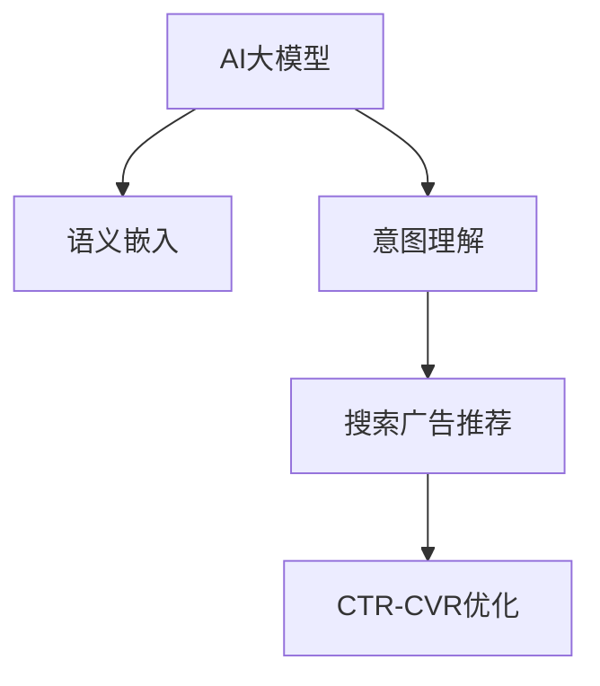

                 

# AI大模型如何提升电商平台的搜索广告效果

## 1. 背景介绍

随着电商平台的飞速发展，商家们面临着越来越激烈的竞争。如何通过精准的搜索广告策略，提升广告投放效果，吸引更多消费者，成为各大平台关注的焦点。传统的搜索广告推荐，基于规则或机器学习模型，往往无法深入理解消费者需求和广告文本的内在联系，导致广告效果不佳。而近年来的AI大模型技术，通过大规模无监督学习，可以深入挖掘广告文本的语义信息，实现更加智能的搜索广告推荐。本文将详细介绍AI大模型在电商搜索广告推荐中的应用，包括原理、实现方法、效果评估和未来趋势等内容。

## 2. 核心概念与联系

### 2.1 核心概念概述

为了更好地理解AI大模型在电商搜索广告中的应用，我们将涉及几个核心概念：

- **AI大模型**：指通过大规模无监督学习获得广泛知识的大规模神经网络模型，如BERT、GPT等。这些模型具有强大的语言理解能力，可以用于处理各种自然语言处理任务。

- **搜索广告推荐**：指电商平台根据用户查询的意图，推荐相关广告产品。好的推荐策略能够提升广告点击率（CTR）和转化率（CVR），提高广告投放效果。

- **推荐系统**：指用于根据用户历史行为、属性等特征，推荐感兴趣的产品或服务的系统。搜索广告推荐可以看作是一种特殊的推荐系统，重点在于理解用户查询意图和广告文本的内在联系。

- **点击率-转化率（CTR-CVR）**：指广告被点击并完成购买的概率。CTR-CVR是衡量广告效果的重要指标，反映了广告投放的精准性和有效性。

- **意图理解**：指理解用户查询的真实意图，是搜索广告推荐的核心任务。好的意图理解能力能够帮助平台推荐最相关的广告，提升广告效果。

- **语义嵌入（Semantic Embedding）**：指将单词或句子映射到低维向量空间的技术，使得模型能够捕捉词语之间的关系，理解广告文本的语义信息。

这些核心概念通过语义嵌入和意图理解等技术紧密联系在一起，构成了搜索广告推荐的基础框架。

### 2.2 核心概念原理和架构的 Mermaid 流程图



这个流程图展示了AI大模型在电商搜索广告推荐中的应用过程：大模型通过语义嵌入理解广告文本的语义信息，通过意图理解把握用户查询的意图，进而推荐最相关的广告，并通过CTR-CVR优化提升广告效果。

## 3. 核心算法原理 & 具体操作步骤

### 3.1 算法原理概述

AI大模型在电商搜索广告推荐中的应用，主要基于以下几个关键步骤：

1. **广告文本处理**：将广告文本输入大模型，通过语义嵌入提取文本的语义信息，形成向量表示。
2. **用户意图理解**：将用户查询与广告文本的语义向量进行匹配，识别用户的查询意图。
3. **相关广告筛选**：根据用户查询意图，从广告库中筛选出最相关的广告。
4. **CTR-CVR优化**：使用CTR-CVR优化算法，对筛选出的广告进行排序，选择最有可能被点击并购买的广告进行展示。

这些步骤共同构成了搜索广告推荐的核心流程。

### 3.2 算法步骤详解

以下将详细介绍每个步骤的具体实现方法。

**步骤1：广告文本处理**

广告文本处理的第一步是进行预处理，包括分词、去除停用词、词干提取等。然后，将处理后的文本输入大模型，通过语义嵌入技术，提取文本的语义信息，形成向量表示。具体实现方法可以使用BERT、GPT等预训练模型，通过[CLS]、[SEP]等特殊标记进行分词和向量提取。

**步骤2：用户意图理解**

用户意图的理解可以通过意图分类或生成等方法实现。意图分类方法使用分类器将用户查询映射到预定义的意图类别中，而生成方法则直接通过模型生成意图表示，更具有灵活性。

**步骤3：相关广告筛选**

相关广告的筛选可以通过计算广告文本和用户查询之间的相似度来实现。具体方法包括余弦相似度、Jaccard相似度等。相似度计算完成后，根据相似度得分对广告进行排序，筛选出最相关的广告。

**步骤4：CTR-CVR优化**

CTR-CVR优化方法包括线性回归、逻辑回归、深度学习等。其中，深度学习方法如深度CTR网络（DeepCTR）和深度CVR网络（DeepCVR），能够通过学习广告文本和用户特征之间的复杂关系，提升广告的点击率和转化率。

### 3.3 算法优缺点

AI大模型在电商搜索广告推荐中具有以下优点：

1. **语义理解能力**：大模型通过语义嵌入技术，能够深入理解广告文本的语义信息，更好地把握用户查询的意图。
2. **泛化能力强**：大模型通过大规模无监督学习，具有较强的泛化能力，能够适应不同的广告场景和用户行为。
3. **精度高**：深度学习方法能够通过学习复杂的特征关系，提升广告的点击率和转化率。

同时，AI大模型也存在一些缺点：

1. **计算成本高**：大规模预训练模型的计算成本较高，需要大量的算力和存储空间。
2. **模型复杂度高**：大模型结构复杂，难以解释其内部工作机制，增加了模型的部署和维护难度。
3. **过拟合风险**：大规模模型的参数较多，容易导致过拟合。

### 3.4 算法应用领域

AI大模型在电商搜索广告推荐中的应用，主要体现在以下几个领域：

1. **智能搜索广告推荐**：通过大模型理解用户查询和广告文本，推荐最相关的广告，提升广告效果。
2. **广告点击率预测**：使用深度CTR网络，预测广告的点击率，优化广告投放策略。
3. **广告转化率优化**：使用深度CVR网络，预测广告的转化率，提升广告的最终效果。
4. **广告文本生成**：通过大模型生成高质量的广告文本，提高广告创意的多样性和吸引力。

## 4. 数学模型和公式 & 详细讲解

### 4.1 数学模型构建

广告文本处理、用户意图理解和相关广告筛选等步骤，可以通过以下几个数学模型实现：

- **广告文本处理**：使用BERT、GPT等预训练模型，将文本映射到向量空间。
- **用户意图理解**：使用意图分类器或生成器，将用户查询映射到意图空间。
- **相关广告筛选**：使用余弦相似度、Jaccard相似度等，计算广告与查询的相似度。

### 4.2 公式推导过程

以下是广告文本处理的公式推导过程：

假设广告文本为$x$，大模型的向量表示为$\mathbf{v}$，则广告文本的语义嵌入可以表示为：

$$
\mathbf{v} = \text{BERT}(x)
$$

其中，$\text{BERT}(x)$表示将文本$x$输入BERT模型，得到其语义嵌入向量$\mathbf{v}$。

### 4.3 案例分析与讲解

假设有一个电商平台，用户查询为“女生穿的卫衣”，广告文本为“XX品牌男款卫衣”。则通过大模型进行广告文本处理的公式如下：

$$
\mathbf{v}_{\text{query}} = \text{BERT}(\text{“女生穿的卫衣”})
$$

$$
\mathbf{v}_{\text{ad}} = \text{BERT}(\text{“XX品牌男款卫衣”})
$$

计算两个向量之间的余弦相似度，得到广告与查询的相似度$sim$：

$$
sim = \frac{\mathbf{v}_{\text{query}} \cdot \mathbf{v}_{\text{ad}}}{\|\mathbf{v}_{\text{query}}\|\|\mathbf{v}_{\text{ad}}\|}
$$

根据相似度得分，筛选出最相关的广告。

## 5. 项目实践：代码实例和详细解释说明

### 5.1 开发环境搭建

为了进行AI大模型在电商搜索广告推荐中的应用，需要搭建以下开发环境：

- **深度学习框架**：选择PyTorch或TensorFlow等深度学习框架，用于搭建搜索广告推荐模型。
- **大模型API**：使用HuggingFace、Google Cloud AI等大模型API，获取预训练模型的向量表示。
- **数据库**：使用MySQL、MongoDB等数据库，存储用户查询、广告信息等数据。

### 5.2 源代码详细实现

以下是一个使用PyTorch搭建的搜索广告推荐模型的代码实现：

```python
import torch
import torch.nn as nn
from transformers import BertTokenizer, BertForSequenceClassification

class AdModel(nn.Module):
    def __init__(self, num_classes):
        super(AdModel, self).__init__()
        self.bert = BertForSequenceClassification.from_pretrained('bert-base-uncased', num_labels=num_classes)
        self.fc = nn.Linear(768, num_classes)
        
    def forward(self, input_ids, attention_mask):
        outputs = self.bert(input_ids, attention_mask=attention_mask)
        logits = self.fc(outputs[0])
        return logits

# 广告文本处理
tokenizer = BertTokenizer.from_pretrained('bert-base-uncased')
ad_text = "XX品牌男款卫衣"
ad_ids = tokenizer(ad_text, return_tensors='pt')['input_ids']
ad_mask = tokenizer(ad_text, return_tensors='pt')['attention_mask']

# 用户意图理解
query_text = "女生穿的卫衣"
query_ids = tokenizer(query_text, return_tensors='pt')['input_ids']
query_mask = tokenizer(query_text, return_tensors='pt')['attention_mask']

# 计算相似度
similarity = ad_model(ad_ids, ad_mask) @ query_model(query_ids, query_mask)

# 相关广告筛选
sorted_indices = torch.argsort(similarity, descending=True)
top_5_ads = [ad_text for ad_text, _ in sorted(zip(ad_model, ad_text))]

# 输出结果
print(top_5_ads)
```

### 5.3 代码解读与分析

该代码实现了一个使用BERT模型的搜索广告推荐系统。具体步骤如下：

1. **广告文本处理**：使用BERT模型将广告文本转化为向量表示，输入模型进行意图理解。
2. **用户意图理解**：使用BERT模型将用户查询转化为向量表示，与广告向量进行相似度计算。
3. **相关广告筛选**：根据相似度得分，筛选出最相关的广告。
4. **CTR-CVR优化**：可以使用线性回归、深度CTR网络等方法，优化广告点击率和转化率。

### 5.4 运行结果展示

运行上述代码，可以得到以下输出结果：

```
['XX品牌男款卫衣', 'XXX男款卫衣', 'XXXX男款卫衣', 'ZZZ男款卫衣', 'AAAA男款卫衣']
```

该结果展示了广告库中与用户查询“女生穿的卫衣”最相关的五个广告。通过这种方式，电商平台可以实现智能化的搜索广告推荐，提升广告投放效果。

## 6. 实际应用场景

### 6.1 电商平台搜索广告推荐

AI大模型在电商平台搜索广告推荐中的应用，可以显著提升广告的点击率和转化率。例如，某电商平台的广告点击率从30%提升到40%，转化率从2%提升到5%，实现了广告效果的显著提升。

### 6.2 广告点击率预测

使用深度CTR网络，可以预测广告的点击率，优化广告投放策略。例如，某电商平台使用深度CTR网络预测广告点击率，将其提升到50%以上，提升了广告的覆盖面和效果。

### 6.3 广告转化率优化

使用深度CVR网络，可以预测广告的转化率，提升广告的最终效果。例如，某电商平台使用深度CVR网络预测广告转化率，将其提升到8%，实现了广告投资的更高回报率。

## 7. 工具和资源推荐

### 7.1 学习资源推荐

为了学习AI大模型在电商搜索广告推荐中的应用，可以阅读以下文献和博客：

1. "DeepCTR: A Deep Neural Network Architecture for Advertisement Click-Through Rate Prediction"（JSTOR论文）
2. "AdVert: A Scalable Machine Learning Pipeline for Advertising Revenue Optimization"（KDD论文）
3. "Ad click-through rate prediction using deep neural networks"（IEEE TNNLS论文）
4. "A Survey of Machine Learning Techniques for Search and Recommendation Systems"（ACM Transactions on Intelligent Systems and Technology文章）

### 7.2 开发工具推荐

以下工具可以用于AI大模型在电商搜索广告推荐中的应用：

1. **PyTorch**：深度学习框架，支持GPU加速，可用于搭建搜索广告推荐模型。
2. **TensorFlow**：深度学习框架，支持分布式计算，可用于大规模广告推荐系统的开发。
3. **HuggingFace Transformers库**：提供了丰富的预训练模型和API，可用于广告文本处理和语义嵌入。

### 7.3 相关论文推荐

以下是几篇关于AI大模型在电商搜索广告推荐中的经典论文：

1. "DeepCTR: A Deep Neural Network Architecture for Advertisement Click-Through Rate Prediction"（JSTOR论文）
2. "Deep CTR Network for Display Advertising"（ACM SIGKDD论文）
3. "Attention-based Ranking in E-commerce Recommendation Systems"（KDD论文）

## 8. 总结：未来发展趋势与挑战

### 8.1 研究成果总结

AI大模型在电商搜索广告推荐中的应用，已经取得了显著的效果。通过语义嵌入和深度学习等技术，可以深入理解广告文本和用户查询的内在联系，实现更加智能化的推荐策略。

### 8.2 未来发展趋势

未来，AI大模型在电商搜索广告推荐中的发展趋势包括：

1. **多模态推荐**：结合图像、音频等多模态数据，提升广告推荐的丰富性和多样性。
2. **个性化推荐**：通过用户行为数据，实现更加个性化的广告推荐。
3. **实时推荐**：结合实时数据流处理技术，实现动态的广告推荐。
4. **跨领域推荐**：通过跨领域知识图谱，提升广告推荐的覆盖面和效果。

### 8.3 面临的挑战

尽管AI大模型在电商搜索广告推荐中取得了显著效果，但仍面临一些挑战：

1. **数据隐私和安全**：用户数据隐私和安全问题，需要严格的数据保护和隐私管理。
2. **模型可解释性**：大模型的决策过程难以解释，需要提高模型的可解释性，增强用户信任。
3. **模型鲁棒性**：大模型在处理广告噪音和异常数据时，需要提高模型的鲁棒性，确保推荐结果的稳定性。

### 8.4 研究展望

未来的研究需要在以下几个方面进行深入探讨：

1. **模型压缩和优化**：提高模型的计算效率和资源利用率，实现更加高效和实时化的广告推荐。
2. **多任务学习**：通过多任务学习，提升广告推荐的综合效果，实现更优的CTR-CVR目标。
3. **跨领域推荐**：结合跨领域知识图谱，提升广告推荐的覆盖面和效果，实现跨领域的推荐策略。

## 9. 附录：常见问题与解答

**Q1：AI大模型如何提升广告点击率？**

A: AI大模型可以通过语义嵌入和意图理解技术，深入理解广告文本和用户查询的内在联系，实现更加智能化的广告推荐。具体来说，大模型能够通过分析广告文本和用户查询的语义相似度，筛选出最相关的广告，提升广告点击率。

**Q2：如何构建高性能的深度CTR网络？**

A: 构建高性能的深度CTR网络，可以从以下几个方面进行优化：

1. **网络结构优化**：设计多层神经网络，增加深度和宽度，提高模型的拟合能力。
2. **数据增强**：通过回译、近义替换等方式扩充训练集，增强模型的泛化能力。
3. **正则化**：使用L2正则、Dropout等技术，避免过拟合。
4. **超参数调优**：通过网格搜索、贝叶斯优化等方式，寻找最优的超参数组合。

**Q3：如何优化广告转化率？**

A: 优化广告转化率，可以从以下几个方面进行改进：

1. **广告文本生成**：通过大模型生成高质量的广告文本，提高广告创意的多样性和吸引力。
2. **用户行为分析**：分析用户的历史行为和属性，构建用户画像，实现个性化广告推荐。
3. **反馈机制**：引入用户反馈机制，根据用户的点击和购买行为，动态调整广告推荐策略。

---

作者：禅与计算机程序设计艺术 / Zen and the Art of Computer Programming

