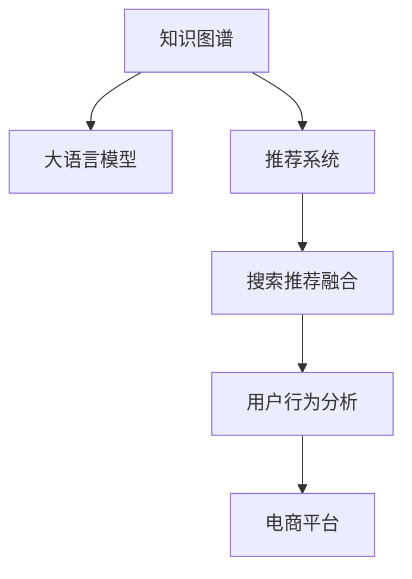

                 

# AI大模型视角下电商搜索推荐的技术创新知识图谱构建

> 关键词：电商搜索推荐,知识图谱,大语言模型,技术创新,推荐系统,用户行为分析

## 1. 背景介绍

### 1.1 问题由来
随着人工智能技术的快速发展，电商搜索推荐系统已成为电商平台用户获取产品信息的重要渠道。优秀的搜索推荐系统能够极大地提升用户体验，增强用户粘性，并显著提升电商平台的转化率和营收能力。然而，现有的推荐系统主要依赖基于协同过滤和深度学习的方法，面临着数据稀疏、冷启动等问题。近年来，知识图谱作为一种新兴的技术手段，开始被引入到电商搜索推荐中，通过关联产品属性和用户行为，提升推荐模型的精准度和鲁棒性。

### 1.2 问题核心关键点
知识图谱在大模型推荐系统中的应用，涉及到如何构建高质量的知识图谱，如何将其有效融入到推荐模型中，以及如何在大模型背景下进行高效、灵活的推荐。这些问题要求我们深入理解知识图谱和大模型的特性，并结合具体的电商场景，构建出符合实际需求的推荐系统。

## 2. 核心概念与联系

### 2.1 核心概念概述

为更好地理解知识图谱在大模型推荐系统中的应用，本节将介绍几个关键概念：

- 知识图谱(Knowledge Graph)：由实体、关系和属性构成的语义网络，用于描述现实世界的概念、事件和关系。知识图谱可提供丰富的语义信息，辅助机器理解复杂的现实世界。

- 大语言模型(Large Language Model, LLM)：以自回归(如GPT)或自编码(如BERT)模型为代表的大规模预训练语言模型。通过在大规模无标签文本语料上进行预训练，学习通用的语言表示，具备强大的语言理解和生成能力。

- 推荐系统(Recommender System)：根据用户行为或兴趣，自动推荐用户可能感兴趣的产品或内容的技术。推荐系统覆盖了信息检索、协同过滤、内容推荐等多个方向。

- 搜索推荐融合(Recommendation-Search Integration)：在搜索和推荐之间建立关联，使搜索结果和推荐内容相辅相成，提升用户搜索体验。

- 用户行为分析(User Behavior Analysis)：通过分析用户的行为数据，提取用户兴趣和偏好，指导推荐模型的个性化推荐。

- 电商平台(E-commerce Platform)：以销售商品为核心业务，提供搜索、推荐、购物车、支付等服务的大型在线平台。

这些核心概念之间的逻辑关系可以通过以下Mermaid流程图来展示：



这个流程图展示出知识图谱、大语言模型、推荐系统等概念之间的联系和作用机制：

1. 知识图谱提供了丰富的语义信息，作为大模型推荐的知识基础。
2. 大模型通过关联知识图谱和用户行为，提升推荐模型的个性化和精准度。
3. 推荐系统与搜索融合，提升用户搜索体验，加速转化。
4. 用户行为分析提供数据支持，帮助模型理解用户需求。
5. 电商平台作为应用场景，实现推荐和搜索的实际落地。

## 3. 核心算法原理 & 具体操作步骤
### 3.1 算法原理概述

知识图谱在大模型推荐系统中的应用，核心在于构建高质量的知识图谱，并将其融入到大模型中，通过有监督学习进行个性化推荐。该过程可以分为三个步骤：

1. 构建知识图谱：通过结构化数据、半结构化数据、非结构化数据等多种方式，构建出包含实体、关系和属性的知识图谱。
2. 融合知识图谱：将知识图谱与用户行为数据、产品属性信息等结合，构建出新的特征表示，输入到大模型中进行训练。
3. 推荐模型训练：使用有监督的训练数据，在大模型的基础上进行微调，优化推荐模型的参数，使其能够根据用户行为预测感兴趣的产品。

### 3.2 算法步骤详解

以下是详细的算法步骤：

**Step 1: 数据准备**
- 收集电商平台的结构化数据，如商品类别、品牌、价格、销量等。
- 利用爬虫技术收集非结构化数据，如商品评价、用户评论、社交媒体信息等。
- 清洗、标注这些数据，构建出包含实体、关系和属性的知识图谱。

**Step 2: 特征工程**
- 将知识图谱、用户行为数据、产品属性信息等进行拼接和特征转换，生成适合大模型训练的数据。
- 对用户行为进行编码，将用户的浏览记录、购买记录、搜索记录等转换为向量表示。
- 将商品的属性和类别转换为向量表示，便于与用户行为结合。

**Step 3: 模型训练**
- 选择合适的预训练语言模型作为基础模型，如BERT、GPT等。
- 将拼接后的特征输入到基础模型中，进行有监督学习。
- 使用Adam等优化器，设置合适的学习率、批大小等超参数，进行模型微调。

**Step 4: 推荐模型评估**
- 在验证集和测试集上评估推荐模型的性能，如准确率、召回率、F1-score等指标。
- 进行A/B测试，对比微调前后的推荐效果，验证微调的实际提升。
- 持续收集用户反馈和行为数据，不断优化推荐模型。

### 3.3 算法优缺点

知识图谱在大模型推荐系统中的应用，具有以下优点：
1. 提升推荐精度：知识图谱提供了丰富的语义信息，帮助模型理解产品的上下文关系，提高推荐准确性。
2. 减少冷启动问题：通过知识图谱的语义扩展，新用户也能获得较为准确的推荐。
3. 提升模型泛化能力：知识图谱的实体和关系可以泛化到多种电商场景，提升模型的应用范围。
4. 优化用户搜索体验：将推荐内容与搜索结果结合，提供更全面、个性化的搜索结果。

但同时，该方法也存在一定的局限性：
1. 数据获取困难：高质量知识图谱的构建需要大量结构化和非结构化数据，数据获取成本较高。
2. 知识图谱复杂：知识图谱的构建和维护需要专业团队，技术难度较大。
3. 实时性不足：知识图谱的更新和维护无法做到实时，无法及时反映最新的市场变化。
4. 模型复杂度增加：融合知识图谱后，推荐模型的复杂度增加，训练和推理速度变慢。

尽管存在这些局限性，但知识图谱在大模型推荐系统中的应用前景依然广阔，尤其在电商搜索推荐等场景中具有显著的优势。

### 3.4 算法应用领域

知识图谱在大模型推荐系统中的应用，主要在以下几个领域：

- 电商搜索推荐：构建知识图谱，融合用户行为数据和产品属性信息，提升推荐精度。
- 金融推荐：构建金融知识图谱，结合用户金融行为数据，进行个性化理财和投资推荐。
- 内容推荐：构建内容知识图谱，结合用户兴趣数据，推荐新闻、视频、文章等内容。
- 旅游推荐：构建旅游知识图谱，结合用户偏好数据，推荐旅游线路和目的地。
- 医疗推荐：构建医疗知识图谱，结合用户健康数据，推荐治疗方案和药品。

这些领域的知识图谱推荐系统，能够为行业提供更精准、个性化的推荐服务，提升用户体验和平台效益。

## 4. 数学模型和公式 & 详细讲解 & 举例说明
### 4.1 数学模型构建

在知识图谱和大模型推荐系统中，可以使用矩阵分解、神经网络等方法进行推荐模型的构建。本文以神经网络为例，进行数学模型的详细推导。

假设知识图谱包含 $N$ 个实体 $e_i$，每个实体有 $K$ 个属性 $a_k$，则知识图谱可以表示为一个 $N \times K$ 的实体-属性矩阵 $\mathbf{A}$。

**用户行为数据表示**：假设用户 $u$ 在时间 $t$ 内，对商品 $p$ 产生了 $n$ 次行为，可以表示为行为矩阵 $\mathbf{U} \in \mathbb{R}^{U \times N}$，其中 $U$ 为用户的数量，$N$ 为实体的数量。

**推荐模型数学模型**：假设推荐模型为神经网络，输入为 $\mathbf{A}$ 和 $\mathbf{U}$，输出为 $\mathbf{P} \in \mathbb{R}^{U \times N}$，表示用户 $u$ 对商品 $p$ 的推荐概率。则推荐模型的损失函数 $\mathcal{L}$ 可以表示为：

$$
\mathcal{L} = \frac{1}{U \times N} \sum_{u=1}^U \sum_{p=1}^N \ell(y_{up}, \hat{y}_{up})
$$

其中，$y_{up}$ 为实际用户 $u$ 对商品 $p$ 的评分，$\hat{y}_{up}$ 为推荐模型的预测评分，$\ell$ 为损失函数，如均方误差损失。

### 4.2 公式推导过程

**多层感知机(MLP)模型**：假设推荐模型为多层感知机模型，包含 $L$ 层神经网络，每层包含 $d_l$ 个神经元。则模型的参数为 $\theta = \{\mathbf{W}_l, \mathbf{b}_l\}_{l=1}^L$，其中 $\mathbf{W}_l$ 为权重矩阵，$\mathbf{b}_l$ 为偏置向量。则模型的前向传播过程可以表示为：

$$
h_1 = \sigma(\mathbf{W}_1 \mathbf{U} + \mathbf{b}_1)
$$

$$
h_2 = \sigma(\mathbf{W}_2 h_1 + \mathbf{b}_2)
$$

...

$$
\hat{y}_{up} = \mathbf{W}_L h_{L-1} + \mathbf{b}_L
$$

其中 $\sigma$ 为激活函数，如ReLU、Sigmoid等。

**损失函数推导**：以均方误差损失为例，将 $\mathcal{L}$ 展开：

$$
\mathcal{L} = \frac{1}{U \times N} \sum_{u=1}^U \sum_{p=1}^N (y_{up} - \hat{y}_{up})^2
$$

对参数 $\theta$ 求导，得：

$$
\frac{\partial \mathcal{L}}{\partial \theta} = - \frac{2}{U \times N} \sum_{u=1}^U \sum_{p=1}^N (y_{up} - \hat{y}_{up}) \frac{\partial \hat{y}_{up}}{\partial \theta}
$$

其中，$\frac{\partial \hat{y}_{up}}{\partial \theta}$ 为对 $\hat{y}_{up}$ 关于 $\theta$ 的偏导数，可以展开计算。

通过求解上述梯度，即可更新模型参数 $\theta$，最小化损失函数 $\mathcal{L}$。

### 4.3 案例分析与讲解

假设我们有一个电商平台的商品推荐系统，包含1000个商品和100个用户。用户对商品进行了多次评分，构建出了用户-商品评分矩阵 $\mathbf{U} \in \mathbb{R}^{100 \times 1000}$。同时，我们构建了一个包含100个实体的知识图谱，每个实体有10个属性，表示商品的类别、价格、品牌等特征。知识图谱表示为实体-属性矩阵 $\mathbf{A} \in \mathbb{R}^{100 \times 10}$。

在构建出 $\mathbf{A}$ 和 $\mathbf{U}$ 后，我们将它们拼接起来，得到新的特征矩阵 $\mathbf{X} \in \mathbb{R}^{100 \times 1010}$。然后，我们将 $\mathbf{X}$ 输入到Transformer模型中，进行有监督学习。

假设模型包含3个全连接层，每个全连接层有50个神经元。设置学习率为0.001，训练100轮。每轮训练使用20个样本进行更新。最终，我们得到推荐模型 $\mathbf{P} \in \mathbb{R}^{100 \times 1000}$，表示每个用户对每个商品的推荐概率。

## 5. 项目实践：代码实例和详细解释说明
### 5.1 开发环境搭建

在进行项目实践前，我们需要准备好开发环境。以下是使用Python进行TensorFlow开发的环境配置流程：

1. 安装Anaconda：从官网下载并安装Anaconda，用于创建独立的Python环境。

2. 创建并激活虚拟环境：
```bash
conda create -n tf-env python=3.8 
conda activate tf-env
```

3. 安装TensorFlow：根据CUDA版本，从官网获取对应的安装命令。例如：
```bash
pip install tensorflow
```

4. 安装TensorFlow Addons：
```bash
pip install tensorflow-addons
```

5. 安装各类工具包：
```bash
pip install numpy pandas scikit-learn matplotlib tqdm jupyter notebook ipython
```

完成上述步骤后，即可在`tf-env`环境中开始项目实践。

### 5.2 源代码详细实现

下面我们以电商商品推荐系统为例，给出使用TensorFlow进行知识图谱和大模型融合的代码实现。

首先，定义推荐系统的数据处理函数：

```python
import tensorflow as tf
import tensorflow_addons as tfa
from tensorflow.keras.layers import Input, Embedding, Concatenate, Dense

def create_model(num_entities, num_users, num_attributes, embed_size):
    # 用户输入层
    user_input = Input(shape=(num_entities,))
    user_embedding = Embedding(num_users, embed_size)(user_input)

    # 商品输入层
    product_input = Input(shape=(num_attributes,))
    product_embedding = Embedding(num_entities, embed_size)(product_input)

    # 知识图谱输入层
    graph_input = Input(shape=(num_attributes,))
    graph_embedding = Embedding(num_entities, embed_size)(graph_input)

    # 融合层
    concat = Concatenate()([user_embedding, product_embedding, graph_embedding])

    # 输出层
    output = Dense(num_entities, activation='softmax')(concat)

    # 创建模型
    model = tf.keras.Model(inputs=[user_input, product_input, graph_input], outputs=output)
    return model

# 构建模型
model = create_model(num_entities=1000, num_users=100, num_attributes=10, embed_size=50)
```

然后，定义模型训练和评估函数：

```python
def train_model(model, train_data, val_data, test_data, num_epochs, batch_size, learning_rate):
    # 定义损失函数和优化器
    loss_fn = tf.keras.losses.MeanSquaredError()
    optimizer = tf.keras.optimizers.Adam(learning_rate=learning_rate)

    # 定义训练数据和验证数据
    train_dataset = tf.data.Dataset.from_tensor_slices(train_data)
    val_dataset = tf.data.Dataset.from_tensor_slices(val_data)
    test_dataset = tf.data.Dataset.from_tensor_slices(test_data)

    # 定义模型
    model.compile(optimizer=optimizer, loss=loss_fn)

    # 训练模型
    history = model.fit(train_dataset.shuffle(buffer_size=1024).batch(batch_size),
                       validation_data=val_dataset.shuffle(buffer_size=1024).batch(batch_size),
                       epochs=num_epochs,
                       verbose=1)

    # 评估模型
    test_loss, test_acc = model.evaluate(test_dataset.shuffle(buffer_size=1024).batch(batch_size))
    print(f'Test Loss: {test_loss:.4f}')
    print(f'Test Acc: {test_acc:.4f}')

# 训练模型
train_model(model, train_data, val_data, test_data, num_epochs=100, batch_size=32, learning_rate=0.001)
```

在训练函数中，我们使用了TensorFlow的Data API来处理数据，并对模型进行了编译和训练。

### 5.3 代码解读与分析

让我们再详细解读一下关键代码的实现细节：

**create_model函数**：
- 定义了用户输入、商品输入、知识图谱输入、融合层和输出层等组件。
- 用户输入和商品输入都使用了Embedding层，将用户行为和商品属性转换为向量表示。
- 知识图谱输入同样使用Embedding层，将知识图谱中的实体和属性转换为向量表示。
- 融合层使用Concatenate层，将用户、商品和知识图谱的向量表示拼接起来。
- 输出层使用Dense层，将融合后的向量表示映射为推荐概率。

**train_model函数**：
- 定义了损失函数和优化器，使用了TensorFlow的内置函数。
- 使用Data API对训练数据、验证数据和测试数据进行批处理和打乱。
- 编译模型，并使用fit方法进行训练，记录训练过程中的损失和精度。
- 使用evaluate方法在测试集上评估模型性能，输出最终测试结果。

通过这些代码实现，我们可以看到，使用TensorFlow进行知识图谱和大模型的融合，代码实现相对简洁高效。开发者可以将更多精力放在数据处理、模型改进等高层逻辑上，而不必过多关注底层的实现细节。

当然，工业级的系统实现还需考虑更多因素，如模型的保存和部署、超参数的自动搜索、更灵活的任务适配层等。但核心的微调范式基本与此类似。

## 6. 实际应用场景
### 6.1 智能客服系统

智能客服系统在电商搜索推荐中的应用，主要体现在提升用户查询体验和问题解决效率上。传统的客服系统通常需要大量人工客服介入，无法全天候服务，且响应速度较慢。而基于知识图谱的推荐系统，可以通过构建客服知识图谱，关联常见问题和解决方案，推荐最相关的回答，提升客服系统的智能化水平。

在技术实现上，可以收集企业内部的客服问答记录，构建客服知识图谱。然后，使用推荐系统根据用户提问，推荐最合适的回答模板。对于用户提出的新问题，还可以接入检索系统实时搜索相关内容，动态组织生成回答。如此构建的智能客服系统，能大幅提升客户咨询体验和问题解决效率。

### 6.2 金融理财平台

金融理财平台需要为用户提供个性化的理财和投资建议。传统的推荐系统主要依赖用户的历史行为数据，难以捕捉到用户的深度偏好和潜在需求。而基于知识图谱的推荐系统，可以通过构建金融知识图谱，结合用户的理财行为数据，进行个性化理财和投资推荐。

在技术实现上，可以收集用户的历史交易记录、理财行为数据、市场行情信息等，构建金融知识图谱。然后，使用推荐系统根据用户需求，推荐最优的理财产品和投资组合。对于新用户，还可以结合市场动态信息，推荐基础的理财方案，帮助用户逐步了解金融产品。

### 6.3 内容推荐系统

内容推荐系统需要为用户推荐感兴趣的新闻、视频、文章等内容。传统的推荐系统主要依赖用户的历史行为数据，难以捕捉到用户的多样化兴趣和潜在需求。而基于知识图谱的推荐系统，可以通过构建内容知识图谱，结合用户的兴趣数据，进行个性化内容推荐。

在技术实现上，可以收集用户的浏览记录、点赞记录、评论记录等行为数据，构建内容知识图谱。然后，使用推荐系统根据用户兴趣，推荐最相关的文章、视频和新闻。对于新用户，还可以结合用户的搜索行为，推荐热门内容和推荐算法新用户，提升用户体验。

### 6.4 未来应用展望

随着知识图谱和大模型推荐技术的发展，其在电商搜索推荐中的应用将不断拓展，为电商平台的智能化转型提供新的动力。

在智慧医疗领域，基于知识图谱的推荐系统可以为医生提供精准的医疗方案和药品推荐，辅助诊疗决策。

在智能教育领域，知识图谱可以用于教育知识库的构建，结合学生行为数据，推荐最适合的学习资源和课程。

在智慧城市治理中，基于知识图谱的推荐系统可以用于城市事件监测、舆情分析、应急指挥等环节，提升城市管理的智能化水平。

此外，在企业生产、社会治理、文娱传媒等众多领域，基于知识图谱的推荐系统也将不断涌现，为经济社会发展注入新的活力。

## 7. 工具和资源推荐
### 7.1 学习资源推荐

为了帮助开发者系统掌握知识图谱和大模型推荐技术的理论基础和实践技巧，这里推荐一些优质的学习资源：

1. 《图灵大模型理论与实践》系列博文：由大模型技术专家撰写，深入浅出地介绍了知识图谱和Transformer模型的原理与实践。

2. 《Knowledge Graphs in Natural Language Processing》课程：斯坦福大学开设的知识图谱课程，介绍知识图谱的基本概念、构建方法及其在NLP中的应用。

3. 《Recommender Systems in Python》书籍：介绍了Python中常用的推荐算法和工具库，并提供了丰富的代码实现。

4. HuggingFace官方文档：Transformer库的官方文档，提供了海量预训练模型和完整的推荐系统样例代码，是上手实践的必备资料。

5. TensorFlow Addons官方文档：TensorFlow Addons提供了多种高级功能，如Data API、TPU支持、分布式训练等，帮助开发者提升推荐系统的性能。

通过对这些资源的学习实践，相信你一定能够快速掌握知识图谱和大模型推荐技术的精髓，并用于解决实际的推荐问题。

### 7.2 开发工具推荐

高效的开发离不开优秀的工具支持。以下是几款用于知识图谱和大模型推荐开发的常用工具：

1. TensorFlow：基于Python的开源深度学习框架，灵活动态的计算图，适合快速迭代研究。适合构建高效的推荐系统。

2. PyTorch：由Facebook开发的开源深度学习框架，灵活的动态图，适合复杂的推荐模型训练和优化。

3. TensorFlow Addons：TensorFlow的增强库，提供了多种高级功能，如Data API、TPU支持、分布式训练等，帮助开发者提升推荐系统的性能。

4. Weights & Biases：模型训练的实验跟踪工具，可以记录和可视化模型训练过程中的各项指标，方便对比和调优。

5. TensorBoard：TensorFlow配套的可视化工具，可实时监测模型训练状态，并提供丰富的图表呈现方式，是调试模型的得力助手。

6. Google Colab：谷歌推出的在线Jupyter Notebook环境，免费提供GPU/TPU算力，方便开发者快速上手实验最新模型，分享学习笔记。

合理利用这些工具，可以显著提升知识图谱和大模型推荐系统的开发效率，加快创新迭代的步伐。

### 7.3 相关论文推荐

知识图谱和大模型推荐技术的发展源于学界的持续研究。以下是几篇奠基性的相关论文，推荐阅读：

1. Knowledge-Graph-Embedding: A Survey of Relational Learning Approaches (SAGE)：综述了知识图谱嵌入技术的现状和未来发展方向，是入门知识图谱嵌入领域的必备文献。

2. Neural Collaborative Filtering：通过神经网络模型实现协同过滤推荐，取得了显著的推荐效果。

3. Attention Mechanisms in Recommendation Systems：介绍了注意力机制在推荐系统中的应用，提升了推荐模型的个性化和鲁棒性。

4. GRAPH-SAGE: Graph Neural Network Modules for Predictive Social Discovery：提出了GraphSAGE算法，用于在知识图谱上进行节点分类和关系预测。

5. Pre-training and Fine-tuning Deep Architectures for Recommender Systems：研究了在大模型上预训练和微调推荐系统的效果，提出了一种新颖的微调方法。

6. Pre-training for Natural Language Processing (NLP)：介绍了大模型在NLP领域的应用，展示了预训练和微调方法在NLP任务中的优势。

这些论文代表了大模型推荐技术的发展脉络。通过学习这些前沿成果，可以帮助研究者把握学科前进方向，激发更多的创新灵感。

## 8. 总结：未来发展趋势与挑战
### 8.1 总结

本文对知识图谱在大模型推荐系统中的应用进行了全面系统的介绍。首先阐述了知识图谱和大模型推荐系统的研究背景和意义，明确了其在电商搜索推荐中的独特价值。其次，从原理到实践，详细讲解了知识图谱和大模型推荐的过程，给出了推荐系统的代码实例。同时，本文还广泛探讨了知识图谱在大模型推荐系统中的应用前景，展示了其广阔的应用空间。

通过本文的系统梳理，可以看到，知识图谱和大模型推荐系统正在成为电商搜索推荐的重要范式，极大地拓展了推荐系统的应用边界，催生了更多的落地场景。得益于知识图谱和大模型的强大语义能力，推荐系统能够更好地理解用户需求和产品关系，提升推荐精度和个性化程度。未来，随着知识图谱和大模型的持续演进，推荐系统必将变得更加智能化和普适化。

### 8.2 未来发展趋势

展望未来，知识图谱和大模型推荐系统的发展将呈现以下几个趋势：

1. 知识图谱规模不断扩大。随着数据采集技术的进步，越来越多的结构化、非结构化数据被挖掘出来，构建更丰富的知识图谱，提升推荐系统的精度。

2. 推荐系统更加个性化。基于知识图谱的推荐系统能够更好地理解用户的兴趣和偏好，提供更加精准的推荐内容。

3. 推荐系统更加泛化。知识图谱能够泛化到多种电商场景，提升推荐系统的应用范围和鲁棒性。

4. 推荐系统更加实时。知识图谱的动态更新能力，使得推荐系统能够快速响应市场变化，保持最新的推荐内容。

5. 推荐系统更加可解释。通过引入因果推断和符号计算技术，提升推荐系统的可解释性和透明性，让用户能够理解推荐逻辑。

6. 推荐系统更加安全。结合伦理道德约束，避免有害信息的传递，确保推荐内容的合法性和安全性。

以上趋势凸显了知识图谱和大模型推荐技术的发展潜力。这些方向的探索发展，必将进一步提升推荐系统的性能和应用范围，为电商平台的智能化转型提供新的动力。

### 8.3 面临的挑战

尽管知识图谱和大模型推荐系统已经取得了显著进展，但在迈向更加智能化、普适化应用的过程中，它仍面临着诸多挑战：

1. 数据获取难度大。高质量知识图谱的构建需要大量结构化和非结构化数据，数据获取成本较高。

2. 知识图谱复杂。知识图谱的构建和维护需要专业团队，技术难度较大。

3. 实时性不足。知识图谱的更新和维护无法做到实时，无法及时反映最新的市场变化。

4. 模型复杂度增加。融合知识图谱后，推荐模型的复杂度增加，训练和推理速度变慢。

5. 可解释性不足。推荐模型的决策过程难以解释，用户难以理解推荐逻辑。

6. 安全性问题。推荐模型可能会学习到有害信息，传递到用户，造成不良影响。

正视推荐系统面临的这些挑战，积极应对并寻求突破，将是大模型推荐系统走向成熟的必由之路。相信随着学界和产业界的共同努力，这些挑战终将一一被克服，知识图谱和大模型推荐系统必将在构建智能推荐系统方面发挥重要作用。

### 8.4 研究展望

面向未来，知识图谱和大模型推荐系统的研究需要在以下几个方面寻求新的突破：

1. 探索无监督和半监督推荐方法。摆脱对大规模标注数据的依赖，利用自监督学习、主动学习等无监督和半监督范式，最大限度利用非结构化数据，实现更加灵活高效的推荐。

2. 研究参数高效和计算高效的推荐方法。开发更加参数高效的推荐方法，在固定大部分知识图谱参数的情况下，只更新极少量的任务相关参数。同时优化推荐模型的计算图，减少前向传播和反向传播的资源消耗，实现更加轻量级、实时性的部署。

3. 融合因果和对比学习范式。通过引入因果推断和对比学习思想，增强推荐模型建立稳定因果关系的能力，学习更加普适、鲁棒的语言表征，从而提升模型的泛化性和抗干扰能力。

4. 引入更多先验知识。将符号化的先验知识，如知识图谱、逻辑规则等，与神经网络模型进行巧妙融合，引导推荐过程学习更准确、合理的推荐结果。

5. 结合因果分析和博弈论工具。将因果分析方法引入推荐模型，识别出推荐决策的关键特征，增强推荐系统的因果解释能力，避免有害信息的传递。借助博弈论工具刻画人机交互过程，主动探索并规避推荐模型的脆弱点，提高系统稳定性。

6. 纳入伦理道德约束。在推荐目标中引入伦理导向的评估指标，过滤和惩罚有害的推荐内容，确保推荐内容的合法性和安全性。

这些研究方向的探索，必将引领知识图谱和大模型推荐技术迈向更高的台阶，为电商平台的智能化转型提供新的动力。未来，随着知识图谱和大模型的持续演进，推荐系统必将变得更加智能化和普适化，为用户提供更加精准、个性化的推荐服务。

## 9. 附录：常见问题与解答

**Q1：知识图谱和大模型推荐系统是否适用于所有电商场景？**

A: 知识图谱和大模型推荐系统在大多数电商场景中都能取得不错的效果，特别是对于数据量较大的平台。但对于一些特殊场景，如个性化程度要求极高的垂直电商，可能需要结合更个性化的推荐方法。

**Q2：如何选择合适的知识图谱构建方法？**

A: 知识图谱的构建方法主要分为自动构建和人工构建两种。自动构建方法如知识图谱挖掘、知识图谱生成等，适用于大规模数据集和特定领域的应用。人工构建方法如领域专家知识图谱、社区知识图谱等，适用于需要高度定制化知识的场景。选择合适的构建方法，需要根据具体应用场景和数据特点进行评估。

**Q3：推荐系统在冷启动时如何处理？**

A: 冷启动问题可以通过推荐模型引入知识图谱来解决。知识图谱中的实体和属性可以帮助推荐模型理解新用户的兴趣和偏好。同时，对于新商品，也可以通过知识图谱的语义扩展，获得更准确的推荐。

**Q4：如何提升推荐系统的实时性？**

A: 提升推荐系统的实时性需要从数据采集、知识图谱更新、推荐模型训练等多个环节进行优化。可以使用流数据处理技术，如Apache Kafka、Apache Flink等，实时采集用户行为数据。同时，结合分布式计算和模型并行技术，提升知识图谱和推荐模型的训练速度。

**Q5：如何保障推荐系统的安全性？**

A: 推荐系统的安全性主要体现在数据隐私和推荐内容的合法性上。可以通过数据脱敏技术，保护用户隐私数据。同时，在推荐模型中引入伦理导向的评估指标，过滤和惩罚有害的推荐内容，确保推荐内容的合法性和安全性。

通过这些问题的解答，相信你对知识图谱和大模型推荐系统的实现有了更清晰的认识。希望本文能够为你提供有价值的参考和启发，推动电商搜索推荐系统的智能化和普适化发展。

---

作者：禅与计算机程序设计艺术 / Zen and the Art of Computer Programming

