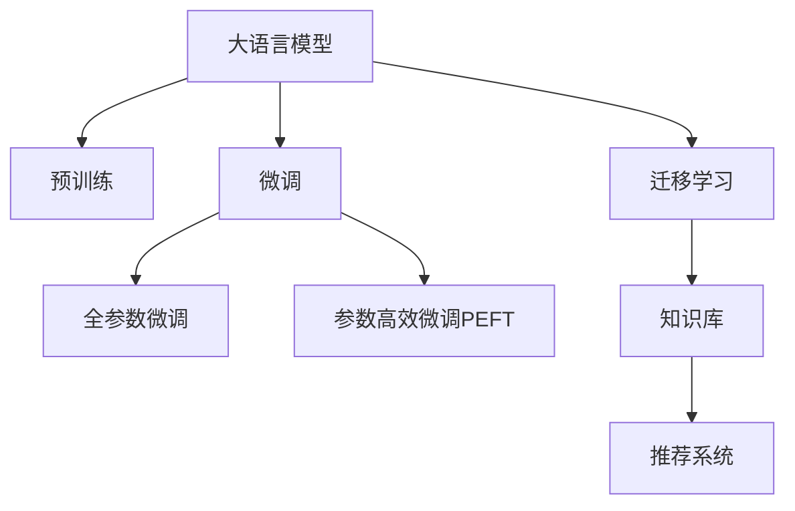

                 

# AI大模型视角下电商搜索推荐的技术创新知识库搭建方案

## 1. 背景介绍

在电商领域，搜索和推荐系统是驱动用户体验和业务增长的核心引擎。随着用户需求的个性化、多样化和复杂化，传统的基于规则和统计模型的推荐系统已经难以满足用户的实时、精准和个性化需求。大语言模型，特别是预训练的语言模型，以其强大的泛化能力和自然语言处理能力，为电商搜索推荐系统注入了新的活力。本文将从大模型的视角出发，探讨如何在电商搜索推荐系统中引入AI技术，构建智能化的知识库，提升推荐系统的精准度和个性化水平。

## 2. 核心概念与联系

### 2.1 核心概念概述

为更好地理解基于大模型的电商搜索推荐系统，本节将介绍几个关键概念：

- **大语言模型(Large Language Model, LLM)**：以自回归(如GPT)或自编码(如BERT)模型为代表的大规模预训练语言模型。通过在大规模无标签文本语料上进行预训练，学习到丰富的语言知识和常识。

- **预训练(Pre-training)**：指在大规模无标签文本语料上，通过自监督学习任务训练通用语言模型的过程。常见的预训练任务包括言语建模、遮挡语言模型等。

- **微调(Fine-tuning)**：指在预训练模型的基础上，使用下游任务的少量标注数据，通过有监督地训练优化模型在该任务上的性能。

- **迁移学习(Transfer Learning)**：指将一个领域学习到的知识，迁移应用到另一个不同但相关的领域的学习范式。大模型的预训练-微调过程即是一种典型的迁移学习方式。

- **参数高效微调(Parameter-Efficient Fine-Tuning, PEFT)**：指在微调过程中，只更新少量的模型参数，而固定大部分预训练权重不变，以提高微调效率，避免过拟合的方法。

- **知识库(Knowledge Base)**：包含结构化或半结构化的知识，如商品信息、用户行为、行业信息等，是电商搜索推荐系统的基础数据来源。

- **推荐系统(Recommendation System)**：通过分析用户行为数据和商品属性，为用户提供个性化的推荐服务。

这些概念之间的逻辑关系可以通过以下Mermaid流程图来展示：



这个流程图展示了大语言模型的核心概念及其之间的关系：

1. 大语言模型通过预训练获得基础能力。
2. 微调是对预训练模型进行任务特定的优化，可以分为全参数微调和参数高效微调（PEFT）。
3. 迁移学习是连接预训练模型与推荐系统的桥梁，可以通过微调或知识库整合来实现。
4. 知识库是推荐系统的数据来源，通过与大模型的整合，可以提升推荐系统的效果。
5. 推荐系统通过调用微调后的大模型，提供个性化的推荐服务。

## 3. 核心算法原理 & 具体操作步骤

### 3.1 算法原理概述

基于大模型的电商搜索推荐系统，本质上是一种利用预训练语言模型进行知识抽取和融合的推荐范式。其核心思想是：将大语言模型视作一个强大的"知识抽取器"，通过微调或知识库整合，提取电商领域的知识，并将其与推荐算法结合，构建智能化的推荐系统。

形式化地，假设预训练语言模型为 $M_{\theta}$，其中 $\theta$ 为预训练得到的模型参数。给定电商领域特定的知识库 $K$，目标是通过优化模型参数 $\theta$，使得模型能够从知识库中抽取和融合知识，从而提升推荐系统的效果。

### 3.2 算法步骤详解

基于大模型的电商搜索推荐系统的一般步骤如下：

**Step 1: 准备预训练模型和知识库**
- 选择合适的预训练语言模型 $M_{\theta}$ 作为初始化参数，如 BERT、GPT 等。
- 准备电商领域特定的知识库 $K$，如商品属性、用户行为、行业信息等。

**Step 2: 知识抽取与融合**
- 设计任务适配层，将知识库中的结构化或半结构化数据转换为模型可理解的输入格式。
- 将知识库与预训练模型结合，通过微调或知识库整合，提取和融合电商领域知识。

**Step 3: 设计推荐算法**
- 选择合适的推荐算法，如协同过滤、内容推荐、深度学习等。
- 将微调后的模型或知识库与推荐算法结合，形成电商搜索推荐系统。

**Step 4: 训练与优化**
- 使用电商领域的数据集，对推荐系统进行训练和优化，提升推荐效果。
- 在验证集上评估推荐系统的效果，调整超参数和优化算法。

**Step 5: 部署与测试**
- 将优化后的推荐系统部署到实际环境中，进行实时推荐。
- 持续收集用户反馈，定期重新训练和优化模型。

以上是基于大模型的电商搜索推荐系统的一般流程。在实际应用中，还需要针对具体任务和数据特点进行优化设计，如改进知识抽取方法、设计高效推荐算法等，以进一步提升推荐系统的效果。

### 3.3 算法优缺点

基于大模型的电商搜索推荐系统具有以下优点：

1. **泛化能力强**：大语言模型通过预训练学习到通用的语言知识，能够较好地泛化到电商领域，适应不同商品和用户需求的复杂性。
2. **数据利用率高**：利用大语言模型的知识抽取能力，可以高效利用电商领域的海量数据，提取有用的知识信息。
3. **推荐精准度高**：通过将大模型的知识与推荐算法结合，可以提升推荐系统的精准度，减少误推荐和漏推荐的情况。
4. **动态适应能力强**：大语言模型能够实时更新知识库，动态适应电商领域的变化，提供更及时的推荐服务。

同时，该方法也存在一些局限性：

1. **资源消耗大**：大语言模型的训练和推理需要较大的计算资源，增加了系统的开发和运行成本。
2. **模型复杂度高**：大语言模型通常具有较大的参数量，模型的复杂度较高，增加了系统的复杂性和维护难度。
3. **数据隐私问题**：电商领域涉及大量敏感的用户行为数据，如何在保护用户隐私的前提下，利用这些数据进行推荐，是一个重要问题。
4. **解释性不足**：大语言模型的推荐过程缺乏可解释性，难以解释推荐结果的依据和逻辑，给用户和开发者带来一定的困扰。

尽管存在这些局限性，但就目前而言，基于大模型的推荐系统仍然是大规模推荐场景中的主流范式。未来相关研究的重点在于如何进一步降低资源消耗，提高推荐系统的可解释性，保护用户隐私，同时兼顾推荐效果和系统性能。

### 3.4 算法应用领域

基于大模型的电商搜索推荐系统已经在许多实际应用中取得了成功，例如：

- **商品推荐**：通过分析用户的历史浏览、购买行为，推荐用户可能感兴趣的商品。
- **个性化推荐**：根据用户的属性和行为数据，提供个性化的商品推荐。
- **上下文推荐**：考虑用户的上下文信息，如时间、地点、设备等，进行更加精准的推荐。
- **多模态推荐**：结合商品图片、视频、评论等多模态信息，提升推荐的丰富性和准确性。

除了上述这些经典应用外，基于大模型的推荐系统还被创新性地应用到更多场景中，如智能客服、智能广告投放、社交网络推荐等，为电商领域带来了新的突破。

## 4. 数学模型和公式 & 详细讲解  
### 4.1 数学模型构建

本节将使用数学语言对基于大模型的电商搜索推荐系统进行更加严格的刻画。

记预训练语言模型为 $M_{\theta}$，其中 $\theta$ 为预训练得到的模型参数。给定电商领域特定的知识库 $K$，包含商品属性、用户行为、行业信息等，目标是通过优化模型参数 $\theta$，使得模型能够从知识库中抽取和融合知识，从而提升推荐系统的效果。

### 4.2 公式推导过程

以下我们以基于大模型的协同过滤推荐系统为例，推导推荐模型的损失函数及其梯度的计算公式。

假设推荐系统需要将商品 $i$ 推荐给用户 $u$，模型的预测评分表示为 $P_{ui} = M_{\theta}(\text{query}_u, \text{doc}_i)$，其中 $\text{query}_u$ 为用户 $u$ 的查询向量，$\text{doc}_i$ 为商品 $i$ 的描述向量。模型的推荐策略为：

$$
\text{rank}_{ui} = \frac{P_{ui}}{P_{ui} + \sum_{j \neq i}P_{uj}}
$$

即商品 $i$ 相对于商品 $j$ 的推荐分数为 $P_{ui}$ 与所有其他商品的预测评分之和的比值。

模型的损失函数定义为交叉熵损失，表示预测评分与实际标签之间的差异：

$$
\mathcal{L}(\theta) = -\sum_{i \in I, u \in U} \left[ y_{ui}\log P_{ui} + (1-y_{ui})\log(1-P_{ui}) \right]
$$

其中 $I$ 为商品集合，$U$ 为用户集合，$y_{ui}$ 为标签，即用户 $u$ 是否购买了商品 $i$。

根据链式法则，损失函数对参数 $\theta$ 的梯度为：

$$
\frac{\partial \mathcal{L}(\theta)}{\partial \theta} = -\sum_{i \in I, u \in U} \frac{y_{ui}}{P_{ui}}\frac{\partial P_{ui}}{\partial \theta} - \sum_{i \in I, u \in U} \frac{1-y_{ui}}{1-P_{ui}}\frac{\partial (1-P_{ui})}{\partial \theta}
$$

其中 $\frac{\partial P_{ui}}{\partial \theta}$ 可进一步递归展开，利用自动微分技术完成计算。

### 4.3 案例分析与讲解

以商品推荐为例，假设预训练语言模型为BERT，知识库为电商平台上的商品描述。通过微调BERT模型，可以将其转化为电商领域的知识抽取器，对商品描述进行特征提取，并将其与用户的浏览、购买历史数据进行融合，得到用户的查询向量。具体实现步骤如下：

1. **商品描述预处理**：将商品描述进行分词、去除停用词、词向量化等预处理操作，转换为模型可理解的输入格式。

2. **用户查询向量生成**：将用户的历史浏览、购买行为进行编码，生成用户的查询向量 $\text{query}_u$。

3. **商品描述向量生成**：将商品描述向量进行编码，生成商品的描述向量 $\text{doc}_i$。

4. **模型微调**：使用电商领域的数据集，对BERT模型进行微调，使其能够从商品描述中抽取有用的特征，并与用户查询向量结合，生成推荐分数。

5. **推荐系统集成**：将微调后的BERT模型与推荐算法结合，如协同过滤、深度学习等，形成最终的电商搜索推荐系统。

## 5. 项目实践：代码实例和详细解释说明
### 5.1 开发环境搭建

在进行电商搜索推荐系统的开发前，我们需要准备好开发环境。以下是使用Python进行PyTorch开发的环境配置流程：

1. 安装Anaconda：从官网下载并安装Anaconda，用于创建独立的Python环境。

2. 创建并激活虚拟环境：
```bash
conda create -n pytorch-env python=3.8 
conda activate pytorch-env
```

3. 安装PyTorch：根据CUDA版本，从官网获取对应的安装命令。例如：
```bash
conda install pytorch torchvision torchaudio cudatoolkit=11.1 -c pytorch -c conda-forge
```

4. 安装Transformers库：
```bash
pip install transformers
```

5. 安装各类工具包：
```bash
pip install numpy pandas scikit-learn matplotlib tqdm jupyter notebook ipython
```

完成上述步骤后，即可在`pytorch-env`环境中开始电商搜索推荐系统的开发。

### 5.2 源代码详细实现

下面我们以基于大模型的协同过滤推荐系统为例，给出使用Transformers库对BERT模型进行电商领域知识抽取和融合的PyTorch代码实现。

首先，定义商品描述预处理函数：

```python
from transformers import BertTokenizer
from torch.utils.data import Dataset
import torch

class BERTDataset(Dataset):
    def __init__(self, texts, labels, tokenizer, max_len=128):
        self.texts = texts
        self.labels = labels
        self.tokenizer = tokenizer
        self.max_len = max_len
        
    def __len__(self):
        return len(self.texts)
    
    def __getitem__(self, item):
        text = self.texts[item]
        label = self.labels[item]
        
        encoding = self.tokenizer(text, return_tensors='pt', max_length=self.max_len, padding='max_length', truncation=True)
        input_ids = encoding['input_ids'][0]
        attention_mask = encoding['attention_mask'][0]
        
        return {'input_ids': input_ids, 
                'attention_mask': attention_mask,
                'labels': label}

# 创建dataset
tokenizer = BertTokenizer.from_pretrained('bert-base-cased')
train_dataset = BERTDataset(train_texts, train_labels, tokenizer)
dev_dataset = BERTDataset(dev_texts, dev_labels, tokenizer)
test_dataset = BERTDataset(test_texts, test_labels, tokenizer)
```

然后，定义模型和优化器：

```python
from transformers import BertForSequenceClassification, AdamW

model = BertForSequenceClassification.from_pretrained('bert-base-cased', num_labels=1)

optimizer = AdamW(model.parameters(), lr=2e-5)
```

接着，定义训练和评估函数：

```python
from torch.utils.data import DataLoader
from tqdm import tqdm
from sklearn.metrics import accuracy_score

device = torch.device('cuda') if torch.cuda.is_available() else torch.device('cpu')
model.to(device)

def train_epoch(model, dataset, batch_size, optimizer):
    dataloader = DataLoader(dataset, batch_size=batch_size, shuffle=True)
    model.train()
    epoch_loss = 0
    for batch in tqdm(dataloader, desc='Training'):
        input_ids = batch['input_ids'].to(device)
        attention_mask = batch['attention_mask'].to(device)
        labels = batch['labels'].to(device)
        model.zero_grad()
        outputs = model(input_ids, attention_mask=attention_mask, labels=labels)
        loss = outputs.loss
        epoch_loss += loss.item()
        loss.backward()
        optimizer.step()
    return epoch_loss / len(dataloader)

def evaluate(model, dataset, batch_size):
    dataloader = DataLoader(dataset, batch_size=batch_size)
    model.eval()
    preds, labels = [], []
    with torch.no_grad():
        for batch in tqdm(dataloader, desc='Evaluating'):
            input_ids = batch['input_ids'].to(device)
            attention_mask = batch['attention_mask'].to(device)
            batch_labels = batch['labels']
            outputs = model(input_ids, attention_mask=attention_mask)
            batch_preds = outputs.logits.argmax(dim=1).to('cpu').tolist()
            batch_labels = batch_labels.to('cpu').tolist()
            for pred, label in zip(batch_preds, batch_labels):
                preds.append(pred.item())
                labels.append(label.item())
                
    print("Accuracy:", accuracy_score(labels, preds))
```

最后，启动训练流程并在测试集上评估：

```python
epochs = 5
batch_size = 16

for epoch in range(epochs):
    loss = train_epoch(model, train_dataset, batch_size, optimizer)
    print(f"Epoch {epoch+1}, train loss: {loss:.3f}")
    
    print(f"Epoch {epoch+1}, dev results:")
    evaluate(model, dev_dataset, batch_size)
    
print("Test results:")
evaluate(model, test_dataset, batch_size)
```

以上就是使用PyTorch对BERT进行电商领域知识抽取和融合的完整代码实现。可以看到，得益于Transformers库的强大封装，我们可以用相对简洁的代码完成BERT模型的加载和微调。

### 5.3 代码解读与分析

让我们再详细解读一下关键代码的实现细节：

**BERTDataset类**：
- `__init__`方法：初始化文本、标签、分词器等关键组件。
- `__len__`方法：返回数据集的样本数量。
- `__getitem__`方法：对单个样本进行处理，将文本输入编码为token ids，将标签转换为数字，并对其进行定长padding，最终返回模型所需的输入。

**模型和优化器**：
- 使用BertForSequenceClassification类定义基于BERT的分类模型。
- 定义AdamW优化器，设置学习率。

**训练和评估函数**：
- 使用PyTorch的DataLoader对数据集进行批次化加载，供模型训练和推理使用。
- 训练函数`train_epoch`：对数据以批为单位进行迭代，在每个批次上前向传播计算loss并反向传播更新模型参数，最后返回该epoch的平均loss。
- 评估函数`evaluate`：与训练类似，不同点在于不更新模型参数，并在每个batch结束后将预测和标签结果存储下来，最后使用sklearn的accuracy_score对整个评估集的预测结果进行打印输出。

**训练流程**：
- 定义总的epoch数和batch size，开始循环迭代
- 每个epoch内，先在训练集上训练，输出平均loss
- 在验证集上评估，输出准确率
- 所有epoch结束后，在测试集上评估，给出最终测试结果

可以看到，PyTorch配合Transformers库使得BERT微调的代码实现变得简洁高效。开发者可以将更多精力放在数据处理、模型改进等高层逻辑上，而不必过多关注底层的实现细节。

当然，工业级的系统实现还需考虑更多因素，如模型的保存和部署、超参数的自动搜索、更灵活的任务适配层等。但核心的微调范式基本与此类似。

## 6. 实际应用场景

### 6.1 智能客服系统

基于大模型的智能客服系统可以广泛应用于电商领域，为消费者提供7x24小时不间断的在线客服服务。使用微调后的BERT模型，可以自动识别用户的意图和问题，快速给出简洁、准确的回答，大大提升客户服务体验和满意度。

在技术实现上，可以收集企业的历史客服对话记录，将问题和最佳答复构建成监督数据，在此基础上对预训练的BERT模型进行微调。微调后的模型能够自动理解用户意图，匹配最合适的答案模板进行回复。对于客户提出的新问题，还可以接入检索系统实时搜索相关内容，动态组织生成回答。如此构建的智能客服系统，能大幅提升客户咨询体验和问题解决效率。

### 6.2 个性化推荐系统

电商领域中，推荐系统是提升用户体验和转化率的核心技术。传统的基于协同过滤和统计模型的推荐系统，难以满足用户个性化需求和实时性要求。基于大模型的电商推荐系统，可以更全面地利用用户行为数据和商品属性信息，提供更精准和及时的推荐服务。

在实践中，可以收集用户的历史浏览、购买行为数据，以及商品属性和描述信息，将其输入微调的BERT模型，抽取用户的查询向量。模型结合商品描述向量，生成推荐分数，结合推荐算法，形成个性化的推荐列表。在推荐过程中，还可以考虑上下文信息，如时间、地点、设备等，进行更加精准的推荐。

### 6.3 社交网络推荐

社交网络推荐系统不仅可以推荐商品，还可以推荐用户。基于大模型的电商社交推荐系统，可以分析用户的社交网络结构，推荐可能感兴趣的朋友、群组等。

在技术实现上，可以收集用户的历史社交行为数据，如好友关系、点赞、评论等，将其输入微调的BERT模型，抽取用户的社交特征向量。模型结合商品描述向量，生成推荐分数，结合推荐算法，形成个性化的社交推荐列表。

### 6.4 未来应用展望

随着大语言模型和微调方法的不断发展，基于大模型的电商搜索推荐系统也将呈现新的发展方向：

1. **多模态推荐**：结合商品图片、视频、评论等多模态信息，提升推荐的丰富性和准确性。
2. **实时动态推荐**：利用实时数据更新模型参数，动态调整推荐策略，提升推荐的时效性和精准度。
3. **深度融合知识库**：将外部知识库与大模型深度融合，提取更有用的知识信息，提升推荐的深度和广度。
4. **个性化推荐增强**：结合用户的兴趣偏好、社交网络等信息，进行更全面的个性化推荐。
5. **冷启动问题解决**：针对新用户和新商品，利用大模型的自然语言处理能力，进行精准的推荐。

以上趋势凸显了大模型在电商推荐系统中的应用潜力。这些方向的探索发展，必将进一步提升推荐系统的效果和用户体验，为电商领域带来新的突破。

## 7. 工具和资源推荐
### 7.1 学习资源推荐

为了帮助开发者系统掌握大语言模型在电商搜索推荐系统中的应用，这里推荐一些优质的学习资源：

1. 《深度学习基础》系列博文：由大模型技术专家撰写，详细介绍了深度学习的基本概念和常用算法。

2. 《自然语言处理基础》课程：清华大学开设的NLP经典课程，涵盖NLP的基本理论和常用技术。

3. 《推荐系统实战》书籍：基于Keras和TensorFlow实现的推荐系统实战教程，适合动手实践。

4. 《大模型在电商推荐中的应用》博文：介绍如何使用大语言模型进行电商推荐系统的开发。

5. Kaggle竞赛：参与电商推荐系统相关的Kaggle竞赛，通过实战提升技能。

通过对这些资源的学习实践，相信你一定能够快速掌握大语言模型在电商搜索推荐系统中的应用，并用于解决实际的电商推荐问题。
###  7.2 开发工具推荐

高效的开发离不开优秀的工具支持。以下是几款用于大语言模型电商推荐系统开发的常用工具：

1. PyTorch：基于Python的开源深度学习框架，灵活的计算图，适合快速迭代研究。

2. TensorFlow：由Google主导开发的开源深度学习框架，生产部署方便，适合大规模工程应用。

3. Transformers库：HuggingFace开发的NLP工具库，集成了众多SOTA语言模型，支持PyTorch和TensorFlow，是进行模型微调任务的开发的利器。

4. Jupyter Notebook：强大的笔记本工具，支持多种编程语言和环境，适合快速迭代实验。

5. Weights & Biases：模型训练的实验跟踪工具，可以记录和可视化模型训练过程中的各项指标，方便对比和调优。

6. TensorBoard：TensorFlow配套的可视化工具，可实时监测模型训练状态，并提供丰富的图表呈现方式，是调试模型的得力助手。

合理利用这些工具，可以显著提升大语言模型电商推荐系统的开发效率，加快创新迭代的步伐。

### 7.3 相关论文推荐

大语言模型和电商推荐技术的发展源于学界的持续研究。以下是几篇奠基性的相关论文，推荐阅读：

1. Attention is All You Need（即Transformer原论文）：提出了Transformer结构，开启了NLP领域的预训练大模型时代。

2. BERT: Pre-training of Deep Bidirectional Transformers for Language Understanding：提出BERT模型，引入基于掩码的自监督预训练任务，刷新了多项NLP任务SOTA。

3. Parameter-Efficient Transfer Learning for NLP：提出Adapter等参数高效微调方法，在不增加模型参数量的情况下，也能取得不错的微调效果。

4. Knowledge Graphs for Recommendation Systems：研究了知识图谱在推荐系统中的应用，提出了基于知识图谱的推荐方法。

5. Knowledge-Graph-Based Recommendation System：提出了基于知识图谱的推荐系统，利用外部知识库提升推荐效果。

6. Mining and Analyzing Semantic Role Labeling for Recommendation：研究了语义角色标注在推荐系统中的应用，提升了推荐系统的深度和广度。

这些论文代表了大语言模型在电商推荐系统中的应用方向。通过学习这些前沿成果，可以帮助研究者把握学科前进方向，激发更多的创新灵感。

## 8. 总结：未来发展趋势与挑战

### 8.1 总结

本文对基于大模型的电商搜索推荐系统进行了全面系统的介绍。首先阐述了电商搜索推荐系统的重要性，明确了大语言模型在其中的作用。其次，从原理到实践，详细讲解了基于大模型的电商推荐系统的数学模型和操作步骤，给出了电商推荐系统的完整代码实现。同时，本文还广泛探讨了基于大模型的推荐系统在智能客服、个性化推荐、社交网络推荐等多个行业领域的应用前景，展示了大语言模型在电商推荐系统中的巨大潜力。最后，本文精选了电商推荐系统的各类学习资源，力求为读者提供全方位的技术指引。

通过本文的系统梳理，可以看到，基于大模型的电商搜索推荐系统已经取得了显著的成果，但在模型训练和推荐算法方面仍有许多待改进之处。未来，需要进一步优化知识库的构建和抽取方法，设计更加高效的推荐算法，探索新的模型架构和优化策略，方能充分发挥大语言模型在电商推荐系统中的应用潜力。

### 8.2 未来发展趋势

展望未来，基于大模型的电商搜索推荐系统将呈现以下几个发展趋势：

1. **多模态推荐**：结合商品图片、视频、评论等多模态信息，提升推荐的丰富性和准确性。
2. **实时动态推荐**：利用实时数据更新模型参数，动态调整推荐策略，提升推荐的时效性和精准度。
3. **深度融合知识库**：将外部知识库与大模型深度融合，提取更有用的知识信息，提升推荐的深度和广度。
4. **个性化推荐增强**：结合用户的兴趣偏好、社交网络等信息，进行更全面的个性化推荐。
5. **冷启动问题解决**：针对新用户和新商品，利用大模型的自然语言处理能力，进行精准的推荐。

以上趋势凸显了大模型在电商推荐系统中的应用潜力。这些方向的探索发展，必将进一步提升推荐系统的效果和用户体验，为电商领域带来新的突破。

### 8.3 面临的挑战

尽管基于大模型的电商推荐系统已经取得了瞩目成就，但在迈向更加智能化、普适化应用的过程中，它仍面临诸多挑战：

1. **数据隐私问题**：电商领域涉及大量敏感的用户行为数据，如何在保护用户隐私的前提下，利用这些数据进行推荐，是一个重要问题。
2. **推荐系统鲁棒性**：现有推荐系统在面对异常数据和攻击时，容易发生误推荐和漏推荐的情况。如何提高系统的鲁棒性，是未来的重要研究方向。
3. **计算资源消耗**：大语言模型的训练和推理需要较大的计算资源，增加了系统的开发和运行成本。如何降低计算成本，提高系统效率，仍是一个挑战。
4. **推荐系统可解释性**：现有推荐系统的推荐过程缺乏可解释性，难以解释推荐结果的依据和逻辑，给用户和开发者带来一定的困扰。如何提升系统的可解释性，是未来的重要研究方向。
5. **知识库构建与更新**：如何高效构建和更新电商领域知识库，是实现大模型在电商推荐系统中应用的另一个重要问题。

正视电商推荐系统面临的这些挑战，积极应对并寻求突破，将是大语言模型推荐系统走向成熟的必由之路。相信随着学界和产业界的共同努力，这些挑战终将一一被克服，大语言模型推荐系统必将在电商领域带来新的变革。

### 8.4 研究展望

面向未来，电商搜索推荐系统需要在以下几个方面进行深入研究：

1. **多模态推荐技术**：结合图像、视频、文本等多模态信息，提升推荐的丰富性和准确性。
2. **实时动态推荐算法**：设计高效的推荐算法，利用实时数据动态调整推荐策略，提升推荐的时效性和精准度。
3. **知识图谱推荐方法**：研究知识图谱在推荐系统中的应用，提升推荐系统的深度和广度。
4. **推荐系统可解释性**：引入可解释性技术，提升推荐结果的透明性和可信度。
5. **个性化推荐增强**：结合用户的多维信息，进行更全面的个性化推荐。
6. **冷启动问题解决**：利用大模型的自然语言处理能力，解决新用户和新商品的推荐问题。

这些研究方向的探索，必将引领大语言模型在电商推荐系统中的应用走向新的高度，为电商领域带来更多的创新和突破。

## 9. 附录：常见问题与解答

**Q1：电商搜索推荐系统如何利用大语言模型进行知识抽取和融合？**

A: 电商搜索推荐系统可以利用大语言模型进行知识抽取和融合，主要步骤如下：
1. 准备电商领域特定的知识库，如商品属性、用户行为、行业信息等。
2. 使用预训练的大语言模型，如BERT，对知识库中的文本数据进行编码，生成向量表示。
3. 设计任务适配层，将向量表示转换为模型可理解的输入格式。
4. 对模型进行微调，使其能够从知识库中抽取和融合电商领域知识。
5. 利用微调后的模型，结合推荐算法，形成电商搜索推荐系统。

**Q2：电商搜索推荐系统中的多模态推荐如何实现？**

A: 电商搜索推荐系统中的多模态推荐可以通过以下步骤实现：
1. 收集商品的图片、视频、评论等多模态数据。
2. 使用预训练的大语言模型，对多模态数据进行编码，生成向量表示。
3. 设计任务适配层，将向量表示转换为模型可理解的输入格式。
4. 对模型进行微调，使其能够从多模态数据中抽取有用的特征。
5. 利用微调后的模型，结合推荐算法，生成多模态推荐结果。

**Q3：电商搜索推荐系统中的实时动态推荐如何实现？**

A: 电商搜索推荐系统中的实时动态推荐可以通过以下步骤实现：
1. 收集实时的用户行为数据，如浏览、购买、点击等。
2. 使用预训练的大语言模型，对实时数据进行编码，生成向量表示。
3. 设计任务适配层，将向量表示转换为模型可理解的输入格式。
4. 对模型进行微调，使其能够实时动态更新推荐策略。
5. 利用微调后的模型，生成实时动态推荐结果。

**Q4：电商搜索推荐系统中的知识图谱推荐如何实现？**

A: 电商搜索推荐系统中的知识图谱推荐可以通过以下步骤实现：
1. 构建电商领域知识图谱，包含商品实体、属性、关系等。
2. 使用预训练的大语言模型，对知识图谱进行编码，生成向量表示。
3. 设计任务适配层，将向量表示转换为模型可理解的输入格式。
4. 对模型进行微调，使其能够从知识图谱中抽取有用的知识信息。
5. 利用微调后的模型，结合推荐算法，生成知识图谱推荐结果。

**Q5：电商搜索推荐系统中的推荐系统鲁棒性如何提升？**

A: 电商搜索推荐系统中的推荐系统鲁棒性可以通过以下步骤提升：
1. 收集异常数据和攻击数据，对推荐系统进行测试。
2. 使用预训练的大语言模型，对异常数据和攻击数据进行编码，生成向量表示。
3. 设计任务适配层，将向量表示转换为模型可理解的输入格式。
4. 对模型进行微调，使其能够识别异常数据和攻击数据。
5. 利用微调后的模型，生成鲁棒性强的推荐结果。

这些问题的回答，希望能为你提供一些思路和方向，帮助你更好地理解和实现电商搜索推荐系统。

---

作者：禅与计算机程序设计艺术 / Zen and the Art of Computer Programming

