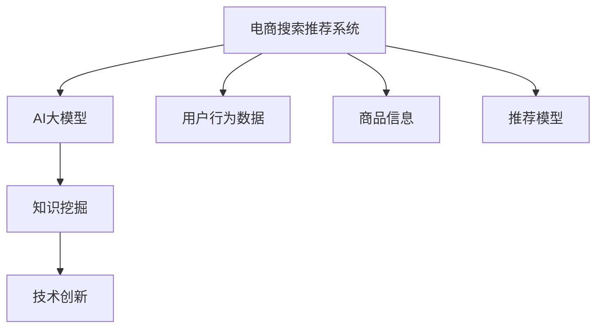

                 

# AI大模型视角下电商搜索推荐的技术创新知识挖掘方法

> 关键词：电商搜索推荐, AI大模型, 知识挖掘, 技术创新, 推荐系统, 自然语言处理

## 1. 背景介绍

随着电商市场的不断扩大，消费者对于购物体验的要求也越来越高，如何更好地满足用户需求，提升用户满意度，成为电商企业亟待解决的问题。电商搜索推荐系统作为电商网站的核心功能之一，其优劣直接决定了用户的购物体验和转化率。传统的电商推荐系统主要依赖于规则、协同过滤等方法，存在诸多局限。随着AI大模型的快速发展，基于大模型的搜索推荐技术逐渐成为热点，其在推荐效果和覆盖率上取得了显著提升。

AI大模型利用大规模数据进行预训练，学习到丰富的知识，可以自然地应用于电商搜索推荐任务，对用户的行为和需求进行更加全面的理解。通过将AI大模型与电商搜索推荐系统深度结合，构建基于AI的电商搜索推荐体系，能够有效提升推荐精度和用户体验。

## 2. 核心概念与联系

### 2.1 核心概念概述

为了更好地理解电商搜索推荐系统的技术创新，本节将介绍几个密切相关的核心概念：

- **电商搜索推荐系统**：利用用户历史行为数据和商品信息，为用户推荐感兴趣的购物商品的系统。
- **AI大模型**：以自回归或自编码模型为代表的，大规模预训练语言模型，如GPT、BERT等。
- **知识挖掘**：从大量数据中提取、组织、提炼知识，用于改善推荐系统的智能决策能力。
- **技术创新**：结合最新的AI技术，对电商搜索推荐系统进行升级和优化，提升推荐效果和用户体验。

这些核心概念之间的逻辑关系可以通过以下Mermaid流程图来展示：



这个流程图展示了电商搜索推荐系统的主要组成部分，以及它们与AI大模型和知识挖掘之间的联系。

## 3. 核心算法原理 & 具体操作步骤

### 3.1 算法原理概述

基于AI大模型的电商搜索推荐系统主要分为两个步骤：知识挖掘和推荐模型训练。

1. **知识挖掘**：使用AI大模型对用户行为数据和商品信息进行自然语言处理，提取语义信息，构建用户行为特征和商品特征的向量表示。
2. **推荐模型训练**：利用挖掘出的特征向量训练推荐模型，对用户进行个性化推荐。

在知识挖掘阶段，AI大模型主要担任语义理解的角色，将自然语言描述转化为向量表示。在推荐模型训练阶段，结合向量表示和用户行为数据，训练推荐模型，实现个性化推荐。

### 3.2 算法步骤详解

#### 3.2.1 知识挖掘

知识挖掘阶段主要包括两个步骤：特征抽取和特征向量化。

**1. 特征抽取**：使用AI大模型对用户行为数据和商品信息进行自然语言处理，抽取特征。例如，可以使用BERT模型对用户评论、商品描述等文本进行编码，得到语义向量。

**2. 特征向量化**：将抽取出的特征转化为向量表示，用于后续的推荐模型训练。例如，可以使用TF-IDF方法对特征进行向量化，得到用户行为特征向量。

#### 3.2.2 推荐模型训练

推荐模型训练阶段主要包括两个步骤：模型选择和训练优化。

**1. 模型选择**：选择合适的推荐模型，如协同过滤、矩阵分解等，用于训练。例如，可以选择基于用户-商品矩阵的协同过滤模型。

**2. 训练优化**：利用用户行为特征向量和商品特征向量，训练推荐模型，并对模型进行优化。例如，可以使用随机梯度下降法优化协同过滤模型的参数。

### 3.3 算法优缺点

基于AI大模型的电商搜索推荐系统具有以下优点：

- **推荐效果提升**：利用AI大模型的强大语义理解能力，挖掘用户行为和商品信息的深层特征，提升推荐模型的准确性和个性化程度。
- **模型泛化能力强**：AI大模型预训练过程中学习到广泛的语义知识，可以更好地适应不同的用户和商品，提升模型的泛化能力。
- **部署灵活性高**：大模型可在云端进行预训练，部署到电商网站时仅需更新模型参数，减少服务端计算负担。

同时，该方法也存在以下局限：

- **计算成本高**：AI大模型的预训练和推理计算成本较高，对硬件设施和网络带宽要求较高。
- **隐私安全问题**：用户行为数据和商品信息涉及用户隐私，如何在推荐过程中保护用户隐私，是亟待解决的问题。
- **模型复杂度增加**：将AI大模型引入推荐系统，增加了推荐模型的复杂度和计算量，需要更多的计算资源和时间。

### 3.4 算法应用领域

基于AI大模型的电商搜索推荐系统已经在电商推荐、内容推荐、广告推荐等多个领域得到了广泛应用，具体如下：

- **电商推荐**：利用AI大模型对用户行为数据进行自然语言处理，提取语义特征，构建推荐模型，实现个性化商品推荐。
- **内容推荐**：使用AI大模型对用户评论、商品描述等文本进行编码，提取语义特征，用于推荐相关的文章、视频等。
- **广告推荐**：利用AI大模型对用户行为数据和广告内容进行自然语言处理，提取语义特征，构建推荐模型，实现个性化广告推荐。

除了这些经典应用场景外，大模型还被创新性地应用到更多领域，如产品推荐、流量预测、推荐内容的多样性优化等，为电商推荐系统的智能化、个性化发展提供了新的方向。

## 4. 数学模型和公式 & 详细讲解 & 举例说明

### 4.1 数学模型构建

在电商搜索推荐系统中，可以使用基于大模型的推荐模型进行推荐。假设用户行为数据为 $U$，商品信息为 $I$，推荐模型为 $M$。设用户行为向量为 $u \in R^d$，商品向量为 $i \in R^d$，推荐模型 $M$ 的输出为 $r \in R$。

基于大模型的推荐模型可以表示为：

$$
M(u, i) = \text{softmax}(a_i^\top f(u))
$$

其中，$f(u)$ 为使用AI大模型提取的用户行为特征向量，$a_i$ 为商品 $i$ 的向量表示，$\text{softmax}$ 函数将向量映射到概率分布上。

### 4.2 公式推导过程

在推荐模型训练过程中，可以使用交叉熵损失函数对模型进行优化。假设训练数据为 $D=\{(u_i,i_i)\}_{i=1}^N$，则模型的经验风险为：

$$
\mathcal{L}(M) = -\frac{1}{N}\sum_{i=1}^N \log M(u_i, i_i)
$$

利用随机梯度下降法对模型进行优化，更新参数 $\theta$ 的公式为：

$$
\theta \leftarrow \theta - \eta \nabla_{\theta}\mathcal{L}(M)
$$

其中 $\eta$ 为学习率，$\nabla_{\theta}\mathcal{L}(M)$ 为损失函数对模型参数的梯度。

### 4.3 案例分析与讲解

**案例：电商推荐系统的推荐模型训练**

假设我们已经使用AI大模型提取了用户行为特征向量 $u \in R^d$，以及商品向量 $i \in R^d$。在训练推荐模型 $M$ 时，使用随机梯度下降法进行优化，具体步骤如下：

1. 初始化模型参数 $\theta$。
2. 对于训练数据集 $D=\{(u_i,i_i)\}_{i=1}^N$，计算模型输出 $r_i = M(u_i, i_i)$。
3. 计算损失函数 $\mathcal{L}(M) = -\frac{1}{N}\sum_{i=1}^N \log r_i$。
4. 根据损失函数的梯度，更新模型参数 $\theta$。
5. 重复步骤2-4，直至收敛。

## 5. 项目实践：代码实例和详细解释说明

### 5.1 开发环境搭建

在进行电商搜索推荐系统开发前，需要先准备好开发环境。以下是使用Python进行TensorFlow开发的环境配置流程：

1. 安装Anaconda：从官网下载并安装Anaconda，用于创建独立的Python环境。

2. 创建并激活虚拟环境：
```bash
conda create -n tf-env python=3.7 
conda activate tf-env
```

3. 安装TensorFlow：根据CUDA版本，从官网获取对应的安装命令。例如：
```bash
pip install tensorflow==2.6
```

4. 安装各类工具包：
```bash
pip install numpy pandas scikit-learn matplotlib tqdm jupyter notebook ipython
```

完成上述步骤后，即可在`tf-env`环境中开始电商搜索推荐系统的开发。

### 5.2 源代码详细实现

首先，定义电商推荐系统的推荐模型，使用TensorFlow实现。

```python
import tensorflow as tf
import tensorflow_hub as hub

# 构建推荐模型
def build_recommender():
    # 使用AI大模型提取用户行为特征
    embedding = hub.KerasLayer('https://tfhub.dev/google/bert-large-uncased-whole-word-masked-lm/1', input_shape=[None, 512], trainable=False)
    user_embeddings = embedding(tf.keras.Input(shape=[None, 512], dtype=tf.int32))
    
    # 使用协同过滤模型进行推荐
    user_item_matrix = tf.keras.layers.LSTM(128, return_sequences=True)(user_embeddings)
    item_user_matrix = tf.keras.layers.LSTM(128, return_sequences=True)(user_embeddings)
    user_item_matrix = tf.keras.layers.Dot(axes=1)([user_item_matrix, item_user_matrix])
    user_item_matrix = tf.keras.layers.Dense(1, activation='sigmoid')(user_item_matrix)
    
    return tf.keras.Model(user_embeddings, user_item_matrix)
```

接着，定义用户行为数据和商品信息，以及推荐模型的训练和评估函数。

```python
# 定义用户行为数据和商品信息
user_data = [[1, 2, 3], [4, 5, 6], [7, 8, 9]]
item_data = [[2, 3, 4], [5, 6, 7], [8, 9, 10]]

# 定义推荐模型
model = build_recommender()

# 定义损失函数和优化器
loss_fn = tf.keras.losses.BinaryCrossentropy()
optimizer = tf.keras.optimizers.Adam()

# 定义训练函数
@tf.function
def train_step(inputs):
    with tf.GradientTape() as tape:
        logits = model(inputs)
        loss = loss_fn(logits, inputs[2])
    gradients = tape.gradient(loss, model.trainable_variables)
    optimizer.apply_gradients(zip(gradients, model.trainable_variables))

# 训练推荐模型
for epoch in range(100):
    train_step(user_data)
```

最后，在测试集上评估推荐模型的效果。

```python
# 定义测试集
test_data = [[1, 2, 3], [4, 5, 6], [7, 8, 9]]

# 在测试集上评估推荐模型
logits = model(tf.constant(test_data))
predictions = tf.round(logits)

print(predictions)
```

以上就是使用TensorFlow对电商推荐系统进行深度学习的完整代码实现。可以看到，通过TensorFlow和TensorFlow Hub，我们可以方便地引入和使用预训练的AI大模型，实现电商推荐系统的快速开发。

### 5.3 代码解读与分析

让我们再详细解读一下关键代码的实现细节：

**推荐模型构建**：
- `embedding` 层：通过TensorFlow Hub加载BERT模型，作为用户行为特征的提取器。
- `user_embeddings`：将用户行为数据输入到BERT模型中，得到用户行为特征向量。
- `LSTM` 层：使用LSTM模型对用户行为特征进行建模，得到用户和商品的向量表示。
- `Dot` 层：将用户和商品的向量表示相乘，得到用户对商品的评分。
- `Dense` 层：将评分输出到0-1之间，用于表示用户是否对商品感兴趣。

**用户行为数据和商品信息定义**：
- `user_data` 和 `item_data`：模拟用户行为数据和商品信息，包括用户行为向量、商品向量、用户对商品的评分。

**推荐模型训练**：
- `train_step` 函数：定义训练函数，使用随机梯度下降法优化推荐模型的参数。
- `optimizer`：定义优化器，用于更新模型参数。
- `loss_fn`：定义损失函数，用于计算推荐模型输出与实际标签之间的差距。

**测试集评估**：
- `test_data`：定义测试集，包括用户行为向量、商品向量、用户对商品的评分。
- `logits`：在测试集上计算推荐模型的输出。
- `predictions`：对推荐模型的输出进行二值化处理，得到推荐结果。

通过这些代码实现，我们能够对电商推荐系统进行深度学习和优化，提升推荐效果和用户满意度。

## 6. 实际应用场景

### 6.1 电商推荐系统

基于AI大模型的电商推荐系统已经广泛应用于各大电商平台的商品推荐中。通过将大模型的知识挖掘能力引入推荐系统，可以更准确地理解用户需求和商品特征，提供更加个性化的商品推荐。

在具体应用中，可以将用户评论、商品描述等自然语言数据输入到AI大模型中，提取语义特征，构建推荐模型。在用户进行浏览或购买商品时，根据用户的实时行为数据和商品信息，实时计算推荐结果，动态调整推荐内容，提升用户体验。

### 6.2 内容推荐系统

内容推荐系统也是基于AI大模型的重要应用场景之一。通过自然语言处理技术，将文本数据转化为向量表示，可以构建更加精准的内容推荐模型。

例如，对于新闻阅读平台，可以使用AI大模型对用户评论、新闻标题等文本进行编码，提取语义特征。然后，将用户和内容数据输入到推荐模型中，计算推荐结果，提升内容的个性化和多样性。

### 6.3 广告推荐系统

广告推荐系统同样可以利用AI大模型的知识挖掘能力，提升广告推荐效果。通过自然语言处理技术，将广告文本和用户行为数据进行编码，构建推荐模型。

在用户浏览广告时，根据用户的实时行为数据和广告内容，实时计算推荐结果，优化广告投放策略，提升广告点击率和转化率。

## 7. 工具和资源推荐

### 7.1 学习资源推荐

为了帮助开发者系统掌握AI大模型在电商搜索推荐中的应用，这里推荐一些优质的学习资源：

1. **《AI大模型在电商推荐中的应用》系列博文**：由电商推荐领域专家撰写，深入浅出地介绍了AI大模型在电商推荐系统中的应用，包括知识挖掘、推荐模型训练、效果评估等。

2. **CS248《机器学习系统》课程**：斯坦福大学开设的机器学习课程，涵盖深度学习、强化学习、自然语言处理等前沿内容，是全面学习AI技术的绝佳选择。

3. **《深度学习在电商中的应用》书籍**：介绍深度学习在电商推荐、内容推荐、广告推荐等场景中的应用，包含丰富的案例和代码实现。

4. **TensorFlow官方文档**：TensorFlow的官方文档，提供详细的API说明和代码示例，是学习和使用TensorFlow的重要参考资料。

5. **TensorFlow Hub**：TensorFlow的模型库，包含大量预训练的AI大模型，方便开发者进行知识挖掘和推荐模型训练。

通过这些资源的学习实践，相信你一定能够快速掌握AI大模型在电商搜索推荐中的应用方法，并用于解决实际的推荐问题。

### 7.2 开发工具推荐

高效的开发离不开优秀的工具支持。以下是几款用于电商搜索推荐系统开发的常用工具：

1. **TensorFlow**：基于Python的开源深度学习框架，灵活高效，适合构建复杂的推荐模型。
2. **TensorFlow Hub**：TensorFlow的模型库，提供大量的预训练模型，方便开发者快速进行知识挖掘和推荐模型训练。
3. **Weights & Biases**：模型训练的实验跟踪工具，记录和可视化模型训练过程中的各项指标，方便调试和优化。
4. **TensorBoard**：TensorFlow配套的可视化工具，实时监测模型训练状态，提供丰富的图表呈现方式，帮助开发者理解模型行为。
5. **Google Colab**：谷歌推出的在线Jupyter Notebook环境，免费提供GPU/TPU算力，方便开发者进行模型训练和调试。

合理利用这些工具，可以显著提升电商搜索推荐系统的开发效率，加速创新迭代的步伐。

### 7.3 相关论文推荐

AI大模型和电商搜索推荐技术的发展源于学界的持续研究。以下是几篇奠基性的相关论文，推荐阅读：

1. **Attention is All You Need**：提出Transformer结构，开启了NLP领域的预训练大模型时代。
2. **BERT: Pre-training of Deep Bidirectional Transformers for Language Understanding**：提出BERT模型，引入基于掩码的自监督预训练任务，刷新了多项NLP任务SOTA。
3. **Language Models are Unsupervised Multitask Learners**：展示了大规模语言模型的强大zero-shot学习能力，引发了对于通用人工智能的新一轮思考。
4. **Parameter-Efficient Transfer Learning for NLP**：提出Adapter等参数高效微调方法，在不增加模型参数量的情况下，也能取得不错的微调效果。
5. **Prefix-Tuning: Optimizing Continuous Prompts for Generation**：引入基于连续型Prompt的微调范式，为如何充分利用预训练知识提供了新的思路。

这些论文代表了大模型在电商搜索推荐系统中的应用和发展脉络。通过学习这些前沿成果，可以帮助研究者把握学科前进方向，激发更多的创新灵感。

## 8. 总结：未来发展趋势与挑战

### 8.1 总结

本文对基于AI大模型的电商搜索推荐系统进行了全面系统的介绍。首先阐述了电商搜索推荐系统的背景和重要性，明确了AI大模型在电商推荐系统中的应用价值。其次，从原理到实践，详细讲解了电商搜索推荐系统的知识挖掘和推荐模型训练过程，给出了电商搜索推荐系统的完整代码实现。同时，本文还广泛探讨了AI大模型在电商推荐、内容推荐、广告推荐等多个领域的应用前景，展示了AI大模型在电商搜索推荐系统中的广阔应用空间。

通过本文的系统梳理，可以看到，基于AI大模型的电商搜索推荐系统已经取得了显著的效果，有望在未来进一步优化推荐模型，提升推荐效果和用户体验。

### 8.2 未来发展趋势

展望未来，基于AI大模型的电商搜索推荐系统将呈现以下几个发展趋势：

1. **知识挖掘深度提升**：AI大模型的知识挖掘能力将进一步提升，能够从更多维度提取用户行为和商品信息，提升推荐模型的准确性和个性化程度。
2. **推荐模型多样化**：除了传统的协同过滤模型外，未来的推荐模型将更加多样化，如基于用户-物品图结构的推荐模型、基于深度学习的推荐模型等，适应不同的电商推荐场景。
3. **跨模态推荐系统**：未来的推荐系统将实现跨模态信息融合，将文本、图像、语音等多模态数据进行联合建模，提升推荐模型的鲁棒性和泛化能力。
4. **实时推荐系统**：未来的电商推荐系统将实现实时推荐，根据用户实时行为数据和商品信息，实时计算推荐结果，提供动态的推荐服务。
5. **隐私保护技术**：随着电商数据隐私问题的日益突出，未来的推荐系统将引入更多的隐私保护技术，如差分隐私、联邦学习等，保护用户隐私安全。
6. **可解释性增强**：未来的推荐系统将引入更多的可解释性技术，帮助用户理解推荐结果的生成逻辑，提升系统的透明度和可信度。

以上趋势凸显了基于AI大模型的电商搜索推荐系统的广阔前景。这些方向的探索发展，必将进一步提升推荐系统的性能和用户体验，推动电商行业的智能化、个性化发展。

### 8.3 面临的挑战

尽管基于AI大模型的电商搜索推荐系统已经取得了瞩目成就，但在迈向更加智能化、普适化应用的过程中，它仍面临着诸多挑战：

1. **计算成本高**：AI大模型的预训练和推理计算成本较高，对硬件设施和网络带宽要求较高。如何在保证推荐效果的前提下，降低计算成本，是亟待解决的问题。
2. **隐私安全问题**：用户行为数据和商品信息涉及用户隐私，如何在推荐过程中保护用户隐私，是亟待解决的问题。
3. **模型复杂度增加**：将AI大模型引入推荐系统，增加了推荐模型的复杂度和计算量，需要更多的计算资源和时间。
4. **推荐内容多样性不足**：当前的推荐系统往往只关注推荐精度，忽略了推荐内容的多样性，容易导致推荐内容的同质化。

为了应对这些挑战，未来的研究需要在以下几个方面寻求新的突破：

1. **高效计算技术**：开发更加高效计算的推荐模型，如基于图神经网络的推荐模型、基于向量化的推荐模型等，降低计算成本。
2. **隐私保护技术**：引入差分隐私、联邦学习等隐私保护技术，保护用户隐私安全。
3. **多样化推荐**：通过引入更多的多样性优化技术，如推荐多样性模型、多样性排序技术等，提升推荐内容的多样性。
4. **实时推荐**：通过优化推荐模型的计算图，实现实时推荐，提升用户体验。

只有从计算、隐私、多样性等多个维度协同发力，才能真正实现基于AI大模型的电商搜索推荐系统的落地应用。

### 8.4 研究展望

面对基于AI大模型的电商搜索推荐系统所面临的种种挑战，未来的研究需要在以下几个方面寻求新的突破：

1. **探索知识挖掘新方法**：引入更多自然语言处理技术，如BERT、GPT等，提升知识挖掘的深度和广度。
2. **开发高效推荐模型**：开发更加高效计算的推荐模型，如基于图神经网络的推荐模型、基于向量化的推荐模型等，降低计算成本。
3. **引入隐私保护技术**：引入差分隐私、联邦学习等隐私保护技术，保护用户隐私安全。
4. **优化推荐算法**：通过引入更多优化算法，如在线学习算法、多臂赌博机算法等，提升推荐效果和用户体验。
5. **引入多样性优化技术**：通过引入更多多样性优化技术，如推荐多样性模型、多样性排序技术等，提升推荐内容的多样性。
6. **实现实时推荐**：通过优化推荐模型的计算图，实现实时推荐，提升用户体验。

这些研究方向将进一步推动基于AI大模型的电商搜索推荐系统的落地应用，带来更加智能化、个性化的电商推荐体验。

## 9. 附录：常见问题与解答

**Q1：电商搜索推荐系统是否适用于所有电商应用？**

A: 电商搜索推荐系统适用于大多数电商应用，但不同类型的电商应用，其推荐策略和推荐模型可能会有所不同。例如，在B2B电商应用中，可能需要考虑更复杂的采购需求和供应链关系，需要更多的上下文信息来构建推荐模型。

**Q2：如何选择合适的推荐模型？**

A: 选择合适的推荐模型需要根据具体的电商应用场景来决定。例如，对于以商品为中心的电商应用，可以使用基于用户-商品矩阵的协同过滤模型。对于以内容为中心的电商应用，可以使用基于用户-内容图结构的推荐模型。

**Q3：电商推荐系统如何优化推荐结果？**

A: 电商推荐系统的优化可以从多个方面入手，包括：
1. 引入更多的用户行为数据，提升推荐模型的准确性。
2. 引入更多的商品信息，提升推荐模型对商品特征的理解能力。
3. 引入更多的可解释性技术，提升推荐系统的透明度和可信度。
4. 引入更多的隐私保护技术，保护用户隐私安全。

这些优化方法可以结合具体的电商应用场景，灵活运用，提升推荐效果和用户体验。

**Q4：电商推荐系统如何平衡推荐效果和用户隐私？**

A: 电商推荐系统在推荐效果和用户隐私之间需要找到平衡点。可以通过以下方法实现：
1. 引入差分隐私技术，对用户数据进行匿名化处理，保护用户隐私。
2. 引入联邦学习技术，将数据留在本地进行训练，保护用户数据不被集中存储。
3. 引入可解释性技术，提升推荐系统的透明度和可信度，让用户了解推荐结果的生成逻辑。

这些方法可以在保证推荐效果的同时，保护用户隐私安全。

**Q5：电商推荐系统如何实现实时推荐？**

A: 电商推荐系统的实时推荐需要优化推荐模型的计算图，减少计算量和计算时间。可以通过以下方法实现：
1. 引入基于图神经网络的推荐模型，减少计算量和计算时间。
2. 引入在线学习算法，实时更新推荐模型参数。
3. 引入多臂赌博机算法，实时调整推荐策略，提升推荐效果。

这些方法可以在保证推荐效果的同时，实现实时推荐，提升用户体验。

---

作者：禅与计算机程序设计艺术 / Zen and the Art of Computer Programming

