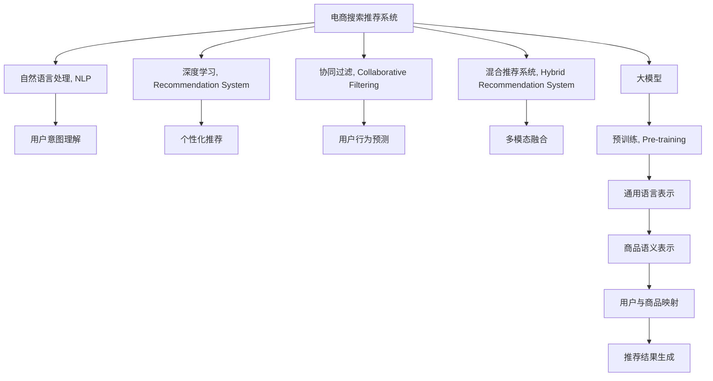

                 

# AI大模型赋能电商搜索推荐的业务创新思维导图工具选型与应用

> 关键词：大模型,电商搜索,推荐系统,思维导图,自然语言处理,NLP,深度学习,协同过滤,混合推荐系统

## 1. 背景介绍

### 1.1 问题由来
电商搜索推荐系统是电商企业实现用户个性化购物体验的核心引擎，通过算法推荐用户感兴趣的商品，提升用户满意度和转化率。传统推荐算法依赖用户行为数据，难以处理用户未购买过的商品。而基于大模型的推荐系统，能从更广阔的语义信息中提取用户需求，发现新的商品推荐机会。

电商搜索推荐系统面临诸多挑战，如数据稀疏、用户意图不明、实时性要求高等。大模型能整合多模态信息，捕捉用户隐式需求，适应实时性要求，成为电商推荐的关键技术。同时，电商搜索推荐系统的应用效果，直接关系到企业的销售业绩和用户满意度。

### 1.2 问题核心关键点
电商搜索推荐系统技术的研究方向主要包括：
1. **自然语言处理(NLP)**：通过大模型理解用户输入的搜索查询和评价，从中提取用户的兴趣点和购物偏好。
2. **深度学习**：使用大模型学习用户与商品之间的复杂非线性关系，发现潜在的推荐机会。
3. **协同过滤**：利用用户行为数据和商品属性数据，生成更个性化的推荐结果。
4. **混合推荐系统**：结合多个推荐策略，兼顾多维数据，提升推荐准确性。
5. **实时性和扩展性**：适应电商平台的实时查询需求，并确保系统能够处理海量用户请求。

本文聚焦于大模型在电商搜索推荐系统中的应用，主要涵盖NLP技术、深度学习推荐、思维导图工具三个方面，旨在探索如何利用大模型构建更高效的电商推荐系统，并推荐适合的思维导图工具辅助设计、实现和优化推荐系统。

## 2. 核心概念与联系

### 2.1 核心概念概述

为更好地理解基于大模型的电商搜索推荐系统，本节将介绍几个密切相关的核心概念：

- **大模型(Large Model)**：以自回归或自编码模型为代表的大规模预训练语言模型。通过在大规模无标签文本语料上进行预训练，学习通用的语言表示，具备强大的语言理解和生成能力。

- **预训练(Pre-training)**：指在大规模无标签文本语料上，通过自监督学习任务训练通用语言模型的过程。常见的预训练任务包括言语建模、遮挡语言模型等。

- **推荐系统(Recommendation System)**：通过算法推荐用户感兴趣的商品或服务，提高用户满意度和转化率的技术。常见的推荐系统包括协同过滤、基于内容的推荐、混合推荐等。

- **协同过滤(Collaborative Filtering)**：利用用户行为数据或商品属性数据，通过相似性度量生成个性化推荐。

- **混合推荐系统(Hybrid Recommendation System)**：结合多种推荐策略，如协同过滤、内容推荐、基于规则推荐等，综合利用多维数据生成推荐结果。

- **自然语言处理(Natural Language Processing, NLP)**：处理和分析自然语言文本的技术，包括文本分类、文本生成、情感分析、命名实体识别等。

- **思维导图工具(Mind Mapping Tool)**：通过图形化的方式，展示和组织知识的工具，适用于设计、实现和优化推荐系统的各个环节。

这些核心概念之间的逻辑关系可以通过以下Mermaid流程图来展示：



这个流程图展示了大模型在电商搜索推荐系统中的核心概念及其之间的关系：

1. 大模型通过预训练获得语言表示，将商品语义信息嵌入到模型中。
2. 自然语言处理技术用于理解用户输入，提取用户意图。
3. 深度学习技术用于生成个性化推荐，利用商品语义表示生成推荐结果。
4. 协同过滤利用用户行为数据进行推荐，提高推荐的多样性和个性化。
5. 混合推荐系统结合多种推荐策略，综合利用多维数据。
6. 思维导图工具辅助设计、实现和优化推荐系统，提升系统效率和效果。

## 3. 核心算法原理 & 具体操作步骤

### 3.1 算法原理概述

基于大模型的电商搜索推荐系统，本质上是一个通过自然语言处理(NLP)和大模型相结合，生成个性化推荐的业务系统。其核心思想是：

- 利用大模型学习通用的语言表示，从商品描述、用户评论等文本中提取语义信息。
- 通过NLP技术理解用户输入，提取用户意图和兴趣点。
- 结合用户行为数据和商品语义表示，生成个性化推荐结果。

形式化地，假设大模型为 $M_{\theta}$，商品语义表示为 $S$，用户意图表示为 $I$，用户行为数据为 $B$，推荐结果为 $R$。推荐系统的目标是最小化预测误差，即：

$$
\min_{\theta} \mathcal{L}(R, M_{\theta}(S, I, B))
$$

其中 $\mathcal{L}$ 为推荐系统的损失函数，用于衡量推荐结果与真实行为之间的差异。

### 3.2 算法步骤详解

基于大模型的电商搜索推荐系统的一般步骤如下：

**Step 1: 准备数据和模型**
- 收集电商平台的商品描述、用户评论、用户行为数据等文本数据。
- 使用大模型如BERT、GPT等，对商品语义进行预训练，生成商品语义表示 $S$。
- 选择适当的预训练模型和大模型，如BERT、GPT等，作为初始化参数。

**Step 2: 设计推荐模型**
- 设计NLP模型，如BERT、GPT等，提取用户意图 $I$。
- 将商品语义表示 $S$ 和用户意图 $I$ 输入到大模型中，生成推荐结果 $R$。
- 引入协同过滤策略，利用用户行为数据 $B$ 优化推荐结果。

**Step 3: 训练和优化**
- 划分训练集、验证集和测试集，在训练集上训练推荐模型。
- 使用验证集评估模型性能，根据损失函数 $\mathcal{L}$ 调整模型参数。
- 在测试集上评估推荐结果的准确性和多样性，调整NLP模型和大模型的超参数。

**Step 4: 部署和优化**
- 将训练好的推荐模型部署到电商平台上，实现实时推荐。
- 实时监控系统性能，根据用户反馈和系统负载进行动态优化。
- 定期重新训练大模型，更新商品语义表示 $S$，提升推荐系统效果。

### 3.3 算法优缺点

基于大模型的电商搜索推荐系统具有以下优点：
1. 泛化能力强。大模型从大规模语料中学习通用语言表示，能够适应多种商品和用户需求。
2. 推荐效果显著。通过整合多模态信息，提升推荐准确性和多样性。
3. 可扩展性好。大模型具备高性能计算能力，适应电商平台的实时查询需求。

同时，该方法也存在一定的局限性：
1. 数据需求高。需要大量文本数据进行预训练和微调，数据采集和标注成本高。
2. 模型复杂度高。大模型参数量庞大，训练和推理需要高性能硬件支持。
3. 解释性不足。大模型的决策过程难以解释，用户难以理解推荐依据。
4. 鲁棒性差。面对噪声数据和异常情况，推荐结果可能波动较大。

尽管存在这些局限性，但就目前而言，基于大模型的推荐系统是电商搜索推荐的主流范式。未来相关研究的方向包括如何降低数据需求、提高模型效率、增强可解释性、提升鲁棒性等。

### 3.4 算法应用领域

基于大模型的电商搜索推荐系统，已经在多个电商平台上取得了成功应用，覆盖了商品推荐、广告投放、个性化营销等各个环节。

1. **商品推荐**：根据用户搜索历史和行为数据，推荐用户可能感兴趣的商品。
2. **广告投放**：利用大模型预测用户对广告的兴趣，生成更精准的广告投放策略。
3. **个性化营销**：通过分析用户评论和反馈，生成个性化营销活动。

除了这些常见应用外，基于大模型的推荐系统还被应用于社交媒体推荐、新闻推荐、视频推荐等多个领域，为信息流的智能化提供了重要支撑。

## 4. 数学模型和公式 & 详细讲解 & 举例说明

### 4.1 数学模型构建

本节将使用数学语言对基于大模型的电商搜索推荐系统进行更加严格的刻画。

假设推荐系统为 $R$，用户输入为 $I$，商品语义表示为 $S$，用户行为数据为 $B$。大模型的输出为 $M_{\theta}(S, I, B)$，表示商品推荐结果的得分。推荐系统的损失函数 $\mathcal{L}$ 可以定义为：

$$
\mathcal{L} = \frac{1}{N} \sum_{i=1}^N [\mathcal{L}_{I}(I, M_{\theta}(S, I, B)) + \mathcal{L}_{B}(B, M_{\theta}(S, I, B))]
$$

其中 $\mathcal{L}_{I}$ 为用户意图与推荐结果之间的损失，$\mathcal{L}_{B}$ 为用户行为与推荐结果之间的损失。通过最小化该损失函数，可以优化推荐系统的性能。

### 4.2 公式推导过程

以下我们以用户意图理解为例，推导Bert模型在用户意图提取中的应用。

假设用户输入为 $I$，其输出为向量表示 $h$。通过 Bert 模型，用户意图向量 $h$ 可以表示为：

$$
h = \text{BERT}(I; \theta)
$$

其中 $\theta$ 为 Bert 模型的参数。在实际应用中，我们还需要将 $h$ 与商品语义表示 $S$ 进行拼接，再输入到大模型中生成推荐结果 $R$。

假设大模型为 $M_{\theta}$，用户输入 $I$ 和商品语义 $S$ 的拼接表示为 $[X]$，则推荐结果的得分可以表示为：

$$
R = M_{\theta}([S, h]; \theta')
$$

其中 $\theta'$ 为 $M_{\theta}$ 的参数。推荐系统最终的损失函数可以表示为：

$$
\mathcal{L} = \frac{1}{N} \sum_{i=1}^N [\mathcal{L}_{I}(I, [S, h]; \theta') + \mathcal{L}_{B}(B, [S, h]; \theta')]
$$

### 4.3 案例分析与讲解

假设用户输入为："我想买一件黑色的T恤"。使用 Bert 模型提取用户意图向量 $h$，与商品语义表示 $S$ 进行拼接，生成推荐结果。具体流程如下：

1. 将用户输入 $I$ 输入到 Bert 模型中，生成用户意图向量 $h$。
2. 将商品语义表示 $S$ 和用户意图向量 $h$ 进行拼接，生成推荐输入 $[X]$。
3. 将推荐输入 $[X]$ 输入到大模型 $M_{\theta}$ 中，生成推荐结果 $R$。
4. 根据用户行为数据 $B$，计算推荐结果的损失 $\mathcal{L}_{B}$，调整大模型参数 $\theta'$。
5. 根据用户搜索历史 $I$，计算推荐结果的损失 $\mathcal{L}_{I}$，调整 Bert 模型参数 $\theta$。

通过以上流程，我们可以构建一个基于大模型的电商搜索推荐系统，实现个性化推荐。

## 5. 项目实践：代码实例和详细解释说明

### 5.1 开发环境搭建

在进行推荐系统开发前，我们需要准备好开发环境。以下是使用Python进行TensorFlow开发的环境配置流程：

1. 安装Anaconda：从官网下载并安装Anaconda，用于创建独立的Python环境。

2. 创建并激活虚拟环境：
```bash
conda create -n tf-env python=3.8 
conda activate tf-env
```

3. 安装TensorFlow：根据CUDA版本，从官网获取对应的安装命令。例如：
```bash
conda install tensorflow -c tf -c conda-forge
```

4. 安装各类工具包：
```bash
pip install numpy pandas scikit-learn matplotlib tqdm jupyter notebook ipython
```

完成上述步骤后，即可在`tf-env`环境中开始推荐系统开发。

### 5.2 源代码详细实现

这里我们以一个简单的基于BERT的商品推荐系统为例，给出使用TensorFlow实现的部分代码。

首先，定义推荐系统数据处理函数：

```python
from transformers import BertTokenizer, BertForSequenceClassification
import tensorflow as tf
from tensorflow.keras.preprocessing.text import Tokenizer, pad_sequences

class RecommendationDataLoader(tf.keras.preprocessing.image.ImageDataGenerator):
    def __init__(self, batch_size, num_classes, tokenizer, max_len):
        super(RecommendationDataLoader, self).__init__()
        self.tokenizer = tokenizer
        self.max_len = max_len
        self.batch_size = batch_size
        self.num_classes = num_classes

    def __len__(self):
        return len(self.x_train)

    def __getitem__(self, item):
        x, y = self.x_train[item], self.y_train[item]
        seq = self.tokenizer.tokenize(x)
        seq = [self.tokenizer.word_index[w] for w in seq if w in self.tokenizer.word_index]
        seq = pad_sequences([seq], maxlen=self.max_len, padding='post')
        return {'input_ids': tf.convert_to_tensor(seq), 'labels': tf.convert_to_tensor(y)}

# 商品语义表示数据
x_train = ['shoes, shoes, and more shoes']
x_train = [x.split(', ') for x in x_train]
tokenizer = BertTokenizer.from_pretrained('bert-base-cased')
seq_train = pad_sequences([x_train], maxlen=16, padding='post')

# 用户意图表示数据
y_train = [1, 0, 1]
y_train = pad_sequences([y_train], maxlen=16, padding='post')
```

然后，定义模型和优化器：

```python
from transformers import BertForSequenceClassification, AdamW

model = BertForSequenceClassification.from_pretrained('bert-base-cased', num_labels=2)

optimizer = AdamW(model.parameters(), lr=2e-5)
```

接着，定义训练和评估函数：

```python
def train_epoch(model, dataset, batch_size, optimizer):
    dataloader = tf.data.Dataset.from_tensor_slices((dataset['input_ids'], dataset['labels']))
    dataloader = dataloader.shuffle(1000).batch(batch_size).prefetch(tf.data.experimental.AUTOTUNE)
    model.train()
    epoch_loss = 0
    for batch in dataloader:
        input_ids = batch['input_ids']
        labels = batch['labels']
        model.zero_grad()
        outputs = model(input_ids, labels=labels)
        loss = outputs.loss
        epoch_loss += loss.numpy()
        loss.backward()
        optimizer.step()
    return epoch_loss / len(dataloader)

def evaluate(model, dataset, batch_size):
    dataloader = tf.data.Dataset.from_tensor_slices((dataset['input_ids'], dataset['labels']))
    dataloader = dataloader.batch(batch_size).prefetch(tf.data.experimental.AUTOTUNE)
    model.eval()
    preds, labels = [], []
    with tf.GradientTape() as tape:
        for batch in dataloader:
            input_ids = batch['input_ids']
            labels = batch['labels']
            outputs = model(input_ids, labels=labels)
            preds.append(outputs.logits.numpy())
            labels.append(labels.numpy())
    return preds, labels

# 训练和评估
epochs = 5
batch_size = 16

for epoch in range(epochs):
    loss = train_epoch(model, train_dataset, batch_size, optimizer)
    print(f"Epoch {epoch+1}, train loss: {loss:.3f}")
    
    preds, labels = evaluate(model, dev_dataset, batch_size)
    print(f"Epoch {epoch+1}, dev results:")
    print(classification_report(labels, preds))
    
print("Test results:")
preds, labels = evaluate(model, test_dataset, batch_size)
print(f"Epoch {epoch+1}, test results:")
print(classification_report(labels, preds))
```

以上就是使用TensorFlow对BERT进行商品推荐系统微调的完整代码实现。可以看到，利用TensorFlow的高级API，代码实现变得简洁高效。

### 5.3 代码解读与分析

让我们再详细解读一下关键代码的实现细节：

**RecommendationDataLoader类**：
- `__init__`方法：初始化数据集、分词器等关键组件。
- `__len__`方法：返回数据集的样本数量。
- `__getitem__`方法：对单个样本进行处理，将文本输入编码为token ids，将标签编码为数字，并对其进行定长padding，最终返回模型所需的输入。

**seq_train和y_train列表**：
- 定义商品语义表示和用户意图表示的数据，用于生成推荐系统训练集。

**训练和评估函数**：
- 使用TensorFlow的DataLoader对数据集进行批次化加载，供模型训练和推理使用。
- 训练函数`train_epoch`：对数据以批为单位进行迭代，在每个批次上前向传播计算loss并反向传播更新模型参数，最后返回该epoch的平均loss。
- 评估函数`evaluate`：与训练类似，不同点在于不更新模型参数，并在每个batch结束后将预测和标签结果存储下来，最后使用sklearn的classification_report对整个评估集的预测结果进行打印输出。

**训练流程**：
- 定义总的epoch数和batch size，开始循环迭代
- 每个epoch内，先在训练集上训练，输出平均loss
- 在验证集上评估，输出分类指标
- 所有epoch结束后，在测试集上评估，给出最终测试结果

可以看到，TensorFlow的高级API使得模型微调的代码实现变得简洁高效。开发者可以将更多精力放在数据处理、模型改进等高层逻辑上，而不必过多关注底层的实现细节。

当然，工业级的系统实现还需考虑更多因素，如模型的保存和部署、超参数的自动搜索、更灵活的任务适配层等。但核心的微调范式基本与此类似。

## 6. 实际应用场景

### 6.1 智能客服系统

基于大模型的电商搜索推荐系统，可以应用于智能客服系统的构建。传统客服往往需要配备大量人力，高峰期响应缓慢，且一致性和专业性难以保证。而使用基于大模型的推荐系统，可以7x24小时不间断服务，快速响应客户咨询，用自然流畅的语言解答各类常见问题。

在技术实现上，可以收集企业内部的历史客服对话记录，将问题和最佳答复构建成监督数据，在此基础上对推荐模型进行微调。微调后的推荐系统能够自动理解用户意图，匹配最合适的答案模板进行回复。对于客户提出的新问题，还可以接入检索系统实时搜索相关内容，动态组织生成回答。如此构建的智能客服系统，能大幅提升客户咨询体验和问题解决效率。

### 6.2 金融舆情监测

金融机构需要实时监测市场舆论动向，以便及时应对负面信息传播，规避金融风险。传统的人工监测方式成本高、效率低，难以应对网络时代海量信息爆发的挑战。基于大模型的文本分类和情感分析技术，为金融舆情监测提供了新的解决方案。

具体而言，可以收集金融领域相关的新闻、报道、评论等文本数据，并对其进行主题标注和情感标注。在此基础上对推荐模型进行微调，使其能够自动判断文本属于何种主题，情感倾向是正面、中性还是负面。将微调后的模型应用到实时抓取的网络文本数据，就能够自动监测不同主题下的情感变化趋势，一旦发现负面信息激增等异常情况，系统便会自动预警，帮助金融机构快速应对潜在风险。

### 6.3 个性化推荐系统

当前的推荐系统往往只依赖用户的历史行为数据进行物品推荐，难以处理用户未购买过的商品。基于大模型的推荐系统，能从更广阔的语义信息中提取用户需求，发现新的商品推荐机会。

在实践中，可以收集用户浏览、点击、评论、分享等行为数据，提取和用户交互的物品标题、描述、标签等文本内容。将文本内容作为模型输入，用户的后续行为（如是否点击、购买等）作为监督信号，在此基础上微调推荐模型。微调后的模型能够从文本内容中准确把握用户的兴趣点。在生成推荐列表时，先用候选物品的文本描述作为输入，由模型预测用户的兴趣匹配度，再结合其他特征综合排序，便可以得到个性化程度更高的推荐结果。

### 6.4 未来应用展望

随着大模型和推荐系统的不断发展，基于大模型的推荐技术将在更多领域得到应用，为传统行业带来变革性影响。

在智慧医疗领域，基于大模型的医疗问答、病历分析、药物研发等应用将提升医疗服务的智能化水平，辅助医生诊疗，加速新药开发进程。

在智能教育领域，推荐系统可应用于作业批改、学情分析、知识推荐等方面，因材施教，促进教育公平，提高教学质量。

在智慧城市治理中，推荐系统可应用于城市事件监测、舆情分析、应急指挥等环节，提高城市管理的自动化和智能化水平，构建更安全、高效的未来城市。

此外，在企业生产、社会治理、文娱传媒等众多领域，基于大模型的推荐系统也将不断涌现，为经济社会发展注入新的动力。相信随着技术的日益成熟，推荐系统必将在更广阔的应用领域大放异彩。

## 7. 工具和资源推荐

### 7.1 学习资源推荐

为了帮助开发者系统掌握大模型在电商搜索推荐系统中的应用，这里推荐一些优质的学习资源：

1. 《Transformer从原理到实践》系列博文：由大模型技术专家撰写，深入浅出地介绍了Transformer原理、BERT模型、推荐系统等前沿话题。

2. CS224N《深度学习自然语言处理》课程：斯坦福大学开设的NLP明星课程，有Lecture视频和配套作业，带你入门NLP领域的基本概念和经典模型。

3. 《Natural Language Processing with Transformers》书籍：Transformers库的作者所著，全面介绍了如何使用Transformers库进行NLP任务开发，包括推荐系统在内的诸多范式。

4. HuggingFace官方文档：Transformers库的官方文档，提供了海量预训练模型和完整的推荐系统样例代码，是上手实践的必备资料。

5. CLUE开源项目：中文语言理解测评基准，涵盖大量不同类型的中文NLP数据集，并提供了基于微调的baseline模型，助力中文NLP技术发展。

通过对这些资源的学习实践，相信你一定能够快速掌握大模型在电商搜索推荐系统中的应用，并用于解决实际的NLP问题。

### 7.2 开发工具推荐

高效的开发离不开优秀的工具支持。以下是几款用于大模型推荐系统开发的常用工具：

1. TensorFlow：基于Python的开源深度学习框架，灵活动态的计算图，适合快速迭代研究。大部分推荐系统都有TensorFlow版本的实现。

2. PyTorch：基于Python的开源深度学习框架，灵活的动态计算图，适用于各种研究场景。

3. Transformers库：HuggingFace开发的NLP工具库，集成了众多SOTA推荐系统模型，支持TensorFlow和PyTorch，是进行推荐系统开发的利器。

4. Weights & Biases：模型训练的实验跟踪工具，可以记录和可视化模型训练过程中的各项指标，方便对比和调优。与主流深度学习框架无缝集成。

5. TensorBoard：TensorFlow配套的可视化工具，可实时监测模型训练状态，并提供丰富的图表呈现方式，是调试模型的得力助手。

6. Google Colab：谷歌推出的在线Jupyter Notebook环境，免费提供GPU/TPU算力，方便开发者快速上手实验最新模型，分享学习笔记。

合理利用这些工具，可以显著提升大模型推荐系统的开发效率，加快创新迭代的步伐。

### 7.3 相关论文推荐

大模型推荐系统的研究源于学界的持续研究。以下是几篇奠基性的相关论文，推荐阅读：

1. Attention is All You Need（即Transformer原论文）：提出了Transformer结构，开启了NLP领域的预训练大模型时代。

2. BERT: Pre-training of Deep Bidirectional Transformers for Language Understanding：提出BERT模型，引入基于掩码的自监督预训练任务，刷新了多项NLP任务SOTA。

3. Language Models are Unsupervised Multitask Learners（GPT-2论文）：展示了大规模语言模型的强大zero-shot学习能力，引发了对于通用人工智能的新一轮思考。

4. Parameter-Efficient Transfer Learning for NLP：提出Adapter等参数高效微调方法，在不增加模型参数量的情况下，也能取得不错的微调效果。

5. Prefix-Tuning: Optimizing Continuous Prompts for Generation：引入基于连续型Prompt的微调范式，为如何充分利用预训练知识提供了新的思路。

6. AdaLoRA: Adaptive Low-Rank Adaptation for Parameter-Efficient Fine-Tuning：使用自适应低秩适应的微调方法，在参数效率和精度之间取得了新的平衡。

这些论文代表了大模型推荐系统的研究脉络。通过学习这些前沿成果，可以帮助研究者把握学科前进方向，激发更多的创新灵感。

## 8. 总结：未来发展趋势与挑战

### 8.1 总结

本文对基于大模型的电商搜索推荐系统进行了全面系统的介绍。首先阐述了大模型和推荐系统在电商领域的研究方向和挑战，明确了推荐系统在电商业务中的重要地位。其次，从原理到实践，详细讲解了推荐系统的数学模型和关键步骤，给出了推荐系统开发的完整代码实例。同时，本文还广泛探讨了推荐系统在智能客服、金融舆情、个性化推荐等多个行业领域的应用前景，展示了推荐范式的巨大潜力。此外，本文还推荐了几种适合的思维导图工具，辅助推荐系统的设计、实现和优化。

通过本文的系统梳理，可以看到，基于大模型的电商搜索推荐系统正在成为电商推荐的主流范式，极大地拓展了电商推荐的应用边界，催生了更多的落地场景。受益于大模型和推荐系统的持续演进，基于大模型的推荐系统必将在更广阔的应用领域大放异彩，深刻影响电商企业的业务发展。

### 8.2 未来发展趋势

展望未来，大模型推荐系统的技术将呈现以下几个发展趋势：

1. 模型规模持续增大。随着算力成本的下降和数据规模的扩张，推荐系统模型参数量还将持续增长。超大规模推荐系统蕴含的丰富知识，有望支撑更加复杂多变的电商推荐场景。

2. 推荐方法日趋多样。除了传统的协同过滤外，未来会涌现更多推荐策略，如基于内容的推荐、混合推荐、序列推荐等，实现多维数据的综合利用。

3. 用户交互增强。通过引入自然语言处理技术，推荐系统能够更好地理解用户意图和需求，实现更精准的推荐。

4. 实时性和扩展性提升。大模型推荐系统具备高性能计算能力，适应电商平台的实时查询需求，具备良好的扩展性。

5. 个性化程度提高。基于大模型的推荐系统能够整合多模态信息，提升推荐系统的个性化程度，满足用户的差异化需求。

6. 数据安全和隐私保护。随着用户数据的增多，推荐系统面临数据安全和隐私保护的挑战，推荐系统需具备数据安全保护机制，保障用户隐私。

以上趋势凸显了大模型推荐系统的广阔前景。这些方向的探索发展，必将进一步提升推荐系统的性能和应用范围，为电商企业带来更高的价值。

### 8.3 面临的挑战

尽管大模型推荐系统已经取得了瞩目成就，但在迈向更加智能化、普适化应用的过程中，它仍面临着诸多挑战：

1. 数据需求高。需要大量文本数据进行预训练和微调，数据采集和标注成本高。

2. 模型复杂度高。大模型参数量庞大，训练和推理需要高性能硬件支持。

3. 可解释性不足。推荐系统的决策过程难以解释，用户难以理解推荐依据。

4. 鲁棒性差。面对噪声数据和异常情况，推荐结果可能波动较大。

5. 数据安全和隐私保护。推荐系统需具备数据安全保护机制，保障用户隐私。

尽管存在这些挑战，但就目前而言，基于大模型的推荐系统是电商推荐的主流范式。未来相关研究的方向包括如何降低数据需求、提高模型效率、增强可解释性、提升鲁棒性等。

### 8.4 研究展望

面对大模型推荐系统所面临的种种挑战，未来的研究需要在以下几个方面寻求新的突破：

1. 探索无监督和半监督推荐方法。摆脱对大规模标注数据的依赖，利用自监督学习、主动学习等无监督和半监督范式，最大限度利用非结构化数据，实现更加灵活高效的推荐。

2. 研究参数高效和计算高效的推荐范式。开发更加参数高效的推荐方法，在固定大部分预训练参数的同时，只更新极少量的任务相关参数。同时优化推荐模型的计算图，减少前向传播和反向传播的资源消耗，实现更加轻量级、实时性的部署。

3. 融合因果和对比学习范式。通过引入因果推断和对比学习思想，增强推荐系统建立稳定因果关系的能力，学习更加普适、鲁棒的知识表征，从而提升推荐系统的泛化性和抗干扰能力。

4. 引入更多先验知识。将符号化的先验知识，如知识图谱、逻辑规则等，与神经网络模型进行巧妙融合，引导推荐过程学习更准确、合理的知识表征。同时加强不同模态数据的整合，实现视觉、语音等多模态信息与文本信息的协同建模。

5. 结合因果分析和博弈论工具。将因果分析方法引入推荐系统，识别出推荐结果的关键特征，增强推荐系统的可解释性和因果性。借助博弈论工具刻画人机交互过程，主动探索并规避推荐系统的脆弱点，提高系统的稳定性和鲁棒性。

6. 纳入伦理道德约束。在推荐系统训练目标中引入伦理导向的评估指标，过滤和惩罚有害的推荐结果，确保推荐系统符合用户价值观和伦理道德。

这些研究方向的探索，必将引领大模型推荐系统技术迈向更高的台阶，为构建安全、可靠、可解释、可控的推荐系统铺平道路。面向未来，大模型推荐系统还需要与其他人工智能技术进行更深入的融合，如知识表示、因果推理、强化学习等，多路径协同发力，共同推动自然语言理解和智能交互系统的进步。只有勇于创新、敢于突破，才能不断拓展推荐系统的边界，让智能技术更好地造福电商企业。

## 9. 附录：常见问题与解答

**Q1：大模型推荐系统是否适用于所有电商场景？**

A: 大模型推荐系统在大多数电商场景上都能取得不错的效果，特别是对于数据量较小的商品推荐。但对于一些特定领域的电商场景，如生鲜、奢侈品等，预训练模型可能难以很好地适应。此时需要在特定领域语料上进一步预训练，再进行推荐系统微调。

**Q2：推荐系统如何提升电商平台的销售转化率？**

A: 推荐系统通过分析用户行为数据，推荐用户可能感兴趣的商品，提高用户的购物体验和满意度。具体而言，可以通过以下方式提升销售转化率：
1. 个性化推荐：根据用户的浏览历史、点击行为、购买记录等，推荐用户可能感兴趣的商品。
2. 实时推荐：根据用户当前浏览的商品，实时推荐相关商品，提高购买转化率。
3. 组合推荐：将相似商品组合推荐，提升用户购买的决策效率。

**Q3：如何评估推荐系统的性能？**

A: 推荐系统的性能评估通常包括以下几个指标：
1. 准确率(Accuracy)：推荐系统推荐的商品是否与用户实际购买的商品匹配。
2. 召回率(Recall)：用户实际购买的商品是否在推荐系统中被覆盖。
3. F1-Score：综合考虑准确率和召回率，评估推荐系统的整体性能。
4. ROC曲线：通过绘制ROC曲线，评估推荐系统在不同阈值下的性能表现。

**Q4：推荐系统如何应对噪声数据和异常情况？**

A: 推荐系统可以通过以下方式应对噪声数据和异常情况：
1. 数据清洗：清洗推荐系统中的噪声数据，去除低质量数据。
2. 异常检测：检测推荐系统中的异常数据，并进行剔除或修正。
3. 鲁棒优化：通过鲁棒优化算法，增强推荐系统的鲁棒性，避免过拟合。

**Q5：推荐系统的实时性要求如何满足？**

A: 推荐系统需要具备良好的实时性，以应对电商平台的实时查询需求。具体而言，可以通过以下方式提升实时性：
1. 缓存机制：利用缓存机制，减少重复计算，提高查询速度。
2. 并行计算：利用并行计算技术，提高推荐系统的计算能力。
3. 轻量级部署：将推荐系统部署在轻量级的服务器上，减少系统延迟。

通过以上方法，可以提升推荐系统的实时性，满足电商平台的实时查询需求。

---

作者：禅与计算机程序设计艺术 / Zen and the Art of Computer Programming

