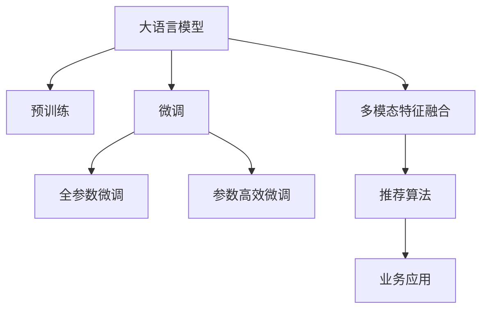

                 

# AI大模型赋能电商搜索推荐的业务创新思维导图应用实践

> 关键词：AI大模型,搜索推荐,电商,深度学习,自然语言处理,NLP,推荐系统,推荐算法,思维导图

## 1. 背景介绍

### 1.1 问题由来
随着互联网的飞速发展，电子商务平台逐渐成为消费者购物的主要渠道。电商平台通过提供海量的商品信息，满足了消费者多样化的购物需求。然而，在海量商品中快速找到满足自己需求的商品，却是一个巨大的挑战。如何提升搜索推荐的精准度，提升用户体验，成为电商平台的重点关注方向。

传统的推荐系统，主要依赖于基于用户的协同过滤、内容推荐等算法，通过用户行为数据进行推荐。但这种方法在面对长尾商品、新兴商品等数据稀疏的情况下，难以取得良好效果。因此，如何进一步提升推荐系统的效果，拓展其应用边界，成为当前研究的重点。

近年来，大模型在自然语言处理(NLP)领域的突破，使得基于大模型的推荐系统成为了研究的热点。大模型通过在海量文本数据上进行预训练，学习到了丰富的语言知识和特征，可以应用于更广泛的推荐场景中。通过微调这些预训练模型，可以提升推荐系统的性能，拓展其应用领域。

### 1.2 问题核心关键点
目前，基于大模型的推荐系统主要依赖于以下核心技术：

- 大语言模型：如BERT、GPT等，通过在海量无标签文本上预训练，学习到丰富的语言知识。
- 预训练-微调范式：在大模型上进行微调，使其适应特定的电商推荐任务。
- 多模态特征融合：结合文本、图像、用户行为等不同模态特征，提升推荐系统的精度。
- 推荐算法：如协同过滤、内容推荐、混合推荐等，构建起推荐系统的核心逻辑。
- 业务应用：将推荐系统集成到电商平台的搜索推荐功能中，实时生成推荐结果，提升用户体验。

通过理解这些核心技术，我们可以更好地把握大模型推荐系统的设计思路和实现方法。

### 1.3 问题研究意义
研究大模型在电商推荐系统中的应用，对于提升搜索推荐效果，优化用户体验，具有重要意义：

1. 提升推荐精度：通过大模型的预训练-微调范式，利用其强大的语言理解能力，可以提升推荐系统对商品描述、用户评论等文本信息的利用效率，进而提升推荐效果。
2. 拓展应用场景：大模型可以应用于文本相似度匹配、关键词推荐、商品关联推荐等场景中，极大地拓展了推荐系统的应用边界。
3. 加速技术落地：大模型可以通过微调快速适配特定任务，加速技术在电商平台的落地应用，减少开发成本。
4. 增强用户粘性：通过精准推荐，提升用户的购物体验，增加平台粘性，提升用户留存率和复购率。
5. 推动业务创新：大模型推荐系统能够提供更智能、个性化的推荐服务，推动电商平台的业务模式创新。

## 2. 核心概念与联系

### 2.1 核心概念概述

为更好地理解大模型在电商推荐系统中的应用，本节将介绍几个密切相关的核心概念：

- 大语言模型(Large Language Model, LLM)：如BERT、GPT等，通过在海量无标签文本上预训练，学习到丰富的语言知识。
- 预训练-微调范式(Pre-training and Fine-tuning)：在大模型上进行微调，使其适应特定的电商推荐任务。
- 多模态特征融合(Multi-modal Feature Fusion)：结合文本、图像、用户行为等不同模态特征，提升推荐系统的精度。
- 推荐算法(Recommendation Algorithm)：如协同过滤、内容推荐、混合推荐等，构建起推荐系统的核心逻辑。
- 业务应用(Business Application)：将推荐系统集成到电商平台的搜索推荐功能中，实时生成推荐结果，提升用户体验。

这些核心概念之间的逻辑关系可以通过以下Mermaid流程图来展示：



这个流程图展示了大模型推荐系统的核心概念及其之间的关系：

1. 大语言模型通过预训练获得基础能力。
2. 微调是对预训练模型进行任务特定的优化，可以分为全参数微调和参数高效微调（PEFT）。
3. 多模态特征融合是指将文本、图像、用户行为等不同模态的数据融合到推荐系统，提升推荐精度。
4. 推荐算法是构建推荐系统的核心，通过协同过滤、内容推荐等算法生成推荐结果。
5. 业务应用是将推荐系统集成到实际应用中，提升用户体验。

这些概念共同构成了大模型推荐系统的学习和应用框架，使其能够在电商搜索推荐等场景中发挥强大的作用。通过理解这些核心概念，我们可以更好地把握大模型推荐系统的设计思路和实现方法。

## 3. 核心算法原理 & 具体操作步骤
### 3.1 算法原理概述

基于大模型的电商搜索推荐系统，本质上是一个有监督的细粒度迁移学习过程。其核心思想是：将大语言模型视作一个强大的"特征提取器"，通过在电商推荐任务的标注数据上进行有监督地训练来优化模型在该任务上的性能。

形式化地，假设大语言模型为 $M_{\theta}$，其中 $\theta$ 为预训练得到的模型参数。给定电商推荐任务 $T$ 的标注数据集 $D=\{(x_i, y_i)\}_{i=1}^N, x_i \in \mathcal{X}, y_i \in \mathcal{Y}$，其中 $\mathcal{X}$ 为输入特征空间，$\mathcal{Y}$ 为输出标签空间。微调的目标是找到新的模型参数 $\hat{\theta}$，使得：

$$
\hat{\theta}=\mathop{\arg\min}_{\theta} \mathcal{L}(M_{\theta},D)
$$

其中 $\mathcal{L}$ 为针对任务 $T$ 设计的损失函数，用于衡量模型预测输出与真实标签之间的差异。常见的损失函数包括交叉熵损失、均方误差损失等。

通过梯度下降等优化算法，微调过程不断更新模型参数 $\theta$，最小化损失函数 $\mathcal{L}$，使得模型输出逼近真实标签。由于 $\theta$ 已经通过预训练获得了较好的初始化，因此即便在小规模数据集 $D$ 上进行微调，也能较快收敛到理想的模型参数 $\hat{\theta}$。

### 3.2 算法步骤详解

基于大模型的电商搜索推荐系统一般包括以下几个关键步骤：

**Step 1: 准备预训练模型和数据集**
- 选择合适的预训练语言模型 $M_{\theta}$ 作为初始化参数，如 BERT、GPT等。
- 准备电商推荐任务 $T$ 的标注数据集 $D$，划分为训练集、验证集和测试集。一般要求标注数据与预训练数据的分布不要差异过大。

**Step 2: 添加任务适配层**
- 根据任务类型，在预训练模型顶层设计合适的输出层和损失函数。
- 对于推荐任务，通常使用交叉熵损失函数，将预测的评分与真实标签之间的差异作为损失。
- 对于文本匹配任务，如相似度匹配，可以使用余弦相似度损失函数，将预测的相似度得分与真实标签之间的差异作为损失。

**Step 3: 设置微调超参数**
- 选择合适的优化算法及其参数，如 AdamW、SGD 等，设置学习率、批大小、迭代轮数等。
- 设置正则化技术及强度，包括权重衰减、Dropout、Early Stopping等。
- 确定冻结预训练参数的策略，如仅微调顶层，或全部参数都参与微调。

**Step 4: 执行梯度训练**
- 将训练集数据分批次输入模型，前向传播计算损失函数。
- 反向传播计算参数梯度，根据设定的优化算法和学习率更新模型参数。
- 周期性在验证集上评估模型性能，根据性能指标决定是否触发 Early Stopping。
- 重复上述步骤直到满足预设的迭代轮数或 Early Stopping 条件。

**Step 5: 测试和部署**
- 在测试集上评估微调后模型 $M_{\hat{\theta}}$ 的性能，对比微调前后的精度提升。
- 使用微调后的模型对新样本进行推理预测，集成到实际的应用系统中。
- 持续收集新的数据，定期重新微调模型，以适应数据分布的变化。

以上是基于大模型的电商搜索推荐系统的一般流程。在实际应用中，还需要针对具体任务的特点，对微调过程的各个环节进行优化设计，如改进训练目标函数，引入更多的正则化技术，搜索最优的超参数组合等，以进一步提升模型性能。

### 3.3 算法优缺点

基于大模型的电商搜索推荐系统具有以下优点：
1. 通用性强：可以应用于各种电商推荐任务，如商品推荐、相似度匹配等，设计简单的任务适配层即可实现微调。
2. 精度高：大模型通过预训练学习到丰富的语言知识，可以在小样本条件下快速提升推荐精度。
3. 泛化能力强：大模型具有较好的泛化能力，能够适应不同数据分布的推荐任务。
4. 实时性高：基于大模型的推荐系统可以实现实时推荐，响应时间短，用户体验好。
5. 应用广泛：可以应用于商品搜索、广告投放、个性化推荐等电商场景中，提升平台收入。

同时，该方法也存在一定的局限性：
1. 依赖标注数据：微调的效果很大程度上取决于标注数据的质量和数量，获取高质量标注数据的成本较高。
2. 模型复杂度高：大模型参数量庞大，训练和推理复杂度高，对硬件资源要求高。
3. 可解释性不足：大模型推荐系统难以解释其决策逻辑，难以调试和优化。
4. 数据分布要求高：需要保证标注数据与预训练数据的分布一致，否则微调效果差。
5. 过拟合风险：大模型容易过拟合，特别是在标注数据不足的情况下，需要严格控制学习率，避免过拟合。

尽管存在这些局限性，但就目前而言，基于大模型的电商推荐系统仍是大模型应用的热点之一。未来相关研究的重点在于如何进一步降低微调对标注数据的依赖，提高模型的泛化能力，同时兼顾可解释性和数据分布的鲁棒性等因素。

### 3.4 算法应用领域

基于大模型的电商搜索推荐系统已经广泛应用于电商平台的各个环节中，例如：

- 商品推荐：根据用户浏览历史、购买历史等行为数据，推荐用户可能感兴趣的商品。通过微调使模型学习商品与用户偏好的映射关系。
- 相似度匹配：根据用户输入的查询词，推荐最相似的搜索结果。通过微调使模型学习查询词与搜索结果的相似度关系。
- 广告投放：根据用户的浏览行为和兴趣标签，推荐合适的广告。通过微调使模型学习用户与广告的匹配度。
- 个性化推荐：根据用户的历史行为和兴趣，生成个性化的推荐列表。通过微调使模型学习用户兴趣和商品特征的映射关系。
- 情感分析：根据用户的评价和反馈，分析商品的质量和用户满意度。通过微调使模型学习情感分类任务。

除了上述这些经典应用外，大模型推荐系统还被创新性地应用于商品属性预测、跨域推荐、召回系统优化等场景中，为电商平台的业务创新提供了新的可能性。

## 4. 数学模型和公式 & 详细讲解  
### 4.1 数学模型构建

本节将使用数学语言对基于大模型的电商搜索推荐过程进行更加严格的刻画。

记大语言模型为 $M_{\theta}$，其中 $\theta$ 为预训练得到的模型参数。假设电商推荐任务 $T$ 的标注数据集 $D=\{(x_i,y_i)\}_{i=1}^N, x_i \in \mathcal{X}, y_i \in \mathcal{Y}$。

定义模型 $M_{\theta}$ 在数据样本 $(x,y)$ 上的损失函数为 $\ell(M_{\theta}(x),y)$，则在数据集 $D$ 上的经验风险为：

$$
\mathcal{L}(\theta) = \frac{1}{N} \sum_{i=1}^N \ell(M_{\theta}(x_i),y_i)
$$

微调的优化目标是最小化经验风险，即找到最优参数：

$$
\theta^* = \mathop{\arg\min}_{\theta} \mathcal{L}(\theta)
$$

在实践中，我们通常使用基于梯度的优化算法（如SGD、Adam等）来近似求解上述最优化问题。设 $\eta$ 为学习率，$\lambda$ 为正则化系数，则参数的更新公式为：

$$
\theta \leftarrow \theta - \eta \nabla_{\theta}\mathcal{L}(\theta) - \eta\lambda\theta
$$

其中 $\nabla_{\theta}\mathcal{L}(\theta)$ 为损失函数对参数 $\theta$ 的梯度，可通过反向传播算法高效计算。

### 4.2 公式推导过程

以下我们以推荐任务为例，推导交叉熵损失函数及其梯度的计算公式。

假设模型 $M_{\theta}$ 在输入 $x$ 上的输出为 $\hat{y}=M_{\theta}(x) \in [0,1]$，表示商品与用户偏好的匹配程度。真实标签 $y \in \{0,1\}$。则交叉熵损失函数定义为：

$$
\ell(M_{\theta}(x),y) = -[y\log \hat{y} + (1-y)\log (1-\hat{y})]
$$

将其代入经验风险公式，得：

$$
\mathcal{L}(\theta) = -\frac{1}{N}\sum_{i=1}^N [y_i\log M_{\theta}(x_i)+(1-y_i)\log(1-M_{\theta}(x_i))]
$$

根据链式法则，损失函数对参数 $\theta_k$ 的梯度为：

$$
\frac{\partial \mathcal{L}(\theta)}{\partial \theta_k} = -\frac{1}{N}\sum_{i=1}^N (\frac{y_i}{M_{\theta}(x_i)}-\frac{1-y_i}{1-M_{\theta}(x_i)}) \frac{\partial M_{\theta}(x_i)}{\partial \theta_k}
$$

其中 $\frac{\partial M_{\theta}(x_i)}{\partial \theta_k}$ 可进一步递归展开，利用自动微分技术完成计算。

在得到损失函数的梯度后，即可带入参数更新公式，完成模型的迭代优化。重复上述过程直至收敛，最终得到适应电商推荐任务的最优模型参数 $\theta^*$。

## 5. 项目实践：代码实例和详细解释说明
### 5.1 开发环境搭建

在进行电商推荐系统的微调实践前，我们需要准备好开发环境。以下是使用Python进行PyTorch开发的环境配置流程：

1. 安装Anaconda：从官网下载并安装Anaconda，用于创建独立的Python环境。

2. 创建并激活虚拟环境：
```bash
conda create -n pytorch-env python=3.8 
conda activate pytorch-env
```

3. 安装PyTorch：根据CUDA版本，从官网获取对应的安装命令。例如：
```bash
conda install pytorch torchvision torchaudio cudatoolkit=11.1 -c pytorch -c conda-forge
```

4. 安装Transformers库：
```bash
pip install transformers
```

5. 安装各类工具包：
```bash
pip install numpy pandas scikit-learn matplotlib tqdm jupyter notebook ipython
```

完成上述步骤后，即可在`pytorch-env`环境中开始微调实践。

### 5.2 源代码详细实现

这里我们以电商搜索推荐系统为例，给出使用Transformers库对BERT模型进行微调的PyTorch代码实现。

首先，定义推荐任务的数据处理函数：

```python
from transformers import BertTokenizer
from torch.utils.data import Dataset
import torch

class RecommendDataset(Dataset):
    def __init__(self, items, queries, tokenizer, max_len=128):
        self.items = items
        self.queries = queries
        self.tokenizer = tokenizer
        self.max_len = max_len
        
    def __len__(self):
        return len(self.items)
    
    def __getitem__(self, item):
        item_id = self.items[item]
        query = self.queries[item]
        
        item_title = self.items[item]['title']
        item_description = self.items[item]['description']
        
        query_title = query['title']
        query_description = query['description']
        
        # 对文本进行编码
        encoding = self.tokenizer(item_title + query_title + item_description + query_description, return_tensors='pt', max_length=self.max_len, padding='max_length', truncation=True)
        input_ids = encoding['input_ids'][0]
        attention_mask = encoding['attention_mask'][0]
        
        # 对标签进行编码
        labels = torch.tensor([1 if self.items[item]['relevance'] > 0 else 0], dtype=torch.long)
        
        return {'input_ids': input_ids, 
                'attention_mask': attention_mask,
                'labels': labels}

# 加载预训练模型和分词器
tokenizer = BertTokenizer.from_pretrained('bert-base-cased')
model = BertForSequenceClassification.from_pretrained('bert-base-cased', num_labels=2)

# 创建数据集
items = load_items_from_database()  # 从数据库加载商品信息
queries = load_queries_from_database()  # 从数据库加载查询信息

train_dataset = RecommendDataset(items['train'], queries['train'], tokenizer)
dev_dataset = RecommendDataset(items['dev'], queries['dev'], tokenizer)
test_dataset = RecommendDataset(items['test'], queries['test'], tokenizer)
```

然后，定义模型和优化器：

```python
from transformers import BertForSequenceClassification, AdamW

model = BertForSequenceClassification.from_pretrained('bert-base-cased', num_labels=2)

optimizer = AdamW(model.parameters(), lr=2e-5)
```

接着，定义训练和评估函数：

```python
from torch.utils.data import DataLoader
from tqdm import tqdm
from sklearn.metrics import classification_report

device = torch.device('cuda') if torch.cuda.is_available() else torch.device('cpu')
model.to(device)

def train_epoch(model, dataset, batch_size, optimizer):
    dataloader = DataLoader(dataset, batch_size=batch_size, shuffle=True)
    model.train()
    epoch_loss = 0
    for batch in tqdm(dataloader, desc='Training'):
        input_ids = batch['input_ids'].to(device)
        attention_mask = batch['attention_mask'].to(device)
        labels = batch['labels'].to(device)
        model.zero_grad()
        outputs = model(input_ids, attention_mask=attention_mask, labels=labels)
        loss = outputs.loss
        epoch_loss += loss.item()
        loss.backward()
        optimizer.step()
    return epoch_loss / len(dataloader)

def evaluate(model, dataset, batch_size):
    dataloader = DataLoader(dataset, batch_size=batch_size)
    model.eval()
    preds, labels = [], []
    with torch.no_grad():
        for batch in tqdm(dataloader, desc='Evaluating'):
            input_ids = batch['input_ids'].to(device)
            attention_mask = batch['attention_mask'].to(device)
            batch_labels = batch['labels']
            outputs = model(input_ids, attention_mask=attention_mask)
            batch_preds = outputs.logits.argmax(dim=2).to('cpu').tolist()
            batch_labels = batch_labels.to('cpu').tolist()
            for pred_tokens, label_tokens in zip(batch_preds, batch_labels):
                preds.append(pred_tokens[:len(label_tokens)])
                labels.append(label_tokens)
                
    print(classification_report(labels, preds))
```

最后，启动训练流程并在测试集上评估：

```python
epochs = 5
batch_size = 16

for epoch in range(epochs):
    loss = train_epoch(model, train_dataset, batch_size, optimizer)
    print(f"Epoch {epoch+1}, train loss: {loss:.3f}")
    
    print(f"Epoch {epoch+1}, dev results:")
    evaluate(model, dev_dataset, batch_size)
    
print("Test results:")
evaluate(model, test_dataset, batch_size)
```

以上就是使用PyTorch对BERT进行电商推荐任务微调的完整代码实现。可以看到，得益于Transformers库的强大封装，我们可以用相对简洁的代码完成BERT模型的加载和微调。

### 5.3 代码解读与分析

让我们再详细解读一下关键代码的实现细节：

**RecommendDataset类**：
- `__init__`方法：初始化商品信息、查询信息、分词器等关键组件。
- `__len__`方法：返回数据集的样本数量。
- `__getitem__`方法：对单个样本进行处理，将商品信息、查询信息输入编码为token ids，同时将标签编码为数字，并对其进行定长padding，最终返回模型所需的输入。

**tokenizer和model的初始化**：
- 定义商品和查询信息的数据结构，包含标题、描述、相关性评分等属性。
- 使用BertTokenizer从预训练模型加载分词器。
- 使用BertForSequenceClassification从预训练模型加载分类器，并设置2个类别的分类任务。

**训练和评估函数**：
- 使用PyTorch的DataLoader对数据集进行批次化加载，供模型训练和推理使用。
- 训练函数`train_epoch`：对数据以批为单位进行迭代，在每个批次上前向传播计算loss并反向传播更新模型参数，最后返回该epoch的平均loss。
- 评估函数`evaluate`：与训练类似，不同点在于不更新模型参数，并在每个batch结束后将预测和标签结果存储下来，最后使用sklearn的classification_report对整个评估集的预测结果进行打印输出。

**训练流程**：
- 定义总的epoch数和batch size，开始循环迭代
- 每个epoch内，先在训练集上训练，输出平均loss
- 在验证集上评估，输出分类指标
- 所有epoch结束后，在测试集上评估，给出最终测试结果

可以看到，PyTorch配合Transformers库使得BERT微调的代码实现变得简洁高效。开发者可以将更多精力放在数据处理、模型改进等高层逻辑上，而不必过多关注底层的实现细节。

当然，工业级的系统实现还需考虑更多因素，如模型的保存和部署、超参数的自动搜索、更灵活的任务适配层等。但核心的微调范式基本与此类似。

## 6. 实际应用场景
### 6.1 智能客服系统

基于大模型推荐系统的电商搜索推荐，可以应用于智能客服系统的构建。传统的客服系统往往需要配备大量人力，高峰期响应缓慢，且一致性和专业性难以保证。而使用推荐系统的智能客服，可以通过自动理解用户问题，推荐最适合的解决方案，提升客服效率和用户满意度。

在技术实现上，可以收集企业内部的客服对话记录，将问题和最佳答复构建成监督数据，在此基础上对预训练推荐模型进行微调。微调后的推荐系统能够自动理解用户意图，匹配最合适的解决方案。对于客户提出的新问题，还可以接入检索系统实时搜索相关内容，动态生成回答。如此构建的智能客服系统，能大幅提升客户咨询体验和问题解决效率。

### 6.2 个性化推荐系统

当前推荐系统往往只依赖于用户的历史行为数据进行物品推荐，无法深入理解用户的真实兴趣偏好。基于大模型的推荐系统，可以更全面地利用用户评论、商品描述等文本信息，学习用户的兴趣点和偏好。

在实践中，可以收集用户浏览、点击、评论、分享等行为数据，提取和商品交互的物品标题、描述、标签等文本内容。将文本内容作为模型输入，用户的后续行为（如是否点击、购买等）作为监督信号，在此基础上微调预训练语言模型。微调后的模型能够从文本内容中准确把握用户的兴趣点。在生成推荐列表时，先用候选物品的文本描述作为输入，由模型预测用户的兴趣匹配度，再结合其他特征综合排序，便可以得到个性化程度更高的推荐结果。

### 6.3 搜索推荐效果优化

电商平台的搜索推荐效果优化，是提升用户体验的重要手段。基于大模型的推荐系统可以通过微调，进一步优化搜索推荐的效果。例如，在商品搜索推荐中，可以通过微调使模型学习商品标题、描述、用户评论等文本信息与商品相关性的映射关系，提升搜索结果的准确性和相关性。在广告投放推荐中，可以通过微调使模型学习用户兴趣标签与广告内容的相关性，提升广告投放的精准度和转化率。

### 6.4 未来应用展望

随着大模型推荐系统的不断发展，基于推荐系统的电商搜索推荐将在更多领域得到应用，为电商平台的业务创新提供新的可能性。

在智慧零售领域，基于推荐系统的电商搜索推荐可以实现更智能、个性化的购物体验，提升用户满意度和平台粘性。通过推荐系统，电商平台可以精准推荐用户可能感兴趣的商品，提升销售额和用户复购率。

在智慧物流领域，基于推荐系统的电商搜索推荐可以实现更高效的物流配送优化。通过推荐系统，电商平台可以推荐最合适的物流方案给用户，提升配送效率和用户体验。

此外，在智能家居、智能医疗、智能办公等众多领域，基于推荐系统的电商搜索推荐也将不断涌现，为传统行业数字化转型升级提供新的技术路径。相信随着技术的日益成熟，推荐系统必将在更广泛的领域大放异彩，深刻影响人类的生产生活方式。

## 7. 工具和资源推荐
### 7.1 学习资源推荐

为了帮助开发者系统掌握大模型在电商推荐系统中的应用，这里推荐一些优质的学习资源：

1. 《Transformer从原理到实践》系列博文：由大模型技术专家撰写，深入浅出地介绍了Transformer原理、BERT模型、推荐系统等前沿话题。

2. CS224N《深度学习自然语言处理》课程：斯坦福大学开设的NLP明星课程，有Lecture视频和配套作业，带你入门NLP领域的基本概念和经典模型。

3. 《Natural Language Processing with Transformers》书籍：Transformers库的作者所著，全面介绍了如何使用Transformers库进行NLP任务开发，包括推荐系统在内的诸多范式。

4. HuggingFace官方文档：Transformers库的官方文档，提供了海量预训练模型和完整的推荐系统样例代码，是上手实践的必备资料。

5. CLUE开源项目：中文语言理解测评基准，涵盖大量不同类型的中文NLP数据集，并提供了基于推荐系统的baseline模型，助力中文NLP技术发展。

通过对这些资源的学习实践，相信你一定能够快速掌握大模型推荐系统的精髓，并用于解决实际的电商搜索推荐问题。
###  7.2 开发工具推荐

高效的开发离不开优秀的工具支持。以下是几款用于大模型推荐系统开发的常用工具：

1. PyTorch：基于Python的开源深度学习框架，灵活动态的计算图，适合快速迭代研究。大部分预训练语言模型都有PyTorch版本的实现。

2. TensorFlow：由Google主导开发的开源深度学习框架，生产部署方便，适合大规模工程应用。同样有丰富的预训练语言模型资源。

3. Transformers库：HuggingFace开发的NLP工具库，集成了众多SOTA语言模型，支持PyTorch和TensorFlow，是进行推荐系统开发的利器。

4. Weights & Biases：模型训练的实验跟踪工具，可以记录和可视化模型训练过程中的各项指标，方便对比和调优。与主流深度学习框架无缝集成。

5. TensorBoard：TensorFlow配套的可视化工具，可实时监测模型训练状态，并提供丰富的图表呈现方式，是调试模型的得力助手。

6. Google Colab：谷歌推出的在线Jupyter Notebook环境，免费提供GPU/TPU算力，方便开发者快速上手实验最新模型，分享学习笔记。

合理利用这些工具，可以显著提升大模型推荐系统的开发效率，加快创新迭代的步伐。

### 7.3 相关论文推荐

大模型推荐系统的研究源于学界的持续研究。以下是几篇奠基性的相关论文，推荐阅读：

1. Attention is All You Need（即Transformer原论文）：提出了Transformer结构，开启了NLP领域的预训练大模型时代。

2. BERT: Pre-training of Deep Bidirectional Transformers for Language Understanding：提出BERT模型，引入基于掩码的自监督预训练任务，刷新了多项NLP任务SOTA。

3. Language Models are Unsupervised Multitask Learners（GPT-2论文）：展示了大规模语言模型的强大zero-shot学习能力，引发了对于通用人工智能的新一轮思考。

4. Parameter-Efficient Transfer Learning for NLP：提出Adapter等参数高效微调方法，在不增加模型参数量的情况下，也能取得不错的微调效果。

5. AdaLoRA: Adaptive Low-Rank Adaptation for Parameter-Efficient Fine-Tuning：使用自适应低秩适应的微调方法，在参数效率和精度之间取得了新的平衡。

这些论文代表了大模型推荐系统的研究进展。通过学习这些前沿成果，可以帮助研究者把握学科前进方向，激发更多的创新灵感。

## 8. 总结：未来发展趋势与挑战
### 8.1 总结

本文对基于大模型的电商搜索推荐系统进行了全面系统的介绍。首先阐述了大模型和微调技术的研究背景和意义，明确了微调在拓展预训练模型应用、提升推荐系统性能方面的独特价值。其次，从原理到实践，详细讲解了基于大模型的电商推荐系统的数学原理和关键步骤，给出了推荐任务开发的完整代码实例。同时，本文还广泛探讨了推荐系统在智能客服、个性化推荐等电商场景中的应用前景，展示了微调范式的巨大潜力。此外，本文精选了推荐系统的各类学习资源，力求为开发者提供全方位的技术指引。

通过本文的系统梳理，可以看到，基于大模型的推荐系统正在成为电商推荐系统的重要范式，极大地拓展了推荐系统的应用边界，催生了更多的落地场景。受益于大规模语料的预训练，推荐系统在大规模数据上的效果显著，能够适应不同数据分布的电商推荐任务，提升搜索推荐的效果。未来，伴随预训练语言模型和推荐系统的持续演进，相信推荐系统必将在更广阔的应用领域大放异彩，深刻影响电商平台的业务模式和用户体验。

### 8.2 未来发展趋势

展望未来，大模型推荐系统将呈现以下几个发展趋势：

1. 模型规模持续增大。随着算力成本的下降和数据规模的扩张，预训练语言模型的参数量还将持续增长。超大规模语言模型蕴含的丰富语言知识，有望支撑更加复杂多变的电商推荐任务。

2. 推荐算法多样化。除了传统的协同过滤、内容推荐外，未来会涌现更多结合大模型的推荐算法，如多模态推荐、图网络推荐等，构建更加全面、精准的推荐系统。

3. 数据质量提升。推荐系统的效果很大程度上取决于标注数据的质量和数量，未来将有更多高质量的数据源被引入，提升推荐系统的性能。

4. 用户反馈优化。推荐系统将更多地结合用户反馈，进行在线学习，优化推荐策略，提升用户体验。

5. 多模态融合。未来的推荐系统将结合文本、图像、视频、音频等多种模态数据，提升推荐系统的智能化水平。

6. 联邦推荐。联邦推荐系统能够保护用户隐私，提升推荐效果，成为推荐系统的重要方向。

以上趋势凸显了大模型推荐系统的广阔前景。这些方向的探索发展，必将进一步提升推荐系统的精度和多样性，为电商平台带来更大的商业价值。

### 8.3 面临的挑战

尽管大模型推荐系统已经取得了瞩目成就，但在迈向更加智能化、普适化应用的过程中，它仍面临着诸多挑战：

1. 标注成本瓶颈。虽然微调可以显著降低标注数据的需求，但对于长尾商品、新兴商品等数据稀疏的情况下，标注数据的获取仍然存在挑战。如何进一步降低微调对标注样本的依赖，将是一大难题。

2. 模型鲁棒性不足。当前推荐系统面对域外数据时，泛化性能往往大打折扣。对于测试样本的微小扰动，推荐系统的预测也容易发生波动。如何提高推荐系统的鲁棒性，避免灾难性遗忘，还需要更多理论和实践的积累。

3. 推荐效果波动。推荐系统的效果受用户行为变化、数据分布变化等因素影响，容易产生波动。如何增强推荐系统的稳定性，提升其长期表现，将是重要的研究课题。

4. 用户隐私保护。推荐系统需要收集用户的浏览行为、兴趣标签等敏感信息，如何在保护用户隐私的同时，提升推荐效果，是需要关注的重要问题。

5. 资源消耗大。大模型推荐系统对硬件资源消耗较大，如何在保证效果的同时，优化资源利用效率，减少计算成本，将是未来的重要方向。

尽管存在这些挑战，但通过不断的技术创新和优化，大模型推荐系统必将在电商推荐领域发挥更大的作用，带来更加智能化、个性化、精准化的购物体验。

### 8.4 研究展望

面对大模型推荐系统所面临的种种挑战，未来的研究需要在以下几个方面寻求新的突破：

1. 探索无监督和半监督推荐方法。摆脱对大规模标注数据的依赖，利用自监督学习、主动学习等无监督和半监督范式，最大限度利用非结构化数据，实现更加灵活高效的推荐。

2. 研究参数高效和计算高效的推荐范式。开发更加参数高效的推荐方法，在固定大部分预训练参数的同时，只更新极少量的任务相关参数。同时优化推荐系统的计算图，减少前向传播和反向传播的资源消耗，实现更加轻量级、实时性的部署。

3. 融合因果和对比学习范式。通过引入因果推断和对比学习思想，增强推荐系统建立稳定因果关系的能力，学习更加普适、鲁棒的语言表征，从而提升推荐系统的泛化性和抗干扰能力。

4. 引入更多先验知识。将符号化的先验知识，如知识图谱、逻辑规则等，与神经网络模型进行巧妙融合，引导推荐系统学习更准确、合理的推荐策略。

5. 结合因果分析和博弈论工具。将因果分析方法引入推荐系统，识别出推荐决策的关键特征，增强推荐系统的可解释性和逻辑性。借助博弈论工具刻画人机交互过程，主动探索并规避推荐系统的脆弱点，提高系统稳定性。

6. 纳入伦理道德约束。在推荐系统训练目标中引入伦理导向的评估指标，过滤和惩罚有偏见、有害的推荐结果，确保推荐系统的公正性和安全性。

这些研究方向的探索，必将引领大模型推荐系统迈向更高的台阶，为构建安全、可靠、可解释、可控的推荐系统铺平道路。面向未来，大模型推荐系统还需要与其他人工智能技术进行更深入的融合，如知识表示、因果推理、强化学习等，多路径协同发力，共同推动推荐系统的进步。只有勇于创新、敢于突破，才能不断拓展推荐系统的边界，让智能推荐更好地服务于电商平台的业务创新。

## 9. 附录：常见问题与解答

**Q1：大模型推荐系统是否适用于所有电商推荐任务？**

A: 大模型推荐系统可以应用于各种电商推荐任务，如商品推荐、相似度匹配等，设计简单的任务适配层即可实现微调。但对于一些特定领域的任务，如医学、法律等，仅仅依靠通用语料预训练的模型可能难以很好地适应。此时需要在特定领域语料上进一步预训练，再进行微调，才能获得理想效果。

**Q2：微调过程中如何选择合适的学习率？**

A: 微调的学习率一般要比预训练时小1-2个数量级，如果使用过大的学习率，容易破坏预训练权重，导致过拟合。一般建议从1e-5开始调参，逐步减小学习率，直至收敛。也可以使用warmup策略，在开始阶段使用较小的学习率，再逐渐过渡到预设值。需要注意的是，不同的优化器(如AdamW、Adafactor等)以及不同的学习率调度策略，可能需要设置不同的学习率阈值。

**Q3：采用大模型推荐时会面临哪些资源瓶颈？**

A: 目前主流的预训练大模型动辄以亿计的参数规模，对算力、内存、存储都提出了很高的要求。GPU/TPU等高性能设备是必不可少的，但即便如此，超大批次的训练和推理也可能遇到显存不足的问题。因此需要采用一些资源优化技术，如梯度积累、混合精度训练、模型并行等，来突破硬件瓶颈。同时，模型的存储和读取也可能占用大量时间和空间，需要采用模型压缩、稀疏化存储等方法进行优化。

**Q4：如何缓解推荐系统中的过拟合问题？**

A: 过拟合是推荐系统面临的主要挑战，尤其是在标注数据不足的情况下。常见的缓解策略包括：
1. 数据增强：通过回译、近义替换等方式扩充训练集
2. 正则化：使用L2正则、Dropout、Early Stopping等避免过拟合
3. 对抗训练：引入对抗样本，提高模型鲁棒性
4. 参数高效微调：只调整少量参数(如Adapter、Prefix等)，减小过拟合风险
5. 多模型集成：训练多个推荐模型，取平均输出，抑制过拟合

这些策略往往需要根据具体任务和数据特点进行灵活组合。只有在数据、模型、训练、推理等各环节进行全面优化，才能最大限度地发挥大模型推荐系统的威力。

**Q5：推荐系统在落地部署时需要注意哪些问题？**

A: 将推荐系统转化为实际应用，还需要考虑以下因素：
1. 模型裁剪：去除不必要的层和参数，减小模型尺寸，加快推理速度
2. 量化加速：将浮点模型转为定点模型，压缩存储空间，提高计算效率
3. 服务化封装：将推荐模型封装为标准化服务接口，便于集成调用
4. 弹性伸缩：根据请求流量动态调整资源配置，平衡服务质量和成本
5. 监控告警：实时采集系统指标，设置异常告警阈值，确保服务稳定性
6. 安全防护：采用访问鉴权、数据脱敏等措施，保障数据和模型安全

大模型推荐系统为电商平台的推荐效果带来了显著提升，但如何在保证效果的同时，优化系统性能和稳定性，还需要在多个方面进行综合优化。唯有从数据、算法、工程、业务等多个维度协同发力，才能真正实现大模型推荐系统的落地应用。

---

作者：禅与计算机程序设计艺术 / Zen and the Art of Computer Programming

