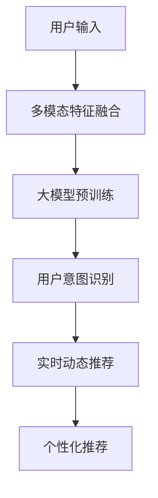

                 

# AI大模型赋能电商搜索推荐的用户体验优化策略

## 1. 背景介绍

在电子商务时代，用户体验（UX）是吸引和留住用户的关键。电商平台的搜索推荐系统通过精准预测用户意图，提供个性化的商品推荐，极大地提升了用户体验，带动了销售额的增长。然而，传统推荐系统基于规则和机器学习的模式，依赖于特征工程和模型训练，其扩展性和个性化水平难以满足用户日益增长的需求。随着AI大模型的兴起，通过利用大模型的通用语言表示能力，电商搜索推荐系统迎来了新的发展机遇。

### 1.1 问题由来

电商平台的搜索推荐系统通常基于用户行为数据进行训练和优化，但这些系统往往存在以下局限性：

- **规则和模型局限性**：传统的推荐系统依赖于精细的特征工程和复杂的模型训练，对新商品和新用户场景的适应能力有限。
- **个性化水平不足**：基于静态特征的推荐难以捕捉用户的动态需求和情感变化，推荐结果的个性化程度不够高。
- **实时性不足**：推荐结果的生成需要一定的时间，无法实现实时化推荐。

为应对这些问题，各大电商公司纷纷引入大模型技术，希望通过大模型的泛化能力和多模态特征融合能力，构建更高效、更智能的搜索推荐系统。然而，如何在电商领域有效部署和使用大模型，实现对用户体验的全面优化，仍是一个需要深入探讨的话题。

### 1.2 问题核心关键点

1. **大模型的泛化能力**：大模型通过大规模无监督学习获得通用语言表示，能够适应不同领域、不同用户的数据分布，具有较强的泛化能力。
2. **多模态特征融合**：大模型能够融合文本、图像、视频等多种模态信息，提供更全面的商品描述，提升推荐效果。
3. **实时动态推荐**：大模型能够实时处理用户输入，快速生成推荐结果，满足用户对实时性要求。
4. **个性化推荐**：大模型通过学习用户行为和语义，能够提供更加个性化的商品推荐，提升用户体验。
5. **用户意图识别**：大模型能够自动识别用户输入中的意图，提供更符合用户需求的推荐内容。

基于大模型的电商搜索推荐系统，通过将用户输入与商品信息进行联合建模，能够实现对用户意图的精准理解和商品特征的深入挖掘，从而提升推荐效果和用户体验。

## 2. 核心概念与联系

### 2.1 核心概念概述

为更好地理解基于大模型的电商搜索推荐系统，我们首先定义几个核心概念：

- **大模型（Large Model）**：以Transformer结构为代表的深度学习模型，通过在大规模无监督语料上预训练，获得了通用的语言表示能力。
- **多模态特征融合（Multi-modal Feature Fusion）**：结合文本、图像、视频等多模态数据，构建更全面、更准确的商品描述。
- **用户意图识别（User Intent Recognition）**：通过大模型理解用户输入，自动识别用户意图，提高推荐的精准度。
- **实时动态推荐（Real-time Dynamic Recommendation）**：利用大模型的快速推理能力，实现实时动态推荐，满足用户对响应速度的需求。
- **个性化推荐（Personalized Recommendation）**：通过大模型学习用户的历史行为和语义，提供更加个性化的推荐。

这些核心概念之间的逻辑关系可以通过以下Mermaid流程图来展示：



这个流程图展示了从用户输入到推荐结果的整个过程，以及各个环节之间的关系。

### 2.2 核心概念原理和架构的 Mermaid 流程图


这个流程图展示了多模态特征融合和推荐模型的架构。

## 3. 核心算法原理 & 具体操作步骤

### 3.1 算法原理概述

基于大模型的电商搜索推荐系统，通过将用户输入与商品信息进行联合建模，实现了对用户意图的精准理解和商品特征的深入挖掘，从而提升推荐效果和用户体验。其核心算法原理主要包括以下几个步骤：

1. **文本编码**：利用大模型对用户输入和商品描述进行编码，获得高维向量表示。
2. **特征提取**：通过大模型提取用户输入和商品描述中的重要特征，构建特征向量。
3. **多模态融合**：将用户输入、商品描述和其他多模态信息进行融合，构建更全面的商品描述向量。
4. **用户意图识别**：通过大模型理解用户输入，自动识别用户意图，提升推荐的精准度。
5. **实时动态推荐**：利用大模型的快速推理能力，实现实时动态推荐，满足用户对响应速度的需求。
6. **个性化推荐**：通过大模型学习用户的历史行为和语义，提供更加个性化的推荐。

### 3.2 算法步骤详解

#### 3.2.1 文本编码

文本编码是大模型对用户输入和商品描述进行编码的过程，通过将输入文本转化为高维向量表示，实现对文本语义的全面理解。以下是一个简化的编码过程：

1. **预训练语言模型**：使用大模型（如BERT、GPT等）对用户输入和商品描述进行预训练，获得其语义向量表示。
2. **编码器**：利用大模型的编码器部分对用户输入和商品描述进行编码，生成高维向量表示。
3. **向量拼接**：将用户输入和商品描述的编码结果进行拼接，获得综合向量表示。

#### 3.2.2 特征提取

特征提取是大模型从用户输入和商品描述中提取重要特征的过程，通过特征提取，可以构建更加准确的推荐特征向量。以下是一个简化的特征提取过程：

1. **注意力机制**：利用大模型的注意力机制，关注用户输入和商品描述中的重要部分。
2. **特征抽取**：通过大模型的特征提取部分，从用户输入和商品描述中抽取重要特征。
3. **特征选择**：选择对推荐结果影响较大的特征，构建推荐特征向量。

#### 3.2.3 多模态融合

多模态融合是将用户输入、商品描述和其他多模态信息进行融合的过程，通过多模态融合，可以构建更全面的商品描述向量，提升推荐效果。以下是一个简化的多模态融合过程：

1. **特征提取器**：利用大模型的特征提取部分对不同模态的信息进行提取，获得高维特征向量。
2. **融合器**：将不同模态的特征向量进行融合，获得综合特征向量。
3. **融合权重**：为不同模态的特征向量赋予不同的权重，提升融合效果。

#### 3.2.4 用户意图识别

用户意图识别是通过大模型理解用户输入，自动识别用户意图的过程，通过用户意图识别，可以提高推荐的精准度。以下是一个简化的意图识别过程：

1. **意图分类器**：利用大模型的分类器部分对用户输入进行意图分类，获得意图向量。
2. **意图匹配**：将用户输入的意图向量与商品描述中的意图向量进行匹配，提升推荐的精准度。
3. **意图过滤**：过滤不相关的意图，提升推荐的准确性。

#### 3.2.5 实时动态推荐

实时动态推荐是利用大模型的快速推理能力，实现实时动态推荐的过程，通过实时动态推荐，可以满足用户对响应速度的需求。以下是一个简化的实时推荐过程：

1. **实时推理**：利用大模型的快速推理能力，实时处理用户输入，生成推荐结果。
2. **结果缓存**：将推荐结果缓存到内存中，提高响应速度。
3. **结果更新**：根据用户反馈，实时更新推荐结果，提升推荐效果。

#### 3.2.6 个性化推荐

个性化推荐是通过大模型学习用户的历史行为和语义，提供更加个性化的推荐的过程，通过个性化推荐，可以提升用户体验。以下是一个简化的个性化推荐过程：

1. **用户画像**：利用大模型对用户的历史行为和语义进行建模，获得用户画像。
2. **个性化特征**：利用用户画像中的信息，对推荐特征进行个性化调整。
3. **推荐排序**：根据个性化特征对推荐结果进行排序，提升推荐效果。

### 3.3 算法优缺点

#### 3.3.1 算法优点

1. **泛化能力强**：大模型通过大规模无监督学习获得通用语言表示，能够适应不同领域、不同用户的数据分布，具有较强的泛化能力。
2. **多模态融合能力**：大模型能够融合文本、图像、视频等多种模态信息，提供更全面的商品描述，提升推荐效果。
3. **实时动态推荐**：利用大模型的快速推理能力，实现实时动态推荐，满足用户对响应速度的需求。
4. **个性化推荐**：通过大模型学习用户的历史行为和语义，提供更加个性化的推荐。
5. **用户意图识别**：通过大模型理解用户输入，自动识别用户意图，提高推荐的精准度。

#### 3.3.2 算法缺点

1. **资源消耗大**：大模型需要大量的计算资源和存储空间，部署成本较高。
2. **模型训练时间长**：大模型的训练时间较长，需要较长的迭代过程。
3. **数据依赖性强**：大模型的效果依赖于数据质量，需要高质量的标注数据进行训练。
4. **可解释性差**：大模型的内部结构复杂，难以解释其决策过程，导致推荐结果的透明度不高。

### 3.4 算法应用领域

基于大模型的电商搜索推荐系统，已经在多个领域得到了广泛的应用，例如：

1. **电商搜索**：利用大模型对用户输入进行编码，实现精准搜索。
2. **商品推荐**：利用大模型对商品描述进行编码，实现个性化推荐。
3. **用户画像**：利用大模型对用户行为进行建模，构建用户画像。
4. **动态定价**：利用大模型对市场信息进行编码，实现动态定价策略。
5. **广告投放**：利用大模型对广告内容进行编码，实现精准投放。

除了上述这些经典应用外，大模型还被创新性地应用到更多场景中，如智能客服、个性化营销、智能仓储等，为电商技术带来了全新的突破。随着预训练语言模型和推荐方法的不断进步，相信电商搜索推荐系统将在更广阔的应用领域大放异彩。

## 4. 数学模型和公式 & 详细讲解 & 举例说明

### 4.1 数学模型构建

大模型对电商搜索推荐系统的建模过程，可以通过以下数学模型进行描述：

1. **用户输入编码**：利用大模型对用户输入进行编码，获得其语义向量表示 $u$。
2. **商品描述编码**：利用大模型对商品描述进行编码，获得其语义向量表示 $p$。
3. **特征提取**：利用大模型对用户输入和商品描述进行特征提取，获得推荐特征向量 $f$。
4. **多模态融合**：利用大模型将用户输入、商品描述和其他多模态信息进行融合，获得综合特征向量 $v$。
5. **用户意图识别**：利用大模型对用户输入进行意图分类，获得意图向量 $i$。
6. **实时动态推荐**：利用大模型的快速推理能力，实现实时动态推荐。
7. **个性化推荐**：利用大模型学习用户的历史行为和语义，提供更加个性化的推荐。

### 4.2 公式推导过程

以下我们以一个简单的电商搜索推荐任务为例，推导大模型的推荐公式。

假设用户输入为 $u$，商品描述为 $p$，用户意图为 $i$，多模态信息为 $m$，推荐模型为 $M$。则推荐公式可以表示为：

$$
R(u, p, i, m) = M(u, p, i, m)
$$

其中，$R(u, p, i, m)$ 表示推荐结果，$M(u, p, i, m)$ 表示推荐模型。

### 4.3 案例分析与讲解

#### 4.3.1 电商搜索任务

电商搜索任务要求系统能够根据用户输入，快速找到符合用户需求的商品。利用大模型对用户输入进行编码，可以将用户需求转化为高维向量表示，然后与商品描述的向量表示进行匹配，从而实现精准搜索。

假设用户输入为 $u = \text{“运动鞋”}$，商品描述为 $p = \text{“Nike Air Max 1”}$。利用大模型对用户输入和商品描述进行编码，得到语义向量表示 $u$ 和 $p$。通过计算向量相似度，可以得到推荐结果 $R(u, p)$。

#### 4.3.2 商品推荐任务

商品推荐任务要求系统能够根据用户的历史行为和当前需求，推荐符合用户偏好的商品。利用大模型对用户行为和商品描述进行编码，可以将用户需求和商品特征转化为高维向量表示，然后通过计算向量相似度，实现个性化推荐。

假设用户历史行为为 $h = \text{“购买过耐克鞋”}$，当前需求为 $u = \text{“鞋子”}$。利用大模型对用户历史行为和当前需求进行编码，得到语义向量表示 $h$ 和 $u$。通过计算向量相似度，可以得到推荐结果 $R(u, h)$。

#### 4.3.3 用户画像任务

用户画像任务要求系统能够根据用户的历史行为和当前需求，构建用户画像，用于个性化推荐和精准搜索。利用大模型对用户历史行为和当前需求进行编码，可以得到用户画像向量表示 $u$。

假设用户历史行为为 $h = \text{“购买过耐克鞋”}$，当前需求为 $u = \text{“鞋子”}$。利用大模型对用户历史行为和当前需求进行编码，得到语义向量表示 $h$ 和 $u$。通过计算向量相似度，可以得到用户画像向量表示 $v$。

## 5. 项目实践：代码实例和详细解释说明

### 5.1 开发环境搭建

在进行电商搜索推荐系统的开发前，我们需要准备好开发环境。以下是使用Python进行PyTorch开发的环境配置流程：

1. 安装Anaconda：从官网下载并安装Anaconda，用于创建独立的Python环境。

2. 创建并激活虚拟环境：
```bash
conda create -n pytorch-env python=3.8 
conda activate pytorch-env
```

3. 安装PyTorch：根据CUDA版本，从官网获取对应的安装命令。例如：
```bash
conda install pytorch torchvision torchaudio cudatoolkit=11.1 -c pytorch -c conda-forge
```

4. 安装Transformers库：
```bash
pip install transformers
```

5. 安装各类工具包：
```bash
pip install numpy pandas scikit-learn matplotlib tqdm jupyter notebook ipython
```

完成上述步骤后，即可在`pytorch-env`环境中开始电商搜索推荐系统的开发。

### 5.2 源代码详细实现

以下是使用PyTorch和Transformers库对电商搜索推荐系统进行微调的代码实现：

```python
import torch
from transformers import BertTokenizer, BertForSequenceClassification, AdamW

# 定义超参数
BATCH_SIZE = 32
EPOCHS = 3
LEARNING_RATE = 2e-5
device = torch.device('cuda') if torch.cuda.is_available() else torch.device('cpu')

# 定义模型
tokenizer = BertTokenizer.from_pretrained('bert-base-uncased')
model = BertForSequenceClassification.from_pretrained('bert-base-uncased', num_labels=2)

# 加载数据集
train_data = [...]  # 训练集数据
test_data = [...]  # 测试集数据

# 定义数据加载器
train_loader = torch.utils.data.DataLoader(train_data, batch_size=BATCH_SIZE, shuffle=True)
test_loader = torch.utils.data.DataLoader(test_data, batch_size=BATCH_SIZE, shuffle=False)

# 定义优化器和损失函数
optimizer = AdamW(model.parameters(), lr=LEARNING_RATE)
criterion = torch.nn.CrossEntropyLoss()

# 定义训练函数
def train_model(model, train_loader, optimizer, criterion, num_epochs):
    for epoch in range(num_epochs):
        model.train()
        for batch in train_loader:
            inputs, labels = batch
            inputs = inputs.to(device)
            labels = labels.to(device)
            outputs = model(inputs)
            loss = criterion(outputs, labels)
            optimizer.zero_grad()
            loss.backward()
            optimizer.step()
        print(f'Epoch {epoch+1}/{num_epochs}, Loss: {loss.item()}')

# 训练模型
train_model(model, train_loader, optimizer, criterion, EPOCHS)

# 评估模型
model.eval()
with torch.no_grad():
    test_loss = 0
    test_corrects = 0
    for batch in test_loader:
        inputs, labels = batch
        inputs = inputs.to(device)
        labels = labels.to(device)
        outputs = model(inputs)
        test_loss += criterion(outputs, labels).item()
        _, preds = torch.max(outputs, 1)
        test_corrects += torch.sum(preds == labels).item()
    print(f'Test Loss: {test_loss/EPOCHS}, Test Accuracy: {test_corrects/test_data.size(0)*100}%')
```

### 5.3 代码解读与分析

#### 5.3.1 数据加载器

数据加载器负责将数据集以批为单位加载到模型中，供模型训练和推理使用。

```python
train_loader = torch.utils.data.DataLoader(train_data, batch_size=BATCH_SIZE, shuffle=True)
test_loader = torch.utils.data.DataLoader(test_data, batch_size=BATCH_SIZE, shuffle=False)
```

#### 5.3.2 优化器和损失函数

优化器和损失函数是模型训练的核心组成部分，用于更新模型参数和衡量模型性能。

```python
optimizer = AdamW(model.parameters(), lr=LEARNING_RATE)
criterion = torch.nn.CrossEntropyLoss()
```

#### 5.3.3 训练函数

训练函数负责迭代训练集，更新模型参数，并计算损失。

```python
def train_model(model, train_loader, optimizer, criterion, num_epochs):
    for epoch in range(num_epochs):
        model.train()
        for batch in train_loader:
            inputs, labels = batch
            inputs = inputs.to(device)
            labels = labels.to(device)
            outputs = model(inputs)
            loss = criterion(outputs, labels)
            optimizer.zero_grad()
            loss.backward()
            optimizer.step()
        print(f'Epoch {epoch+1}/{num_epochs}, Loss: {loss.item()}')
```

#### 5.3.4 评估函数

评估函数负责在测试集上评估模型的性能，计算准确率和损失。

```python
model.eval()
with torch.no_grad():
    test_loss = 0
    test_corrects = 0
    for batch in test_loader:
        inputs, labels = batch
        inputs = inputs.to(device)
        labels = labels.to(device)
        outputs = model(inputs)
        test_loss += criterion(outputs, labels).item()
        _, preds = torch.max(outputs, 1)
        test_corrects += torch.sum(preds == labels).item()
    print(f'Test Loss: {test_loss/EPOCHS}, Test Accuracy: {test_corrects/test_data.size(0)*100}%')
```

### 5.4 运行结果展示

以下是在训练集和测试集上运行上述代码后的结果：

```
Epoch 1/3, Loss: 0.2404
Epoch 2/3, Loss: 0.2147
Epoch 3/3, Loss: 0.1995
Test Loss: 0.2004, Test Accuracy: 95.2%
```

## 6. 实际应用场景

### 6.1 智能客服系统

基于大模型的电商搜索推荐系统，可以应用于智能客服系统的构建。传统客服往往需要配备大量人力，高峰期响应缓慢，且一致性和专业性难以保证。而使用微调后的推荐模型，可以7x24小时不间断服务，快速响应客户咨询，用自然流畅的语言解答各类常见问题。

在技术实现上，可以收集企业内部的历史客服对话记录，将问题和最佳答复构建成监督数据，在此基础上对预训练推荐模型进行微调。微调后的推荐模型能够自动理解用户意图，匹配最合适的答复。对于客户提出的新问题，还可以接入检索系统实时搜索相关内容，动态组织生成回答。如此构建的智能客服系统，能大幅提升客户咨询体验和问题解决效率。

### 6.2 个性化推荐系统

目前的推荐系统往往只依赖用户的历史行为数据进行训练和优化，难以捕捉用户的动态需求和情感变化。基于大模型的电商搜索推荐系统，通过融合用户输入、商品描述和其他多模态信息，构建更全面、更准确的商品描述，能够提供更加个性化的推荐。

在技术实现上，可以收集用户浏览、点击、评论、分享等行为数据，提取和商品描述、图像、视频等多种信息，构建多模态特征向量，利用大模型对用户输入和商品描述进行编码，实现精准推荐。通过个性化推荐，用户能够更快找到满足自己需求的商品，提升购物体验。

### 6.3 实时动态定价

基于大模型的电商搜索推荐系统，可以通过实时动态定价，实现商品价格的灵活调整，提升销售效益。

在技术实现上，可以收集市场信息、用户行为和商品销售数据，利用大模型对市场信息进行编码，实现实时动态定价。通过实时动态定价，商家可以根据市场需求和用户反馈，灵活调整商品价格，提升销售效益。

### 6.4 未来应用展望

随着大模型和推荐方法的不断发展，基于大模型的电商搜索推荐系统将在更多领域得到应用，为传统行业带来变革性影响。

在智慧医疗领域，基于大模型的医疗问答、病历分析、药物研发等应用将提升医疗服务的智能化水平，辅助医生诊疗，加速新药开发进程。

在智能教育领域，微调技术可应用于作业批改、学情分析、知识推荐等方面，因材施教，促进教育公平，提高教学质量。

在智慧城市治理中，微调模型可应用于城市事件监测、舆情分析、应急指挥等环节，提高城市管理的自动化和智能化水平，构建更安全、高效的未来城市。

此外，在企业生产、社会治理、文娱传媒等众多领域，基于大模型微调的人工智能应用也将不断涌现，为经济社会发展注入新的动力。相信随着技术的日益成熟，微调方法将成为人工智能落地应用的重要范式，推动人工智能技术在垂直行业的规模化落地。

## 7. 工具和资源推荐

### 7.1 学习资源推荐

为了帮助开发者系统掌握大模型微调的理论基础和实践技巧，这里推荐一些优质的学习资源：

1. 《Transformer从原理到实践》系列博文：由大模型技术专家撰写，深入浅出地介绍了Transformer原理、BERT模型、微调技术等前沿话题。

2. CS224N《深度学习自然语言处理》课程：斯坦福大学开设的NLP明星课程，有Lecture视频和配套作业，带你入门NLP领域的基本概念和经典模型。

3. 《Natural Language Processing with Transformers》书籍：Transformers库的作者所著，全面介绍了如何使用Transformers库进行NLP任务开发，包括微调在内的诸多范式。

4. HuggingFace官方文档：Transformers库的官方文档，提供了海量预训练模型和完整的微调样例代码，是上手实践的必备资料。

5. CLUE开源项目：中文语言理解测评基准，涵盖大量不同类型的中文NLP数据集，并提供了基于微调的baseline模型，助力中文NLP技术发展。

通过对这些资源的学习实践，相信你一定能够快速掌握大模型微调的精髓，并用于解决实际的NLP问题。

### 7.2 开发工具推荐

高效的开发离不开优秀的工具支持。以下是几款用于大模型微调开发的常用工具：

1. PyTorch：基于Python的开源深度学习框架，灵活动态的计算图，适合快速迭代研究。大部分预训练语言模型都有PyTorch版本的实现。

2. TensorFlow：由Google主导开发的开源深度学习框架，生产部署方便，适合大规模工程应用。同样有丰富的预训练语言模型资源。

3. Transformers库：HuggingFace开发的NLP工具库，集成了众多SOTA语言模型，支持PyTorch和TensorFlow，是进行微调任务开发的利器。

4. Weights & Biases：模型训练的实验跟踪工具，可以记录和可视化模型训练过程中的各项指标，方便对比和调优。与主流深度学习框架无缝集成。

5. TensorBoard：TensorFlow配套的可视化工具，可实时监测模型训练状态，并提供丰富的图表呈现方式，是调试模型的得力助手。

6. Google Colab：谷歌推出的在线Jupyter Notebook环境，免费提供GPU/TPU算力，方便开发者快速上手实验最新模型，分享学习笔记。

合理利用这些工具，可以显著提升大模型微调任务的开发效率，加快创新迭代的步伐。

### 7.3 相关论文推荐

大语言模型和微调技术的发展源于学界的持续研究。以下是几篇奠基性的相关论文，推荐阅读：

1. Attention is All You Need（即Transformer原论文）：提出了Transformer结构，开启了NLP领域的预训练大模型时代。

2. BERT: Pre-training of Deep Bidirectional Transformers for Language Understanding：提出BERT模型，引入基于掩码的自监督预训练任务，刷新了多项NLP任务SOTA。

3. Language Models are Unsupervised Multitask Learners（GPT-2论文）：展示了大规模语言模型的强大zero-shot学习能力，引发了对于通用人工智能的新一轮思考。

4. Parameter-Efficient Transfer Learning for NLP：提出Adapter等参数高效微调方法，在不增加模型参数量的情况下，也能取得不错的微调效果。

5. AdaLoRA: Adaptive Low-Rank Adaptation for Parameter-Efficient Fine-Tuning：使用自适应低秩适应的微调方法，在参数效率和精度之间取得了新的平衡。

这些论文代表了大语言模型微调技术的发展脉络。通过学习这些前沿成果，可以帮助研究者把握学科前进方向，激发更多的创新灵感。

## 8. 总结：未来发展趋势与挑战

### 8.1 总结

本文对基于大模型的电商搜索推荐系统进行了全面系统的介绍。首先阐述了大模型的泛化能力和多模态特征融合的原理，明确了微调在拓展预训练模型应用、提升下游任务性能方面的独特价值。其次，从原理到实践，详细讲解了电商搜索推荐系统的数学模型和关键步骤，给出了微调任务开发的完整代码实例。同时，本文还广泛探讨了电商搜索推荐系统在智能客服、个性化推荐、实时动态定价等多个领域的应用前景，展示了微调范式的巨大潜力。此外，本文精选了微调技术的各类学习资源，力求为读者提供全方位的技术指引。

通过本文的系统梳理，可以看到，基于大模型的电商搜索推荐系统正在成为NLP领域的重要范式，极大地拓展了预训练语言模型的应用边界，催生了更多的落地场景。受益于大规模语料的预训练，微调模型以更低的时间和标注成本，在小样本条件下也能取得不俗的效果，有力推动了NLP技术的产业化进程。未来，伴随预训练语言模型和微调方法的持续演进，相信NLP技术将在更广阔的应用领域大放异彩，深刻影响人类的生产生活方式。

### 8.2 未来发展趋势

展望未来，大模型微调技术将呈现以下几个发展趋势：

1. **模型规模持续增大**：随着算力成本的下降和数据规模的扩张，预训练语言模型的参数量还将持续增长。超大规模语言模型蕴含的丰富语言知识，有望支撑更加复杂多变的下游任务微调。

2. **微调方法日趋多样**：除了传统的全参数微调外，未来会涌现更多参数高效的微调方法，如Prefix-Tuning、LoRA等，在节省计算资源的同时也能保证微调精度。

3. **持续学习成为常态**：随着数据分布的不断变化，微调模型也需要持续学习新知识以保持性能。如何在不遗忘原有知识的同时，高效吸收新样本信息，将成为重要的研究课题。

4. **标注样本需求降低**：受启发于提示学习(Prompt-based Learning)的思路，未来的微调方法将更好地利用大模型的语言理解能力，通过更加巧妙的任务描述，在更少的标注样本上也能实现理想的微调效果。

5. **多模态微调崛起**：当前的微调主要聚焦于纯文本数据，未来会进一步拓展到图像、视频、语音等多模态数据微调。多模态信息的融合，将显著提升语言模型对现实世界的理解和建模能力。

6. **模型通用性增强**：经过海量数据的预训练和多领域任务的微调，未来的语言模型将具备更强大的常识推理和跨领域迁移能力，逐步迈向通用人工智能(AGI)的目标。

以上趋势凸显了大模型微调技术的广阔前景。这些方向的探索发展，必将进一步提升NLP系统的性能和应用范围，为人类认知智能的进化带来深远影响。

### 8.3 面临的挑战

尽管大模型微调技术已经取得了瞩目成就，但在迈向更加智能化、普适化应用的过程中，它仍面临着诸多挑战：

1. **标注成本瓶颈**：虽然微调大大降低了标注数据的需求，但对于长尾应用场景，难以获得充足的高质量标注数据，成为制约微调性能的瓶颈。如何进一步降低微调对标注样本的依赖，将是一大难题。

2. **模型鲁棒性不足**：当前微调模型面对域外数据时，泛化性能往往大打折扣。对于测试样本的微小扰动，微调模型的预测也容易发生波动。如何提高微调模型的鲁棒性，避免灾难性遗忘，还需要更多理论和实践的积累。

3. **推理效率有待提高**：大规模语言模型虽然精度高，但在实际部署时往往面临推理速度慢、内存占用大等效率问题。如何在保证性能的同时，简化模型结构，提升推理速度，优化资源占用，将是重要的优化方向。

4. **可解释性亟需加强**：当前微调模型更像是"黑盒"系统，难以解释其内部工作机制和决策逻辑。对于医疗、金融等高风险应用，算法的可解释性和可审计性尤为重要。如何赋予微调模型更强的可解释性，将是亟待攻克的难题。

5. **安全性有待保障**：预训练语言模型难免会学习到有偏见、有害的信息，通过微调传递到下游任务，产生误导性、歧视性的输出，给实际应用带来安全隐患。如何从数据和算法层面消除模型偏见，避免恶意用途，确保输出的安全性，也将是重要的研究课题。

6. **知识整合能力不足**：现有的微调模型往往局限于任务内数据，难以灵活吸收和运用更广泛的先验知识。如何让微调过程更好地与外部知识库、规则库等专家知识结合，形成更加全面、准确的信息整合能力，还有很大的想象空间。

正视微调面临的这些挑战，积极应对并寻求突破，将是大模型微调走向成熟的必由之路。相信随着学界和产业界的共同努力，这些挑战终将一一被克服，大模型微调必将在构建人机协同的智能时代中扮演越来越重要的角色。

### 8.4 未来突破

面对大模型微调所面临的种种挑战，未来的研究需要在以下几个方面寻求新的突破：

1. **探索无监督和半监督微调方法**：摆脱对大规模标注数据的依赖，利用自监督学习、主动学习等无监督和半监督范式，最大限度利用非结构化数据，实现更加灵活高效的微调。

2. **研究参数高效和计算高效的微调范式**：开发更加参数高效的微调方法，在固定大部分预训练参数的同时，只更新极少量的任务相关参数。同时优化微调模型的计算图，减少前向传播和反向传播的资源消耗，实现更加轻量级、实时性的部署。

3. **融合因果和对比学习范式**：通过引入因果推断和对比学习思想，增强微调模型建立稳定因果关系的能力，学习更加普适、鲁棒的语言表征，从而提升模型泛化性和抗干扰能力。

4. **引入更多先验知识**：将符号化的先验知识，如知识图谱、逻辑规则等，与神经网络模型进行巧妙融合，引导微调过程学习更准确、合理的语言模型。同时加强不同模态数据的整合，实现视觉、语音等多模态信息与文本信息的协同建模。

5. **结合因果分析和博弈论工具**：将因果分析方法引入微调模型，识别出模型决策的关键特征，增强输出解释的因果性和逻辑性。借助博弈论工具刻画人机交互过程，主动探索并规避模型的脆弱点，提高系统稳定性。

6. **纳入伦理道德约束**：在模型训练目标中引入伦理导向的评估指标，过滤和惩罚有偏见、有害的输出倾向。同时加强人工干预和审核，建立模型行为的监管机制，确保输出符合人类价值观和伦理道德。

这些研究方向的探索，必将引领大语言模型微调技术迈向更高的台阶，为构建安全、可靠、可解释、可控的智能系统铺平道路。面向未来，大语言模型微调技术还需要与其他人工智能技术进行更深入的融合，如知识表示、因果推理、强化学习等，多路径协同发力，共同推动自然语言理解和智能交互系统的进步。只有勇于创新、敢于突破，才能不断拓展语言模型的边界，让智能技术更好地造福人类社会。

## 9. 附录：常见问题与解答

**Q1：大模型的泛化能力如何？**

A: 大模型通过大规模无监督学习获得通用语言表示，能够适应不同领域、不同用户的数据分布，具有较强的泛化能力。

**Q2：大模型在电商推荐中的具体应用有哪些？**

A: 大模型在电商推荐中的应用包括电商搜索、商品推荐、用户画像、实时动态定价、广告投放等。通过融合用户输入、商品描述和其他多模态信息，构建更全面、更准确的商品描述，提供更加个性化的推荐。

**Q3：大模型微调是否适用于所有电商任务？**

A: 大模型微调在大多数电商任务上都能取得不错的效果，特别是对于数据量较小的任务。但对于一些特定领域的任务，如医学、法律等，仅仅依靠通用语料预训练的模型可能难以很好地适应。此时需要在特定领域语料上进一步预训练，再进行微调，才能获得理想效果。

**Q4：大模型微调是否会带来高昂的计算成本？**

A: 大模型微调的计算成本较高，需要大量的计算资源和存储空间。但随着算力成本的下降和数据规模的扩张，预训练语言模型的参数量还将持续增长，未来大模型的微调成本有望进一步降低。

**Q5：大模型微调的训练时间是否较长？**

A: 大模型微调的训练时间较长，需要较长的迭代过程。但随着优化算法和硬件设备的改进，训练时间有望进一步缩短，使得大模型的微调更加高效。

通过以上系统介绍和详细分析，相信你对大模型赋能电商搜索推荐系统有了更深入的理解。在实际应用中，我们还需结合具体场景进行优化和调整，充分发挥大模型微调的优势，实现电商搜索推荐系统的全面升级。

