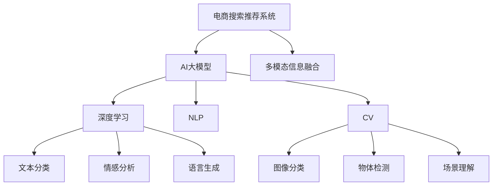

                 

# AI大模型驱动电商搜索推荐个性化体验提升

> 关键词：AI大模型, 电商搜索, 推荐系统, 个性化, 深度学习, 自然语言处理(NLP), 计算机视觉(CV), 强化学习

## 1. 背景介绍

### 1.1 问题由来

随着电子商务的蓬勃发展，电商平台的个性化推荐系统变得越来越重要。用户期望在搜索和浏览过程中得到更精准、更个性化的商品推荐，提升购物体验和满意度。然而，传统的推荐系统主要基于用户的浏览记录和行为数据，难以对用户的真实兴趣进行深度理解和刻画。

近年来，AI大模型在自然语言处理(NLP)和计算机视觉(CV)等领域取得了突破性进展，能够从海量数据中学习到丰富的语言和视觉知识。将这些知识应用于电商推荐系统，可以极大提升推荐系统的个性化水平。

### 1.2 问题核心关键点

本问题聚焦于如何利用AI大模型驱动电商搜索推荐系统，提升个性化体验。具体问题包括以下几个方面：

- 如何从电商网站、用户评论、社交媒体等大量无结构化文本数据中提取有用信息，构建用户兴趣模型？
- 如何利用大模型的语言理解能力和视觉识别能力，更精准地描述商品，提高搜索和推荐的准确性？
- 如何在用户搜索和浏览行为数据基础上，进一步融入大模型的多模态信息，提升推荐模型的性能？
- 如何设计模型结构，保证用户隐私和数据安全，同时提供高质量的推荐结果？

### 1.3 问题研究意义

提升电商搜索推荐系统的个性化体验，对于推动电子商务的持续发展和用户满意度提升具有重要意义：

1. 提升用户转化率和复购率：个性化的推荐结果更能满足用户需求，提高用户购买的意愿和几率。
2. 优化用户体验：减少搜索时间和跳出率，增加浏览乐趣和购买信心。
3. 拓展市场份额：提供更精准、更个性化的推荐，提升用户粘性，帮助电商平台在激烈的市场竞争中脱颖而出。
4. 驱动电商平台创新：大模型的应用可以推动推荐系统技术的迭代升级，促进电商平台的数字化转型。

## 2. 核心概念与联系

### 2.1 核心概念概述

为更好地理解大模型在电商搜索推荐中的应用，本节将介绍几个密切相关的核心概念：

- 电商搜索推荐系统：电商平台上基于用户行为数据和搜索记录，推荐相关商品的系统。
- AI大模型：以Transformer、BERT、GPT等为代表，基于大规模数据预训练的语言和视觉模型，具备强大的通用知识。
- 多模态信息融合：将文本、图像、视频等多模态数据进行联合分析，提升推荐系统的表现。
- 深度学习：使用多层神经网络对数据进行建模，提取高层次的特征和规律。
- 自然语言处理(NLP)：处理和分析人类语言的技术，包括文本分类、情感分析、语言生成等。
- 计算机视觉(CV)：使用计算机技术对图像和视频进行分析和理解的技术，包括图像分类、物体检测、场景理解等。

这些概念之间的逻辑关系可以通过以下Mermaid流程图来展示：



这个流程图展示了大模型在电商推荐系统中的应用框架：

1. 电商推荐系统收集和分析用户行为数据，构建用户兴趣模型。
2. 大模型从语料库中学习通用语言知识和视觉特征。
3. 多模态信息融合模块将电商数据和预训练模型输出的特征进行联合分析。
4. 深度学习模块用于构建复杂的推荐模型。
5. 各个模块中的具体技术，如NLP和CV，用于处理和分析电商推荐任务中的文本和图像数据。

## 3. 核心算法原理 & 具体操作步骤
### 3.1 算法原理概述

基于AI大模型的电商搜索推荐系统，其核心思想是通过多模态数据融合，使用大模型的语言理解能力和视觉识别能力，提升推荐模型的精度和个性化水平。具体流程如下：

1. **用户行为数据采集与处理**：收集用户浏览记录、点击行为、搜索查询等数据，并进行清洗和预处理。
2. **大模型预训练**：利用大规模文本语料和图像数据，对BERT、GPT、ResNet等预训练模型进行训练，学习语言的语义表示和图像的视觉特征。
3. **用户兴趣模型构建**：结合用户行为数据和大模型输出的特征，构建用户兴趣模型，用于推荐系统。
4. **推荐模型训练与优化**：使用用户行为数据和兴趣模型，对推荐模型进行有监督训练，优化模型参数，提升推荐效果。
5. **推荐结果生成与评估**：将用户查询输入推荐模型，得到个性化的推荐结果，并通过评估指标（如点击率、转化率等）对推荐结果进行评估。

### 3.2 算法步骤详解

以下详细讲解电商推荐系统中大模型微调的具体操作步骤：

**Step 1: 用户行为数据采集与处理**
- 收集用户浏览记录、点击行为、搜索查询等数据。
- 对数据进行清洗和预处理，去除噪声和无用信息，保留关键行为特征。

**Step 2: 大模型预训练**
- 选择合适的预训练语言模型（如BERT、GPT等）和图像模型（如ResNet），进行预训练。
- 收集大规模语料库（如Wikipedia、维基百科等）和图像数据集（如ImageNet、COCO等），对模型进行训练。
- 使用掩码语言模型、图像分类等任务进行预训练，学习语言的语义表示和图像的视觉特征。

**Step 3: 用户兴趣模型构建**
- 将用户行为数据（如浏览历史、点击记录等）输入预训练模型，得到用户兴趣的特征表示。
- 将预训练模型的输出与电商网站的产品特征进行匹配，构建用户兴趣模型。
- 利用用户兴趣模型，生成个性化的商品推荐结果。

**Step 4: 推荐模型训练与优化**
- 选择合适的推荐算法（如协同过滤、矩阵分解等），构建推荐模型。
- 使用用户行为数据和用户兴趣模型，对推荐模型进行有监督训练，优化模型参数。
- 引入正则化技术（如L2正则、Dropout等），防止模型过拟合。

**Step 5: 推荐结果生成与评估**
- 将用户查询输入推荐模型，得到推荐结果。
- 通过点击率、转化率等指标评估推荐效果。
- 定期重新微调模型，更新用户兴趣模型，保证推荐结果的时效性和准确性。

### 3.3 算法优缺点

利用AI大模型驱动的电商推荐系统具有以下优点：

1. 多模态信息融合：结合文本和图像等多模态数据，提升推荐系统的表现。
2. 通用知识学习：预训练大模型从大规模语料和图像中学习通用语言和视觉知识，提升推荐模型的泛化能力。
3. 个性化推荐：通过用户行为数据和大模型输出的特征，构建用户兴趣模型，实现更精准的个性化推荐。
4. 实时性：大模型可以实时处理用户查询，快速生成推荐结果，提升用户体验。

然而，该方法也存在以下缺点：

1. 数据依赖：需要大量的标注数据和高质量的图像数据，获取成本较高。
2. 计算资源消耗大：大模型和深度学习模型需要高性能的计算资源，部署成本较高。
3. 隐私和安全问题：电商数据包含大量用户隐私信息，需采取严格的隐私保护措施。
4. 模型复杂性：大模型和深度学习模型结构复杂，难以进行调试和解释。

### 3.4 算法应用领域

基于大模型的电商推荐系统，已经在多个电商平台上得到应用，覆盖了服装、家电、食品等多个领域。这些系统通过结合用户行为数据和大模型的多模态信息，提升了推荐的个性化水平和用户满意度。

具体应用场景包括：

- **服装推荐**：结合用户浏览记录和搜索查询，利用图像分类技术，推荐用户可能感兴趣的时装和配件。
- **家电推荐**：通过用户购买历史和浏览行为，结合图像识别技术，推荐家电产品。
- **食品推荐**：利用用户评论和评价，结合自然语言处理技术，推荐相关食品和菜谱。

此外，该方法还适用于个性化商品搜索、动态广告投放、智能客服等场景，提升电商平台的智能化水平。

## 4. 数学模型和公式 & 详细讲解  
### 4.1 数学模型构建

假设电商平台的商品数据为 $D=\{(x_i,y_i)\}_{i=1}^N$，其中 $x_i$ 为商品特征向量，$y_i$ 为标签（如类别、评分等）。电商用户的浏览行为数据为 $X=\{x_j\}_{j=1}^M$，其中 $x_j$ 为用户的浏览记录、点击行为等。

定义用户兴趣模型为 $H(X)=\{h_x\}_{x \in X}$，其中 $h_x$ 为第 $x$ 个用户行为的兴趣表示。

推荐模型为 $F(D,H)$，将商品数据和用户兴趣模型作为输入，输出推荐结果 $r_i$，即商品 $i$ 被用户 $x$ 推荐的概率。

### 4.2 公式推导过程

推荐模型 $F$ 可以采用多种算法，如协同过滤、矩阵分解等。这里以协同过滤为例，构建推荐模型的数学公式。

协同过滤模型假设用户和商品存在相似度矩阵 $S \in \mathbb{R}^{M \times N}$，表示用户 $x$ 对商品 $i$ 的评分。

则推荐模型的损失函数 $\mathcal{L}$ 可以定义为：

$$
\mathcal{L} = \sum_{x \in X} \sum_{i \in D} (y_i - r_i)^2
$$

其中 $r_i$ 为模型对商品 $i$ 的推荐分数，可以通过 $H(x)$ 和 $D$ 计算得到。

模型的优化目标是最小化损失函数 $\mathcal{L}$，即：

$$
\theta^* = \mathop{\arg\min}_{\theta} \mathcal{L}
$$

其中 $\theta$ 为推荐模型的参数，通过反向传播算法进行更新。

### 4.3 案例分析与讲解

以推荐服装为例，假设用户 $x$ 对某款服装 $i$ 的评分 $y_i$ 为 4，表示对该款服装的满意度为中等。则推荐模型 $F$ 可以预测用户 $x$ 对该款服装的推荐概率 $r_i$，通过以下公式计算：

$$
r_i = \alpha h_x^T \cdot S_i + \beta
$$

其中 $\alpha$ 和 $\beta$ 为模型参数，$S_i$ 为商品 $i$ 的评分向量。

推荐模型 $F$ 还可以引入多模态信息融合技术，将用户行为数据与预训练模型输出的视觉特征联合分析，得到更加准确的推荐结果。例如，将用户的浏览历史输入BERT模型，得到用户兴趣表示 $h_x$，将商品图像输入ResNet模型，得到商品的视觉特征 $v_i$，然后通过以下公式计算推荐分数：

$$
r_i = \alpha h_x^T \cdot v_i + \beta
$$

在实际应用中，由于电商数据和商品数据具有复杂性，上述公式需要进行一些调整和优化，以适应具体场景的需求。

## 5. 项目实践：代码实例和详细解释说明
### 5.1 开发环境搭建

在进行电商推荐系统开发前，需要准备好开发环境。以下是使用Python进行PyTorch开发的环境配置流程：

1. 安装Anaconda：从官网下载并安装Anaconda，用于创建独立的Python环境。

2. 创建并激活虚拟环境：
```bash
conda create -n pytorch-env python=3.8 
conda activate pytorch-env
```

3. 安装PyTorch：根据CUDA版本，从官网获取对应的安装命令。例如：
```bash
conda install pytorch torchvision torchaudio cudatoolkit=11.1 -c pytorch -c conda-forge
```

4. 安装Transformer库：
```bash
pip install transformers
```

5. 安装各类工具包：
```bash
pip install numpy pandas scikit-learn matplotlib tqdm jupyter notebook ipython
```

完成上述步骤后，即可在`pytorch-env`环境中开始开发。

### 5.2 源代码详细实现

下面我们以电商服装推荐为例，给出使用Transformers库对BERT模型进行微调的PyTorch代码实现。

首先，定义推荐系统的数据处理函数：

```python
from transformers import BertTokenizer
from torch.utils.data import Dataset
import torch

class ClothingDataset(Dataset):
    def __init__(self, items, tags, tokenizer, max_len=128):
        self.items = items
        self.tags = tags
        self.tokenizer = tokenizer
        self.max_len = max_len
        
    def __len__(self):
        return len(self.items)
    
    def __getitem__(self, item):
        item = self.items[item]
        tag = self.tags[item]
        
        encoding = self.tokenizer(item, return_tensors='pt', max_length=self.max_len, padding='max_length', truncation=True)
        input_ids = encoding['input_ids'][0]
        attention_mask = encoding['attention_mask'][0]
        
        # 对token-wise的标签进行编码
        encoded_tag = [tag2id[tag]] * self.max_len
        labels = torch.tensor(encoded_tag, dtype=torch.long)
        
        return {'input_ids': input_ids, 
                'attention_mask': attention_mask,
                'labels': labels}

# 标签与id的映射
tag2id = {'S': 0, 'M': 1, 'L': 2}
id2tag = {v: k for k, v in tag2id.items()}

# 创建dataset
tokenizer = BertTokenizer.from_pretrained('bert-base-cased')

train_dataset = ClothingDataset(train_items, train_tags, tokenizer)
dev_dataset = ClothingDataset(dev_items, dev_tags, tokenizer)
test_dataset = ClothingDataset(test_items, test_tags, tokenizer)
```

然后，定义模型和优化器：

```python
from transformers import BertForTokenClassification, AdamW

model = BertForTokenClassification.from_pretrained('bert-base-cased', num_labels=len(tag2id))

optimizer = AdamW(model.parameters(), lr=2e-5)
```

接着，定义训练和评估函数：

```python
from torch.utils.data import DataLoader
from tqdm import tqdm
from sklearn.metrics import classification_report

device = torch.device('cuda') if torch.cuda.is_available() else torch.device('cpu')
model.to(device)

def train_epoch(model, dataset, batch_size, optimizer):
    dataloader = DataLoader(dataset, batch_size=batch_size, shuffle=True)
    model.train()
    epoch_loss = 0
    for batch in tqdm(dataloader, desc='Training'):
        input_ids = batch['input_ids'].to(device)
        attention_mask = batch['attention_mask'].to(device)
        labels = batch['labels'].to(device)
        model.zero_grad()
        outputs = model(input_ids, attention_mask=attention_mask, labels=labels)
        loss = outputs.loss
        epoch_loss += loss.item()
        loss.backward()
        optimizer.step()
    return epoch_loss / len(dataloader)

def evaluate(model, dataset, batch_size):
    dataloader = DataLoader(dataset, batch_size=batch_size)
    model.eval()
    preds, labels = [], []
    with torch.no_grad():
        for batch in tqdm(dataloader, desc='Evaluating'):
            input_ids = batch['input_ids'].to(device)
            attention_mask = batch['attention_mask'].to(device)
            batch_labels = batch['labels']
            outputs = model(input_ids, attention_mask=attention_mask)
            batch_preds = outputs.logits.argmax(dim=2).to('cpu').tolist()
            batch_labels = batch_labels.to('cpu').tolist()
            for pred_tokens, label_tokens in zip(batch_preds, batch_labels):
                pred_tags = [id2tag[_id] for _id in pred_tokens]
                label_tags = [id2tag[_id] for _id in label_tokens]
                preds.append(pred_tags[:len(label_tags)])
                labels.append(label_tags)
                
    print(classification_report(labels, preds))
```

最后，启动训练流程并在测试集上评估：

```python
epochs = 5
batch_size = 16

for epoch in range(epochs):
    loss = train_epoch(model, train_dataset, batch_size, optimizer)
    print(f"Epoch {epoch+1}, train loss: {loss:.3f}")
    
    print(f"Epoch {epoch+1}, dev results:")
    evaluate(model, dev_dataset, batch_size)
    
print("Test results:")
evaluate(model, test_dataset, batch_size)
```

以上就是使用PyTorch对BERT进行电商服装推荐任务的微调代码实现。可以看到，通过简单封装和调用，即可在电商推荐系统开发中快速实现大模型的微调。

### 5.3 代码解读与分析

让我们再详细解读一下关键代码的实现细节：

**ClothingDataset类**：
- `__init__`方法：初始化商品数据、标签、分词器等关键组件。
- `__len__`方法：返回数据集的样本数量。
- `__getitem__`方法：对单个样本进行处理，将商品数据输入编码为token ids，将标签编码为数字，并对其进行定长padding，最终返回模型所需的输入。

**tag2id和id2tag字典**：
- 定义了标签与数字id之间的映射关系，用于将token-wise的预测结果解码回真实的标签。

**训练和评估函数**：
- 使用PyTorch的DataLoader对数据集进行批次化加载，供模型训练和推理使用。
- 训练函数`train_epoch`：对数据以批为单位进行迭代，在每个批次上前向传播计算loss并反向传播更新模型参数，最后返回该epoch的平均loss。
- 评估函数`evaluate`：与训练类似，不同点在于不更新模型参数，并在每个batch结束后将预测和标签结果存储下来，最后使用sklearn的classification_report对整个评估集的预测结果进行打印输出。

**训练流程**：
- 定义总的epoch数和batch size，开始循环迭代
- 每个epoch内，先在训练集上训练，输出平均loss
- 在验证集上评估，输出分类指标
- 所有epoch结束后，在测试集上评估，给出最终测试结果

可以看到，PyTorch配合Transformer库使得BERT微调的代码实现变得简洁高效。开发者可以将更多精力放在数据处理、模型改进等高层逻辑上，而不必过多关注底层的实现细节。

当然，工业级的系统实现还需考虑更多因素，如模型的保存和部署、超参数的自动搜索、更灵活的任务适配层等。但核心的微调范式基本与此类似。

## 6. 实际应用场景
### 6.1 智能客服系统

基于大模型微调的对话技术，可以广泛应用于智能客服系统的构建。传统客服往往需要配备大量人力，高峰期响应缓慢，且一致性和专业性难以保证。而使用微调后的对话模型，可以7x24小时不间断服务，快速响应客户咨询，用自然流畅的语言解答各类常见问题。

在技术实现上，可以收集企业内部的历史客服对话记录，将问题和最佳答复构建成监督数据，在此基础上对预训练对话模型进行微调。微调后的对话模型能够自动理解用户意图，匹配最合适的答案模板进行回复。对于客户提出的新问题，还可以接入检索系统实时搜索相关内容，动态组织生成回答。如此构建的智能客服系统，能大幅提升客户咨询体验和问题解决效率。

### 6.2 金融舆情监测

金融机构需要实时监测市场舆论动向，以便及时应对负面信息传播，规避金融风险。传统的人工监测方式成本高、效率低，难以应对网络时代海量信息爆发的挑战。基于大语言模型微调的文本分类和情感分析技术，为金融舆情监测提供了新的解决方案。

具体而言，可以收集金融领域相关的新闻、报道、评论等文本数据，并对其进行主题标注和情感标注。在此基础上对预训练语言模型进行微调，使其能够自动判断文本属于何种主题，情感倾向是正面、中性还是负面。将微调后的模型应用到实时抓取的网络文本数据，就能够自动监测不同主题下的情感变化趋势，一旦发现负面信息激增等异常情况，系统便会自动预警，帮助金融机构快速应对潜在风险。

### 6.3 个性化推荐系统

当前的推荐系统往往只依赖用户的历史行为数据进行物品推荐，无法深入理解用户的真实兴趣偏好。基于大语言模型微调技术，个性化推荐系统可以更好地挖掘用户行为背后的语义信息，从而提供更精准、多样的推荐内容。

在实践中，可以收集用户浏览、点击、评论、分享等行为数据，提取和用户交互的物品标题、描述、标签等文本内容。将文本内容作为模型输入，用户的后续行为（如是否点击、购买等）作为监督信号，在此基础上微调预训练语言模型。微调后的模型能够从文本内容中准确把握用户的兴趣点。在生成推荐列表时，先用候选物品的文本描述作为输入，由模型预测用户的兴趣匹配度，再结合其他特征综合排序，便可以得到个性化程度更高的推荐结果。

### 6.4 未来应用展望

随着大语言模型微调技术的发展，基于微调范式将在更多领域得到应用，为传统行业带来变革性影响。

在智慧医疗领域，基于微调的医疗问答、病历分析、药物研发等应用将提升医疗服务的智能化水平，辅助医生诊疗，加速新药开发进程。

在智能教育领域，微调技术可应用于作业批改、学情分析、知识推荐等方面，因材施教，促进教育公平，提高教学质量。

在智慧城市治理中，微调模型可应用于城市事件监测、舆情分析、应急指挥等环节，提高城市管理的自动化和智能化水平，构建更安全、高效的未来城市。

此外，在企业生产、社会治理、文娱传媒等众多领域，基于大模型微调的人工智能应用也将不断涌现，为经济社会发展注入新的动力。相信随着技术的日益成熟，微调方法将成为人工智能落地应用的重要范式，推动人工智能技术向更广阔的领域加速渗透。

## 7. 工具和资源推荐
### 7.1 学习资源推荐

为了帮助开发者系统掌握大语言模型微调的理论基础和实践技巧，这里推荐一些优质的学习资源：

1. 《Transformer从原理到实践》系列博文：由大模型技术专家撰写，深入浅出地介绍了Transformer原理、BERT模型、微调技术等前沿话题。

2. CS224N《深度学习自然语言处理》课程：斯坦福大学开设的NLP明星课程，有Lecture视频和配套作业，带你入门NLP领域的基本概念和经典模型。

3. 《Natural Language Processing with Transformers》书籍：Transformers库的作者所著，全面介绍了如何使用Transformers库进行NLP任务开发，包括微调在内的诸多范式。

4. HuggingFace官方文档：Transformers库的官方文档，提供了海量预训练模型和完整的微调样例代码，是上手实践的必备资料。

5. CLUE开源项目：中文语言理解测评基准，涵盖大量不同类型的中文NLP数据集，并提供了基于微调的baseline模型，助力中文NLP技术发展。

通过对这些资源的学习实践，相信你一定能够快速掌握大语言模型微调的精髓，并用于解决实际的NLP问题。
###  7.2 开发工具推荐

高效的开发离不开优秀的工具支持。以下是几款用于大语言模型微调开发的常用工具：

1. PyTorch：基于Python的开源深度学习框架，灵活动态的计算图，适合快速迭代研究。大部分预训练语言模型都有PyTorch版本的实现。

2. TensorFlow：由Google主导开发的开源深度学习框架，生产部署方便，适合大规模工程应用。同样有丰富的预训练语言模型资源。

3. Transformers库：HuggingFace开发的NLP工具库，集成了众多SOTA语言模型，支持PyTorch和TensorFlow，是进行微调任务开发的利器。

4. Weights & Biases：模型训练的实验跟踪工具，可以记录和可视化模型训练过程中的各项指标，方便对比和调优。与主流深度学习框架无缝集成。

5. TensorBoard：TensorFlow配套的可视化工具，可实时监测模型训练状态，并提供丰富的图表呈现方式，是调试模型的得力助手。

6. Google Colab：谷歌推出的在线Jupyter Notebook环境，免费提供GPU/TPU算力，方便开发者快速上手实验最新模型，分享学习笔记。

合理利用这些工具，可以显著提升大语言模型微调任务的开发效率，加快创新迭代的步伐。

### 7.3 相关论文推荐

大语言模型和微调技术的发展源于学界的持续研究。以下是几篇奠基性的相关论文，推荐阅读：

1. Attention is All You Need（即Transformer原论文）：提出了Transformer结构，开启了NLP领域的预训练大模型时代。

2. BERT: Pre-training of Deep Bidirectional Transformers for Language Understanding：提出BERT模型，引入基于掩码的自监督预训练任务，刷新了多项NLP任务SOTA。

3. Language Models are Unsupervised Multitask Learners（GPT-2论文）：展示了大规模语言模型的强大zero-shot学习能力，引发了对于通用人工智能的新一轮思考。

4. Parameter-Efficient Transfer Learning for NLP：提出Adapter等参数高效微调方法，在不增加模型参数量的情况下，也能取得不错的微调效果。

5. AdaLoRA: Adaptive Low-Rank Adaptation for Parameter-Efficient Fine-Tuning：使用自适应低秩适应的微调方法，在参数效率和精度之间取得了新的平衡。

这些论文代表了大语言模型微调技术的发展脉络。通过学习这些前沿成果，可以帮助研究者把握学科前进方向，激发更多的创新灵感。

## 8. 总结：未来发展趋势与挑战

### 8.1 总结

本文对基于AI大模型的电商搜索推荐系统进行了全面系统的介绍。首先阐述了电商搜索推荐系统的背景和研究意义，明确了AI大模型在推荐系统中的应用价值。其次，从原理到实践，详细讲解了大模型在电商推荐系统中的微调过程，给出了具体的代码实现。同时，本文还广泛探讨了AI大模型在智能客服、金融舆情、个性化推荐等领域的实际应用，展示了AI大模型驱动电商推荐系统的广阔前景。此外，本文精选了微调技术的各类学习资源，力求为读者提供全方位的技术指引。

通过本文的系统梳理，可以看到，AI大模型驱动的电商搜索推荐系统已经在电商推荐、智能客服、金融舆情等多个领域得到应用，取得了良好的效果。未来，随着大模型和微调技术的不断进步，基于大模型的电商推荐系统将拓展到更多场景，进一步提升电商平台的智能化水平，推动电子商务的持续发展。

### 8.2 未来发展趋势

展望未来，基于大模型的电商推荐系统将呈现以下几个发展趋势：

1. 多模态融合：结合文本、图像、视频等多种模态信息，提升推荐系统的表现。
2. 跨领域迁移：将预训练模型的知识迁移到其他领域，提升推荐模型的泛化能力。
3. 实时推荐：利用大模型的实时推理能力，提供个性化的实时推荐服务。
4. 深度学习算法：引入更多深度学习算法，如卷积神经网络、生成对抗网络等，提升推荐系统的表现。
5. 知识图谱：结合知识图谱技术，将商品和用户信息进行结构化处理，提升推荐系统的精确度。
6. 社交推荐：结合社交网络信息，引入社交推荐算法，提升推荐系统的个性化水平。

这些趋势将进一步推动基于大模型的电商推荐系统的发展，提升推荐系统的表现和用户体验。

### 8.3 面临的挑战

尽管基于大模型的电商推荐系统已经取得了显著进展，但在实际应用中仍面临诸多挑战：

1. 数据质量和数量：需要大量高质量的标注数据和商品数据，获取成本较高。
2. 模型复杂性：大模型和深度学习模型结构复杂，难以进行调试和解释。
3. 计算资源消耗：大模型和深度学习模型需要高性能的计算资源，部署成本较高。
4. 隐私和安全问题：电商数据包含大量用户隐私信息，需采取严格的隐私保护措施。
5. 模型鲁棒性：大模型在面对域外数据时，泛化性能可能受到影响，模型鲁棒性不足。

### 8.4 研究展望

面对上述挑战，未来的研究需要在以下几个方面寻求新的突破：

1. 数据增强：通过数据增强技术，扩充训练集，提升模型泛化能力。
2. 模型压缩：通过模型压缩技术，降低模型参数量和计算资源消耗。
3. 可解释性：引入可解释性算法，提升模型的可解释性和可理解性。
4. 多模态融合：结合更多模态信息，提升推荐系统的表现和个性化水平。
5. 跨领域迁移：将预训练模型的知识迁移到其他领域，提升模型的泛化能力。

通过这些研究方向的探索，相信大模型驱动的电商推荐系统将不断提升其性能和应用范围，进一步推动电子商务的数字化转型和智能化升级。

## 9. 附录：常见问题与解答

**Q1：AI大模型微调是否适用于所有电商推荐系统？**

A: AI大模型微调适用于大多数电商推荐系统，尤其是对于数据量较小的电商推荐系统。但对于一些特定领域的电商推荐系统，如医疗、法律等，仅仅依靠通用语料预训练的模型可能难以很好地适应。此时需要在特定领域语料上进一步预训练，再进行微调，才能获得理想效果。此外，对于一些需要时效性、个性化很强的任务，如动态广告投放、实时推荐等，微调方法也需要针对性的改进优化。

**Q2：微调过程中如何选择合适的学习率？**

A: 微调的学习率一般要比预训练时小1-2个数量级，如果使用过大的学习率，容易破坏预训练权重，导致过拟合。一般建议从1e-5开始调参，逐步减小学习率，直至收敛。也可以使用warmup策略，在开始阶段使用较小的学习率，再逐渐过渡到预设值。需要注意的是，不同的优化器(如AdamW、Adafactor等)以及不同的学习率调度策略，可能需要设置不同的学习率阈值。

**Q3：电商推荐系统如何保护用户隐私？**

A: 电商推荐系统需要采取严格的隐私保护措施，防止用户数据泄露和滥用。具体措施包括：
1. 数据匿名化：对用户数据进行去标识化处理，保护用户隐私。
2. 加密存储：使用数据加密技术，保护存储在服务器上的用户数据。
3. 访问控制：设置严格的访问权限，确保只有授权人员能够访问敏感数据。
4. 匿名推荐：通过匿名化处理，使推荐结果不包含用户具体信息，保护用户隐私。

通过这些措施，可以有效保护用户隐私，提升用户对电商平台的信任度。

**Q4：如何缓解电商推荐系统中的冷启动问题？**

A: 电商推荐系统中的冷启动问题是指新用户或新商品难以获得推荐。以下是缓解冷启动问题的一些方法：
1. 用户画像：通过问卷调查、社交网络信息等手段，构建用户画像，获取用户兴趣和行为特征。
2. 商品标签：为商品添加详细的标签，通过标签匹配获取用户兴趣。
3. 推荐引擎：采用协同过滤、矩阵分解等推荐算法，缓解冷启动问题。
4. 个性化推荐：针对新用户和新商品，使用个性化推荐策略，引导用户和商品逐渐获得推荐。

通过这些方法，可以有效缓解电商推荐系统中的冷启动问题，提升推荐系统的个性化水平。

**Q5：如何提升电商推荐系统的实时性？**

A: 电商推荐系统的实时性可以通过以下方法提升：
1. 模型压缩：通过模型压缩技术，降低模型参数量和计算资源消耗，提高推理速度。
2. 多级缓存：使用多级缓存技术，将常用数据存储在内存中，加快访问速度。
3. 分布式计算：使用分布式计算技术，提高推荐系统的处理能力，缩短响应时间。
4. 动态调整：根据用户行为和实时数据，动态调整推荐算法，提升推荐效果。

通过这些方法，可以有效提升电商推荐系统的实时性，满足用户对实时推荐的需求。

---

作者：禅与计算机程序设计艺术 / Zen and the Art of Computer Programming

