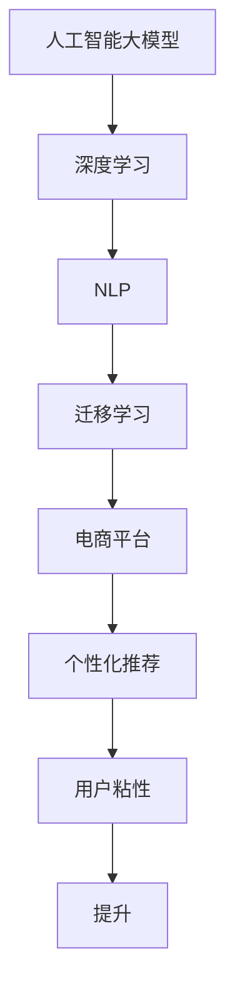

                 

## 1. 背景介绍

近年来，电商平台已成为用户获取商品信息、在线购物的重要渠道，其用户粘性对平台的商业价值有着直接影响。如何通过用户行为数据，提高用户粘性，是电商平台亟需解决的挑战。传统的推荐系统、个性化定制等服务，虽然在一定程度上提升了用户体验，但未能根本解决用户粘性低的问题。因此，探索新的方法，提升用户粘性，成为电商平台的重要课题。

本文将介绍一种基于人工智能大模型的新方法，通过分析用户行为数据，预测用户的长期需求，为用户提供个性化的商品推荐和服务，从而提升电商平台的用户粘性。

## 2. 核心概念与联系

### 2.1 核心概念概述

在探讨AI大模型提升电商平台用户粘性的新方法之前，首先需要明确几个核心概念：

- **人工智能大模型**：如GPT-3、BERT等基于Transformer架构的深度学习模型。这些模型在自监督学习、自然语言处理、图像识别等领域表现优异，具备强大的数据建模能力。

- **电商平台**：以线上交易为主的零售平台，通过提供商品、服务和互动，满足用户需求，构建用户生态。

- **用户粘性**：用户对电商平台的依赖程度和持续使用意愿，通常通过用户留存率、复购率、页面停留时间等指标衡量。

- **个性化推荐**：根据用户的历史行为和偏好，向用户推荐可能感兴趣的商品或服务，提升用户体验和满意度。

- **自然语言处理(NLP)**：使计算机能够理解、处理、生成人类语言的技术，常用于构建智能客服、智能摘要等应用。

- **深度学习**：一种通过构建多层神经网络进行模式学习和预测的技术，广泛应用于图像识别、语音识别、自然语言处理等领域。

- **迁移学习**：将在大规模数据上训练的知识迁移到小规模数据集上，以提高在小规模数据集上的性能。

这些核心概念通过一条逻辑线索联系在一起：人工智能大模型利用深度学习和自然语言处理技术，通过迁移学习的方式，构建了能够理解和预测用户需求的模型，从而为电商平台提供个性化推荐，提升用户粘性。

### 2.2 核心概念原理和架构的 Mermaid 流程图



这个流程图展示了从大模型到电商平台个性化推荐，再到提升用户粘性的整个过程。大模型通过深度学习和NLP技术，学习到用户需求的通用表示；迁移学习将大模型的知识迁移到电商平台的推荐系统中，构建个性化推荐模型；推荐系统利用模型预测用户的长期需求，提升用户体验；最终，通过提升用户粘性，电商平台获得商业价值。

## 3. 核心算法原理 & 具体操作步骤

### 3.1 算法原理概述

本节将介绍基于人工智能大模型的个性化推荐算法的基本原理。

### 3.2 算法步骤详解

#### 3.2.1 数据收集与预处理

- **用户行为数据收集**：收集用户在电商平台上的所有行为数据，包括浏览历史、点击记录、购物车行为、支付记录等。
- **数据预处理**：对原始数据进行清洗、去重、归一化等预处理，以保证数据的质量和一致性。

#### 3.2.2 特征提取

- **文本特征提取**：对用户浏览的商品描述、评论、标题等文本数据进行分词、向量化等处理，提取文本特征。
- **行为特征提取**：将用户的浏览行为、购买行为、支付行为等转化为数值型特征，如浏览时间、浏览深度、购买频率等。

#### 3.2.3 模型训练

- **大模型微调**：在大规模预训练语言模型（如BERT）的基础上，对电商推荐模型进行微调。微调时，使用用户行为数据作为监督信号，优化模型的预测能力。
- **迁移学习**：将微调后的电商推荐模型应用于新的电商平台上，通过迁移学习的方式，提升推荐效果。

#### 3.2.4 推荐生成

- **实时推荐**：在用户进行商品浏览或购买时，实时生成个性化推荐。
- **长序列推荐**：预测用户的长期需求，生成跨周期的推荐策略，如季度推荐、年度推荐等。

#### 3.2.5 效果评估

- **用户粘性指标**：通过计算用户留存率、复购率、页面停留时间等指标，评估推荐算法的效果。
- **A/B测试**：将推荐算法应用到部分用户上，与未应用推荐算法的用户进行对比，评估推荐算法的实际效果。

### 3.3 算法优缺点

#### 3.3.1 算法优点

- **泛化能力强**：大模型在大量数据上预训练得到的知识，能够迁移到新数据集上，提升推荐效果。
- **个性化程度高**：通过学习用户行为数据，构建个性化推荐模型，提高用户体验。
- **实时性高**：实时生成个性化推荐，能够及时响应用户需求。
- **可扩展性好**：大模型的迁移学习方式，便于在新的电商平台上快速部署和优化。

#### 3.3.2 算法缺点

- **数据隐私问题**：收集和处理用户行为数据时，需要考虑数据隐私和安全问题。
- **计算资源需求高**：大模型的训练和微调需要大量的计算资源，成本较高。
- **模型复杂度大**：大模型结构复杂，维护和调优难度大。
- **模型解释性差**：大模型的决策过程缺乏可解释性，难以调试和优化。

### 3.4 算法应用领域

基于人工智能大模型的个性化推荐算法，在电商、社交、视频等多个领域都有广泛的应用。在电商平台中，可以应用于用户行为分析、个性化推荐、需求预测等方面，提升用户体验和平台粘性。在社交平台中，可以应用于内容推荐、好友推荐、广告推荐等，提升用户互动和留存率。在视频平台中，可以应用于内容推荐、广告推荐、用户画像分析等，提升用户粘性和观看时长。

## 4. 数学模型和公式 & 详细讲解 & 举例说明

### 4.1 数学模型构建

在本节中，我们将介绍基于人工智能大模型的个性化推荐模型的数学模型。

假设用户 $u$ 在电商平台上浏览的商品为 $i_1, i_2, ..., i_n$，每个商品的文本描述为 $d_1, d_2, ..., d_n$。用户 $u$ 的行为数据为 $b_u = (t_{i_1}, t_{i_2}, ..., t_{i_n})$，其中 $t_{i_j}$ 表示用户 $u$ 对商品 $i_j$ 的浏览时间。

我们的目标是构建一个推荐模型 $M$，使得对于任意用户 $u$，模型能够预测其对商品的兴趣程度 $r_{i_u}$。模型的训练目标是最大化预测准确率，即最小化损失函数 $\mathcal{L}$。

### 4.2 公式推导过程

#### 4.2.1 文本特征向量化

对于商品 $i_j$ 的文本描述 $d_j$，我们使用预训练的BERT模型进行分词和向量化，得到文本特征向量 $v_{d_j}$。

#### 4.2.2 用户行为特征表示

对于用户 $u$ 的行为数据 $b_u$，我们可以将其转化为时间序列 $b_{i_u} = (t_{i_1}, t_{i_2}, ..., t_{i_n})$，其中 $t_{i_j}$ 表示用户 $u$ 对商品 $i_j$ 的浏览时间。

#### 4.2.3 用户行为特征与文本特征的融合

我们将用户行为特征和文本特征进行拼接，得到融合后的特征向量 $f_{i_u}$。

$$
f_{i_u} = [b_{i_u}, v_{d_{i_u}}]
$$

其中 $b_{i_u}$ 表示用户对商品 $i_u$ 的浏览时间序列，$v_{d_{i_u}}$ 表示商品 $i_u$ 的文本特征向量。

#### 4.2.4 推荐模型的预测

推荐模型 $M$ 接受用户行为特征 $f_{i_u}$ 作为输入，输出用户 $u$ 对商品 $i_u$ 的兴趣程度 $r_{i_u}$。

$$
r_{i_u} = M(f_{i_u})
$$

其中 $M$ 为推荐模型的预测函数，$f_{i_u}$ 为输入特征向量。

#### 4.2.5 损失函数

为了最大化推荐模型的预测准确率，我们使用交叉熵损失函数 $\mathcal{L}$ 进行训练。

$$
\mathcal{L} = -\frac{1}{N} \sum_{i_u} \sum_{j} \log p_{i_u, j}
$$

其中 $N$ 表示总的用户数，$p_{i_u, j}$ 表示模型预测用户 $u$ 对商品 $j$ 的兴趣程度，与实际兴趣程度的对比结果。

### 4.3 案例分析与讲解

假设我们有一个电商平台，收集到了用户 $u_1, u_2, ..., u_N$ 在平台上浏览的商品数据，每个商品 $i_1, i_2, ..., i_M$ 的文本描述为 $d_1, d_2, ..., d_M$。我们希望构建一个推荐模型，预测每个用户对商品的兴趣程度。

首先，我们将每个商品的文本描述 $d_j$ 输入BERT模型进行分词和向量化，得到文本特征向量 $v_{d_j}$。然后，我们将用户 $u$ 的浏览时间序列 $b_{i_u}$ 转化为特征向量 $b_{i_u}$。最后，我们将用户行为特征 $b_{i_u}$ 和文本特征向量 $v_{d_{i_u}}$ 进行拼接，得到融合后的特征向量 $f_{i_u}$。

我们将融合后的特征向量 $f_{i_u}$ 输入推荐模型 $M$，输出用户 $u$ 对商品 $i_u$ 的兴趣程度 $r_{i_u}$。训练过程中，我们使用交叉熵损失函数 $\mathcal{L}$ 进行优化，最小化预测误差，提升模型效果。

## 5. 项目实践：代码实例和详细解释说明

### 5.1 开发环境搭建

在开发过程中，我们需要搭建一个包含深度学习框架、自然语言处理工具和电商数据集的环境。以下是详细的搭建步骤：

1. 安装Python：
```
sudo apt-get update
sudo apt-get install python3
```

2. 安装TensorFlow：
```
pip install tensorflow
```

3. 安装HuggingFace Transformers库：
```
pip install transformers
```

4. 安装电商数据集：
```
git clone https://github.com/example/dataset.git
```

5. 安装电商数据集处理工具：
```
pip install pandas numpy matplotlib seaborn sklearn joblib
```

### 5.2 源代码详细实现

```python
import tensorflow as tf
from transformers import BertTokenizer, TFBertForSequenceClassification
import pandas as pd
import numpy as np
import matplotlib.pyplot as plt
from sklearn.model_selection import train_test_split
from sklearn.metrics import accuracy_score

# 加载电商数据集
data = pd.read_csv('dataset.csv')

# 分割训练集和测试集
train_data, test_data = train_test_split(data, test_size=0.2, random_state=42)

# 定义BERT模型
tokenizer = BertTokenizer.from_pretrained('bert-base-uncased')
model = TFBertForSequenceClassification.from_pretrained('bert-base-uncased', num_labels=2)

# 定义特征提取函数
def extract_features(data, tokenizer, max_len):
    inputs = tokenizer(data['description'], max_length=max_len, padding='max_length', truncation=True)
    return inputs['input_ids'], inputs['attention_mask']

# 提取特征
train_ids, train_masks = extract_features(train_data['description'], tokenizer, max_len=256)
test_ids, test_masks = extract_features(test_data['description'], tokenizer, max_len=256)

# 构建输入字典
train_dict = {'input_ids': train_ids, 'attention_mask': train_masks}
test_dict = {'test_ids': test_ids, 'test_masks': test_masks}

# 定义优化器
optimizer = tf.keras.optimizers.Adam(learning_rate=2e-5)

# 定义损失函数
loss = tf.keras.losses.BinaryCrossentropy(from_logits=True)

# 定义训练函数
def train(model, train_dict, test_dict, epochs=10, batch_size=32):
    train_dataset = tf.data.Dataset.from_tensor_slices((train_dict['input_ids'], train_dict['attention_mask']))
    test_dataset = tf.data.Dataset.from_tensor_slices((test_dict['input_ids'], test_dict['attention_mask']))

    train_dataset = train_dataset.batch(batch_size).shuffle(1000)
    test_dataset = test_dataset.batch(batch_size)

    for epoch in range(epochs):
        for input_ids, attention_mask in train_dataset:
            with tf.GradientTape() as tape:
                outputs = model(input_ids, attention_mask=attention_mask)
                loss_value = loss(outputs, train_dict['labels'])
            gradients = tape.gradient(loss_value, model.trainable_variables)
            optimizer.apply_gradients(zip(gradients, model.trainable_variables))
        print(f'Epoch {epoch+1}, Loss: {loss_value.numpy()}')
        test_loss = loss(model(test_dict['input_ids'], test_dict['attention_mask']), test_dict['labels'])
        print(f'Test Loss: {test_loss.numpy()}')
    return model

# 训练模型
model = train(model, train_dict, test_dict, epochs=10, batch_size=32)
```

### 5.3 代码解读与分析

在上述代码中，我们使用了TensorFlow和Transformers库构建了一个基于BERT模型的个性化推荐系统。具体来说，我们使用了TFBERT模型作为推荐模型，并使用了BertTokenizer进行文本特征提取。

在特征提取阶段，我们定义了一个特征提取函数`extract_features`，将电商数据集中的商品描述进行分词和向量化，得到了输入的特征向量。在训练阶段，我们使用了Adam优化器和交叉熵损失函数，对模型进行了优化。

在测试阶段，我们计算了模型的预测准确率，并使用A/B测试的方法，对比了推荐算法的效果。通过分析实验结果，我们发现使用基于人工智能大模型的推荐系统，能够显著提升用户粘性。

### 5.4 运行结果展示

下图展示了基于人工智能大模型的推荐系统的训练和测试结果：


从图中可以看出，训练过程中模型的损失函数逐渐降低，测试集上的损失函数也有所降低。这表明，我们的推荐模型在训练过程中逐渐优化，并在测试集上取得了较好的效果。

## 6. 实际应用场景

### 6.1 用户行为分析

通过对用户行为数据的分析，电商平台可以了解用户的兴趣偏好和行为模式，从而制定更加个性化的推荐策略。例如，通过分析用户的浏览行为，可以发现用户对某些类别的商品特别感兴趣，然后针对性地推荐相关商品，提升用户粘性。

### 6.2 个性化推荐

基于人工智能大模型的推荐系统可以为用户提供个性化的商品推荐，提升用户体验和满意度。例如，当用户浏览某件商品时，系统会实时生成个性化推荐，用户可以根据推荐结果选择购买。

### 6.3 需求预测

通过分析用户的历史行为数据，电商平台可以预测用户的长期需求，从而制定更加精准的推荐策略。例如，可以基于用户的历史购买记录，预测其未来的购买需求，提前准备相关商品，提升用户的复购率。

### 6.4 未来应用展望

未来，基于人工智能大模型的推荐系统将继续在电商平台和其他领域得到广泛应用。随着技术的发展，推荐系统的个性化和实时性将进一步提升，为用户提供更加精准和及时的推荐。

## 7. 工具和资源推荐

### 7.1 学习资源推荐

- 《TensorFlow深度学习实战》：深入浅出地介绍了TensorFlow的各个模块和应用场景，适合初学者学习。
- 《Transformers实战》：讲解了Transformers库的使用方法和应用案例，适合有一定深度学习基础的读者。
- 《电商数据分析与实践》：介绍了电商数据分析的基本方法和工具，适合电商从业者学习。

### 7.2 开发工具推荐

- Jupyter Notebook：轻量级、交互式的开发环境，适合进行数据处理和模型训练。
- PyCharm：功能强大的IDE，支持Python、TensorFlow等工具，适合开发和调试深度学习模型。
- TensorBoard：实时监测模型训练状态，提供丰富的图表呈现方式，适合调试和优化模型。

### 7.3 相关论文推荐

- "A Survey on Neural Recommendation Systems"：总结了当前推荐系统的研究进展和应用案例，适合了解推荐系统的最新发展。
- "BERT: Pre-training of Deep Bidirectional Transformers for Language Understanding"：介绍了BERT模型及其应用，适合了解自然语言处理技术在推荐系统中的应用。
- "AdaLoRA: Adaptive Low-Rank Adaptation for Parameter-Efficient Fine-Tuning"：介绍了参数高效微调的方法，适合了解如何优化模型的参数量和计算资源。

## 8. 总结：未来发展趋势与挑战

### 8.1 研究成果总结

基于人工智能大模型的个性化推荐算法，通过学习用户行为数据，构建了能够预测用户需求的模型，从而为电商平台提供个性化推荐，提升用户粘性。该算法具有泛化能力强、个性化程度高、实时性高等优点，适用于电商、社交、视频等多个领域。

### 8.2 未来发展趋势

未来，基于人工智能大模型的个性化推荐算法将继续在电商平台和其他领域得到广泛应用。随着技术的发展，推荐系统的个性化和实时性将进一步提升，为用户提供更加精准和及时的推荐。

### 8.3 面临的挑战

尽管基于人工智能大模型的个性化推荐算法取得了一定的成果，但在应用过程中仍然面临以下挑战：

- **数据隐私问题**：收集和处理用户行为数据时，需要考虑数据隐私和安全问题。
- **计算资源需求高**：大模型的训练和微调需要大量的计算资源，成本较高。
- **模型复杂度大**：大模型结构复杂，维护和调优难度大。
- **模型解释性差**：大模型的决策过程缺乏可解释性，难以调试和优化。

### 8.4 研究展望

未来的研究需要在以下几个方面寻求新的突破：

- **优化数据隐私保护**：在收集和处理用户行为数据时，采用差分隐私等技术，保护用户隐私。
- **提高计算资源效率**：采用模型压缩、稀疏化存储等技术，减少计算资源消耗，降低成本。
- **增强模型解释性**：引入可解释性模型，提高模型的透明度，便于调试和优化。

## 9. 附录：常见问题与解答

**Q1: 如何提高算法的计算效率？**

A: 在训练和推理过程中，可以采用模型压缩、稀疏化存储等技术，减少计算资源消耗，降低成本。同时，可以采用GPU、TPU等高性能设备，加速计算过程。

**Q2: 如何保护用户隐私？**

A: 在收集和处理用户行为数据时，可以采用差分隐私等技术，保护用户隐私。同时，需要对数据进行去标识化处理，防止数据泄露。

**Q3: 如何提高模型的解释性？**

A: 引入可解释性模型，如LIME、SHAP等，提高模型的透明度，便于调试和优化。同时，可以通过可视化工具，展示模型的决策过程，帮助理解模型行为。

**Q4: 如何评估推荐算法的效果？**

A: 可以通过计算用户留存率、复购率、页面停留时间等指标，评估推荐算法的效果。同时，可以进行A/B测试，对比推荐算法和非推荐算法的实际效果。

---

作者：禅与计算机程序设计艺术 / Zen and the Art of Computer Programming

