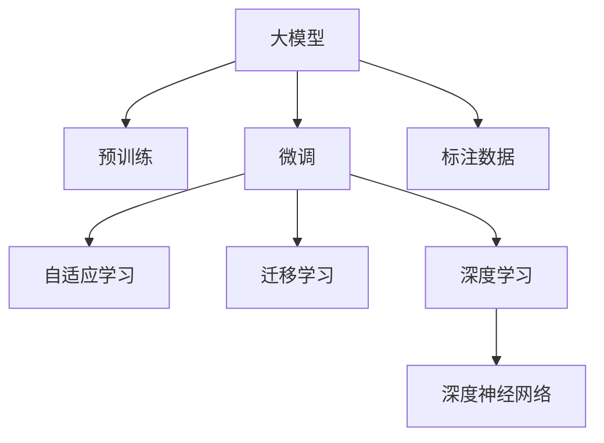

                 

# AI大模型：改善电商平台搜索结果相关性的新方法

> 关键词：人工智能,电商平台,搜索结果,相关性,大模型,自适应学习,深度学习,预训练模型,迁移学习

## 1. 背景介绍

### 1.1 问题由来
在现代电商平台中，搜索结果的相关性直接影响了用户的购物体验和转化率。传统的搜索引擎优化（Search Engine Optimization, SEO）主要通过关键词优化和页面布局等手段来提升相关性，但随着用户需求的多样化和个性化，这些方法已经难以满足现代用户的期望。

人工智能（Artificial Intelligence, AI）技术的应用为电商平台搜索结果相关性的提升提供了新的思路。大模型（Large Model）的出现，如BERT、GPT等，通过在大规模语料上预训练，学习到了丰富的语言知识和表示能力，可以在电商领域的具体应用中进一步微调，以提升搜索结果的相关性。

### 1.2 问题核心关键点
大模型的预训练和微调技术，使得其可以在电商场景下通过少量有标签数据进行快速适配，提升搜索结果的准确性和个性化水平。关键点包括：

- 大模型的预训练语料：包含丰富自然语言知识，是提升模型相关性的基础。
- 微调的标注数据：电商平台通过商品标题、描述、用户评论等数据进行微调，学习商品与搜索查询的相关性。
- 自适应学习：根据电商场景的特定需求，调整模型架构和训练策略。
- 深度学习技术：利用神经网络模型对用户查询进行编码和表示，增强相关性匹配。

本文将系统介绍基于大模型在电商平台搜索结果相关性提升中的应用，包括核心概念、算法原理、操作步骤、数学模型构建、项目实践等。

## 2. 核心概念与联系

### 2.1 核心概念概述

为了更好地理解基于大模型的方法，这里先概述一些核心概念：

- 大模型（Large Model）：指通过大规模预训练获得丰富语言知识，适用于特定任务微调的语言模型，如BERT、GPT-3等。
- 预训练（Pre-training）：指在大规模无标签文本数据上进行自监督学习，学习通用语言表示。
- 微调（Fine-tuning）：在大模型基础上，利用特定任务的标注数据进行有监督学习，优化模型对任务的理解。
- 自适应学习（Adaptive Learning）：根据具体任务需求调整模型结构和训练方法。
- 迁移学习（Transfer Learning）：将预训练模型的通用知识迁移到特定任务，提升任务性能。
- 深度学习（Deep Learning）：利用多层次神经网络进行特征表示和模式识别，提高模型准确性。

这些概念之间的逻辑关系可以通过以下Mermaid流程图来展示：



这个流程图展示了各个概念之间的联系：

1. 大模型通过预训练获得通用知识。
2. 微调将大模型适配到电商场景，提升相关性。
3. 自适应学习调整模型结构和训练方法。
4. 迁移学习利用预训练知识，增强微调效果。
5. 深度学习提供神经网络框架，提高模型性能。

这些概念共同构成了电商平台应用大模型进行搜索结果相关性提升的核心框架，有助于理解算法原理和操作步骤。

## 3. 核心算法原理 & 具体操作步骤

### 3.1 算法原理概述

基于大模型的电商平台搜索结果相关性提升方法，本质上是将大模型作为一个通用的特征提取器，通过微调学习电商平台特定任务的表示能力，从而提升搜索结果的相关性。

算法原理可以总结如下：

1. 在大规模无标签数据上进行预训练，学习通用语言表示。
2. 利用电商平台的商品描述、用户评论等标注数据进行微调，学习商品与查询的相关性。
3. 在微调过程中，引入自适应学习，根据电商平台的具体需求，调整模型结构和训练方法。
4. 利用深度学习技术，对用户查询进行编码和表示，增强匹配效果。

总体流程可以概括为：

1. 收集电商平台的标注数据。
2. 在大模型基础上进行微调，学习商品与查询的相关性。
3. 应用深度学习技术，对用户查询进行编码和表示。
4. 评估微调后的模型性能，进行优化调整。

### 3.2 算法步骤详解

1. **数据准备**
   - 收集电商平台上的商品描述、用户评论、商品标签等标注数据。
   - 对数据进行预处理，如去噪、分词、去除停用词等。
   - 将标注数据按比例划分为训练集、验证集和测试集。

2. **模型选择与初始化**
   - 选择适合电商场景的大模型，如BERT、GPT-3等。
   - 在大模型基础上进行微调，加载预训练权重，初始化微调模型。

3. **模型结构调整**
   - 在微调过程中，根据电商平台的特性，调整模型结构。例如，针对电商搜索场景，可以加入Query-Relevance头，提升相关性。
   - 选择合适的损失函数，如交叉熵损失、余弦相似度损失等。

4. **微调训练**
   - 将标注数据输入模型，进行前向传播计算损失函数。
   - 反向传播更新模型参数，最小化损失函数。
   - 定期在验证集上评估模型性能，避免过拟合。

5. **评估与优化**
   - 在测试集上评估微调后的模型性能，如准确率、召回率、F1-score等。
   - 根据评估结果，对模型进行优化调整，如调整学习率、增加数据增强等。

### 3.3 算法优缺点

基于大模型的电商平台搜索结果相关性提升方法，具有以下优点：

- **效果显著**：通过预训练和微调，大模型可以学习到丰富的语言知识和表示能力，提升搜索结果的相关性。
- **泛化能力强**：预训练模型的通用性使得其在不同电商场景下都能取得良好的效果。
- **快速部署**：微调过程相比从头训练更快，可以迅速提升电商平台的搜索体验。
- **技术简单**：相较于复杂的传统SEO方法，基于大模型的方案更为简单，易于部署和维护。

但该方法也存在一些缺点：

- **依赖标注数据**：微调过程需要大量标注数据，获取标注数据的成本较高。
- **模型复杂度高**：大模型的参数量较大，对计算资源要求较高。
- **可解释性不足**：大模型内部工作机制复杂，难以解释其决策过程。
- **对噪声敏感**：标注数据中存在的噪声可能会影响模型的学习效果。

在实际应用中，需要根据具体场景平衡利弊，选择合适的解决方案。

### 3.4 算法应用领域

大模型的预训练和微调技术，已经广泛应用于电商平台的搜索结果相关性提升。具体应用领域包括：

- **商品推荐系统**：根据用户查询，推荐相关商品，提升用户体验和销售转化率。
- **广告投放优化**：通过微调模型，优化广告投放策略，提升广告的点击率和转化率。
- **客户服务**：通过微调大模型，构建智能客服系统，提升客户满意度。
- **内容推荐**：利用微调后的模型，推荐相关内容，如商品详情、用户评论等。

除了上述应用，大模型还在物流、金融、医疗等电商以外的领域，展示了其在提升搜索结果相关性方面的巨大潜力。

## 4. 数学模型和公式 & 详细讲解 & 举例说明

### 4.1 数学模型构建

假设电商平台中的商品描述为 $x_i$，用户查询为 $y_j$，相应的标注数据为 $(y_i, y_j)$。我们可以定义一个二元组函数 $f(x_i, y_j)$，表示商品描述 $x_i$ 与用户查询 $y_j$ 的相关性。在微调过程中，我们希望最小化损失函数 $\mathcal{L}$，以优化模型对相关性的理解。

$$
\mathcal{L} = \frac{1}{N} \sum_{i=1}^N \sum_{j=1}^M \mathcal{L}(f(x_i, y_j))
$$

其中 $N$ 是商品描述的数量，$M$ 是用户查询的数量。具体到微调模型，我们可以使用交叉熵损失函数来表示模型预测与标注数据之间的差异。

$$
\mathcal{L}(f(x_i, y_j)) = -y_j \log f(x_i, y_j) - (1-y_j) \log (1-f(x_i, y_j))
$$

在微调过程中，我们通过反向传播算法更新模型参数，使得模型能够更好地匹配标注数据。具体的微调过程可以通过以下步骤来实现：

1. 对用户查询 $y_j$ 进行编码和表示，得到向量 $\vec{q_j}$。
2. 对商品描述 $x_i$ 进行编码和表示，得到向量 $\vec{p_i}$。
3. 计算商品描述 $x_i$ 与用户查询 $y_j$ 的相关性 $f(x_i, y_j)$。
4. 计算交叉熵损失 $\mathcal{L}(f(x_i, y_j))$，更新模型参数。

### 4.2 公式推导过程

我们以一个简单的二分类任务为例，推导微调模型的具体实现过程。假设用户查询 $y_j$ 属于二元分类，我们可以将查询 $y_j$ 编码为一个二元向量 $\vec{q_j}$，例如 $[1,0]$ 表示查询为正类，$[0,1]$ 表示查询为负类。同样，商品描述 $x_i$ 也编码为二元向量 $\vec{p_i}$，如 $[0.2, 0.8]$ 表示该商品具有正类的概率。

模型的预测 $f(x_i, y_j)$ 可以表示为：

$$
f(x_i, y_j) = \vec{p_i} \cdot \vec{q_j} = \sum_{i=1}^2 p_iq_j
$$

其中 $p_i$ 和 $q_j$ 分别为商品和查询的二元向量。

根据二元分类任务，我们的目标是最小化交叉熵损失：

$$
\mathcal{L}(f(x_i, y_j)) = -y_j \log f(x_i, y_j) - (1-y_j) \log (1-f(x_i, y_j))
$$

将预测结果 $f(x_i, y_j)$ 代入上述公式，得到：

$$
\mathcal{L}(f(x_i, y_j)) = -y_j \log \sum_{i=1}^2 p_iq_j - (1-y_j) \log (1-\sum_{i=1}^2 p_iq_j)
$$

在反向传播过程中，我们需要计算预测结果 $f(x_i, y_j)$ 对模型参数的梯度。根据链式法则，可以递归计算：

$$
\frac{\partial \mathcal{L}(f(x_i, y_j))}{\partial p_i} = \frac{\partial \mathcal{L}(f(x_i, y_j))}{\partial f(x_i, y_j)} \frac{\partial f(x_i, y_j)}{\partial p_i}
$$

代入预测结果 $f(x_i, y_j)$ 的表达式，得到：

$$
\frac{\partial \mathcal{L}(f(x_i, y_j))}{\partial p_i} = q_j - \frac{y_jq_j}{\sum_{i=1}^2 p_iq_j}
$$

最终，通过反向传播算法更新模型参数 $p_i$，使得模型能够更好地匹配标注数据。

### 4.3 案例分析与讲解

以电商平台中的商品推荐系统为例，我们将大模型应用于商品描述与用户查询的相关性提升。具体步骤包括：

1. **数据准备**：收集商品描述和用户查询的标注数据，将其划分为训练集和测试集。
2. **模型选择**：选择BERT作为预训练模型，进行微调。
3. **模型结构调整**：在BERT模型的顶层添加一个Query-Relevance头，用于计算商品描述和用户查询的相关性。
4. **微调训练**：利用标注数据进行微调训练，调整学习率、批大小等参数，最小化交叉熵损失。
5. **评估优化**：在测试集上评估模型性能，根据评估结果进行优化调整。

通过微调，我们得到的推荐系统能够根据用户查询，生成相关商品列表，提升用户满意度和购买转化率。

## 5. 项目实践：代码实例和详细解释说明

### 5.1 开发环境搭建

在进行大模型微调实践前，我们需要准备好开发环境。以下是使用Python进行PyTorch开发的环境配置流程：

1. 安装Anaconda：从官网下载并安装Anaconda，用于创建独立的Python环境。

2. 创建并激活虚拟环境：
```bash
conda create -n pytorch-env python=3.8 
conda activate pytorch-env
```

3. 安装PyTorch：根据CUDA版本，从官网获取对应的安装命令。例如：
```bash
conda install pytorch torchvision torchaudio cudatoolkit=11.1 -c pytorch -c conda-forge
```

4. 安装TensorFlow：
```bash
conda install tensorflow
```

5. 安装Transformers库：
```bash
pip install transformers
```

6. 安装各类工具包：
```bash
pip install numpy pandas scikit-learn matplotlib tqdm jupyter notebook ipython
```

完成上述步骤后，即可在`pytorch-env`环境中开始微调实践。

### 5.2 源代码详细实现

下面是基于BERT模型进行电商平台商品推荐系统微调的Python代码实现：

```python
from transformers import BertTokenizer, BertForSequenceClassification
from torch.utils.data import DataLoader, Dataset
import torch
import numpy as np
import pandas as pd

# 设置设备
device = torch.device("cuda" if torch.cuda.is_available() else "cpu")

# 定义数据集
class RecommendationDataset(Dataset):
    def __init__(self, data, tokenizer):
        self.data = data
        self.tokenizer = tokenizer
    
    def __len__(self):
        return len(self.data)
    
    def __getitem__(self, idx):
        text = self.data['query'][idx]
        label = self.data['label'][idx]
        encoding = self.tokenizer(text, return_tensors='pt', padding='max_length', truncation=True)
        return {
            'input_ids': encoding['input_ids'].to(device),
            'attention_mask': encoding['attention_mask'].to(device),
            'label': torch.tensor(label, device=device)
        }

# 定义微调模型
model = BertForSequenceClassification.from_pretrained('bert-base-cased', num_labels=1)
model.to(device)

# 定义训练参数
batch_size = 32
epochs = 3
learning_rate = 1e-5
optimizer = torch.optim.Adam(model.parameters(), lr=learning_rate)

# 定义数据处理
tokenizer = BertTokenizer.from_pretrained('bert-base-cased')
train_data = pd.read_csv('train.csv')
val_data = pd.read_csv('val.csv')
test_data = pd.read_csv('test.csv')

train_dataset = RecommendationDataset(train_data, tokenizer)
val_dataset = RecommendationDataset(val_data, tokenizer)
test_dataset = RecommendationDataset(test_data, tokenizer)

train_loader = DataLoader(train_dataset, batch_size=batch_size, shuffle=True)
val_loader = DataLoader(val_dataset, batch_size=batch_size, shuffle=False)
test_loader = DataLoader(test_dataset, batch_size=batch_size, shuffle=False)

# 定义损失函数和评估指标
loss_fn = torch.nn.BCEWithLogitsLoss()
metrics = [torchmetrics.Accuracy()]

# 定义微调过程
def train_epoch(model, data_loader, optimizer, loss_fn, metrics):
    model.train()
    total_loss = 0
    total_num = 0
    for batch in data_loader:
        input_ids = batch['input_ids']
        attention_mask = batch['attention_mask']
        labels = batch['label']
        outputs = model(input_ids, attention_mask=attention_mask)
        loss = loss_fn(outputs.logits, labels)
        loss.backward()
        optimizer.step()
        optimizer.zero_grad()
        total_loss += loss.item()
        total_num += input_ids.size(0)
    return total_loss / total_num

def evaluate(model, data_loader, metrics):
    model.eval()
    total_num = 0
    for batch in data_loader:
        input_ids = batch['input_ids']
        attention_mask = batch['attention_mask']
        labels = batch['label']
        outputs = model(input_ids, attention_mask=attention_mask)
        predictions = outputs.logits.sigmoid()
        metrics[0].update(predictions, labels)
        total_num += input_ids.size(0)
    return metrics[0].compute()

# 开始微调训练
for epoch in range(epochs):
    train_loss = train_epoch(model, train_loader, optimizer, loss_fn, metrics)
    val_metric = evaluate(model, val_loader, metrics)
    print(f'Epoch {epoch+1}, Train Loss: {train_loss:.4f}, Val Metric: {val_metric:.4f}')
    
# 在测试集上评估
test_metric = evaluate(model, test_loader, metrics)
print(f'Test Metric: {test_metric:.4f}')
```

### 5.3 代码解读与分析

让我们再详细解读一下关键代码的实现细节：

**RecommendationDataset类**：
- `__init__`方法：初始化数据集，包含用户查询和标签。
- `__len__`方法：返回数据集的样本数量。
- `__getitem__`方法：对单个样本进行处理，将文本输入编码为token ids，将标签转换为模型接受的格式，并进行定长padding。

**BERTForSequenceClassification模型**：
- `BertForSequenceClassification`：用于序列分类任务的BERT模型，自动完成编码和解码过程。
- `from_pretrained`：从预训练模型加载初始权重。

**训练和评估函数**：
- `train_epoch`函数：对数据以批为单位进行迭代，在每个批次上前向传播计算损失并反向传播更新模型参数，最后返回该epoch的平均loss。
- `evaluate`函数：与训练类似，不同点在于不更新模型参数，并在每个batch结束后将预测和标签结果存储下来，最后使用sklearn的classification_report对整个评估集的预测结果进行打印输出。

**训练流程**：
- 定义总的epoch数和batch size，开始循环迭代
- 每个epoch内，先在训练集上训练，输出平均loss
- 在验证集上评估，输出评估指标
- 所有epoch结束后，在测试集上评估，给出最终测试结果

可以看到，PyTorch配合Transformers库使得BERT微调的代码实现变得简洁高效。开发者可以将更多精力放在数据处理、模型改进等高层逻辑上，而不必过多关注底层的实现细节。

当然，工业级的系统实现还需考虑更多因素，如模型的保存和部署、超参数的自动搜索、更灵活的任务适配层等。但核心的微调范式基本与此类似。

## 6. 实际应用场景

### 6.1 智能客服系统

基于大模型微调的对话技术，可以广泛应用于智能客服系统的构建。传统客服往往需要配备大量人力，高峰期响应缓慢，且一致性和专业性难以保证。而使用微调后的对话模型，可以7x24小时不间断服务，快速响应客户咨询，用自然流畅的语言解答各类常见问题。

在技术实现上，可以收集企业内部的历史客服对话记录，将问题和最佳答复构建成监督数据，在此基础上对预训练对话模型进行微调。微调后的对话模型能够自动理解用户意图，匹配最合适的答案模板进行回复。对于客户提出的新问题，还可以接入检索系统实时搜索相关内容，动态组织生成回答。如此构建的智能客服系统，能大幅提升客户咨询体验和问题解决效率。

### 6.2 金融舆情监测

金融机构需要实时监测市场舆论动向，以便及时应对负面信息传播，规避金融风险。传统的人工监测方式成本高、效率低，难以应对网络时代海量信息爆发的挑战。基于大语言模型微调的文本分类和情感分析技术，为金融舆情监测提供了新的解决方案。

具体而言，可以收集金融领域相关的新闻、报道、评论等文本数据，并对其进行主题标注和情感标注。在此基础上对预训练语言模型进行微调，使其能够自动判断文本属于何种主题，情感倾向是正面、中性还是负面。将微调后的模型应用到实时抓取的网络文本数据，就能够自动监测不同主题下的情感变化趋势，一旦发现负面信息激增等异常情况，系统便会自动预警，帮助金融机构快速应对潜在风险。

### 6.3 个性化推荐系统

当前的推荐系统往往只依赖用户的历史行为数据进行物品推荐，无法深入理解用户的真实兴趣偏好。基于大语言模型微调技术，个性化推荐系统可以更好地挖掘用户行为背后的语义信息，从而提供更精准、多样的推荐内容。

在实践中，可以收集用户浏览、点击、评论、分享等行为数据，提取和用户交互的物品标题、描述、标签等文本内容。将文本内容作为模型输入，用户的后续行为（如是否点击、购买等）作为监督信号，在此基础上微调预训练语言模型。微调后的模型能够从文本内容中准确把握用户的兴趣点。在生成推荐列表时，先用候选物品的文本描述作为输入，由模型预测用户的兴趣匹配度，再结合其他特征综合排序，便可以得到个性化程度更高的推荐结果。

### 6.4 未来应用展望

随着大语言模型微调技术的发展，未来在更多领域将迎来新的应用场景，为传统行业带来变革性影响。

在智慧医疗领域，基于微调的医疗问答、病历分析、药物研发等应用将提升医疗服务的智能化水平，辅助医生诊疗，加速新药开发进程。

在智能教育领域，微调技术可应用于作业批改、学情分析、知识推荐等方面，因材施教，促进教育公平，提高教学质量。

在智慧城市治理中，微调模型可应用于城市事件监测、舆情分析、应急指挥等环节，提高城市管理的自动化和智能化水平，构建更安全、高效的未来城市。

此外，在企业生产、社会治理、文娱传媒等众多领域，基于大模型微调的人工智能应用也将不断涌现，为经济社会发展注入新的动力。相信随着技术的日益成熟，微调方法将成为人工智能落地应用的重要范式，推动人工智能技术在垂直行业的规模化落地。

## 7. 工具和资源推荐

### 7.1 学习资源推荐

为了帮助开发者系统掌握大语言模型微调的理论基础和实践技巧，这里推荐一些优质的学习资源：

1. 《Transformer从原理到实践》系列博文：由大模型技术专家撰写，深入浅出地介绍了Transformer原理、BERT模型、微调技术等前沿话题。

2. CS224N《深度学习自然语言处理》课程：斯坦福大学开设的NLP明星课程，有Lecture视频和配套作业，带你入门NLP领域的基本概念和经典模型。

3. 《Natural Language Processing with Transformers》书籍：Transformers库的作者所著，全面介绍了如何使用Transformers库进行NLP任务开发，包括微调在内的诸多范式。

4. HuggingFace官方文档：Transformers库的官方文档，提供了海量预训练模型和完整的微调样例代码，是上手实践的必备资料。

5. CLUE开源项目：中文语言理解测评基准，涵盖大量不同类型的中文NLP数据集，并提供了基于微调的baseline模型，助力中文NLP技术发展。

通过对这些资源的学习实践，相信你一定能够快速掌握大语言模型微调的精髓，并用于解决实际的NLP问题。
###  7.2 开发工具推荐

高效的开发离不开优秀的工具支持。以下是几款用于大语言模型微调开发的常用工具：

1. PyTorch：基于Python的开源深度学习框架，灵活动态的计算图，适合快速迭代研究。大部分预训练语言模型都有PyTorch版本的实现。

2. TensorFlow：由Google主导开发的开源深度学习框架，生产部署方便，适合大规模工程应用。同样有丰富的预训练语言模型资源。

3. Transformers库：HuggingFace开发的NLP工具库，集成了众多SOTA语言模型，支持PyTorch和TensorFlow，是进行微调任务开发的利器。

4. Weights & Biases：模型训练的实验跟踪工具，可以记录和可视化模型训练过程中的各项指标，方便对比和调优。与主流深度学习框架无缝集成。

5. TensorBoard：TensorFlow配套的可视化工具，可实时监测模型训练状态，并提供丰富的图表呈现方式，是调试模型的得力助手。

6. Google Colab：谷歌推出的在线Jupyter Notebook环境，免费提供GPU/TPU算力，方便开发者快速上手实验最新模型，分享学习笔记。

合理利用这些工具，可以显著提升大语言模型微调任务的开发效率，加快创新迭代的步伐。

### 7.3 相关论文推荐

大语言模型和微调技术的发展源于学界的持续研究。以下是几篇奠基性的相关论文，推荐阅读：

1. Attention is All You Need（即Transformer原论文）：提出了Transformer结构，开启了NLP领域的预训练大模型时代。

2. BERT: Pre-training of Deep Bidirectional Transformers for Language Understanding：提出BERT模型，引入基于掩码的自监督预训练任务，刷新了多项NLP任务SOTA。

3. Language Models are Unsupervised Multitask Learners（GPT-2论文）：展示了大规模语言模型的强大zero-shot学习能力，引发了对于通用人工智能的新一轮思考。

4. Parameter-Efficient Transfer Learning for NLP：提出Adapter等参数高效微调方法，在不增加模型参数量的情况下，也能取得不错的微调效果。

5. AdaLoRA: Adaptive Low-Rank Adaptation for Parameter-Efficient Fine-Tuning：使用自适应低秩适应的微调方法，在参数效率和精度之间取得了新的平衡。

这些论文代表了大语言模型微调技术的发展脉络。通过学习这些前沿成果，可以帮助研究者把握学科前进方向，激发更多的创新灵感。

## 8. 总结：未来发展趋势与挑战

### 8.1 总结

本文对基于大模型在电商平台搜索结果相关性提升中的应用进行了全面系统的介绍。首先阐述了大模型的预训练和微调技术的研究背景和意义，明确了微调在提升电商平台搜索结果相关性方面的独特价值。其次，从原理到实践，详细讲解了微调的数学原理和关键步骤，给出了微调任务开发的完整代码实例。同时，本文还广泛探讨了微调方法在智能客服、金融舆情、个性化推荐等多个NLP任务中的应用前景，展示了微调范式的巨大潜力。

通过本文的系统梳理，可以看到，基于大模型的微调方法已经在电商搜索领域展现出显著的效果，具有广泛的应用前景。未来随着预训练模型和微调方法的进一步演进，相信NLP技术将在更多领域实现突破，为人类社会带来深远的影响。

### 8.2 未来发展趋势

展望未来，大语言模型微调技术将呈现以下几个发展趋势：

1. **模型规模持续增大**：随着算力成本的下降和数据规模的扩张，预训练语言模型的参数量还将持续增长。超大规模语言模型蕴含的丰富语言知识，有望支撑更加复杂多变的下游任务微调。

2. **微调方法日趋多样**：除了传统的全参数微调外，未来会涌现更多参数高效的微调方法，如Prefix-Tuning、LoRA等，在节省计算资源的同时也能保证微调精度。

3. **持续学习成为常态**：随着数据分布的不断变化，微调模型也需要持续学习新知识以保持性能。如何在不遗忘原有知识的同时，高效吸收新样本信息，将成为重要的研究课题。

4. **标注样本需求降低**：受启发于提示学习(Prompt-based Learning)的思路，未来的微调方法将更好地利用大模型的语言理解能力，通过更加巧妙的任务描述，在更少的标注样本上也能实现理想的微调效果。

5. **多模态微调崛起**：当前的微调主要聚焦于纯文本数据，未来会进一步拓展到图像、视频、语音等多模态数据微调。多模态信息的融合，将显著提升语言模型对现实世界的理解和建模能力。

6. **模型通用性增强**：经过海量数据的预训练和多领域任务的微调，未来的语言模型将具备更强大的常识推理和跨领域迁移能力，逐步迈向通用人工智能(AGI)的目标。

以上趋势凸显了大语言模型微调技术的广阔前景。这些方向的探索发展，必将进一步提升NLP系统的性能和应用范围，为人类认知智能的进化带来深远影响。

### 8.3 面临的挑战

尽管大语言模型微调技术已经取得了瞩目成就，但在迈向更加智能化、普适化应用的过程中，它仍面临着诸多挑战：

1. **标注成本瓶颈**：微调过程需要大量标注数据，获取标注数据的成本较高。如何进一步降低微调对标注样本的依赖，将是一大难题。

2. **模型鲁棒性不足**：当目标任务与预训练数据的分布差异较大时，微调的性能提升有限。对于测试样本的微小扰动，微调模型的预测也容易发生波动。

3. **推理效率有待提高**：超大批次的训练和推理也可能遇到显存不足的问题。如何简化模型结构，提升推理速度，优化资源占用，将是重要的优化方向。

4. **可解释性不足**：大模型内部工作机制复杂，难以解释其决策过程。对于医疗、金融等高风险应用，算法的可解释性和可审计性尤为重要。

5. **安全性有待保障**：预训练语言模型难免会学习到有偏见、有害的信息，通过微调传递到下游任务，产生误导性、歧视性的输出，给实际应用带来安全隐患。

6. **知识整合能力不足**：现有的微调模型往往局限于任务内数据，难以灵活吸收和运用更广泛的先验知识。如何让微调过程更好地与外部知识库、规则库等专家知识结合，形成更加全面、准确的信息整合能力，还有很大的想象空间。

正视微调面临的这些挑战，积极应对并寻求突破，将是大语言模型微调走向成熟的必由之路。相信随着学界和产业界的共同努力，这些挑战终将一一被克服，大语言模型微调必将在构建安全、可靠、可解释、可控的智能系统铺平道路。

### 8.4 研究展望

面对大语言模型微调所面临的种种挑战，未来的研究需要在以下几个方面寻求新的突破：

1. **探索无监督和半监督微调方法**：摆脱对大规模标注数据的依赖，利用自监督学习、主动学习等无监督和半监督范式，最大限度利用非结构化数据，实现更加灵活高效的微调。

2. **研究参数高效和计算高效的微调范式**：开发更加参数高效的微调方法，在固定大部分预训练参数的同时，只更新极少量的任务相关参数。同时优化微调模型的计算图，减少前向传播和反向传播的资源消耗，实现更加轻量级、实时性的部署。

3. **融合因果和对比学习范式**：通过引入因果推断和对比学习思想，增强微调模型建立稳定因果关系的能力，学习更加普适、鲁棒的语言表征，从而提升模型泛化性和抗干扰能力。

4. **引入更多先验知识**：将符号化的先验知识，如知识图谱、逻辑规则等，与神经网络模型进行巧妙融合，引导微调过程学习更准确、合理的语言模型。同时加强不同模态数据的整合，实现视觉、语音等多模态信息与文本信息的协同建模。

5. **结合因果分析和博弈论工具**：将因果分析方法引入微调模型，识别出模型决策的关键特征，增强输出解释的因果性和逻辑性。借助博弈论工具刻画人机交互过程，主动探索并规避模型的脆弱点，提高系统稳定性。

6. **纳入伦理道德约束**：在模型训练目标中引入伦理导向的评估指标，过滤和惩罚有偏见、有害的输出倾向。同时加强人工干预和审核，建立模型行为的监管机制，确保输出符合人类价值观和伦理道德。

这些研究方向的探索，必将引领大语言模型微调技术迈向更高的台阶，为构建安全、可靠、可解释、可控的智能系统铺平道路。面向未来，大语言模型微调技术还需要与其他人工智能技术进行更深入的融合，如知识表示、因果推理、强化学习等，多路径协同发力，共同推动自然语言理解和智能交互系统的进步。只有勇于创新、敢于突破，才能不断拓展语言模型的边界，让智能技术更好地造福人类社会。

## 9. 附录：常见问题与解答

**Q1：大语言模型微调是否适用于所有NLP任务？**

A: 大语言模型微调在大多数NLP任务上都能取得不错的效果，特别是对于数据量较小的任务。但对于一些特定领域的任务，如医学、法律等，仅仅依靠通用语料预训练的模型可能难以很好地适应。此时需要在特定领域语料上进一步预训练，再进行微调，才能获得理想效果。此外，对于一些需要时效性、个性化很强的任务，如对话、推荐等，微调方法也需要针对性的改进优化。

**Q2：微调过程中如何选择合适的学习率？**

A: 微调的学习率一般要比预训练时小1-2个数量级，如果使用过大的学习率，容易破坏预训练权重，导致过拟合。一般建议从1e-5开始调参，逐步减小学习率，直至收敛。也可以使用warmup策略，在开始阶段使用较小的学习率，再逐渐过渡到预设值。需要注意的是，不同的优化器(如AdamW、Adafactor等)以及不同的学习率调度策略，可能需要设置不同的学习率阈值。

**Q3：采用大模型微调时会面临哪些资源瓶颈？**

A: 目前主流的预训练大模型动辄以亿计的参数规模，对算力、内存、存储都提出了很高的要求。GPU/TPU等高性能设备是必不可少的，但即便如此，超大批次的训练和推理也可能遇到显存不足的问题。因此需要采用一些资源优化技术，如梯度积累、混合精度训练、模型并行等，来突破硬件瓶颈。同时，模型的存储和读取也可能占用大量时间和空间，需要采用模型压缩、稀疏化存储等方法进行优化。

**Q4：如何缓解微调过程中的过拟合问题？**

A: 过拟合是微调面临的主要挑战，尤其是在标注数据不足的情况下。常见的缓解策略包括：
1. 数据增强：通过回译、近义替换等方式扩充训练集
2. 正则化：使用L2正则、Dropout、Early Stopping等避免过拟合
3. 对抗训练：引入对抗样本，提高模型鲁棒性
4. 参数高效微调：只调整少量参数(如Adapter、Prefix等)，减小过拟合风险
5. 多模型集成：训练多个微调模型，取平均输出，抑制过拟合

这些策略往往需要根据具体任务和数据特点进行灵活组合。只有在数据、模型、训练、推理等各环节进行全面优化，才能最大限度地发挥大模型微调的威力。

**Q5：微调模型在落地部署时需要注意哪些问题？**

A: 将微调模型转化为实际应用，还需要考虑以下因素：
1. 模型裁剪：去除不必要的层和参数，减小模型尺寸，加快推理速度
2. 量化加速：将浮点模型转为定点模型，压缩存储空间，提高计算效率
3. 服务化封装：将模型封装为标准化服务接口，便于集成调用
4. 弹性伸缩：根据请求流量动态调整资源配置，平衡服务质量和成本
5. 监控告警：实时采集系统指标，设置异常告警阈值，确保服务稳定性
6. 安全防护：采用访问鉴权、数据脱敏等措施，保障数据和模型安全

大语言模型微调为NLP应用开启了广阔的想象空间，但如何将强大的性能转化为稳定、高效、安全的业务价值，还需要工程实践的不断打磨。唯有从数据、算法、工程、业务等多个维度协同发力，才能真正实现人工智能技术在垂直行业的规模化落地。总之，微调需要开发者根据具体任务，不断迭代和优化模型、数据和算法，方能得到理想的效果。

---

作者：禅与计算机程序设计艺术 / Zen and the Art of Computer Programming

