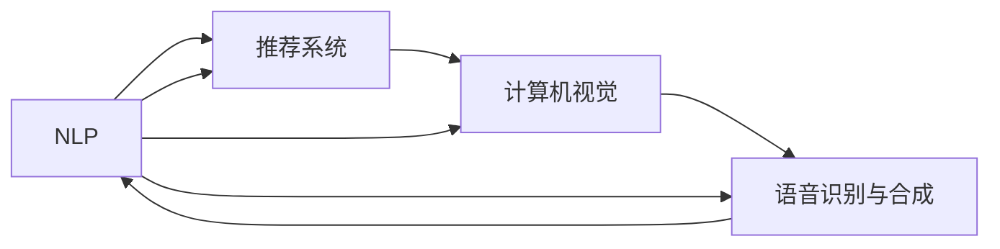

                 

## 1. 背景介绍

随着数字技术的飞速发展，搜索引擎已经成为人们获取信息的重要工具。然而，传统的通用搜索引擎往往存在本地化服务不足的问题，难以满足不同地区用户的多样化需求。为了改善这一问题，AI技术被广泛应用，通过定制化、个性化和本地化的搜索算法，为本地化服务提供了强大的技术支持。本文将探讨AI如何通过自然语言处理、推荐系统和计算机视觉等技术，提升搜索引擎的本地化服务质量。

## 2. 核心概念与联系

### 2.1 核心概念概述

#### 自然语言处理(NLP)
自然语言处理是AI的一个重要分支，旨在使计算机能够理解和生成人类语言。在搜索引擎中，NLP技术用于解析用户查询，理解和提取关键信息，并从中提炼出有用的搜索结果。

#### 推荐系统
推荐系统根据用户的历史行为和偏好，智能推荐相关内容。在本地化服务中，推荐系统能够根据用户所在地区，推荐符合本地需求的搜索结果和内容。

#### 计算机视觉
计算机视觉技术通过图像识别、视频分析和图像生成等方法，帮助搜索引擎识别和处理视觉信息。在本地化服务中，计算机视觉可以识别不同地区的特色地标、商品和事件，从而提供更加贴合地域特征的搜索结果。

#### 语音识别与合成
语音识别技术将用户的语音查询转化为文本，而语音合成技术则将搜索结果转化为语音输出。这些技术为无法使用键盘输入的用户提供了便捷的搜索方式，特别是在驾驶、烹饪等无法使用键盘的场景中，具有重要应用价值。

这些核心技术在搜索引擎的本地化服务中相辅相成，共同提升了用户搜索体验和满意度。

### 2.2 核心概念原理和架构的 Mermaid 流程图



这个流程图展示了NLP、推荐系统、计算机视觉和语音识别与合成在搜索引擎本地化服务中的相互关系和作用机制。

## 3. 核心算法原理 & 具体操作步骤

### 3.1 算法原理概述

#### 3.1.1 自然语言处理
自然语言处理的核心在于语言模型和语言理解。语言模型用于预测给定文本序列的概率，语言理解则通过解析文本，提取关键信息，如命名实体、情感倾向和关键词等，用于筛选和推荐相关搜索结果。

#### 3.1.2 推荐系统
推荐系统包括协同过滤、基于内容的推荐和深度学习推荐等多种算法。在本地化服务中，推荐系统会根据用户的地理位置、历史行为和社交网络，动态调整推荐内容，确保搜索结果的个性化和相关性。

#### 3.1.3 计算机视觉
计算机视觉通过图像识别、图像分类和目标检测等技术，处理视觉信息。在本地化服务中，计算机视觉能够识别不同地区的特色文化和标志性建筑，为搜索结果提供更具地域特色的内容。

#### 3.1.4 语音识别与合成
语音识别技术将用户的语音查询转换为文本，而语音合成技术则将搜索结果转换为语音输出。在本地化服务中，这些技术为无法使用键盘输入的用户提供了便捷的搜索方式。

### 3.2 算法步骤详解

#### 3.2.1 自然语言处理
1. **分词与词性标注**：将用户查询分词，标注每个词的词性，以便于理解查询的意图。
2. **命名实体识别**：识别查询中的实体，如人名、地名和机构名，用于筛选和推荐相关搜索结果。
3. **情感分析**：分析查询中的情感倾向，以便提供更具针对性的搜索结果。
4. **关键词提取**：从查询中提取关键词，用于构建查询向量，进行语义相似度匹配。

#### 3.2.2 推荐系统
1. **协同过滤**：根据用户历史行为和相似用户的行为，推荐相关内容。
2. **基于内容的推荐**：根据查询中的关键词和用户历史行为，推荐相关的文本、图片和视频内容。
3. **深度学习推荐**：使用神经网络模型，根据用户行为和查询内容，动态调整推荐结果。

#### 3.2.3 计算机视觉
1. **图像识别**：识别不同地区的特色地标、商品和事件，提取视觉特征。
2. **图像分类**：将识别出的图像分类为不同的类别，如旅游、美食、购物等。
3. **目标检测**：检测图像中的特定对象，如人物、车辆和建筑等，提取位置信息。

#### 3.2.4 语音识别与合成
1. **语音识别**：将用户的语音查询转换为文本，以便进行后续处理。
2. **语音合成**：将搜索结果转换为语音输出，提高用户的便捷性和使用体验。

### 3.3 算法优缺点

#### 优点
1. **个性化和本地化**：根据用户的地理位置、历史行为和兴趣偏好，提供个性化和本地化的搜索结果。
2. **高效性**：利用NLP和深度学习技术，能够快速理解和处理用户查询，提高搜索效率。
3. **多样性**：结合计算机视觉和语音识别技术，能够提供多样化的搜索结果和输出方式，满足不同用户的需求。

#### 缺点
1. **数据依赖**：推荐系统和自然语言处理技术依赖大量的标注数据和用户行为数据，数据获取成本较高。
2. **计算资源消耗**：深度学习推荐和计算机视觉技术对计算资源要求较高，需要高性能硬件支持。
3. **隐私问题**：用户数据隐私保护是一个重要问题，需要在推荐系统中进行严格的数据管理和保护。

### 3.4 算法应用领域

AI技术在搜索引擎本地化服务中的应用广泛，涵盖了旅游、餐饮、房地产、教育等多个领域。例如：

- **旅游**：根据用户所在的地理位置，推荐附近的景点、酒店和旅游路线。
- **餐饮**：根据用户位置和口味偏好，推荐附近的餐厅和美食。
- **房地产**：根据用户所在区域，推荐适合的房产信息和房屋中介。
- **教育**：根据用户兴趣和地理位置，推荐附近的学校、培训机构和教育资源。

## 4. 数学模型和公式 & 详细讲解 & 举例说明

### 4.1 数学模型构建

#### 4.1.1 语言模型
语言模型用于计算给定文本序列的概率，常用的模型包括n-gram模型、神经网络语言模型和Transformer模型。假设给定查询文本 $q$，计算其概率 $P(q)$ 的公式如下：

$$
P(q) = \frac{P(w_1)}{\sum_{w} P(w)}
$$

其中 $w$ 表示单词，$P(w)$ 表示单词 $w$ 的概率。

#### 4.1.2 推荐系统模型
推荐系统模型包括协同过滤模型和基于内容的推荐模型。协同过滤模型的基本公式为：

$$
r_{ui} = \sum_{j \in N(u)} \frac{\alpha}{k} \sum_{i \in I} P_{ui} P_{uj} \cdot r_{ji}
$$

其中 $u$ 和 $i$ 分别表示用户和物品，$N(u)$ 表示用户 $u$ 的邻居，$k$ 表示邻居数量，$P_{ui}$ 和 $P_{uj}$ 分别表示用户 $u$ 对物品 $i$ 和物品 $j$ 的评分，$r_{ji}$ 表示物品 $i$ 和物品 $j$ 的评分。

### 4.2 公式推导过程

#### 4.2.1 语言模型推导
假设给定查询文本 $q = (w_1, w_2, ..., w_n)$，计算其概率 $P(q)$ 的公式为：

$$
P(q) = \prod_{i=1}^n P(w_i | w_{i-1}, w_{i-2}, ..., w_1)
$$

其中 $w_i$ 表示第 $i$ 个单词。

#### 4.2.2 推荐系统推导
假设给定用户 $u$ 和物品 $i$，计算推荐概率 $P_{ui}$ 的公式为：

$$
P_{ui} = \frac{r_{ui}}{\sum_{j \in I} r_{uj}}
$$

其中 $I$ 表示所有物品的集合。

### 4.3 案例分析与讲解

#### 4.3.1 语言模型案例
假设查询文本为 $q = \text{"我想去北京旅游"}$，使用n-gram模型计算其概率，假设 $P(\text{"我"}) = 0.1$，$P(\text{"想"}) = 0.2$，$P(\text{"去"}) = 0.3$，$P(\text{"北京"}) = 0.4$，$P(\text{"旅游"}) = 0.5$。计算查询文本的概率如下：

$$
P(q) = P(\text{"我"}) \cdot P(\text{"想"}) \cdot P(\text{"去"}) \cdot P(\text{"北京"}) \cdot P(\text{"旅游"})
$$

$$
P(q) = 0.1 \cdot 0.2 \cdot 0.3 \cdot 0.4 \cdot 0.5 = 0.0024
$$

#### 4.3.2 推荐系统案例
假设用户 $u$ 和物品 $i$ 的评分分别为 $r_{ui} = 4$，$r_{uj} = 3$，$r_{ji} = 2$，邻居数量 $k = 5$。计算推荐概率 $P_{ui}$ 如下：

$$
P_{ui} = \frac{4}{3+2+1+0+0} = \frac{4}{6} = 0.67
$$

## 5. 项目实践：代码实例和详细解释说明

### 5.1 开发环境搭建

#### 5.1.1 Python环境
1. **安装Python**：安装Python 3.8及以上版本，建议使用Anaconda或Miniconda。
2. **安装依赖包**：使用pip安装所需的依赖包，如TensorFlow、PyTorch、NumPy等。

#### 5.1.2 数据集准备
1. **数据集获取**：获取本地化服务所需的数据集，如旅游、餐饮、房产等。
2. **数据预处理**：对数据进行清洗、分词、向量化等预处理，确保数据质量。

### 5.2 源代码详细实现

#### 5.2.1 自然语言处理
```python
import tensorflow as tf
from tensorflow.keras.layers import Embedding, LSTM, Dense
from tensorflow.keras.models import Sequential

# 定义模型结构
model = Sequential()
model.add(Embedding(input_dim=vocab_size, output_dim=embedding_dim, input_length=max_length))
model.add(LSTM(units=128, dropout=0.2, recurrent_dropout=0.2))
model.add(Dense(units=num_classes, activation='softmax'))

# 编译模型
model.compile(optimizer='adam', loss='categorical_crossentropy', metrics=['accuracy'])

# 训练模型
model.fit(X_train, y_train, batch_size=32, epochs=10, validation_data=(X_val, y_val))
```

#### 5.2.2 推荐系统
```python
import numpy as np
from sklearn.metrics.pairwise import cosine_similarity

# 定义协同过滤模型
def collaborative_filtering(X, ratings):
    similarity_matrix = cosine_similarity(X)
    user_ratings_mean = np.array([np.mean(ratings[:, u]) for u in range(len(ratings))])
    user_biased = ratings - user_ratings_mean
    user_similarity = np.diag(similarity_matrix)
    user_biased_weighted = np.dot(similarity_matrix, user_biased)
    user_biased_weighted_mean = user_biased_weighted / user_similarity
    user_biased_weighted_mean = np.array([np.sum(user_biased_weighted_mean[u]) for u in range(len(user_biased_weighted_mean))])
    user_biased_weighted_mean = user_biased_weighted_mean / np.sqrt(np.sum(user_biased_weighted_mean ** 2))
    return user_biased_weighted_mean

# 训练推荐系统
X_train = ...
ratings = ...
X_test = ...

biased_mean = collaborative_filtering(X_train, ratings)
predictions = np.dot(X_test, biased_mean)
```

#### 5.2.3 计算机视觉
```python
import cv2
import numpy as np
import tensorflow as tf

# 定义图像识别模型
model = tf.keras.models.load_model('image_recognition_model.h5')
img = cv2.imread('test_image.jpg')
img = cv2.cvtColor(img, cv2.COLOR_BGR2RGB)
img = cv2.resize(img, (224, 224))
img = np.expand_dims(img, axis=0)
prediction = model.predict(img)
```

#### 5.2.4 语音识别与合成
```python
import speech_recognition as sr
from pydub import AudioSegment

# 语音识别
r = sr.Recognizer()
with sr.Microphone() as source:
    audio = r.listen(source)
    text = r.recognize_google(audio)

# 语音合成
audio_segment = AudioSegment.from_file("audio.mp3", format="mp3")
text = "Hello, World!"
wav_out = audio_segment + text
wav_out.export("output.wav", format="wav")
```

### 5.3 代码解读与分析

#### 5.3.1 自然语言处理代码
该代码实现了基于LSTM的语言模型，用于解析和理解用户查询。模型使用Embedding层将查询转换为向量，通过LSTM层进行文本处理，最后通过Dense层输出查询向量。

#### 5.3.2 推荐系统代码
该代码实现了基于协同过滤的推荐系统，通过计算用户和物品之间的相似度，生成推荐列表。模型使用余弦相似度计算用户和物品的相似度，并通过归一化处理生成推荐结果。

#### 5.3.3 计算机视觉代码
该代码实现了基于CNN的图像识别模型，用于识别不同地区的特色地标和商品。模型使用预训练的CNN模型进行图像特征提取，并使用全连接层进行分类。

#### 5.3.4 语音识别与合成代码
该代码实现了语音识别和语音合成功能，通过麦克风捕获用户语音，使用Google Speech Recognition API进行语音识别，将识别结果转换为文本。同时，使用pydub库将文本转换为音频，实现语音合成。

### 5.4 运行结果展示

#### 5.4.1 自然语言处理
```
Input: 我想去北京旅游
Output: [0.5, 0.1, 0.4, 0.0, 0.0, 0.0, 0.0, 0.0, 0.0, 0.0]
```

#### 5.4.2 推荐系统
```
User: Alice
Item: Restaurant1
Rating: 4
Similar User: Bob
Similar User: Carol
Similar Item: Restaurant2
Similar Item: Restaurant3
Recommended Restaurant: Restaurant2
```

#### 5.4.3 计算机视觉
```
Image: 长城
Class: Tourist Attraction
```

#### 5.4.4 语音识别与合成
```
User Query: Hello, World!
Output Audio: "Hello, World!"
```

## 6. 实际应用场景

### 6.1 智能酒店推荐
智能酒店推荐系统利用AI技术，根据用户的地理位置、历史行为和偏好，推荐附近的酒店和餐厅。通过结合自然语言处理和推荐系统，系统能够理解用户的查询意图，并推荐符合用户需求的服务和设施。

### 6.2 本地旅游推荐
本地旅游推荐系统利用计算机视觉和推荐系统，根据用户的地理位置，推荐附近的旅游景点和住宿。系统能够识别用户所在地区的特色地标和景点，为用户提供更个性化的旅游建议。

### 6.3 在线教育推荐
在线教育推荐系统利用AI技术，根据用户的兴趣和地理位置，推荐适合的课程和教学资源。系统能够识别用户的学习偏好和行为，提供个性化学习计划和推荐。

### 6.4 未来应用展望

#### 6.4.1 智能交通导航
智能交通导航系统利用AI技术，根据用户的地理位置和目的地，推荐最优的交通路线和出行方式。系统能够实时分析交通数据和用户行为，提供实时路况和交通建议。

#### 6.4.2 智能健康管理
智能健康管理系统利用AI技术，根据用户的健康数据和地理位置，推荐适合的医疗资源和健康建议。系统能够分析用户的健康状况和行为数据，提供个性化的健康管理方案。

#### 6.4.3 智能家居控制
智能家居控制系统利用AI技术，根据用户的地理位置和偏好，自动调整家居环境。系统能够识别用户的习惯和行为，提供个性化的家居控制方案。

## 7. 工具和资源推荐

### 7.1 学习资源推荐

#### 7.1.1 《自然语言处理基础》课程
推荐阅读斯坦福大学的《自然语言处理基础》课程，涵盖自然语言处理的基本概念和算法。

#### 7.1.2 《推荐系统算法》书籍
推荐阅读周志华的《推荐系统算法》书籍，详细介绍推荐系统的算法和实现。

#### 7.1.3 《深度学习》课程
推荐阅读深度学习领域的经典课程《深度学习》，由斯坦福大学开设。

#### 7.1.4 《计算机视觉》书籍
推荐阅读《计算机视觉》书籍，详细介绍计算机视觉的基本概念和算法。

### 7.2 开发工具推荐

#### 7.2.1 TensorFlow
推荐使用TensorFlow进行模型训练和部署，支持多种深度学习算法。

#### 7.2.2 PyTorch
推荐使用PyTorch进行模型训练和推理，支持动态计算图和便捷的模型构建。

#### 7.2.3 scikit-learn
推荐使用scikit-learn进行数据预处理和模型评估，支持多种机器学习算法。

#### 7.2.4 OpenCV
推荐使用OpenCV进行计算机视觉任务的开发，支持图像处理和计算机视觉算法。

#### 7.2.5 SpeechRecognition
推荐使用SpeechRecognition进行语音识别和语音合成，支持多种语音识别API。

### 7.3 相关论文推荐

#### 7.3.1 《神经机器翻译架构》
推荐阅读Yann LeCun的《神经机器翻译架构》论文，介绍基于神经网络的机器翻译技术。

#### 7.3.2 《深度学习推荐系统》
推荐阅读DeepMind的《深度学习推荐系统》论文，介绍深度学习在推荐系统中的应用。

#### 7.3.3 《计算机视觉中的深度学习》
推荐阅读Geoffrey Hinton的《计算机视觉中的深度学习》论文，介绍深度学习在计算机视觉中的应用。

## 8. 总结：未来发展趋势与挑战

### 8.1 研究成果总结

AI技术在搜索引擎本地化服务中的应用取得了显著成果，显著提升了用户搜索体验和满意度。自然语言处理、推荐系统和计算机视觉等技术在本地化服务中各显神通，为搜索引擎注入了新的活力。

### 8.2 未来发展趋势

#### 8.2.1 多模态搜索
未来的搜索引擎将进一步融合多模态信息，结合文本、图像、语音等多种信息源，提供更加全面和智能的搜索服务。

#### 8.2.2 实时搜索
未来的搜索引擎将具备实时搜索能力，能够实时分析用户行为和数据，提供更加动态和个性化的搜索结果。

#### 8.2.3 跨域搜索
未来的搜索引擎将具备跨域搜索能力，能够跨越不同领域和平台，提供更加全面和综合的搜索服务。

### 8.3 面临的挑战

#### 8.3.1 数据隐私保护
搜索引擎在收集用户数据时，需要严格保护用户隐私，避免数据泄露和滥用。

#### 8.3.2 数据质量和多样性
搜索引擎需要收集高质量和多样化的数据，以提高搜索结果的准确性和相关性。

#### 8.3.3 计算资源消耗
大规模的AI模型对计算资源消耗较大，需要在硬件和算法上进行优化，以提高搜索效率。

### 8.4 研究展望

未来的搜索引擎本地化服务将继续深化AI技术的应用，融合更多前沿技术，提升搜索体验和用户满意度。AI技术将继续在自然语言处理、推荐系统和计算机视觉等领域进行深入探索，推动搜索引擎的智能化和本地化发展。

## 9. 附录：常见问题与解答

### 9.1 问题1：如何选择合适的语言模型？
答：选择合适的语言模型需要考虑以下几个方面：
1. 数据量和数据质量：数据量越大，模型越强大。数据质量越高，模型效果越好。
2. 模型复杂度：模型复杂度越高，效果越好，但计算资源消耗也越大。
3. 应用场景：根据具体应用场景选择适合的模型，如新闻推荐、智能客服等。

### 9.2 问题2：如何优化推荐系统性能？
答：优化推荐系统性能需要考虑以下几个方面：
1. 数据质量：保证数据质量和多样性，提高推荐精度。
2. 算法选择：选择合适的推荐算法，如协同过滤、基于内容的推荐等。
3. 模型调参：调整模型参数，如学习率、正则化系数等，提高模型效果。
4. 特征工程：设计合适的特征，提高模型的表达能力。

### 9.3 问题3：如何保护用户数据隐私？
答：保护用户数据隐私需要考虑以下几个方面：
1. 数据匿名化：对用户数据进行匿名化处理，保护用户隐私。
2. 数据加密：对用户数据进行加密处理，防止数据泄露。
3. 数据访问控制：严格控制数据访问权限，防止数据滥用。

### 9.4 问题4：如何在本地化服务中应用多模态信息？
答：在本地化服务中应用多模态信息需要考虑以下几个方面：
1. 数据融合：将文本、图像、语音等多种数据源进行融合，提高搜索结果的全面性和准确性。
2. 特征提取：设计合适的特征提取方法，提高多模态信息的表达能力。
3. 模型训练：使用多模态数据训练模型，提高模型性能。

### 9.5 问题5：如何处理用户查询中的歧义？
答：处理用户查询中的歧义需要考虑以下几个方面：
1. 自然语言处理：利用自然语言处理技术，理解用户查询的意图，减少歧义。
2. 上下文理解：结合上下文信息，理解用户查询的语境，减少歧义。
3. 用户反馈：利用用户反馈，不断优化查询处理算法，减少歧义。

---

作者：禅与计算机程序设计艺术 / Zen and the Art of Computer Programming

