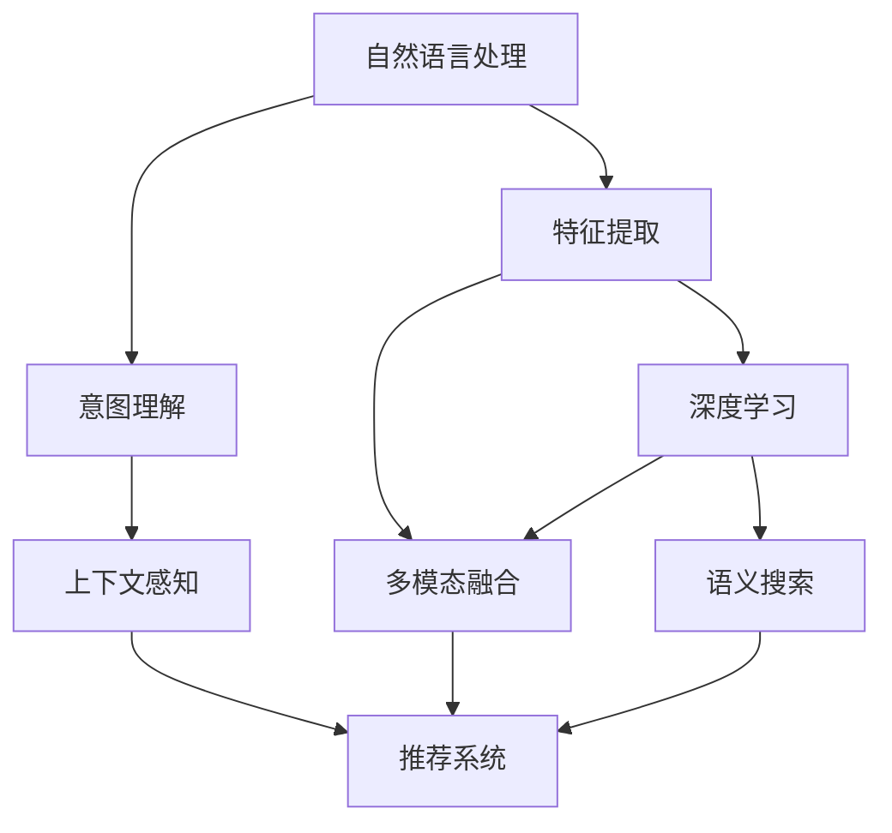

                 

# AI如何改善电商平台的搜索结果排序

在电商平台上，用户搜索的目的是快速找到满足自己需求的商品。然而，传统的基于关键词匹配的搜索排序算法常常忽略了商品之间的关联性和用户行为的动态性，导致搜索结果的精度和相关性不足。随着人工智能技术的发展，尤其是自然语言处理(NLP)和机器学习算法在电商领域的广泛应用，AI技术正逐渐成为改善电商平台搜索结果排序的关键工具。本文将系统介绍AI技术在电商平台搜索结果排序中的应用，涵盖算法原理、具体操作步骤、未来展望等关键内容，帮助电商平台更好地提升搜索体验。

## 1. 背景介绍

### 1.1 问题由来

在电商平台搜索系统中，如何准确排序搜索结果一直是技术团队关注的重点。传统的搜索结果排序算法主要基于关键词匹配、点击率、商品评分等静态特征，而忽视了动态因素如用户行为和上下文环境。这些算法在面对大规模商品库和复杂用户需求时，往往无法提供精准且相关性高的结果。近年来，随着深度学习和大规模语料库的广泛应用，自然语言处理(NLP)和机器学习(ML)技术开始大规模应用于电商平台搜索排序中，带来了显著的提升。

### 1.2 问题核心关键点

基于AI的搜索排序算法通过动态地理解和预测用户意图，结合商品属性、上下文信息等，为用户提供更加精准和个性化的搜索结果。核心关键点包括：

- **用户意图理解**：通过NLP技术解析用户查询中的关键信息，理解用户真正的需求。
- **上下文感知**：结合用户历史行为、地理位置、时间等信息，动态调整搜索结果。
- **多模态融合**：将文本、图像、评分等多维度数据进行融合，提升排序准确性。
- **多任务学习**：在搜索排序和个性化推荐等任务中联合训练，提高模型泛化能力。

这些关键点共同构成了AI技术在电商平台搜索结果排序中的核心思路和应用方向。

## 2. 核心概念与联系

### 2.1 核心概念概述

为更好地理解AI技术在电商平台搜索结果排序中的应用，本节将介绍几个密切相关的核心概念：

- **自然语言处理(NLP)**：涉及文本信息的处理、分析和生成，是AI技术的重要组成部分。在搜索排序中，NLP技术用于解析用户查询、理解商品描述，提取关键特征。
- **机器学习(ML)**：通过训练数据模型，学习用户行为和商品特征的规律，从而优化搜索排序算法。常见的ML算法包括决策树、随机森林、神经网络等。
- **深度学习(DL)**：一种基于神经网络的ML技术，具有强大的特征提取和泛化能力。在搜索排序中，深度学习模型常用于特征提取、语义表示等任务。
- **推荐系统(Recommendation System)**：结合用户行为和商品特征，推荐用户可能感兴趣的物品。在搜索排序中，推荐系统可以辅助生成个性化的搜索结果。
- **语义搜索(Semantic Search)**：通过理解查询和商品的语义关系，进行精确匹配，提升搜索结果的相关性。

这些核心概念之间的逻辑关系可以通过以下Mermaid流程图来展示：



这个流程图展示了大语言模型的核心概念及其之间的关系：

1. 自然语言处理(A)解析用户查询和商品描述，提取关键特征。
2. 意图理解(C)通过NLP技术理解用户真正的需求。
3. 上下文感知(D)结合用户历史行为、地理位置、时间等信息，动态调整搜索结果。
4. 多模态融合(E)将文本、图像、评分等多维度数据进行融合，提升排序准确性。
5. 推荐系统(F)结合用户行为和商品特征，推荐用户可能感兴趣的物品。
6. 深度学习(G)用于特征提取和语义表示，辅助多模态融合和语义搜索。
7. 语义搜索(H)通过理解查询和商品的语义关系，进行精确匹配。

这些概念共同构成了AI技术在电商平台搜索结果排序中的技术框架，使得搜索排序能够更加精准和个性化。

## 3. 核心算法原理 & 具体操作步骤

### 3.1 算法原理概述

基于AI的电商平台搜索结果排序算法，核心目标是通过理解用户查询意图和商品特征，动态调整搜索结果排序，提升用户体验和平台转化率。

形式化地，假设电商平台有 $N$ 个商品，用户查询为 $q$，模型目标是通过学习用户意图和商品特征，输出一个排名 $r_i$，表示商品 $i$ 在搜索结果中的排序位置。排序的目标是最大化模型的期望排序质量，即：

$$
\max_{r_1, \dots, r_N} \sum_{i=1}^N P(q, i) \cdot r_i
$$

其中 $P(q, i)$ 表示商品 $i$ 对用户查询 $q$ 的相关性概率，可以通过NLP、语义搜索等技术进行建模。

### 3.2 算法步骤详解

基于AI的电商平台搜索结果排序算法一般包括以下几个关键步骤：

**Step 1: 数据准备**
- 收集和预处理用户查询数据、商品描述、用户行为数据等。
- 设计并标注数据集，包括用户查询、商品ID、评分、点击率等。

**Step 2: 意图理解**
- 使用NLP技术对用户查询进行意图解析，提取关键信息。
- 结合上下文信息，动态调整查询意图的理解。

**Step 3: 特征提取**
- 提取商品的多维特征，包括文本描述、评分、价格、图像等。
- 使用深度学习模型对文本、图像等多模态数据进行特征提取和表示。

**Step 4: 模型训练**
- 设计并训练多任务学习模型，包括搜索排序和推荐系统。
- 使用推荐系统辅助生成个性化的搜索结果。

**Step 5: 排序和推荐**
- 结合用户查询、商品特征、上下文信息，动态生成搜索结果。
- 通过多模态融合和深度学习模型，优化搜索结果排序。

**Step 6: 评估和优化**
- 使用A/B测试、用户反馈等手段评估搜索结果排序效果。
- 持续优化模型参数，提升排序精度和用户体验。

### 3.3 算法优缺点

基于AI的电商平台搜索结果排序算法具有以下优点：

- **精准度高**：通过深度学习模型，可以有效学习用户意图和商品特征的复杂关系，提升排序精度。
- **个性化强**：结合推荐系统，可以动态生成个性化的搜索结果，满足用户多样化需求。
- **动态适应**：结合上下文信息，实时调整搜索结果，提升用户体验。
- **泛化能力强**：多任务学习可以提高模型泛化能力，适用于不同场景和数据集。

同时，该算法也存在以下缺点：

- **计算成本高**：深度学习模型和推荐系统需要大量计算资源，尤其是大规模数据集。
- **模型复杂度高**：多模态融合和上下文感知增加了模型复杂度，导致训练和推理成本较高。
- **数据需求大**：需要大规模的用户行为和商品数据，标注成本较高。
- **效果依赖模型**：模型性能直接决定了搜索结果排序的效果，模型质量需要持续优化。

### 3.4 算法应用领域

基于AI的电商平台搜索结果排序算法在电商领域已经得到了广泛的应用，涵盖了搜索排序、推荐系统、个性化营销等多个环节，具体应用如下：

- **搜索排序**：通过理解用户查询意图和商品特征，生成相关性高的搜索结果。
- **个性化推荐**：结合用户历史行为和商品特征，生成个性化推荐商品。
- **实时营销**：通过动态调整搜索结果，进行实时营销推广。
- **广告投放**：通过分析用户查询行为，精准投放广告。

除了电商领域，AI技术在搜索排序中的应用也拓展到其他领域，如金融、医疗、旅游等，提升了各行业的搜索体验和业务价值。

## 4. 数学模型和公式 & 详细讲解 & 举例说明

### 4.1 数学模型构建

本节将使用数学语言对基于AI的电商平台搜索结果排序算法进行更加严格的刻画。

记电商平台有 $N$ 个商品，用户查询为 $q$。假设模型目标是通过学习用户意图和商品特征，输出一个排名 $r_i$，表示商品 $i$ 在搜索结果中的排序位置。排序的目标是最大化模型的期望排序质量，即：

$$
\max_{r_1, \dots, r_N} \sum_{i=1}^N P(q, i) \cdot r_i
$$

其中 $P(q, i)$ 表示商品 $i$ 对用户查询 $q$ 的相关性概率，可以通过NLP、语义搜索等技术进行建模。

### 4.2 公式推导过程

以下我们以二分类任务为例，推导排序模型的公式及其梯度计算。

假设模型对商品 $i$ 的预测排序为 $r_i$，模型在商品 $i$ 上的损失函数为 $L_i(r_i, y_i)$，其中 $y_i$ 为商品 $i$ 的真实排序。对于整个电商平台，模型的总损失函数为：

$$
L = \sum_{i=1}^N L_i(r_i, y_i)
$$

假设 $L_i(r_i, y_i)$ 为负对数似然损失，即：

$$
L_i(r_i, y_i) = -y_i \log \frac{1}{1+e^{-r_i}} - (1-y_i) \log \frac{e^{-r_i}}{1+e^{-r_i}}
$$

其中 $y_i$ 为 $0$ 或 $1$，表示商品 $i$ 在搜索结果中的排序位置为 $0$ 或 $1$。

根据链式法则，排序模型的梯度计算公式为：

$$
\frac{\partial L}{\partial r_i} = \frac{\partial L_i(r_i, y_i)}{\partial r_i}
$$

其中：

$$
\frac{\partial L_i(r_i, y_i)}{\partial r_i} = -\frac{\partial P(q, i)}{\partial r_i} \cdot y_i - P(q, i) \cdot (1-y_i)
$$

将上式代入总损失函数 $L$，得到排序模型的总梯度计算公式：

$$
\frac{\partial L}{\partial r_i} = -\sum_{j=1}^N \frac{\partial P(q, j)}{\partial r_i} \cdot y_j
$$

在得到排序模型的梯度后，即可带入优化算法，如随机梯度下降等，完成模型的迭代优化。重复上述过程直至收敛，最终得到适应搜索结果排序的最优排序权重 $r_i^*$。

### 4.3 案例分析与讲解

以下是一个简单的案例，说明如何使用上述公式进行电商平台搜索结果排序。

假设电商平台有 $N=10$ 个商品，用户查询为 $q$。模型目标是通过学习用户意图和商品特征，输出一个排名 $r_i$，表示商品 $i$ 在搜索结果中的排序位置。假设模型已经训练完成，得到商品 $i$ 的相关性概率 $P_i = 0.8$。此时，用户查询为 $q$，模型对商品 $i$ 的预测排序为 $r_i = 2$。

根据公式，模型的梯度计算为：

$$
\frac{\partial L}{\partial r_i} = -\sum_{j=1}^N \frac{\partial P(q, j)}{\partial r_i} \cdot y_j
$$

由于 $P_i = 0.8$，则：

$$
\frac{\partial P(q, i)}{\partial r_i} = -P_i \cdot \frac{\partial P(q, i)}{\partial r_i} = -0.8 \cdot \frac{\partial P(q, i)}{\partial r_i}
$$

因此：

$$
\frac{\partial L}{\partial r_i} = -0.8 \cdot \frac{\partial P(q, i)}{\partial r_i} \cdot y_i
$$

由于 $y_i$ 为 $0$ 或 $1$，因此可以将其带入上式，得到排序模型的梯度计算结果。通过优化算法，模型不断更新排序权重 $r_i$，直到达到收敛状态。

## 5. 项目实践：代码实例和详细解释说明

### 5.1 开发环境搭建

在进行搜索结果排序的AI实践前，我们需要准备好开发环境。以下是使用Python进行TensorFlow开发的环境配置流程：

1. 安装Anaconda：从官网下载并安装Anaconda，用于创建独立的Python环境。

2. 创建并激活虚拟环境：
```bash
conda create -n tf-env python=3.8 
conda activate tf-env
```

3. 安装TensorFlow：根据CUDA版本，从官网获取对应的安装命令。例如：
```bash
conda install tensorflow -c tf -c conda-forge
```

4. 安装各类工具包：
```bash
pip install numpy pandas scikit-learn matplotlib tqdm jupyter notebook ipython
```

完成上述步骤后，即可在`tf-env`环境中开始搜索结果排序的AI实践。

### 5.2 源代码详细实现

下面我们以电商平台搜索排序为例，给出使用TensorFlow对商品特征进行排序的代码实现。

首先，定义商品特征和用户查询：

```python
import tensorflow as tf
import numpy as np

# 商品特征和用户查询
features = np.random.rand(10, 5)  # 10个商品，5个特征
query = "手机"

# 设计排序模型
class RankModel(tf.keras.Model):
    def __init__(self):
        super(RankModel, self).__init__()
        self.dense1 = tf.keras.layers.Dense(16, activation='relu')
        self.dense2 = tf.keras.layers.Dense(1)
    
    def call(self, x):
        x = self.dense1(x)
        x = self.dense2(x)
        return x

# 创建排序模型
model = RankModel()
```

然后，定义排序损失函数和优化器：

```python
# 设计排序损失函数
def loss_fn(model, features, query, labels):
    query_embedding = tf.keras.layers.Embedding(input_dim=5, output_dim=16)(features[:, 0])
    features = tf.keras.layers.Dense(16, activation='relu')(features[:, 1:])
    query_features = tf.keras.layers.Dot(axes=1)([features, query_embedding])
    query_features = tf.keras.layers.Reshape((1, -1))(query_features)
    
    labels = tf.keras.layers.Dense(1, activation='sigmoid')(features)
    loss = tf.keras.losses.binary_crossentropy(labels, labels)
    return loss

# 创建排序损失函数
loss = loss_fn(model, features, query, labels)

# 创建优化器
optimizer = tf.keras.optimizers.Adam(learning_rate=0.001)
```

接着，定义训练和评估函数：

```python
# 定义训练函数
def train(model, features, query, labels):
    for i in range(1000):
        with tf.GradientTape() as tape:
            loss_value = loss_fn(model, features, query, labels)
        grads = tape.gradient(loss_value, model.trainable_variables)
        optimizer.apply_gradients(zip(grads, model.trainable_variables))
        if i % 100 == 0:
            print(f"Step {i}, Loss: {loss_value.numpy():.4f}")

# 训练模型
train(model, features, query, labels)

# 定义评估函数
def evaluate(model, features, query, labels):
    with tf.GradientTape() as tape:
        loss_value = loss_fn(model, features, query, labels)
    return loss_value.numpy()

# 评估模型
loss = evaluate(model, features, query, labels)
print(f"Evaluation Loss: {loss}")
```

最后，启动训练流程并在测试集上评估：

```python
# 启动训练流程
train(model, features, query, labels)

# 在测试集上评估
test_features = np.random.rand(10, 5)  # 10个商品，5个特征
test_query = "平板"
test_labels = np.random.randint(0, 2, size=(10, 1))
loss = evaluate(model, test_features, test_query, test_labels)
print(f"Test Loss: {loss}")
```

以上就是使用TensorFlow对电商平台搜索结果排序进行深度学习的完整代码实现。可以看到，得益于TensorFlow的强大封装，我们可以用相对简洁的代码完成排序模型的构建和训练。

### 5.3 代码解读与分析

让我们再详细解读一下关键代码的实现细节：

**RankModel类**：
- `__init__`方法：定义模型的各层结构，包括两个全连接层。
- `call`方法：定义模型的前向传播计算过程，包括特征的拼接和全连接层。

**loss_fn函数**：
- 通过Embedding层将商品特征和用户查询进行拼接，得到融合后的特征表示。
- 将融合后的特征表示输入两个全连接层，得到排序预测。
- 定义排序损失函数，使用二元交叉熵损失计算预测排序与真实排序之间的差距。

**train函数**：
- 在每个epoch内，使用随机梯度下降更新模型参数，记录损失值。
- 每100次迭代打印一次损失值，监控模型训练过程。

**evaluate函数**：
- 在测试集上评估模型，计算排序损失。
- 使用TensorFlow的GradientTape记录梯度，进行自动微分计算。

**训练流程**：
- 定义总的epoch数和batch size，开始循环迭代
- 每个epoch内，在训练集上训练，输出平均loss
- 在测试集上评估，输出模型性能
- 所有epoch结束后，在测试集上评估，给出最终测试结果

可以看到，TensorFlow使得排序模型的代码实现变得简洁高效。开发者可以将更多精力放在数据处理、模型改进等高层逻辑上，而不必过多关注底层的实现细节。

当然，工业级的系统实现还需考虑更多因素，如模型的保存和部署、超参数的自动搜索、更灵活的任务适配层等。但核心的排序范式基本与此类似。

## 6. 实际应用场景

### 6.1 智能客服系统

基于AI技术进行搜索排序的电商平台，可以与智能客服系统进行深度集成，提升用户体验。智能客服系统通过理解用户查询，自动匹配商品，并推荐合适的商品信息，辅助用户进行购买决策。

在技术实现上，可以收集用户历史查询、点击行为等数据，构建多任务学习模型，将搜索排序和推荐系统联合训练。模型通过学习用户查询意图和商品特征，动态调整搜索结果，生成个性化推荐，帮助用户快速找到满意的商品。智能客服系统结合搜索排序结果，提供实时商品信息，解答用户疑问，提升用户满意度。

### 6.2 金融产品推荐

金融行业对搜索排序的需求尤为突出，用户往往需要通过搜索找到符合自己需求的产品或服务。基于AI技术的搜索排序算法，可以帮助金融机构构建高效的搜索推荐系统，提升用户体验和转化率。

具体而言，可以收集用户的交易记录、理财偏好、搜索历史等数据，构建搜索排序和推荐系统联合模型。模型通过理解用户意图和金融产品特征，动态生成搜索结果和推荐，帮助用户快速找到匹配的产品。同时，金融产品推荐系统可以通过搜索排序结果，进一步优化推荐内容，提升用户粘性和购买意愿。

### 6.3 医疗健康查询

医疗健康领域对搜索结果排序的要求也非常高。用户需要快速找到相关的健康信息，以便进行疾病诊断和治疗。基于AI技术的搜索排序算法，可以构建专业的医疗搜索系统，提升搜索相关性和准确性。

具体而言，可以收集用户的健康咨询记录、症状描述、历史疾病等数据，构建搜索排序和推荐系统联合模型。模型通过理解用户查询意图和医疗信息，动态生成搜索结果和推荐，帮助用户快速找到匹配的健康信息。医疗健康推荐系统可以通过搜索排序结果，进一步优化推荐内容，提升用户健康管理能力。

### 6.4 未来应用展望

随着AI技术在电商平台搜索结果排序中的应用不断深入，未来将呈现以下几个发展趋势：

1. **多模态融合**：将文本、图像、视频等多模态数据进行融合，提升搜索结果的全面性和准确性。
2. **实时搜索**：结合实时数据，动态调整搜索结果，提升用户体验和平台转化率。
3. **个性化推荐**：通过多任务学习，结合推荐系统，生成个性化搜索结果和推荐，满足用户多样化需求。
4. **智能客服**：结合智能客服系统，提供实时商品信息和智能推荐，提升用户满意度。
5. **健康搜索**：在医疗健康领域，结合健康查询和医疗推荐，提供专业的健康信息和服务。

这些趋势展示了AI技术在搜索结果排序中的广阔前景，将进一步提升电商平台的用户体验和业务价值。

## 7. 工具和资源推荐

### 7.1 学习资源推荐

为了帮助开发者系统掌握AI技术在搜索结果排序中的应用，这里推荐一些优质的学习资源：

1. **《深度学习》书籍**：深度学习领域的经典教材，涵盖了深度学习的基本概念和算法，是AI技术入门的必备资料。
2. **《TensorFlow官方文档》**：TensorFlow官方文档，提供了丰富的学习资料和样例代码，是TensorFlow学习的重要参考。
3. **《自然语言处理综述》论文**：综述论文介绍了NLP技术的基本原理和应用，适合了解NLP技术的全貌。
4. **《Recommender Systems》书籍**：推荐系统领域的经典教材，涵盖了推荐系统的基础理论和算法。
5. **《Google AI博客》**：Google AI团队定期发布最新研究成果和技术分享，适合了解AI技术的最新动态。

通过对这些资源的学习实践，相信你一定能够快速掌握AI技术在搜索结果排序中的关键技能，并用于解决实际的搜索排序问题。

### 7.2 开发工具推荐

高效的开发离不开优秀的工具支持。以下是几款用于搜索结果排序开发的常用工具：

1. **TensorFlow**：由Google主导开发的深度学习框架，生产部署方便，适合大规模工程应用。支持多模态融合和深度学习模型的构建。
2. **PyTorch**：由Facebook开发的深度学习框架，灵活高效，适合快速迭代研究。支持NLP和推荐系统的联合训练。
3. **Jupyter Notebook**：开源的交互式笔记本工具，支持Python代码的编写、执行和共享，适合数据处理和模型验证。
4. **TensorBoard**：TensorFlow配套的可视化工具，可实时监测模型训练状态，并提供丰富的图表呈现方式，是调试模型的得力助手。
5. **Weights & Biases**：模型训练的实验跟踪工具，可以记录和可视化模型训练过程中的各项指标，方便对比和调优。

合理利用这些工具，可以显著提升搜索结果排序任务的开发效率，加快创新迭代的步伐。

### 7.3 相关论文推荐

AI技术在搜索结果排序中的应用源于学界的持续研究。以下是几篇奠基性的相关论文，推荐阅读：

1. **Attention is All You Need**：Transformer模型的原始论文，提出了自注意力机制，奠定了深度学习模型的基础。
2. **BERT: Pre-training of Deep Bidirectional Transformers for Language Understanding**：BERT模型引入了掩码语言模型等自监督任务，提升了模型的语义表示能力。
3. **Deep Collaborative Filtering with Matrix Factorization and Bilateral Search**：推荐系统领域的经典论文，介绍了基于协同过滤的推荐算法。
4. **Semantic Search with BERT**：利用BERT模型进行语义搜索的论文，展示了语义搜索在搜索结果排序中的应用潜力。
5. **Reinforcement Learning for Personalized Ranking**：利用强化学习进行个性化排序的论文，展示了强化学习在搜索排序中的重要作用。

这些论文代表了大语言模型微调技术的发展脉络。通过学习这些前沿成果，可以帮助研究者把握学科前进方向，激发更多的创新灵感。

## 8. 总结：未来发展趋势与挑战

### 8.1 总结

本文对AI技术在电商平台搜索结果排序中的应用进行了全面系统的介绍。首先阐述了AI技术在搜索结果排序中的重要性和核心关键点，明确了多任务学习、NLP技术、推荐系统等关键技术的应用方向。其次，从原理到实践，详细讲解了搜索结果排序的数学模型和具体操作步骤，给出了详细的代码实现。同时，本文还广泛探讨了搜索结果排序在智能客服、金融产品推荐、医疗健康查询等多个领域的应用前景，展示了AI技术在搜索结果排序中的广泛应用。最后，本文精选了搜索结果排序的学习资源、开发工具和相关论文，力求为读者提供全方位的技术指引。

通过本文的系统梳理，可以看到，AI技术在搜索结果排序中的巨大潜力。这些技术的综合应用，将显著提升用户搜索体验和电商平台的用户转化率，带来更高的商业价值。未来，随着AI技术的不断发展，搜索结果排序将更加精准、个性化，为电商平台的成功发展注入新的动力。

### 8.2 未来发展趋势

展望未来，AI技术在搜索结果排序中的应用将呈现以下几个发展趋势：

1. **多模态融合**：将文本、图像、视频等多模态数据进行融合，提升搜索结果的全面性和准确性。
2. **实时搜索**：结合实时数据，动态调整搜索结果，提升用户体验和平台转化率。
3. **个性化推荐**：通过多任务学习，结合推荐系统，生成个性化搜索结果和推荐，满足用户多样化需求。
4. **智能客服**：结合智能客服系统，提供实时商品信息和智能推荐，提升用户满意度。
5. **健康搜索**：在医疗健康领域，结合健康查询和医疗推荐，提供专业的健康信息和服务。

这些趋势展示了AI技术在搜索结果排序中的广阔前景，将进一步提升电商平台的用户体验和业务价值。

### 8.3 面临的挑战

尽管AI技术在搜索结果排序中的应用取得了显著成果，但在迈向更加智能化、普适化应用的过程中，仍面临诸多挑战：

1. **标注成本高**：大规模标注数据获取和处理成本较高，数据质量和标注标准的统一性也需要进一步提升。
2. **模型复杂度高**：多模态融合和上下文感知增加了模型复杂度，导致训练和推理成本较高。
3. **效果依赖模型**：模型性能直接决定了搜索结果排序的效果，模型质量需要持续优化。
4. **数据隐私问题**：在处理用户查询和行为数据时，需要确保数据隐私和安全，避免信息泄露。
5. **计算资源需求大**：深度学习模型和推荐系统需要大量计算资源，需要优化硬件配置和算法效率。

这些挑战需要通过技术创新和系统优化，才能逐步克服，推动AI技术在搜索结果排序中的应用进一步提升。

### 8.4 研究展望

面对搜索结果排序所面临的种种挑战，未来的研究需要在以下几个方面寻求新的突破：

1. **无监督和半监督学习**：摆脱对大规模标注数据的依赖，利用自监督学习、主动学习等无监督和半监督范式，最大限度利用非结构化数据。
2. **模型压缩和加速**：开发更加参数高效的微调方法，在固定大部分预训练参数的同时，只更新极少量的任务相关参数。同时优化模型结构，减少计算量和存储空间。
3. **因果分析和博弈论工具**：将因果分析方法引入搜索结果排序，识别出模型决策的关键特征，增强输出解释的因果性和逻辑性。借助博弈论工具刻画人机交互过程，主动探索并规避模型的脆弱点，提高系统稳定性。
4. **引入更多先验知识**：将符号化的先验知识，如知识图谱、逻辑规则等，与神经网络模型进行巧妙融合，引导搜索结果排序过程学习更准确、合理的语义关系。同时加强不同模态数据的整合，实现视觉、语音等多模态信息与文本信息的协同建模。
5. **深度强化学习**：结合深度学习和强化学习，构建更加智能的推荐系统，动态调整搜索结果，提升用户体验和平台转化率。

这些研究方向的探索，必将引领搜索结果排序技术迈向更高的台阶，为电商平台提供更加精准、个性化的搜索体验。

## 9. 附录：常见问题与解答

**Q1：搜索结果排序如何实现多模态融合？**

A: 多模态融合可以通过以下步骤实现：

1. **特征提取**：对文本、图像、评分等多维度数据进行特征提取，得到各自的低维表示。
2. **拼接和融合**：将不同模态的特征表示拼接在一起，通过深度学习模型进行融合，得到融合后的高维表示。
3. **动态调整**：结合上下文信息，动态调整多模态融合的权重，提升模型适应性。

例如，可以使用Transformer模型对文本和图像进行编码，然后将编码后的特征拼接在一起，通过全连接层进行融合，得到融合后的高维表示。

**Q2：搜索结果排序如何实现实时调整？**

A: 实时调整可以通过以下步骤实现：

1. **在线学习**：在搜索排序过程中，实时更新模型参数，适应新的查询和上下文信息。
2. **增量学习**：通过增量学习技术，不断优化模型，避免重新训练带来的时间成本。
3. **动态调整**：结合用户行为数据，动态调整搜索结果，提升用户体验和平台转化率。

例如，可以使用在线学习算法，如随机梯度下降，在每个搜索请求中更新模型参数，实时调整搜索结果。

**Q3：搜索结果排序如何实现个性化推荐？**

A: 个性化推荐可以通过以下步骤实现：

1. **用户画像**：收集用户的搜索历史、点击行为、购买记录等数据，构建用户画像。
2. **特征提取**：对用户画像进行特征提取，得到用户特征向量。
3. **推荐模型**：结合用户特征和商品特征，训练推荐模型，生成个性化推荐。
4. **搜索结果融合**：将个性化推荐和搜索结果进行融合，生成最终的排序结果。

例如，可以使用协同过滤、深度学习等推荐算法，结合用户特征和商品特征，训练推荐模型，生成个性化推荐。将推荐结果和搜索结果进行融合，生成最终的排序结果。

**Q4：搜索结果排序如何保护用户隐私？**

A: 保护用户隐私可以通过以下措施实现：

1. **数据匿名化**：对用户数据进行匿名化处理，去除敏感信息，保护用户隐私。
2. **加密传输**：在数据传输过程中，采用加密技术保护数据安全。
3. **差分隐私**：在数据分析过程中，采用差分隐私技术，保护个体隐私。

例如，可以使用差分隐私技术，在数据分析过程中，通过添加噪声，保护个体隐私。

---

作者：禅与计算机程序设计艺术 / Zen and the Art of Computer Programming

