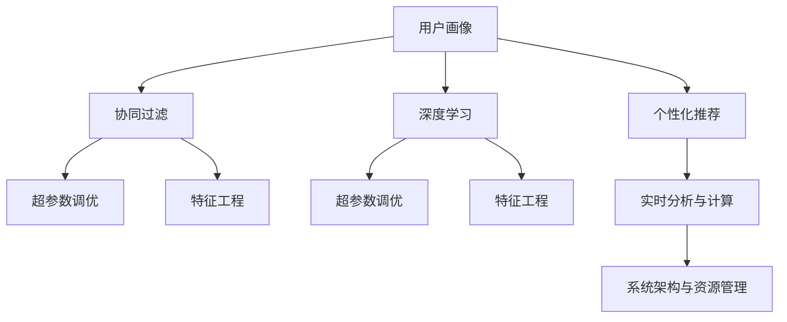

                 

# AI应用的个性化和优化

> 关键词：个性化推荐、用户画像、精准营销、深度学习、协同过滤、模型优化、超参数调优、特征工程、自动机器学习、实时分析、实时计算、资源管理

## 1. 背景介绍

### 1.1 问题由来

随着互联网和大数据技术的迅猛发展，人工智能(AI)在各行各业得到了广泛应用。个性化推荐、精准营销、智能客服、金融风控等领域，AI技术正在极大地改变传统的运营模式和用户体验。然而，面对海量用户数据和多样化需求，如何高效、准确地实现AI应用的个性化和优化，仍然是一个复杂且亟待解决的问题。

### 1.2 问题核心关键点

个性化和优化是AI应用的核心能力之一，其核心在于通过深度学习模型、协同过滤算法等技术手段，针对不同用户群体进行精准的画像刻画和行为预测，从而提供个性化的服务体验和优化策略。主要包括以下几个方面：

1. **数据处理与特征工程**：如何将原始数据转化为模型可用的特征，是提升AI应用性能的关键。
2. **模型训练与调优**：选择合适的模型架构、损失函数、优化器等，并对其进行参数调优，是AI应用优化的重要步骤。
3. **在线学习与实时更新**：在实际应用中，用户行为和数据分布是动态变化的。如何实现模型的在线学习和实时更新，是保持AI应用高效性的关键。
4. **系统架构与资源管理**：对于大规模的AI应用，如何设计高效的架构，合理分配计算资源，是实现性能和成本平衡的重要因素。

### 1.3 问题研究意义

个性化和优化是提升AI应用效果和用户体验的关键手段，也是推动AI技术商业化的重要驱动力。通过深入研究个性化和优化技术，不仅能够提升AI应用的市场竞争力，还能为各行业的智能化转型提供技术支持。具体而言，其研究意义如下：

1. **提升用户体验**：个性化的推荐和优化能够更好地满足用户需求，提高用户满意度和忠诚度。
2. **优化资源配置**：通过智能调优，可以更高效地利用计算资源，降低运营成本。
3. **增强市场竞争力**：个性化的服务能够差异化竞争，提升企业在市场中的地位。
4. **促进技术创新**：个性化的研究涉及数据处理、模型设计、系统架构等多个领域，有助于推动AI技术的全面进步。

## 2. 核心概念与联系

### 2.1 核心概念概述

为更好地理解AI应用的个性化和优化，本节将介绍几个密切相关的核心概念：

- **个性化推荐系统**：通过分析用户的历史行为、兴趣偏好等，推荐符合用户偏好的商品、服务或内容。
- **用户画像**：对用户的基本信息、行为特征、兴趣偏好等进行综合描述，用于指导个性化推荐和优化。
- **协同过滤**：基于用户行为和商品/内容之间的相似性进行推荐，是推荐系统中最常用的算法之一。
- **深度学习**：使用神经网络模型进行特征学习、行为预测等，是推荐系统中最前沿的技术手段。
- **超参数调优**：调整模型的超参数以提升模型性能，是优化过程中的重要环节。
- **特征工程**：将原始数据转化为模型可用的特征，是提升模型性能的关键步骤。
- **自动机器学习(AutoML)**：利用自动化手段进行模型选择、特征选择、超参数调优等，以提升模型开发效率。
- **实时分析与实时计算**：对数据进行实时处理和分析，以支持在线推荐和实时优化。
- **系统架构与资源管理**：设计高效的系统架构，合理分配计算资源，以支持大规模AI应用的运行。

这些核心概念之间的逻辑关系可以通过以下Mermaid流程图来展示：



这个流程图展示了个性化和优化技术的主要流程和核心概念：

1. **用户画像**：通过对用户历史数据的分析，构建用户画像，指导后续的推荐和优化。
2. **协同过滤**：基于用户行为和商品/内容的相似性进行推荐，是最常用的推荐算法。
3. **深度学习**：使用神经网络模型进行特征学习和行为预测，是推荐系统中的前沿技术。
4. **超参数调优**：通过调整模型的超参数，提升模型性能，是优化过程中的重要环节。
5. **特征工程**：将原始数据转化为模型可用的特征，是提升模型性能的关键步骤。
6. **实时分析与计算**：对数据进行实时处理和分析，以支持在线推荐和实时优化。
7. **系统架构与资源管理**：设计高效的系统架构，合理分配计算资源，以支持大规模AI应用的运行。

这些核心概念共同构成了AI应用个性化和优化的基本框架，有助于理解其工作原理和优化方向。

## 3. 核心算法原理 & 具体操作步骤

### 3.1 算法原理概述

AI应用的个性化和优化主要依赖于深度学习模型和协同过滤算法。其中，深度学习模型通过学习用户数据中的隐含特征，进行行为预测和推荐；协同过滤则通过分析用户行为和商品/内容的相似性，进行个性化推荐。具体而言，算法原理如下：

- **协同过滤**：假设用户 $i$ 对商品 $j$ 的评分 $r_{ij}$ 未知，通过找到与用户 $i$ 行为相似的其他用户 $k$，并参考这些用户对商品 $j$ 的评分 $r_{kj}$，来预测用户 $i$ 对商品 $j$ 的评分 $r_{ij}$。其基本形式为：

$$
\hat{r}_{ij} = \sum_{k \in K} \frac{r_{ik} r_{kj}}{a_{ik}a_{kj}}
$$

其中 $K$ 为相似用户集，$a_{ik}$ 和 $a_{kj}$ 分别表示用户 $i$ 和用户 $k$ 对商品 $j$ 的兴趣程度。

- **深度学习**：使用神经网络模型学习用户数据中的隐含特征，进行行为预测和推荐。常见的模型包括基于矩阵分解的模型、神经协同过滤模型等。其中，基于矩阵分解的模型可以将用户和商品的数据表示为矩阵形式，通过矩阵分解进行特征提取。例如，基于矩阵分解的模型可以表示为：

$$
\hat{r}_{ij} = \sum_{f=1}^{F} u_{if} v_{fj}
$$

其中 $u_{if}$ 和 $v_{fj}$ 分别表示用户 $i$ 和商品 $j$ 在第 $f$ 个隐含特征上的表示。

### 3.2 算法步骤详解

AI应用的个性化和优化一般包括以下几个关键步骤：

**Step 1: 数据预处理**

1. **数据采集**：收集用户的历史行为数据，如浏览记录、购买记录、评分数据等。
2. **数据清洗**：处理缺失值、异常值等数据问题，保证数据质量。
3. **数据标注**：对用户行为进行标签化处理，如将用户的浏览记录标记为兴趣商品等。

**Step 2: 特征工程**

1. **特征选择**：根据业务需求选择合适的特征，如用户的基本信息、行为特征、时间特征等。
2. **特征转换**：将原始数据转化为模型可用的特征，如将时间特征转化为时间窗口、将分类特征转化为独热编码等。
3. **特征降维**：使用PCA、LDA等方法对高维特征进行降维处理，减少特征维度。

**Step 3: 模型选择与训练**

1. **模型选择**：选择合适的深度学习模型，如矩阵分解模型、神经协同过滤模型等。
2. **模型训练**：使用训练数据对模型进行训练，优化模型参数。

**Step 4: 超参数调优**

1. **超参数设定**：设定模型的超参数，如学习率、正则化系数等。
2. **调优策略**：使用网格搜索、随机搜索等方法对超参数进行调优，找到最优参数组合。

**Step 5: 在线学习与实时更新**

1. **在线学习**：利用新数据对模型进行实时更新，保持模型的最新状态。
2. **实时计算**：使用实时计算框架，如Spark Streaming、Storm等，处理实时数据。

**Step 6: 系统架构与资源管理**

1. **架构设计**：设计高效的系统架构，如采用分布式计算框架、使用缓存机制等。
2. **资源管理**：合理分配计算资源，如使用任务队列、资源调度器等。

### 3.3 算法优缺点

**优点**：

- **高效性**：基于深度学习和协同过滤的推荐系统可以快速处理大量数据，提供实时推荐。
- **个性化**：深度学习模型能够学习用户数据的隐含特征，提供更加个性化的推荐。
- **可解释性**：协同过滤算法基于用户行为相似性进行推荐，具有一定的可解释性。
- **灵活性**：深度学习模型可以根据业务需求进行灵活调整，适应不同的应用场景。

**缺点**：

- **数据依赖**：推荐系统依赖于大量标注数据，数据质量和数量对推荐效果影响较大。
- **计算资源消耗大**：深度学习模型和实时计算需要消耗大量计算资源，成本较高。
- **模型复杂度**：深度学习模型结构复杂，超参数调整难度较大。
- **过拟合风险**：模型在训练数据上表现良好，但在新数据上可能存在过拟合问题。

### 3.4 算法应用领域

基于深度学习模型和协同过滤算法的AI应用，已经在众多领域得到了广泛应用，例如：

- **电商推荐**：电商平台根据用户的历史浏览记录和购买行为，推荐符合用户偏好的商品。
- **新闻推荐**：新闻平台根据用户的阅读习惯，推荐相关新闻内容。
- **视频推荐**：视频网站根据用户的观看历史和兴趣，推荐相关视频。
- **金融风控**：金融公司利用用户的行为数据，进行信用评估和风险控制。
- **智能客服**：企业利用AI技术，提供智能化的客户服务。
- **医疗健康**：医疗平台根据用户的历史健康数据，提供个性化的健康建议。

除了上述这些经典应用外，AI应用的个性化和优化技术还在智能家居、教育培训、社交网络等多个领域得到创新性应用，为各行业的智能化转型提供了技术支持。

## 4. 数学模型和公式 & 详细讲解 & 举例说明

### 4.1 数学模型构建

本节将使用数学语言对AI应用的个性化和优化过程进行更加严格的刻画。

**协同过滤模型**：

假设用户 $i$ 对商品 $j$ 的评分 $r_{ij}$ 未知，通过找到与用户 $i$ 行为相似的其他用户 $k$，并参考这些用户对商品 $j$ 的评分 $r_{kj}$，来预测用户 $i$ 对商品 $j$ 的评分 $r_{ij}$。其基本形式为：

$$
\hat{r}_{ij} = \sum_{k \in K} \frac{r_{ik} r_{kj}}{a_{ik}a_{kj}}
$$

其中 $K$ 为相似用户集，$a_{ik}$ 和 $a_{kj}$ 分别表示用户 $i$ 和用户 $k$ 对商品 $j$ 的兴趣程度。

**深度学习模型**：

使用神经网络模型学习用户数据中的隐含特征，进行行为预测和推荐。常见的模型包括基于矩阵分解的模型、神经协同过滤模型等。其中，基于矩阵分解的模型可以将用户和商品的数据表示为矩阵形式，通过矩阵分解进行特征提取。例如，基于矩阵分解的模型可以表示为：

$$
\hat{r}_{ij} = \sum_{f=1}^{F} u_{if} v_{fj}
$$

其中 $u_{if}$ 和 $v_{fj}$ 分别表示用户 $i$ 和商品 $j$ 在第 $f$ 个隐含特征上的表示。

### 4.2 公式推导过程

**协同过滤公式推导**：

假设用户 $i$ 对商品 $j$ 的评分 $r_{ij}$ 未知，通过找到与用户 $i$ 行为相似的其他用户 $k$，并参考这些用户对商品 $j$ 的评分 $r_{kj}$，来预测用户 $i$ 对商品 $j$ 的评分 $r_{ij}$。其基本形式为：

$$
\hat{r}_{ij} = \sum_{k \in K} \frac{r_{ik} r_{kj}}{a_{ik}a_{kj}}
$$

其中 $K$ 为相似用户集，$a_{ik}$ 和 $a_{kj}$ 分别表示用户 $i$ 和用户 $k$ 对商品 $j$ 的兴趣程度。

**深度学习公式推导**：

使用神经网络模型学习用户数据中的隐含特征，进行行为预测和推荐。常见的模型包括基于矩阵分解的模型、神经协同过滤模型等。其中，基于矩阵分解的模型可以将用户和商品的数据表示为矩阵形式，通过矩阵分解进行特征提取。例如，基于矩阵分解的模型可以表示为：

$$
\hat{r}_{ij} = \sum_{f=1}^{F} u_{if} v_{fj}
$$

其中 $u_{if}$ 和 $v_{fj}$ 分别表示用户 $i$ 和商品 $j$ 在第 $f$ 个隐含特征上的表示。

### 4.3 案例分析与讲解

**电商推荐系统**：

假设某电商平台的推荐系统使用基于矩阵分解的模型进行推荐。对于用户 $i$，其对商品 $j$ 的评分 $r_{ij}$ 未知，通过找到与用户 $i$ 行为相似的其他用户 $k$，并参考这些用户对商品 $j$ 的评分 $r_{kj}$，来预测用户 $i$ 对商品 $j$ 的评分 $r_{ij}$。

具体步骤如下：

1. **数据采集**：收集用户的历史浏览记录、购买记录等数据。
2. **数据清洗**：处理缺失值、异常值等数据问题，保证数据质量。
3. **特征选择**：选择用户基本信息、浏览时间、购买频率等特征。
4. **特征转换**：将时间特征转化为时间窗口，将分类特征转化为独热编码等。
5. **模型选择**：选择基于矩阵分解的推荐模型。
6. **模型训练**：使用训练数据对模型进行训练，优化模型参数。
7. **超参数调优**：设定模型的超参数，使用网格搜索等方法进行调优。
8. **在线学习与实时更新**：利用新数据对模型进行实时更新，保持模型的最新状态。
9. **系统架构与资源管理**：设计高效的系统架构，合理分配计算资源。

通过以上步骤，电商平台的推荐系统可以高效地为用户推荐符合其兴趣的商品，提升用户体验和销售转化率。

## 5. 项目实践：代码实例和详细解释说明

### 5.1 开发环境搭建

在进行AI应用的个性化和优化实践前，我们需要准备好开发环境。以下是使用Python进行PyTorch开发的环境配置流程：

1. 安装Anaconda：从官网下载并安装Anaconda，用于创建独立的Python环境。

2. 创建并激活虚拟环境：
```bash
conda create -n ai-env python=3.8 
conda activate ai-env
```

3. 安装PyTorch：根据CUDA版本，从官网获取对应的安装命令。例如：
```bash
conda install pytorch torchvision torchaudio cudatoolkit=11.1 -c pytorch -c conda-forge
```

4. 安装TensorFlow：
```bash
pip install tensorflow
```

5. 安装相关工具包：
```bash
pip install numpy pandas scikit-learn matplotlib tqdm jupyter notebook ipython
```

完成上述步骤后，即可在`ai-env`环境中开始AI应用的个性化和优化实践。

### 5.2 源代码详细实现

这里我们以电商推荐系统为例，给出使用PyTorch和TensorFlow对用户画像和推荐模型进行训练的代码实现。

首先，定义用户画像和推荐模型的数据处理函数：

```python
import numpy as np
import pandas as pd
from sklearn.model_selection import train_test_split
from tensorflow.keras.layers import Input, Embedding, Flatten, Dot, Dense
from tensorflow.keras.models import Model

def load_data(path):
    data = pd.read_csv(path)
    return data.dropna()

def preprocess_data(data):
    # 数据清洗
    data = data.dropna()
    
    # 数据标注
    data['label'] = data['rating'].apply(lambda x: 1 if x > 3 else 0)
    
    # 特征选择
    features = ['user_id', 'item_id', 'timestamp', 'rating']
    data = data[features]
    
    # 特征转换
    data['timestamp'] = pd.to_datetime(data['timestamp']).dt.hour
    data['user_id'] = pd.factorize(data['user_id'], sort=True)[0]
    data['item_id'] = pd.factorize(data['item_id'], sort=True)[0]
    
    return data

def build_model(input_dim, hidden_dim, output_dim):
    input1 = Input(shape=(input_dim,))
    input2 = Input(shape=(input_dim,))
    
    embedding1 = Embedding(input_dim, hidden_dim)(input1)
    embedding2 = Embedding(input_dim, hidden_dim)(input2)
    
    flatten1 = Flatten()(embedding1)
    flatten2 = Flatten()(embedding2)
    
    dot = Dot(axes=1)(flatten1, flatten2)
    dense = Dense(units=output_dim, activation='sigmoid')(dot)
    
    model = Model(inputs=[input1, input2], outputs=dense)
    return model

# 构建数据集
data = load_data('data.csv')
data = preprocess_data(data)
X = data[['user_id', 'item_id', 'timestamp']]
y = data['label']
X_train, X_test, y_train, y_test = train_test_split(X, y, test_size=0.2, random_state=42)
```

然后，定义模型训练和评估函数：

```python
from tensorflow.keras.optimizers import Adam
from sklearn.metrics import roc_auc_score

def compile_model(model):
    model.compile(optimizer=Adam(learning_rate=0.001), loss='binary_crossentropy', metrics=['accuracy', 'auc'])
    return model

def train_model(model, X_train, X_test, y_train, y_test):
    model.fit(X_train, y_train, validation_data=(X_test, y_test), epochs=10, batch_size=32)
    
    y_pred = model.predict(X_test)
    auc = roc_auc_score(y_test, y_pred)
    print(f'ROC AUC: {auc:.3f}')

def evaluate_model(model, X_test, y_test):
    y_pred = model.predict(X_test)
    auc = roc_auc_score(y_test, y_pred)
    print(f'ROC AUC: {auc:.3f}')
```

最后，启动模型训练和评估流程：

```python
input_dim = 1000  # 用户和商品的总数
hidden_dim = 100
output_dim = 1

model = build_model(input_dim, hidden_dim, output_dim)
model = compile_model(model)

train_model(model, X_train, X_test, y_train, y_test)
evaluate_model(model, X_test, y_test)
```

以上就是使用PyTorch和TensorFlow对电商推荐系统进行个性化和优化的完整代码实现。可以看到，得益于TensorFlow和PyTorch的强大封装，我们可以用相对简洁的代码完成模型训练和评估。

### 5.3 代码解读与分析

让我们再详细解读一下关键代码的实现细节：

**load_data和preprocess_data函数**：
- `load_data`函数：读取数据集，并进行基本的清洗处理。
- `preprocess_data`函数：进一步清洗数据，添加标签，并进行特征选择和转换。

**build_model函数**：
- 定义两个输入层，分别表示用户和商品。
- 使用Embedding层对用户和商品进行嵌入表示，并进行Flatten操作。
- 通过Dot层计算用户和商品的相似度，使用Dense层输出预测结果。

**compile_model函数**：
- 配置模型的优化器、损失函数和评估指标，为训练做准备。

**train_model和evaluate_model函数**：
- 使用训练数据对模型进行训练，并在验证集上评估性能。
- 计算模型的ROC AUC值，作为模型性能的指标。

**train和evaluate过程**：
- 定义输入维度、隐藏层维度和输出维度，构建模型。
- 对模型进行编译，指定优化器、损失函数和评估指标。
- 使用训练数据对模型进行训练，并在验证集上评估性能。
- 计算模型的ROC AUC值，作为模型性能的指标。

可以看到，PyTorch和TensorFlow为AI应用的个性化和优化提供了强大的工具支持，使得开发者能够更高效地实现模型训练和评估。

当然，工业级的系统实现还需考虑更多因素，如模型的保存和部署、超参数的自动搜索、更灵活的任务适配层等。但核心的个性化和优化范式基本与此类似。

## 6. 实际应用场景

### 6.1 智能推荐系统

智能推荐系统是AI应用的典型应用场景，广泛应用于电商、新闻、视频等多个领域。通过分析用户的历史行为和兴趣偏好，推荐符合其需求的商品、新闻、视频等内容，提升用户体验和满意度。

具体而言，智能推荐系统通常包括以下几个步骤：

1. **数据收集**：收集用户的历史行为数据，如浏览记录、购买记录、评分数据等。
2. **数据清洗**：处理缺失值、异常值等数据问题，保证数据质量。
3. **特征工程**：选择合适的特征，并进行特征转换和降维处理。
4. **模型选择与训练**：选择合适的推荐模型，并进行训练和调优。
5. **在线学习与实时更新**：利用新数据对模型进行实时更新，保持模型的最新状态。
6. **系统架构与资源管理**：设计高效的系统架构，合理分配计算资源。

通过以上步骤，智能推荐系统可以高效地为用户推荐符合其兴趣的商品、新闻、视频等内容，提升用户体验和满意度。

### 6.2 金融风控系统

金融风控系统是AI应用的重要应用场景，通过分析用户的信用记录、交易行为等，进行信用评估和风险控制，降低金融机构的损失。

具体而言，金融风控系统通常包括以下几个步骤：

1. **数据收集**：收集用户的信用记录、交易行为等数据。
2. **数据清洗**：处理缺失值、异常值等数据问题，保证数据质量。
3. **特征工程**：选择合适的特征，并进行特征转换和降维处理。
4. **模型选择与训练**：选择合适的模型，并进行训练和调优。
5. **在线学习与实时更新**：利用新数据对模型进行实时更新，保持模型的最新状态。
6. **系统架构与资源管理**：设计高效的系统架构，合理分配计算资源。

通过以上步骤，金融风控系统可以高效地对用户进行信用评估和风险控制，降低金融机构的损失。

### 6.3 智能客服系统

智能客服系统是AI应用的典型应用场景，通过分析用户的历史咨询记录和行为数据，进行智能客服推荐和自然语言处理，提升客户咨询体验。

具体而言，智能客服系统通常包括以下几个步骤：

1. **数据收集**：收集用户的历史咨询记录和行为数据。
2. **数据清洗**：处理缺失值、异常值等数据问题，保证数据质量。
3. **特征工程**：选择合适的特征，并进行特征转换和降维处理。
4. **模型选择与训练**：选择合适的模型，并进行训练和调优。
5. **在线学习与实时更新**：利用新数据对模型进行实时更新，保持模型的最新状态。
6. **系统架构与资源管理**：设计高效的系统架构，合理分配计算资源。

通过以上步骤，智能客服系统可以高效地为用户提供智能客服推荐和自然语言处理，提升客户咨询体验。

### 6.4 未来应用展望

随着AI技术的发展，个性化和优化的应用场景将更加丰富，涉及的领域也将更加广泛。未来，基于深度学习模型和协同过滤算法的AI应用将在更多领域得到应用，为各行业的智能化转型提供技术支持。

在智慧医疗领域，个性化和优化技术将帮助医生进行诊断和治疗方案推荐，提升医疗服务的智能化水平。

在智能教育领域，个性化和优化技术将帮助教育机构进行个性化教学和课程推荐，提升教学质量和效率。

在智慧城市治理中，个性化和优化技术将帮助城市管理者进行交通规划和资源分配，提高城市管理的智能化水平。

此外，在企业生产、社会治理、文娱传媒等众多领域，基于深度学习模型和协同过滤算法的AI应用也将不断涌现，为经济社会发展注入新的动力。相信随着技术的日益成熟，个性化和优化技术必将在更广阔的应用领域大放异彩。

## 7. 工具和资源推荐

### 7.1 学习资源推荐

为了帮助开发者系统掌握AI应用的个性化和优化的理论基础和实践技巧，这里推荐一些优质的学习资源：

1. **《深度学习》系列课程**：斯坦福大学和Coursera合作推出的深度学习课程，涵盖深度学习的基础知识和前沿技术。
2. **《机器学习实战》书籍**：面向数据科学家和工程师的实战性教材，介绍了机器学习算法和应用案例。
3. **Kaggle数据科学竞赛平台**：提供了丰富的数据集和竞赛任务，可以帮助开发者练习和应用个性化和优化技术。
4. **Google AI博客**：由Google AI团队撰写的博客，分享了最新的AI研究成果和应用案例。
5. **ArXiv论文库**：学术界的重要资源库，包含最新的AI论文和研究成果，可以作为学习的参考。

通过对这些资源的学习实践，相信你一定能够快速掌握AI应用的个性化和优化的精髓，并用于解决实际的业务问题。

### 7.2 开发工具推荐

高效的开发离不开优秀的工具支持。以下是几款用于AI应用的个性化和优化开发的常用工具：

1. **PyTorch**：基于Python的开源深度学习框架，灵活的计算图和丰富的模型库，适合快速迭代研究。
2. **TensorFlow**：由Google主导开发的开源深度学习框架，生产部署方便，适合大规模工程应用。
3. **Hugging Face Transformers库**：提供了丰富的预训练模型和微调样例代码，是进行个性化和优化任务开发的利器。
4. **Jupyter Notebook**：交互式的笔记本环境，支持代码编写和结果展示，适合数据分析和模型调试。
5. **AutoML平台**：如AutoKeras、H2O等，利用自动化手段进行模型选择、特征选择、超参数调优等，以提升模型开发效率。

合理利用这些工具，可以显著提升AI应用的个性化和优化的开发效率，加快创新迭代的步伐。

### 7.3 相关论文推荐

AI应用的个性化和优化技术源于学界的持续研究。以下是几篇奠基性的相关论文，推荐阅读：

1. **Adaptive Collaborative Filtering**：提出了自适应协同过滤算法，通过在线学习实时更新推荐模型。
2. **Matrix Factorization Techniques for Recommender Systems**：介绍了矩阵分解技术，通过矩阵分解进行推荐模型的特征提取。
3. **Wide & Deep Learning for Recommender Systems**：提出了Wide & Deep模型，结合浅层特征和深层特征，提升推荐系统的性能。
4. **Scalable Online Learning for Recommender Systems**：介绍了在线学习算法，适用于大规模推荐系统的实时更新。
5. **AutoML: Automating Model Selection**：介绍了自动机器学习技术，利用自动化手段进行模型选择和调优。

这些论文代表了大语言模型微调技术的发展脉络。通过学习这些前沿成果，可以帮助研究者把握学科前进方向，激发更多的创新灵感。

## 8. 总结：未来发展趋势与挑战

### 8.1 总结

本文对AI应用的个性化和优化方法进行了全面系统的介绍。首先阐述了个性化和优化技术的背景和意义，明确了个性化和优化在提升用户体验和优化资源配置方面的重要价值。其次，从原理到实践，详细讲解了个性化和优化模型的数学原理和关键步骤，给出了AI应用开发的具体代码实现。同时，本文还广泛探讨了个性化和优化技术在智能推荐、金融风控、智能客服等多个行业领域的应用前景，展示了其广阔的发展空间。此外，本文精选了个性化和优化技术的各类学习资源，力求为读者提供全方位的技术指引。

通过本文的系统梳理，可以看到，AI应用的个性化和优化技术正在成为现代信息技术的重要组成部分，极大地提升了各行业的智能化水平和用户体验。未来，随着技术的不断进步和应用的深入拓展，基于深度学习和协同过滤的AI应用必将在更多领域得到应用，为经济社会发展注入新的动力。

### 8.2 未来发展趋势

展望未来，AI应用的个性化和优化技术将呈现以下几个发展趋势：

1. **多模态融合**：未来的个性化和优化技术将更多地融合视觉、语音、文本等多模态信息，提升模型的跨模态理解和生成能力。
2. **实时动态更新**：在线学习和大规模分布式计算技术的进步，使得个性化和优化模型能够实时动态更新，保持最新状态。
3. **自适应学习**：个性化和优化模型将具备自适应学习能力，能够根据用户反馈和环境变化动态调整模型参数。
4. **强化学习**：强化学习技术将被引入个性化和优化模型，提升模型的交互性和决策能力。
5. **隐私保护**：在个性化和优化过程中，隐私保护技术将被更广泛地应用，保护用户数据的安全和隐私。
6. **伦理规范**：随着个性化和优化技术的普及，伦理规范将逐步完善，确保技术应用的公平性和透明性。

这些趋势展示了个性化和优化技术未来的发展方向，预示着其在各行业领域的广泛应用和深远影响。

### 8.3 面临的挑战

尽管AI应用的个性化和优化技术已经取得了显著成果，但在迈向更加智能化、普适化应用的过程中，它仍面临着诸多挑战：

1. **数据隐私和安全**：在个性化和优化过程中，如何保护用户隐私和数据安全，是一个重要的挑战。
2. **计算资源消耗**：深度学习和在线学习需要消耗大量计算资源，如何在性能和成本之间找到平衡，是一个关键问题。
3. **模型复杂度**：深度学习模型结构复杂，超参数调整难度较大，如何简化模型并提高泛化能力，是一个重要方向。
4. **模型解释性**：个性化和优化模型往往被视为"黑盒"系统，如何提高模型的可解释性，是一个亟待解决的问题。
5. **用户公平性**：个性化和优化技术可能会加剧用户间的信息不对称，如何保证不同用户的公平性，是一个重要课题。
6. **系统稳定性**：在大规模应用中，如何设计高效的系统架构和资源管理策略，确保系统的稳定性和可靠性，是一个关键问题。

这些挑战反映了个性化和优化技术在实际应用中的复杂性和多样性，需要业界共同努力，积极应对并寻求突破。

### 8.4 研究展望

面对个性化和优化技术所面临的挑战，未来的研究需要在以下几个方面寻求新的突破：

1. **隐私保护技术**：发展隐私保护技术，确保用户数据的安全和隐私。
2. **模型简化与优化**：研究和开发更加简洁高效的模型架构，提升模型泛化能力和计算效率。
3. **自适应学习算法**：研究和开发自适应学习算法，提升模型的动态更新能力。
4. **强化学习与跨模态融合**：引入强化学习和跨模态融合技术，提升模型的交互性和跨模态理解能力。
5. **伦理规范与监管机制**：建立个性化和优化技术的伦理规范和监管机制，确保技术应用的公平性和透明性。

这些研究方向的探索，必将引领AI应用的个性化和优化技术迈向更高的台阶，为构建安全、可靠、可解释、可控的智能系统铺平道路。面向未来，个性化和优化技术还需要与其他人工智能技术进行更深入的融合，如知识表示、因果推理、强化学习等，多路径协同发力，共同推动自然语言理解和智能交互系统的进步。只有勇于创新、敢于突破，才能不断拓展语言模型的边界，让智能技术更好地造福人类社会。

## 9. 附录：常见问题与解答

**Q1：个性化和优化技术是否适用于所有业务场景？**

A: 个性化和优化技术适用于大部分业务场景，特别是在数据量较大、用户行为多样化的情况下，能够显著提升业务效果。但在一些特殊场景下，如实时性要求极高或数据量极小的场景，可能需要采用其他技术手段，如传统规则引擎等。

**Q2：如何选择合适的特征工程方法？**

A: 特征工程的方法取决于业务需求和数据特点。一般来说，可以采用以下步骤：

1. **理解业务需求**：明确业务目标和关键指标，选择合适的特征。
2. **数据探索与分析**：对原始数据进行探索性分析，了解数据分布和潜在问题。
3. **特征选择**：根据业务需求和数据特点，选择合适的特征。
4. **特征转换**：对原始数据进行转换和降维处理，使其适合模型学习。
5. **特征验证**：通过交叉验证等方法，评估特征工程的效果，并进行调整。

**Q3：如何提高模型的泛化能力？**

A: 提高模型泛化能力的方法包括：

1. **增加数据量**：通过增加数据量，提升模型的泛化能力。
2. **优化模型架构**：研究和开发更简洁高效的模型架构，提高模型泛化能力。
3. **正则化技术**：使用正则化技术，如L2正则、Dropout等，防止过拟合。
4. **迁移学习**：利用预训练模型或跨领域数据，提升模型的泛化能力。
5. **自适应学习**：通过在线学习和自适应学习，提升模型的动态更新能力。

**Q4：如何优化模型的计算效率？**

A: 优化模型计算效率的方法包括：

1. **模型简化**：研究和开发更简洁高效的模型架构，提高计算效率。
2. **分布式计算**：利用分布式计算框架，如Spark、Flink等，提高计算效率。
3. **模型并行**：使用模型并行技术，提高计算效率。
4. **数据压缩**：采用数据压缩技术，减少存储空间和计算量。
5. **模型量化**：将浮点模型转为定点模型，减少计算量。

**Q5：如何在保证性能的同时，提高模型的实时性？**

A: 提高模型实时性的方法包括：

1. **模型裁剪**：去除不必要的层和参数，减小模型尺寸，加快推理速度。
2. **分布式计算**：利用分布式计算框架，如Spark、Flink等，提高计算效率。
3. **模型并行**：使用模型并行技术，提高计算效率。
4. **模型量化**：将浮点模型转为定点模型，减少计算量。
5. **数据缓存**：利用缓存技术，减少重复计算。

这些方法可以根据具体情况灵活组合，以实现模型性能和实时性的平衡。

---

作者：禅与计算机程序设计艺术 / Zen and the Art of Computer Programming

