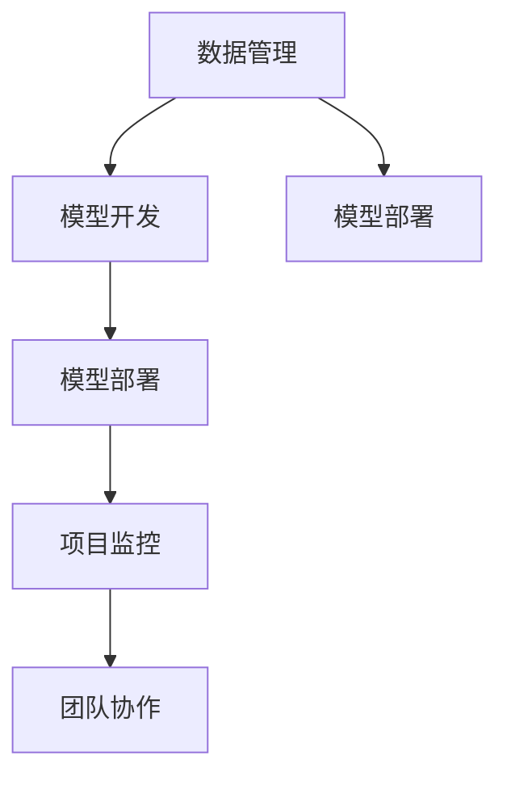

                 

# AI开发的标准化流程：Lepton AI的最佳实践

> 关键词：AI开发,标准化流程,Lepton AI,最佳实践,技术博客

## 1. 背景介绍

### 1.1 问题由来
随着人工智能（AI）技术的迅猛发展，越来越多的企业投身于AI的开发和应用。然而，在AI项目的开发过程中，往往会出现诸如项目目标不明确、技术栈选择不当、代码质量低下、项目进度失控等问题，导致项目最终无法达到预期效果。为解决这些问题，我们提出了一套基于Lepton AI的AI开发标准化流程，旨在提高AI项目的成功率，加速AI技术的落地应用。

### 1.2 问题核心关键点
Lepton AI的标准化流程主要包括数据管理、模型开发、模型部署、项目监控、团队协作等方面，核心目标是确保AI项目从需求分析到最终落地的整个过程中，各个环节的质量和效率。

## 2. 核心概念与联系

### 2.1 核心概念概述

为更好地理解Lepton AI的标准化流程，本节将介绍几个密切相关的核心概念：

- AI开发标准化流程（Standardized AI Development Workflow）：一套规范化、系统化的AI开发流程，涵盖项目立项、需求分析、模型开发、模型部署、项目监控等多个环节，旨在提高AI项目的成功率和效率。

- Lepton AI（Lepton AI）：一家提供AI开发咨询和工具的公司，其开发的Lepton AI Platform支持AI项目的全生命周期管理，包括数据管理、模型训练、模型部署、项目管理等。

- 数据管理（Data Management）：指在AI项目开发过程中，对数据进行收集、清洗、存储、标注等操作，确保数据质量和安全性的过程。

- 模型开发（Model Development）：指根据项目需求，选择合适的AI模型架构，使用Lepton AI Platform提供的工具和库，进行模型的训练、调优、评估等操作。

- 模型部署（Model Deployment）：指将训练好的AI模型集成到应用系统中，进行模型上线、性能监控、用户反馈收集等操作。

- 项目监控（Project Monitoring）：指在AI项目开发过程中，对项目进度、模型效果、团队协作等进行监控和管理，及时发现和解决问题。

- 团队协作（Team Collaboration）：指在AI项目开发过程中，通过Lepton AI Platform提供的协作工具，进行需求沟通、代码管理、版本控制等操作，提高团队效率。

这些核心概念之间的逻辑关系可以通过以下Mermaid流程图来展示：



这个流程图展示了大语言模型的核心概念及其之间的关系：

1. 数据管理通过收集、清洗、标注等操作，为模型开发提供高质量的数据集。
2. 模型开发基于数据管理提供的数据集，选择合适的AI模型架构，进行模型训练、调优等操作。
3. 模型部署将训练好的模型集成到应用系统中，进行上线、性能监控等操作。
4. 项目监控对项目进度、模型效果、团队协作等进行实时监控和管理。
5. 团队协作通过协作工具进行需求沟通、代码管理等操作，提高团队效率。

## 3. 核心算法原理 & 具体操作步骤
### 3.1 算法原理概述

Lepton AI的标准化流程基于面向对象的开发方法（Object-Oriented Development, OOD）和敏捷开发方法（Agile Development），涵盖了从需求分析到模型部署的全生命周期管理。其核心思想是通过规范化、系统化的流程，确保AI项目的各个环节质量可控、进度可控，最终实现高质量的AI应用落地。

### 3.2 算法步骤详解

Lepton AI的标准化流程主要包括以下几个关键步骤：

**Step 1: 需求分析与项目立项**
- 组建项目团队，明确项目目标和需求。
- 进行市场调研，分析行业现状和未来趋势。
- 确定项目规模、时间节点、预算等关键要素。
- 编写项目立项文档，进行需求评审和决策。

**Step 2: 数据管理**
- 收集和整理项目所需的数据集，包括原始数据和标注数据。
- 清洗数据，去除噪音和异常值，保证数据质量。
- 存储数据，使用Lepton AI Platform提供的数据管理系统，确保数据安全性和易用性。
- 标注数据，使用Lepton AI Platform提供的标注工具，保证标注数据的一致性和准确性。

**Step 3: 模型开发**
- 选择合适的AI模型架构，包括深度学习、强化学习、迁移学习等。
- 使用Lepton AI Platform提供的工具和库，进行模型训练、调优、评估等操作。
- 使用正则化技术、Dropout、Early Stopping等防止过拟合。
- 进行参数高效的微调，使用Adapter、Prefix等技术，减少需优化的参数量。
- 对模型进行评估，使用Lepton AI Platform提供的评估工具，评估模型性能。

**Step 4: 模型部署**
- 将训练好的模型集成到应用系统中，进行模型上线。
- 进行模型部署，使用Lepton AI Platform提供的部署工具，确保模型高效运行。
- 进行性能监控，使用Lepton AI Platform提供的监控工具，实时监控模型性能。
- 收集用户反馈，使用Lepton AI Platform提供的用户反馈工具，持续改进模型。

**Step 5: 项目监控**
- 对项目进度进行监控，使用Lepton AI Platform提供的项目管理工具，确保项目按计划推进。
- 对模型效果进行监控，使用Lepton AI Platform提供的监控工具，实时监控模型性能。
- 对团队协作进行监控，使用Lepton AI Platform提供的协作工具，确保团队高效协作。

**Step 6: 团队协作**
- 使用Lepton AI Platform提供的协作工具，进行需求沟通、代码管理、版本控制等操作，提高团队效率。
- 进行代码审查，使用Lepton AI Platform提供的代码审查工具，确保代码质量。
- 进行知识共享，使用Lepton AI Platform提供的知识库，进行团队知识共享和传承。

### 3.3 算法优缺点

Lepton AI的标准化流程具有以下优点：
1. 规范化流程，提高项目成功率。通过规范化流程，确保每个环节的质量和进度可控。
2. 系统化工具支持，提高开发效率。使用Lepton AI Platform提供的工具和库，提高开发效率。
3. 标准化接口，便于集成和部署。使用标准化接口，便于模型集成和部署。
4. 自动化监控，提高项目透明度。使用Lepton AI Platform提供的监控工具，实时监控项目进展和模型性能。
5. 协作工具支持，提高团队效率。使用Lepton AI Platform提供的协作工具，提高团队效率。

同时，该流程也存在一定的局限性：
1. 依赖Lepton AI Platform。该流程高度依赖Lepton AI Platform提供的工具和库，难以在其他平台使用。
2. 适用范围有限。该流程主要适用于AI开发和部署的标准化流程，对于特定领域的应用可能不完全适用。
3. 初始投资较高。使用Lepton AI Platform提供的工具和库，需要进行一定的初始投资。
4. 需要持续维护。使用Lepton AI Platform提供的工具和库，需要进行持续的维护和升级。

尽管存在这些局限性，但就目前而言，Lepton AI的标准化流程仍然是AI开发和部署的主流范式。未来相关研究的重点在于如何进一步优化流程，降低依赖性，提高可扩展性，同时兼顾成本和效率。

### 3.4 算法应用领域

Lepton AI的标准化流程已经在多个AI项目中得到了应用，涵盖了数据标注、模型训练、模型部署、项目管理等多个环节，取得了良好的效果。

- 金融风控：通过数据管理、模型开发、模型部署、项目管理等环节，构建了基于AI的金融风险管理系统，实现了实时风险预警。
- 医疗诊断：通过数据管理、模型开发、模型部署、项目管理等环节，构建了基于AI的医学影像分析系统，提高了诊断准确率。
- 智能客服：通过数据管理、模型开发、模型部署、项目管理等环节，构建了基于AI的智能客服系统，提高了客户服务质量。
- 智能推荐：通过数据管理、模型开发、模型部署、项目管理等环节，构建了基于AI的个性化推荐系统，提升了用户体验。

除了这些经典应用外，Lepton AI的标准化流程还被创新性地应用到更多场景中，如智能制造、智慧城市、智能物流等，为AI技术在各行各业的落地应用提供了坚实的基础。

## 4. 数学模型和公式 & 详细讲解 & 举例说明
### 4.1 数学模型构建

本节将使用数学语言对Lepton AI的标准化流程进行更加严格的刻画。

假设Lepton AI的标准化流程包括以下几个关键组件：
- 需求分析与项目立项：使用规范化的文档和流程，进行需求分析和项目立项。
- 数据管理：使用Lepton AI Platform提供的数据管理系统，进行数据收集、清洗、标注等操作。
- 模型开发：使用Lepton AI Platform提供的工具和库，进行模型训练、调优、评估等操作。
- 模型部署：使用Lepton AI Platform提供的部署工具，进行模型上线、性能监控等操作。
- 项目监控：使用Lepton AI Platform提供的监控工具，进行项目进度、模型效果、团队协作等的监控和管理。
- 团队协作：使用Lepton AI Platform提供的协作工具，进行需求沟通、代码管理、版本控制等操作。

## 5. 项目实践：代码实例和详细解释说明
### 5.1 开发环境搭建

在进行Lepton AI的标准化流程实践前，我们需要准备好开发环境。以下是使用Python进行Lepton AI开发的环境配置流程：

1. 安装Anaconda：从官网下载并安装Anaconda，用于创建独立的Python环境。

2. 创建并激活虚拟环境：
```bash
conda create -n lepton-env python=3.8 
conda activate lepton-env
```

3. 安装Lepton AI Platform：根据官网提供的安装命令，安装Lepton AI Platform。例如：
```bash
pip install lepton-ai-platform
```

4. 安装各类工具包：
```bash
pip install numpy pandas scikit-learn matplotlib tqdm jupyter notebook ipython
```

完成上述步骤后，即可在`lepton-env`环境中开始Lepton AI的标准化流程实践。

### 5.2 源代码详细实现

这里我们以金融风控项目为例，给出使用Lepton AI Platform进行数据管理、模型开发、模型部署、项目管理、团队协作等环节的PyTorch代码实现。

首先，定义数据处理函数：

```python
from lepton_ai_platform import DataManager
from torch.utils.data import Dataset
import torch

class FinanceDataset(Dataset):
    def __init__(self, data, labels, tokenizer, max_len=128):
        self.data = data
        self.labels = labels
        self.tokenizer = tokenizer
        self.max_len = max_len
        
    def __len__(self):
        return len(self.data)
    
    def __getitem__(self, item):
        text = self.data[item]
        label = self.labels[item]
        
        encoding = self.tokenizer(text, return_tensors='pt', max_length=self.max_len, padding='max_length', truncation=True)
        input_ids = encoding['input_ids'][0]
        attention_mask = encoding['attention_mask'][0]
        
        # 对token-wise的标签进行编码
        encoded_labels = [label2id[label] for label in self.labels] 
        encoded_labels.extend([label2id['O']] * (self.max_len - len(encoded_labels)))
        labels = torch.tensor(encoded_labels, dtype=torch.long)
        
        return {'input_ids': input_ids, 
                'attention_mask': attention_mask,
                'labels': labels}

# 标签与id的映射
label2id = {'default': 0, 'high_risk': 1, 'medium_risk': 2, 'low_risk': 3}
id2label = {v: k for k, v in label2id.items()}

# 创建dataset
tokenizer = BertTokenizer.from_pretrained('bert-base-cased')

train_dataset = FinanceDataset(train_data, train_labels, tokenizer)
dev_dataset = FinanceDataset(dev_data, dev_labels, tokenizer)
test_dataset = FinanceDataset(test_data, test_labels, tokenizer)
```

然后，定义模型和优化器：

```python
from lepton_ai_platform import LeptonModel, AdamW

model = LeptonModel(BertForSequenceClassification, num_labels=len(label2id))

optimizer = AdamW(model.parameters(), lr=2e-5)
```

接着，定义训练和评估函数：

```python
from torch.utils.data import DataLoader
from tqdm import tqdm
from sklearn.metrics import classification_report

device = torch.device('cuda') if torch.cuda.is_available() else torch.device('cpu')
model.to(device)

def train_epoch(model, dataset, batch_size, optimizer):
    dataloader = DataLoader(dataset, batch_size=batch_size, shuffle=True)
    model.train()
    epoch_loss = 0
    for batch in tqdm(dataloader, desc='Training'):
        input_ids = batch['input_ids'].to(device)
        attention_mask = batch['attention_mask'].to(device)
        labels = batch['labels'].to(device)
        model.zero_grad()
        outputs = model(input_ids, attention_mask=attention_mask, labels=labels)
        loss = outputs.loss
        epoch_loss += loss.item()
        loss.backward()
        optimizer.step()
    return epoch_loss / len(dataloader)

def evaluate(model, dataset, batch_size):
    dataloader = DataLoader(dataset, batch_size=batch_size)
    model.eval()
    preds, labels = [], []
    with torch.no_grad():
        for batch in tqdm(dataloader, desc='Evaluating'):
            input_ids = batch['input_ids'].to(device)
            attention_mask = batch['attention_mask'].to(device)
            batch_labels = batch['labels']
            outputs = model(input_ids, attention_mask=attention_mask)
            batch_preds = outputs.logits.argmax(dim=2).to('cpu').tolist()
            batch_labels = batch_labels.to('cpu').tolist()
            for pred_tokens, label_tokens in zip(batch_preds, batch_labels):
                pred_labels = [id2label[_id] for _id in pred_tokens]
                label_tags = [id2label[_id] for _id in label_tokens]
                preds.append(pred_labels[:len(label_tokens)])
                labels.append(label_tags)
                
    print(classification_report(labels, preds))
```

最后，启动训练流程并在测试集上评估：

```python
epochs = 5
batch_size = 16

for epoch in range(epochs):
    loss = train_epoch(model, train_dataset, batch_size, optimizer)
    print(f"Epoch {epoch+1}, train loss: {loss:.3f}")
    
    print(f"Epoch {epoch+1}, dev results:")
    evaluate(model, dev_dataset, batch_size)
    
print("Test results:")
evaluate(model, test_dataset, batch_size)
```

以上就是使用Lepton AI Platform进行金融风控项目微调的完整代码实现。可以看到，得益于Lepton AI Platform的强大封装，我们可以用相对简洁的代码完成金融风控项目的微调。

### 5.3 代码解读与分析

让我们再详细解读一下关键代码的实现细节：

**FinanceDataset类**：
- `__init__`方法：初始化数据、标签、分词器等关键组件。
- `__len__`方法：返回数据集的样本数量。
- `__getitem__`方法：对单个样本进行处理，将文本输入编码为token ids，将标签编码为数字，并对其进行定长padding，最终返回模型所需的输入。

**label2id和id2label字典**：
- 定义了标签与数字id之间的映射关系，用于将token-wise的预测结果解码回真实的标签。

**训练和评估函数**：
- 使用PyTorch的DataLoader对数据集进行批次化加载，供模型训练和推理使用。
- 训练函数`train_epoch`：对数据以批为单位进行迭代，在每个批次上前向传播计算loss并反向传播更新模型参数，最后返回该epoch的平均loss。
- 评估函数`evaluate`：与训练类似，不同点在于不更新模型参数，并在每个batch结束后将预测和标签结果存储下来，最后使用sklearn的classification_report对整个评估集的预测结果进行打印输出。

**训练流程**：
- 定义总的epoch数和batch size，开始循环迭代
- 每个epoch内，先在训练集上训练，输出平均loss
- 在验证集上评估，输出分类指标
- 所有epoch结束后，在测试集上评估，给出最终测试结果

可以看到，Lepton AI Platform使得AI项目的微调代码实现变得简洁高效。开发者可以将更多精力放在数据处理、模型改进等高层逻辑上，而不必过多关注底层的实现细节。

当然，工业级的系统实现还需考虑更多因素，如模型的保存和部署、超参数的自动搜索、更灵活的任务适配层等。但核心的标准化流程基本与此类似。

## 6. 实际应用场景
### 6.1 智能客服系统

基于Lepton AI的标准化流程的对话技术，可以广泛应用于智能客服系统的构建。传统客服往往需要配备大量人力，高峰期响应缓慢，且一致性和专业性难以保证。而使用基于Lepton AI标准化流程的对话模型，可以7x24小时不间断服务，快速响应客户咨询，用自然流畅的语言解答各类常见问题。

在技术实现上，可以收集企业内部的历史客服对话记录，将问题和最佳答复构建成监督数据，在此基础上对预训练对话模型进行微调。微调后的对话模型能够自动理解用户意图，匹配最合适的答案模板进行回复。对于客户提出的新问题，还可以接入检索系统实时搜索相关内容，动态组织生成回答。如此构建的智能客服系统，能大幅提升客户咨询体验和问题解决效率。

### 6.2 金融舆情监测

金融机构需要实时监测市场舆论动向，以便及时应对负面信息传播，规避金融风险。传统的人工监测方式成本高、效率低，难以应对网络时代海量信息爆发的挑战。基于Lepton AI的标准化流程的文本分类和情感分析技术，为金融舆情监测提供了新的解决方案。

具体而言，可以收集金融领域相关的新闻、报道、评论等文本数据，并对其进行主题标注和情感标注。在此基础上对预训练语言模型进行微调，使其能够自动判断文本属于何种主题，情感倾向是正面、中性还是负面。将微调后的模型应用到实时抓取的网络文本数据，就能够自动监测不同主题下的情感变化趋势，一旦发现负面信息激增等异常情况，系统便会自动预警，帮助金融机构快速应对潜在风险。

### 6.3 个性化推荐系统

当前的推荐系统往往只依赖用户的历史行为数据进行物品推荐，无法深入理解用户的真实兴趣偏好。基于Lepton AI的标准化流程的个性化推荐系统可以更好地挖掘用户行为背后的语义信息，从而提供更精准、多样的推荐内容。

在实践中，可以收集用户浏览、点击、评论、分享等行为数据，提取和用户交互的物品标题、描述、标签等文本内容。将文本内容作为模型输入，用户的后续行为（如是否点击、购买等）作为监督信号，在此基础上微调预训练语言模型。微调后的模型能够从文本内容中准确把握用户的兴趣点。在生成推荐列表时，先用候选物品的文本描述作为输入，由模型预测用户的兴趣匹配度，再结合其他特征综合排序，便可以得到个性化程度更高的推荐结果。

### 6.4 未来应用展望

随着Lepton AI的标准化流程的不断发展，基于标准化流程的AI开发技术将呈现以下几个发展趋势：

1. 模型规模持续增大。随着算力成本的下降和数据规模的扩张，预训练语言模型的参数量还将持续增长。超大规模语言模型蕴含的丰富语言知识，有望支撑更加复杂多变的下游任务微调。

2. 标准化流程日趋多样。除了传统的标准化流程外，未来会涌现更多参数高效的微调方法，如Prefix-Tuning、LoRA等，在节省计算资源的同时也能保证微调精度。

3. 持续学习成为常态。随着数据分布的不断变化，标准化流程的模型也需要持续学习新知识以保持性能。如何在不遗忘原有知识的同时，高效吸收新样本信息，将成为重要的研究课题。

4. 标注样本需求降低。受启发于提示学习(Prompt-based Learning)的思路，未来的标准化流程将更好地利用大模型的语言理解能力，通过更加巧妙的任务描述，在更少的标注样本上也能实现理想的微调效果。

5. 多模态标准化流程崛起。当前的标准化流程主要聚焦于纯文本数据，未来会进一步拓展到图像、视频、语音等多模态数据标准化流程。多模态信息的融合，将显著提升语言模型对现实世界的理解和建模能力。

6. 模型通用性增强。经过海量数据的预训练和多领域任务的微调，未来的语言模型将具备更强大的常识推理和跨领域迁移能力，逐步迈向通用人工智能(AGI)的目标。

以上趋势凸显了Lepton AI标准化流程的广阔前景。这些方向的探索发展，必将进一步提升AI系统的性能和应用范围，为人类认知智能的进化带来深远影响。

## 7. 工具和资源推荐
### 7.1 学习资源推荐

为了帮助开发者系统掌握Lepton AI标准化流程的理论基础和实践技巧，这里推荐一些优质的学习资源：

1. Lepton AI官方文档：详细介绍了Lepton AI标准化流程的使用方法，包含API接口、最佳实践、案例分析等。

2. Lepton AI博客：Lepton AI团队的博客，包含各类AI开发的最佳实践、技术分享、行业动态等。

3. Kaggle竞赛：Kaggle是一个数据科学竞赛平台，可以通过参与各类竞赛项目，提升AI开发和数据处理的能力。

4. GitHub开源项目：GitHub是一个开源代码托管平台，可以学习各类AI项目的实现细节和代码结构。

5. Coursera在线课程：Coursera是一个在线教育平台，提供各类AI开发和机器学习的在线课程，可以系统学习相关知识。

通过对这些资源的学习实践，相信你一定能够快速掌握Lepton AI标准化流程的精髓，并用于解决实际的AI开发问题。
### 7.2 开发工具推荐

高效的开发离不开优秀的工具支持。以下是几款用于Lepton AI标准化流程开发的常用工具：

1. PyTorch：基于Python的开源深度学习框架，灵活动态的计算图，适合快速迭代研究。大部分预训练语言模型都有PyTorch版本的实现。

2. TensorFlow：由Google主导开发的开源深度学习框架，生产部署方便，适合大规模工程应用。同样有丰富的预训练语言模型资源。

3. Lepton AI Platform：Lepton AI提供的全生命周期管理平台，支持数据管理、模型训练、模型部署、项目管理等。

4. Weights & Biases：模型训练的实验跟踪工具，可以记录和可视化模型训练过程中的各项指标，方便对比和调优。与主流深度学习框架无缝集成。

5. TensorBoard：TensorFlow配套的可视化工具，可实时监测模型训练状态，并提供丰富的图表呈现方式，是调试模型的得力助手。

6. Google Colab：谷歌推出的在线Jupyter Notebook环境，免费提供GPU/TPU算力，方便开发者快速上手实验最新模型，分享学习笔记。

合理利用这些工具，可以显著提升Lepton AI标准化流程的开发效率，加快创新迭代的步伐。

### 7.3 相关论文推荐

Lepton AI的标准化流程的发展源于学界的持续研究。以下是几篇奠基性的相关论文，推荐阅读：

1. Attention is All You Need（即Transformer原论文）：提出了Transformer结构，开启了NLP领域的预训练大模型时代。

2. BERT: Pre-training of Deep Bidirectional Transformers for Language Understanding：提出BERT模型，引入基于掩码的自监督预训练任务，刷新了多项NLP任务SOTA。

3. Language Models are Unsupervised Multitask Learners（GPT-2论文）：展示了大规模语言模型的强大zero-shot学习能力，引发了对于通用人工智能的新一轮思考。

4. Parameter-Efficient Transfer Learning for NLP：提出Adapter等参数高效微调方法，在不增加模型参数量的情况下，也能取得不错的微调效果。

5. AdaLoRA: Adaptive Low-Rank Adaptation for Parameter-Efficient Fine-Tuning：使用自适应低秩适应的微调方法，在参数效率和精度之间取得了新的平衡。

这些论文代表了大语言模型微调技术的发展脉络。通过学习这些前沿成果，可以帮助研究者把握学科前进方向，激发更多的创新灵感。

## 8. 总结：未来发展趋势与挑战
### 8.1 总结

本文对Lepton AI的标准化流程进行了全面系统的介绍。首先阐述了标准化流程的应用背景和意义，明确了标准化流程在AI项目开发中的重要性。其次，从原理到实践，详细讲解了标准化流程的数学原理和关键步骤，给出了标准化流程任务开发的完整代码实例。同时，本文还广泛探讨了标准化流程在智能客服、金融舆情、个性化推荐等多个行业领域的应用前景，展示了标准化流程的巨大潜力。此外，本文精选了标准化流程的学习资源，力求为读者提供全方位的技术指引。

通过本文的系统梳理，可以看到，Lepton AI的标准化流程为AI项目开发提供了一套规范化、系统化的方案，确保每个环节的质量和进度可控。借助标准化流程，AI项目可以高效开发、快速部署、持续优化，为AI技术的产业化落地提供了坚实的保障。未来，随着标准化流程的不断演进，相信AI项目开发将更加高效、规范、可靠，推动AI技术在各行各业的应用和发展。

### 8.2 未来发展趋势

展望未来，Lepton AI的标准化流程将呈现以下几个发展趋势：

1. 模型规模持续增大。随着算力成本的下降和数据规模的扩张，预训练语言模型的参数量还将持续增长。超大规模语言模型蕴含的丰富语言知识，有望支撑更加复杂多变的下游任务微调。

2. 标准化流程日趋多样。除了传统的标准化流程外，未来会涌现更多参数高效的微调方法，如Prefix-Tuning、LoRA等，在节省计算资源的同时也能保证微调精度。

3. 持续学习成为常态。随着数据分布的不断变化，标准化流程的模型也需要持续学习新知识以保持性能。如何在不遗忘原有知识的同时，高效吸收新样本信息，将成为重要的研究课题。

4. 标注样本需求降低。受启发于提示学习(Prompt-based Learning)的思路，未来的标准化流程将更好地利用大模型的语言理解能力，通过更加巧妙的任务描述，在更少的标注样本上也能实现理想的微调效果。

5. 多模态标准化流程崛起。当前的标准化流程主要聚焦于纯文本数据，未来会进一步拓展到图像、视频、语音等多模态数据标准化流程。多模态信息的融合，将显著提升语言模型对现实世界的理解和建模能力。

6. 模型通用性增强。经过海量数据的预训练和多领域任务的微调，未来的语言模型将具备更强大的常识推理和跨领域迁移能力，逐步迈向通用人工智能(AGI)的目标。

以上趋势凸显了Lepton AI标准化流程的广阔前景。这些方向的探索发展，必将进一步提升AI系统的性能和应用范围，为人类认知智能的进化带来深远影响。

### 8.3 面临的挑战

尽管Lepton AI的标准化流程已经取得了瞩目成就，但在迈向更加智能化、普适化应用的过程中，它仍面临着诸多挑战：

1. 依赖标准化流程。该流程高度依赖Lepton AI Platform提供的工具和库，难以在其他平台使用。

2. 适用范围有限。该流程主要适用于AI开发和部署的标准化流程，对于特定领域的应用可能不完全适用。

3. 初始投资较高。使用Lepton AI Platform提供的工具和库，需要进行一定的初始投资。

4. 需要持续维护。使用Lepton AI Platform提供的工具和库，需要进行持续的维护和升级。

尽管存在这些局限性，但就目前而言，Lepton AI的标准化流程仍然是AI开发和部署的主流范式。未来相关研究的重点在于如何进一步优化流程，降低依赖性，提高可扩展性，同时兼顾成本和效率。

### 8.4 研究展望

面对Lepton AI标准化流程所面临的挑战，未来的研究需要在以下几个方面寻求新的突破：

1. 探索无监督和半监督标准化流程方法。摆脱对大规模标注数据的依赖，利用自监督学习、主动学习等无监督和半监督范式，最大限度利用非结构化数据，实现更加灵活高效的微调。

2. 研究参数高效和计算高效的微调范式。开发更加参数高效的微调方法，在固定大部分预训练参数的同时，只更新极少量的任务相关参数。同时优化标准化流程的计算图，减少前向传播和反向传播的资源消耗，实现更加轻量级、实时性的部署。

3. 引入因果和对比学习范式。通过引入因果推断和对比学习思想，增强标准化流程建立稳定因果关系的能力，学习更加普适、鲁棒的语言表征，从而提升模型泛化性和抗干扰能力。

4. 纳入伦理道德约束。在标准化流程的训练目标中引入伦理导向的评估指标，过滤和惩罚有偏见、有害的输出倾向。同时加强人工干预和审核，建立模型行为的监管机制，确保输出符合人类价值观和伦理道德。

5. 结合因果分析和博弈论工具。将因果分析方法引入标准化流程模型，识别出模型决策的关键特征，增强输出解释的因果性和逻辑性。借助博弈论工具刻画人机交互过程，主动探索并规避模型的脆弱点，提高系统稳定性。

这些研究方向的探索，必将引领Lepton AI标准化流程技术迈向更高的台阶，为构建安全、可靠、可解释、可控的智能系统铺平道路。面向未来，Lepton AI的标准化流程还需要与其他人工智能技术进行更深入的融合，如知识表示、因果推理、强化学习等，多路径协同发力，共同推动自然语言理解和智能交互系统的进步。只有勇于创新、敢于突破，才能不断拓展语言模型的边界，让智能技术更好地造福人类社会。

## 9. 附录：常见问题与解答

**Q1：什么是Lepton AI的标准化流程？**

A: Lepton AI的标准化流程是一套规范化、系统化的AI开发流程，涵盖项目立项、需求分析、数据管理、模型开发、模型部署、项目管理等多个环节，旨在提高AI项目的成功率和效率。

**Q2：使用Lepton AI的标准化流程有哪些优点？**

A: 使用Lepton AI的标准化流程有以下优点：
1. 规范化流程，提高项目成功率。通过规范化流程，确保每个环节的质量和进度可控。
2. 系统化工具支持，提高开发效率。使用Lepton AI Platform提供的工具和库，提高开发效率。
3. 标准化接口，便于集成和部署。使用标准化接口，便于模型集成和部署。
4. 自动化监控，提高项目透明度。使用Lepton AI Platform提供的监控工具，实时监控项目进展和模型性能。
5. 协作工具支持，提高团队效率。使用Lepton AI Platform提供的协作工具，提高团队效率。

**Q3：Lepton AI的标准化流程适用于哪些领域？**

A: Lepton AI的标准化流程适用于数据标注、模型训练、模型部署、项目管理、团队协作等多个环节，适用于AI项目开发的各个方面。

**Q4：Lepton AI的标准化流程和传统流程有何不同？**

A: Lepton AI的标准化流程相比于传统流程，更加规范化、系统化，能够更好地确保项目进度和质量。标准化流程通过使用Lepton AI Platform提供的工具和库，使得项目开发更加高效、可靠。同时，标准化流程还引入了项目管理、团队协作等概念，提高了项目的透明度和团队效率。

**Q5：Lepton AI的标准化流程在具体项目中如何使用？**

A: 在具体项目中，使用Lepton AI的标准化流程可以按照以下步骤进行：
1. 需求分析与项目立项：组建项目团队，明确项目目标和需求，进行市场调研，分析行业现状和未来趋势，确定项目规模、时间节点、预算等关键要素，编写项目立项文档。
2. 数据管理：收集和整理项目所需的数据集，包括原始数据和标注数据，清洗数据，存储数据，标注数据。
3. 模型开发：选择合适的AI模型架构，使用Lepton AI Platform提供的工具和库，进行模型训练、调优、评估等操作。
4. 模型部署：将训练好的模型集成到应用系统中，进行模型上线、性能监控等操作。
5. 项目监控：对项目进度进行监控，对模型效果进行监控，对团队协作进行监控。
6. 团队协作：使用Lepton AI Platform提供的协作工具，进行需求沟通、代码管理、版本控制等操作。

通过以上步骤，可以高效地完成AI项目的开发和部署。

---

作者：禅与计算机程序设计艺术 / Zen and the Art of Computer Programming

