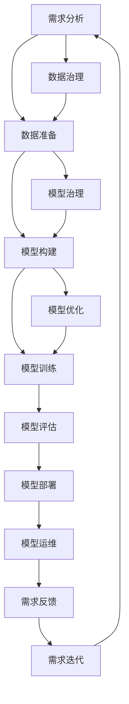

                 

# AI开发的标准化流程：Lepton AI的最佳实践

> 关键词：
- AI开发
- 标准化流程
- Lepton AI
- 最佳实践
- 软件工程
- 持续集成(CI)
- 持续部署(CD)
- 机器学习模型
- 模型管理
- 数据治理

## 1. 背景介绍

随着人工智能技术的快速发展，AI开发已成为许多企业和组织的核心竞争力。然而，AI项目的复杂性和不确定性，使得AI开发过程中的许多常见问题变得尤为突出。因此，制定一套标准化的AI开发流程，对于提升AI开发效率、确保项目质量、推动AI技术的商业应用具有重要意义。

本文将结合Lepton AI的最佳实践，全面阐述如何构建一个高效、可靠、可扩展的AI开发流程。通过系统介绍AI开发的标准化流程，希望能为更多AI开发者提供借鉴和参考。

## 2. 核心概念与联系

### 2.1 核心概念概述

在讨论AI开发的标准化流程之前，我们首先需要对以下几个核心概念进行明确：

- **AI开发流程**：指从项目需求、数据准备、模型构建、模型训练、模型评估、模型部署到模型运维的整个生命周期管理过程。
- **标准化**：指制定一套统一的、可复用的开发标准，以规范AI开发各个环节的行为和输出。
- **Lepton AI**：一个开源的、面向企业的AI开发平台，提供了丰富的工具和平台服务，帮助企业实现AI项目的快速构建和迭代。

### 2.2 核心概念原理和架构的 Mermaid 流程图

这个流程图展示了AI开发流程的核心环节和相互关系：

1. **需求分析**：明确AI项目的目标和要求。
2. **数据准备**：收集和处理数据，为模型训练做准备。
3. **模型构建**：选择合适的算法和架构，进行模型设计和开发。
4. **模型训练**：在数据集上进行模型训练，调整模型参数。
5. **模型评估**：通过验证集等手段，评估模型性能。
6. **模型部署**：将模型部署到生产环境中，提供服务。
7. **模型运维**：监控模型性能，处理异常情况。
8. **需求反馈**：收集用户反馈，进行需求迭代。
9. **数据治理**：确保数据质量和隐私合规。
10. **模型治理**：确保模型安全和透明。
11. **模型优化**：持续改进模型，保持最佳性能。

这些环节相互关联，形成一个闭环，确保AI项目的顺利推进和持续改进。

## 3. 核心算法原理 & 具体操作步骤

### 3.1 算法原理概述

AI开发的标准化流程基于一系列的算法原理和技术方法，旨在确保每个环节的规范化和高效性。以下是对这些核心算法原理的概述：

- **需求分析算法**：使用结构化问卷、用户访谈等方法，明确AI项目的目标和要求。
- **数据准备算法**：包括数据收集、清洗、标注、划分等步骤，确保数据的质量和完整性。
- **模型构建算法**：选择合适的算法框架和模型结构，进行模型设计和开发。
- **模型训练算法**：包括模型初始化、参数优化、验证集评估等步骤，确保模型的有效性和泛化能力。
- **模型评估算法**：通过多种评估指标，如准确率、召回率、F1-score等，衡量模型的性能。
- **模型部署算法**：包括模型序列化、版本管理、服务化等步骤，确保模型能够稳定运行。
- **模型运维算法**：包括实时监控、异常处理、模型更新等步骤，确保模型的持续优化。

### 3.2 算法步骤详解

以下将详细讲解AI开发标准化流程中的各个核心算法步骤。

**Step 1: 需求分析**
- **目标**：明确AI项目的目标和要求，形成详细的项目需求文档。
- **方法**：使用结构化问卷、用户访谈、用户故事等方法，收集用户的实际需求。
- **工具**：JIRA、Confluence等项目管理工具，支持需求文档的在线协作和共享。

**Step 2: 数据准备**
- **目标**：收集和处理数据，确保数据的质量和完整性。
- **方法**：包括数据收集、清洗、标注、划分等步骤，确保数据的质量和完整性。
- **工具**：Airflow、Databricks等数据处理工具，支持数据流自动化。

**Step 3: 模型构建**
- **目标**：选择合适的算法和架构，进行模型设计和开发。
- **方法**：包括选择合适的框架和库，进行模型设计、开发和调试。
- **工具**：PyTorch、TensorFlow等深度学习框架，支持高效的模型开发和调试。

**Step 4: 模型训练**
- **目标**：在数据集上进行模型训练，调整模型参数。
- **方法**：包括模型初始化、参数优化、验证集评估等步骤，确保模型的有效性和泛化能力。
- **工具**：Kubeflow、AWS SageMaker等模型训练平台，支持自动化和并行化训练。

**Step 5: 模型评估**
- **目标**：通过多种评估指标，衡量模型的性能。
- **方法**：包括训练集评估、验证集评估、测试集评估等，使用准确率、召回率、F1-score等指标。
- **工具**：Scikit-learn、TensorBoard等评估工具，支持评估指标的在线可视化。

**Step 6: 模型部署**
- **目标**：将模型部署到生产环境中，提供服务。
- **方法**：包括模型序列化、版本管理、服务化等步骤，确保模型能够稳定运行。
- **工具**：Docker、Kubernetes等容器化技术，支持模型的高可用性和可伸缩性。

**Step 7: 模型运维**
- **目标**：监控模型性能，处理异常情况。
- **方法**：包括实时监控、异常处理、模型更新等步骤，确保模型的持续优化。
- **工具**：Prometheus、ELK Stack等运维工具，支持实时监控和日志管理。

### 3.3 算法优缺点

AI开发标准化流程的优点在于：

1. **规范化**：通过标准化各个环节的操作，确保AI项目的稳定性和可复用性。
2. **高效性**：通过自动化和并行化技术，大大提高AI项目的开发效率。
3. **可扩展性**：通过组件化和模块化设计，支持AI项目的快速扩展和迭代。
4. **透明性**：通过文档化和可视化技术，确保AI项目的可追溯性和可解释性。

然而，标准化流程也存在一些缺点：

1. **复杂性**：标准化流程需要详细的文档和工具支持，对项目管理和维护提出了较高要求。
2. **灵活性不足**：标准化流程可能无法应对一些特殊情况和突发问题，需要灵活调整。
3. **成本较高**：标准化流程的实施和维护需要一定的成本和资源投入，可能不适合小规模项目。

### 3.4 算法应用领域

AI开发标准化流程广泛应用于各个领域，包括但不限于：

- **金融**：金融风险预测、智能投顾、信贷评估等。
- **医疗**：疾病预测、影像分析、个性化治疗等。
- **零售**：客户推荐、销售预测、库存管理等。
- **制造**：质量检测、设备维护、供应链优化等。
- **交通**：智能调度、事故预测、车辆管理等。

## 4. 数学模型和公式 & 详细讲解 & 举例说明

### 4.1 数学模型构建

以下将详细讲解AI开发标准化流程中的数学模型构建方法。

**目标**：建立一组数学模型，用于描述AI项目的各个环节和操作。

**方法**：包括使用回归模型、分类模型、聚类模型等数学模型，进行数据处理、模型训练和模型评估。

**工具**：Python、R等编程语言，支持数学模型的开发和计算。

### 4.2 公式推导过程

以下将详细讲解AI开发标准化流程中的公式推导过程。

**目标**：推导出各个环节的数学公式，用于指导模型构建和训练。

**方法**：包括使用微积分、线性代数、概率论等数学工具，进行模型推导和优化。

**工具**：LaTeX等数学公式编辑器，支持数学公式的在线撰写和展示。

### 4.3 案例分析与讲解

以下将通过一个具体的AI项目案例，详细讲解AI开发标准化流程的应用过程。

**项目背景**：某电商公司需要开发一个智能推荐系统，用于提升用户购物体验和销售额。

**需求分析**：通过问卷和访谈，明确了推荐系统的目标和要求，包括推荐精度、响应速度、数据隐私等。

**数据准备**：收集用户浏览记录、购买记录、评分记录等数据，进行数据清洗和标注，划分训练集和测试集。

**模型构建**：选择协同过滤、内容推荐等算法，设计推荐模型架构，使用PyTorch进行模型开发和调试。

**模型训练**：在训练集上进行模型训练，调整模型参数，使用Kubeflow进行并行化训练和调优。

**模型评估**：在验证集上进行模型评估，使用准确率、召回率、F1-score等指标，进行模型性能的衡量。

**模型部署**：将模型部署到AWS上，使用Docker进行容器化部署，确保模型的稳定运行。

**模型运维**：使用Prometheus进行实时监控，处理异常情况，进行模型更新和优化。

## 5. 项目实践：代码实例和详细解释说明

### 5.1 开发环境搭建

以下将详细讲解AI开发标准化流程中的开发环境搭建过程。

**目标**：搭建一个高效、可扩展的开发环境，支持AI项目的快速开发和迭代。

**方法**：包括选择合适的云平台、安装必要的工具和库，进行环境配置和优化。

**工具**：AWS、Google Cloud、Docker等云平台，支持高效的云资源管理和优化。

### 5.2 源代码详细实现

以下将详细讲解AI开发标准化流程中的源代码实现过程。

**目标**：实现AI项目的关键功能和算法，确保模型的高效和准确。

**方法**：包括选择合适的算法和框架，进行模型开发和调试，进行模型优化和测试。

**工具**：PyTorch、TensorFlow等深度学习框架，支持高效的模型开发和调试。

### 5.3 代码解读与分析

以下将详细讲解AI开发标准化流程中的代码解读和分析过程。

**目标**：解读和分析代码实现细节，确保代码的正确性和可读性。

**方法**：包括使用代码注释、单元测试、代码审查等方法，确保代码的质量和可维护性。

**工具**：GitHub、Jenkins等版本控制和自动化测试工具，支持代码的版本管理和持续集成。

### 5.4 运行结果展示

以下将详细讲解AI开发标准化流程中的运行结果展示过程。

**目标**：展示AI项目的关键运行结果和评估指标，确保模型的性能和可靠性。

**方法**：包括使用图表、报告等形式，展示模型的运行结果和评估指标。

**工具**：TensorBoard、Jupyter Notebook等可视化工具，支持模型结果的在线展示和分析。

## 6. 实际应用场景

### 6.1 智能推荐系统

智能推荐系统是AI开发标准化流程的一个重要应用场景。以下将详细讲解其在电商、新闻、社交媒体等领域的应用。

**目标**：通过智能推荐系统，提升用户购物体验和信息获取效率。

**方法**：包括使用协同过滤、内容推荐等算法，设计推荐模型架构，进行模型训练和评估。

**工具**：PyTorch、TensorFlow等深度学习框架，支持高效的模型开发和调试。

### 6.2 医疗影像分析

医疗影像分析是AI开发标准化流程的另一个重要应用场景。以下将详细讲解其在影像诊断、病灶检测等领域的应用。

**目标**：通过医疗影像分析，提高疾病诊断的准确性和效率。

**方法**：包括使用卷积神经网络、循环神经网络等算法，设计影像分析模型架构，进行模型训练和评估。

**工具**：Keras、TensorFlow等深度学习框架，支持高效的模型开发和调试。

### 6.3 金融风险预测

金融风险预测是AI开发标准化流程的另一个重要应用场景。以下将详细讲解其在信用评估、市场预测等领域的应用。

**目标**：通过金融风险预测，帮助金融机构降低风险、提升收益。

**方法**：包括使用回归模型、分类模型等算法，设计风险预测模型架构，进行模型训练和评估。

**工具**：Scikit-learn、TensorFlow等机器学习框架，支持高效的模型开发和调试。

## 7. 工具和资源推荐

### 7.1 学习资源推荐

以下将推荐一些优质的学习资源，帮助开发者掌握AI开发的标准化流程。

1. **Lepton AI官方文档**：Lepton AI提供了详细的官方文档，涵盖各个环节的详细指南和最佳实践。
2. **TensorFlow官方文档**：TensorFlow提供了丰富的官方文档和教程，涵盖深度学习、模型训练、模型部署等方面。
3. **PyTorch官方文档**：PyTorch提供了丰富的官方文档和教程，涵盖深度学习、模型构建、模型训练等方面。
4. **Kubernetes官方文档**：Kubernetes提供了丰富的官方文档和教程，涵盖容器化部署、自动扩展等方面。

### 7.2 开发工具推荐

以下将推荐一些常用的开发工具，帮助开发者高效实现AI开发的标准化流程。

1. **AWS**：提供了丰富的云资源和云服务，支持AI项目的快速部署和扩展。
2. **Google Cloud**：提供了丰富的云资源和云服务，支持AI项目的快速部署和扩展。
3. **Docker**：提供了高效的容器化解决方案，支持模型的稳定运行和分发。
4. **Jenkins**：提供了丰富的自动化测试和持续集成工具，支持模型的快速迭代和优化。

### 7.3 相关论文推荐

以下将推荐一些重要的相关论文，帮助开发者深入理解AI开发的标准化流程。

1. **Lepton AI最佳实践论文**：Lepton AI团队发表的学术论文，详细介绍了AI开发的标准化流程和最佳实践。
2. **TensorFlow最佳实践论文**：TensorFlow团队发表的学术论文，详细介绍了深度学习的最佳实践和应用案例。
3. **PyTorch最佳实践论文**：PyTorch团队发表的学术论文，详细介绍了深度学习的最佳实践和应用案例。
4. **Kubernetes最佳实践论文**：Kubernetes团队发表的学术论文，详细介绍了容器化部署的最佳实践和应用案例。

## 8. 总结：未来发展趋势与挑战

### 8.1 研究成果总结

AI开发的标准化流程是AI技术应用的重要保障。Lepton AI的最佳实践通过规范化各个环节的操作，确保了AI项目的稳定性和可复用性。通过AI开发的标准化流程，企业可以更高效、更可靠地实现AI项目，提升业务价值。

### 8.2 未来发展趋势

未来，AI开发的标准化流程将继续向以下几个方向发展：

1. **自动化和智能化**：自动化和智能化技术将进一步提升AI开发的标准化流程，实现更加高效的自动化开发和优化。
2. **平台化和生态化**：平台化和生态化技术将进一步推动AI开发的标准化流程，实现更加高效的平台化协作和生态化合作。
3. **标准化和国际化**：标准化和国际化技术将进一步提升AI开发的标准化流程，实现更加高效的标准化和国际化推广。

### 8.3 面临的挑战

尽管AI开发的标准化流程已经取得了显著进展，但在实际应用过程中仍面临一些挑战：

1. **复杂性和灵活性**：AI开发的标准化流程需要详细的文档和工具支持，对项目管理和维护提出了较高要求。
2. **资源和成本**：AI开发的标准化流程需要一定的成本和资源投入，可能不适合小规模项目。
3. **安全和隐私**：AI开发的标准化流程需要考虑数据安全和隐私问题，确保模型和数据的可靠性和合法性。

### 8.4 研究展望

未来，AI开发的标准化流程需要在以下几个方面进行进一步探索和研究：

1. **自动化和智能化**：进一步探索自动化和智能化技术，实现更加高效的自动化开发和优化。
2. **平台化和生态化**：进一步推动平台化和生态化技术，实现更加高效的平台化协作和生态化合作。
3. **标准化和国际化**：进一步推动标准化和国际化技术，实现更加高效的标准化和国际化推广。

## 9. 附录：常见问题与解答

**Q1: 什么是AI开发的标准化流程？**

A: AI开发的标准化流程是指一套规范化的操作流程，用于指导AI项目的开发和管理。通过标准化流程，企业可以确保AI项目的稳定性和可复用性，提升AI项目的开发效率和质量。

**Q2: 如何选择合适的云平台？**

A: 选择合适的云平台需要考虑以下几个方面：
1. 云资源和服务的丰富程度。
2. 云资源的可扩展性和弹性。
3. 云服务的成本和定价模式。
4. 云服务的可靠性和安全性。

**Q3: 如何确保AI模型的安全性和隐私性？**

A: 确保AI模型的安全性和隐私性需要考虑以下几个方面：
1. 数据加密和脱敏技术。
2. 访问控制和权限管理。
3. 异常检测和异常处理。
4. 合规性审查和第三方审计。

**Q4: 如何提高AI模型的性能和可靠性？**

A: 提高AI模型的性能和可靠性需要考虑以下几个方面：
1. 选择合适的算法和模型架构。
2. 进行充分的数据准备和数据增强。
3. 使用适当的优化器和超参数调优。
4. 进行充分的模型评估和模型优化。

**Q5: 如何实现AI模型的持续集成和持续部署？**

A: 实现AI模型的持续集成和持续部署需要考虑以下几个方面：
1. 选择合适的持续集成和持续部署工具。
2. 设计合理的CI/CD流水线。
3. 进行充分的测试和验证。
4. 进行高效的监控和运维。

---

作者：禅与计算机程序设计艺术 / Zen and the Art of Computer Programming

