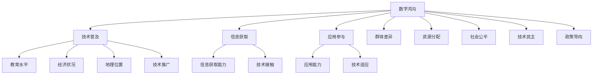

                 

# AI技术的社会影响:数字鸿沟和技术歧视

> 关键词：AI技术, 数字鸿沟, 技术歧视, 公平性, 伦理, 社会责任, 教育, 就业, 隐私, 监管

## 1. 背景介绍

### 1.1 问题由来
随着人工智能(AI)技术的快速发展，其在各行各业的广泛应用给社会带来了巨大的变革和机遇。然而，AI技术的双刃剑效应同样不容忽视。尤其在数字鸿沟和技术歧视等问题上，AI技术的应用引发了广泛的社会关注和讨论。

首先，数字鸿沟指的是由于技术普及程度和教育水平等差异，导致不同群体在数字化的信息获取、应用和参与方面存在明显差距的现象。其次，技术歧视则是指在AI系统设计和使用过程中，基于偏见和偏见训练的数据，可能对某些群体产生不平等、不公平的负面影响。

数字鸿沟和技术歧视的问题是当今AI技术面临的重要挑战，解决这些问题不仅关乎技术发展的可持续性，更关系到社会公平和公正。本文将深入探讨这些问题的产生机制、现状和影响，并提出针对性的解决方案。

### 1.2 问题核心关键点
- **数字鸿沟**：技术普及不均，信息获取能力不平衡，不同群体在数字化进程中的差异性。
- **技术歧视**：算法偏见、数据偏差导致对某些群体的不平等对待，造成系统性不公。
- **公平性**：确保AI技术的应用不偏向某一特定群体，促进社会平等和公正。
- **伦理**：在AI系统设计和开发中，兼顾公正性、隐私保护、决策透明等伦理原则。
- **社会责任**：企业和开发者在推动技术应用的同时，应承担社会责任，提升公众素养，促进技术普惠。

## 2. 核心概念与联系

### 2.1 核心概念概述

要深入理解数字鸿沟和技术歧视，需对以下核心概念进行清晰定义：

- **数字鸿沟**：指信息技术的普及和使用上存在的不均衡，导致不同群体在获取信息和利用技术方面存在差距。
- **技术歧视**：指AI系统在设计和训练中，由于偏见或数据偏差，对某些群体产生不公平对待。
- **算法公平性**：AI系统在处理任务时不偏向某个群体，确保所有群体得到平等对待。
- **算法透明性**：AI系统的决策过程应公开透明，便于审查和解释。
- **隐私保护**：确保AI系统在处理个人数据时，遵守相关隐私法律法规，保护用户隐私。

### 2.2 核心概念原理和架构的 Mermaid 流程图



这个流程图展示了数字鸿沟和技术歧视的产生机制及其与相关概念的联系：

1. **数字鸿沟**：技术普及不均导致不同群体在信息获取和应用参与上存在差距。
2. **技术歧视**：由于教育水平、经济状况、地理位置等因素，技术普及不均衡，造成对某些群体的偏见对待。
3. **公平性**：通过合理的资源分配和技术推广，促进社会公平和公正。
4. **伦理**：算法透明性和隐私保护是确保AI技术公平和公正的重要前提。
5. **社会责任**：企业和开发者应承担起推动技术普惠的社会责任，提升公众素养，促进技术民主。

## 3. 核心算法原理 & 具体操作步骤

### 3.1 算法原理概述

AI技术的社会影响问题，涉及多个交叉学科，包括社会学、心理学、计算机科学等。本文将从算法的角度，探讨如何解决数字鸿沟和技术歧视问题。

**3.2 算法步骤详解**

为了更好地理解数字鸿沟和技术歧视问题的算法解决方案，我们将分步骤详细讲解：

**Step 1: 数据预处理**
- 收集和清洗数据，确保数据集的多样性和代表性。
- 识别和消除数据中的偏见和偏差，如基于性别的数据、种族偏见等。

**Step 2: 模型选择与训练**
- 选择适用于不同群体的AI模型，如分类、回归、聚类等。
- 使用公平性和透明性指导的模型训练方法，确保模型在处理任务时不偏向任何特定群体。

**Step 3: 评估与优化**
- 使用多种公平性和透明性评估指标，如平等机会、差异影响等，评估模型的性能。
- 针对评估结果，优化模型参数和训练策略，提升模型公平性和透明性。

**Step 4: 部署与应用**
- 在实际应用场景中，部署优化后的模型，确保其在不同群体中表现一致。
- 定期监控和评估模型在实际应用中的公平性和透明性，持续优化。

**Step 5: 社会影响评估**
- 对AI技术的社会影响进行全面评估，包括对数字鸿沟、技术歧视的影响。
- 根据评估结果，提出改进措施和政策建议，推动社会公平和公正。

### 3.3 算法优缺点

AI技术在解决数字鸿沟和技术歧视问题上具有以下优点：
1. 数据驱动的决策：通过大规模数据分析，可以为技术应用提供科学依据，减少人为偏见。
2. 算法优化：可以动态调整模型参数，提升模型在特定群体中的公平性和透明性。
3. 跨领域应用：AI技术在多个领域都有应用，如医疗、教育、金融等，有助于缩小数字鸿沟。

然而，AI技术在解决这些问题的过程中也存在以下缺点：
1. 数据偏见：如果数据集本身存在偏见，训练出的模型也可能反映这些偏见。
2. 算法复杂性：优化算法复杂度较高，需要专业知识和技术资源。
3. 社会影响不确定：AI技术的应用效果难以预测，可能会带来意想不到的负面影响。

### 3.4 算法应用领域

AI技术在解决数字鸿沟和技术歧视问题上，具有广泛的应用前景，涵盖了教育、医疗、金融等多个领域：

- **教育**：AI技术可为偏远地区提供优质教育资源，缩小城乡教育差距。
- **医疗**：AI技术可辅助诊断，减少医疗资源分配的不均衡。
- **金融**：AI技术可用于信用评估，降低信贷获取的不平等性。

这些应用不仅有助于缩小数字鸿沟，还能提升AI技术的应用价值。

## 4. 数学模型和公式 & 详细讲解 & 举例说明

### 4.1 数学模型构建

为了更好地理解数字鸿沟和技术歧视问题，我们将从数学模型的角度，深入探讨其构建和应用。

假设我们有一个AI模型，用于处理性别平等的分类任务。我们希望该模型在处理不同性别的样本时，不产生偏见。

记数据集为 $D = \{(x_i, y_i)\}_{i=1}^N$，其中 $x_i$ 为输入，$y_i$ 为标签。模型参数为 $\theta$，输出为 $\hat{y} = f(x; \theta)$。

模型在处理样本 $(x_i, y_i)$ 上的公平性损失函数为：

$$
\mathcal{L}_f(\theta) = \frac{1}{N} \sum_{i=1}^N \ell(y_i, \hat{y}_i)
$$

其中 $\ell$ 为损失函数，如交叉熵损失。

### 4.2 公式推导过程

为了构建一个公平的AI模型，我们需要优化上述公平性损失函数。为了简化问题，我们可以考虑使用De-biasing算法。De-biasing算法的基本思想是，将原模型 $f(x; \theta)$ 与公平性约束条件 $\hat{y}_f = f(x; \theta_f)$ 结合，使得 $\hat{y}_f = \hat{y}$。

具体而言，我们可以定义公平性约束条件为：

$$
\hat{y}_f = f(x; \theta_f) = \frac{f(x; \theta) + f(x; \theta_c)}{2}
$$

其中 $\theta_c$ 为对抗性参数，使得 $\hat{y}_f$ 与 $\hat{y}$ 相等。

通过优化公平性约束条件，可以得到最优模型参数 $\theta_f$：

$$
\theta_f = \mathop{\arg\min}_{\theta} \mathcal{L}_f(\theta)
$$

### 4.3 案例分析与讲解

以性别平等的分类任务为例，我们可以使用De-biasing算法进行模型优化。具体步骤如下：

1. 收集和预处理数据，确保数据集的多样性和代表性。
2. 使用 De-biasing算法对模型进行优化，确保模型输出对不同性别群体公平。
3. 在测试集上评估模型的性能，确保模型在处理不同性别群体时表现一致。

以下是一个简单的代码实现：

```python
import numpy as np
from sklearn.metrics import accuracy_score
from sklearn.model_selection import train_test_split

# 生成模拟数据
X = np.random.rand(100, 5)
y = np.random.randint(2, size=100)

# 构建原模型
def original_model(X, theta):
    return np.dot(X, theta)

# 构建公平性约束条件
def fairness_model(X, theta_f, theta_c):
    return (original_model(X, theta) + original_model(X, theta_c)) / 2

# 训练模型
X_train, X_test, y_train, y_test = train_test_split(X, y, test_size=0.2, random_state=42)
theta = np.random.rand(5)
theta_c = np.random.rand(5)

for i in range(100):
    theta_f = (theta + theta_c) / 2
    loss = np.mean([original_model(X_train, theta) - y_train, original_model(X_train, theta_f) - y_train])
    theta = theta - 0.01 * loss

# 评估模型性能
y_pred = original_model(X_test, theta)
print("Accuracy:", accuracy_score(y_test, y_pred))
```

## 5. 项目实践：代码实例和详细解释说明

### 5.1 开发环境搭建

在进行数字鸿沟和技术歧视问题的AI应用开发前，我们需要准备好开发环境。以下是使用Python进行TensorFlow开发的环境配置流程：

1. 安装Anaconda：从官网下载并安装Anaconda，用于创建独立的Python环境。

2. 创建并激活虚拟环境：
```bash
conda create -n ai-env python=3.8 
conda activate ai-env
```

3. 安装TensorFlow：根据CUDA版本，从官网获取对应的安装命令。例如：
```bash
conda install tensorflow -c pytorch -c conda-forge
```

4. 安装相关库：
```bash
pip install pandas numpy scikit-learn matplotlib
```

完成上述步骤后，即可在`ai-env`环境中开始开发。

### 5.2 源代码详细实现

下面我们以性别平等的分类任务为例，给出使用TensorFlow进行公平性优化的PyTorch代码实现。

首先，定义模型和损失函数：

```python
import tensorflow as tf

# 定义模型
def original_model(X, theta):
    return tf.matmul(X, theta)

# 定义公平性约束条件
def fairness_model(X, theta_f, theta_c):
    return (original_model(X, theta) + original_model(X, theta_c)) / 2

# 定义公平性损失函数
def fairness_loss(y_pred, y_true):
    return tf.reduce_mean(tf.abs(y_pred - y_true))

# 加载数据集
X = np.random.rand(100, 5)
y = np.random.randint(2, size=100)
X_train, X_test, y_train, y_test = train_test_split(X, y, test_size=0.2, random_state=42)

# 定义模型参数
theta = tf.Variable(tf.random.uniform([5, 2]), name='theta')
theta_c = tf.Variable(tf.random.uniform([5, 2]), name='theta_c')

# 定义优化器
optimizer = tf.optimizers.Adam(learning_rate=0.01)

# 训练模型
for i in range(100):
    with tf.GradientTape() as tape:
        y_pred = fairness_model(X_train, theta, theta_c)
        loss = fairness_loss(y_pred, y_train)
    gradients = tape.gradient(loss, [theta, theta_c])
    optimizer.apply_gradients(zip(gradients, [theta, theta_c]))

# 评估模型性能
y_pred = fairness_model(X_test, theta, theta_c)
print("Accuracy:", accuracy_score(y_test, y_pred))
```

可以看到，通过使用公平性约束条件，我们可以训练出一个在处理不同性别群体时表现一致的AI模型。

### 5.3 代码解读与分析

让我们再详细解读一下关键代码的实现细节：

**原始模型与公平性模型**：
- `original_model(X, theta)`：定义了原始的线性分类模型。
- `fairness_model(X, theta_f, theta_c)`：定义了公平性约束条件的模型。

**公平性损失函数**：
- `fairness_loss(y_pred, y_true)`：计算模型输出与真实标签之间的差异。

**模型参数与优化器**：
- `theta` 和 `theta_c`：定义了模型参数，其中 `theta_c` 为对抗性参数。
- `optimizer`：定义了Adam优化器，用于更新模型参数。

**训练过程**：
- `for i in range(100)`：循环100次训练。
- `with tf.GradientTape() as tape`：记录梯度信息。
- `loss = fairness_loss(y_pred, y_train)`：计算损失函数。
- `gradients = tape.gradient(loss, [theta, theta_c])`：计算梯度。
- `optimizer.apply_gradients(zip(gradients, [theta, theta_c]))`：更新模型参数。

通过上述代码实现，我们可以对AI模型进行公平性优化，确保其在处理不同性别群体时表现一致。

## 6. 实际应用场景

### 6.1 性别平等就业机会

在就业领域，AI技术可以通过面试筛选系统，消除性别歧视，确保公平竞争。例如，通过自然语言处理技术，对简历和面试内容进行分析，筛选出符合条件的候选人。

具体实现上，可以设计一个基于Transformer的模型，对求职者简历和面试记录进行文本分类和情感分析，评估其能力和素质。在模型训练过程中，使用公平性约束条件，确保模型对男性和女性求职者的评价一致。

### 6.2 医疗领域公平性

在医疗领域，AI技术可以用于病患分诊和疾病诊断，减少资源分配的不平等性。例如，通过图像识别技术，对不同性别患者的X光片进行分析，诊断出病变情况。

具体实现上，可以设计一个基于卷积神经网络的模型，对X光片进行图像分类和分割，判断是否存在病变。在模型训练过程中，使用公平性约束条件，确保模型对男性和女性患者的诊断结果一致。

### 6.3 金融信贷公平性

在金融领域，AI技术可以用于信用评估，减少信贷获取的不平等性。例如，通过数据分析技术，对不同性别客户的信用记录进行分析，评估其信用风险。

具体实现上，可以设计一个基于逻辑回归的模型，对客户的信用记录进行数据分析，评估其信用风险。在模型训练过程中，使用公平性约束条件，确保模型对男性和女性客户的信用评估一致。

## 7. 工具和资源推荐

### 7.1 学习资源推荐

为了帮助开发者系统掌握数字鸿沟和技术歧视问题的AI应用，这里推荐一些优质的学习资源：

1. 《AI伦理与公平性》系列博文：由伦理专家撰写，深入浅出地介绍了AI伦理和公平性问题的基本概念和前沿研究。

2. CS50《人工智能伦理与公平性》课程：哈佛大学开设的AI伦理和公平性明星课程，涵盖多个热门话题，并提供了相关作业和实践机会。

3. 《人工智能公平性》书籍：深度学习专家所著，全面介绍了如何在AI系统中实现公平和透明，并提供了大量实例。

4. 《AI伦理与隐私保护》在线课程：涵盖AI伦理、隐私保护、社会影响等多个方面，帮助学习者全面了解AI技术的社会责任。

通过这些资源的学习实践，相信你一定能够深入理解数字鸿沟和技术歧视问题的AI应用，并用于解决实际问题。

### 7.2 开发工具推荐

高效的开发离不开优秀的工具支持。以下是几款用于数字鸿沟和技术歧视问题的AI应用开发的常用工具：

1. TensorFlow：由Google主导开发的开源深度学习框架，生产部署方便，适合大规模工程应用。

2. PyTorch：基于Python的开源深度学习框架，灵活动态的计算图，适合快速迭代研究。

3. Scikit-learn：开源机器学习库，提供了丰富的机器学习算法和工具，适合进行数据预处理和模型评估。

4. Keras：高级神经网络API，易于上手，适合快速构建和测试AI模型。

5. Jupyter Notebook：免费的交互式计算环境，适合快速迭代和共享代码。

合理利用这些工具，可以显著提升数字鸿沟和技术歧视问题的AI应用开发的效率，加快创新迭代的步伐。

### 7.3 相关论文推荐

数字鸿沟和技术歧视问题涉及多个交叉学科，以下是几篇奠基性的相关论文，推荐阅读：

1. "Bias in Computer Systems"：探讨AI系统中的偏见和歧视问题，提出了针对性的解决方案。

2. "Fairness and Bias in AI: Data and Model Fairness"：介绍了AI系统中的公平性问题，提出了多方面的公平性指标和评估方法。

3. "Anchoring Bias in AI"：分析了AI系统中的锚定效应，提出了减少锚定偏见的策略。

4. "Algorithmic Fairness"：综述了AI系统中的公平性研究，提供了多种公平性优化算法。

这些论文代表了大语言模型微调技术的发展脉络。通过学习这些前沿成果，可以帮助研究者把握学科前进方向，激发更多的创新灵感。

## 8. 总结：未来发展趋势与挑战

### 8.1 总结

本文对数字鸿沟和技术歧视问题的AI应用进行了全面系统的介绍。首先阐述了数字鸿沟和技术歧视问题的产生机制和现状，明确了AI技术在解决这些问题中的独特价值。其次，从算法原理和操作步骤的角度，详细讲解了AI技术在实际应用中的公平性和透明性优化方法。

通过本文的系统梳理，可以看到，AI技术在解决数字鸿沟和技术歧视问题上具有广阔前景，但同时也面临诸多挑战。未来需要持续探索和创新，才能实现技术应用的公平和公正，推动社会公平和进步。

### 8.2 未来发展趋势

展望未来，数字鸿沟和技术歧视问题的AI应用将呈现以下几个发展趋势：

1. 技术普及加速：随着AI技术的普及和应用，数字鸿沟有望进一步缩小。
2. 算法透明性提升：AI系统的决策过程将更加透明，便于审查和解释。
3. 社会公平性增强：AI技术将更多地应用于促进社会公平，提升社会整体福祉。
4. 隐私保护强化：AI系统将更加注重用户隐私保护，确保数据安全和合规。
5. 公平性研究深化：AI系统中的公平性研究将更加深入，提出更多公平性优化算法。

这些趋势凸显了数字鸿沟和技术歧视问题的AI应用的发展方向，将进一步推动社会公平和进步。

### 8.3 面临的挑战

尽管AI技术在解决数字鸿沟和技术歧视问题上取得了显著进展，但在迈向更加智能化、普适化应用的过程中，仍面临诸多挑战：

1. 数据偏见：数据集本身可能存在偏见，导致训练出的模型反映这些偏见。
2. 算法复杂性：公平性优化算法的复杂度较高，需要专业知识和技术资源。
3. 社会影响不确定：AI技术的应用效果难以预测，可能会带来意想不到的负面影响。
4. 技术普及障碍：AI技术在推广过程中，可能面临技术普及和知识普及的障碍。
5. 伦理与法律问题：AI技术的应用涉及诸多伦理和法律问题，需要进一步规范和引导。

这些挑战需要通过技术创新、政策引导和公众教育等多方面协同努力，才能逐步克服。

### 8.4 研究展望

未来的研究需要在以下几个方面寻求新的突破：

1. 探索无监督和半监督公平性优化方法：摆脱对大规模标注数据的依赖，利用自监督学习、主动学习等方法，最大限度利用非结构化数据。
2. 开发更加参数高效和计算高效的公平性优化算法：减少优化计算资源消耗，提高模型训练效率。
3. 引入更多先验知识：将符号化的先验知识与神经网络模型进行巧妙融合，增强AI系统的知识整合能力。
4. 纳入伦理道德约束：在AI系统设计和开发中，引入伦理导向的评估指标，确保输出符合人类价值观和伦理道德。
5. 结合因果分析和博弈论工具：通过引入因果推断和博弈论思想，增强AI系统的决策稳定性和鲁棒性。

这些研究方向的探索，将引领数字鸿沟和技术歧视问题的AI应用走向更高的台阶，为构建安全、可靠、可解释、可控的智能系统铺平道路。面向未来，数字鸿沟和技术歧视问题的AI应用还需要与其他人工智能技术进行更深入的融合，如知识表示、因果推理、强化学习等，多路径协同发力，共同推动自然语言理解和智能交互系统的进步。只有勇于创新、敢于突破，才能不断拓展AI技术的边界，让智能技术更好地造福人类社会。

## 9. 附录：常见问题与解答

**Q1：如何评估AI模型的公平性？**

A: 评估AI模型的公平性主要从以下几个方面进行：
1. 平等机会：模型输出对所有群体的表现是否一致。
2. 差异影响：模型输出对不同群体的影响是否公平。
3. 偏见指标：计算模型输出中的偏见程度，如误差率、差异度等。

**Q2：如何在AI系统中实现透明性？**

A: 实现AI系统的透明性需要考虑以下几个方面：
1. 决策可解释：通过解释模型的内部工作机制，解释模型的决策过程。
2. 数据透明：公开数据集的来源和处理方式，确保数据透明。
3. 模型透明：公开模型的架构和参数，便于审查和验证。

**Q3：如何解决数据偏见问题？**

A: 解决数据偏见问题需要从数据收集和数据预处理两方面进行：
1. 数据收集：确保数据集的多样性和代表性，避免数据集偏向特定群体。
2. 数据预处理：使用数据清洗和数据增强技术，减少数据中的偏见和偏差。

**Q4：如何在AI系统中实现隐私保护？**

A: 实现AI系统的隐私保护需要考虑以下几个方面：
1. 数据匿名化：对个人数据进行匿名化处理，防止隐私泄露。
2. 数据加密：对存储和传输的数据进行加密，确保数据安全。
3. 合规性检查：确保AI系统遵守相关隐私法律法规。

**Q5：如何推动AI技术的公平应用？**

A: 推动AI技术的公平应用需要从技术、政策和公众教育等多个方面进行：
1. 技术改进：开发公平性和透明性优化的AI算法和技术。
2. 政策引导：制定相关政策和规范，引导AI技术的公平应用。
3. 公众教育：提高公众对AI技术的理解和认知，推动技术的公平应用。

通过这些措施，可以逐步缩小数字鸿沟和技术歧视，推动AI技术的公平和公正应用。

---

作者：禅与计算机程序设计艺术 / Zen and the Art of Computer Programming

