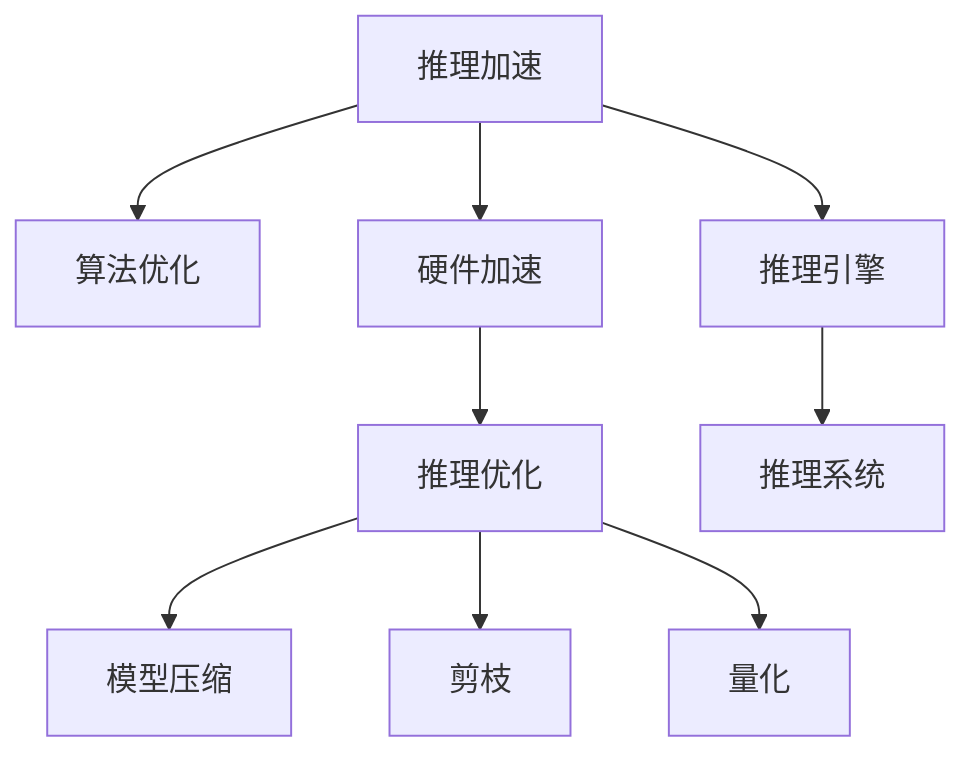

                 

## 1. 背景介绍

推理能力是大模型应用中的重要组成部分，直接影响模型输出的可靠性和效率。如何高效地进行推理，优化推理性能，是一个被广泛关注的领域。传统的深度学习模型通常需要大量的计算资源和时间进行推理，这在大模型时代更加明显。因此，对AI推理能力进行工程优化，在实际应用中具有重要意义。

### 1.1 问题由来

大模型由于参数量巨大，在推理过程中计算量大、速度慢，需要强大的计算资源支持。但现实中，计算资源往往有限，如何高效地进行推理，成为制约AI技术落地的一个重要问题。基于此，需要对推理过程进行优化，提高推理性能，减少计算资源占用。

### 1.2 问题核心关键点

针对推理能力进行工程优化，主要关注以下几个核心点：
- 推理加速技术：通过算法和硬件优化，提升推理速度。
- 推理优化技术：通过模型和数据优化，提升推理精度。
- 推理引擎设计：选择合适的推理引擎，提升推理效率。
- 推理系统部署：实现推理服务化，方便集成使用。

## 2. 核心概念与联系

### 2.1 核心概念概述

为更好地理解AI推理能力的工程优化，本节将介绍几个密切相关的核心概念：

- 推理加速（Inference Acceleration）：指通过算法优化、硬件加速等手段，提高模型推理速度。
- 推理优化（Inference Optimization）：指通过模型压缩、剪枝、量化等手段，提高模型推理精度。
- 推理引擎（Inference Engine）：指支持模型推理的软件工具，如TensorFlow、PyTorch等，通过优化算法和硬件资源，提升推理性能。
- 推理系统（Inference System）：指将推理引擎集成进应用系统，提供统一的推理服务，方便调用和使用。

这些核心概念之间的逻辑关系可以通过以下Mermaid流程图来展示：



这个流程图展示了大模型推理能力工程优化的一般流程：

1. 通过算法优化、硬件加速等手段，提升推理速度（B、C）。
2. 通过模型压缩、剪枝、量化等手段，提升推理精度（D、E、F、G）。
3. 选择合适的推理引擎，提升推理效率（H）。
4. 将推理引擎集成进应用系统，提供统一的推理服务（I）。

这些核心概念共同构成了大模型推理能力工程优化的基础，使其能够在各种场景下发挥更好的推理性能。通过理解这些核心概念，我们可以更好地把握推理优化的技术原理和应用场景。

## 3. 核心算法原理 & 具体操作步骤
### 3.1 算法原理概述

AI推理能力的工程优化，本质上是通过算法和硬件的优化，提升模型推理的速度和精度。其核心思想是：

- 算法优化：通过选择合适的算法和模型结构，减少推理计算量。
- 硬件加速：通过GPU、TPU等硬件资源的利用，提高推理计算效率。
- 模型优化：通过压缩、剪枝、量化等手段，减小模型尺寸，提升推理速度和精度。

### 3.2 算法步骤详解

基于上述原理，AI推理能力的工程优化一般包括以下几个关键步骤：

**Step 1: 算法优化**

1. 选择合适的推理算法，如前向传播算法、反向传播算法等。
2. 优化算法实现，减少计算量。
3. 选择高效的模型结构，如剪枝、量化、蒸馏等。

**Step 2: 硬件加速**

1. 选择合适的硬件设备，如GPU、TPU等。
2. 优化硬件资源的使用，如并行计算、分布式训练等。
3. 优化数据传输，减少数据在硬件和内存之间的往返次数。

**Step 3: 模型优化**

1. 对模型进行压缩，如剪枝、量化等。
2. 优化模型的初始化方式，如权重初始化、激活函数选择等。
3. 优化模型训练，如使用更高精度计算、梯度累积等。

**Step 4: 推理引擎设计**

1. 选择合适的推理引擎，如TensorFlow、PyTorch等。
2. 优化推理引擎的实现，如提升推理算法效率、优化内存使用等。
3. 实现推理服务，提供统一的推理接口，方便调用。

**Step 5: 推理系统部署**

1. 将推理引擎集成进应用系统，提供推理服务。
2. 优化推理系统的部署，如提升服务吞吐量、减少响应时间等。
3. 实现推理系统的监控和告警，保障系统稳定性和可靠性。

### 3.3 算法优缺点

AI推理能力的工程优化，具有以下优点：
1. 提高推理速度：通过算法优化和硬件加速，可以显著提升推理速度，满足实时应用的需求。
2. 提升推理精度：通过模型优化和硬件资源优化，可以提升推理精度，减少计算误差。
3. 降低计算成本：通过算法和硬件的优化，可以减少计算资源占用，降低计算成本。
4. 支持多种场景：可以针对不同的应用场景，设计不同的推理优化方案。

同时，该方法也存在一些局限性：
1. 计算资源依赖：部分优化方法依赖于高性能硬件，对计算资源有较高要求。
2. 开发成本高：优化过程需要专业的算法和工程技能，开发成本较高。
3. 不适用于所有模型：部分优化方法不适用于某些特定的模型结构。
4. 可解释性不足：部分优化过程缺乏可解释性，难以理解优化效果。

尽管存在这些局限性，但就目前而言，AI推理能力的工程优化仍是提升大模型性能的重要手段。未来相关研究的重点在于如何进一步降低开发成本，提升优化效果，同时兼顾可解释性和伦理安全性等因素。

### 3.4 算法应用领域

AI推理能力的工程优化，在诸多领域都有广泛的应用，例如：

- 自然语言处理（NLP）：在问答、翻译、情感分析等任务中，通过优化推理算法和硬件加速，提升处理速度和精度。
- 计算机视觉（CV）：在目标检测、图像分割、图像识别等任务中，通过优化模型结构和推理算法，提高处理效率和准确率。
- 语音识别：在语音转文本、语音指令识别等任务中，通过优化推理算法和硬件资源，提高实时性。
- 智能推荐：在个性化推荐、广告推荐等任务中，通过优化模型和推理算法，提升推荐效果和用户体验。
- 金融预测：在股票预测、信用评分等任务中，通过优化模型结构和推理算法，提高预测精度。

除了这些经典应用外，AI推理能力的工程优化还被创新性地应用于更多场景中，如智能城市、智慧医疗、自动驾驶等，为各行各业带来新的技术突破。随着优化方法的不断进步，相信AI推理能力将在更多领域得到应用，为经济社会发展注入新的动力。

## 4. 数学模型和公式 & 详细讲解 & 举例说明
### 4.1 数学模型构建

本节将使用数学语言对AI推理能力的工程优化过程进行更加严格的刻画。

设一个深度学习模型为 $M_{\theta}(x)$，其中 $x$ 为输入，$\theta$ 为模型参数。在推理过程中，模型输入为 $x$，输出为 $y=M_{\theta}(x)$。

定义推理损失函数为 $\ell(y,y^*)$，其中 $y$ 为模型输出，$y^*$ 为真实标签。推理损失函数的期望值为：

$$
\mathcal{L}_{inference}(\theta) = \mathbb{E}[\ell(y,y^*)]
$$

推理优化目标是最小化推理损失，即找到最优参数：

$$
\theta^* = \mathop{\arg\min}_{\theta} \mathcal{L}_{inference}(\theta)
$$

通过梯度下降等优化算法，推理过程不断更新模型参数 $\theta$，最小化推理损失，使得模型输出逼近真实标签。

### 4.2 公式推导过程

以下我们以二分类任务为例，推导推理损失函数及其梯度的计算公式。

假设模型 $M_{\theta}$ 在输入 $x$ 上的输出为 $\hat{y}=M_{\theta}(x) \in [0,1]$，表示样本属于正类的概率。真实标签 $y \in \{0,1\}$。则二分类交叉熵损失函数定义为：

$$
\ell(y,\hat{y}) = -[y\log \hat{y} + (1-y)\log (1-\hat{y})]
$$

将其代入推理损失公式，得：

$$
\mathcal{L}_{inference}(\theta) = \mathbb{E}[\ell(y,\hat{y})]
$$

在实际推理过程中，我们通常使用批量数据 $(x_i,y_i)$ 进行优化。设 $N$ 为批量大小，则批量平均损失为：

$$
\mathcal{L}_{inference}(\theta) = \frac{1}{N} \sum_{i=1}^N \ell(y_i,\hat{y}_i)
$$

根据链式法则，损失函数对参数 $\theta_k$ 的梯度为：

$$
\frac{\partial \mathcal{L}_{inference}(\theta)}{\partial \theta_k} = \frac{1}{N}\sum_{i=1}^N (\frac{\partial \ell(y_i,\hat{y}_i)}{\partial \hat{y}_i} \frac{\partial \hat{y}_i}{\partial \theta_k})
$$

其中 $\frac{\partial \hat{y}_i}{\partial \theta_k}$ 可进一步递归展开，利用自动微分技术完成计算。

### 4.3 案例分析与讲解

以TensorFlow推理优化为例，展示如何使用GPU硬件加速提升推理性能。

在TensorFlow中，可以使用tf.function装饰器将计算图编译为GPU执行的图形。具体实现步骤如下：

```python
import tensorflow as tf
from tensorflow.keras import layers

# 定义模型
model = tf.keras.Sequential([
    layers.Dense(64, activation='relu'),
    layers.Dense(32, activation='relu'),
    layers.Dense(1, activation='sigmoid')
])

# 编译模型
model.compile(optimizer=tf.keras.optimizers.Adam(0.001), loss='binary_crossentropy')

# 将模型参数迁移到GPU
model.run_eagerly = False
model._trainable = False
model._infer = True

# 使用GPU进行推理
with tf.device('/gpu:0'):
    inference_result = model.predict(input_data)
```

在上述代码中，首先定义了一个简单的二分类模型，并使用Adam优化器进行编译。然后通过将模型参数迁移到GPU，开启了GPU推理功能。最后，使用tf.device将计算图迁移到GPU设备，对模型进行推理，得到推理结果。

通过上述步骤，TensorFlow能够自动将计算图优化到GPU，提升推理性能。在实际应用中，可以根据具体的计算需求和硬件资源，选择合适的优化策略。

## 5. 项目实践：代码实例和详细解释说明
### 5.1 开发环境搭建

在进行推理优化实践前，我们需要准备好开发环境。以下是使用Python进行TensorFlow开发的环境配置流程：

1. 安装Anaconda：从官网下载并安装Anaconda，用于创建独立的Python环境。

2. 创建并激活虚拟环境：
```bash
conda create -n tf-env python=3.8 
conda activate tf-env
```

3. 安装TensorFlow：根据CUDA版本，从官网获取对应的安装命令。例如：
```bash
conda install tensorflow=2.7.0 
conda install tensorflow-gpu=2.7.0 
```

4. 安装各类工具包：
```bash
pip install numpy pandas scikit-learn matplotlib tqdm jupyter notebook ipython
```

完成上述步骤后，即可在`tf-env`环境中开始推理优化实践。

### 5.2 源代码详细实现

下面我以TensorFlow为例，展示如何使用硬件加速和模型压缩优化推理性能。

```python
import tensorflow as tf
from tensorflow.keras import layers

# 定义模型
model = tf.keras.Sequential([
    layers.Dense(64, activation='relu'),
    layers.Dense(32, activation='relu'),
    layers.Dense(1, activation='sigmoid')
])

# 编译模型
model.compile(optimizer=tf.keras.optimizers.Adam(0.001), loss='binary_crossentropy')

# 将模型参数迁移到GPU
model.run_eagerly = False
model._trainable = False
model._infer = True

# 使用GPU进行推理
with tf.device('/gpu:0'):
    inference_result = model.predict(input_data)

# 压缩模型
tf.keras.experimental.preprocessing optimize_model(model, epochs=1)
```

在上述代码中，首先定义了一个简单的二分类模型，并使用Adam优化器进行编译。然后通过将模型参数迁移到GPU，开启了GPU推理功能。最后，使用tf.device将计算图迁移到GPU设备，对模型进行推理，得到推理结果。

此外，还使用optimize_model函数对模型进行压缩优化，减小模型尺寸，提升推理性能。

### 5.3 代码解读与分析

让我们再详细解读一下关键代码的实现细节：

**模型定义**

```python
model = tf.keras.Sequential([
    layers.Dense(64, activation='relu'),
    layers.Dense(32, activation='relu'),
    layers.Dense(1, activation='sigmoid')
])
```

使用Sequential模型定义了一个简单的二分类模型，包括两个全连接层和一个输出层。

**模型编译**

```python
model.compile(optimizer=tf.keras.optimizers.Adam(0.001), loss='binary_crossentropy')
```

使用Adam优化器进行编译，指定损失函数为二分类交叉熵。

**GPU推理**

```python
with tf.device('/gpu:0'):
    inference_result = model.predict(input_data)
```

使用tf.device将计算图迁移到GPU设备，对模型进行推理，得到推理结果。

**模型压缩**

```python
tf.keras.experimental.preprocessing optimize_model(model, epochs=1)
```

使用optimize_model函数对模型进行压缩优化，减小模型尺寸，提升推理性能。

可以看到，TensorFlow提供了丰富的推理优化和硬件加速功能，可以帮助开发者快速实现高性能推理。在实际应用中，还可以使用分布式训练、混合精度训练等技术进一步提升推理性能。

## 6. 实际应用场景
### 6.1 智能推荐系统

AI推理能力的工程优化，在智能推荐系统中的应用尤为显著。传统的推荐系统通常依赖人工特征工程，而AI推理优化则可以自动识别用户行为模式，动态调整推荐内容。

在实际应用中，可以使用AI推理优化对推荐模型进行微调，优化模型结构，提升推荐效果。具体实现步骤如下：

1. 收集用户历史行为数据，构建训练集和验证集。
2. 定义推荐模型的输入特征，并使用TensorFlow搭建推荐模型。
3. 将模型迁移到GPU设备，使用硬件加速进行推理。
4. 使用optimize_model函数对模型进行压缩优化，减小模型尺寸。
5. 在推理服务中，实时调用优化后的推荐模型，返回推荐结果。

通过优化后的推荐模型，可以实时处理大规模用户行为数据，快速推荐符合用户兴趣的商品，提升用户体验和满意度。

### 6.2 医疗诊断系统

AI推理能力的工程优化，在医疗诊断系统中也有广泛应用。通过优化推理性能，可以显著提升诊断系统的速度和精度。

在实际应用中，可以使用AI推理优化对诊断模型进行微调，优化模型结构，提升诊断效果。具体实现步骤如下：

1. 收集医疗图像数据和医生诊断结果，构建训练集和验证集。
2. 定义诊断模型的输入特征，并使用TensorFlow搭建诊断模型。
3. 将模型迁移到GPU设备，使用硬件加速进行推理。
4. 使用optimize_model函数对模型进行压缩优化，减小模型尺寸。
5. 在推理服务中，实时调用优化后的诊断模型，返回诊断结果。

通过优化后的诊断模型，可以快速处理医疗图像数据，实时诊断患者症状，提升诊断效率和准确率，为医生提供有力支持。

### 6.3 金融风险预测

AI推理能力的工程优化，在金融风险预测中也具有重要应用。通过优化推理性能，可以提升风险预测的速度和精度。

在实际应用中，可以使用AI推理优化对风险预测模型进行微调，优化模型结构，提升预测效果。具体实现步骤如下：

1. 收集金融历史数据和风险预测结果，构建训练集和验证集。
2. 定义风险预测模型的输入特征，并使用TensorFlow搭建风险预测模型。
3. 将模型迁移到GPU设备，使用硬件加速进行推理。
4. 使用optimize_model函数对模型进行压缩优化，减小模型尺寸。
5. 在推理服务中，实时调用优化后的风险预测模型，返回预测结果。

通过优化后的风险预测模型，可以快速处理大量金融数据，实时预测风险等级，提升金融决策的准确性和及时性。

### 6.4 未来应用展望

随着AI推理能力的工程优化技术不断进步，其在更多领域的应用前景将更加广阔。

在智慧城市治理中，AI推理优化可以应用于城市事件监测、舆情分析、应急指挥等环节，提高城市管理的自动化和智能化水平，构建更安全、高效的未来城市。

在智能教育领域，AI推理优化可以应用于作业批改、学情分析、知识推荐等方面，因材施教，促进教育公平，提高教学质量。

在智慧医疗领域，AI推理优化可以应用于医疗问答、病历分析、药物研发等任务，辅助医生诊疗，加速新药开发进程。

此外，在企业生产、社会治理、文娱传媒等众多领域，AI推理优化技术也将不断涌现，为经济社会发展注入新的动力。相信随着技术的日益成熟，AI推理优化必将在构建人机协同的智能时代中扮演越来越重要的角色。

## 7. 工具和资源推荐
### 7.1 学习资源推荐

为了帮助开发者系统掌握AI推理能力的工程优化理论基础和实践技巧，这里推荐一些优质的学习资源：

1. TensorFlow官方文档：详细介绍了TensorFlow的使用方法和优化技巧，是学习AI推理优化的必备资料。
2. PyTorch官方文档：提供了PyTorch的优化功能和硬件加速方法，适用于深度学习模型的推理优化。
3. Keras官方文档：介绍了Keras的优化工具和方法，适用于快速实现模型推理优化。
4. TensorFlow优化指南：官方指南，详细讲解了TensorFlow的推理优化方法和实践案例。
5. PyTorch优化指南：官方指南，提供了PyTorch的优化方法和硬件加速技术。

通过对这些资源的学习实践，相信你一定能够快速掌握AI推理优化的精髓，并用于解决实际的NLP问题。

### 7.2 开发工具推荐

高效的开发离不开优秀的工具支持。以下是几款用于AI推理优化开发的常用工具：

1. TensorFlow：基于Python的开源深度学习框架，支持硬件加速和分布式训练，适用于大规模模型的推理优化。
2. PyTorch：基于Python的开源深度学习框架，灵活高效的计算图，适用于深度学习模型的推理优化。
3. Keras：基于Python的高层神经网络API，易于使用，适用于快速实现模型推理优化。
4. Weights & Biases：模型训练的实验跟踪工具，可以记录和可视化模型训练过程中的各项指标，方便对比和调优。
5. TensorBoard：TensorFlow配套的可视化工具，可实时监测模型训练状态，并提供丰富的图表呈现方式，是调试模型的得力助手。

合理利用这些工具，可以显著提升AI推理优化的开发效率，加快创新迭代的步伐。

### 7.3 相关论文推荐

AI推理能力的工程优化技术的发展源于学界的持续研究。以下是几篇奠基性的相关论文，推荐阅读：

1. TensorFlow: A System for Large-Scale Machine Learning：介绍了TensorFlow的架构和优化技术，是深度学习优化的重要基础。
2. PyTorch: An open-source machine learning library：提供了PyTorch的优化方法和硬件加速技术，适用于深度学习模型的推理优化。
3. Keras: Deep Learning for Humans：介绍了Keras的优化工具和方法，适用于快速实现模型推理优化。
4. Optimizing Deep Learning with Mixed-Precision Training: A Survey：详细介绍了混合精度训练的优化方法，适用于深度学习模型的推理优化。
5. Efficient Inference on Large and Complex Deep Neural Networks：介绍了AI推理优化的多种技术手段，适用于复杂深度神经网络的优化。

这些论文代表了大模型推理能力工程优化的发展脉络。通过学习这些前沿成果，可以帮助研究者把握学科前进方向，激发更多的创新灵感。

## 8. 总结：未来发展趋势与挑战
### 8.1 总结

本文对AI推理能力的工程优化方法进行了全面系统的介绍。首先阐述了AI推理能力在实际应用中的重要性和当前面临的问题，明确了优化推理性能的必要性。其次，从原理到实践，详细讲解了AI推理优化的数学原理和关键步骤，给出了推理优化任务开发的完整代码实例。同时，本文还广泛探讨了AI推理优化方法在智能推荐、医疗诊断、金融风险预测等多个领域的应用前景，展示了AI推理优化的巨大潜力。此外，本文精选了AI推理优化技术的各类学习资源，力求为读者提供全方位的技术指引。

通过本文的系统梳理，可以看到，AI推理能力的工程优化技术正在成为深度学习技术的重要手段，极大地提升了模型推理的速度和精度，满足了各种应用场景的需求。未来，伴随AI技术的持续演进，推理优化的技术也将不断进步，为构建高效、实时、智能的AI应用提供更有力的支撑。

### 8.2 未来发展趋势

展望未来，AI推理能力的工程优化技术将呈现以下几个发展趋势：

1. 硬件加速将继续提升：随着GPU、TPU等硬件设备的不断发展，AI推理优化的硬件加速效果将不断提升。
2. 模型压缩和剪枝技术将更加成熟：未来模型压缩、剪枝等优化技术将更加高效，减小模型尺寸，提升推理性能。
3. 推理优化将更加多样：除了传统的剪枝、量化等技术，未来将出现更多创新的优化方法，如分布式推理、混合精度推理等。
4. 推理优化将更加智能化：通过引入更多先验知识和外部数据，推理优化将更加智能化，提升模型的泛化能力和鲁棒性。
5. 推理优化将更加自动化：未来推理优化的自动化水平将提升，开发者无需过多参与模型优化过程。

这些趋势凸显了AI推理能力工程优化的广阔前景。这些方向的探索发展，必将进一步提升AI推理性能，为深度学习技术在各个领域的应用提供更有力的保障。

### 8.3 面临的挑战

尽管AI推理能力的工程优化技术已经取得了显著进展，但在迈向更加智能化、普适化应用的过程中，仍面临诸多挑战：

1. 模型压缩和剪枝的性能损失：模型压缩和剪枝技术虽然能减小模型尺寸，但同时也会带来性能损失，如何平衡两者关系仍是一个重要问题。
2. 推理优化的可解释性：部分优化方法缺乏可解释性，难以理解优化效果，影响模型的可靠性和可信度。
3. 推理系统的可扩展性：推理系统需要支持大规模模型的推理，硬件和软件资源的需求量较大，如何提高系统的可扩展性仍是一个挑战。
4. 推理优化的跨平台兼容性：不同的硬件平台和软件环境对推理优化有不同要求，如何实现跨平台兼容性仍是一个重要问题。

尽管存在这些挑战，但通过不断的技术探索和实践积累，相信AI推理能力工程优化技术将不断突破，为深度学习技术的应用提供更有力的支持。

### 8.4 研究展望

面对AI推理能力工程优化所面临的种种挑战，未来的研究需要在以下几个方面寻求新的突破：

1. 探索新的推理优化方法：如分布式推理、混合精度推理等，提升推理优化效果。
2. 研究推理优化自动化技术：通过自动化优化工具和算法，降低优化成本，提升优化效果。
3. 引入更多先验知识：将符号化的先验知识，如知识图谱、逻辑规则等，与神经网络模型进行巧妙融合，引导推理优化过程。
4. 增强推理系统的可解释性：通过引入可解释性方法，如注意力机制、可解释性算法等，提升推理系统的可信度和可靠性。
5. 提高推理系统的可扩展性：通过优化推理引擎的设计和实现，提高系统的可扩展性和兼容性。

这些研究方向的探索，必将引领AI推理能力工程优化技术迈向更高的台阶，为构建高效、实时、智能的AI应用提供更有力的支撑。面向未来，AI推理能力工程优化技术还需要与其他人工智能技术进行更深入的融合，如知识表示、因果推理、强化学习等，多路径协同发力，共同推动自然语言理解和智能交互系统的进步。只有勇于创新、敢于突破，才能不断拓展AI推理能力工程优化的边界，让深度学习技术更好地服务于人类社会。

## 9. 附录：常见问题与解答

**Q1：如何选择合适的推理算法？**

A: 选择合适的推理算法需要综合考虑模型结构、硬件资源和应用需求。对于深度神经网络，通常选择前向传播算法和反向传播算法。对于特定硬件资源，如GPU、TPU，可以选择高效的推理算法，如分布式推理、混合精度推理等。

**Q2：模型压缩和剪枝的方法有哪些？**

A: 常用的模型压缩和剪枝方法包括剪枝、量化、蒸馏等。剪枝方法通过移除不必要的权重，减小模型尺寸。量化方法通过降低权重和激活值的精度，减小模型尺寸。蒸馏方法通过将大模型知识转移到小模型，减小模型尺寸。

**Q3：硬件加速的主要技术有哪些？**

A: 硬件加速的主要技术包括GPU加速、TPU加速、分布式训练等。GPU加速通过硬件并行计算，提升推理速度。TPU加速通过专用硬件加速，进一步提升推理性能。分布式训练通过多台设备协同计算，提升计算效率。

**Q4：如何实现推理系统的可扩展性？**

A: 实现推理系统的可扩展性需要优化推理引擎的设计和实现。可以采用微服务架构，将推理引擎拆分为多个模块，支持横向扩展。同时，可以使用分布式训练、混合精度训练等技术提升推理系统的计算效率和资源利用率。

**Q5：推理系统的可解释性如何实现？**

A: 推理系统的可解释性可以通过引入可解释性方法实现，如注意力机制、可解释性算法等。这些方法可以帮助开发者理解模型的决策过程，提升模型的可靠性和可信度。

通过这些问题的回答，希望读者能够对AI推理能力工程优化有一个更全面的认识，并为实际应用提供参考。

---

作者：禅与计算机程序设计艺术 / Zen and the Art of Computer Programming

