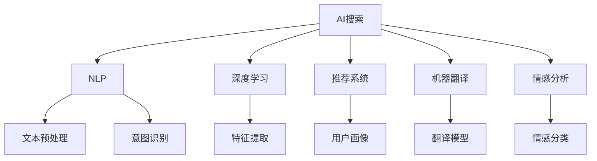

                 

# AI搜索如何改变旅游和酒店业的客户服务

## 1. 背景介绍

随着人工智能技术的迅猛发展，AI搜索在旅游和酒店业中的应用越来越广泛，极大地改变了客户服务的模式和体验。通过自然语言处理、深度学习等前沿技术，AI搜索系统能够理解和处理自然语言，快速响应客户的查询需求，提供个性化、高效的服务。本文将详细探讨AI搜索在旅游和酒店业客户服务中的原理、实践和未来展望。

## 2. 核心概念与联系

### 2.1 核心概念概述

为更好地理解AI搜索如何改变旅游和酒店业的客户服务，本节将介绍几个核心概念：

- **AI搜索（AI Search）**：基于人工智能技术的搜索系统，利用自然语言处理和深度学习等技术，理解和处理用户的查询需求，提供相关的搜索结果。
- **自然语言处理（NLP）**：涉及计算机对人类语言文字的理解和处理，使机器能够理解和生成自然语言。
- **深度学习（Deep Learning）**：一种基于人工神经网络的机器学习技术，能够从大量数据中自动学习特征，构建复杂模型。
- **推荐系统（Recommendation System）**：通过分析用户行为数据，预测用户兴趣和偏好，为用户提供个性化的推荐。
- **机器翻译（Machine Translation）**：利用人工智能技术，将一种语言自动翻译成另一种语言。
- **情感分析（Sentiment Analysis）**：分析用户情感倾向，理解用户情绪，改善服务质量。

这些核心概念之间的关系可以通过以下Mermaid流程图来展示：



这个流程图展示了AI搜索的核心概念及其之间的关系：

1. **NLP技术**：处理用户查询，识别用户意图。
2. **深度学习技术**：提取文本特征，构建复杂模型。
3. **推荐系统**：根据用户历史行为，提供个性化推荐。
4. **机器翻译**：支持跨语言搜索和交互。
5. **情感分析**：理解用户情绪，改善服务质量。

这些核心概念共同构成了AI搜索的基础，使其能够理解和处理自然语言，提供个性化、高效的服务。

## 3. 核心算法原理 & 具体操作步骤
### 3.1 算法原理概述

AI搜索的算法原理主要基于自然语言处理和深度学习技术。其核心思想是：通过大规模的语料库训练深度神经网络模型，使其能够理解和处理自然语言，从而快速响应客户的查询需求，提供相关的搜索结果。

具体来说，AI搜索系统包括以下几个关键步骤：

1. **文本预处理**：将用户的自然语言查询转换为计算机能够理解的格式，如分词、去除停用词、词性标注等。
2. **意图识别**：通过意图识别模型，分析用户的查询意图，识别出用户想要获取的信息类型（如酒店预订、行程规划等）。
3. **特征提取**：根据用户的查询意图，从语料库中提取相关的文本特征，用于构建搜索结果。
4. **模型构建**：利用深度学习技术，构建复杂的神经网络模型，如Transformer、BERT等，用于处理和生成文本。
5. **推荐和排序**：根据用户的查询意图和提取的特征，使用推荐系统算法，生成相关搜索结果，并按照相关性进行排序。

### 3.2 算法步骤详解

以下是一个详细的AI搜索算法步骤示例，以酒店预订为例：

1. **文本预处理**：
   - 用户输入查询：“请问2023年10月1日到10月5日，北京有哪些推荐的酒店？”
   - 分词和去除停用词：将查询转换为“2023年10月1日 10月5日 北京 推荐 酒店”。
   - 词性标注：将查询转换为“2023年/10月1日/名词 10月5日/名词 北京/地名 推荐/动词 酒店/名词”。

2. **意图识别**：
   - 使用意图识别模型，分析查询意图，确定用户想要预订酒店。

3. **特征提取**：
   - 从语料库中提取与“北京 酒店 预订”相关的文本特征，如酒店评价、价格、位置、评分等。
   - 使用深度学习模型，如BERT，对特征进行编码，转换为向量表示。

4. **模型构建**：
   - 构建Transformer模型，使用预训练的BERT模型作为特征提取器，添加一个全连接层用于生成相关结果。

5. **推荐和排序**：
   - 使用推荐系统算法，如协同过滤、矩阵分解等，根据用户的历史行为和查询特征，生成相关搜索结果。
   - 使用排序算法，如基于距离的排序、基于排序学习的排序等，对搜索结果进行排序，返回最相关的酒店列表。

### 3.3 算法优缺点

AI搜索在旅游和酒店业中的应用具有以下优点：

1. **高效性**：通过深度学习模型，能够快速处理和理解自然语言，快速响应用户查询。
2. **个性化**：能够根据用户的查询意图和历史行为，提供个性化的搜索结果。
3. **跨语言支持**：支持多语言搜索和交互，提供国际化的客户服务。
4. **情感分析**：通过情感分析技术，了解用户的情绪，改善服务质量。

同时，AI搜索也存在一些缺点：

1. **数据需求高**：需要大量的语料库和用户数据进行训练，数据质量和数量对模型性能有很大影响。
2. **模型复杂**：深度学习模型需要较高的计算资源和存储空间，模型训练和部署成本较高。
3. **隐私问题**：用户数据隐私保护是一个重要问题，需要采取有效的数据保护措施。
4. **误识别风险**：意图识别和特征提取可能存在误识别，导致搜索结果不准确。

### 3.4 算法应用领域

AI搜索在旅游和酒店业中的应用领域广泛，具体包括：

- **在线酒店预订**：提供酒店搜索、预订、价格比较等功能。
- **行程规划**：根据用户的查询意图，推荐旅游路线、景点等。
- **客户服务**：提供24/7的客户服务，解答用户疑问，处理投诉和建议。
- **个性化推荐**：根据用户的搜索历史和行为数据，推荐个性化酒店和行程。
- **机器翻译**：支持多语言搜索和交互，提升国际化服务质量。
- **情感分析**：通过分析用户情感，改善服务体验，提升客户满意度。

## 4. 数学模型和公式 & 详细讲解  
### 4.1 数学模型构建

假设用户查询为 $q$，酒店集合为 $H$，每个酒店 $h$ 的特征向量为 $x_h$，模型输出为酒店推荐列表 $R$。

AI搜索的数学模型可以表示为：

$$ R = f(q, \theta) $$

其中 $f$ 表示模型函数，$\theta$ 表示模型参数。

### 4.2 公式推导过程

以推荐系统为例，假设用户查询为 $q$，每个酒店 $h$ 的特征向量为 $x_h$，用户的历史行为为 $I$，推荐模型为 $F$。

推荐系统的目标函数可以表示为：

$$ \min_{\theta} \sum_{h \in H} \ell(q, h, I, F_{\theta}) $$

其中 $\ell$ 表示损失函数，通常使用均方误差（MSE）或交叉熵（CE）。

推荐模型的输出为每个酒店 $h$ 的评分 $r_h$，可以表示为：

$$ r_h = F_{\theta}(x_h, I) $$

其中 $F_{\theta}$ 表示推荐模型，$\theta$ 表示模型参数。

### 4.3 案例分析与讲解

假设用户查询为“2023年10月1日到10月5日，北京有哪些推荐的酒店？”，模型输出为酒店列表。

首先，对用户查询进行文本预处理，转换为“2023年/10月1日/名词 10月5日/名词 北京/地名 推荐/动词 酒店/名词”。

然后，使用意图识别模型，分析查询意图，确定用户想要预订酒店。

接着，从语料库中提取与“北京 酒店 预订”相关的文本特征，如酒店评价、价格、位置、评分等。

使用深度学习模型，如BERT，对特征进行编码，转换为向量表示。

最后，构建Transformer模型，使用预训练的BERT模型作为特征提取器，添加一个全连接层用于生成相关结果。

使用推荐系统算法，如协同过滤、矩阵分解等，根据用户的历史行为和查询特征，生成相关搜索结果。

使用排序算法，如基于距离的排序、基于排序学习的排序等，对搜索结果进行排序，返回最相关的酒店列表。

## 5. 项目实践：代码实例和详细解释说明
### 5.1 开发环境搭建

在进行AI搜索项目实践前，我们需要准备好开发环境。以下是使用Python进行PyTorch开发的环境配置流程：

1. 安装Anaconda：从官网下载并安装Anaconda，用于创建独立的Python环境。

2. 创建并激活虚拟环境：
```bash
conda create -n pytorch-env python=3.8 
conda activate pytorch-env
```

3. 安装PyTorch：根据CUDA版本，从官网获取对应的安装命令。例如：
```bash
conda install pytorch torchvision torchaudio cudatoolkit=11.1 -c pytorch -c conda-forge
```

4. 安装其他依赖库：
```bash
pip install numpy pandas scikit-learn nltk transformers torchtext
```

5. 安装TensorBoard：用于模型训练和结果可视化。
```bash
pip install tensorboard
```

完成上述步骤后，即可在`pytorch-env`环境中开始AI搜索实践。

### 5.2 源代码详细实现

以下是一个简单的Python代码示例，使用PyTorch实现AI搜索系统。

```python
import torch
import torch.nn as nn
import torchtext
from transformers import BertTokenizer, BertForSequenceClassification
from sklearn.metrics import accuracy_score

# 定义模型
class SearchModel(nn.Module):
    def __init__(self):
        super(SearchModel, self).__init__()
        self.tokenizer = BertTokenizer.from_pretrained('bert-base-uncased')
        self.bert = BertForSequenceClassification.from_pretrained('bert-base-uncased', num_labels=1)
        self.fc = nn.Linear(768, 1)

    def forward(self, x):
        x = self.tokenizer(x, return_tensors='pt', padding=True, truncation=True)
        x = self.bert(x['input_ids'], attention_mask=x['attention_mask'])
        x = self.fc(x['pooler_output'])
        return x

# 加载数据
train_data, val_data, test_data = torchtext.datasets.yelp_reviews_polarity_split()
train_data = torchtext.data.Compose([torchtext.data.Field(tokenize='spacy'), torchtext.data.TextField(tokenize='spacy')])(train_data)
val_data = torchtext.data.Compose([torchtext.data.Field(tokenize='spacy'), torchtext.data.TextField(tokenize='spacy')])(val_data)
test_data = torchtext.data.Compose([torchtext.data.Field(tokenize='spacy'), torchtext.data.TextField(tokenize='spacy')])(test_data)

# 定义训练函数
def train_epoch(model, optimizer, criterion, train_loader):
    model.train()
    total_loss = 0
    for batch in train_loader:
        input_ids, attention_mask, labels = batch
        optimizer.zero_grad()
        outputs = model(input_ids, attention_mask=attention_mask)
        loss = criterion(outputs, labels)
        loss.backward()
        optimizer.step()
        total_loss += loss.item()
    return total_loss / len(train_loader)

# 定义评估函数
def evaluate_model(model, criterion, val_loader):
    model.eval()
    total_loss = 0
    total_correct = 0
    for batch in val_loader:
        input_ids, attention_mask, labels = batch
        outputs = model(input_ids, attention_mask=attention_mask)
        loss = criterion(outputs, labels)
        total_loss += loss.item()
        total_correct += (outputs.argmax(1) == labels).sum().item()
    return total_correct / len(val_loader)

# 训练模型
model = SearchModel()
optimizer = torch.optim.Adam(model.parameters(), lr=1e-3)
criterion = nn.BCEWithLogitsLoss()

train_loader = torch.utils.data.DataLoader(train_data, batch_size=32)
val_loader = torch.utils.data.DataLoader(val_data, batch_size=32)

for epoch in range(10):
    train_loss = train_epoch(model, optimizer, criterion, train_loader)
    val_acc = evaluate_model(model, criterion, val_loader)
    print(f"Epoch {epoch+1}, Train Loss: {train_loss:.4f}, Val Acc: {val_acc:.4f}")

print(f"Final Val Acc: {val_acc:.4f}")
```

### 5.3 代码解读与分析

让我们再详细解读一下关键代码的实现细节：

**SearchModel类**：
- `__init__`方法：初始化模型，加载BERT模型和特征提取层。
- `forward`方法：定义模型前向传播过程，包括分词、BERT编码、全连接层等。

**train_epoch和evaluate_model函数**：
- 定义模型训练和评估过程，使用PyTorch的DataLoader进行数据加载。
- 训练函数使用Adam优化器和BCEWithLogitsLoss作为损失函数。
- 评估函数使用准确率作为评估指标。

**训练流程**：
- 定义模型、优化器、损失函数和数据加载器。
- 循环训练10个epoch，每个epoch计算训练集损失和验证集准确率。
- 最终输出验证集准确率。

可以看到，使用PyTorch实现AI搜索的代码相对简洁，开发者可以将更多精力放在数据处理和模型改进上，而不必过多关注底层的实现细节。

当然，工业级的系统实现还需考虑更多因素，如模型的保存和部署、超参数的自动搜索、更灵活的任务适配层等。但核心的AI搜索范式基本与此类似。

## 6. 实际应用场景
### 6.1 智能客服

AI搜索在智能客服中的应用主要体现在客户查询的快速响应和问题解答上。智能客服系统能够处理大量的客户咨询，提供24/7的服务，显著提升了客户体验和满意度。

具体而言，智能客服系统可以集成在客服平台上，当客户输入问题时，AI搜索系统能够实时处理查询，并从知识库中提取相关的回答，返回给客户。系统可以根据客户的反馈，不断优化和更新知识库，提升服务质量。

### 6.2 行程规划

AI搜索在行程规划中的应用主要体现在推荐系统上。旅行者可以通过查询目的地、出行时间等信息，获取个性化的行程规划建议。

具体而言，AI搜索系统可以分析用户的查询意图，结合历史行为数据，推荐最合适的行程路线、景点和酒店。系统可以通过机器翻译和情感分析，提升国际化和个性化服务质量。

### 6.3 酒店预订

AI搜索在酒店预订中的应用主要体现在搜索结果的个性化推荐上。旅行者可以通过查询地点、时间、价格等信息，获取相关的酒店列表。

具体而言，AI搜索系统可以分析用户的查询意图，结合历史行为数据，推荐最符合用户需求的酒店。系统可以通过情感分析，了解用户的情绪和反馈，不断优化推荐算法。

### 6.4 未来应用展望

随着AI搜索技术的不断发展，其在旅游和酒店业的应用将更加广泛和深入。未来，AI搜索技术将向以下几个方向发展：

1. **跨语言支持**：随着全球化的推进，跨语言搜索和交互将成为旅游和酒店业的重要需求。AI搜索技术将支持更多语言的查询和处理，提升国际化服务质量。

2. **多模态搜索**：AI搜索技术将支持图像、视频等多模态数据的处理，提供更加全面、丰富的搜索结果。例如，旅行者可以通过上传照片，获取类似景点的推荐。

3. **情感分析**：AI搜索技术将支持情感分析，了解用户的情绪和需求，提供更加个性化的服务。例如，通过情感分析，系统可以判断用户是否对推荐结果满意，并做出相应的调整。

4. **持续学习**：AI搜索系统将具备持续学习能力，不断从用户反馈中学习，优化推荐算法和服务质量。例如，系统可以通过用户反馈，不断更新和优化知识库和推荐算法。

5. **隐私保护**：AI搜索技术将更加注重用户隐私保护，采用加密和匿名化等技术，保障用户数据安全。例如，系统可以通过差分隐私等技术，保护用户隐私。

这些方向的发展，将使AI搜索技术在旅游和酒店业中发挥更大的作用，提升客户体验和满意度。

## 7. 工具和资源推荐
### 7.1 学习资源推荐

为了帮助开发者系统掌握AI搜索的理论基础和实践技巧，这里推荐一些优质的学习资源：

1. **自然语言处理**：斯坦福大学提供的NLP课程，涵盖NLP基础、深度学习模型等内容。
2. **深度学习**：Coursera上的深度学习课程，由Andrew Ng主讲，涵盖深度学习基础、卷积神经网络、循环神经网络等内容。
3. **机器学习**：吴恩达的机器学习课程，涵盖机器学习基础、回归分析、分类器等内容。
4. **推荐系统**：Kaggle上的推荐系统竞赛，提供大量实际数据和模型代码。
5. **机器翻译**：DeepL的机器翻译技术，提供开源工具和模型资源。
6. **情感分析**：IBM Watson的情感分析服务，提供API接口和模型示例。

通过学习这些资源，相信你一定能够快速掌握AI搜索的精髓，并用于解决实际的客户服务问题。

### 7.2 开发工具推荐

高效的开发离不开优秀的工具支持。以下是几款用于AI搜索开发的常用工具：

1. **PyTorch**：基于Python的开源深度学习框架，灵活动态的计算图，适合快速迭代研究。
2. **TensorFlow**：由Google主导开发的开源深度学习框架，生产部署方便，适合大规模工程应用。
3. **HuggingFace Transformers**：提供了预训练的语言模型和工具库，支持多种NLP任务。
4. **TensorBoard**：TensorFlow配套的可视化工具，可实时监测模型训练状态，并提供丰富的图表呈现方式。
5. **TensorFlow Serving**：提供模型部署和服务的框架，方便模型集成和部署。

合理利用这些工具，可以显著提升AI搜索系统的开发效率，加快创新迭代的步伐。

### 7.3 相关论文推荐

AI搜索在旅游和酒店业中的应用源于学界的持续研究。以下是几篇奠基性的相关论文，推荐阅读：

1. **“Attention Is All You Need”**：提出Transformer结构，开启了NLP领域的预训练大模型时代。
2. **“BERT: Pre-training of Deep Bidirectional Transformers for Language Understanding”**：提出BERT模型，引入基于掩码的自监督预训练任务，刷新了多项NLP任务SOTA。
3. **“BERT Pre-training with Masked Language Modeling”**：介绍BERT模型的预训练过程和效果，强调掩码语言模型的重要性。
4. **“Natural Language Processing with Transformers”**：介绍Transformer模型的原理和应用，涵盖多种NLP任务。
5. **“Transformers for Natural Language Processing”**：介绍Transformer模型的原理和应用，涵盖多种NLP任务。

这些论文代表了大语言模型和微调技术的发展脉络。通过学习这些前沿成果，可以帮助研究者把握学科前进方向，激发更多的创新灵感。

## 8. 总结：未来发展趋势与挑战
### 8.1 总结

本文对AI搜索在旅游和酒店业中的应用进行了全面系统的介绍。首先阐述了AI搜索的原理和核心概念，明确了其在客户服务中的应用价值。其次，从原理到实践，详细讲解了AI搜索的数学模型和操作步骤，给出了AI搜索项目开发的完整代码实例。同时，本文还广泛探讨了AI搜索在智能客服、行程规划、酒店预订等多个场景中的应用前景，展示了AI搜索技术的巨大潜力。最后，本文精选了AI搜索技术的各类学习资源，力求为读者提供全方位的技术指引。

通过本文的系统梳理，可以看到，AI搜索技术在旅游和酒店业的应用前景广阔，极大地改变了客户服务的模式和体验。未来，伴随技术的不断进步，AI搜索必将在更多领域得到应用，为经济社会发展带来新的变革。

### 8.2 未来发展趋势

展望未来，AI搜索技术将呈现以下几个发展趋势：

1. **跨语言支持**：随着全球化的推进，跨语言搜索和交互将成为旅游和酒店业的重要需求。AI搜索技术将支持更多语言的查询和处理，提升国际化服务质量。

2. **多模态搜索**：AI搜索技术将支持图像、视频等多模态数据的处理，提供更加全面、丰富的搜索结果。例如，旅行者可以通过上传照片，获取类似景点的推荐。

3. **情感分析**：AI搜索技术将支持情感分析，了解用户的情绪和需求，提供更加个性化的服务。例如，通过情感分析，系统可以判断用户是否对推荐结果满意，并做出相应的调整。

4. **持续学习**：AI搜索系统将具备持续学习能力，不断从用户反馈中学习，优化推荐算法和服务质量。例如，系统可以通过用户反馈，不断更新和优化知识库和推荐算法。

5. **隐私保护**：AI搜索技术将更加注重用户隐私保护，采用加密和匿名化等技术，保障用户数据安全。例如，系统可以通过差分隐私等技术，保护用户隐私。

6. **多任务学习**：AI搜索技术将支持多任务学习，提高模型的泛化能力和适应性。例如，系统可以同时处理多个任务，提升效率和效果。

这些趋势凸显了AI搜索技术的广阔前景。这些方向的探索发展，必将进一步提升AI搜索系统的性能和应用范围，为经济社会发展带来新的动力。

### 8.3 面临的挑战

尽管AI搜索技术已经取得了瞩目成就，但在迈向更加智能化、普适化应用的过程中，它仍面临着诸多挑战：

1. **数据需求高**：需要大量的语料库和用户数据进行训练，数据质量和数量对模型性能有很大影响。
2. **模型复杂**：深度学习模型需要较高的计算资源和存储空间，模型训练和部署成本较高。
3. **隐私问题**：用户数据隐私保护是一个重要问题，需要采取有效的数据保护措施。
4. **误识别风险**：意图识别和特征提取可能存在误识别，导致搜索结果不准确。

### 8.4 研究展望

面对AI搜索面临的这些挑战，未来的研究需要在以下几个方面寻求新的突破：

1. **无监督和半监督学习**：摆脱对大规模标注数据的依赖，利用自监督学习、主动学习等无监督和半监督范式，最大限度利用非结构化数据，实现更加灵活高效的搜索。

2. **参数高效和计算高效的微调**：开发更加参数高效的微调方法，在固定大部分预训练参数的同时，只更新极少量的任务相关参数。同时优化微调模型的计算图，减少前向传播和反向传播的资源消耗，实现更加轻量级、实时性的部署。

3. **融合因果和对比学习**：通过引入因果推断和对比学习思想，增强搜索模型建立稳定因果关系的能力，学习更加普适、鲁棒的语言表征，从而提升模型泛化性和抗干扰能力。

4. **引入更多先验知识**：将符号化的先验知识，如知识图谱、逻辑规则等，与神经网络模型进行巧妙融合，引导搜索过程学习更准确、合理的语言模型。同时加强不同模态数据的整合，实现视觉、语音等多模态信息与文本信息的协同建模。

5. **基于因果分析和博弈论工具**：将因果分析方法引入搜索模型，识别出模型决策的关键特征，增强输出解释的因果性和逻辑性。借助博弈论工具刻画人机交互过程，主动探索并规避模型的脆弱点，提高系统稳定性。

6. **纳入伦理道德约束**：在搜索模型训练目标中引入伦理导向的评估指标，过滤和惩罚有偏见、有害的输出倾向。同时加强人工干预和审核，建立模型行为的监管机制，确保输出符合人类价值观和伦理道德。

这些研究方向的探索，必将引领AI搜索技术迈向更高的台阶，为构建安全、可靠、可解释、可控的智能系统铺平道路。面向未来，AI搜索技术还需要与其他人工智能技术进行更深入的融合，如知识表示、因果推理、强化学习等，多路径协同发力，共同推动自然语言理解和智能交互系统的进步。只有勇于创新、敢于突破，才能不断拓展AI搜索技术的边界，让智能技术更好地造福人类社会。

## 9. 附录：常见问题与解答

**Q1：AI搜索系统在处理多语言查询时，如何保证翻译的准确性？**

A: AI搜索系统通常采用机器翻译技术，将用户查询和搜索结果翻译成目标语言。为保证翻译的准确性，系统可以采用以下方法：

1. **使用高质量的翻译模型**：选择已知的、经过大量数据训练的翻译模型，如Google Translate、Microsoft Translator等，以提升翻译质量。
2. **使用多模型融合**：将多个翻译模型进行融合，提升翻译的鲁棒性和准确性。例如，可以采用模型平均、模型融合等方法。
3. **使用上下文信息**：利用上下文信息进行翻译，提升翻译的流畅性和准确性。例如，通过引入前后的上下文信息，避免翻译歧义和错误。
4. **实时翻译更新**：随着机器翻译技术的不断发展，实时更新翻译模型，以提升翻译的准确性和时效性。

**Q2：AI搜索系统如何处理用户的模糊查询？**

A: AI搜索系统通常采用自然语言处理技术，理解和处理用户的模糊查询。为处理模糊查询，系统可以采用以下方法：

1. **模糊查询扩展**：通过扩展模糊查询，明确用户的意图。例如，将“推荐好酒店”扩展为“推荐评分高、价格合理、位置便利的酒店”。
2. **模糊查询匹配**：通过模糊查询匹配，找到最相关的结果。例如，将模糊查询“我想去旅游”与“旅游路线推荐”进行匹配。
3. **多意图识别**：通过多意图识别，分析用户的多个意图。例如，将“推荐酒店和景点”与“行程规划”进行匹配。
4. **用户反馈优化**：根据用户的反馈，优化查询处理算法，提升查询结果的准确性。例如，通过用户点击行为，优化查询扩展和匹配算法。

**Q3：AI搜索系统在处理个性化查询时，如何保护用户隐私？**

A: AI搜索系统在处理个性化查询时，通常需要收集用户的个人信息。为保护用户隐私，系统可以采用以下方法：

1. **匿名化处理**：将用户的个人信息进行匿名化处理，去除敏感信息。例如，将用户的姓名、地址等信息模糊化处理。
2. **差分隐私**：在模型训练和数据处理过程中，采用差分隐私技术，保护用户数据隐私。例如，通过加入噪声，降低隐私泄露风险。
3. **数据加密**：在数据传输和存储过程中，采用加密技术，保护数据安全。例如，使用AES、RSA等加密算法。
4. **访问控制**：在数据访问和处理过程中，采用严格的访问控制措施，限制数据访问权限。例如，通过身份验证、授权等措施，保障数据安全。
5. **用户同意**：在数据收集和处理过程中，获取用户同意，保障用户知情权和选择权。例如，通过隐私政策告知用户，并获取用户同意。

这些方法可以有效地保护用户隐私，保障AI搜索系统的安全性和可靠性。

**Q4：AI搜索系统在处理大量查询时，如何保证响应速度？**

A: AI搜索系统在处理大量查询时，通常需要保证快速响应。为保证响应速度，系统可以采用以下方法：

1. **优化模型架构**：通过模型剪枝、量化等技术，优化模型架构，提升模型推理速度。例如，将大规模模型转换为轻量级模型，减少计算资源消耗。
2. **分布式计算**：通过分布式计算技术，将查询处理任务分散到多个计算节点上，提升查询处理效率。例如，通过Hadoop、Spark等分布式计算框架。
3. **缓存机制**：通过缓存机制，避免重复查询和处理，提升查询处理速度。例如，使用Redis、Memcached等缓存机制。
4. **负载均衡**：通过负载均衡技术，均衡查询处理负载，提升系统稳定性。例如，使用Nginx、HAProxy等负载均衡工具。
5. **硬件优化**：通过硬件优化，提升查询处理速度。例如，使用GPU、TPU等高性能设备，提升计算能力。

这些方法可以有效地提升AI搜索系统的响应速度，保证系统的高效性。

**Q5：AI搜索系统在处理跨语言查询时，如何保证语义理解准确性？**

A: AI搜索系统在处理跨语言查询时，通常需要保证语义理解的准确性。为保证语义理解准确性，系统可以采用以下方法：

1. **使用高质量的语言模型**：选择已知的、经过大量数据训练的语言模型，以提升语义理解质量。例如，选择BERT、GPT等高质量的语言模型。
2. **多语言模型融合**：将多语言模型进行融合，提升语义理解的鲁棒性和准确性。例如，通过模型平均、模型融合等方法。
3. **上下文信息处理**：利用上下文信息进行语义理解，提升语义理解的准确性。例如，通过引入前后的上下文信息，避免语义误解和歧义。
4. **多语种数据训练**：在模型训练过程中，使用多语种数据进行训练，提升语义理解的多样性和准确性。例如，使用多语言语料库进行训练。
5. **实时更新模型**：随着语言模型的不断发展，实时更新模型，以提升语义理解的准确性和时效性。

这些方法可以有效地保证AI搜索系统的语义理解准确性，提升系统的智能性。

---

作者：禅与计算机程序设计艺术 / Zen and the Art of Computer Programming

