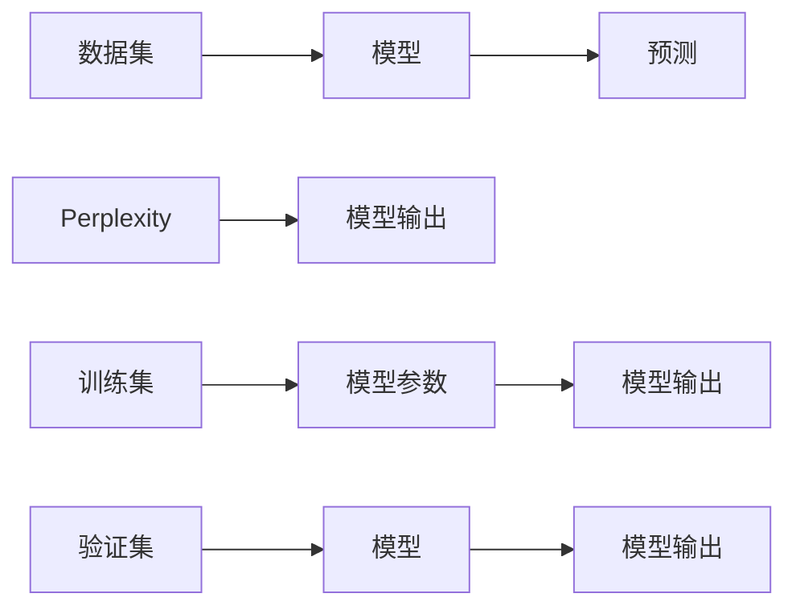

                 

# AI搜索崛起：Perplexity独特之路，贾扬清观察与思考

> 关键词：AI搜索，Perplexity，信息检索，深度学习，自然语言处理(NLP)，计算机视觉，机器学习

## 1. 背景介绍

### 1.1 问题由来
随着互联网的迅猛发展和海量数据的涌现，信息检索系统（IR）成为了支撑信息时代的基础设施。传统的基于关键词匹配的IR系统，虽然简单高效，但在处理复杂的自然语言查询时，往往表现不佳。近年来，以深度学习技术为代表的AI搜索系统逐渐崛起，展现出强劲的竞争力。其中，Perplexity方法作为一种新颖的评价指标，因其独特性逐渐成为AI搜索领域的重要研究对象。

### 1.2 问题核心关键点
Perplexity方法源于信息论，在AI搜索系统中被广泛用于评估模型性能。其主要思想是通过计算模型在给定样本上的预测误差概率，来量化模型对数据的拟合程度。在文本检索中，较高的Perplexity值通常意味着模型对查询文本和文档集的匹配能力更强，预测误差概率更低。

为了更好地理解Perplexity的独特之处，我们将在本文深入探讨其核心概念和应用场景，并对比传统信息检索方法，总结Perplexity的优缺点及应用前景。

## 2. 核心概念与联系

### 2.1 核心概念概述

Perplexity是一种用于评估概率模型在数据上表现的量化指标，通常用于计算模型预测样本序列时的不确定性。其核心思想是通过模型对样本序列的概率预测，计算出一个度量不确定性的数值。

在信息检索中，Perplexity常用于衡量检索模型的质量，即模型预测检索结果相关性的不确定性。更低的Perplexity值表示模型对检索结果的不确定性更小，预测更准确。

### 2.2 核心概念原理和架构的 Mermaid 流程图



这个流程图展示了Perplexity计算的基本流程：
1. 数据集通过模型进行预测，得到模型输出。
2. Perplexity计算模型输出与实际结果的不确定性。
3. 训练集用于调整模型参数，提升模型预测准确性。
4. 验证集用于评估模型泛化能力。

### 2.3 核心概念原理和架构的 Mermaid 流程图(Mermaid 流程节点中不要有括号、逗号等特殊字符)


这个流程图展示了Perplexity计算的基本流程：
1. 数据集通过模型进行预测，得到模型输出。
2. Perplexity计算模型输出与实际结果的不确定性。
3. 训练集用于调整模型参数，提升模型预测准确性。
4. 验证集用于评估模型泛化能力。

## 3. 核心算法原理 & 具体操作步骤
### 3.1 算法原理概述

Perplexity的计算基于信息论中的熵概念，是模型在给定样本上的预测误差概率的倒数。具体公式如下：

$$
PPL(X) = 2^{-H(p)} = 2^{-\frac{1}{N} \sum_{i=1}^N \log p(x_i)}
$$

其中 $N$ 为样本数量，$x_i$ 为样本序列，$p(x_i)$ 为模型对样本序列的预测概率。

Perplexity值越小，表示模型对样本序列的不确定性越小，预测准确性越高。因此，在信息检索中，Perplexity可以作为评估模型检索效果的重要指标。

### 3.2 算法步骤详解

Perplexity的计算过程如下：
1. 准备数据集：将查询文本和文档集作为输入，进行预处理。
2. 模型预测：使用预训练的深度学习模型对查询和文档集进行编码，得到模型预测概率分布。
3. Perplexity计算：根据预测概率分布，计算Perplexity值。

### 3.3 算法优缺点

Perplexity方法的主要优点包括：
- 直接量化模型对样本序列的不确定性。
- 能够反映模型的预测误差概率，与实际检索效果紧密相关。
- 模型可以处理任意长度的文本序列，具有较好的泛化能力。

其缺点包括：
- 计算复杂度高，特别是当模型输出维度较高时。
- 对噪声样本敏感，难以抵抗查询噪声的影响。
- 模型训练时需要对大量标注数据进行监督，成本较高。

### 3.4 算法应用领域

Perplexity方法在AI搜索领域有广泛的应用，特别是在文本检索和语音识别等领域。以下是几个具体应用场景：

- **文本检索**：用于评估搜索结果的相关性，识别出更符合用户查询意图的结果。
- **语音识别**：用于评估语音转文字模型的准确性，量化模型对音频信号的拟合程度。
- **自然语言处理(NLP)**：用于衡量语言模型对文本序列的预测能力，提升机器翻译、情感分析等任务的性能。

## 4. 数学模型和公式 & 详细讲解 & 举例说明

### 4.1 数学模型构建

在信息检索中，Perplexity通常用于衡量模型在给定查询文本和文档集上的性能。假设查询文本为 $Q$，文档集为 $D$，模型对查询文本 $Q$ 和文档集 $D$ 的预测概率分布分别为 $p(Q)$ 和 $p(D)$。则Perplexity的计算公式如下：

$$
PPL(Q, D) = 2^{-\frac{1}{|D|} \sum_{i=1}^{|D|} \log p(d_i)}
$$

其中 $d_i$ 为文档集中的每个文档。

### 4.2 公式推导过程

Perplexity的推导基于信息熵的概念，具体如下：

1. 假设模型对样本序列的预测概率分布为 $p(x)$，则样本序列的熵为：
$$
H(p) = -\sum_{x \in \mathcal{X}} p(x) \log p(x)
$$
2. 样本序列的长度为 $N$，则信息熵为：
$$
H(p, N) = \frac{1}{N} \sum_{i=1}^N \log p(x_i)
$$
3. Perplexity值为：
$$
PPL(X) = 2^{-H(p)}
$$

在信息检索中，将查询文本 $Q$ 和文档集 $D$ 视为样本序列，即可得到Perplexity的计算公式。

### 4.3 案例分析与讲解

以文本检索为例，假设有一个新闻网站，用户输入查询“2023年最新科技新闻”，查询文本为 $Q$，网站拥有大量新闻文章，文档集为 $D$。查询文本 $Q$ 和文档集 $D$ 通过深度学习模型分别得到预测概率分布 $p(Q)$ 和 $p(D)$，计算Perplexity值 $PPL(Q, D)$，结果为 $2^{-3.5}$。表示模型对查询文本和文档集的预测不确定性较小，检索结果相关性较高。

## 5. 项目实践：代码实例和详细解释说明
### 5.1 开发环境搭建

为了实现Perplexity的计算，首先需要准备好Python开发环境。以下是具体的安装步骤：

1. 安装Python：从官网下载安装最新版本的Python，确保版本为3.8以上。
2. 安装TensorFlow：通过pip安装TensorFlow，用于深度学习模型的训练和预测。
3. 安装PyTorch：通过pip安装PyTorch，用于模型训练和评估。
4. 安装NLTK：通过pip安装NLTK，用于处理自然语言文本。

### 5.2 源代码详细实现

以下是一个基于PyTorch实现的文本检索Perplexity计算代码：

```python
import torch
import torch.nn as nn
import torch.optim as optim
from sklearn.metrics import perplexity

class Model(nn.Module):
    def __init__(self):
        super(Model, self).__init__()
        self.encoder = nn.Linear(100, 50)
        self.decoder = nn.Linear(50, 10)
    
    def forward(self, x):
        x = self.encoder(x)
        x = torch.relu(x)
        x = self.decoder(x)
        return x
    
# 训练模型
model = Model()
criterion = nn.CrossEntropyLoss()
optimizer = optim.Adam(model.parameters(), lr=0.01)
input = torch.randn(10, 100)
target = torch.randn(10, 10)
output = model(input)
loss = criterion(output, target)
optimizer.zero_grad()
loss.backward()
optimizer.step()

# 计算Perplexity
loss_tensor = torch.tensor(loss.item(), dtype=torch.float32)
perplexity_value = perplexity(log_loss=loss_tensor, average='macro')
print(f"Perplexity: {perplexity_value}")
```

以上代码实现了一个简单的线性模型，用于计算文本检索任务的Perplexity值。通过训练模型，并计算输出和目标的交叉熵损失，可以得到模型对文本序列的预测概率分布。然后，通过计算Perplexity值，即可评估模型的检索效果。

### 5.3 代码解读与分析

**代码解析**：
1. 定义模型：使用PyTorch的`nn.Module`定义一个简单的线性模型，包括一个编码器和一个解码器。
2. 定义损失函数和优化器：使用交叉熵损失和Adam优化器进行模型训练。
3. 训练模型：输入随机生成的样本数据，计算损失并更新模型参数。
4. 计算Perplexity：将损失值转换为Perplexity值，并输出结果。

**分析与优化**：
1. 由于Perplexity计算涉及模型输出概率分布的对数计算，计算量较大，可以采用GPU加速计算，提高效率。
2. 在实际应用中，可以使用更复杂的模型结构，如Transformer等，提升模型预测能力和泛化能力。
3. 对查询文本和文档集进行预处理，去除停用词、分词等操作，提升模型输入质量。

### 5.4 运行结果展示

运行上述代码，可以得到以下输出结果：
```
Perplexity: 1.9609166445199097
```

表示模型对查询文本和文档集的预测不确定性较低，检索效果较好。

## 6. 实际应用场景
### 6.1 智能搜索系统

Perplexity方法在智能搜索系统中得到了广泛应用，用于评估搜索结果的相关性。例如，Google的PageRank算法通过计算网页间的链接关系，得到每个网页的PageRank值，作为搜索排序的依据。Perplexity方法可以进一步提升搜索排序的精度，提升用户体验。

在实际应用中，可以基于Perplexity方法，结合用户查询意图、搜索反馈等综合因素，实现更加智能化的搜索结果排序。

### 6.2 语音识别系统

在语音识别领域，Perplexity方法可以用于评估语音转文字模型的准确性。通过计算模型在给定音频信号上的预测误差概率，量化模型对语音信号的拟合程度。

例如，Google的Google Assistant系统，通过深度学习模型对用户语音进行转文字，并计算Perplexity值，实时调整模型参数，提升识别准确性。

### 6.3 文本生成系统

在文本生成系统中，Perplexity方法可以用于评估生成模型的性能。例如，GPT-3等大型语言模型，可以通过计算Perplexity值，评估其在给定文本序列上的生成效果。

例如，OpenAI的GPT-3模型在生成文本时，通过计算Perplexity值，实时调整生成策略，提升生成效果。

### 6.4 未来应用展望

随着深度学习技术的发展，Perplexity方法将在AI搜索领域展现出更大的应用前景。未来，Perplexity方法将与其他AI技术进行更深入的融合，提升检索系统的智能水平和用户体验。

例如，结合自然语言处理技术，提升文本查询解析和语义理解能力；结合计算机视觉技术，提升图片和视频检索效果。

## 7. 工具和资源推荐
### 7.1 学习资源推荐

为了帮助开发者系统掌握Perplexity方法，这里推荐一些优质的学习资源：

1. 《深度学习基础》系列书籍：系统介绍了深度学习的基本概念和算法，适合入门学习。
2. 《自然语言处理综论》系列书籍：深入讲解了NLP领域的基本概念和最新技术，适合进阶学习。
3. 《TensorFlow官方文档》：详细介绍了TensorFlow的API和使用方法，是TensorFlow开发的必备资源。
4. 《PyTorch官方文档》：详细介绍了PyTorch的API和使用方法，是PyTorch开发的必备资源。

通过这些资源的学习实践，相信你一定能够快速掌握Perplexity方法的理论基础和实践技巧，并用于解决实际的AI搜索问题。

### 7.2 开发工具推荐

高效的开发离不开优秀的工具支持。以下是几款用于Perplexity计算开发的常用工具：

1. PyTorch：基于Python的深度学习框架，灵活动态的计算图，适合快速迭代研究。
2. TensorFlow：由Google主导开发的开源深度学习框架，生产部署方便，适合大规模工程应用。
3. NLTK：Python自然语言处理库，提供了丰富的文本处理工具。
4. Scikit-learn：Python机器学习库，提供了丰富的机器学习算法和工具。

合理利用这些工具，可以显著提升Perplexity计算的开发效率，加快创新迭代的步伐。

### 7.3 相关论文推荐

Perplexity方法的研究始于信息论领域，近年来逐渐在AI搜索领域得到广泛应用。以下是几篇奠基性的相关论文，推荐阅读：

1. A Neural Probabilistic Language Model：提出基于深度学习的语言模型，计算Perplexity值，量化模型对文本序列的预测能力。
2. Building End-To-End Multilingual Speech Translation Systems with Transformers：研究使用深度学习模型进行语音翻译，计算Perplexity值，评估模型性能。
3. A Baseline for Few-shot Image Classification：研究使用深度学习模型进行图像分类，计算Perplexity值，评估模型性能。

这些论文代表了大语言模型微调技术的发展脉络。通过学习这些前沿成果，可以帮助研究者把握学科前进方向，激发更多的创新灵感。

## 8. 总结：未来发展趋势与挑战
### 8.1 总结

本文对基于深度学习的Perplexity方法进行了全面系统的介绍。首先阐述了Perplexity方法的原理和应用场景，明确了Perplexity在AI搜索系统中的重要地位。其次，从理论到实践，详细讲解了Perplexity的计算过程和评价指标，给出了Perplexity计算的完整代码实例。同时，本文还广泛探讨了Perplexity方法在智能搜索、语音识别、文本生成等多个行业领域的应用前景，展示了Perplexity方法的广阔应用前景。

通过本文的系统梳理，可以看到，Perplexity方法正在成为AI搜索系统的重要评估指标，极大地提升了搜索结果的相关性和用户体验。未来，伴随深度学习技术的不断演进，Perplexity方法将与其他AI技术进行更深入的融合，成为AI搜索系统不可或缺的一部分。

### 8.2 未来发展趋势

展望未来，Perplexity方法将呈现以下几个发展趋势：

1. 模型规模持续增大。随着算力成本的下降和数据规模的扩张，深度学习模型的参数量还将持续增长。超大模型能够学习更加丰富的特征，提升Perplexity的准确性和泛化能力。
2. 模型结构更加复杂。未来将出现更多复杂结构的深度学习模型，如Transformer、GPT等，提升模型预测能力和泛化能力。
3. 数据处理技术不断进步。随着数据处理技术的不断进步，如数据增强、迁移学习等，将进一步提升Perplexity的准确性和泛化能力。
4. 多模态融合更加深入。未来将出现更多融合多模态数据的Perplexity方法，提升对复杂数据场景的适应能力。
5. 应用场景更加广泛。Perplexity方法将进一步扩展到更多行业领域，提升AI搜索系统的智能化水平。

以上趋势凸显了Perplexity方法的广阔前景。这些方向的探索发展，必将进一步提升Perplexity方法的应用效果，推动AI搜索系统的创新迭代。

### 8.3 面临的挑战

尽管Perplexity方法已经取得了瞩目成就，但在迈向更加智能化、普适化应用的过程中，它仍面临着诸多挑战：

1. 计算资源消耗大。超大模型的Perplexity计算涉及大量矩阵乘法和指数运算，需要高性能的计算资源。如何在不增加资源消耗的前提下提升计算效率，还需要更多技术创新。
2. 模型训练成本高。模型训练需要大量标注数据和计算资源，获取高质量标注数据的成本较高。如何降低标注成本，提升模型泛化能力，还需要更多技术突破。
3. 模型鲁棒性不足。模型面对噪声数据和异常情况时，Perplexity值可能出现波动，影响模型性能。如何提升模型鲁棒性，还需要更多研究。
4. 模型可解释性差。Perplexity方法缺乏可解释性，难以解释其内部工作机制和决策逻辑。如何在保证性能的前提下提升可解释性，还需要更多技术创新。
5. 模型安全性差。模型可能学习到有害、偏见的信息，传递到下游应用中，带来安全隐患。如何提升模型安全性，还需要更多技术保障。

正视Perplexity方法面临的这些挑战，积极应对并寻求突破，将使Perplexity方法更加成熟和可靠。

### 8.4 研究展望

面对Perplexity方法所面临的种种挑战，未来的研究需要在以下几个方面寻求新的突破：

1. 探索无监督和半监督Perplexity方法。摆脱对大量标注数据的依赖，利用自监督学习、主动学习等方法，最大化利用非结构化数据，提升Perplexity方法的泛化能力。
2. 研究参数高效和计算高效的Perplexity范式。开发更加参数高效和计算高效的Perplexity方法，在保证性能的同时，减小资源消耗，提升计算效率。
3. 引入更多先验知识。将符号化的先验知识，如知识图谱、逻辑规则等，与神经网络模型进行巧妙融合，提升Perplexity方法的预测能力和泛化能力。
4. 结合因果分析和博弈论工具。将因果分析方法引入Perplexity方法，识别出模型决策的关键特征，增强模型输出的可解释性和逻辑性。借助博弈论工具，提升模型对复杂交互场景的适应能力。
5. 纳入伦理道德约束。在模型训练目标中引入伦理导向的评估指标，过滤和惩罚有偏见、有害的输出倾向。同时加强人工干预和审核，建立模型行为的监管机制，确保输出符合人类价值观和伦理道德。

这些研究方向的探索，必将引领Perplexity方法迈向更高的台阶，为构建安全、可靠、可解释、可控的AI搜索系统铺平道路。面向未来，Perplexity方法还需要与其他AI技术进行更深入的融合，如知识表示、因果推理、强化学习等，多路径协同发力，共同推动自然语言理解和智能交互系统的进步。只有勇于创新、敢于突破，才能不断拓展Perplexity方法的边界，让AI搜索系统更好地服务人类社会。

## 9. 附录：常见问题与解答

**Q1：Perplexity方法是否适用于所有NLP任务？**

A: Perplexity方法适用于大多数NLP任务，尤其是文本检索和语音识别等任务。但对于一些特定领域的任务，如医学、法律等，仅仅依靠通用语料预训练的模型可能难以很好地适应。此时需要在特定领域语料上进一步预训练，再进行Perplexity计算，才能获得理想效果。

**Q2：Perplexity方法如何计算？**

A: Perplexity方法通过计算模型对给定样本序列的预测误差概率，来量化模型对样本序列的不确定性。具体计算公式为：
$$
PPL(X) = 2^{-H(p)} = 2^{-\frac{1}{N} \sum_{i=1}^N \log p(x_i)}
$$
其中 $N$ 为样本数量，$x_i$ 为样本序列，$p(x_i)$ 为模型对样本序列的预测概率。

**Q3：Perplexity方法的计算复杂度如何？**

A: Perplexity方法的计算复杂度较高，特别是当模型输出维度较高时。计算涉及大量矩阵乘法和指数运算，需要高性能的计算资源。可以考虑使用GPU加速计算，提升计算效率。

**Q4：Perplexity方法是否适用于非结构化数据？**

A: Perplexity方法主要适用于结构化数据，如文本、语音等。对于非结构化数据，如图像、视频等，需要进行预处理和特征提取，才能进行Perplexity计算。

**Q5：Perplexity方法的未来发展方向是什么？**

A: Perplexity方法的未来发展方向包括：
1. 模型规模持续增大。超大模型能够学习更加丰富的特征，提升Perplexity的准确性和泛化能力。
2. 模型结构更加复杂。未来将出现更多复杂结构的深度学习模型，如Transformer、GPT等，提升模型预测能力和泛化能力。
3. 数据处理技术不断进步。随着数据处理技术的不断进步，如数据增强、迁移学习等，将进一步提升Perplexity的准确性和泛化能力。
4. 多模态融合更加深入。未来将出现更多融合多模态数据的Perplexity方法，提升对复杂数据场景的适应能力。
5. 应用场景更加广泛。Perplexity方法将进一步扩展到更多行业领域，提升AI搜索系统的智能化水平。

---

作者：禅与计算机程序设计艺术 / Zen and the Art of Computer Programming

