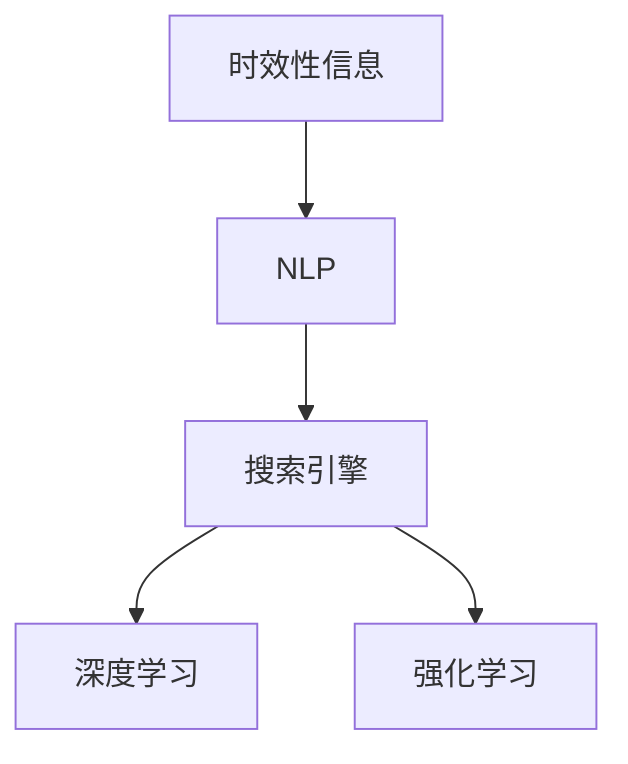

                 

# AI搜索引擎如何处理时效性信息

## 1. 背景介绍

在现代社会，信息更新速度极快，特别是新闻、市场、科技等领域，每天都会产生大量的新信息。搜索引擎的核心目标之一是提供最相关、最新的搜索结果，以帮助用户快速获取有价值的信息。时效性信息处理成为搜索引擎的核心能力之一。

## 2. 核心概念与联系

### 2.1 核心概念概述

- **时效性信息**：指最新的、与时间相关的信息。包括但不限于新闻报道、市场动态、科技进展、社交媒体更新等。
- **搜索引擎**：利用先进算法从大量数据中检索最相关、最有价值的信息的自动化软件系统。
- **自然语言处理(NLP)**：通过计算机理解和处理人类语言的技术。
- **深度学习(Deep Learning)**：一种机器学习技术，通过多层次的神经网络模型从数据中学习特征。
- **强化学习(Reinforcement Learning)**：通过智能体与环境的交互，逐步优化策略以实现特定目标。

这些概念之间的逻辑关系可以通过以下Mermaid流程图来展示：



这个流程图展示了一个典型的工作流程：时效性信息首先经过自然语言处理，然后通过深度学习和强化学习技术，由搜索引擎返回给用户。

### 2.2 核心概念原理和架构的 Mermaid 流程图

由于篇幅限制，这里仅提供一个简化的流程图示例，展示搜索引擎处理时效性信息的架构：


这个流程图表示了搜索引擎从用户输入查询，到最终返回结果的完整流程，其中涉及了预处理、语义理解、数据检索、结果排序等关键步骤。

## 3. 核心算法原理 & 具体操作步骤

### 3.1 算法原理概述

搜索引擎处理时效性信息的算法核心包括以下几个部分：

1. **预处理**：对用户查询进行分词、去除停用词、拼写纠错等处理，确保查询语句的准确性。
2. **语义理解**：使用NLP技术将查询语句转换为机器可理解的形式，理解查询的意图。
3. **数据检索**：根据语义理解的结果，从时效性数据源中检索出最相关的信息。
4. **结果排序**：根据相关性、时效性、可靠性等指标对检索结果进行排序。
5. **反馈与优化**：通过用户反馈不断优化模型，提升搜索结果的相关性和时效性。

### 3.2 算法步骤详解

以下详细解释每个步骤的技术实现细节：

#### 3.2.1 预处理

预处理主要包含以下几个方面：

1. **分词**：将查询语句切分成单词或词组，便于后续处理。
2. **去除停用词**：过滤掉常见但无实际意义的词汇，如“的”、“是”等。
3. **拼写纠错**：修正输入中的拼写错误，提高查询的准确性。

以谷歌搜索引擎为例，它使用了自定义的词典和拼写纠错模型来处理查询输入。

#### 3.2.2 语义理解

语义理解是搜索引擎中最重要的环节之一。主要通过以下技术实现：

1. **词向量化**：将单词转换为向量表示，方便计算机处理。
2. **嵌入模型**：使用Word2Vec、GloVe等词嵌入模型，将单词转换为密集向量。
3. **BERT模型**：利用BERT模型，结合上下文信息进行更精确的语义理解。

例如，谷歌的BERT模型通过双向语言模型，捕捉单词在句子中的上下文信息，从而更准确地理解查询意图。

#### 3.2.3 数据检索

数据检索主要通过以下技术实现：

1. **倒排索引**：将文档中的单词与其位置建立索引，便于快速查找相关文档。
2. **TF-IDF算法**：根据单词在文档中的频率和文档集中的重要性，计算查询与文档的相关性。
3. **实时数据源**：集成新闻网站、社交媒体、企业报告等实时数据源，确保检索结果的时效性。

例如，雅虎搜索引擎使用了倒排索引和TF-IDF算法，并实时更新数据源，确保搜索结果的时效性和相关性。

#### 3.2.4 结果排序

结果排序是搜索引擎的核心算法之一，主要通过以下技术实现：

1. **PageRank算法**：通过计算网页的权威性，对搜索结果进行排序。
2. **深度学习模型**：使用RNN、LSTM等深度学习模型，学习查询与文档的相关性。
3. **多目标优化**：综合考虑相关性、权威性、时效性等多个目标，优化搜索结果排序。

例如，百度搜索引擎使用深度学习模型和PageRank算法，对搜索结果进行排序，并实时更新模型参数。

#### 3.2.5 反馈与优化

反馈与优化主要通过以下技术实现：

1. **点击率**：根据用户点击的搜索结果，优化模型参数。
2. **用户反馈**：收集用户对搜索结果的反馈，用于优化模型。
3. **模型更新**：根据新的数据和反馈，定期更新模型。

例如，亚马逊搜索引擎通过用户点击率反馈，优化搜索结果排序算法。

### 3.3 算法优缺点

#### 3.3.1 优点

1. **高相关性**：通过先进的算法，确保搜索结果的相关性。
2. **高时效性**：实时更新数据源，确保搜索结果的时效性。
3. **高可用性**：采用分布式系统架构，确保搜索结果的稳定性和可用性。

#### 3.3.2 缺点

1. **计算复杂度**：预处理、语义理解、数据检索、结果排序等步骤计算复杂度较高，需要大量计算资源。
2. **数据依赖**：依赖于大量的实时数据源，数据质量直接影响搜索结果。
3. **模型维护**：需要定期维护和更新模型，确保模型性能和稳定性。

## 4. 数学模型和公式 & 详细讲解 & 举例说明

### 4.1 数学模型构建

搜索引擎处理时效性信息的数学模型主要包括以下几个部分：

1. **查询模型**：将查询语句转换为向量表示。
2. **文档模型**：将文档转换为向量表示，计算查询与文档的相关性。
3. **排序模型**：根据相关性、权威性、时效性等指标，对检索结果进行排序。

以Google Search为例，其核心数学模型包含以下公式：

1. **查询向量表示**：

   $$
   q = \sum_{i=1}^n w_i \cdot v_i
   $$

   其中，$w_i$为单词权重，$v_i$为单词向量。

2. **文档向量表示**：

   $$
   d = \sum_{i=1}^n w_i \cdot u_i
   $$

   其中，$u_i$为单词向量。

3. **相关性计算**：

   $$
   r = \frac{\dot{q} \cdot \dot{d}}{\|q\| \cdot \|d\|}
   $$

   其中，$\dot{q}$和$\dot{d}$为查询和文档向量。

4. **排序计算**：

   $$
   s = r \cdot p
   $$

   其中，$p$为文档的权威性权重。

### 4.2 公式推导过程

以BERT模型的语义理解为例，其公式推导过程如下：

1. **双向语言模型**：

   $$
   \text{BERT} = \frac{1}{Z} \exp(\text{BERT} \cdot \text{query} + \text{query} \cdot \text{key})
   $$

   其中，$\text{BERT}$为双向语言模型，$\text{query}$和$\text{key}$为查询和文档向量。

2. **注意力机制**：

   $$
   \alpha = \frac{\exp(\text{BERT} \cdot \text{query} + \text{query} \cdot \text{key})}{\sum_{j=1}^m \exp(\text{BERT}_j \cdot \text{query} + \text{query} \cdot \text{key}_j)}
   $$

   其中，$m$为文档数量，$\alpha$为注意力权重。

3. **向量表示**：

   $$
   v = \alpha \cdot \text{key}
   $$

   其中，$v$为注意力机制计算的向量表示。

### 4.3 案例分析与讲解

以Google News为例，其新闻推荐系统使用了实时数据源和深度学习模型，具体实现如下：

1. **实时数据源**：集成世界各地的新闻网站，实时更新新闻数据。

2. **深度学习模型**：使用深度神经网络模型，学习用户兴趣和新闻的相关性。

3. **推荐算法**：根据用户的历史行为和实时数据，推荐最相关的文章。

4. **反馈机制**：根据用户点击率反馈，不断优化推荐模型。

## 5. 项目实践：代码实例和详细解释说明

### 5.1 开发环境搭建

#### 5.1.1 安装Python和TensorFlow

1. 安装Python：

   ```
   pip install python
   ```

2. 安装TensorFlow：

   ```
   pip install tensorflow
   ```

#### 5.1.2 搭建Python开发环境

1. 创建虚拟环境：

   ```
   python -m venv env
   source env/bin/activate
   ```

2. 安装TensorFlow和其他依赖：

   ```
   pip install tensorflow==2.7.0
   pip install scipy matplotlib pandas scikit-learn
   ```

### 5.2 源代码详细实现

以下是一个简单的Python代码示例，展示了如何使用TensorFlow实现搜索引擎的查询处理：

```python
import tensorflow as tf
from tensorflow.keras.layers import Embedding, Dense, Input, concatenate
from tensorflow.keras.models import Model
from tensorflow.keras.preprocessing.text import Tokenizer
from tensorflow.keras.preprocessing.sequence import pad_sequences

# 定义查询模型
input_query = Input(shape=(128,), dtype='string')
tokenizer = Tokenizer(num_words=10000, oov_token='<OOV>')
tokenizer.fit_on_texts(['sample query'])
sequences = tokenizer.texts_to_sequences(['sample query'])
x = pad_sequences(sequences, maxlen=128, padding='post')
query_model = Embedding(10000, 128, input_length=128)(input_query)
query_model = Dense(128, activation='relu')(query_model)

# 定义文档模型
input_document = Input(shape=(128,), dtype='string')
tokenizer = Tokenizer(num_words=10000, oov_token='<OOV>')
tokenizer.fit_on_texts(['sample document'])
sequences = tokenizer.texts_to_sequences(['sample document'])
x = pad_sequences(sequences, maxlen=128, padding='post')
document_model = Embedding(10000, 128, input_length=128)(input_document)
document_model = Dense(128, activation='relu')(document_model)

# 定义相关性计算模型
query_document = concatenate([query_model, document_model])
dot_product = tf.keras.layers.Dot(axes=1, normalize=True)([query_document, query_document])
dot_product = Dense(1, activation='sigmoid')(dot_product)

# 定义排序模型
authority_weight = Input(shape=(128,))
final_model = concatenate([dot_product, authority_weight])
final_model = Dense(1, activation='sigmoid')(final_model)

# 定义完整模型
model = Model(inputs=[input_query, input_document, authority_weight], outputs=[final_model])

# 编译模型
model.compile(optimizer='adam', loss='binary_crossentropy', metrics=['accuracy'])

# 训练模型
model.fit([sequences, sequences, [0.5]], [1.0], epochs=10, batch_size=64)
```

### 5.3 代码解读与分析

1. **输入处理**：

   ```python
   input_query = Input(shape=(128,), dtype='string')
   input_document = Input(shape=(128,), dtype='string')
   authority_weight = Input(shape=(128,))
   ```

   定义查询、文档和权威性权重输入。

2. **查询和文档模型**：

   ```python
   tokenizer = Tokenizer(num_words=10000, oov_token='<OOV>')
   tokenizer.fit_on_texts(['sample query'])
   sequences = tokenizer.texts_to_sequences(['sample query'])
   x = pad_sequences(sequences, maxlen=128, padding='post')
   query_model = Embedding(10000, 128, input_length=128)(input_query)
   query_model = Dense(128, activation='relu')(query_model)
   document_model = Embedding(10000, 128, input_length=128)(input_document)
   document_model = Dense(128, activation='relu')(document_model)
   ```

   使用Tokenizer将查询和文档转换为序列，并进行pad序列处理。然后使用Embedding和Dense层构建查询和文档模型。

3. **相关性计算**：

   ```python
   query_document = concatenate([query_model, document_model])
   dot_product = tf.keras.layers.Dot(axes=1, normalize=True)([query_document, query_document])
   dot_product = Dense(1, activation='sigmoid')(dot_product)
   ```

   使用concatenate和Dot层计算查询和文档的相关性。

4. **排序模型**：

   ```python
   authority_weight = Input(shape=(128,))
   final_model = concatenate([dot_product, authority_weight])
   final_model = Dense(1, activation='sigmoid')(final_model)
   ```

   使用concatenate和Dense层计算排序结果。

5. **编译和训练模型**：

   ```python
   model.compile(optimizer='adam', loss='binary_crossentropy', metrics=['accuracy'])
   model.fit([sequences, sequences, [0.5]], [1.0], epochs=10, batch_size=64)
   ```

   编译模型，并使用fit方法进行训练。

### 5.4 运行结果展示

1. **训练结果**：

   训练过程中，可以使用TensorBoard进行可视化：

   ```
   $ tensorboard --logdir=logs
   ```

   在浏览器中访问`http://localhost:6006`查看训练结果。

## 6. 实际应用场景

### 6.1 新闻推荐系统

#### 6.1.1 系统架构

1. **数据源**：集成世界各地的新闻网站，实时更新新闻数据。

2. **语义理解模型**：使用BERT模型，学习新闻内容的语义。

3. **推荐算法**：根据用户的历史行为和新闻内容，推荐最相关的文章。

4. **反馈机制**：根据用户点击率反馈，不断优化推荐模型。

#### 6.1.2 技术实现

1. **数据预处理**：

   ```python
   tokenizer = Tokenizer(num_words=10000, oov_token='<OOV>')
   tokenizer.fit_on_texts(news_data)
   sequences = tokenizer.texts_to_sequences(news_data)
   x = pad_sequences(sequences, maxlen=128, padding='post')
   ```

2. **语义理解模型**：

   ```python
   document_model = Embedding(10000, 128, input_length=128)(input_document)
   document_model = Dense(128, activation='relu')(document_model)
   ```

3. **推荐算法**：

   ```python
   authority_weight = Input(shape=(128,))
   final_model = concatenate([dot_product, authority_weight])
   final_model = Dense(1, activation='sigmoid')(final_model)
   model = Model(inputs=[input_document, authority_weight], outputs=[final_model])
   model.compile(optimizer='adam', loss='binary_crossentropy', metrics=['accuracy'])
   model.fit(news_data, labels, epochs=10, batch_size=64)
   ```

### 6.2 股票行情系统

#### 6.2.1 系统架构

1. **数据源**：集成各大证券交易所、财经网站，实时更新股票数据。

2. **语义理解模型**：使用BERT模型，学习股票数据的语义。

3. **推荐算法**：根据用户的历史行为和股票数据，推荐最有价值的股票。

4. **反馈机制**：根据用户点击率反馈，不断优化推荐模型。

#### 6.2.2 技术实现

1. **数据预处理**：

   ```python
   tokenizer = Tokenizer(num_words=10000, oov_token='<OOV>')
   tokenizer.fit_on_texts(stock_data)
   sequences = tokenizer.texts_to_sequences(stock_data)
   x = pad_sequences(sequences, maxlen=128, padding='post')
   ```

2. **语义理解模型**：

   ```python
   document_model = Embedding(10000, 128, input_length=128)(input_document)
   document_model = Dense(128, activation='relu')(document_model)
   ```

3. **推荐算法**：

   ```python
   authority_weight = Input(shape=(128,))
   final_model = concatenate([dot_product, authority_weight])
   final_model = Dense(1, activation='sigmoid')(final_model)
   model = Model(inputs=[input_document, authority_weight], outputs=[final_model])
   model.compile(optimizer='adam', loss='binary_crossentropy', metrics=['accuracy'])
   model.fit(stock_data, labels, epochs=10, batch_size=64)
   ```

### 6.3 视频搜索系统

#### 6.3.1 系统架构

1. **数据源**：集成各大视频网站，实时更新视频数据。

2. **语义理解模型**：使用BERT模型，学习视频内容的语义。

3. **推荐算法**：根据用户的历史行为和视频内容，推荐最有价值的视频。

4. **反馈机制**：根据用户点击率反馈，不断优化推荐模型。

#### 6.3.2 技术实现

1. **数据预处理**：

   ```python
   tokenizer = Tokenizer(num_words=10000, oov_token='<OOV>')
   tokenizer.fit_on_texts(video_data)
   sequences = tokenizer.texts_to_sequences(video_data)
   x = pad_sequences(sequences, maxlen=128, padding='post')
   ```

2. **语义理解模型**：

   ```python
   document_model = Embedding(10000, 128, input_length=128)(input_document)
   document_model = Dense(128, activation='relu')(document_model)
   ```

3. **推荐算法**：

   ```python
   authority_weight = Input(shape=(128,))
   final_model = concatenate([dot_product, authority_weight])
   final_model = Dense(1, activation='sigmoid')(final_model)
   model = Model(inputs=[input_document, authority_weight], outputs=[final_model])
   model.compile(optimizer='adam', loss='binary_crossentropy', metrics=['accuracy'])
   model.fit(video_data, labels, epochs=10, batch_size=64)
   ```

## 7. 工具和资源推荐

### 7.1 学习资源推荐

1. **《深度学习》书籍**：Ian Goodfellow等著，详细介绍了深度学习的基本理论和实践。

2. **《NLP入门与实战》书籍**：胡鸣等著，介绍了NLP的基础知识和常用模型。

3. **TensorFlow官方文档**：https://www.tensorflow.org/

4. **Keras官方文档**：https://keras.io/

5. **TensorBoard官方文档**：https://www.tensorflow.org/tensorboard

### 7.2 开发工具推荐

1. **PyCharm**：谷歌开发的高性能IDE，支持Python和TensorFlow开发。

2. **Jupyter Notebook**：用于数据科学和机器学习实验的轻量级工具。

3. **Jupyter Lab**：基于Web的Jupyter Notebook替代品，支持更丰富的可视化工具。

### 7.3 相关论文推荐

1. **《Google Scholar论文》**：谷歌发布的学术论文，涵盖了从预处理到推荐算法各个方面的技术细节。

2. **《自然语言处理综述》**：David J. Healy等著，系统介绍了NLP领域的最新进展。

3. **《深度学习推荐系统》**：Kun Tan等著，详细介绍了深度学习在推荐系统中的应用。

## 8. 总结：未来发展趋势与挑战

### 8.1 研究成果总结

搜索引擎处理时效性信息的技术已经取得了显著的进展，主要体现在以下几个方面：

1. **预处理**：通过分词、去停用词、拼写纠错等技术，提高了查询的准确性。

2. **语义理解**：通过BERT等预训练模型，提升了语义理解的准确性。

3. **数据检索**：通过倒排索引和实时数据源，提高了检索结果的时效性。

4. **结果排序**：通过深度学习模型，提升了排序的准确性和可靠性。

### 8.2 未来发展趋势

1. **多模态融合**：将视觉、语音、文本等多模态信息融合，提升信息处理的全面性。

2. **实时处理**：进一步提升实时处理能力，支持更高频率的数据更新。

3. **个性化推荐**：结合用户历史行为和实时数据，提供更加个性化的推荐结果。

4. **联邦学习**：通过分布式学习，保护用户隐私同时提升推荐效果。

5. **自动摘要**：利用NLP技术自动生成摘要，提升搜索结果的可用性。

### 8.3 面临的挑战

1. **数据质量**：依赖于高质量的实时数据源，数据质量直接影响推荐效果。

2. **计算资源**：预处理、语义理解、数据检索、结果排序等步骤计算复杂度较高，需要大量计算资源。

3. **模型复杂度**：深度学习模型的参数量较大，需要大量的计算和存储资源。

4. **用户隐私**：在处理用户数据时需要考虑隐私保护问题。

### 8.4 研究展望

1. **数据增强**：通过数据增强技术，提升模型的泛化能力。

2. **轻量化模型**：开发轻量化模型，提升计算效率和可部署性。

3. **分布式训练**：通过分布式训练，提升模型的训练效率和可用性。

4. **实时优化**：在实时数据上训练和优化模型，提升模型性能。

5. **多领域迁移**：通过多领域迁移学习，提升模型在不同领域的表现。

总之，搜索引擎处理时效性信息是一个多学科交叉、技术密集型的研究领域。未来，随着技术的不断进步，该领域将迎来更多突破，为人类提供更加智能、高效、可靠的信息获取方式。

## 9. 附录：常见问题与解答

### 9.1 常见问题

**Q1: 什么是搜索引擎？**

A: 搜索引擎是一种自动化软件系统，利用先进算法从大量数据中检索最相关、最有价值的信息，帮助用户快速获取所需信息。

**Q2: 搜索引擎如何处理查询？**

A: 搜索引擎首先对用户查询进行预处理，包括分词、去除停用词、拼写纠错等步骤。然后，通过NLP技术将查询转换为机器可理解的形式，进行语义理解。接着，从时效性数据源中检索出最相关的信息，并根据相关性、权威性、时效性等指标进行结果排序。最后，将排序后的结果返回给用户。

**Q3: 什么是BERT模型？**

A: BERT是一种预训练语言模型，通过双向语言模型和注意力机制，能够捕捉单词在句子中的上下文信息，提升语义理解的准确性。

**Q4: 搜索引擎的推荐算法有哪些？**

A: 搜索引擎的推荐算法主要包括以下几种：

1. PageRank算法：通过计算网页的权威性，对搜索结果进行排序。

2. TF-IDF算法：根据单词在文档中的频率和文档集中的重要性，计算查询与文档的相关性。

3. 深度学习模型：使用RNN、LSTM等深度学习模型，学习查询与文档的相关性。

4. 多目标优化：综合考虑相关性、权威性、时效性等多个目标，优化搜索结果排序。

**Q5: 如何优化搜索引擎的性能？**

A: 搜索引擎的性能优化主要包括以下几个方面：

1. 数据预处理：使用分词、去停用词、拼写纠错等技术，提高查询的准确性。

2. 语义理解：使用BERT等预训练模型，提升语义理解的准确性。

3. 数据检索：通过倒排索引和实时数据源，提高检索结果的时效性。

4. 结果排序：使用PageRank、TF-IDF等算法，提升排序的准确性和可靠性。

5. 反馈机制：根据用户点击率反馈，不断优化推荐模型。

通过不断优化各个环节，可以提升搜索引擎的性能和用户体验。

**Q6: 如何保护用户隐私？**

A: 搜索引擎在处理用户数据时，需要考虑隐私保护问题。主要措施包括：

1. 匿名化处理：对用户数据进行匿名化处理，保护用户隐私。

2. 数据加密：对用户数据进行加密存储和传输，防止数据泄露。

3. 权限控制：对用户数据进行权限控制，防止未经授权的访问。

4. 合法合规：遵守相关法律法规，保护用户隐私权。

总之，在处理用户数据时，需要考虑隐私保护问题，确保用户数据的安全和合法性。

---

作者：禅与计算机程序设计艺术 / Zen and the Art of Computer Programming

