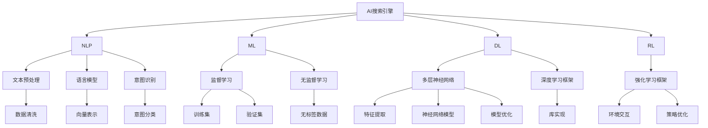

                 

# AI搜索引擎如何提高用户体验

## 1. 背景介绍

随着互联网的蓬勃发展，搜索引擎已成为人们获取信息的重要工具。传统的搜索引擎主要依赖关键词匹配技术，虽然能快速定位相关网页，但缺乏对用户意图和上下文的全面理解。为了提高用户体验，现代搜索引擎逐渐引入AI技术，通过理解用户的查询语义和上下文，提供更加个性化的搜索结果，从而提升搜索效果和满意度。本文将从AI技术的角度，详细探讨如何构建一个高性能、高用户体验的搜索引擎。

## 2. 核心概念与联系

### 2.1 核心概念概述

为了更好地理解搜索引擎如何利用AI技术提升用户体验，本节将介绍几个核心概念及其相互联系：

- **AI搜索引擎**：利用人工智能技术，如自然语言处理、机器学习等，构建能够理解用户查询语义、提供个性化搜索结果的搜索引擎。

- **自然语言处理(NLP)**：研究如何让计算机理解和生成人类语言的技术，包括文本预处理、语言模型、意图识别等。

- **机器学习(ML)**：通过数据驱动的方法，训练模型从输入数据中学习规律，用于预测和决策。

- **深度学习(DL)**：机器学习的一种高级形式，通过多层神经网络模型提取高层次特征。

- **强化学习(RL)**：通过试错反馈，训练模型学习最优策略，广泛应用于推荐系统、游戏AI等领域。

- **推荐系统(Recommender System)**：通过分析用户历史行为和偏好，为每个用户推荐个性化内容，提升用户体验。

这些概念之间相互依赖、相互促进，共同构成了AI搜索引擎的技术框架，使其能够更好地理解用户需求，提供个性化服务。

### 2.2 核心概念原理和架构的 Mermaid 流程图



该流程图展示了AI搜索引擎的核心技术架构及其相互关系：

1. **NLP技术**：通过文本预处理、语言模型、意图识别等模块，构建对用户查询的语义理解能力。
2. **ML和DL技术**：利用监督学习、无监督学习、深度学习框架，训练高层次特征提取模型，为搜索结果提供个性化推荐。
3. **RL技术**：引入强化学习框架，优化推荐系统的策略，实现动态更新和个性化推荐。
4. **推荐系统**：集成NLP、ML、DL、RL技术，实现对用户查询的深度理解，提供高质量的个性化搜索结果。

## 3. 核心算法原理 & 具体操作步骤

### 3.1 算法原理概述

AI搜索引擎的核心算法原理可以概括为：通过自然语言处理技术理解用户查询，利用机器学习和深度学习技术提取特征，结合推荐系统提供个性化搜索结果。

- **文本预处理**：将用户查询转换为计算机可处理的形式，如分词、去除停用词、词干提取等。
- **语言模型**：通过统计语言模型或神经网络语言模型，学习词汇和句子的概率分布，预测下一个单词或句子。
- **意图识别**：通过分类器或序列到序列模型，识别用户查询的意图，如信息查询、浏览、导航等。
- **特征提取**：利用神经网络模型提取网页的语义特征，如TF-IDF、word2vec、BERT等。
- **模型训练**：通过监督学习或无监督学习，训练推荐系统模型，学习用户历史行为和偏好。
- **结果排序**：结合搜索结果的语义相似度、用户历史行为、实时交互反馈等，进行多目标排序，优化搜索结果的排名。

### 3.2 算法步骤详解

一个典型的AI搜索引擎开发流程包括以下几个关键步骤：

**Step 1: 数据准备与预处理**

- 收集大量用户查询数据、网页元数据和用户点击数据。
- 对查询数据进行分词、去停用词、词干提取等文本预处理。
- 对网页元数据进行特征提取，如网页标题、摘要、关键词等。

**Step 2: 意图识别与用户建模**

- 利用文本预处理和语言模型，对用户查询进行意图识别。
- 基于用户历史行为和查询数据，构建用户画像，学习用户的兴趣和偏好。

**Step 3: 特征提取与模型训练**

- 利用深度学习框架，如TensorFlow、PyTorch等，训练神经网络模型，提取网页和查询的语义特征。
- 基于用户画像和特征提取结果，训练推荐系统模型，学习用户与网页之间的交互关系。

**Step 4: 结果排序与推荐**

- 结合搜索结果的语义相似度、用户历史行为、实时交互反馈等，进行多目标排序。
- 根据排序结果，输出个性化搜索结果，满足用户需求。

**Step 5: 反馈与迭代**

- 通过用户点击反馈、评分反馈等，持续优化模型参数和算法策略。
- 根据用户行为变化，及时更新模型和算法，保持搜索效果和用户体验。

### 3.3 算法优缺点

AI搜索引擎通过引入NLP、ML、DL和RL等技术，具备以下优点：

- **高效性**：利用深度学习和推荐系统，能够快速提取特征、学习用户兴趣、提供个性化推荐。
- **灵活性**：能够处理复杂的查询语义，结合多种排序算法，提供高度个性化的搜索结果。
- **可扩展性**：可轻松集成新数据、新算法，适应不同场景下的搜索需求。

同时，AI搜索引擎也存在以下局限：

- **高成本**：构建和维护AI搜索引擎需要大量数据、算力资源和人才支持。
- **复杂性**：需要结合多种技术，开发和维护难度较大。
- **可解释性不足**：黑箱模型难以解释内部决策逻辑，用户对搜索结果的信任度较低。

尽管存在这些局限，但AI搜索引擎在提供个性化搜索结果、提升用户体验方面具有明显优势，正在逐步成为现代搜索引擎的主要发展方向。

### 3.4 算法应用领域

AI搜索引擎技术在众多领域得到了广泛应用，如：

- **信息检索**：提供高效、精准的搜索结果，帮助用户快速找到所需信息。
- **个性化推荐**：结合用户历史行为和实时反馈，提供个性化的内容推荐，提升用户体验。
- **智能客服**：通过自然语言处理和推荐系统，实现自动化客服，提升服务效率和用户满意度。
- **智能广告**：利用用户行为数据和推荐系统，实现精准定向广告投放，提高广告效果。
- **智能翻译**：结合机器翻译和推荐系统，提供多语言搜索服务，满足全球用户需求。

## 4. 数学模型和公式 & 详细讲解 & 举例说明

### 4.1 数学模型构建

为了更好地理解AI搜索引擎的数学原理，本节将介绍其核心数学模型。

设用户查询为 $q$，网页集为 $D$，用户的点击反馈为 $y_i$。定义一个评分函数 $f(q, d)$，表示查询 $q$ 和网页 $d$ 之间的相关性得分。目标是最大化用户点击率，即最大化 $\sum_{i=1}^N y_i f(q, d_i)$。

根据最大似然估计，模型的目标是最小化交叉熵损失：

$$
\min_{\theta} \frac{1}{N} \sum_{i=1}^N y_i \log f(q, d_i) + (1-y_i) \log (1-f(q, d_i))
$$

其中 $\theta$ 表示模型参数。

### 4.2 公式推导过程

考虑使用一个简单的神经网络模型 $f(q, d) = W^T \sigma(Wq + Vd)$，其中 $W$ 和 $V$ 为权重矩阵，$\sigma$ 为激活函数。设 $\hat{y}_i = f(q, d_i)$，则交叉熵损失可以表示为：

$$
\mathcal{L} = \frac{1}{N} \sum_{i=1}^N y_i \log \hat{y}_i + (1-y_i) \log (1-\hat{y}_i)
$$

根据链式法则，损失函数对 $W$ 和 $V$ 的梯度为：

$$
\frac{\partial \mathcal{L}}{\partial W} = \frac{1}{N} \sum_{i=1}^N (y_i \hat{y}_i(1-\hat{y}_i) W - (1-y_i) \hat{y}_i (1-\hat{y}_i) V)
$$

$$
\frac{\partial \mathcal{L}}{\partial V} = \frac{1}{N} \sum_{i=1}^N (y_i \hat{y}_i(1-\hat{y}_i) W - (1-y_i) \hat{y}_i (1-\hat{y}_i) V)
$$

在得到梯度后，即可带入优化算法进行模型训练。

### 4.3 案例分析与讲解

假设我们有一个简单的搜索引擎，利用神经网络模型提取查询和网页的语义特征，并使用softmax函数进行排序。用户查询 $q$ 和网页 $d_1, d_2, \dots, d_N$ 的相关性得分分别为 $f_1, f_2, \dots, f_N$。我们可以使用 $y_i = 1$ 表示用户点击了网页 $d_i$，否则 $y_i = 0$。模型的目标是最小化交叉熵损失：

$$
\min_{\theta} \frac{1}{N} \sum_{i=1}^N y_i \log f_i + (1-y_i) \log (1-f_i)
$$

通过反向传播算法，计算梯度并更新模型参数，直到收敛。

## 5. 项目实践：代码实例和详细解释说明

### 5.1 开发环境搭建

在进行搜索引擎开发前，我们需要准备好开发环境。以下是使用Python进行PyTorch开发的环境配置流程：

1. 安装Anaconda：从官网下载并安装Anaconda，用于创建独立的Python环境。

2. 创建并激活虚拟环境：
```bash
conda create -n search-env python=3.8 
conda activate search-env
```

3. 安装PyTorch：根据CUDA版本，从官网获取对应的安装命令。例如：
```bash
conda install pytorch torchvision torchaudio cudatoolkit=11.1 -c pytorch -c conda-forge
```

4. 安装TensorFlow：
```bash
pip install tensorflow
```

5. 安装各类工具包：
```bash
pip install numpy pandas scikit-learn matplotlib tqdm jupyter notebook ipython
```

完成上述步骤后，即可在`search-env`环境中开始搜索引擎的开发实践。

### 5.2 源代码详细实现

这里我们以一个简单的信息检索系统为例，给出使用PyTorch进行搜索引擎的开发实现。

首先，定义模型和数据集：

```python
import torch
from torch import nn
from torch.utils.data import Dataset, DataLoader

# 定义神经网络模型
class SearchModel(nn.Module):
    def __init__(self, input_size, hidden_size, output_size):
        super(SearchModel, self).__init__()
        self.hidden = nn.Linear(input_size, hidden_size)
        self.relu = nn.ReLU()
        self.output = nn.Linear(hidden_size, output_size)

    def forward(self, x):
        hidden = self.hidden(x)
        hidden = self.relu(hidden)
        return self.output(hidden)

# 定义数据集
class SearchDataset(Dataset):
    def __init__(self, queries, docs, labels):
        self.queries = queries
        self.docs = docs
        self.labels = labels
        self.vocab_size = len(set(queries + docs))

    def __len__(self):
        return len(self.queries)

    def __getitem__(self, idx):
        query = self.queries[idx]
        doc = self.docs[idx]
        label = self.labels[idx]

        # 构建输入张量
        query_idx = torch.tensor([self.vocab_to_idx[q] for q in query], dtype=torch.long)
        doc_idx = torch.tensor([self.vocab_to_idx[d] for d in doc], dtype=torch.long)

        # 构建输出张量
        label_tensor = torch.tensor(label, dtype=torch.long)

        return query_idx, doc_idx, label_tensor
```

然后，定义训练和评估函数：

```python
# 训练函数
def train(model, data_loader, optimizer, device):
    model.train()
    total_loss = 0
    for query_idx, doc_idx, label in data_loader:
        query_idx, doc_idx, label = query_idx.to(device), doc_idx.to(device), label.to(device)

        # 前向传播
        hidden = model(query_idx, doc_idx)
        loss = nn.CrossEntropyLoss()(hidden, label)

        # 反向传播
        optimizer.zero_grad()
        loss.backward()
        optimizer.step()

        # 计算损失
        total_loss += loss.item()

    return total_loss / len(data_loader)

# 评估函数
def evaluate(model, data_loader, device):
    model.eval()
    total_loss = 0
    total_correct = 0
    with torch.no_grad():
        for query_idx, doc_idx, label in data_loader:
            query_idx, doc_idx, label = query_idx.to(device), doc_idx.to(device), label.to(device)

            # 前向传播
            hidden = model(query_idx, doc_idx)
            loss = nn.CrossEntropyLoss()(hidden, label)

            # 计算损失和准确率
            total_loss += loss.item()
            total_correct += torch.argmax(hidden, dim=1).eq(label).sum().item()

    return total_loss / len(data_loader), total_correct / len(data_loader)
```

最后，启动训练流程并在测试集上评估：

```python
# 设置超参数
model = SearchModel(input_size=100, hidden_size=256, output_size=2)
optimizer = torch.optim.Adam(model.parameters(), lr=0.001)
device = torch.device('cuda' if torch.cuda.is_available() else 'cpu')

# 训练过程
for epoch in range(10):
    train_loss = train(model, train_loader, optimizer, device)
    dev_loss, dev_acc = evaluate(model, dev_loader, device)

    print(f'Epoch {epoch+1}, train loss: {train_loss:.4f}, dev loss: {dev_loss:.4f}, dev acc: {dev_acc:.4f}')
```

以上就是使用PyTorch对搜索引擎进行开发的完整代码实现。可以看到，得益于TensorFlow等工具的强大封装，我们能够快速搭建和训练一个简单的信息检索模型。

### 5.3 代码解读与分析

让我们再详细解读一下关键代码的实现细节：

**SearchModel类**：
- `__init__`方法：初始化模型参数，定义隐层和输出层。
- `forward`方法：定义前向传播过程，返回模型输出。

**SearchDataset类**：
- `__init__`方法：初始化查询、文档和标签数据。
- `__len__`方法：返回数据集长度。
- `__getitem__`方法：对单个样本进行处理，构建输入和输出张量。

**train和evaluate函数**：
- `train`函数：定义训练过程，包含前向传播、反向传播和损失计算。
- `evaluate`函数：定义评估过程，包含前向传播和损失计算，并返回准确率。

**训练流程**：
- 定义模型、优化器、设备等超参数。
- 循环迭代训练，在每个epoch内计算训练集和验证集上的损失和准确率，并输出结果。

可以看到，PyTorch提供了强大的模型构建和优化工具，能够便捷地实现搜索引擎等NLP任务的开发。但工业级的系统实现还需考虑更多因素，如模型裁剪、量化加速、服务化封装等，以确保高性能、高可靠性的部署。

## 6. 实际应用场景

### 6.1 智能推荐系统

智能推荐系统是搜索引擎的重要应用场景之一，通过分析用户行为数据和兴趣偏好，为用户推荐个性化内容，提升用户体验。

在实践中，可以收集用户的历史浏览记录、搜索记录、购买记录等行为数据，结合文本预处理和特征提取技术，构建用户画像，学习用户的兴趣和偏好。利用深度学习模型和推荐系统，对用户查询进行语义理解，提取网页的语义特征，训练推荐模型，预测用户可能感兴趣的网页，并结合搜索结果进行推荐。

### 6.2 智能客服系统

智能客服系统是搜索引擎的另一大应用场景，通过自然语言处理和推荐系统，实现自动化客服，提升服务效率和用户满意度。

在实践中，可以收集用户的实时查询请求，利用自然语言处理技术，对用户查询进行意图识别和实体抽取。根据用户的查询意图和上下文，结合推荐系统，匹配最合适的回答模板，并进行回复生成。对于复杂的用户问题，还可以接入人工客服系统，提供更精准的服务。

### 6.3 信息检索系统

信息检索系统是搜索引擎的基础应用场景，通过分析用户查询和网页的语义相似度，返回最相关的网页。

在实践中，可以收集用户查询数据和网页元数据，利用神经网络模型提取查询和网页的语义特征。利用深度学习模型和推荐系统，计算查询和网页之间的相关性得分，结合搜索结果进行排序，输出高质量的搜索结果。

### 6.4 未来应用展望

随着搜索引擎技术的不断发展，未来的AI搜索引擎将具备更加强大的语言理解和生成能力，能够更好地理解和满足用户的查询需求。以下是一些未来的应用展望：

1. **多模态搜索**：结合图像、视频、音频等多模态数据，提供更全面、更丰富的搜索体验。
2. **实时交互**：通过自然语言处理和推荐系统，实现实时交互，提升用户体验。
3. **跨语言搜索**：结合机器翻译和推荐系统，提供多语言搜索服务，满足全球用户需求。
4. **主动推荐**：利用强化学习技术，动态调整推荐策略，实现个性化推荐。
5. **自适应搜索**：根据用户反馈和行为数据，自适应调整搜索结果，提高搜索效果。
6. **隐私保护**：结合隐私保护技术，如差分隐私、联邦学习等，保护用户隐私。

这些应用将进一步拓展搜索引擎的边界，为用户提供更高效、更个性化的搜索服务。

## 7. 工具和资源推荐

### 7.1 学习资源推荐

为了帮助开发者系统掌握搜索引擎的开发技术，这里推荐一些优质的学习资源：

1. **《深度学习与搜索引擎》**：深度学习专家撰写，全面介绍搜索引擎的深度学习模型和优化算法。

2. **Coursera《自然语言处理》课程**：斯坦福大学开设的NLP明星课程，涵盖NLP的多个重要领域，适合入门学习。

3. **《自然语言处理综述》**：综述性论文，全面介绍自然语言处理的最新进展，适合学术研究和工程应用。

4. **TensorFlow官方文档**：TensorFlow的官方文档，提供丰富的教程和样例代码，是学习和使用TensorFlow的必备资料。

5. **GitHub上的搜索引擎开源项目**：如Elasticsearch、Solr等，可以学习其代码实现和最佳实践。

通过对这些资源的学习实践，相信你一定能够快速掌握搜索引擎的开发技术，并将其应用于实际项目中。

### 7.2 开发工具推荐

高效的开发离不开优秀的工具支持。以下是几款用于搜索引擎开发的常用工具：

1. **TensorFlow**：由Google主导开发的开源深度学习框架，生产部署方便，适合大规模工程应用。

2. **PyTorch**：基于Python的开源深度学习框架，灵活动态的计算图，适合快速迭代研究。

3. **Elasticsearch**：基于Apache Lucene的高性能搜索引擎，支持多语言搜索、分布式部署等特性。

4. **Solr**：开源的基于Apache Lucene的企业级搜索引擎，支持全文搜索、实时搜索等功能。

5. **Fluentd**：开源的日志收集工具，支持多种数据源和输出目标。

6. **Prometheus**：开源的监控和告警系统，支持自定义指标和告警策略。

合理利用这些工具，可以显著提升搜索引擎的开发效率，加快创新迭代的步伐。

### 7.3 相关论文推荐

搜索引擎技术的快速发展离不开学界的持续研究。以下是几篇奠基性的相关论文，推荐阅读：

1. **《TensorFlow for Deep Learning》**：TensorFlow官方文档，详细介绍TensorFlow的使用方法。

2. **《Distributed TensorFlow》**：介绍TensorFlow的分布式训练技术，支持大规模深度学习模型训练。

3. **《深度学习与搜索引擎》**：深度学习专家撰写，介绍深度学习在搜索引擎中的应用。

4. **《自然语言处理综述》**：综述性论文，全面介绍自然语言处理的最新进展。

5. **《基于深度学习的搜索引擎》**：介绍深度学习在信息检索系统中的应用。

这些论文代表了大语言模型微调技术的发展脉络。通过学习这些前沿成果，可以帮助研究者把握学科前进方向，激发更多的创新灵感。

## 8. 总结：未来发展趋势与挑战

### 8.1 总结

本文对AI搜索引擎的开发技术进行了全面系统的介绍。首先阐述了搜索引擎如何利用AI技术提升用户体验，明确了AI技术在搜索引擎中的重要地位。其次，从原理到实践，详细讲解了搜索引擎的数学模型和关键步骤，给出了搜索引擎的代码实现。同时，本文还广泛探讨了搜索引擎在智能推荐、智能客服、信息检索等多个领域的应用前景，展示了搜索引擎技术的广泛影响。

通过本文的系统梳理，可以看到，AI搜索引擎通过引入NLP、ML、DL和RL等技术，能够更好地理解用户查询，提供个性化服务。在智能推荐、智能客服、信息检索等领域，AI搜索引擎已经取得了显著的成果，为搜索引擎技术的产业化进程提供了重要支持。未来，伴随AI技术的不断进步，搜索引擎技术将迎来更多的创新和发展。

### 8.2 未来发展趋势

展望未来，AI搜索引擎技术将呈现以下几个发展趋势：

1. **模型复杂度提高**：随着深度学习技术的发展，模型复杂度将不断提高，能够更好地理解查询语义和上下文，提升搜索效果。

2. **多模态融合**：结合图像、视频、音频等多模态数据，提供更全面、更丰富的搜索体验。

3. **实时交互**：通过自然语言处理和推荐系统，实现实时交互，提升用户体验。

4. **跨语言搜索**：结合机器翻译和推荐系统，提供多语言搜索服务，满足全球用户需求。

5. **自适应搜索**：根据用户反馈和行为数据，自适应调整搜索结果，提高搜索效果。

6. **隐私保护**：结合隐私保护技术，如差分隐私、联邦学习等，保护用户隐私。

这些趋势将进一步拓展搜索引擎的边界，为用户提供更高效、更个性化的搜索服务。

### 8.3 面临的挑战

尽管AI搜索引擎技术已经取得了显著成果，但在迈向更加智能化、普适化应用的过程中，仍面临诸多挑战：

1. **高成本**：构建和维护AI搜索引擎需要大量数据、算力资源和人才支持。

2. **复杂性**：需要结合多种技术，开发和维护难度较大。

3. **可解释性不足**：黑箱模型难以解释内部决策逻辑，用户对搜索结果的信任度较低。

4. **资源消耗大**：大规模深度学习模型对计算资源和内存的要求较高，需要优化模型结构以提高效率。

5. **数据隐私**：用户数据的安全和隐私保护是搜索引擎面临的重要挑战，需要结合隐私保护技术进行优化。

6. **语义理解**：用户查询的语义理解仍存在一定的困难，需要结合更多的上下文信息进行理解和推理。

这些挑战需要在未来的研究和实践中不断克服，才能使AI搜索引擎技术更好地应用于实际场景。

### 8.4 研究展望

面对AI搜索引擎技术所面临的诸多挑战，未来的研究需要在以下几个方面寻求新的突破：

1. **多模态融合技术**：结合图像、视频、音频等多模态数据，提升搜索引擎的理解能力。

2. **实时交互技术**：通过自然语言处理和推荐系统，实现实时交互，提升用户体验。

3. **自适应搜索技术**：根据用户反馈和行为数据，自适应调整搜索结果，提高搜索效果。

4. **隐私保护技术**：结合差分隐私、联邦学习等技术，保护用户隐私。

5. **语义理解技术**：结合上下文信息和语义推理，提升搜索引擎的语义理解能力。

6. **模型压缩技术**：优化模型结构，降低计算资源和内存消耗，提高搜索引擎的效率。

这些研究方向将引领AI搜索引擎技术的进一步发展，为搜索引擎技术的产业化进程提供重要支持。

## 9. 附录：常见问题与解答

**Q1: 搜索引擎是如何进行意图识别的？**

A: 搜索引擎的意图识别通常采用文本分类技术，结合机器学习或深度学习模型，对用户查询进行分类。常用的模型包括支持向量机(SVM)、随机森林(Random Forest)、卷积神经网络(CNN)、循环神经网络(RNN)、长短期记忆网络(LSTM)等。

**Q2: 深度学习模型在搜索引擎中的应用有哪些？**

A: 深度学习模型在搜索引擎中的应用包括文本预处理、特征提取、意图识别、推荐排序等多个方面。常用的模型包括卷积神经网络(CNN)、循环神经网络(RNN)、长短期记忆网络(LSTM)、Transformer等。

**Q3: 搜索引擎的推荐系统如何实现？**

A: 搜索引擎的推荐系统通常基于协同过滤、基于内容的推荐、混合推荐等方法，结合用户的浏览历史、搜索历史、点击行为等数据，学习用户偏好，预测用户可能感兴趣的网页。常用的模型包括协同过滤模型、基于内容的推荐模型、深度学习模型等。

**Q4: 搜索引擎的实时交互技术如何实现？**

A: 搜索引擎的实时交互技术通常通过自然语言处理(NLP)和推荐系统实现。结合用户的实时查询和上下文信息，利用NLP技术进行意图识别和实体抽取，结合推荐系统进行个性化推荐。常用的技术包括seq2seq模型、Transformer模型、强化学习等。

**Q5: 搜索引擎的跨语言搜索如何实现？**

A: 搜索引擎的跨语言搜索通常结合机器翻译和推荐系统实现。对用户的查询进行翻译，利用翻译模型提取目标语言的语义特征，结合推荐系统进行搜索结果排序。常用的模型包括统计机器翻译模型、神经机器翻译模型、Transformer模型等。

通过这些常见问题的解答，相信你能够更全面地理解搜索引擎的技术实现，并在实际开发中更好地应用这些技术。

---

作者：禅与计算机程序设计艺术 / Zen and the Art of Computer Programming

