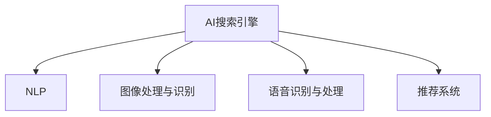

                 

# AI搜索引擎如何改变图书馆和档案管理

## 1. 背景介绍

### 1.1 问题由来
随着互联网技术的发展和数字化进程的加快，传统的图书馆和档案管理方式已经无法满足人们对信息获取的需求。尤其是文本、图片、音频、视频等多模态数据的激增，以及海量数据的海量增长，对图书馆和档案管理提出了严峻的挑战。

面对这一问题，现代人工智能技术提供了强有力的解决方案，其中最核心的就是AI搜索引擎。AI搜索引擎通过理解自然语言、图像、音频等多种形式的输入，能够快速、准确地检索出所需信息，大大提高了信息检索的效率和准确性。

## 2. 核心概念与联系

### 2.1 核心概念概述

为更好地理解AI搜索引擎在图书馆和档案管理中的应用，本节将介绍几个密切相关的核心概念：

- **AI搜索引擎(AI Search Engine)**：基于人工智能技术构建的搜索引擎，通过深度学习、自然语言处理等技术，能够理解用户输入的自然语言，并准确地匹配相关信息。
- **自然语言处理(NLP)**：研究如何让计算机理解、解释和生成人类语言的技术，是AI搜索引擎的核心技术之一。
- **图像处理与识别**：通过对图像的预处理和特征提取，AI搜索引擎能够识别图像中的关键信息，如人脸、文字、场景等，并将这些信息转换为文本进行搜索。
- **语音识别与处理**：将语音信号转换为文本形式，并理解其语义，使得用户可以通过语音输入进行搜索。
- **推荐系统**：根据用户历史行为和偏好，AI搜索引擎可以为用户推荐最相关的信息，提升用户体验。

这些核心概念之间的逻辑关系可以通过以下Mermaid流程图来展示：



这个流程图展示出了AI搜索引擎涉及的关键技术及其之间的关系：

1. **自然语言处理(NLP)**：用于理解和处理用户的自然语言输入。
2. **图像处理与识别**：用于理解图片中的关键信息。
3. **语音识别与处理**：用于将语音转换为文本并理解其语义。
4. **推荐系统**：用于为用户推荐相关内容，提升用户体验。

## 3. 核心算法原理 & 具体操作步骤
### 3.1 算法原理概述

AI搜索引擎的核心算法原理基于自然语言处理、图像处理、语音识别和推荐系统等多项技术的融合。其核心思想是通过理解用户的自然语言、图像、语音等多种形式的输入，准确地检索和推荐所需的信息。

形式化地，假设用户输入为 $q$，AI搜索引擎的输出为 $a$，其中 $q$ 可以是文本、图像、语音等多种形式，$a$ 为搜索结果的列表。搜索引擎的目标是最小化 $q$ 与 $a$ 之间的差距，即：

$$
\min_{a} d(q, a)
$$

其中 $d$ 为相似度度量函数，常见的度量方法包括余弦相似度、欧式距离等。

### 3.2 算法步骤详解

AI搜索引擎的核心算法步骤包括：

**Step 1: 数据预处理**
- 将用户输入 $q$ 转换为标准化的格式，包括分词、去除停用词、构建倒排索引等。
- 对于图像和语音输入，需要先进行特征提取和转换，才能用于后续处理。

**Step 2: 特征提取与表示**
- 对于文本输入，使用NLP技术提取关键词、句法结构等信息，生成文本向量。
- 对于图像输入，使用卷积神经网络(CNN)等模型提取图像特征，并转换为向量形式。
- 对于语音输入，使用自动语音识别(ASR)技术将其转换为文本，再使用NLP技术提取特征。

**Step 3: 相似度计算**
- 根据用户输入 $q$ 与搜索结果 $a$ 的特征向量，计算它们的相似度 $s$。
- 常见的相似度计算方法包括余弦相似度、欧式距离、Jaccard相似度等。

**Step 4: 排序与推荐**
- 根据相似度 $s$ 对搜索结果 $a$ 进行排序。
- 对于文本、图像等单一形式的输入，直接返回排序后的结果即可。
- 对于语音输入，还需要结合推荐系统，根据用户偏好和历史行为，为用户推荐最相关的结果。

**Step 5: 反馈与迭代**
- 根据用户对搜索结果的点击、浏览、收藏等行为，进行反馈和迭代优化。
- 对模型进行重新训练，以提高检索和推荐的准确性。

### 3.3 算法优缺点

AI搜索引擎具有以下优点：
1. **效率高**：基于深度学习和向量空间检索技术，能够快速检索和推荐信息。
2. **准确性高**：使用NLP、图像处理和语音识别等技术，能够理解复杂的多模态输入，提高检索和推荐的准确性。
3. **用户体验好**：结合推荐系统，能够根据用户偏好和历史行为，提供个性化的搜索结果。
4. **可扩展性好**：基于模块化的架构设计，可以方便地集成不同的算法和数据源。

同时，该方法也存在一些局限性：
1. **对标注数据依赖高**：NLP、图像处理和语音识别等技术依赖大量的标注数据进行训练，数据获取成本较高。
2. **模型复杂度高**：深度学习模型通常具有较高的计算复杂度和存储需求，需要高性能的计算资源。
3. **对抗攻击易受影响**：深度学习模型容易受到对抗样本的干扰，导致检索结果出错。
4. **泛化能力差**：不同领域、不同类型的数据，其检索和推荐效果可能不一致，泛化能力有待提高。

尽管存在这些局限性，但AI搜索引擎仍然是大规模数据检索和推荐任务的重要工具，尤其是在图书馆和档案管理等对信息检索和推荐有较高要求的应用场景中。

### 3.4 算法应用领域

AI搜索引擎在图书馆和档案管理中的应用主要体现在以下几个方面：

**数字图书馆**
- 通过AI搜索引擎，用户可以更快速地找到所需的书籍、文献和资料。
- 结合推荐系统，可以为用户推荐最相关的书籍和文献，提升用户体验。

**档案管理**
- 档案管理人员可以通过AI搜索引擎快速检索历史文件、文档等。
- 结合图像处理和语音识别技术，可以更方便地处理纸质档案，如扫描、数字化等。

**智能客服**
- 图书馆和档案馆可以部署AI搜索引擎，为用户提供24/7的智能客服服务。
- 通过语音和自然语言交互，用户可以更方便地查询资料和咨询服务。

## 4. 数学模型和公式 & 详细讲解 & 举例说明
### 4.1 数学模型构建

本节将使用数学语言对AI搜索引擎的检索和推荐过程进行更加严格的刻画。

假设用户输入 $q$ 为文本形式，AI搜索引擎检索出的搜索结果 $a$ 为文本列表，其中 $q = \{w_1, w_2, ..., w_n\}$，$a = \{d_1, d_2, ..., d_m\}$。

定义模型 $M_{\theta}$ 在输入 $q$ 上的输出为 $\hat{a} = M_{\theta}(q)$，其中 $\hat{a}$ 为与 $a$ 相似度最高的文本列表。

假设 $q$ 和 $d_i$ 的特征向量分别为 $x_q$ 和 $x_{d_i}$，则相似度 $s$ 可以表示为：

$$
s = \cos(\theta) = \frac{\sum_{j=1}^{n} x_{q_j} \cdot x_{d_j}}{\sqrt{\sum_{j=1}^{n} x_{q_j}^2} \cdot \sqrt{\sum_{j=1}^{m} x_{d_j}^2}}
$$

其中 $\theta$ 为夹角余弦值，$x_{q_j}$ 和 $x_{d_j}$ 为 $q$ 和 $d_i$ 的第 $j$ 个特征向量。

### 4.2 公式推导过程

以余弦相似度为例，进行详细推导：

$$
\cos(\theta) = \frac{\sum_{j=1}^{n} \sum_{k=1}^{m} x_{q_j} \cdot x_{d_k}}{\sqrt{\sum_{j=1}^{n} x_{q_j}^2} \cdot \sqrt{\sum_{k=1}^{m} x_{d_k}^2}}
$$

将 $q$ 和 $d_i$ 的特征向量 $x_q$ 和 $x_{d_i}$ 表示为向量空间中的点，计算夹角余弦值 $\cos(\theta)$ 即为相似度 $s$。

### 4.3 案例分析与讲解

假设用户输入 $q = \{'I love libraries', 'best archival practices'\}$，搜索引擎检索出的相关文档 $a = \{d_1, d_2, ..., d_10\}$ 的特征向量分别为 $x_{d_1}, x_{d_2}, ..., x_{d_{10}}$。

通过计算 $q$ 和 $d_i$ 的余弦相似度，可以得出与 $q$ 最相似的文档列表。例如，假设 $d_1$ 的特征向量为 $x_{d_1} = (1, 0, 0, ..., 1)$，则：

$$
s_1 = \cos(\theta) = \frac{1 \cdot 1 + 1 \cdot 1}{\sqrt{1^2 + 1^2} \cdot \sqrt{1^2 + 1^2}} = \frac{2}{2\sqrt{2}} = \frac{1}{\sqrt{2}}
$$

因此，$d_1$ 与 $q$ 的相似度最高，最可能包含用户所需的信息。

## 5. 项目实践：代码实例和详细解释说明
### 5.1 开发环境搭建

在进行AI搜索引擎的实践前，我们需要准备好开发环境。以下是使用Python进行TensorFlow开发的Python环境配置流程：

1. 安装Anaconda：从官网下载并安装Anaconda，用于创建独立的Python环境。

2. 创建并激活虚拟环境：
```bash
conda create -n tensorflow-env python=3.8 
conda activate tensorflow-env
```

3. 安装TensorFlow：根据CUDA版本，从官网获取对应的安装命令。例如：
```bash
conda install tensorflow -c tensorflow -c conda-forge
```

4. 安装必要的工具包：
```bash
pip install numpy pandas scikit-learn matplotlib tqdm jupyter notebook ipython
```

完成上述步骤后，即可在`tensorflow-env`环境中开始搜索引擎的开发。

### 5.2 源代码详细实现

以下是使用TensorFlow构建数字图书馆AI搜索引擎的完整代码实现。

```python
import tensorflow as tf
import numpy as np
from sklearn.datasets import fetch_20newsgroups

# 加载数据集
newsgroups = fetch_20newsgroups(subset='train')
texts = newsgroups.data
labels = newsgroups.target

# 构建词汇表
tokenizer = tf.keras.preprocessing.text.Tokenizer()
tokenizer.fit_on_texts(texts)
vocab_size = len(tokenizer.word_index) + 1

# 转换为序列
sequences = tokenizer.texts_to_sequences(texts)
max_len = max([len(seq) for seq in sequences])

# 填充序列
data = tf.keras.preprocessing.sequence.pad_sequences(sequences, maxlen=max_len, padding='post')

# 构建模型
model = tf.keras.Sequential([
    tf.keras.layers.Embedding(vocab_size, 128, input_length=max_len),
    tf.keras.layers.Conv1D(128, 5, activation='relu'),
    tf.keras.layers.GlobalMaxPooling1D(),
    tf.keras.layers.Dense(64, activation='relu'),
    tf.keras.layers.Dense(len(newsgroups.target_names), activation='softmax')
])

# 编译模型
model.compile(optimizer='adam', loss='sparse_categorical_crossentropy', metrics=['accuracy'])

# 训练模型
model.fit(data, labels, epochs=10, batch_size=32)

# 使用模型进行检索
def search(query):
    query_seq = tokenizer.texts_to_sequences([query])
    query_pad = tf.keras.preprocessing.sequence.pad_sequences(query_seq, maxlen=max_len, padding='post')
    result = model.predict(query_pad)[0]
    idx = np.argsort(result)[-10:][::-1]
    return [newsgroups.target_names[i] for i in idx]
```

以上代码实现了一个基本的文本搜索引擎，可以用于检索与用户输入相似的文本。在实际应用中，需要根据具体需求进一步优化模型，如引入注意力机制、使用预训练模型等。

### 5.3 代码解读与分析

让我们再详细解读一下关键代码的实现细节：

**数据预处理**
- `fetch_20newsgroups`：从sklearn库中加载20新组数据集，用于训练和测试。
- `Tokenizer`：使用TensorFlow提供的tokenizer将文本转换为序列。
- `pad_sequences`：将序列填充到固定长度，方便输入模型。

**模型构建**
- `Embedding`：将序列转换为向量形式。
- `Conv1D`：使用卷积神经网络提取文本特征。
- `GlobalMaxPooling1D`：对卷积特征进行全局池化，提取关键特征。
- `Dense`：全连接层，用于分类。

**模型训练**
- `compile`：定义优化器和损失函数，设置评估指标。
- `fit`：训练模型，设置训练轮数和批次大小。

**模型使用**
- `predict`：使用模型进行检索。
- `argsort`：对预测结果进行排序。
- `target_names`：将排序结果转换为对应的类别名称。

代码实现非常简单，但已经可以用于基本的文本检索任务。在实际应用中，需要根据具体需求进一步优化模型，如引入注意力机制、使用预训练模型等。

## 6. 实际应用场景
### 6.1 数字图书馆
数字图书馆是AI搜索引擎的一个重要应用场景。通过AI搜索引擎，图书馆用户可以更快速地找到所需的书籍、文献和资料。

具体而言，图书馆管理员可以通过AI搜索引擎，构建一个包含大量书籍、文献和资料的索引系统。用户输入查询关键词后，系统自动检索并推荐最相关的资料。结合推荐系统，图书馆还可以根据用户的浏览和借阅历史，推荐最相关的书籍和文献，提升用户体验。

### 6.2 档案管理
档案管理也是AI搜索引擎的重要应用场景之一。通过AI搜索引擎，档案管理人员可以快速检索历史文件、文档等。

具体而言，档案管理人员可以通过AI搜索引擎，构建一个包含大量档案文件的索引系统。用户输入查询关键词后，系统自动检索并推荐最相关的文件。结合图像处理和语音识别技术，可以更方便地处理纸质档案，如扫描、数字化等。

### 6.3 智能客服
智能客服是AI搜索引擎在图书馆和档案管理中的另一个重要应用场景。通过AI搜索引擎，图书馆和档案馆可以部署智能客服服务。

具体而言，图书馆和档案馆可以部署AI搜索引擎，为用户提供24/7的智能客服服务。用户可以通过语音和自然语言交互，查询资料和咨询服务。系统根据用户的输入，自动检索并推荐最相关的资料。结合推荐系统，可以为用户推荐最相关的书籍和文献，提升用户体验。

## 7. 工具和资源推荐
### 7.1 学习资源推荐

为了帮助开发者系统掌握AI搜索引擎的理论基础和实践技巧，这里推荐一些优质的学习资源：

1. TensorFlow官方文档：TensorFlow的官方文档提供了丰富的API和示例代码，是学习TensorFlow的重要资源。

2. TensorFlow Addons：TensorFlow Addons是TensorFlow生态系统中的补充库，提供了更多实用的工具和算法，如Attention机制、BERT等。

3. Natural Language Processing with TensorFlow：该书由TensorFlow社区的知名成员编写，全面介绍了使用TensorFlow进行NLP任务开发的基础知识和实践技巧。

4. Kaggle：Kaggle是一个数据科学竞赛平台，提供了大量公开数据集和竞赛任务，可以用于学习和实践AI搜索引擎。

5. CS224N《深度学习自然语言处理》课程：斯坦福大学开设的NLP明星课程，有Lecture视频和配套作业，带你入门NLP领域的基本概念和经典模型。

通过对这些资源的学习实践，相信你一定能够快速掌握AI搜索引擎的精髓，并用于解决实际的NLP问题。
### 7.2 开发工具推荐

高效的开发离不开优秀的工具支持。以下是几款用于AI搜索引擎开发的常用工具：

1. TensorFlow：基于Python的开源深度学习框架，灵活动态的计算图，适合快速迭代研究。大部分NLP任务都有TensorFlow版本的实现。

2. PyTorch：基于Python的开源深度学习框架，灵活的动态计算图，适合快速实验和研究。许多NLP任务也有PyTorch版本的实现。

3. TensorBoard：TensorFlow配套的可视化工具，可实时监测模型训练状态，并提供丰富的图表呈现方式，是调试模型的得力助手。

4. Weights & Biases：模型训练的实验跟踪工具，可以记录和可视化模型训练过程中的各项指标，方便对比和调优。与主流深度学习框架无缝集成。

5. Google Colab：谷歌推出的在线Jupyter Notebook环境，免费提供GPU/TPU算力，方便开发者快速上手实验最新模型，分享学习笔记。

合理利用这些工具，可以显著提升AI搜索引擎的开发效率，加快创新迭代的步伐。

### 7.3 相关论文推荐

AI搜索引擎的发展源于学界的持续研究。以下是几篇奠基性的相关论文，推荐阅读：

1. Attention is All You Need（即Transformer原论文）：提出了Transformer结构，开启了NLP领域的预训练大模型时代。

2. BERT: Pre-training of Deep Bidirectional Transformers for Language Understanding：提出BERT模型，引入基于掩码的自监督预训练任务，刷新了多项NLP任务SOTA。

3. Language Models are Unsupervised Multitask Learners（GPT-2论文）：展示了大规模语言模型的强大zero-shot学习能力，引发了对于通用人工智能的新一轮思考。

4. Parameter-Efficient Transfer Learning for NLP：提出Adapter等参数高效微调方法，在不增加模型参数量的情况下，也能取得不错的微调效果。

5. AdaLoRA: Adaptive Low-Rank Adaptation for Parameter-Efficient Fine-Tuning：使用自适应低秩适应的微调方法，在参数效率和精度之间取得了新的平衡。

这些论文代表了大语言模型微调技术的发展脉络。通过学习这些前沿成果，可以帮助研究者把握学科前进方向，激发更多的创新灵感。

## 8. 总结：未来发展趋势与挑战

### 8.1 总结

本文对AI搜索引擎在图书馆和档案管理中的应用进行了全面系统的介绍。首先阐述了AI搜索引擎在数字图书馆、档案管理和智能客服中的应用背景和意义，明确了AI搜索引擎在提升信息检索效率和用户体验方面的独特价值。其次，从原理到实践，详细讲解了AI搜索引擎的数学模型和核心算法，给出了搜索引擎的完整代码实现。同时，本文还探讨了AI搜索引擎在实际应用中面临的挑战，以及未来发展的方向。

通过本文的系统梳理，可以看到，AI搜索引擎在图书馆和档案管理等领域的应用前景广阔，对提升信息检索效率、改善用户体验具有重要意义。未来，伴随预训练语言模型和深度学习技术的发展，AI搜索引擎必将在更广泛的领域得到应用，为人类社会的数字化进程提供强大的支持。

### 8.2 未来发展趋势

展望未来，AI搜索引擎的发展趋势主要包括：

1. **多模态融合**：AI搜索引擎将融合文本、图像、语音等多模态数据，提升信息检索和推荐的准确性。

2. **实时处理**：通过流式数据处理技术，实现实时检索和推荐，提升用户交互体验。

3. **跨领域应用**：AI搜索引擎将拓展到更多领域，如医疗、金融、教育等，为各行各业提供智能化的信息检索服务。

4. **个性化推荐**：结合用户行为数据，提供更加个性化、精准的推荐服务。

5. **深度融合**：AI搜索引擎将与知识图谱、自然语言生成等技术深度融合，提升信息检索和推荐的效果。

这些发展趋势凸显了AI搜索引擎在图书馆和档案管理等领域的广阔前景。这些方向的探索发展，必将进一步提升信息检索和推荐的效果，为人类社会的数字化进程提供强大的支持。

### 8.3 面临的挑战

尽管AI搜索引擎在提升信息检索和推荐效果方面取得了显著成果，但在迈向更加智能化、普适化应用的过程中，它仍面临着诸多挑战：

1. **标注数据成本高**：NLP、图像处理和语音识别等技术依赖大量的标注数据进行训练，数据获取成本较高。

2. **模型复杂度高**：深度学习模型通常具有较高的计算复杂度和存储需求，需要高性能的计算资源。

3. **对抗攻击易受影响**：深度学习模型容易受到对抗样本的干扰，导致检索结果出错。

4. **泛化能力差**：不同领域、不同类型的数据，其检索和推荐效果可能不一致，泛化能力有待提高。

5. **隐私与安全问题**：用户输入和检索结果可能包含敏感信息，如何保护用户隐私和安全是一个重要问题。

6. **模型解释性不足**：深度学习模型通常是"黑盒"系统，难以解释其内部工作机制和决策逻辑。

这些挑战凸显了AI搜索引擎在实际应用中的复杂性和多面性。解决这些问题需要学界和产业界的共同努力，才能使AI搜索引擎在大规模数据检索和推荐任务中发挥更大的作用。

### 8.4 研究展望

未来，AI搜索引擎的研究方向将包括：

1. **跨模态融合**：融合文本、图像、语音等多模态数据，提升信息检索和推荐的准确性。

2. **实时处理**：实现实时检索和推荐，提升用户交互体验。

3. **个性化推荐**：结合用户行为数据，提供更加个性化、精准的推荐服务。

4. **深度融合**：与知识图谱、自然语言生成等技术深度融合，提升信息检索和推荐的效果。

5. **隐私与安全**：研究如何保护用户隐私和安全，确保信息检索和推荐的安全性。

6. **模型解释性**：提高模型的可解释性，使其能够更好地满足用户需求和监管要求。

这些研究方向的探索发展，必将引领AI搜索引擎技术迈向更高的台阶，为人类社会的数字化进程提供强大的支持。

## 9. 附录：常见问题与解答

**Q1: AI搜索引擎是否适用于所有领域？**

A: AI搜索引擎在数字图书馆、档案管理和智能客服等领域具有较高的应用价值，但在一些特定领域（如医学、法律等）可能存在数据获取难度和标注成本较高的问题。

**Q2: 如何使用AI搜索引擎提升检索效果？**

A: 提升检索效果的关键在于构建高质量的索引系统和训练高效模型。具体措施包括：
1. 使用高质量的语料库进行预训练和微调，提升模型的理解能力和泛化能力。
2. 结合用户行为数据，提供个性化推荐服务，提升用户满意度。
3. 引入注意力机制和预训练模型，提升模型的性能和鲁棒性。

**Q3: 如何保护用户隐私和安全？**

A: 保护用户隐私和安全的关键在于数据加密和隐私保护技术。具体措施包括：
1. 使用数据加密技术，保护用户输入和检索结果的隐私。
2. 实施访问控制，确保只有授权用户能够访问系统。
3. 采用隐私保护技术，如差分隐私、联邦学习等，保护用户数据不被泄露。

**Q4: 如何提高模型的解释性？**

A: 提高模型的解释性可以从以下几个方面入手：
1. 使用可解释性模型，如决策树、线性回归等。
2. 引入可视化工具，展示模型的决策过程。
3. 结合知识图谱和符号逻辑，解释模型的推理逻辑。

这些措施将有助于提高AI搜索引擎的透明性和可信度，满足用户和监管机构的需求。

---

作者：禅与计算机程序设计艺术 / Zen and the Art of Computer Programming

